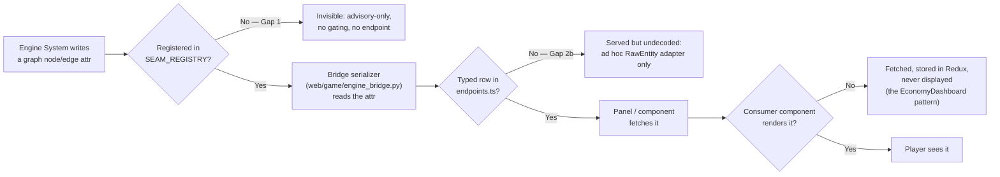
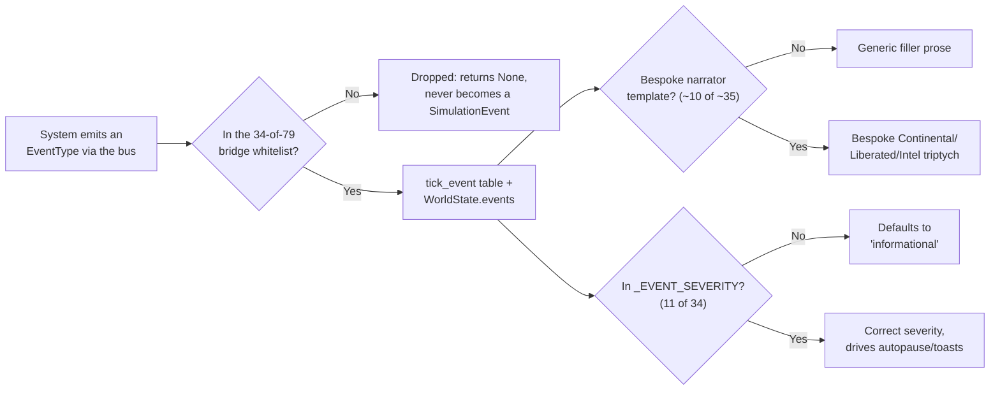
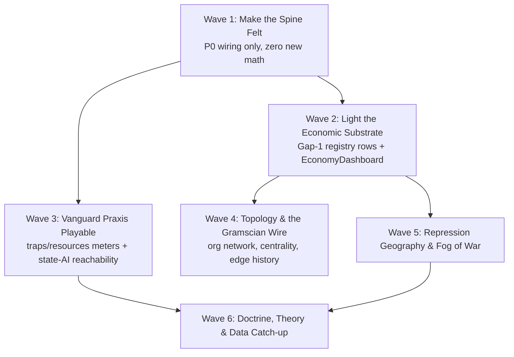

# Epochs Vision Gap Audit

**Branch:** `feature/17-living-engine` · **Date:** 2026-07-14 · **Scope:** every item in `ai/epochs/` (4 epochs) and `ai/brainstorms/` (2 corpora) cross-joined against current code, via 12 verified evidence bundles (373 items) and 5 reality maps (engine, event pipeline, sentinel rails, frontend, data availability).

**Purpose:** the owner's standing claim is *"the vision in ai/epochs/ is fundamentally the vision of where I want this game to go, and I don't see a lot of that reflected in our game."* This report tests that claim against code, item by item, and turns the result into a working backlog. The epochs corpus is an **early incarnation** — file paths and class names in it are frequently stale — so every row below evaluates the *mechanic*, not the literal code the corpus describes.

---

## 1. Executive Summary

Across the 373 catalogued vision items, hand-tallied from the 12 evidence bundles:

| Status | Count | Share | What it means here |
|---|---|---|---|
| **BUILT** | ~43 | ~12% | Live, reaches the player today, matches the vision's intent |
| **PARTIAL** | ~177 | ~47% | **The headline bucket.** Engine/data already computes the mechanic — it just never reaches the screen |
| **MISSING** | ~139 | ~37% | No engine code, no data, nothing to wire — real unstarted work |
| **SUPERSEDED** | ~14 | ~4% | A later, owner-ratified decision replaced the vision's specific mechanic with a different one that serves the same intent — do not rebuild the original |

**The honest headline:** the owner is right that little of the epochs *feel* is showing up in play, but wrong about why. Reading the code says the mechanics are mostly already there — PARTIAL outnumbers MISSING nearly 1.3:1. The George Jackson power-vacuum bifurcation, the Fascist Bifurcation routing, the Vanguard Resource Triad (Cadre/Sympathizer/Reputation labor), the Ideological Trap Detectors (Liberal/Ultra-Left/Rightist), the four-phase terminal crisis cascade, dispossession events, reserve-army wage pressure, the credit-cycle phase machine, the disproportionality-crisis detector — all of this is real, tested, tick-by-tick code. Almost none of it reaches a screen. The reasons repeat across dozens of unrelated items: an `EventType` gets emitted and silently dropped at a 34-of-79 whitelist boundary in the bridge; a graph attribute gets computed every tick and never registered in `SEAM_REGISTRY`; a serializer exists but has no typed TypeScript contract so nothing renders it; a dependency-injected calculator (counter-tendency, class-transition stationary distribution, the rule-based State AI) is constructed and then never called by any System. This is the exact "neglected seam" thesis the project's own 2026-07-12 consolidation report already named — this audit is the first attempt to size it against the full epochs corpus rather than against the current codebase's self-description.

**Where the true MISSING mass sits** (the 37% that is real, unstarted work, not a wiring problem): three programs absorb most of it. (1) **The entire Doctrine/Theoretical-Labor/ideological-DAG layer** (epoch3-player) — no doctrine node model, no TL resource, no branching trunks anywhere in the tree; this is the single largest coherent MISSING cluster. (2) **Repression-apparatus reachability** — Feature-039's State AI, Attention Threads, and Legal Frameworks are real, non-trivial code that has *never once executed in a real playthrough* because every entry point is gated on an org attribute (`faction_balance`) that no scenario ever sets; this reads as "missing" in play even though the code exists. (3) **Whole real-world data programs** that were never rebuilt after spec-037 deleted ~25 loaders in one commit (`4ce7c96a`) — 13 Census ACS demographic tables, FAF5 freight, HIFLD/MIRTA carceral-and-military geography are all schema-only, zero consumer, zero loader.

**What SUPERSEDED means here:** these are not gaps. They are cases where the owner (or a later spec) already made a *different, equally valid* concrete decision that serves the same thematic intent as the epochs item — e.g., the ratified "Installer"/ksbc palette instead of "Bunker Constructivism," the real per-county Leontief Φ map as the default lens instead of an abstract 4-node circuit diagram, `DecompositionSystem`'s live 30/70 class split instead of a scripted proletarianization event. Building the epochs' original version of these would be regressive, not additive — see §6.

---

## 2. The Vision Spine

The epochs corpus imagines the player as a **Synopticon decoder, not a god** — someone who reads a fractured multi-channel wire (corporate press vs. liberated signal vs. state intelligence) to understand a class war they can nudge but never command outright, acting *through* an Organization rather than as an omniscient hand. Underneath that reading experience sits a hard **tensor/value substrate** — MELT, imperial rent, the Leontief input-output lattice, Φ-per-labor-hour — so that every wage, every extraction, every eviction is traceable to a material relation, never a scripted event. **Doctrine and strategy** are meant to be a real axis of play: a branching ideological DAG (Reformist / Insurrectionist / Autonomist / Scientific-Leninist trunks), a cadre-vs-mass resource economy (Cadre Labor / Sympathizer Labor / Reputation / Theoretical Labor), and named strategic traps (Liberal capture, Ultra-Left isolation, Rightist passivity) that punish bad praxis as concretely as bad economics punishes bad policy. **Repression is meant to be a geography, not a stat** — carceral sinks (reservations, penal colonies, concentration camps), a state apparatus that spends a finite pool of "attention threads" on surveillance and must choose what to watch, and a **fog of class war** where intel about hostile territory is unreliable by design. **Metabolic and imperial circuits are twinned engines of the same collapse**: the Fundamental Theorem's Imperial Rent siphons periphery value into Core wages, while an independent ecological ledger (biocapacity, hysteresis, overshoot) can bankrupt the whole system even if the class war is "won" — the corpus's signature trap of winning the revolution while losing the planet (or vice versa, the Red Settler Trap). **Balkanization is the intended endgame architecture**: sovereignty as a claims-overlay on an immutable hex substrate, collapsing into several named, materially distinct terminal states rather than one win/lose binary. Above all, every one of these systems is meant to be legible through a **Gramscian wire** — a narrator that decodes propaganda into material meaning term-by-term — so the player's felt experience is "the mask is coming off," not "a stat went up."

---

## 3. Status Ledger

One sub-table per evidence bundle, grouped by epoch. **Every row from every bundle is kept** — this is the working backlog, not a curated sample. Priority (Pri) and Status are as given by the bundle evidence, with verifier-corrected statuses applied where the bundle's own adversarial verification pass demoted a claim (e.g. `BUILT→PARTIAL` where code exists but is provably never invoked in a real playthrough).

### Epoch 1 (92 items)

Epoch 1 is the corpus's foundational layer: the four-node imperial circuit, solidarity/consciousness/bifurcation mechanics, the metabolic rift, the carceral necropolitical triad, and the core wire/inspection UI shell.

#### 1a. Core Mechanics — `epoch1-core` (33 items)

| Item | Status | Pri | Wiring path (short) | Frontend proposal (short) |
|---|---|---|---|---|
| Four-node Imperial Circuit | PARTIAL | P0 | SocialRole + ImperialRentSystem's 5-phase circuit live; node/edge inspectors are generic dumps | Imperial Circuit mini-Sankey in the class InspectionCard from existing edge value_flow |
| Solidarity as buildable/breakable edge | PARTIAL | P1 | solidarity_strength live, is a MUST_BE_LIVE map lens; no verb writes it | "Build Solidarity" verb target that writes SOLIDARITY edge weight |
| Multi-dimensional consciousness | PARTIAL | P0 | class_consciousness/national_identity in node inspector; atomization is global-only | Add atomization as a 3rd ValueRow on the class card |
| The Fascist Bifurcation | PARTIAL | P0 | route_agitation_to_ternary runs live every tick; only generic event narration | Bespoke MASS_AWAKENING/FASCIST_DRIFT templates + agitation-split breakdown |
| Bourgeoisie strategic choice | PARTIAL | P1 | calculate_bourgeoisie_decision live; only the CRISIS branch emits any event | Informational event for BRIBERY/AUSTERITY/IRON_FIST + a posture badge |
| Falling rate of bribery / rent pool | PARTIAL | P1 | imperial_rent_pool tracked + honestly serialized already | Build the missing EconomyDashboard panel (data is ready) |
| Imperial client-state subsidy | PARTIAL | P1 | CLIENT_STATE "Iron Lung" mechanic live; generic edge/event treatment | Dashed-gold edge style + bespoke IMPERIAL_SUBSIDY template |
| Metabolic rift / biocapacity | PARTIAL | P0 | MetabolismSystem computes it; ECOLOGICAL_OVERSHOOT dropped at bridge; raw biocapacity never hex-aggregated | Wire biocapacity into the hex aggregator, or retire the phantom TS field |
| Hysteresis (permanent ecological damage) | MISSING | P1 | max_biocapacity is never decremented anywhere | Needs an engine-side ratchet formula first |
| Ecological overshoot forces political choice | PARTIAL | P2 | overshoot event dropped; necropolitics runs on an unrelated independent trigger | Needs a shared trigger connecting the two halves |
| Metabolic dashboard visualizations | SUPERSEDED | P2 | live habitability MAP lens + StatChips replace bespoke gauges | None — intentional substitution |
| S_bio vs S_class per class | PARTIAL | P1 | consumed by Vitality/Metabolism math; never serialized to the frontend | Add as two ValueRows via the existing BreakdownBar |
| Narrative vocab discipline (eco/demo) | PARTIAL | P3 | clean where present; nothing to discipline since overshoot never reaches the wire | Write vocabulary once item 10 lands |
| OGV/OPC/Frontier taxonomy | PARTIAL | P2 | only a flat 5-value territory_type exists, no 3-part settler taxonomy | Lens the existing 5-value type categorically as an interim step |
| Volksgemeinschaft as material category | MISSING | P3 | zero hits beyond a naming comment | — |
| Bifurcation routing differs by territory type | MISSING | P2 | routing formula takes no territory_type parameter | Needs an engine formula change |
| PPW campaign structure (Coalescence→Purge→Stages→Victory) | MISSING | P3 | no phase state machine anywhere | — |
| The Purge (coalescence pass/fail test) | MISSING | P3 | only an unrelated offline resilience metric exists | Needs item 17 first |
| Liberalism as decaying condition, not a faction | SUPERSEDED | P3 | a real seeded FAC_LIBERAL_IMPERIAL faction occupies this space instead | None — already visible in Outliner/map |
| Named multiple failure/defeat states | SUPERSEDED | P3 | 5 real EndgameDetector outcomes already deliver this | None — could reflavor copy only |
| Indigenous resistance track | MISSING | P3 | only a reference-DB boolean column, no mechanic | — |
| Liberal-institutions-as-terrain / internal contradictions | MISSING | P3 | Institution model exists but is unpublished by any System | — |
| Agent-as-Block population model | BUILT | P1 | population is a real field, live MAP lens, in the node inspector | Promote population to a headline number on the class card |
| Intra-class inequality (Gini) | PARTIAL | P1 | drives real mortality math; absent from inspector/serializers | Add as a ValueRow, tooltip: "raises the survival bar" |
| Grinding attrition / Malthusian equilibrium | PARTIAL | P1 | mortality math is real; POPULATION_ATTRITION/ENTITY_DEATH dropped at bridge | Whitelist + bespoke attrition narrator template |
| Population-scaled economic systems | BUILT | P2 | production/consumption/survival all scale by population, verified live | None required beyond items above |
| Necropolitical Triad (Reservation/Penal/Camp) | BUILT | P0 | 3 real effects live every tick; territory_type not player-visible anywhere | Add a categorical territory_type map lens |
| Displacement pipeline | BUILT | P1 | real eviction→sink transfer; population vanishes with no connected sink (not pure transfer) | Transient flow-arc from evicted to receiving territory |
| Dynamic displacement priority modes | PARTIAL | P2 | 4 modes defined; engine reads an unset context field, always defaults EXTRACTION | Regime-posture badge once actually wired |
| Liberation mechanics (sinks→liberated) | MISSING | P3 | explicitly future-scoped in the source vision, no reversal logic | — |
| Reproductive/care labor as biocapacity restoration | MISSING | P3 | regeneration_rate is a fixed coefficient, no labor modifier | — |
| Migration between territories | MISSING | P3 | only an exception-class docstring, no logic | — |
| Warfare/climate as future threats | MISSING | P3 | no combat or climate system exists | — |

#### 1b. Player Experience — `epoch1-player` (23 items)

| Item | Status | Pri | Wiring path (short) | Frontend proposal (short) |
|---|---|---|---|---|
| George Floyd Dynamic (spark→uprising) | BUILT | P0 | full spark→uprising→narration→map pipeline live | Pre-spark tension affordance; distinct urgent-toast tier |
| Solidarity-through-struggle feedback | PARTIAL | P1 | rich payload computed; SOLIDARITY_SPIKE generic+informational, no edge-history UI | Bespoke template + Wave-2 edge-weight sparkline |
| Crisis bifurcation (revolution vs fascism) | PARTIAL | P0 | ternary routing live + in node inspector; no forward-looking framing widget | Ideology section: consciousness-vs-national_identity two-pole bar |
| Class-differentiated agency | BUILT | P1 | role-gated uprising eligibility, dominant_class lens, event drill-through all live | Add p_acquiescence/p_revolution to the class card |
| Bunker control-room dashboard aesthetic | SUPERSEDED | P3 | ratified Installer/ksbc skin delivers the same felt intent | None needed |
| Live telemetry & simulation control panel | PARTIAL | P1 | TopBar+SpeedControls live; economy panel has zero consumer | Build EconomyDashboard; add a per-class wealth series |
| Color-coded event log / taxonomy | PARTIAL | P2 | 3-bucket severity live via client classifier; no per-EventType icon/color | Add a per-EventType icon+color layer |
| Narrative feed + derived metrics panel | PARTIAL | P1 | narrator genuinely live; no compact Vitals/derived-metrics strip | Add a Vitals StatChip strip next to NarrationBlock |
| Metabolic/ecological overshoot gauge | PARTIAL | P1 | overshoot_ratio computed, event dropped at bridge entirely | Whitelist ECOLOGICAL_OVERSHOOT + a literal gauge |
| Doctrine tree (radial ideology viz) | MISSING | P3 | no doctrinal taxonomy model at all | Needs epoch3-player #1 (Doctrine DAG) first |
| Panopticon view (surveillance-eye map) | MISSING | P3 | repression_faced is real per-class, no map overlay | New "repression" map lens if revived |
| Crisis overlay (modal bifurcation display) | PARTIAL | P0 | CriticalEventModal already fires on RUPTURE via client classifier | Largely working; verify engine-side severity too |
| The Gloom (attention as scarce resource) | MISSING | P2 | zero fog-of-war/focus-radius mechanic anywhere | Buildable client-side only, no engine work needed |
| Interactive narrative warfare / War of Position | MISSING | P3 | no hegemony resource or propaganda verb; explicit future vision | Defer |
| Synopticon inversion (observer not controller) | PARTIAL | P1 | Wire/Inspection surfaces are pure-observer; ActionDock gives real org command | Owner ruling needed: reframe ActionDock as org-agency, not god-mode |
| The Lens (signal/noise, prism translation) | BUILT | P1 | euphemism/filter/note triples live for 3 bespoke events + PatternsPage | Extend the euphemism table beyond 3 event types |
| Signal degradation/clarity mechanic | MISSING | P2 | zero repression-gated info-fidelity system | New derived field + redaction renderer |
| CRT/interference visual effects | MISSING | P3 | depends on the clarity mechanic, which doesn't exist | Cosmetic once clarity lands |
| Archive/historical narrative query | PARTIAL | P2 | pgvector+RAG real, but queries static theory not playthrough history; flag-off | Needs a per-tick history embedding write-path |
| Alert level tiering (4-state) | PARTIAL | P2 | only a 3-bucket severity system; RUPTURE undercounted in one summary badge only | Accept 3-tier, or add a 4th RUPTURE-specific tier |
| Dual Narrative Display | BUILT | P0 | genuinely live deterministic narrator, 3-column triptych rendered | Extend bespoke templates beyond 3 of 34 event types |
| Per-channel aesthetic/linguistic differentiation | BUILT | P2 | 3 visually/structurally distinct components confirmed | None needed |
| Significant-event gating for narrative | BUILT | P2 | real 10-type SIGNIFICANT_EVENT_TYPES gate, wired but flag-off | None needed once BABYLON_LLM_NARRATOR is enabled |

#### 1c. Meta Systems — `epoch1-meta` (36 items)

| Item | Status | Pri | Wiring path (short) | Frontend proposal (short) |
|---|---|---|---|---|
| Watchable Crisis Timeline | PARTIAL | P1 | tick_crisis_phase/duration/bifurcation computed, unregistered | Crisis Phase StatChip + BottomDrawer phase indicator |
| Branching Endgame by Solidarity | BUILT | P1 | real FR-031a cross-divide solidarity gate; EndStateScreen renders it | Add solidarity_strength as an explicit stat card |
| Threshold-Triggered Narrative Events | PARTIAL | P0 | MASS_AWAKENING/RUPTURE reach wire; ECOLOGICAL_OVERSHOOT dropped | Whitelist + bespoke template + criticalPulse ping |
| Color-Coded Wealth Trajectory Chart | MISSING | P1 | wealth_by_class_role is a declared phantom, no per-class series | Fix Gap-3 phantom, extend Timeseries, build EconomyDashboard |
| Consciousness Gap Gauge | MISSING | P2 | no differential computed anywhere | New bridge-derived consciousness_gap row + StatChip |
| Tension & Metabolic Gauges | PARTIAL | P1 | heat/habitability live as map lenses only, no aggregate scalar | Add max_tension/total_biocapacity StatChips |
| Tragedy of Inevitability (long-run decline) | PARTIAL | P2 | no hard tick cap; no selectable campaign length or anti-pattern surface | Campaign-length field + decline-slope StatChip |
| Metabolic Hysteresis | MISSING | P1 | max_biocapacity never decremented (dup of core #9) | Engine-side ratchet + darker ceiling line |
| The Calorie Check (subsistence>0) | BUILT | P3 | real, enforced every tick by VitalitySystem | Optional tooltip only |
| Vanguard Resource Triad (Cadre/Sympathizer/Rep) | PARTIAL | P0 | CL/SL/REP computed + attached to every org snapshot; zero .tsx consumer | Vanguard section on the org InspectionCard |
| Ideological Trap Detectors | PARTIAL | P0 | 3 real traps computed + attached every tick; zero .tsx consumer | Strategic Warnings card in EventTray/Outliner |
| Organizational Cohesion Decay | PARTIAL | P2 | cohesion real + rendered; no entropy term, no min(solidarity,cohesion) cap | Engine-side formula work, not a wiring gap |
| Doctrine Tree/Theoretical Labor | MISSING | P2 | zero doctrine/TL model anywhere | Net-new feature |
| Chauvinism Risk (cross-class recruitment) | PARTIAL | P1 | real accrual formula; invisible per-org, coup event generic | Expose mean chauvinism stat + bump RED_BROWN_COUP severity |
| Hegemony Contest (info warfare) | MISSING | P2 | no tug-of-war narrative-dominance meter anywhere | New persistent state + Narrative War panel |
| State Attention Threads (DDoS the state) | PARTIAL | P1 | real Feature-039 thread allocation; all 6 related events dropped at bridge | Whitelist + saturation StatChip |
| Terrain-Graded Intel Confidence | MISSING | P3 | only the inverse (State's intel on player) exists | — |
| Kinetic Blowback Formula | MISSING | P2 | attack.py is one flat self-heat gain, no collateral/framing terms | Extend resolve_attack + predicted support-loss chip |
| Target-Type Strategic Tradeoff Matrix | MISSING | P3 | one verb, one flat effect regardless of target | — |
| Ultra-Left Deviation Ending | PARTIAL | P1 | SEVERE trap can end-game per docstring, never wired to EndgameDetector | Wire traps.game_over_trap to a 6th GameOutcome |
| Extraction-Rate Strategic Choice | PARTIAL | P2 | fixed GameDefines coefficient, not a player dial | Extraction-rate slider verb |
| Organization as Gate on Rational Revolution | BUILT | P2 | p_revolution/p_acquiescence real; Objective condition types exist | Polish: explicit threshold marker |
| Goldilocks Zone / Edge-of-Chaos tuning | MISSING | P3 | design philosophy only, dev-only tooling | — |
| Sudden Collapse Cliffs | PARTIAL | P0 | George Jackson power-vacuum bifurcation real; all 3 events dropped at bridge | Whitelist + bespoke Power Vacuum template + critical severity |
| 4-Class Circuit as Playable Core Loop | SUPERSEDED | P2 | superseded by the real per-county Φ map as default lens | Optional supplementary diagram only |
| Observer Dashboard as Kino-Eye/Mass-Line | BUILT | P3 | entire AppShell/takeover system realizes this concept | None — remaining gaps itemized elsewhere |
| Named Endgame Outcomes | BUILT | P3 | 5 real outcomes, EndStateScreen renders them | Polish: name the decisive AND-condition |
| Four-Phase Terminal Crisis Cascade | PARTIAL | P0 | all 4 stages real + wired; only 2/4 critical severity, zero bespoke templates | Bump severity + 4 bespoke templates |
| George Floyd Dynamic (dup) | BUILT | P3 | most fully realized vision item in the whole corpus | None |
| Carceral Geography (heat & eviction) | PARTIAL | P1 | heat is a live MAP lens; DISPOSSESSION_EVENT dropped, orphaned narrator template | Whitelist DISPOSSESSION_EVENT, wire the dead template |
| Theory-Grounded Mechanic Citations | MISSING | P2 | only developer-facing docstrings, no player-facing codex | Static JSON citation table in InspectionCard footer |
| Real-World Data Integration | PARTIAL | P1 | QCEW/BEA/TIGER wired; ~30/43 catalog sources orphaned | Data-layer work (Program 098), not a frontend fix |
| Balkanization/Territorial Fragmentation | BUILT | P2 | full faction/sovereignty/collapse system live with a faction map lens | SECESSION_DECLARED worth whitelisting for a toast |
| Demographics & Population Modeled Layer | PARTIAL | P2 | population is live; 13 Census ACS fact tables orphaned, no composition breakdown | Needs Census ACS loaders (Program 098) |
| AI Narrative Generation (The Archive) | PARTIAL | P1 | full pipeline real, flag-off by owner ruling D3 | Product decision, not a build |
| Multi-Scenario/Replay Platform Layer | PARTIAL | P2 | scenario-select real+playable; no external platform/API surface | Out of scope for UI; a docs/contract task |

### Epoch 2 (51 items)

Epoch 2 is the corpus's data-grounding and geography layer: real-world Census/QCEW/BEA integration, the continental H3 map, and the chart/dashboard vocabulary for reading it.

#### 2a. Data Integration — `epoch2-data` (28 items)

| Item | Status | Pri | Wiring path (short) | Frontend proposal (short) |
|---|---|---|---|---|
| Real-data scenario init w/ historical-year selection | MISSING | P1 | SCENARIO_CATALOG is 4 hand-authored scenarios, no year param anywhere | Year picker + real ScenarioLoader hydrating from Census/QCEW/BEA per year |
| Race-disaggregated class/wealth composition | MISSING | P1 | dim_race/race_id exist; both live readers SUM across all races, race-blind | Reader that GROUPs BY race_id + a race BreakdownBar |
| Indigenous/settler-colonial territory analysis | PARTIAL | P2 | TerritoryType computed but never rendered (dead in HexTooltip's own priority lists) | Add territory_type to a priority list or a dedicated lens |
| Metro-area regional aggregation/zoom | PARTIAL | P2 | msa/bea_ea framing silently collapses to one NULL bucket (dim_metro_area unwired) | Wire bridge_county_metro, or grey out the buttons honestly |
| Labor-aristocracy geography ("bomb factory towns") | PARTIAL | P1 | real super-wage mechanic exists, not gated by territory_type, no metro/income join | Categorical overlay once metro join lands |
| Agitation-vs-solidarity bifurcation loop (RPI) | PARTIAL | P0 | ideology.agitation computed live every tick; zero seam row, zero lens | New "agitation" map lens — highest-leverage single win in this bundle |
| Betrayed-middle-class/real-wage-ratio contradiction | MISSING | P2 | no real_wage_ratio term anywhere; rent stub never feeds consciousness | Status-contradiction flag once rent is genuinely wired |
| Military/federal presence as counter-rev modifier | MISSING | P1 | no military/federal data reaches repression_faced anywhere | Federal-stronghold badge once MIRTA data lands |
| Atomization index — renters vs owners | PARTIAL | P2 | real global atomization field exists; not per-territory, no renter/owner input | Per-territory value once housing data is wired |
| Production-worker concentration/strike leverage | MISSING | P2 | real QCEW NAICS data exists; no strike-effectiveness consumer | Organizing-leverage stat + strike-verb multiplier |
| Income inequality (top/bottom ratio) | MISSING | P2 | bracket data collapsed to SUM; gini table orphaned | New bracket-ratio reader + narrative event pool |
| Puerto Rico/internal-colony territory type | PARTIAL | P2 | same TerritoryType computed-but-never-rendered gap as item 3 | Same fix as item 3 |
| Stability Index — counter-rev stronghold score | MISSING | P1 | ingredients (tick_unemployment_rate etc.) computed, unregistered (Gap-1) | Composite formula + new "stability" lens |
| Organizing-target strategic overlay | MISSING | P1 | depends on items 8/9/10/11, all themselves MISSING | Do not build on placeholder data — wait for real inputs |
| Velvet glove liberalism/reformist capture | MISSING | P2 | reformist_drift field declared, zero System reads/writes it | Wire into OODA org-metabolism + an "NGO chapter" badge |
| Territory-to-game-field initialization mapping | PARTIAL | P2 | population has a real named transform; other 4 named fields don't exist | Not directly player-visible; fix employment "Fix C" placeholder instead |
| Coercive infrastructure feeding repression stats | MISSING | P1 | fact_coercive_infrastructure orphaned; ArcGIS config dead, test-only reference | Carceral-capacity badge once a real loader exists |
| Electric grid and broadband infrastructure layers | MISSING | P3 | R8 hex substrate slot exists but is unwired into the tick pipeline | Belongs to Program 16/17 Wave-2 topology work |
| Military installation geography (MIRTA) | MISSING | P2 | ArcGIS config constant only, no loader, no territory attribute | Static base-location pins once a real loader exists |
| Data provenance/source transparency | MISSING | P1 | dim_data_source exists, zero consumers anywhere | Source-citation footer on the shared InspectionCard shell |
| Honest missing-data representation | BUILT | P1 | NoDataSentinel + StatChip/InspectionCard honest-null rendering, deep pattern | None needed — the bar every other item should meet |
| Real-wage erosion via CPI-adjusted inflation | MISSING | P0 | fact_fred_national orphaned; tick_median_wage is nominal-only, no CPI step | 4th "real wages" line on the existing TimeseriesChart |
| Fiscal Trilemma/federal debt as class-conflict pressure | MISSING | P2 | no federal-debt series anywhere; tick_accumulated_debt is a different, firm-level concept | Debt-ceiling narrative event via the Wire, not a map lens |
| Financialization/overaccumulation indicator (M2 gap) | PARTIAL | P1 | tick_financialization_share/crisis_signals computed, Gap-1 unregistered | Wire into panels.economy alongside item 6's fix |
| Imperial bribe/unequal exchange via PPP gap | PARTIAL | P1 | frozen 2019 PWT-derived constant feeds the wage math; live PWT explicitly rejected | Expose ERDI ratio via existing /explain/ formula-card path |
| Geographic and sectoral reserve-army mapping | PARTIAL | P1 | ReserveArmySystem real+wired; RESERVE_ARMY_PRESSURE dropped at bridge | Whitelist the event; sectoral breakdown needs dark BLS sources first |
| Labor-commute flow mapping (LODES) | PARTIAL | P2 | real per-tick LODES redistribution; never reaches a graph edge or lens | Commute-corridor ArcLayer from already-loaded LODES matrix |
| Freight/commodity flow mapping as tribute viz | MISSING | P3 | FAF5 loader named in a docstring, never built | Blocked entirely on the FAF5 data program |

#### 2b. Geography & Visualization — `epoch2-geo-viz` (23 items)

| Item | Status | Pri | Wiring path (short) | Frontend proposal (short) |
|---|---|---|---|---|
| Continental-scale living map | PARTIAL | P1 | TIGER geometry is real nationwide; playable scenarios stay regional (Michigan H3 default) | No new UI; build a scenario off the real TIGER+QCEW+BEA pipeline |
| H3 hexagonal spatial substrate | BUILT | P0 | real H3 res-8 validation, neighbor sets, county crosswalk | Already rendering; no new work |
| Multi-resolution zoom (county→city→block) | PARTIAL | P2 | real H3 parent/child hierarchy exists; frontend has only a 2-tier admin/hex jump | Add a genuine intermediate city/neighborhood register |
| Auto-generated geographic adjacency | PARTIAL | P3 | grid_disk mesh code is real but has zero production callers; no scenario ever writes ADJACENCY edges | Debug overlay once adjacency is actually seeded in a real game |
| WebGL interactive hex-tile map | BUILT | P0 | real deck.gl H3HexagonLayer/H3ClusterLayer, 9-lens fill system | Exceeds the epoch's ask already |
| Live simulation-to-map data bridge | BUILT | P0 | tick-fanned refetch, map recolors automatically every tick | None needed |
| Click-to-inspect map interactivity | BUILT | P1 | 5 inspector routes wired; all Untyped (Gap 2b), decoded via ad hoc adapter | Type the 5 inspector payloads |
| Two-pane cockpit layout (controls+map) | SUPERSEDED | P3 | explicitly rejected in favor of the "map IS the screen" full-bleed AppShell | None — reverting would regress the ratified design |
| Ideological State Apparatus (ISA) mapping | MISSING | P2 | Institution model exists, never instantiated by any scenario or System | Full chain needed: loader→System→lens, from scratch |
| Ideological terrain overlay ("Red Belts"/"Bible Belts") | MISSING | P2 | no ideology/hegemony/ISA-density lens exists; depends on item 9 | New "hegemony" lens once item 9's data exists |
| Institution-density consciousness mechanic | MISSING | P3 | ConsciousnessSystem reads only wage/wealth deltas, no institution term | n/a until the mechanic exists engine-side |
| Targeted ideological actions ("Gramscian Wire") | MISSING | P3 | no Institution entities ever seeded, so no verb can target one | Extend TargetPicker once item 9 exists |
| Repressive State Apparatus (RSA) infrastructure mapping | PARTIAL | P1 | schema + a live SQL reader exist; loader never populates the table (always 0) | No new UI — heat lens already renders it; needs the HIFLD/MIRTA loader |
| Backend-agnostic graph query/traversal API | PARTIAL | P1 | real GraphProtocol.execute_traversal exists internally; org_network/hypergraph endpoints undefined anywhere | Wire the two dark serializers over the existing traversal API |
| Survival-probability duel trend chart | MISSING | P0 | p_acquiescence/p_revolution computed every tick, typed, never charted | 2-line P(S|A) vs P(S|R) chart on BottomDrawer — highest-value gap in this bundle |
| Core-vs-Periphery stacked economic chart | MISSING | P1 | engine computes the split; nothing rolls it into a time series | Stacked-area chart, pairs with the EconomyDashboard build |
| Dual-axis mixed-unit charts | MISSING | P2 | single implicit Y-axis for differently-scaled series | Add a second recharts YAxis |
| Live rolling trend plotter | BUILT | P0 | recharts LineChart, tick-fanned, null-safe gaps | None needed for the core pattern |
| Interactive chart exploration (zoom/legend/tooltip) | PARTIAL | P2 | Tooltip works; no Brush/zoom, no clickable legend toggle | Add recharts Brush + clickable Legend |
| Rich narrative event log panel | PARTIAL | P2 | real rendering surface; most events fall to generic filler, LLM prose flag-off | Not a UI gap — narrator-vocabulary work |
| Cohesive dark "Bunker Constructivism" identity | SUPERSEDED | P3 | superseded by the ratified, byte-locked ksbc Installer palette | None — already the intended end state |
| Visual meter/bar indicators for quantities | PARTIAL | P3 | BreakdownBar is live; a built Gauge component sits unported | Port the legacy Gauge for wealth/subsistence ratios |
| Animated, staggered chart transitions | MISSING | P3 | no per-datapoint animation config on any chart | Enable recharts' built-in stagger, gated at high tick volume |

### Epoch 3 (137 items)

Epoch 3 is the corpus's largest and most ambitious layer: balkanization/sovereignty endgames, doctrine-as-gameplay (Vanguard resources, ideological traps, the Doctrine Tree), the deep tensor/value economy (circuits of capital, credit cycles, class-position formulas), and the presentation/narrative-warfare layer (Hegemony, Lavender/Gospel state surveillance, the soundtrack).

#### 3a. Political Systems — `epoch3-political` (35 items)

| Item | Status | Pri | Wiring path (short) | Frontend proposal (short) |
|---|---|---|---|---|
| Colonial Stance Axis (Uphold/Ignore/Abolish) | BUILT | P1 | real enum + multipliers, gates EndgameDetector, rendered in Outliner+map lens | Add the multiplier coefficients as a FormulaCard drill |
| Faction-vs-Sovereign territorial contest | BUILT | P1 | FactionInfluenceSystem real+wired, faction lens+Outliner live | Stacked per-faction influence BreakdownBar on territory cards |
| Sovereign collapse→territorial succession | PARTIAL | P1 | code real but structurally dead — seed CLAIMS never match real territory IDs in any scenario | Fix the seed-data territory-ID mismatch before any UI work |
| Colonial-stance-gated endgames (Red Settler Trap) | PARTIAL | P0 | 5 real outcomes exist, but RED_OGV's own gate can never fire (0 CLAIMS edges) | Fix EndStateScreen's generic-defeat binary + the underlying CLAIMS bug |
| Extraction policy→metabolic rift/habitability | PARTIAL | P1 | chain never executes — SovereigntySystem reads the same empty CLAIMS set | habitability lens is permanently blank; fix the CLAIMS bug first |
| Kinetic Target Triad (Extraction/Circulation/Realization) | MISSING | P2 | zero target-classification concept anywhere | Needs a new backend classification service before any UI |
| Surgical vs blind attack/blowback-to-consciousness | MISSING | P2 | resolve_attack is a flat, always-succeeds effect | Add a surgical/blind branch + consciousness-delta event |
| Quick Reaction Force (QRF) escalation ceiling | MISSING | P3 | zero hits anywhere in the tree | — |
| Force-correlation combat resolution | MISSING | P2 | cadre/sympathizer counts exist only as unrelated seed metadata | No real combat-odds formula to surface yet |
| Ultra-Left Deviation/Isolation Spiral game-over | MISSING | P3 | no isolation-index math, no distinct ending | — |
| Dual-narrative feed system (state vs counter-narrative) | BUILT | P1 | Continental/Liberated/Intel columns + euphemism dashboard all real | No Hegemony-gated push-narrative verb exists yet |
| Warlord Trajectory (necropolitical prison-plantation branch) | MISSING | P2 | zero hits for any of the named preconditions | Needs a 6th GameOutcome + fragmentation model |
| Military/police institutional fracture | MISSING | P3 | no distinct Military-vs-Police loyalty split | — |
| Three-path collapse branching | MISSING | P3 | CollapseTransitionSystem only implements 2 paths, not the 3-way branch | — |
| Player agency to accelerate/prevent warlord trajectory | MISSING | P3 | no ORGANIZE_PRISONERS/FLIP_ENFORCERS verb exists | Needs item 12's engine mechanic first |
| Legitimacy-gated Rules-of-Engagement tiers | PARTIAL | P2 | real per-verb legitimacy costs, but the whole subsystem never executes (no scenario seeds it) | Legitimacy-meter StatChip once reachable |
| COINTELPRO bad-jacketing | MISSING | P3 | zero hits anywhere | — |
| False-flag mission traps | MISSING | P3 | zero hits anywhere | — |
| Snitch/informant recruitment from desperation | MISSING | P3 | a different informant concept exists, shares item 16's unreachability | — |
| Malinovsky Paradox (infiltrators as net assets) | MISSING | P3 | zero hits anywhere | — |
| Legitimacy hysteresis + escalating collapse per tier | PARTIAL | P2 | same unreachable subsystem as item 16; no tier-2/3 formula either | Bundle with item 16's fix |
| Attention Threads (Theta) finite bandwidth resource | PARTIAL | P2 | real models exist; ThreadManager is never instantiated anywhere | None needed directly (should stay hidden from the player) |
| State action menu (Monitor/Investigate/Suppress/QRF) | PARTIAL | P2 | richer real 6-verb hierarchy exists, shares item 16's reachability gap | "Last state action" badge once reachable |
| State expansion "Faustian Bargain" upgrades | PARTIAL | P2 | LegalFramework model real; Feature-040 events dead-until-wired per own comment | Whitelist + news-style toast once reachable |
| Police State Spiral | MISSING | P3 | zero hits anywhere | — |
| Overload/DDoS "Matador Strategy" | MISSING | P3 | only unrelated engineering-noise hits | — |
| Reactive, visibility-biased State AI ("The Blind Giant") | MISSING | P3 | a richer real substitute exists but is itself unreachable | None until reachable |
| Class taxonomy driving recruitment pools | PARTIAL | P1 | Entitlement/Volatility axes real and live; 2 named fields never built | Entitlement/Volatility BreakdownBar on class card |
| Entitlement metric (status-quo investment) | PARTIAL | P1 | real, feeds Fascist_Pull live every tick; no StatChip anywhere | ValueRow with drill-into-formula link |
| Chauvinism mechanic/LA defection | PARTIAL | P1 | real accrual + defection formula + 2 whitelisted events, generic prose only | Chauvinism meter + bespoke RED_BROWN_COUP template |
| Autonomous Fascist Recruitment engine | PARTIAL | P1 | real live formula; events default to informational severity | Persistent territory badge counting toward recruitment |
| Lumpenproletariat volatility/discipline (George Jackson) | PARTIAL | P2 | real riot-risk formula; event dropped at bridge; no positive counterpart | Whitelist SPONTANEOUS_RIOT; design the missing counterpart |
| Fascist Faction actions — Strategy of Tension | PARTIAL | P0 | POGROM/LOCKOUT/VIGILANTISM fully real, all 3 dropped at bridge | Whitelist (cheapest win in the bundle) + bespoke templates |
| Deviation/trap scenario narratives | MISSING | P3 | no worked-case-study/replay construct exists | Moot while narration stays deferred (owner ruling D3) |
| Event-triggered theoretical/historical citation | PARTIAL | P3 | generic SEMANTIC_MAP real but gated off by default; named events don't exist | No new frontend work — expand the map, flip the flag |

#### 3b. Player Doctrine & Fog of War — `epoch3-player` (30 items)

| Item | Status | Pri | Wiring path (short) | Frontend proposal (short) |
|---|---|---|---|---|
| Doctrine Tree as Ideological DAG | MISSING | P1 | zero DoctrineNode/DAG model anywhere, engine or frontend | New 4th takeover, branching-tree canvas |
| Ideological Tag System (7-stat build) | MISSING | P1 | only 2 real axes exist (consciousness, national_identity), not a 7-stat build | 7-bar stat readout once tags exist |
| Theoretical Labor (TL) — doctrine currency | MISSING | P2 | zero hits anywhere; CL/SL is a distinct, already-built pair | Gate on the Doctrine Tree shipping first |
| Four Doctrine Trunks | MISSING | P2 | no TrunkType enum; nearest analog is 3 unrelated territorial factions | Trunk badge once selectable |
| Doctrinal trap endings/fascism pipeline | MISSING | P2 | no trunk-specific traps; a different fascist-capture mechanic is live instead | Give the live FASCIST_RECRUITMENT event bespoke prose meanwhile |
| The Party Congress (periodic correction) | MISSING | P2 | no rectification/self-criticism action exists | — |
| Shared Praxis (cross-trunk tactics) | MISSING | P1 | 9 real verbs loosely cover this; 3 "disabled" verbs actually have real handlers | Flip investigate/move/negotiate to enabled — near-zero cost |
| Doctrine Tree visual UI | MISSING | P1 | no tree-diagram component anywhere | 4th takeover reusing FloatingPanel + InspectionCard shell |
| Quality-vs-Quantity: Cadre Labor vs Sympathizer Labor | PARTIAL | P0 | real, tested, live-computed every action-submit; zero rendering component | CL/SL/REP meter on the org InspectionCard |
| Three Strategic Traps (Liberal/Ultra-Left/Rightist) | PARTIAL | P0 | fully computed+persisted every tick; zero .tsx consumer, no endgame link | 3-bar trap-proximity meter + interim client toast |
| Narrator foreshadowing/consequence hooks per trap | MISSING | P2 | traps never emitted as an EventType, structurally unreachable by narrator | Ambient copy states inside the future trap-meter panel |
| Semantic theory glossary tied to events | MISSING | P3 | no EventType→citation lookup table anywhere | Citation footer inside NarrationBlock |
| Cohesion & Entropy (Iron Law of Oligarchy) | PARTIAL | P1 | Cohesion real+mechanically alive; no paired Entropy field | Surface existing cohesion meter, defer Entropy formula |
| Transmission Law (cohesion bottlenecks solidarity) | MISSING | P2 | SolidaritySystem ignores cohesion entirely | — |
| Scale Law (growth needs proportional cadre) | MISSING | P2 | no log(member_count) scaling term anywhere | — |
| Org management triad: Recruit/Purge/Educate | PARTIAL | P1 | Recruit+Educate real and live; Purge has no resolver/ActionType at all | Expose REPRODUCE's mode toggle; propose a new PURGE verb |
| Org fail states: Split and Collapse | MISSING | P2 | no node-split or org-dissolve logic for player orgs | — |
| "The Impotent Giant" illustration | MISSING | P3 | requires 3 unbuilt mechanics together | — |
| Epistemic Horizon (relationship-based fog of war) | MISSING | P1 | zero fog-of-war/visibility state anywhere | Largest single new system in this bundle |
| Intel Confidence & Mass Receptivity formulas | MISSING | P2 | no such formula; raw p_acquiescence exists as an unused input | — |
| Three Vision States: Desert, Mud, Water | MISSING | P1 | no plausible-but-falsified value bucket exists | 3-state fill bucket + "~" text rule once built |
| Mass-line intelligence actions (Agitate/Investigate/Network) | PARTIAL | P0 | investigate verb's handler is real; frontend disables it on a false claim | Flip investigate (and likely move/negotiate) out of DISABLED_VERBS |
| The Ambush Trap — narrative demonstration | MISSING | P3 | depends entirely on fog-of-war items 19/21 | — |
| Reputation (REP) double-edged multiplier | PARTIAL | P1 | field exists but hardcoded to 0.0 at every call site, never once non-zero | Bundle into the CL/SL meter; defer decay/crash mechanics |
| Coherence Factor (sigmoid transmission efficiency) | MISSING | P1 | mobilize.py uses a threshold step function, not a continuous formula | Success-rate preview in VerbForm once built |
| Effective Output & Wasted Energy | MISSING | P2 | depends on item 25; a binary backfire branch exists instead | — |
| Influencer Trap vs Reading Group Trap vs Balanced Path | SUPERSEDED | P1 | mechanically identical to the built Liberal/Rightist trap axes | Fold flavor labels into item 10's existing UI |
| Concrete action-resolution scenarios (Failed/Successful Strike) | PARTIAL | P2 | mobilize.py's real backfire/standard branch already differs materially | Add a bespoke success-path template; consider a coherence check |
| Kinetic op resource gating by target sensitivity | MISSING | P2 | attack.py has no target-type distinction at all | TargetPicker greying-out once built |
| Historical-grounding annotations across mechanics | MISSING | P3 | citations exist only in developer docstrings | Promote trap_detection.py's own citations into the UI |

#### 3c. Economy — `epoch3-economy` (36 items)

| Item | Status | Pri | Wiring path (short) | Frontend proposal (short) |
|---|---|---|---|---|
| State Fiscal Trilemma (Tax/Tribute/Debt) | PARTIAL | P1 | StateFinance model fully defined, round-trips; zero System populates it | Treasury panel + austerity-choice modal once a FiscalSystem exists |
| Revolutionary Fundraising Spectrum | PARTIAL | P1 | RevolutionaryFinance model defined, zero consumers | War-chest sub-panel in ActionComposer once wired |
| Heat — State Attention on Orgs | PARTIAL | P1 | org.heat has a real live write-site (attack verb); no UI renders it | Org-heat StatChip/gauge on Outliner rows |
| Reformist Drift — Ideological Corruption Meter | MISSING | P2 | reformist_drift unused, no thresholds/formula | One-way drift meter + rectification verb once built |
| Real-Wage Precarity (inflation as class warfare) | PARTIAL | P0 | PrecarityState fully implemented, zero consumers | Wire into every wage StatChip as a real_wage sub-line |
| Labor Aristocracy Collapse/Proletarianization | SUPERSEDED | P1 | superseded by DecompositionSystem's real 30/70 CLASS_DECOMPOSITION split | Bespoke narrator template for the existing mechanic instead |
| Debt-Driven Inflation & Hyperinflation Endgame | MISSING | P2 | StateFinance has no inflation_index at all | 6th GameOutcome once a debt→inflation formula exists |
| Liquidity-Gated Assets & Edges (Upkeep) | MISSING | P2 | no formula ties solvency to asset/edge decay | Reuse existing contested-stripe/shimmer visuals once built |
| Resource-Sink Design Principle | PARTIAL | P2 | honored in several built subsystems; the org-economy family (CL/SL/rep) is itself live via VanguardResources | Item 15's decay-rate UI is the concrete deliverable |
| Cadre Labor (CL) | PARTIAL | P1 | live-computed and gates real action affordability every submit | CL resource tile on Outliner/ActionComposer header |
| Sympathizer Labor (SL) | PARTIAL | P1 | same live VanguardResources computation as CL | SL tile + a "promote to cadre" conversion action |
| Reputation — Public Standing Multiplier | PARTIAL | P2 | field exists, hardcoded to 0.0 everywhere, no decay formula | Reputation gauge once a decay/blowback formula exists |
| Theoretical Labor (TL) — Doctrine Resource | MISSING | P3 | zero hits anywhere | Doctrine-tree-adjacent, see epoch3-player |
| Crisis Drains — multi-resource catastrophic losses | MISSING | P3 | depends on CL/SL/rep/TL all being live resources first | — |
| Resource Panel Decay/Warning UI Feedback | PARTIAL | P2 | shared primitives (ValueRow, StatChip) already exist | Add optional decayRate/trendColor props once resources are live |
| Subsistence Floor & Solidarity-Boosted Regeneration | MISSING | P1 | VitalitySystem only drains wealth, nothing regenerates toward a floor | Wealth-bar floor marker once a regen formula exists |
| Survival Debt Mechanism (buffer before death) | MISSING | P1 | no debt field on SocialClass; extraction_efficiency ignores it | Debt segment on the same floor-marker component |
| Reproduction Crisis Outcome Spectrum (retire "DIED") | MISSING | P2 | still a blunt SURVIVED/DIED/ERROR enum in optimization tooling | Needs a named spectrum + narrator content, not just wiring |
| Gendered Reproductive Labor & Household Pooling | MISSING | P3 | explicitly deferred by the source spec itself | None proposed |
| Anti-Malthusian Demographic Framing | PARTIAL | P2 | underlying mechanic already honors the intent; no narrator vocabulary guard exists | Bespoke ECOLOGICAL_OVERSHOOT template enforcing the vocabulary |
| Class-Stratified Subsistence (S_bio/S_class/S_imperial) | PARTIAL | P1 | 2 of 3 tiers real and live; s_imperial doesn't exist | Add s_bio/s_class breakdown row; s_imperial needs new field |
| Biocapacity Delta/Metabolic Rift Formula | BUILT | P3 | live, registered, MUST_BE_LIVE MAP row, already a lens | Only enhancement: expose the raw per-tick delta as a trend |
| Global Consumption Balance/Demographic Crisis Trigger | PARTIAL | P2 | overshoot_ratio real; event dropped at bridge, no per-class breakdown | Whitelist + stacked-bar panel in the future EconomyDashboard |
| Demographic Fascist Bifurcation (3 pathways) | SUPERSEDED | P2 | superseded by the live colonial_stance→extraction_policy→endgame causality | Narrate the existing causality more explicitly instead |
| Demographic Crisis Narration Rules & Templates | MISSING | P2 | no templated strings for this domain exist | Author bespoke templates on existing dropped/generic events |
| Organic Composition of Capital (OCC) Per-Entity | PARTIAL | P2 | real hex/county-level OCC is a live lens; per-enterprise fields never populated | County lens already exists; per-firm inspector needs a new System |
| Automation Investment Decision | MISSING | P2 | no automation field, action, or displacement coefficient exists | Slots into ActionComposer once a formula exists |
| Six TRPF Counteracting Factors as Levers | PARTIAL | P2 | only Factor 5 (foreign trade) implemented, as one bundled AI heuristic | Expose BourgeoisieDecision as a selectable policy menu |
| Profit Crisis & Solidarity-Gated Bifurcation | SUPERSEDED | P1 | superseded by StruggleSystem's George Jackson bifurcation (itself dropped at bridge) | Whitelist the 3 existing events instead of building a parallel one |
| Dynamic Sovereignty as Graph Overlay | BUILT | P3 | Sovereign+CLAIMS fully modeled, resolved every tick, rendered on the map | Polish only |
| Balkanization/Colonial Stance — Red Settler Trap | BUILT | P3 | full endgame chain built (shares the CLAIMS-seeding bug from §3a item 4) | Renders via EndStateScreen already |
| Faction Influence & Collapse Succession | BUILT | P2 | faction/INFLUENCES edges + incumbent-priority resolution all live | Distinct influence-overlay lens is the one real gap |
| Historical Chronicle/Time-Travel Queries | PARTIAL | P1 | real tick-keyed snapshot tables + 2 Untyped inspector routes exist | Timeline scrubber in InspectionCard once typed |
| Continental-Scale Map w/ Tactical Zoom (Hydration) | PARTIAL | P2 | continental geometry real; no hydrate/flush protocol, regional scope in practice | FramingSelector already does the zoom UX — backend gap only |
| Separated Land (Physical) vs Politics (Sovereignty) Layers | BUILT | P3 | ADJACENCY/CLAIMS/ADMINISTERS structurally distinct, already the map's layer split | None needed |
| Strategic Query Toolkit (Front Lines/Encirclement/Supply) | MISSING | P2 | no front-line/encirclement/supply-line query functions exist | Map overlay toggles once graph queries are written |

#### 3d. Presentation & Narrative Warfare — `epoch3-presentation` (36 items)

| Item | Status | Pri | Wiring path (short) | Frontend proposal (short) |
|---|---|---|---|---|
| Hegemony narrative-control resource | MISSING | P1 | zero hits in any formula/graph attr/EventType | New derived scalar + Political-group map lens |
| Three-channel narrative presentation | BUILT | P0 | 10 bespoke templates + generic fallback, all 3 channels always render | None needed — content depth is the remaining gap |
| Narrative generation pipeline | PARTIAL | P1 | deterministic path always-on; LLM path additive, flag-off by default | Provenance badge (template vs LLM-generated) |
| Player narrative-warfare actions | PARTIAL | P1 | CAMPAIGN verb real but has no territory-jamming/risk mechanics | Extend CAMPAIGN sub-verbs, wired to the Hegemony meter |
| Hegemony-driven consciousness drift | MISSING | P1 | ConsciousnessSystem has no exposure-weighted term | Depends entirely on item 1 landing first |
| Algorithmic state surveillance (Legible Graph) | PARTIAL | P1 | AttentionThread/Sparrow models real, zero runtime callers | New System in the Action phase + State-Apparatus inspector panel |
| Digital Dossier ("the file on you") | PARTIAL | P2 | right data shape exists, unwired, no risk_score/status fields | 8th InspectionRefKind ("dossier") once wired |
| "Lavender" risk-scoring algorithm | PARTIAL | P2 | betweenness centrality real; no composite score, module unwired | Risk-score bar inside the Dossier panel |
| "Gospel" automated targeting queue | PARTIAL | P2 | real objective-scoring + cost table exists; selects one action, not a queue | State-posture dial in TopBar once wired |
| Player counter-surveillance tradecraft | MISSING | P2 | zero countermeasure verbs exist | 4 new sub-verbs once item 6 lands |
| Show-don't-tell progressive UI disclosure | MISSING | P2 | AppShell mounts full chrome unconditionally from tick 1 | Gate FloatingPanel mounting behind a progression-epoch field |
| Epoch-1 passive onboarding sequence | MISSING | P2 | no scripted-opening/tutorial component exists | One-time guided overlay reusing TakeoverOverlay |
| Ideological "Trap Reveal" system | PARTIAL | P1 | fully built trap_detection.py, zero runtime callers, absent from the engine's system list | Reveal takeover/card triggered at SEVERE, once invoked |
| Tiered tooltip depth system | MISSING | P3 | only a single-depth hover exists | Shared DepthTooltip wrapper (hover/hold/click-through) |
| "Explain why, not just that" failure messaging | PARTIAL | P2 | real error threaded through; raw backend string, no shortfall template | Message-template layer naming the specific shortfall |
| "Iron Law" organizational-entropy lesson | BUILT | P2 | real cohesion mechanic; predicted-effect chip is a hardcoded constant that goes wrong on mass_recruitment | Fix the chip to reflect the real cohesion_delta; add explanatory toast |
| State-Attention saturation ("DDoS the state") | PARTIAL | P1 | AttentionThread instantiated in production code, but allocate_threads has zero callers | Thread-allocation heatmap once the state-AI System is wired |
| "Fish in water" hostile-territory intel unreliability | MISSING | P3 | zero implementation anywhere, doc mentions only | — |
| RAG-as-permission-system | SUPERSEDED | P3 | explicitly deferred by ADR034; typed verb menu is the shipped substitute | None needed |
| Three gravitational-pole corpora (Canon/Chronicle/Zeitgeist) | MISSING | P2 | one generic PgVectorStore class, not 3 named collections | Not directly player-visible until built |
| Historical Resonance engine | MISSING | P3 | zero implementation anywhere | Occasional narrative callout once THE_CHRONICLE exists |
| VectorStateBridge narrative templating | PARTIAL | P3 | a differently-scoped event-triggered template bank exists instead | Per-territory/class flavor line in InspectionCard header |
| Six-stage input validation pipeline | SUPERSEDED | P3 | no free-text surface exists to validate; typed VerbForm is validation-by-construction | None needed |
| Compositional verb+object+modifier action grammar | SUPERSEDED | P3 | fixed 9-verb grid is the shipped, constitution-compliant alternative | None needed |
| "Shock" narrative-intensity metric | MISSING | P3 | zero per-tick state-delta computation exists | Tone modifier on narrator output once built |
| Theory-mapped adaptive soundtrack | MISSING | P2 | audio assets exist, zero playback code anywhere | Base ambient `<audio>` element in AppShell |
| Bifurcation Suite dual musical routing | MISSING | P3 | depends on item 26's basic playback infra | Switch track on EndStateScreen mount once item 26 lands |
| Dynamic layered live music | MISSING | P3 | explicitly marked "Future" in its own source | Deferred design |
| Existing thematic soundtrack corpus | BUILT | P3 | assets/audio/ fully populated, generation tooling exists | Reuse as source material once playback lands |
| Real-world data grounding of the simulation | PARTIAL | P1 | QCEW/BEA/TIGER wired; Census ACS demographics orphaned | No new surface for what's wired; needs Program 098 loaders |
| Automated scheduled data-refresh pipeline | MISSING | P3 | no CI workflow does this; loaders are one-off manual scripts | Ops concern, not player-visible |
| Explicit formula-to-statistic mappings | PARTIAL | P2 | named sources (HUD FMR, union rate) not wired; a different honest proxy exists instead | Provenance footnote naming the real source used |
| Tiered error-severity model with honest messaging | MISSING | P2 | 2 unrelated severity systems exist, neither is this one; no ErrorBoundary | New ErrorBoundary + toast classifying the 4 named tiers |
| Graceful invalid-state auto-recovery | MISSING | P2 | no systematic safe-divide/recovery library exists | Backend concern; success = absence of a crash |
| Error-message UX craft | MISSING | P3 | no "Copy Error Log"/backup-vs-new-game dialog exists | Bundle with the ErrorBoundary work |
| Epoch-scaled progression arc | MISSING | P3 | all 26 systems + all chrome mount from tick 1, no sequencing gate | Needs both engine-sequencing and panel-gating work |

### Epoch 4 (13 items)

Epoch 4 is the corpus's architecture-vision layer — the "Embedded Trinity" as a unified queryable substrate, AI narration infrastructure, and the game-as-platform ambition.

#### 4a. Architecture Vision — `epoch4-vision` (13 items)

| Item | Status | Pri | Wiring path (short) | Frontend proposal (short) |
|---|---|---|---|---|
| Unified Ledger+Topology query engine | MISSING | P2 | no joined query surface between Postgres and the in-memory graph exists | New joined probe in InspectionCard once built |
| Native graph algorithms surfaced for gameplay | PARTIAL | P1 | real centrality/articulation/min-cut math, internal-only consumers | New "critical_nodes" map lens; wire the 2 dark network endpoints |
| Continental-scale performance as baseline | PARTIAL | P2 | a real nationwide scenario exists but isn't default; no perf harness at scale | Not a UI gap — needs a perf harness + default-scenario decision |
| Native spatial (H3) queries for the map | PARTIAL | P2 | grid_disk/cell_to_parent exist only as one-shot world-gen utilities | Radius ParamField in VerbForm once a query endpoint exists |
| Frictionless persistence (save = queryable DB) | PARTIAL | P1 | two stores bridged by a documented, partially-lossy translation layer | No direct surface; watch for silently-reset state (not currently observed) |
| Save/load with player-facing checkpointing | PARTIAL | P2 | real automatic 52-tick hash-chain checkpoint; no player restore/rollback exists | New restore endpoint + a checkpoint list panel |
| AI-narrated storytelling grounded in a theory corpus | PARTIAL | P1 | full RAG pipeline real; the one live call site never gets a RagPipeline instance, flag-off | No frontend work — flip the flag, inject a live pipeline |
| NarrativeDirector — orchestration/pacing | PARTIAL | P1 | complete, real, wired pipeline; same default-off gating as above | Flip the flag — most fully-built of the 4 narrative items |
| BondiAlgorithm — dramatic-arc shaping | MISSING | P3 | zero implementation; raw material (tension fields) exists unconsumed | New server-side tension signal once justified |
| TheoryMatcher — event-to-concept tagging | PARTIAL | P1 | SEMANTIC_MAP table is a literal event→theory mapping, unreached in live play | Surface as a one-line citation per EventsFeed row — cheap, deterministic |
| Simulation-as-a-service API layer | PARTIAL | P2 | real working REST lifecycle; no OpenAPI schema, single-consumer auth | Not a frontend gap — publish a schema + document external auth |
| Multi-scenario parallel/branching timelines | MISSING | P3 | no fork/branch primitive anywhere | New "Fork this timeline" feature, end to end |
| Educational/tooling deployment of the simulation | PARTIAL | P2 | real curated theory-illustrative scenarios already playable | Add a theory_concept tag + a "Print Summary" export button |

### Brainstorms (80 items)

The two `ai/brainstorms/` corpora restate much of the epochs spirit in GUI/interaction-design terms (`brainstorm-gui-super`) and in deep tensor/political-economy terms (`brainstorm-tensor-data`). Expect — and the ledger confirms — heavy conceptual overlap with epochs 1/3: George Jackson Bifurcation, State Attention Threads, and the Vanguard/Trap meters all reappear here as independently-sourced confirmations of the same gaps.

#### Brainstorm — GUI/Superstructure (`brainstorm-gui-super`, 40 items)

| Item | Status | Pri | Wiring path (short) | Frontend proposal (short) |
|---|---|---|---|---|
| Semantic color system (color-as-data) | PARTIAL | P2 | a richer, owner-ratified 6-ramp system was built instead of the literal 4-word vocabulary | Document the ramp-to-meaning mapping in MapLegend's tooltip |
| Information-dense, anti-chartjunk encoding | BUILT | P2 | 9-lens fill+ring+hull composition, 6-level admin scale | Overlay a 2nd simultaneous channel (e.g. connectivity as ring thickness) |
| Simultaneous micro/macro (overview+detail) | BUILT | P3 | map always-mounted, InspectionStack/tooltips layer over it | None needed |
| Small multiples over animation for time comparisons | PARTIAL | P2 | animation-for-active-process half built; no per-period snapshot facet | Add a "Compare" mode: N static hex-map thumbnails |
| The graph/network IS the primary visual | BUILT | P3 | DeckGLMap is the always-mounted Layer-0; chrome floats over it | None needed |
| Verbs over nouns — visualize flows and causality | PARTIAL | P1 | state-as-color fully built; no animated value-flow layer, no causal thread | ArcLayer flow-pulse on value transfers; causal-thread linking in EventTray |
| Topology legibility (percolation/clustering/bottlenecks) | PARTIAL | P0 | real math exists (percolation_ratio, articulation points); zero writer, zero UI | "Network Health" HUD chip + critical-nodes overlay |
| Interaction signifiers — hover reveals actionability | PARTIAL | P1 | hover shows metrics, never legality; useVerbTargets data unused for this | Outline eligible-target hexes/org-dots when a verb is armed |
| Immediate feedback on every action | PARTIAL | P1 | submit_action returns only a turn ID, no synchronous delta | Toast that upgrades in place on the next tick's realized delta |
| Feedforward — preview consequences before committing | PARTIAL | P0 | real preview_action endpoint computes true deltas; VerbForm shows a constant chip instead | Wire VerbForm's chip to the already-typed, dead actionsPreview call |
| Persistent "always-visible" critical state HUD | PARTIAL | P1 | Profit/Rent-Φ/Pop chips exist; aggregate heat and percolation ratio don't | Add 2 more StatChips reusing the existing primitive |
| Analytical monospace typography | BUILT | P3 | JetBrains Mono/IBM Plex Mono tokens, direct labeling throughout | None needed |
| UI as passive observer over an event bus ("God Mode") | PARTIAL | P2 | real SessionRecorder trace exists; Observatory is feature-flagged, dev-only | Promote a read-only replay slice behind a player-reachable toggle |
| Meaningful play — every action has legible consequence | PARTIAL | P1 | pipeline genuinely ripples; 45/79 EventTypes dropped, no causality field | Widen the bridge whitelist for the named bifurcation/cascade events |
| Heat as a felt surveillance mechanic | BUILT | P2 | real per-tick heat, MUST_BE_LIVE map lens; no per-org heat surfaced | Add org-heat readout to Outliner rows |
| "God Mode" command-center layout | BUILT | P3 | map + InspectionStack + SpeedControls is exactly this | None needed |
| Territory as political claim-layer over immutable substrate | BUILT | P3 | de jure/de facto split fully rendered with shimmer/striping | None needed |
| Time-series metrics panel w/ "current tick" marker | PARTIAL | P1 | real chart exists; no ReferenceLine marker, no per-territory query param | Add a recharts ReferenceLine — one-line fix |
| Filterable event log panel | PARTIAL | P2 | current-tick feed with mute toggles; no tick-range history browser | "History" tab querying tick_event by range |
| Live query console for raw simulation data | MISSING | P3 | no free-text query surface anywhere; Observatory is fixed-pane only | Merge into the Watch panel idea instead of a raw SQL box |
| Synchronized network/graph topology view | MISSING | P1 | sigma/graphology canvas installed but unused; backing endpoint deleted | Build the canvas once get_org_network is real |
| Watch panel — user-defined live expressions | MISSING | P3 | no expression evaluator exists; a Scope object exists unused for this | New "Watch" tab in BottomDrawer |
| Breakpoint system — pause on condition | MISSING | P3 | only a fixed hardcoded critical-severity autopause exists | Extend the Watch panel with a trip-autopause toggle |
| Counterfactual branching (checkpoint/restore/compare) | MISSING | P2 | checkpoint cadence is storage-only, never restores or forks | "Fork from here" + a 2-session compare view |
| Stable engine/GUI protocol boundary | BUILT | P3 | endpoints.ts (60 rows) is exactly this contract [VERIFIER CORRECTION: split is 20 typed / 40 Untyped, not 16/~33] | Maintain; the 40 Untyped rows are its unfinished-ness |
| Organizations as the only agents | BUILT | P3 | 4 frozen Organization subtypes; player plays as one among peers | None needed |
| Org internal topology as a player-facing choice | PARTIAL | P1 | real classify_topology diagnostic exists; invisible, no restructure verb | Surface read-only first ("Org Structure: MESH, 62% resilient") |
| OODA-driven action economy with layered resolution | BUILT | P2 | Layer0/initiative-ordering/Layer3 all real | Narrate initiative-ordering ("who acted first and why") |
| Player action-verb roster | PARTIAL | P1 | 26 real ActionTypes exist; only 9 have a player-facing card, 3 falsely disabled | Fix the 3 disabled verbs or add high-value missing ones |
| Key Figures — named individuals as critical nodes | PARTIAL | P1 | real, separate KeyFigure graph-node model with full round-trip | New 8th InspectionRefKind ("key_figure") |
| State Attention Thread system | PARTIAL | P0 | real allocation model; zero live callers, thread_cost hardcoded to 0 [VERIFIER CORRECTION: THREAD_ESCALATION is not in the 34-type bridge whitelist — nothing about attention threads reaches the frontend at all] | Surveillance-phase indicator on org rows once wired |
| Counter-surveillance strategies as legible tactics | PARTIAL | P2 | 2 of 5 named strategies real (Compartmentalize, Counter-Intel) | Surface Compartmentalize; add COUNTER_INTEL to the verb grid |
| George Jackson Bifurcation as central predicted outcome | PARTIAL | P0 | exact mechanic real; all 3 events dropped at bridge, invisible [VERIFIER CORRECTION: the gate reads `organization * class_consciousness >= jackson_threshold` (struggle.py:518-536), not SOLIDARITY-edge topology] | Whitelist + critical severity + bespoke triptych entry |
| Sword of Damocles — targeted-purge resilience test | PARTIAL | P1 | real compute_purge_resilience function, zero call sites [VERIFIER CORRECTION: reachable only via domain/bifurcation/analysis.py → BifurcationMonitor, which itself has zero importers — fully orphaned; engine/topology_monitor.py never references it] | "Stress-Test" button on the org InspectionCard |
| Bifurcation topology math — Betti numbers / colonial-divide antagonism / solidarity ceiling | PARTIAL | P1 | β0/β1 Betti numbers (`resilience.py:37`), colonial-divide-crossing + lateral/upward antagonism direction (`axis.py:67`, `axis.py:227-229`), wage-gap-driven solidarity ceiling (`ceiling.py:35`) all real+tested, assembled into `BifurcationResult` (`analysis.py:501-536`) — distinct from George Jackson Bifurcation above (that row is the dropped-event/tendency-routing half; this is the topology-metrics half); `BifurcationMonitor` itself has zero call sites outside `tests/unit/bifurcation/`, no `SEAM_REGISTRY` row, no bridge/endpoint | β0/β1 fragmentation-vs-resilience stat + solidarity-ceiling-vs-actual-strength bar on the class/org InspectionCard |
| Heat→eviction→carceral displacement pipeline | PARTIAL | P1 | full real pipeline; carceral stage itself has no distinct lens | New categorical "Displacement" lens |
| NPC faction AI with class-interest behavior | PARTIAL | P2 | only StateApparatus reads live attrs; other org types use a static queue | Not a UI gap — engine AI needs to read live state |
| Religious/ideological institutions as capture-field sources | MISSING | P2 | no ideological-bias-vector-from-material-flow field; no data substrate either | n/a until engine-side; extend contradiction_fields later |
| Institutional capture-vector drift | MISSING | P3 | no decay-toward-material-flow update rule exists | n/a until engine-side |
| Desire-path/myelination dynamics | MISSING | P3 | CommunitySystem's solidarity amplification is the nearest analog, not a ratchet | n/a until engine-side |
| Pre-crisis organizing thesis (solidarity built before crisis) | PARTIAL | P2 | mechanically true today but invisible [VERIFIER CORRECTION: the crisis gate reads node attrs (`organization`/`org_discipline` × `class_consciousness`), not SOLIDARITY-edge presence, and no engine system was found writing that attr from SOLIDARITY edges — the solidarity-gated causal claim is asserted, not demonstrated] | Bespoke narrator template naming pre-crisis solidarity density |

#### Brainstorm — Tensor/Value Substrate (`brainstorm-tensor-data`, 40 items)

| Item | Status | Pri | Wiring path (short) | Frontend proposal (short) |
|---|---|---|---|---|
| Reserve Army of Labor — Wage Discipline Gauge | PARTIAL | P1 | wage_pressure computed+written; event dropped, composition breakdown discarded before the graph | New "labor_market_pressure" lens + territory Inspector row |
| Dispossession Events (ongoing primitive accumulation) | PARTIAL | P0 | real system writes dispossession_intensity; all 3 related events dropped at bridge | Whitelist + bespoke "foreclosure wave" template |
| Exploitation Mode: Absolute vs Relative Surplus Value | MISSING | P2 | zero classifier anywhere | New Industry trait badge once a classifier exists |
| Labor Subsumption: Formal vs Real | MISSING | P3 | no classifier; its natural data source is itself orphaned | Blocked on both classifier and Census occupation data |
| Market Concentration/Monopoly Tendency Lens | MISSING | P2 | no Herfindahl calculator anywhere; its data source is orphaned | Industry badge once a Herfindahl calculator is built |
| Circuit-of-Capital Firm State (Money/Productive/Commodity) | PARTIAL | P1 | real Vol II math at county grain; unregistered, no firm-level node | Territory "Circulation" Inspector section |
| Turnover Profile — cycle speed | PARTIAL | P2 | real turnover math feeds a crisis boolean only; raw days-figure never exposed | Per-sector "turnovers/year" stat card |
| Fixed Capital Aging & Moral Depreciation | PARTIAL | P2 | real depreciation math; only a crude derived signal reaches graph_bridge, unregistered | Territory "Capital Stock" panel once registered |
| Transportation as Value-Adding Production | MISSING | P2 | freight multipliers are synthetic topology weights, not value-add math; FAF5 loader never built | Blocked entirely on the FAF5 data program |
| Overproduction/Realization Crisis Detector | PARTIAL | P1 | real trend-based detector computed every tick, unregistered ("richest untapped signal") | Territory "Inventory" section: 3-stage gauge + crisis badge |
| Circuit-Type Entity Tag (what kind of capital are you) | MISSING | P3 | no per-entity income-composition classifier exists | Net-new feature |
| Reproduction-Conditions Health Checklist | PARTIAL | P0 | 4 named crisis booleans computed in one place, ALL unregistered | Territory "Economic Health" checklist — zero new formulas needed |
| Disproportionality Crisis (Department imbalance) | PARTIAL | P2 | real compute_disproportionality function is dead code, never invoked | Wire it into TickDynamicsSystem first, then a badge |
| Fictitious Capital/Financialization Bubble Meter | PARTIAL | P1 | real Vol III math, computed every tick, unregistered | "Financialization Index" gauge near TopBar |
| Interest Rate & Credit-Spread by Class/Geography | PARTIAL | P2 | one national rate only, computed, unregistered; no class stratification exists | Expose the existing county rate first; stratification is new work |
| Credit Cycle Phase (macro business-cycle state) | PARTIAL | P0 | real 5-state machine defined but never invoked — hardcoded literal, frozen | Wire the invocation, then an always-visible TopBar badge |
| Housing Value Decomposition (construction+rent+speculation) | PARTIAL | P1 | 3 real components computed; graph_bridge carries only the ratio | Extend graph_bridge to carry all 3, then a stacked bar |
| Value-Basis Toggle ($/real $/labor-hours) | PARTIAL | P2 | real SNLT converter service injected; zero UI hook anywhere | Add a $/hours toggle to StatChip/ValueRow |
| Counter-Tendencies to TRPF Dashboard | PARTIAL | P1 | real calculator injected, zero call sites — dead-on-arrival DI | Invoke it, register a new attr, then a "what's rescuing profitability" panel |
| Shadow Labor/Reproductive Visibility Meter (Dept III) | PARTIAL | P1 | real gamma_III math exists (`gamma_iii.py`, TVT Axiom I.5: `gamma_III = L_paid_care / (L_paid_care + L_unpaid_care)`), but the persisted hex field `g33_visibility` is NULL in the runtime DB — a known, root-cause-untraced gap per `project/programs/17-living-engine.md`'s "Known gaps / deferred" (not merely folded into Φ as an undecomposed aggregate, as this row previously said) | Trace + fix why `GammaIIICalculator`'s output never reaches the hex tick-write path first; only then decompose Φ's imperial_rent lens tooltip |
| Discrete Consciousness States (not a continuous float) | MISSING | P1 | model uses a linear continuous formula — the exact anti-pattern the vision forbids | Interim: bucket into named display bands, flag the model gap to the owner |
| Material Contradiction Accumulators (Rupture Pressure) | PARTIAL | P1 | 2 of 3 fields populated each tick (immiseration dormant); no seam row at all | "Rupture Pressure" Inspector section + activate the dormant field |
| Organizing as Labor: player-built solidarity edges | MISSING | P1 | mobilize only reads SOLIDARITY edges, never writes them; no "organize" verb exists | New ActionType.ORGANIZE verb writing edge weight |
| George Jackson Bifurcation (dup, tensor framing) | PARTIAL | P0 | same 3 dropped events as the political/GUI bundles | Same whitelist + template fix — same underlying work |
| D-P-D' Lifecycle Circuit (generational reproduction) | PARTIAL | P1 | full real implementation, written directly to the node, bypasses graph_bridge/registry | New Territory "Demographics" panel (D/P/D' stacked bar) |
| Intergenerational Inheritance Flow | PARTIAL | P2 | real Pareto-based flow; event reaches wire generic-only, no wealth-trajectory view | Bespoke template + a wealth-trajectory sparkline |
| Legitimation Index ("faith in the system") | PARTIAL | P1 | real index+crisis classification, unregistered, event severity undersold | "Faith in the System" badge + bump event severity |
| Eugenics Contradiction (disciplining labor-power) | MISSING | P3 | no policy-event mechanic exists; broader ISA data substrate is also missing | New policy/event layer, genuinely new feature |
| Supply-Chain Throughput Funnel ("follow the value") | PARTIAL | P1 | 2 real aggregate metrics computed, unregistered; no per-commodity staged model | Ship the aggregate pair as an Inspector row first |
| Domestic Core/Periphery Throughput Position | PARTIAL | P0 | same real metric as above; zero map-lens presence at all | New "throughput_position" lens reusing imperial_rent's exact ramp machinery |
| Class Position Formula: Labor Aristocracy Threshold | PARTIAL | P0 | both flow-axis and stock-axis classifiers real; 5-share output unregistered | Population Inspector card with explicit wage-vs-threshold bar |
| Imperial Rent per Hour/Labor-Commanded Meter | PARTIAL | P1 | tick_phi_hour is live, registered, the DEFAULT map lens — just county-only | Add a per-population StatChip via the existing /explain/ path |
| Wealth-Stock Class + Precarity Status (5-Class Model) | PARTIAL | P0 | near-verbatim classifier real; 5-share output computed, unregistered | Population Inspector: wealth-percentile badge + precarity chip |
| Wealth Accumulation & Dispossession-Driven Mobility | PARTIAL | P1 | real transition mechanism; DISPOSSESSION_CASCADE dropped, no wealth-trajectory chart | Whitelist + new per-population wealth Sparkline |
| Crisis Detector & Devaluation Engine (business-cycle events) | PARTIAL | P0 | real quarterly staged detector; all 3 tick_* attrs unregistered, event dropped | TopBar "Business Cycle" badge + staged EventsFeed entry — top-priority gap |
| Bilateral Value Flow Network (who extracts from whom) | MISSING | P2 | right shape defined; FAF5 loader never built, no directed-flow map layer | Blocked on the FAF5 data program |
| Class Mobility Transition Matrix & Long-Run Trajectory | PARTIAL | P2 | complete, well-tested stationary-distribution calculator, never invoked by any System | "Where is this heading" panel once invoked |
| Data-Provenance/"No Magic Numbers" Inspector | PARTIAL | P1 | real typed /explain/ endpoint nearly matches the vision; only 2 of 7 ref kinds use it | Resolve the stub-vs-live ambiguity, extend to every ValueRow |
| Detroit Case Study: Wayne vs Oakland Historical Validation | PARTIAL | P2 | wayne_county is a real playable scenario; no side-by-side comparison view exists | New Lobby entry + a historical-validation takeover |
| Four-Department Production Composition Lens | PARTIAL | P1 | real NAICS-to-4-department mapper actively feeds production, consumed-and-discarded | Territory "Production Composition" panel (4-dept stacked bar) |

---

## 4. The Wiring Architecture

New (or newly-surfaced) features ride one rail, end to end:

A parallel, structurally identical rail governs narrative events:

**The critical structural fact:** `SEAM_REGISTRY` today equals `_MAP_METRICS` literally — 10 rows, all `scope=MAP`. The `SeamScope` enum already declares `TERRITORY`, `ECONOMY`, `ENDGAME`, and `EVENT` as future surfaces, but **zero rows exist for them** — these are declared-but-unpopulated rails, not built ones. Sensor 1's gating power (byte-for-byte parity, tick-payload existence, severity vocabulary) only actually covers the map lens today; everything in economy/endgame/event/territory space can drift silently past it.

**The 82-row seam-wiring punch-list (`reports/seam-wiring-punchlist.md`) is not a separate backlog from this one — it is the SAME missing wiring, discovered from the opposite direction.** The punch-list found these gaps by sweeping the current tree; this audit found many of the *same* gaps by reading 30-year-old vision docs and asking "does this exist yet?" The overlap is the single most important finding of §4:

| Punch-list gap | What it is | Vision items that collapse into this ONE fix | Count |
|---|---|---|---|
| **Gap 1** — unregistered `tick_*` attrs | 26 real per-tick economics values computed by `TickDynamicsSystem`, never in `SEAM_REGISTRY` or any endpoint ("the richest untapped signal") | Credit Cycle Phase, Reproduction-Conditions Health Checklist, Disproportionality Crisis, Financialization Bubble Meter, Domestic Throughput Position, Class Position/5-Class Model, Crisis Detector & Devaluation Engine, Housing Value Decomposition, Counter-Tendencies Dashboard, Watchable Crisis Timeline, Tension & Metabolic Gauges, Consciousness Gap Gauge, Stability Index, Reserve Army Wage Discipline Gauge | 20+ |
| **Bridge event whitelist** (34-of-79 EventTypes) | Everything outside a hand-written if/elif ladder in `simulation_engine.py` returns `None` and is silently discarded | George Jackson Bifurcation (appears independently in 3 bundles), Sudden Collapse Cliffs, Four-Phase Terminal Crisis Cascade, Dispossession Events (2 bundles), Fascist Strategy of Tension, Ecological Overshoot (3 bundles), Reserve Army Pressure, State Attention Thread escalation, Legal Frameworks, Threshold-Triggered Narrative Events, Carceral Geography's dispossession beat | 15+ |
| **Narrator template coverage** (~10 of ~35 wire-reaching types) | Events that DO reach the wire still render generic filler prose | Solidarity-through-Struggle, Imperial Client-State Subsidy, Chauvinism/RED_BROWN_COUP, Inheritance Flow, most of the Four-Phase Cascade stages | 10+ |
| **Severity map** (11 of 34) | Dramatic events default to `informational` severity, missing autopause/critical-toast treatment | RUPTURE (client-side classifier already fixes this independently), Fascist Recruitment/Drift, Control-Ratio Crisis, Terminal Decision | 5+ |
| **Gap 2a** — dark endpoints | A serializer that calls a bridge method deleted along with `MockEngineBridge` (`efeb4a04`) | Backend-agnostic Graph Query API, Synchronized Network/Graph Topology View, Topology Legibility (percolation/centrality) | 3 |
| **Gap 2b** — Untyped-but-served rows | Serializer exists, no typed TS contract, decoded via an ad hoc `RawEntity` adapter | Vanguard Resource Triad, Ideological Trap Detectors, Historical Chronicle/Time-Travel Queries, the 5 click-to-inspect entity routes | ~33 rows / ~10 vision items |
| **Gap 3** — phantom fields | TS interface declares a field the Python serializer never emits | Metabolic Rift/Biocapacity, territory_type invisibility (recurs 3×), Color-Coded Wealth Trajectory Chart | 12 fields / ~6 vision items |
| **Orphaned DI** (constructed, never invoked) | A real calculator is registered as an injectable service and zero System ever calls it | Counter-Tendencies to TRPF, Class Mobility Transition Matrix, Disproportionality Crisis, the entire `RuleBasedStateAI`/Feature-039 family (State Action Menu, Attention Threads, Legal Frameworks, Legitimacy tiers) | 10+ |

Two consequences follow directly. First, **fixing the punch-list's Gap 1 and the event whitelist is the single highest-leverage move available** — it closes roughly 35-40 distinct PARTIAL vision items across every bundle in this report with two mechanical, well-precedented changes (add a registry row; add a whitelist entry), not new engine math. Second, **the "orphaned DI" pattern deserves its own remediation pass**: `RuleBasedStateAI`, `ThreadManager.allocate_threads`, `compute_disproportionality`, `ClassTransitionComputer.stationary_distribution`, and the counter-tendency calculator are all real, tested, non-trivial code that has *never executed in a real playthrough* — not because it's unwired to the frontend, but because nothing in the engine's own tick loop calls it. This is a distinct failure mode from the seam-wiring gap and should be tracked separately (candidate: a "reachability sentinel" alongside the existing 5 sentinels, checking that every constructed service has at least one call site exercised by a real scenario).

---

## 5. Ranked Build-Out Roadmap

Six waves, ordered so that Wave 1 is the smallest set that makes the epochs *spirit* felt in play — and, not coincidentally, the cheapest, since it touches zero new engine math. Waves 2-3 absorb the bulk of the punch-list overlap from §4. Waves 4-6 grow more expensive and more genuinely new as they go.

**THE MOCK DOCTRINE (owner directive, 2026-07-14 — governs every wave).** Anything in this
build-out that does not yet exist in the codebase still gets a rendered surface, **explicitly
badged as MOCK in the chrome** — never silently fake (that would violate Sensor-3 provenance and
the honest-Φ rule). The existing pattern to follow is the MSW narration mock gated on
`VITE_MOCK_NARRATION` with its bundle-honesty test: mock data lives behind an env-gated MSW
handler, the surface carries a visible MOCK badge, and a guard test proves no mock payload can
ship in a production bundle. Every mock surface is therefore a *visible work order*: wiring it
real = deleting the badge and riding the sentinel rails (seam-registry observable → serializer →
`endpoints.ts` typed row), which the bridge sweep then verifies mechanically. Concretely: a
MISSING row whose wave has arrived ships its panel/lens/meter as a badged mock first, so the
frontend shape is settled and reviewable while the engine/serializer work proceeds underneath it.

**OWNER RULING (2026-07-14, post-audit) — emergence over scripted conclusions.** "I want Babylon
to be as emergent as possible. No conclusion should be pre-programmed, the conclusions emerge from
the physics engine." Two consequences for this backlog: (1) the five pre-determined terminal
outcomes (EndgameDetector's REVOLUTIONARY_VICTORY … FRAGMENTED_COLLAPSE) are now a *direction to
unwind* — the Victoria-3 model ("a game is a century, it ends when it ends") replaces adjudicated
endings; the detector's classifications survive as recognized *patterns* narrated on the wire, not
as run-terminating verdicts. Endgame-flavored rows in this ledger (RED_OGV, Colonial-Stance-Gated
Endgames, Sovereign Collapse→Succession) remain valid *physics* — the Wave-1 CLAIMS-seeding fix
stands — but their frontend surfaces should present emergent configurations, never "you have
reached ending #4". (2) Abstract event *templates* (e.g. a RIOT schema the AI fills with
game-universe-specific detail) are the sanctioned narration shape — structure without scripting;
this resolves the pending narrator-remediation triage in favor of outcome-aware template
narration. Full record: `project/programs/17-living-engine.md` § Owner rulings 2026-07-14.

> **RECONCILIATION (2026-07-15, status markers only — items unchanged):**
> **Wave 1 ✅ COMPLETE 2026-07-14** (all 7 items + W1.8 determinism hardening, branch
> `feature/epochs-wave1-spine`; see memory + `reports/wave2-implementation-map.md`).
> **Wave 2 ✅ COMPLETE 2026-07-14** (3 rounds: Gap-1 rows + EconomyDashboard; three lenses
> incl. territory_type categorical — the Necropolitical-Triad prerequisite named in Wave 5;
> survival duel chart w/ uncapped rupture markers; `reports/wave2-implementation-map.md`).
> **INTERSTITIAL (owner-inserted 2026-07-14): "The Weather Layer"** — the
> lawvere/weather-visualization briefs (`reports/wave3-weather-implementation-map.md`, 12
> commits): grammar laws (DESIGN_BIBLE §11), field_state seam + engine facade carry, storm
> markers + bifurcation gauge, field_flow vector lens (lens 13), radar-loop replay. Serves
> epoch2-geo-viz + brainstorm-gui items; its deferred queue (front lines, forecast-ruling,
> df_dt context carry) is task-tracked, not lost.
> **Wave 3 (Vanguard Praxis) ✅ COMPLETE 2026-07-15** (`d42da148` all 9 verbs live +
> entitlement/volatility rendered + RED_BROWN_COUP bespoke narration; `70d6e3f2` the
> never-executed RuleBasedStateAI cluster invoked via a seeded Detroit PD STATE_APPARATUS org,
> qa:regression 5/5. Corrections vs the audit's claims: chauvinism is MEMBERSHIP-*edge* state,
> no class scalar exists — honestly skipped; org heat was already rendered; reputation is a
> VanguardResources persistence gap and reformist_drift's model is never constructed — both
> unrelated to the invocation. New finding → task #73: RuleBasedStateAI self-targets,
> Feature-039 target selection never wired).
> **Wave 4 (core) ✅ COMPLETE 2026-07-15** (`c312e62d` backend: get_org_network serving the
> pre-typed contract + the dead hypergraph route fixed with an HONEST permanently-empty
> payload (community_memberships never seeded) + centrality/percolation serialized;
> `e6b47f3d` frontend: the Network takeover on sigma/graphology — first imports ever of the
> scaffold-provisioned libs — deterministic circular layout, centrality-sized nodes,
> percolation chip. Corrections vs the audit: OrgNetworkNode's typed contract has NO
> social_class kind; MEMBERSHIP edges have zero production writers; CLIENT_STATE is a
> class→class subsidy edge, not org-related. Stragglers → task #76: centrality MAP lens,
> edge-history sparkline, SeamScope NETWORK enum extension).

### Wave 1 — Make the Spine Felt (P0, no new engine math)

The smallest set that makes the corpus's signature dramatic beats — the bifurcation, the collapse, the trap — actually visible. Every item here reuses state the engine already computes every tick; the work is whitelisting, registering, and rendering, not building.

1. **Widen the bridge event whitelist** for the corpus's most-repeated missing drama: George Jackson Bifurcation (`POWER_VACUUM`/`REVOLUTIONARY_OFFENSIVE`/`FASCIST_REVANCHISM` — independently named as a top gap in 3 separate bundles), Fascist Strategy of Tension (`POGROM`/`LOCKOUT`/`VIGILANTISM`/`SPONTANEOUS_RIOT`), Dispossession Events, the Four-Phase Terminal Crisis Cascade's severity, Ecological Overshoot.
2. **Fix the Feedforward lie**: wire `VerbForm`'s hardcoded constant-direction chip to the already-built, already-typed, currently-dead `preview_action`/`actionsPreview` endpoint. Real deltas exist server-side today.
3. **Vanguard Resource Triad + Ideological Trap Detectors meters** on the org InspectionCard — both fully computed and attached to every snapshot, zero renderer today. This alone makes doctrine legible without building a single new engine formula.
4. **Consciousness/agitation/inequality ValueRows** on the class InspectionCard (Multi-dimensional Consciousness, Intra-Class Inequality, Class Position Formula) — all computed, none rendered.
5. **Fix the CLAIMS-edge seeding bug** (`seed_sovereigns.json`'s territory IDs never match any real scenario's territory keys). This single bug silently kills Sovereign Collapse→Succession, the Colonial-Stance-Gated Endgames/Red Settler Trap, and Extraction-Policy→Habitability across two bundles — the highest-leverage *engine* fix in this entire audit, since everything downstream of it (the habitability lens, the RED_OGV ending) is currently a dead rail dressed as a live one.
6. **Four-node Imperial Circuit mini-Sankey** on the class InspectionCard, built from the edge `value_flow` that SocialRole + ImperialRentSystem's 5-phase circuit already compute every tick — distinct from the SUPERSEDED "4-Class Imperial Circuit as the literal playable core loop" abstract node diagram (§6 item 5): this renders the real, live circuit data the inspector already has access to, it does not resurrect the abstract diagram.
7. **Bespoke MASS_AWAKENING/FASCIST_DRIFT narrator templates** for The Fascist Bifurcation — `route_agitation_to_ternary` runs live every tick and both events already reach the wire (they're in the bridge whitelist, unlike bullet 1's POWER_VACUUM/POGROM); the gap here is narration-only — generic filler prose instead of a bespoke Continental/Liberated/Intel triptych — plus an agitation-split breakdown widget.

### Wave 2 — Light the Economic Substrate

Absorbs the bulk of Gap 1 (§4). Turns "the engine computes it" into "the player can read it."

- Register ~20 Gap-1 `tick_*` attrs as new `SeamScope.TERRITORY`/`ECONOMY` rows: Credit Cycle Phase, Reproduction-Conditions Health Checklist, Disproportionality Crisis, Financialization Bubble Meter, Housing Value Decomposition, Class Distribution/5-Class Model, Domestic Core/Periphery Throughput Position, Crisis Detector & Devaluation Engine (business-cycle events) — the brainstorm-tensor-data ledger's own top-priority gap.
- Build the **EconomyDashboard panel** — data is mostly ready (`panels.economy` fetches every tick, zero component reads it) — absorbing Falling Rate of Bribery/Rent Pool, Color-Coded Wealth Trajectory Chart, Tension & Metabolic Gauges, Consciousness Gap Gauge, Watchable Crisis Timeline in one build.
- New map lenses: `throughput_position`, `agitation` (the Revolutionary Potential Index — computed live, zero seam row, "highest-leverage single win" per the epoch2-data bundle), `territory_type` categorical (this is also what makes the Necropolitical Triad and carceral geography visible for the first time).
- **Survival-probability duel chart** (P(S|A) vs. P(S|R)) — the cheapest, most thematically central chart identified anywhere in this audit; both series are already computed and typed.

### Wave 3 — Vanguard Praxis Becomes Playable

- Un-disable `investigate`/`move`/`negotiate` verbs — real handlers exist; the frontend's own disabling comment is factually false. Near-zero cost.
- Entitlement/Volatility/Chauvinism BreakdownBars on the class card; bespoke `RED_BROWN_COUP` template.
- **Invoke the orphaned DI cluster**: wiring `RuleBasedStateAI`'s `faction_balance` gate (i.e., making at least one scenario create a `STATE_APPARATUS` org with that attribute) is a single unlock that makes State Action Menu, Attention Threads, Legal Frameworks, and Legitimacy-Gated RoE Tiers — currently real code that has *never once executed* — reachable in a real playthrough for the first time.
- Org-heat, Reputation, and Reformist Drift meters (data mostly real, some hardcoded to 0.0 pending the invocation above).

### Wave 4 — Topology & the Gramscian Wire

- Rebuild `get_org_network`/`get_hypergraph_communities` (Gap 2a — the backing bridge methods were deleted along with `MockEngineBridge`) so the already-installed-but-unused sigma/graphology canvas becomes a real 4th takeover ("Network").
- Critical-nodes/centrality map lens; percolation-ratio HUD chip (both formulas are real and internal-only today).
- Distinct visual treatment for `CLIENT_STATE`/`SOLIDARITY` edges; edge-weight history sparkline in InspectionStack.

### Wave 5 — Repression Geography & Fog of War

- Categorical Displacement/carceral-status lens (Reservation/Penal Colony/Concentration Camp) — the single fix that finally makes the built-and-live Necropolitical Triad visible to a player.
- Coercive-infrastructure loader (HIFLD/MIRTA) — a data-layer prerequisite, not a frontend task; feeds the same lens honestly once it lands.
- **Epistemic Horizon / fog of war** (Three Vision States: Desert/Mud/Water) — the biggest net-new mechanic in this wave; gates on nothing else and is genuinely new engine + frontend work.

### Wave 6 — Doctrine, Theory & the Data Catch-Up

The most expensive wave, and correctly last: almost everything here is genuine new work, not wiring.

- **Doctrine Tree DAG + Theoretical Labor + the Four Trunks** — a wholly new feature (5th takeover), the single largest coherent MISSING cluster in the whole audit.
- **Census ACS demographic loaders** (Program 098) — unlocks race-disaggregated wealth, income-bracket ratios, housing/rent-burden composition; currently 13 orphaned fact tables with zero consumer.
- Metabolic Hysteresis engine formula (permanent ecological damage — "the earth remembers").
- Real-wage CPI deflation series (closes the "wages never naked" gap named repeatedly across epoch2-data and epoch3-economy).

**Deferred entirely, pending explicit owner scoping** (not part of any wave above — real but low-confidence-of-payoff without a data or design decision first): FAF5 freight/tribute visualization (blocked on a loader that has never existed in any form), soundtrack/audio wiring (assets exist, zero playback code), multi-scenario branching/checkpoint-restore, RAG-as-playthrough-archive (vs. the currently-wired static-theory RAG), the Detroit historical-validation case study, and the full ISA/ideological-cartography data program (HIFLD schools/broadcast towers).

---

## 6. Superseded & Obsolete Appendix

What **NOT** to build, and why — the ~14 items where a later, owner-ratified decision already replaced the epochs' specific mechanic with a different one that serves the same thematic intent. Building the corpus's original version of any of these would be regressive, not additive.

1. **Metabolic dashboard visualizations** (gauge/trend/health-map/consumption-breakdown widgets) — superseded by the live, `MUST_BE_LIVE` habitability MAP lens + StatChip probes; "the map IS the screen" already delivers the intent with less chrome.
2. **Liberalism as a decaying starting condition, not a faction** — superseded by a concrete, seeded `FAC_LIBERAL_IMPERIAL` faction (spec-070), already visible in Outliner and the faction map lens.
3. **Named multiple failure/defeat states** (campaign-stage-tied) — superseded by the 5 material-conditions-driven `GameOutcome`s (`EndgameDetector`), already built and rendered by `EndStateScreen`.
4. **Bunker control-room dashboard aesthetic** — superseded by the later, binding "THE INSTALLER" ksbc palette ruling (owner, 2026-07-11), same felt intent, byte-locked design tokens.
5. **4-Class Imperial Circuit as the literal playable core loop** (an abstract node diagram) — superseded by the real per-county Leontief/Φ map, already the default lens (Program 17 Wave 1's crown result).
6. **Two-pane cockpit layout** (fixed controls+map split) — superseded by the ratified, full-bleed "map IS the screen" AppShell/FloatingPanel system.
7. **Cohesive dark "Bunker Constructivism" visual identity** — same INSTALLER/ksbc ruling as #4; a duplicate ask that recurs across corpora.
8. **Influencer Trap vs. Reading Group Trap vs. the Balanced Path** — superseded by `trap_detection.py`'s mechanically-equivalent Liberal/Rightist trap axes (same failure-archetype spirit, different labels — fold the flavor text in, don't build a parallel system).
9. **Labor Aristocracy Collapse / Proletarianization** (a scripted wage-threshold event) — superseded by `DecompositionSystem`'s real, wired 30/70 `CLASS_DECOMPOSITION` split (a different concrete trigger, same "material rug-pull" narrative beat).
10. **Demographic Fascist Bifurcation** (a literal 3-pathway FASCIST/SOCIALIST/IMPERIAL decision tree) — superseded by the live `colonial_stance`→`extraction_policy`→`RED_OGV`/`REVOLUTIONARY_VICTORY` causality that already exists.
11. **Profit Crisis & Solidarity-Gated Bifurcation** — superseded by `StruggleSystem`'s George Jackson power-vacuum bifurcation (identical structural shape; that mechanic itself still needs bridge-whitelisting — see Wave 1 — but do not build a parallel `PROFIT_CRISIS` system).
12. **RAG-as-permission-system** (an LLM deciding what's mechanically possible) — explicitly rejected by ADR034 and the Constitution's engine-adjudicates principle; the typed `VerbGrid`/`TargetPicker` menu is the compliant, shipped substitute.
13. **Six-stage free-text input validation pipeline** — moot; there is no free-text command surface to validate. The structured verb menu is validation-by-construction.
14. **Compositional verb+object+modifier action grammar** — superseded by the fixed 9-verb + target + param structured grammar, consistent with "the engine adjudicates, AI never controls mechanics."

### Explicitly future-scoped in the source vision itself (not a gap — the corpus already deferred these)

Distinct from SUPERSEDED: these items are MISSING from code, but the epochs/brainstorm documents *themselves* label them out-of-scope for the current vision, not urgent unbuilt work. Listed for completeness, not for roadmap inclusion: Liberation mechanics (sinks converting back to liberated zones), Reproductive/care labor as active biocapacity restoration, Migration between territories, Warfare and climate modeling as future biocapacity threats, Gendered Reproductive Labor & Household Pooling, the BondiAlgorithm's dramatic-arc shaping, Dynamic layered live music, and Multi-scenario parallel/branching timelines.
