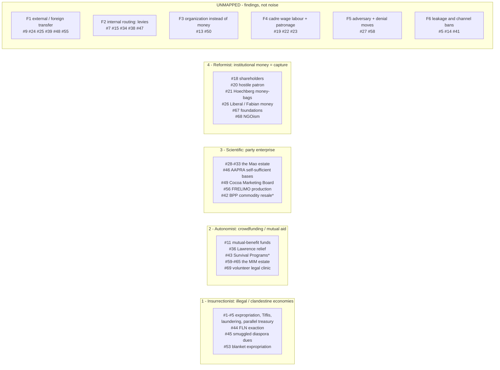

# The Funding Verb - Historical Dossier

**Commissioned:** Director rulings 14 + 38 (ADR176), against the declared-empty
`("manage_resources", "organization")` cell of the ratified Article V 3×3
(`src/babylon/game/actions/matrix.py`, ADR177). Nothing today replenishes an org's
`budget` (`src/babylon/models/entities/organization.py:164`) or mints a `PRESENCE` edge.

**Line alignment:** MIM findings outrank (§1.6 is the aligned line and §3 is written from it).
`marxists.org` is Trotskyist-curated and its verdicts — Souvarine's above all — are treated as
*evidence of practice*, never as the game's own judgment. ProleWiki is ML and sits below MIM.

**Corpus roots** (all paths below are relative to one of these):

| Shorthand | Root |
|---|---|
| `MIA/` | `/media/user/data/old-hdd/old-hdd/www.marxists.org/` |
| `PW/` | `/media/user/data/old-hdd/old-hdd/prolewiki/Exports/` |
| `MIM/` | `/media/user/data/mim/etext/` |

**Named corpus gaps** (reported by the sweeps, carried as honest absences, not as negative
findings): the 1907 London Congress expropriation-ban text itself; WITBD Ch. IV; the Schmidt
inheritance and Kamo in Lenin's own corpus; the Ermen & Engels retirement settlement; Mao's
*Economic and Financial Problems* §§2–8; any CPP/NPA "revolutionary taxation" article in ProleWiki
(absent entirely, not thin); internal BPP financial documents. Stalin's own corpus is **silent** on
Tiflis — no first-person or official-Soviet acknowledgment exists anywhere in `MIA/reference/archive/stalin`.
That silence is itself a finding and it constrains §3.

---

## 1. The historical record

### 1.1 The RSDLP / Bolsheviks

| # | Mechanism | Corpus path | What it cost them |
|---|---|---|---|
| 1 | **Armed expropriation.** Robbery of state and private funds by combat squads; proceeds split three ways — party treasury / arming for the uprising / *maintenance of the expropriators themselves*. | `MIA/archive/lenin/works/1906/gw/ii.htm` | Lenin in the same passage: the form was "adopted as the preferable and even exclusive form of social struggle by the vagabond elements of the population, the lumpen proletariat and anarchist groups", and drew state "retaliation" — martial law, pogroms, military courts. **Only the big jobs reached the party**: "small expropriations go mostly, and sometimes entirely, to the maintenance of the 'expropriators'." |
| 2 | **Tiflis, 26 June 1907.** Bomb-and-gun ambush of a State Bank convoy, 341,000 roubles, days after the London Congress banned exactly this. | `MIA/history/etol/writers/souvar/works/stalin/ch04.htm` | "three killed and more than fifty wounded, soldiers and innocent peasants" — the human bill fell on bystanders. Marked serial numbers turned the coup into a Europe-wide manhunt. |
| 3 | **Laundering the proceeds.** Operatives exchanged the marked 500-rouble notes across four countries; a parallel forgery track sourced banknote paper via Krassin. | same | Arrests at Paris, Munich, Stockholm, Geneva; the Reichsbank traced the forgery; the CC ordered the remaining notes destroyed — **a real fraction of the seized capital was written off**; the Transcaucasian committee expelled the perpetrators, Stalin included. |
| 4 | **A parallel treasury.** Tsintsadze's "purely Bolshevik club for expropriating State funds", created *because* the Menshevik-majority regional body would not sanction it (21,000 roubles taken, 15,000 up to the faction, the rest kept "to provide for a series of expropriations later on"); the secret Bolshevik Centre kept financing squads after the ban. | same | Souvarine: "a regular occult dictatorship, thanks to its unauthorised ramifications and its funds, behind the back of the Central Committee." **Self-financing let a faction escape its own party's control** — the durable cost, larger than any arrest. |
| 5 | **The channel legislated.** Stockholm 1906 banned robbery but, "under Bolshevik pressure", exempted confiscation of *State* moneys; London 1907 closed the exemption, condemning "all participation in or assistance to … expropriations" as disorganising and demoralising and ordering squads disbanded. A Nov. 1906 Bolshevik military-combat conference had already passed its own resolution "on expropriations". | same; `MIA/archive/lenin/works/1907/may/02c.htm` | Two congresses in two years spent their authority legislating a *funding mechanism* — and the mechanism defied them. The conference's own Provisional Bureau "existed for only two months" and sat without a CC representative. |
| 6 | **Dues as a membership test.** 1903 Congress writes "supports the party financially" into Rule 1; carried 26–18. | `MIA/history/international/social-democracy/rsdlp/1903/ch23.htm` | The class objection was made on the floor. Lieber: membership "something to be bought with financial contributions." Glebov: "This point might be needed for professors, but certainly not for broad strata of the workers." |
| 7 | **Central levy.** Rules 6 + 9: the CC "has charge of the Party's central treasury"; all subordinate organisations "are obliged to contribute sums, to be fixed by the Central Committee". | `MIA/history/international/social-democracy/rsdlp/1903/rules.htm` | Local committees lose discretion over their own take; the amount owed upward is set by the centre, not negotiated. |
| 8 | **Pooled émigré treasury + own socials.** Each group contributes "its share to the federation's treasury, raising funds independently by arranging socials". | `MIA/archive/lenin/works/1901/may/24gdl.htm` | Lenin reads the split as factional weight: "it grants too much to Borba". Same letter shows hard rationing — "we cannot afford to spend on anything but transportation". |
| 9 | **Diaspora remittance.** "We have money now (America has sent 5,000 frs.)" — which is what made attending the Brussels conference possible. | `MIA/archive/lenin/works/1902/dec/19gvp.htm` | Lumpy and donor-dependent: leadership mobility contingent on one overseas lump sum arriving. |
| 10 | **Donor money as bargaining chip.** A Belgian donation split with a rival current — "one-third should be given to *Rabocheye Dyelo*: for the sake of 50-100 francs it is not worth while to give cause even for talk." | `MIA/archive/lenin/works/1901/jul/07gvp.htm` | The reputational cost of fighting over donor money was priced *above* the money. |
| 11 | **Autonomous worker mutual-benefit funds** vs. subordination to the "organisation of revolutionaries" (the 1897 League of Struggle split). | `MIA/archive/lenin/works/1901/witbd/ch02.htm` | Lenin's retrospective verdict: independent strike/benefit funds were the seed of Economism. The cost is *political drift*, not money. |
| 12 | **Worker kopeck subscriptions** funding the legal *Pravda*, 1912. | `MIA/history/etol/.../souvar/works/stalin/ch04.htm` | "better assured by humble voluntary sacrifices than was the case in earlier enterprises based on the proceeds of expropriations or the gifts of capitalists." Cost is scale and speed. **Provenance caveat: this verdict is Souvarine's, not the Bolsheviks'.** |
| 13 | **Organization substituted for money.** The Cadets were "practically legal, … the best organised bourgeois party, and ha[d] incomparably greater funds"; the Bolshevik answer was "the organisation of professional revolutionaries". | `MIA/archive/lenin/works/1907/sep/pref1907.htm` | Explicit trade: secrecy, arrest risk, unpaid full-timers *instead of* revenue. |
| 14 | **Bequest through a single trustee.** A disputed legacy administered by one Bolshevik, "Victor", who defrauded the other heirs; the split party could not self-adjudicate and referred it to a neutral SR commission. | `MIA/history/etol/.../souvar/.../ch04.htm` | A fully legal channel still carried capture and corruption risk once a large sum passed through one trusted individual outside party accounting. |

### 1.2 Marx, Engels, the IWMA

| # | Mechanism | Corpus path | What it cost them |
|---|---|---|---|
| 15 | **Per-capita levy, re-priced under pressure.** Geneva 1866 voted threepence/member plus a £2/week General Secretary's salary; the Council cut it to a halfpenny when it proved "an insurmountable obstacle to the affiliation of organised bodies". Corporate affiliation also carried a 5s entrance fee. | `MIA/archive/marx/iwma/documents/1867/annual-report.htm` | **The contribution rate directly gated organizational growth.** Also: "there were no funds to pay the General Secretary this labour devolved upon volunteers"; accumulated debts "have greatly hampered our action, and continue to be a source of trouble." |
| 16 | **Cross-subsidy inside an affiliate.** The Coventry ribbonweavers, "having no funds in hand and many members out of work — forthwith raised a levy to the required amount from the members in Work." | same | Not new money: an internal solidarity tax on the currently-employed of an already-struggling trade. |
| 17 | **In-kind press capacity.** Citizen Collet published the Congress report gratis and offered to stereotype it at his own expense, the Council bearing no risk of loss. | same | Hostage to one individual's legal standing: he "had to suspend the publication of his journal for several weeks" over a press-law technicality, and the plan went with it. |
| 18 | **Shareholder-capitalized paper.** The *Rheinische Zeitung* funded by liberal Rhenish businessmen. | `MIA/archive/marx/bio/marx/eng-1869.htm` | Under the closure decree "the shareholders wanted to attempt a settlement"; Marx resigned. **Ownership set the paper's willingness to fight.** |
| 19 | **Cadre wage labour in the enemy economy.** Marx as *New-York Tribune* European editor. | same | Income tied to a foreign commercial paper's needs; it ended with the American Civil War. |
| 20 | **Hostile-patron commission.** Marx took Urquhart's money while "Harried by impatient creditors" — "A good thing financially. But I don't know whether, politically, I ought to get too involved with the fellows." | `MIA/archive/marx/bio/marx/wheen/ch07.htm` *(secondary — Wheen, hosted on MIA)* | Required a public disavowal later to stop the money reading as alignment. |
| 21 | **Patron capture — the canonical case.** "it is not they who have the command of their organ but Höchberg, thanks to his money-bags." | `MIA/archive/marx/works/1880/letters/80_04_01.htm` | Engels names the mechanism: a paper nominally the party's, politically owned by its financier, pulled toward reformism. |
| 22 | **Personal subsidy.** "Herewith cheque for £20" — Engels underwriting Second International founding-congress costs. | `MIA/archive/marx/works/1889/letters/89_05_11.htm` | Congress logistics contingent on one wealthy individual's liquidity. Not an institutional base. |
| 23 | **Comrade patronage laundered as a loan.** Kugelmann's £15 — "I therefore regard these £15 as a loan, which I shall in time repay." Marx in the same letter prices his own indispensability against his rent: London costs £400–500/yr, Geneva £200, but leaving would let "the whole labour movement … fall into very bad hands". | `MIA/archive/marx/works/1868/letters/68_03_17.htm` | Ad hoc income outside any treasury, managed by a face-saving fiction. **Cadre subsistence is a distinct line item from org solvency.** |
| 24 | **Transnational solidarity subscription under repression.** Under the Anti-Socialist Law: money to a named contact whose "address ought, of course, not to be made public; otherwise the German police would simply confiscate"; the appeal fronted by John Swinton because "a well-meaning bourgeois is best suited for this purpose". | `MIA/archive/marx/works/1880/letters/80_11_04.htm`, `80_11_05.htm` | **Repression did not tax open fundraising, it abolished it**; and it put a non-party bourgeois figure inside the channel. |
| 25 | **Bounded outside donation.** The bourgeois Peace Society's £20 for one print run of the Manifesto in French and German. | `MIA/archive/marx/works/1870/letters/70_08_17.htm` | The contrast case to #21: ideologically alien money, narrowly bounded purpose, no editorial strings observed. |
| 26 | **Funding source as class diagnostic** (Engels' working rule). *Labour Elector*: "depends on money from unavowed sources and is therefore highly suspect." Keir Hardie: "one of the few who did not accept any Liberal money". Fabians: "many bourgeois followers and therefore money", spent to "permeate" Liberalism; their promised £30,000 from the unions never arrived. | `MIA/archive/marx/works/1889/letters/89_05_11.htm`, `1892/letters/92_07_05.htm`, `1893/letters/93_01_18.htm`, `93_11_11.htm` | Not a cost — a **rule the movement ran on**: undisclosed or class-alien funding = presumption of capture. |
| 27 | **State finance-as-censorship** (the adversary's move). Bernays prosecuted for not posting the "caution-money required for the publication of a political newspaper". | `MIA/archive/marx/works/1844/letters/44_10_01.htm` | A capital requirement functioning as censorship: raise capital you don't have, or publish exposed. |

### 1.3 The Chinese base areas

| # | Mechanism | Corpus path | What it cost them |
|---|---|---|---|
| 28 | **Army self-support production.** Units farm and run workshops — ~18 mou/head, three months a year in production, nine in training/fighting. | `MIA/reference/archive/mao/selected-works/volume-3/mswv3_27.htm`, `mswv3_17.htm` | Mao concedes it "violates the principle of division of labour"; costs a quarter of the army's year; **only works dispersed** — concentrated attack formations "will be unable to engage in production". |
| 29 | **Seed capital for org enterprises.** 700,000 yuan from the Finance Department plus a 3,000,000-yuan Border Region Bank loan, issued downward through new central finance organs. | `MIA/reference/archive/mao/selected-works/volume-6/mswv6_35_9.htm` | Real burn before return: of 27 handicraft factories most passed through "initial loss of capital"; mills opened then merged or closed for want of raw material; the administering bodies were dissolved and re-merged twice in two years. |
| 30 | **Org-run trading companies.** Twenty stores earned 256,000 yuan — "48 per cent of their daily running-expenses"; the Rear Services system 810,000 yuan, "45 per cent". | same | The commercial estate **damaged the currency**: uncoordinated shops "even disobeyed Party policy, influencing prices and currency", forcing centralization under one Commodities Bureau and a cut from 38 shops/196 staff to 25/105. |
| 31 | **Partnership tenancy.** Organs supply land, oxen, tools, seed to immigrants; harvest split 20/80 and 30/70 in the tenant's favour. | same | Mao names the class character himself: "Although partnerships have some of the character of exploitation, the common folk … appreciate it very much since the government supplies seed, plough oxen and agricultural implements, and the taxes are not high." |
| 32 | **Labour exchange + multi-purpose co-operatives** (producer/consumer/transport/credit in one body — the Southern District Co-operative of Yenan). | `MIA/reference/archive/mao/selected-works/volume-3/mswv3_17.htm` | Degenerates into pure requisitioning where cadres treat economic work "only as an expedient for meeting financial deficits" rather than as a mass movement. |
| 33 | **Funding twinned with rectification.** "The widespread movements for rectification and for production … the one in our ideological and the other in our material life." | `MIA/reference/archive/mao/selected-works/volume-3/mswv3_27.htm` | Stated as necessity: the material crisis (KMT blockade) and the ideological crisis (a Party past a million mostly-peasant recruits) arrived together. |

### 1.4 US labour and party formations

| # | Mechanism | Corpus path | What it cost them |
|---|---|---|---|
| 34 | **Founding dues architecture.** IWW 1905: 25¢/month local dues remitted upward through "international industrial divisions" acting as a financial clearing house; convention voting ~1 vote per 200 members. | `MIA/history/usa/unions/iww/1905/convention/ch18.htm` | A delegate indicted the fee/vote ratio on the record as reproducing AFL oligarchy — "that is your democratic czarism". **The dues architecture was itself the bureaucratic-capture vector.** |
| 35 | **Job-delegate collection.** Deliberately low dues ($5 max initiation) because "Keeping workers out of a union by a prohibitive initiation fee forces them to scab"; unpaid rank-and-file "job delegates receive no pay but are empowered to initiate new members and collect dues". | `MIA/history/usa/unions/iww/1921/kennedy_how.htm`, `iww/1920/gst1919.htm` | Decentralized cash handling with no central office to defend: during the 1917–18 sedition prosecution "Funds, fixtures, and mail were confiscated" nationwide. |
| 36 | **Strike relief as national appeal.** Lawrence 1912: wired solidarity appeals produced ~$1,000/day (peaks >$3,000), administered by a 24-member committee split by each of 11 nationalities, running kitchens and graduated per-family allowances. | `MIA/history/usa/unions/lawrence-strike/strike.htm` | The relief apparatus **was the discipline apparatus**: a "scab book" was kept and no aid went to anyone crossing the line. Funding doubled as loyalty verification. |
| 37 | **Shop-unit finance under cover.** CPUSA 1935 manual: a Financial Secretary tracks arrears; raffles and socials top up dues; the shop paper is financed *only* from inside the plant — "it will be quite difficult to get money for the shop paper from the outside. It will have to be supported by the workers themselves inside of the factory." | `MIA/history/usa/parties/cpusa/1935/07/organisers-manual/ch03.htm` | Security cost fundraising efficiency by design; the paper lived only as long as floor-level coin collection held under "the most difficult conditions of terror". |
| 38 | **Dues re-routing as insurgency.** The 1928 "Save the Union" campaign told UMW locals to stop paying Lewis's machine and pay into the rival National Miners Convention Arrangements Committee, which issued its own dues cards as proof of allegiance. | `MIA/history/usa/parties/cpusa/1928/rprtmineswab.htm` | The Party's own report: "none of the locals have as yet affiliated", and the insurgent structure faced "the greatest danger … of disintegration" without the dues stream. |
| 39 | **Foreign-party seed money + relief telegraphy.** Comintern "seed money for 'expansion markets'"; at Gastonia 1929 the Workers International Relief coordinator phoned New York each morning "and by late afternoon there would usually be some money telegraphed in to her." | `MIA/history/usa/pubs/southernworker/intro.htm` | Chronically dry — a month earlier "the *Daily Worker*'s telephone lines had been disconnected for nonpayment"; the Party's own post-mortem blamed the strike's collapse on the relief fund running out. |
| 40 | **Legal-defense fund drives.** ILD's *Labor Defender* Christmas drive: of ~550 contributors, 196 from New York, 3 from Texas, 2 from Louisiana, none from the rest of the South. | same | **Donor base and campaign geography were inverted**, feeding the "outside agitator" attack on the very organizers it funded. |
| 41 | **Clandestine paper on pledged fraternal money.** *Southern Worker* launched on a one-time $200 Party grant, then ~$60/issue covered by "a few dollars a month" from International Workers Order lodges and foreign-language papers; editors were "ordered to remain strictly underground" and barred from fundraising, yielding two ads in seven years. | same | The security requirement **capped the revenue ceiling directly**. The same source counts 16 CPUSA disciplinary cases for financial malfeasance in the period, mostly embezzled publication-sale proceeds. |
| 42 | **Commodity resale into armament.** BPP 1968: "after selling Mao's Red Book to university students in order to buy shotguns, the Party makes the book required reading"; *The Black Panther* circulation 100,000 (1968) → 250,000 (1971). | `MIA/history/usa/workers/black-panthers/index.htm` | The same chronology sets this growth against COINTELPRO's "surgical assassinations" — Hampton and Clark killed inside the window. |
| 43 | **Survival Programs — the state-attention finding.** Free breakfasts, clinics, in-kind service funded from the community served. | `MIM/mn/mn083.txt:1830-1860` | **The single most important cost datum in this dossier.** "The most talked-about reasons for governmental attack on the BPP were the Survival Programs which the FBI knew were used for 'indoctrination.'" Hoover "exhorted local FBI offices to put a stop to the 'nefarious activity' of feeding Black children free breakfasts before school." MIM's reading: the BPP "was not principally a military organization … the FBI used exaggeration of this threat — to the point of falsification". **State attention tracked organizing efficacy, not illegality.** |

### 1.5 Anticolonial and national-liberation formations

| # | Mechanism | Corpus path | What it cost them |
|---|---|---|---|
| 44 | **FLN domestic exaction.** "FLN income from voluntary and extorted contributions reaches 600 million francs per month" (Jan 1958); a Feb 1956 decree redirected the customary Aïd sheep sacrifice into cash for the treasury. | `MIA/history/algeria/1958-1960.htm`, `1945-1957.htm` | The corpus's own phrase — "voluntary and extorted" — concedes the coercive edge. Repurposing a religious obligation converts ritual legitimacy into revenue and spends it. |
| 45 | **Diaspora dues, smuggled.** The Fédération de France collected dues from Algerian workers in France; French sympathizers (*les porteurs de valises*) carried the cash to Switzerland. "Our mission was … to gather the dues from Algerians in France … to take it to Switzerland." | `MIA/history/france/algerian-war/2004/interview.htm`, `MIA/history/algeria/1960/ben-bella-121.htm` | The Jeanson Network was arrested and tried (from 6 Sept 1960) for "collecting funds to aid the FLN"; the immigrant contributors were exposed to surveillance and reprisal for association alone. |
| 46 | **Self-sufficient training bases.** AAPRA doctrine: recruits farm, run plantations and cattle, hand-make uniforms — "This will enable the AAPRA budget to concentrate on the purchase of military and transport equipment which cannot be manufactured locally". | `PW/Library/Library_Handbook of Revolutionary Warfare_ A Guide to the Armed Phase of the African Revolution.txt` | The saving is extracted from recruits' own non-combat hours; requires enough secure territory to farm. |
| 47 | **Tiered dues by commitment.** A-APRP: "Supporter" = voluntary money or labour; "Cadre are obligated to pay party dues and complete tasks", reached only after multi-year vetting. | `PW/Main/All-African People's Revolutionary Party.txt` | Routes the heaviest financial obligation onto the most vetted layer — manages, but does not remove, the dues-filter-by-income problem named at RSDLP 1903 (#6). |
| 48 | **Foreign-state patronage with tasking attached.** Libya "always operate[s] through a contact person, through whom they channel funds and issue directives about 'revolutionary assignments'" — the same relation with Chadian factions, Museveni's NRM, and the A-APRP. | same (citing Abdullah 1998) | Textbook patron capture: money arrives bundled with the donor state's assignments, and the same channel served unrelated and mutually hostile factions. |
| 49 | **State marketing-board surplus.** Ghana's Cocoa Marketing Board paid farmers below world price and retained the remainder "for maintaining public services and for the general development of the country"; the same treasury ran the Bureau of African Affairs and housed "freedom fighters from all over Africa". | `PW/Library/Library_Dark Days in Ghana.txt` | Extraction fell on the cocoa farmers — the N.L.M. opposition grew on the charge that the Cocoa Duty Bill was "unjust to the cocoa farmers" — and the whole apparatus rode one volatile export price. Both institutions were shut within days of the 1966 coup. |
| 50 | **Refusal of fundraising as doctrine.** Kim Il Sung: "We could have appealed to the people for war funds as the Independence Army did, or gone to other countries begging … Once you begin to beg, you begin to fawn on others". Homemade arms instead. | `PW/Library/Library_Reminscences With the Century_ The Anti-Japanese Revolution Volume 3.txt` | Traded material quality (wooden guns, tin-can bombs) for independence from both donors and patrons — funding-avoidance as the precursor of Juche. |
| 51 | **Coercion reversed into appeal.** A landowner detained to extract funds was released by headquarters "saying that the method was wrong"; he was then asked plainly for cloth and cotton for 500 uniforms, and "later he kept his word." | same | Documented course-correction: coercion against a fence-sitter converts him into an enemy; the appeal kept him as a supplier. |
| 52 | **Indiscriminate requisition — the anti-mechanism.** The rival Sinmin-bu "exacted war funds and military provisions from the people"; the guerrillas' own expedition then failed because "the people would never open their hearts to us." | same | **Coercive extraction by any armed faction poisons the ground for every other** — a negative externality across organizations, not just a cost to the extractor. |
| 53 | **Blanket expropriation, then restitution.** The 1932–33 guerrilla-zone Soviets expropriated "all the rich farmers and landowners, regardless of whether they were large landowners, small landowners, pro-Japanese landowners or anti-Japanese landowners"; by 1934–35 the People's Revolutionary Governments returned the property and "compensated for [it] … in cash and in kind". | same | Drove pro-resistance landowners toward Japanese-held territory; the memoir labels it a "Leftist" error and reverses it. |
| 54 | **A named fundraising body as a target.** The Changbai War Fund-Raising Association "rapidly dispersed" in the 1920 clean-up; another cadre was "sentenced to a term of life imprisonment on a charge of raising funds". | `PW/Library/Library_Reminscences With the Century_ The Anti-Japanese Revolution Volume 4.txt` | A standing, legible fundraising organization is a high-value counterinsurgency target; fundraising alone carried life-imprisonment jeopardy. |
| 55 | **Dual-track: domestic + one foreign state.** Hezbollah raises much of its social/medical funding domestically but takes Iranian subsidies "often estimated at $100 million a year", which "vary widely, depending on the political climate in Iran"; the Martyr's Association is a branch of an Iranian body of the same name. Amal, by contrast, "lacks a generous benefactor". | `PW/Library/Library_Hezbollah_ A Short History.txt` | Movement capacity indexed to a foreign state's internal politics; several service organizations are organizationally the patron's, not the movement's. |
| 56 | **Production campaign as pedagogy.** FRELIMO: "To our army we give the tasks of fighting, producing and mobilising the masses. To our youth we give the tasks of studying, producing and fighting." Diversified crops as defence against bombing. | `PW/Library/Library_The African Liberation Reader, Volume 1_ The Anatomy of Colonialism.txt` | Fighters' labour-time diverted into subsistence; Machel justifies it not as a supply fix but because "production is a school". |
| 57 | **Money subordinated to line, by constitution.** PFLP 1969: mobilizing "the true forces of the revolution … is more important than all financial assistance if the price of this assistance is to be the dilution of our clear view of things"; the Palestinian bourgeoisie's willingness to fund the resistance is listed among latent internal conflicts; finance is one of five cadre functions, not a bureaucracy. | `PW/Library/Library_Strategy for the Liberation of Palestine.txt` | The clearest *ex ante* guard-rail in the corpus: the risk is named in the founding document rather than diagnosed after capture. |
| 58 | **Revenue denial.** Organized refusal to pay taxes to the occupation, listed with defending wells and resisting demolitions. | `PW/Library/Library_Political Report of the 6th Congress of the PFLP-2000.txt` | Starves the adversary's budget rather than filling the movement's; the report does not quantify the reprisal cost it invites. |

### 1.6 MIM — the aligned line

| # | Mechanism | Corpus path | What it cost them |
|---|---|---|---|
| 59 | **No paid staff; leadership self-funds; dues scaled to class position.** "what MIM has is people in leadership with the honor of paying the most money for the operation of MIM out of their own pockets"; sympathizers are told "Consider a few hundred a month or maybe even a thousand if you are upper-middle class", and millionaires/billionaires are solicited directly to "fund a staff, increase our circulation … support our legal struggles for prisoners". | `MIM/faq/witbd.html` | Capacity is a function of how many well-off sympathizers self-select in; chronic short-handedness accepted as the price of independence. "use an anonymous money order for your own security" — the financial trail is treated as a surveillance surface. |
| 60 | **Sponsor / distributor / officer tiers.** Sponsors pay for papers, distributors put them on the street, officers do both; payment only by anonymous money order to a PO box. | `MIM/pirao/mndistrocampaign.html` | **MIM later judged the model a failure and formally retracted it** — a movement publicly reversing its own funding mechanism rather than defending it as doctrine. |
| 61 | **Entrepreneurial self-reliance replaces central subsidy.** "it takes on the order of $1000 to be able to print a substantial quantity of newspapers"; localities raise it themselves; "Working with a vanguard party in the majority-exploiter countries is much like being a business entrepreneur who works from the bottom up." | `MIM/pirao/centraltask12092004.html` | Concedes the gap it left: "there was no money to distribute papers into prison" for a period, and PIRAO itself is described as effectively defunct. |
| 62 | **Refusal of institutional money as a positive capacity.** "we waste no money on staff and hence we do not need money so badly that we will compromise with a trade union or some such organization to get it." | `MIM/pirao/whatitslike.html` | Also names the cost honestly: missed pledges cause "a breakdown somewhere", and MIM refuses to build dunning machinery, so shortfalls land as political failures of individuals. |
| 63 | **In-kind only.** Free Books for Prisoners funded by campus book drives — "over 100 books" in a day, no cash. | `MIM/ulk/aabooks.html` | Scales with volunteer labour, not reserves; structurally capped without an income stream. |
| 64 | **…and one incorporated vehicle.** PIRAO also directed supporters to a separate incorporated Books for Prisoners taking PayPal/credit-card donations, "a non-profit corporation BUT IT IS NOT TAX EXEMPT". | `MIM/pirao/oldbfp.html` | **MIM's own unreconciled contradiction** — the incorporated-nonprofit-donor vehicle its theory treats as a capture risk, used once to get a function done. Carried into §3 as T6. |
| 65 | **International stipends, priced above market, moved carefully.** "We can send a few hundred dollars a year per comrade"; "We do not use Western Union. Senators have bragged how they changed the law"; "Please use PGP or GPG"; and payment doctrine — "we try to 'buy red' as opposed to 'buying green'". | `MIM/im/imguidelines.html` | Thin and unreliable by MIM's own admission; the transfer channel is a standing security liability requiring encryption to operate at all. |
| 66 | **The labor-aristocracy line applied to money.** "Too many Amerikkkans are spending their money and time building Amerikkkan unions and similar oinker projects. The money is really needed elsewhere." | same | A named organizational cost: "In the 2001 furor we lost just one comrade sucked in by the labor aristocracy line who caused a whole shift in our division of labor and ended up wiping out an international project." **Contesting where money flows split the organization and killed a project.** |
| 67 | **Foundation money as pacification.** "Follow the money. From the very beginning, the contemporary environmentalist movement has had money dumped on it in order to quell it" — Ford, Rockefeller, Pew named; "if the ruling class were afraid of the environmentalist movement in 1970, by 1995 … the ruling class owned most of it." | `MIM/bookstore/science.html` | MIM's clearest theoretical statement that grant money is a class-capture instrument, not a neutral resource. |
| 68 | **NGOism, taxonomized** (reprinted from a Philippine BAYAN/Peasant Update pamphlet): "Loyalty to the funding agency rather than the people's movement"; depoliticization to win funder approval; "skilled volunteers began to demand higher pay and other benefits only rich NGOs and business institutions could offer"; adoption of corporate standards "for the sake of financial access and accumulation". | `MIM/test/rail/philpam/ngo.html` | **The professionalization ratchet, named**: once volunteers become paid staff at market rates the organization's cost floor rises and it cannot return to volunteer finance. |
| 69 | **Volunteer legal capacity instead of funded legal services.** The Prisoners' Legal Clinic: prisoners write briefs, outside volunteers type and edit — "You do not have to be a lawyer"; contributions solicited as "time or money", time given equal billing. | `MIM/ulk/serve169.html` | Caps legal firepower at what self-taught prisoners and volunteer typists produce — deliberately, to avoid the funder capture of #67/#68. |

---

## 2. The four ruled channels, grounded

### Channel notes

**Channel 1 is over-evidenced and its costs are well-documented — but its accounting is hostile.**
The only narration of Tiflis anywhere in these corpora is Souvarine's, in a Trotskyist-curated
archive; Stalin's own corpus never mentions it. Encode the *material* consequences it reports
(marked notes, arrests in four countries, destroyed currency, expulsion) — those are checkable
mechanics. Do not encode its moral verdict. The corpus adds two non-Bolshevik shapes worth keeping:
FLN's "voluntary and extorted" domestic taxation (#44) and the smuggled diaspora-dues line (#45),
which is *legal money moved illegally* — clandestinity attaching to transport, not to the source.

**Channel 2 now has an archetype, and it is MIM's.** The earlier reading — that every mass-appeal
case in the record is a party organ raising from its own base — is corrected by §1.6. MIM's estate
(#59–#65, #69) is the ruled channel almost exactly: no paid staff, no institutional money, no party
enterprise, class-scaled voluntary dues, in-kind labour from the base, cash from the comfortable,
and security tradecraft treated as part of the mechanism rather than as overhead. Kim Il Sung's
funding-refusal doctrine (#50) is its periphery mirror. #43 (BPP Survival Programs) sits here as
community-funded mutual aid, but it is run by a vanguard party, so it is a **contested placement**
and it is precisely where the ruled channel boundary is thinnest.

**Channel 3's evidence is uniformly periphery and territorial.** #28–#33, #46, #56 all presuppose
control of ground to farm and a population to trade with; #49 is the state-scale variant and it
extracts from the peasantry the state claims to represent. #42 (BPP reselling the Red Book to buy
shotguns) is the only imperial-core party-enterprise datum in the whole record, and it is a single
line about petty commerce converted into arms — a hybrid of channels 3 and 1.

**Channel 4 is the best-evidenced and the most internally consistent.** Höchberg (#21), the
*Rheinische Zeitung* shareholders (#18), Engels' Liberal/Fabian taxonomy (#26), Ford/Rockefeller/Pew
(#67) and the NGOism taxonomy (#68) are the same finding stated across ninety years and three
corpora, including the aligned one. Build it with the most confidence.

### The six unmapped findings

**F1 — External / foreign transfer.** #9 (America's 5,000 francs), #24 (the US subscription for
German comrades), #25 (the Peace Society's £20), #39 (Comintern seed money + telegraphed relief),
#48 (Libya's contact-person channel), #55 (Iran's ~$100M/yr). Legal, not raised from the org's own
base, not a party enterprise, not bourgeois-institutional. **This is the only practice family that
moves value across a state or imperial-rent boundary**, and the record shows it running in both
directions with opposite class content: core→periphery solidarity (#24), periphery→core dues (#45),
and state→movement patronage with tasking attached (#48, #55). Reserved — §5 Q3.

**F2 — Internal routing, not acquisition.** #7 (CC-fixed levy), #15 (per-capita re-priced),
#34 (clearing-house remittance), #38 (dues redirected to an insurgent body), #47 (tiered obligation).
None of these raise money; they decide *where money sits and who sets the rate*. Two mechanics fall
out: a contribution-rate dial that trades yield against affiliation growth (#15 is the cleanest
evidence in the dossier), and dues-redirection as an attack on a rival organization's revenue (#38).

**F3 — Organization substituted for money.** #13 (the Cadets had "incomparably greater funds"; the
answer was the professional-revolutionary apparatus) and #50 (refusing to fundraise at all, at the
cost of wooden guns). Cost-avoidance, not revenue. Design consequence in §4.2.

**F4 — Cadre subsistence and individual patronage.** #19 (Marx on the *Tribune* payroll), #22
(Engels' cheques), #23 (Kugelmann's £15 relabelled a loan, with Marx pricing his own household
against his political indispensability). **An org can be solvent while its cadre are destitute, and
the reverse.** The leash here is a person, not an institution.

**F5 — Adversary moves and revenue denial.** #27 (caution-money as censorship-by-capital-requirement)
and #58 (organized tax refusal against the occupation) are the same mechanic pointed in opposite
directions: raising the cost of the other side's money. Neither is a funding channel; both belong in
the repression/struggle machinery.

**F6 — Leakage, and channels the organization bans itself.** #14 (the "Victor" legacy fraud, needing
an outside arbiter), #41 (16 CPUSA malfeasance cases, mostly embezzled sale proceeds) — decentralized
cash handling leaks, in *any* channel. And #5: two congresses legislating a funding mechanism, and a
faction financing itself in defiance of both. **A channel can be closed by the organization's own
doctrine, and using it anyway produces a treasury the organization cannot see.**

---

## 3. MIM-line tensions

**T1 — Whose money is clean in the imperial core.** MIM defines "majority-exploiter countries" as
"countries that are at least 51% bourgeoisie in population … remember that the bourgeoisie includes
not just capitalists but the petty-bourgeoisie", the US among them
(`MIM/faq/majorityexploiter.html`). Against a Third World average wage of "48 cents per hour"
(`MIM/faq/twprole.html`), the core wage is a share of the transfer.

The consequence is direct and uncomfortable: **the mechanisms the record celebrates as the clean
ones — worker kopecks for *Pravda* (#12), the IWMA halfpenny (#15), the Coventry levy (#16), IWW
dues kept low so no worker is priced out (#35) — are, raised inside the imperial core, a
redistribution of imperial rent Φ, not a share of surplus value.** The "clean" channel and the bribe
are materially the same substance. MIM says so operationally as well as theoretically: it tells
core sympathizers to stop building "Amerikkkan unions and similar oinker projects" because "the
money is really needed elsewhere" (#66). The engine already computes Φ and already runs σ-composition
attribution (Program 26), so this can be made **visible in the mechanic** rather than delivered as
narration.

**T2 — MIM does not hold that poor money is clean.** MIM solicits millionaires and billionaires by
name and scales dues *upward* by class position (#59). That is the opposite of the PFLP's guard-rail,
which lists "the willingness of the Palestinian bourgeoisie … to financially support the resistance"
among latent internal conflicts (#57), and the opposite of Glebov's 1903 objection that a cash clause
suits "professors" (#6). The resolution is consistent, not contradictory: **on the MIM line there is
no core proletariat to raise from, so core-bourgeois cash is the only honest core source — and the
oppressed contribute labour, not money.** This should govern channel 2's design in the core: cash
from the comfortable, labour and in-kind from the base (#63, #69).

**T3 — State attention does not track legality.** Ruling 14 charters channel 1 as the one "carrying
a state-attention bill". The record's largest documented state response went the other way: the FBI
campaign was driven by the Survival Programs, and Hoover moved against "the 'nefarious activity' of
feeding Black children free breakfasts" (#43, `MIM/mn/mn083.txt`), with the military threat
"exaggeration … to the point of falsification". Corroborated three ways from the other corpora: under
the Anti-Socialist Law it was *ordinary open fundraising* that became impossible (#24); the Changbai
War Fund-Raising Association was destroyed for existing legibly (#54); the Jeanson Network was tried
for "collecting funds" (#45). **Heat proportional to illegality is question-begging and teaches the
wrong lesson.** Heat should key on organizing output and legibility, with illegality as a modifier.

**T4 — The lumpen inverts inside the core.** Lenin's warning is that expropriation drew "the vagabond
elements of the population, the lumpen proletariat" (#1) — the European reading, in which the lumpen
is a contaminant. MIM's practice inverts it: MIM(Prisons) treats the imprisoned population as a real
revolutionary subject and builds a prisoner-authored legal clinic and a books program around it (#63,
#69). A global "illegal funding degrades class character via lumpen recruitment" coefficient would
encode the Bolshevik line over the aligned one. Reserved — §5 Q2.

**T5 — Mao's estate does not port, and neither does Nkrumah's.** Channel 3's strongest evidence
(#28–#33, #46, #56) is periphery base areas producing real value under blockade. The same enterprise
transplanted into an imperial-core org is a labour-aristocracy co-operative trading in a market
saturated with Φ. Worse, #49 (the Cocoa Marketing Board) is an ML source reporting, without critique,
a state paying its own farmers below world price to fund Pan-African work — on the MIM line that is
internal extraction, and the record's own evidence agrees that it built the opposition that outlasted
Nkrumah. The mechanic can be shared; the class-character result must not be.

**T6 — MIM's own unreconciled case.** MIM theorizes foundation money as pacification (#67) and
reprints the NGOism taxonomy (#68), yet PIRAO also pointed supporters at an incorporated nonprofit
taking card donations (#64). The corpus never reconciles it. **Read as design guidance rather than as
a gotcha, this is the most useful datum in §1.6**: capture is not a bribe accepted in a moment, it is
a vehicle adopted because a function had to get done. Channel 4's mechanic should reproduce that —
drift by function, not by temptation.

**T7 — Where the line and the record agree, say so.** Ruling 38's "institutional money IS the capture
vector" needs no reconciliation. Höchberg's money-bags (#21), the shareholders folding to the censor
(#18), Engels' funding-as-class-diagnostic rule (#26), Ford/Rockefeller/Pew (#67) and the NGOism
professionalization ratchet (#68) are one finding stated by four different traditions, including the
aligned one.

---

## 4. Mechanic recommendations

**Shape.** One verb in `("manage_resources", "organization")` — call it **`fundraise`** — with four
doctrine-gated **sub-modes**, plus the cross-cutting items below. Sub-modes, never verbs: Article V is
verbatim "All always available" (`CONSTITUTION.md:522`), and the existing capability layer
(`src/babylon/engine/actions/_capability.py`) already gates sub-modes and edge types only. Ruling 14
says ship simple: **one resolver, four sub-modes, one composition field.** No new mathematics; every
coefficient named below lands in a new `funding` category in `GameDefines` and regenerates into
`defines.yaml`, hanging off the G3 lever's ratified `(doctrine-pair, cell)` coordinates.

### 4.1 The four sub-modes

| Sub-mode | Doctrine | Yield shape (grounded in) | State attention | Capture risk | Class character |
|---|---|---|---|---|---|
| **`illegal_economy`** | Insurrectionist | **Fractional and lagged.** Lenin's three-way split (#1) *is* the mechanic: party treasury / arming / maintenance of the expropriators — small operations yield the org nothing, "mostly, and sometimes entirely, to the maintenance of the 'expropriators'." Seized value takes a **laundering haircut and a delay** before it is spendable (#3). A standing clandestine economy (#44) yields steadily; a single job yields lumpy. | High — the bill the channel is chartered to pay. Mints `PRESENCE` at `HIGH_PROFILE`; the rate exists (`defines.yaml: high_profile_heat_rate`). But see T3: this is a *modifier* on an organizing-output base, not the whole heat model. | Low institutional capture; **high accountability loss** — the durable cost is #4/#5, the faction escaping its own party. Model as a cohesion/accountability drift that can outlive the money. | Two grounded costs, neither a lumpen penalty: bystander harm depresses legitimacy in the hex (#2), and coercive exaction against the population poisons the ground for *every* org in it (#52), including the player's rivals. §5 Q2 reserves the rest. |
| **`mass_appeal`** | Autonomist | **Scales with organized base, not with money.** Yield keys on SOLIDARITY edges and member count. The player sets a **contribution rate**, and the rate carries a growth penalty: the IWMA's threepence was "an insurmountable obstacle to the affiliation of organised bodies" until cut to a halfpenny (#15); the IWW kept dues low because a prohibitive fee "forces them to scab" (#35). **The best-grounded dial in the dossier.** An in-kind variant (#63, #69) converts member *time* instead of member *money*. | Not zero and **not keyed to legality** (T3): #43 is the anchor. Legibility is the driver — a named, standing fundraising body is a target (#54). `LOW_PROFILE` by default, rising with reach. A security-discipline toggle (#59, #65: anonymous instruments, no dunning) lowers legibility at the cost of yield and reliability (#62). | Low institutional capture; real **leakage** where cash is handled decentrally (#41's 16 malfeasance cases, #35's job delegates). | **The yield is a transfer out of the population, not new money** (#16: Coventry taxing its own employed members). Wealth leaves the class node. In the imperial core, T1 applies to that transfer. §5 Q1 and Q5. |
| **`party_enterprise`** | Scientific | **Seed capital in, loss first, then a large steady share.** #29: capital issued, most factories through "initial loss of capital"; #30: the matured estate covering 45–48% of running expenses. Three phases: invest → burn → yield. Requires territorial control to start (#28's dispersal condition, #46's secure ground). | Low-to-moderate; mints `PRESENCE` at `LOW_PROFILE` — a shop or farm *is* an operational footprint, and this is the natural `PRESENCE` minter the empty cell was missing. | Low external capture; the internal failure mode is cadre substitution — enterprise work displacing mass work (#32: economic work run "only as an expedient for meeting financial deficits"). | **Three real costs.** (i) Labour diversion: three months of twelve (#28), degrading `project_power` efficacy while it runs. (ii) **Market side-effect**: uncoordinated org commerce "influencing prices and currency" (#30) — feeds the LIVE `MarketScissors` price⟷value axis @17.8, an existing seam, no new math. (iii) The tenancy variant stamps a real relation: Mao's own "some of the character of exploitation" (#31). |
| **`institutional_money`** | Reformist | **Highest, most reliable, least effortful** — union officialdom dues, campaign finance, foundation/NGO grants, officeholder salaries (ruling 38). Also the lump-patron shape: one cheque, one congress (#22). | **Lowest.** It is legal and respectable. This asymmetry is the pedagogy. | **All of it, routing into machinery that already exists**: `institutional_pull`, `office_tenure`, the reform ceiling (`PolicySystem` @17.47), the liquidationism absorbing state. "it is not they who have the command of their organ but Höchberg, thanks to his money-bags" (#21). Patron tasking (#48: funds and "directives about 'revolutionary assignments'") is the same mechanic with a foreign flag. | The design target: **strictly dominant on the budget axis, losing on every other.** The player watches the bank account grow while doctrine tags migrate. Pedagogy through the org's own ledger. |

### 4.2 Cross-cutting mechanics

**M1 — Budget carries provenance.** `budget` should stop being a bare scalar and become a small
kinded composition over the channels (plus "external", if §5 Q3 rules it in). This is a composition
exactly like the σ-composition Φ attribution shipped in Program 26 — **not new mathematics**.
Grounding: Engels ran precisely this rule — a paper that "depends on money from unavowed sources … is
therefore highly suspect" (#26), and Hardie counted because he "did not accept any Liberal money".
Capture pressure and heat then read off the *standing composition* of the treasury rather than off a
one-shot event, which is both more materialist and cheaper. It is also what makes T1 visible: a
core-raised `mass_appeal` share can be stamped against Φ.

**M2 — The professionalization ratchet.** #68 names it exactly: once volunteers become paid staff at
market rates, the org's cost floor rises and it cannot return to volunteer finance; #15 is the same
shape in reverse (an unpayable secretary's salary devolving onto volunteers). Mechanically:
`institutional_money` raises the org's per-tick burn as well as its budget, and **the burn does not
fall when the grant stops.** An org that loses its funding is poorer than before it took it. That is
the correct pedagogy and it needs one field, not new math.

**M3 — `reproduce` should cut burn, not add budget.** Lenin's actual answer to a funding deficit was
not a funding channel: the Cadets had "incomparably greater funds", and the reply was "the
organisation of professional revolutionaries" (#13); Kim Il Sung's was to refuse fundraising outright
and accept worse weapons (#50). Mechanically: high `cadre_level` reduces per-tick burn. This closes
half the empty cell **without a fifth sub-mode and without touching the ratified matrix** —
`reproduce` already sits at `("build_org","organization")`. Cheapest constitutional fix here; ship it
with the verb.

**M4 — Cadre subsistence is separate from org solvency.** #23 (Marx pricing London against Geneva
against his own indispensability) and #19 (Marx on a bourgeois payroll) say an org can be funded while
its cadre are destitute, and MIM's model says the reverse — leadership funding the org out of pocket
(#59). Recommend `PRESENCE` minting gate on *cadre subsistence*, not on treasury alone. Without this,
the imperial-core Autonomist trunk has no failure mode.

**M5 — Doctrine can close a channel; using it anyway forks the treasury.** #5 is unambiguous: two
congresses banned expropriation and the Bolshevik Centre financed it regardless, producing funds
"behind the back of the Central Committee". A doctrine stance that removes a sub-mode from the org's
legal repertoire, plus a defiance path that mints budget the org's own leadership cannot account for,
is a factional-split precursor grounded entirely in the record. It also gives channel 1 a
*second-order* cost that lands even when every job succeeds.

**M6 — Dues redirection as an attack.** #38: telling a rival's locals to pay a new body instead is a
direct assault on the rival's revenue, with its own dues cards as the loyalty proof. This is an
org↔org move and it belongs adjacent to `negotiate`; it is the only offensive funding mechanic in the
record and it cost the CPUSA nothing but organizer time.

### 4.3 Repression closes channels, it does not merely tax them

Under the Anti-Socialist Law ordinary open collection became impossible; money routed through a
concealed address, fronted by a "well-meaning bourgeois" (#24). The Changbai fundraising association
was dispersed outright (#54). The IWW's funds, fixtures and mail were confiscated wholesale (#35).
And #27 shows the state's own financial weapon — the caution-money deposit as censorship; MIM reports
its modern equivalent, wire-transfer law tightened until the channel is unusable (#65).

So: above a heat / security-state threshold, `mass_appeal` and `institutional_money` should become
**unavailable sub-modes**, not merely expensive ones, leaving the clandestine and external channels.
This is constitutional (conditions gate sub-modes, never verbs) and it is the strongest teaching
moment in the surface: *repression selects your funding channel for you, and the channel it leaves
you selects your doctrine.*

---

## 5. Open questions for the Director

1. **Is core-raised mass money stamped as imperial rent?** T1: on the MIM line, dues and crowdfunding
   raised inside a majority-exploiter country are a redistribution of Φ, not a share of surplus value
   (`MIM/faq/majorityexploiter.html`, `MIM/faq/twprole.html`). Should M1's provenance composition
   carry that stamp mechanically — i.e. does an Autonomist org in the US core fund itself, materially,
   out of the bribe? This is the ideological line, reserved.
2. **Does an Insurrectionist class-character penalty apply inside the imperial core?** T4: Lenin warns
   of lumpen drift (#1); MIM(Prisons) holds the imprisoned population as a revolutionary subject
   (#63, #69). Shipping Lenin's coefficient globally encodes the Bolshevik line over the aligned one.
   Recommend shipping §4.1's two *grounded* costs (bystander legitimacy, poisoned ground) and leaving
   the composition effect unruled until this is decided.
3. **Fifth channel — external transfer?** F1 (#9, #24, #25, #39, #48, #55, and #45's diaspora dues).
   It is the only practice family that moves value across the imperial-rent boundary, and its class
   content plainly inverts by direction: core→periphery solidarity, periphery→core dues, and
   state→movement patronage with tasking attached are not the same act on the MLM-TW line. Fifth
   channel, sub-mode of an existing one, or deliberately out of scope?
4. **Ruling 37 boundary.** EXPROPRIATE is ruled a BUILD-stem sub-mode (seizure-for-construction, dual
   power, "expropriation TRANSFERS value"). Does a *liquid-value* variant also live in the funding
   cell as `illegal_economy`, or must all seizure stay under BUILD and the funding channel be limited
   to standing illegal economies — which is closer to ruling 14's own wording, and which #44 (FLN
   monthly income) supports better than #2 (a single heist) does?
5. **May `mass_appeal` take wealth out of the population node?** The Coventry mechanic (#16) says yes
   and it is the honest reading — mass fundraising is a levy on the class you organize, and the IWMA
   evidence (#15) says the rate gates your own growth. It also makes the Autonomist trunk materially
   costly to play. Ruled as designed, or softened?
6. **Does the Scientific channel's tenancy sub-mode stamp an EXPLOITATION edge from a communist org
   onto peasant households?** Mao concedes "some of the character of exploitation" in his own text
   (#31) and #49 shows the state-scale version building its own opposition. Rendering that visibly —
   the player's own org owning an exploitation edge — is a framing call on the ideological line, not a
   balance call.
7. **Is the Reformist ratchet (M2) escapable?** No case in any of the six corpora shows an org that
   professionalized on institutional money returning to volunteer finance; MIM's own near-miss (#64)
   is an unreconciled contradiction, not a recovery. Making the ratchet irreversible is a pedagogical
   statement about the reformist trunk, and it should be ruled rather than tuned.
