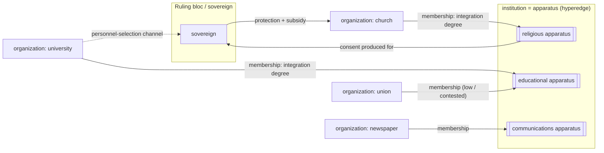

# Gramsci + Althusser on Organization vs. Institution — Rule-Ready Memo for Q3 (Issue #513)

> **RULED (Director, 2026-08-11, same session): (d) as translated in §4** — one kind of body;
> `Institution` re-referred to name the apparatus (an Amendment AG hyperedge, integration degree
> on the membership pair); `HOUSES` retired; `institutionality` computed from the four channels,
> rank-order under budget, signed by bloc; the I.16 amendment (§4.5 text) escalates as an
> amendment ceremony. The three-strata composition, hollowing-out pathology, and mandate
> variable (harvest, Q7 §77 + Turin councils) were adopted into the Organization contract in the
> same ruling batch. Normative home: `docs/superpowers/specs/2026-08-11-organization-game-object-design.md`.

**For:** the Director
**Question:** Constitution I.16 says "Organizations become institutions through formalization." The code made Institution a separate entity type joined to an Organization by a HOUSES edge. Candidates: (a) separate entity + HOUSES, (b) in-place transmutation, (c) defer, (d) institution-ness as relation/position in the hegemonic apparatus.
**Evidence base:** six reader reports over Gramsci (*Selections* "State and Civil Society" fragment; Quaderni 7, 8, 16, 17, 27, 28 in the original Italian; pre-prison political writings 1916–21) and Althusser's *Ideology and Ideological State Apparatuses*. Every claim below traces to a quote a reader pulled from a named file. No outside sources.

---

## 1. THE ANSWER IN ONE PARAGRAPH

Read together, Gramsci and Althusser converge — from six independent corpora, in two languages, across twenty years of Gramsci's own development — on a single answer: **institution-ness is not a kind of thing, it is a position and a function.** Neither author has a technical noun-pair "organization / institution." Gramsci's operative pair is *società civile / società politica*, and he explicitly calls them "le due forme in cui lo Stato si presenta" — two forms in which the *same* State presents itself (Q8 §130, Reader 3) — while the thing the Director is asking about, the assemblage that carries ruling-class domination, he names *l'apparato dell'egemonia* and defines as constituted by "una molteplicità di altre iniziative e attività **cosidette private**" — a multiplicity of so-called *private* initiatives and activities (Q8 §179, Reader 3). Althusser turns exactly that into a rule: "It is unimportant whether the institutions in which they are realized are 'public' or 'private'. **What matters is how they function.**" (ISA l. 182, Reader 5). Where either author reaches for *becoming*-language, what becomes is a status or a function inside a persisting body, never a new species of body: the party's "sviluppo… in Stato" is explicitly continuous and reciprocal, "costringendoli a riorganizzarsi continuamente" (Q17 §51, Reader 4); Azione Cattolica "tende a diventare un vero e proprio partito" but the tendency is arrested by external material conditions rather than completed by a flag (Q8 §129, Reader 3); the ISA's "installation… is the stake in a very bitter and continuous class struggle" (ISA l. 487, Reader 5). And integration is *reversible and gradable*: hegemony can drain out of an apparatus leaving "pura forma senza contenuto, larva senza spirito" (Q7 §12, Reader 2); "elementi di teocrazia sussistono in tutti gli stati" — elements, in degree, not membership (Q7 §97, Reader 2); the dominant-ISA position itself migrates historically from Church to School (ISA ll. 228, 266, Reader 5). The decisive negative finding for Babylon is that **the one word Constitution I.16 leans on — "formalization" — is the word both authors specifically deny is doing the work**: Althusser rules the public/private line "a distinction internal to bourgeois law" (l. 180), Gramsci's factory councils were effective while "neither the industrialists, nor the union bureaucracy, wanted to recognize" them (Turin councils l. 78, Reader 6), and Gramsci locates the real State "non… là dove esso sembrerebbe essere «istituzionalmente»" — not where it institutionally appears to be (Q8 §233, Reader 3). Six readers, adjudicating independently, all landed on **(d)**; none found textual support for **(a)**; **(b)** survives only if "transmutation" is redefined as a continuous, contested, reversible change of degree — at which point it *is* (d).

---

## 2. THE EVIDENCE — the twelve load-bearing passages

**E1 — Function, not form, is the criterion (the single strongest sentence in the corpus).**
> "It is unimportant whether the institutions in which they are realized are 'public' or 'private'. **What matters is how they function.** Private institutions can perfectly well 'function' as Ideological State Apparatuses."
> — Althusser, *ISA*, l. 182 (Reader 5)

Institution-hood is defined as a functional predicate over practice, not a formal or juridical status — the direct refutation of "formalization" as I.16's criterion.

**E2 — The hegemonic apparatus is made of formally private bodies.**
> «…ma in realtà al fine tendono una molteplicità di altre iniziative e attività cosidette private che formano l'apparato dell'egemonia politica e culturale delle classi dominanti.»
> *"…but in reality a multiplicity of other so-called private initiatives and activities also tend toward this end, and these form the apparatus of the political and cultural hegemony of the ruling classes."*
> — Gramsci, Q8 §179 (Reader 3)

Gramsci's own definition of *apparato egemonico*: organizations that stay legally private while functioning as apparatus. Institution-ness is what they *do*, not what they are re-typed as.

**E3 — The State is not where it "institutionally" appears.**
> «…non sempre lo Stato è da ricercare là dove esso sembrerebbe essere «istituzionalmente»; infatti lo Stato, in questo senso, si identifica con gli intellettuali «liberi»…»
> *"…the State is not always to be sought where it would seem to be 'institutionally'; indeed the State, in this sense, identifies itself with the 'free' intellectuals…"*
> — Gramsci, Q8 §233 (Reader 3)

Gramsci explicitly detaches institutional *address* from state *function* — textual licence for a position/role model over an entity model.

**E4 — Functionary status attaches by alignment, not employment.**
> «…«ogni individuo è funzionario» non in quanto è impiegato stipendiato dallo Stato… ma in quanto «operando spontaneamente» la sua operosità si identifica coi fini dello Stato (cioè del gruppo sociale determinato o società civile).»
> *"…'every individual is a functionary' not insofar as he is a salaried state employee… but insofar as, 'operating spontaneously,' his activity identifies itself with the ends of the State (i.e. of the given social group, or civil society)."*
> — Gramsci, Q8 §142 (Reader 3)

The same test one level down: apparatus-membership is functional alignment with the bloc's ends, formally invisible.

**E5 — Parties and economic organizations are to be *considered as* organs of order.**
> "…the totality of forces organised by the State and by private individuals to safeguard the political and economic domination of the ruling classes. **In this sense, entire 'political' parties and other organisations — economic or otherwise — must be considered as organs of political order, of an investigational and preventive character.**"
> — Gramsci, *Selections*, "Caesarism" (state_civil ch02) (Reader 1)

"Must be considered as" — a reclassification of *how to read* a body given its position inside the state-plus-private totality, with no change of entity kind implied.

**E6 — Two forms of one State, not two kinds of body.**
> «…le due forme in cui lo Stato si presenta nel linguaggio e nella cultura delle epoche determinate, cioè come società civile e come società politica, come «autogoverno» e come «governo dei funzionari»… [una] società civile… diventandone la normale continuazione, il complemento organico.»
> *"…the two forms in which the State presents itself…, that is, as civil society and as political society, as 'self-government' and as 'government of officials'… [a] civil society… becoming its normal continuation, its organic complement."*
> — Gramsci, Q8 §130 "Statolatria" (Reader 3)

Gramsci's only named ontological layers are civil/political society — related as shell and organic complement, i.e. positions, not species.

**E7 — Same works, different depth: the State is the forward trench.**
> «Lo Stato era solo una trincea avanzata, dietro cui stava una robusta catena di fortezze e di casematte…»
> *"The State was only an advanced trench, behind which stood a robust chain of fortresses and casemates…"*
> — Gramsci, Q7 §16 (Reader 2); cf. Q7 §10 "le superstrutture della società civile sono come il sistema delle trincee nella guerra moderna"; Q8 §52, popular organizations as hegemony's "trincee" (Reader 3)

State and civil-society organizations are figured as the *same class of defensive works at different depths of one line* — a topological/positional metaphor, and Gramsci's most explicit one.

**E8 — "Becoming" happens, but it is continuous and reciprocal, never complete.**
> «Lo sviluppo del partito in Stato reagisce sul partito e ne domanda una continua riorganizzazione e sviluppo… costringendoli a riorganizzarsi continuamente e ponendo loro dei problemi nuovi e originali da risolvere.»
> *"The development of the party into State reacts back upon the party and demands of it continual reorganization and development… forcing them to reorganize themselves continually and posing new and original problems for them to solve."*
> — Gramsci, Q17 §51 (Reader 4)

The strongest passage *for* transmutation — and it insists the process is unending and bidirectional. A one-shot BECOMES event would flatten precisely what the sentence says.

**E9 — Integration is contested, reversible, and can drain away.**
> «…le loro «prediche» sono diventate appunto «prediche», cioè cose estranee alla realtà, pura forma senza contenuto, larva senza spirito…»
> *"…their 'sermons' have become just that — 'sermons,' things alien to reality, pure form without content, husk without spirit…"*
> — Gramsci, Q7 §12 (Reader 2)
> "the Ideological State Apparatuses may be not only the stake, but also the site of class struggle… **the resistance of the exploited classes is able to find means and occasions to express itself there**…"
> — Althusser, *ISA*, l. 196 (Reader 5)

The organizational shell persists while the institutional charge is lost or fought over from within. Institution-ness is a live relation with a magnitude, not a durable stamp.

**E10 — Integration comes in *elements*, in degree.**
> «In realtà elementi di teocrazia sussistono in tutti gli stati dove non esista netta e radicale separazione tra chiesa e Stato, ma il clero eserciti funzioni pubbliche di qualsiasi genere…»
> *"In reality, elements of theocracy subsist in all states where there is no clean, radical separation between church and State, but the clergy exercises public functions of any kind…"*
> — Gramsci, Q7 §97 (Reader 2)

Gradable and personnel-independent: the criterion is functional entanglement (public functions, obligatory teaching, concordats).

**E11 — The mechanism of integration is an exchange the State enters because it *cannot* produce consent itself.**
> «La Chiesa cioè si impegna verso una determinata forma di governo… di promuovere quel consenso di una parte dei governati che lo Stato esplicitamente riconosce di non poter ottenere con mezzi propri… così come una stampella sostiene un invalido.»
> *"The Church commits itself to a given form of government… to promote that consent among a part of the governed which the State explicitly recognizes it cannot obtain by its own means… the way a crutch sustains an invalid."*
> — Gramsci, Q16 §11 (Reader 4); same section: «Lo Stato salvò la Chiesa» — *"The State saved the Church"*
> Cf. Q7 §83: «Lo Stato… crea preventivamente l'opinione pubblica adeguata, cioè organizza e centralizza certi elementi della società civile.» — *"The State… preemptively creates the appropriate public opinion, that is, it organizes and centralizes certain elements of civil society."* (Reader 2)

The integration mechanic in the text is a **two-way material exchange**: the organization supplies consent the State cannot manufacture; the State supplies protection/subsidy the organization needs to survive. Both parties persist as distinct bodies throughout.

**E12 — Indirect power is the general name for the relation, across every case.**
> «Il potere indiretto. Una serie di manifestazioni in cui la teoria e la pratica del potere indiretto, dalla sfera dell'organizzazione ecclesiastica e dei suoi rapporti con gli Stati, vengono applicate a rapporti tra partito e partito, tra gruppi intellettuali ed economici e partiti ecc.»
> *"Indirect power. A series of manifestations in which the theory and practice of indirect power — from the sphere of ecclesiastical organization and its relations with States — are applied to relations between party and party, between intellectual and economic groups and parties, etc."*
> — Gramsci, Q17 §39 (Reader 4); cf. Q17 §37: a newspaper "sono anch'essi «partiti» o «frazioni di partito» o «funzione di determinati partiti»" — *"are themselves 'parties' or 'fractions of a party' or 'the function of determinate parties'"* (Reader 4)
> And the Church «vuole permeare lo Stato… Molte personalità possono diventare ausiliari della Chiesa più preziosi come professori d'Università, come alti funzionari dell'amministrazione, ecc., che come cardinali o vescovi.» — *"wants to permeate the State… Many personalities can become more precious auxiliaries of the Church as university professors, as high administrative officials, than as cardinals or bishops."* (Q16 §11, Reader 4)

Gramsci's own generalization: one organization exercises power *through* another it does not absorb. A newspaper is a party *insofar as it performs the function of one*. This is (d) stated by the author.

**Supporting (worth having on hand):** Althusser fn. 9 — "The 'Law' belongs **both** to the (Repressive) State Apparatus **and** to the system of the ISAs" (a body holding two apparatus memberships at once is incoherent under a mutually-exclusive type model, Reader 5); Althusser fn. 8 — the family's ISA-function is only *one of* its functions (Reader 5); the Turin internal commissions, "guard dogs who protected the interests of the dominant classes," fought over by changing who fills the candidate list rather than by founding a new kind of body (Turin councils l. 64, Reader 6); Q8 §16 — «diventare un'istituzione» used for a philosophy *acquiring official status*, and Q8 §55 — «una istituzione o un costume politico-amministrativo» — institution used interchangeably with *custom* (Reader 3).

---

## 3. THE FOUR CANDIDATE ONTOLOGIES ADJUDICATED

### (a) Separate entity type + HOUSES edge

**Support in the texts:** thin and lexical only. Reader 6's pre-prison corpus has one clean case where "institution" names a state-recognized coercive body (police/Carabinieri, `gwynplaine.htm`) — but the same corpus applies "institution" to the *Arditi del Popolo*, an armed anti-fascist militia, showing the word does no technical work there. Reader 4's Q16 §11 does treat State and Church as two distinct, causally interacting "forms of life" ("Lo Stato salvò la Chiesa") — genuinely two persisting bodies, which is a real point in (a)'s favour for the *relation* being between two things. Althusser's ISA list also names *aggregates* — "the religious ISA (the system of the different churches)", "the political ISA (the political system, including the different parties)" (l. 165–174, Reader 5) — which is the one shape in the corpus that a second node type could legitimately model (see §4).

**Refutation:** every reader reports the same absence. Gramsci never opposes *organizzazione* to *istituzione* as terms of art; Reader 4 counted three loose uses of «istituzione/istituto» across 4,457 lines of Q16/17/27/28, one applied to a monarchy and one to a republic. Althusser calls churches, parties, unions, schools "institutions" *and* "organizations" interchangeably, and then rules the public/private line a bourgeois-legal fiction (E1). Two hard refutations of exclusive typing: the Law belongs to *both* apparatuses at once (Althusser fn. 9), and the family carries ISA-function as only one of several simultaneous roles (fn. 8). And dominance migrates between organizations historically — Church → School (ISA ll. 228, 266) — so the property is not fixed at creation. A 1:1 containment edge cannot express "both at once," "in degree," "only in this respect," or "migrating."

### (b) In-place transmutation (Organization BECOMES an Institution)

**Support:** the corpus's genuine becoming-language. Q17 §51's «sviluppo del partito in Stato» (E8) is in-place growth, not a separate entity joined by an edge — Reader 4 calls it the most load-bearing passage for I.16's phrasing. Q8 §16's «diventare un'istituzione». Q8 §129, Azione Cattolica «tende a diventare un vero e proprio partito». Q7 §90, the party as «scuola della vita statale» where «la necessità è già diventata libertà» (Reader 2). Reader 1 notes the bureaucracy "became precisely the State/Bonapartist party" (ch04) — becoming, but in the *opposite* direction from I.16.

**Refutation:** every one of those passages resists a discrete event. Q17 §51 makes the development reciprocal and never-finished. Q8 §129's tendency is *arrested* by external conditions (Vatican control) — the transition can stall or reverse. Q7 §12's «larva senza spirito» is the transition running backwards. Althusser's "installation" is "the stake in a very bitter and continuous class struggle" (l. 487), not a completed act. Reader 6's Turin material shows the *same site* oscillating between "guard dog" and organ of struggle without changing kind, and Reader 6's `elections.htm` shows the party operating "inside and outside Parliament" simultaneously — one continuous project in two registers, which a one-way terminal BECOMES cannot represent. **(b) survives only as (d) with a state variable.** If "transmutation" means a monotone lifecycle flag, the texts refute it. If it means "a persisting body's integration value moved," that is (d).

### (c) Defer

**Support:** none — and honest readers said so. Reader 2: "The text offers no basis at all for (c) — it simply doesn't address implementation timing." The only argument for deferral is evidentiary, and it is real: Reader 1's corpus was crippled (five of the six named *Selections* chapters — including "The State," "Hegemony (Civil Society) and Separation of Powers," and the war-of-position section — were **never transcribed** to marxists.org, verified by Wayback CDX). Reader 6's corpus is missing exactly the on-point essays ("Unions and Councils," "Trade Unions and the Dictatorship," "Syndicalism and the Councils"). Notebooks 12–13 (the Intellectuals / State essays) were not in any reader's corpus.

**Refutation:** six corpora with disjoint gaps converged on the same reading. Q7, Q8, Q16, Q17, the ISA essay, and the 1919–21 journalism are independent samples across Gramsci's whole arc plus his most systematic successor; a defect in one transcription does not undercut a conclusion that five others reach independently. Deferral buys marginal confidence at the cost of leaving a contradicted Constitution clause standing and a HOUSES edge accreting code.

### (d) Institution-ness as relation/position in the hegemonic apparatus

**Support:** E1–E12 in full, plus every reader's independent verdict. Reader 5 (Althusser): "what matters is how they function" is the essay's own answer. Reader 3 (Q8): "Every verb Gramsci actually uses for the transition in question… is a verb of *becoming*, of gradual or conditional functional absorption, never a verb of instantiating a new entity kind." Reader 2 (Q7): the variable is always a degree — of centralization, discipline, mass reach, historical function — "never a type membership." Reader 4 (Q16/17/27/28): the corpus's own operators are *capitolazione*, *potere indiretto*, *permeazione* — three relational operators, no noun-to-noun containment on offer. Reader 1: passage #4 (E5) instructs the reader to *consider* parties as organs of order on a purely functional criterion. Reader 6: the same organizational site is guard-dog or organ of struggle depending on who controls it.

**Refutation / limits:** (d) is *underdetermined in one specific respect* — none of these texts supplies a threshold, a metric, or a criterion for when integration is "enough." Reader 4 states it flatly: "no criterion for exactly *when* an organization crosses into 'institution,' no threshold, no flag — only continuous, graded, reciprocal pressure." That is a design gap the texts will not close, and it is the Director's to close (§5). Second limit: (d) must not be read as *monism*. Q16 §11's State-and-Church remain two bodies with separate survival conditions; (d) says the *institutional* property is relational, not that everything collapses into one substance.

**Verdict of the evidence:** (d), with (b) admissible only in the degenerate sense of "the relation's magnitude changed." (a) has no theoretical support; (c) has no theoretical content.

---

## 4. DESIGN TRANSLATION

If the Director rules (d), here is what it means for the contract, precisely.

### 4.1 Node types

**One kind of body: `organization`.** Churches, parties, unions, newspapers, universities, foundations, firms — all one node type, distinguished by their attributes and their edges, not by their kind. This is Althusser's list (l. 165–174) read as *organizations*, and Gramsci's practice throughout (a newspaper *is* a party insofar as it functions as one, Q17 §37).

**Do not delete the Institution type — re-refer it.** The one shape in the corpus that a second node type legitimately models is Althusser's ISA itself: *"the religious ISA (the system of the different churches)," "the political ISA (the political system, including the different parties)"* — the ISA is the **plural field/apparatus**, not the individual body (Reader 5). So `institution` should name the **apparatus** (religious apparatus, educational apparatus, communications apparatus, legal apparatus, the RSA), an abstract functional field owned by a bloc — not "the Catholic Church" but "the religious apparatus of bloc X." Concrete organizations then *participate in* apparatuses, in degree, in more than one at a time. Q8 §179's «apparato dell'egemonia politica e culturale delle classi dominanti» is exactly this object; Althusser fn. 9 (the Law in *both* RSA and ISA) requires it be many-to-many.

### 4.2 The HOUSES edge's fate

**Retire the containment reading.** Whatever its direction, a 1:1 HOUSES edge asserts that one body contains/instantiates one institution. The texts refute that on four counts: many-to-many (Law in two apparatuses), degree-valued (Q7 §97 «elementi di teocrazia»), contested from within (Althusser l. 196), reversible (Q7 §12 «larva senza spirito»).

**Replace with an attributed membership in the apparatus.** Amendment AG's payload-carrying `(member, hyperedge)` pair is the exact fit: the apparatus is a hyperedge over the organizations that constitute it, and the **integration degree lives on the membership pair**, not on either endpoint. That is Gramsci's grammar too — «organizzazione **di** egemonia», hegemony as a possessed/genitive property of an organization (Q7 §71, Reader 2), and «elementi di teocrazia» as a property of the *entanglement*, not of the clergy or the state separately.

### 4.3 Is "institutional" a topological property, a field, or a type?

**Topological property — computed, not stored as a type.** An organization's `institutionality` should be a *derived* magnitude over its edges, with the texts naming the four channels:

| Channel | Textual warrant |
|---|---|
| **Consent produced for the bloc** | Q16 §11 (E11) — the Church promotes «quel consenso… che lo Stato… riconosce di non poter ottenere con mezzi propri»; Q7 §83 — the State «organizza e centralizza certi elementi della società civile» to make opinion |
| **Personnel selection into the bloc's apparatus** | Q16 §11 — the University as «il meccanismo attraverso il quale avviene la selezione degli individui delle altre classi da incorporare nel personale governativo»; Althusser l. 256 — the school's four-track ejection of workers / technicians / exploiters-repressors / professional ideologists |
| **Material sustenance sourced from the bloc** | Q7 §74 — Italian industrialists (including Jewish and unbelieving ones, and Fiat funding the YMCA) fund Catholic missions «direttamente e organicamente» for shared hegemonic penetration; Q16 §11 — «Lo Stato salvò la Chiesa» |
| **Legal protection / negotiated autonomy** | Q7 §89 + Q7 §97 — the Concordat art. 36 extending religious teaching into middle schools; «concordati» named as a theocracy-element; Reader 1's ch03 "a concordat between State and Church" as the analogy for a bounded-autonomy pact |

Because the texts give *no threshold* (Reader 4, explicitly), do not mint a constant. Follow the Lane A heat precedent already ratified in this project: **rank-order under budget**, not a threshold. An organization is "the dominant apparatus" if it ranks first by integration within its field — which reproduces Althusser's migrating dominance (Church → School) as an emergent, dateable event rather than a stipulated one, and satisfies the standing no-imposed-functional-forms ruling.

Crucially, `institutionality` must be **signed by bloc**: an organization can be deeply integrated into a *revolutionary* bloc's apparatus. Gramsci's factory councils are the case (Turin councils l. 70 — an organism «non… sul vecchio base del sistema burocratico», representing «il modello della società comunista»), and Q8 §52 makes popular organizations hegemony's own trenches. A single unsigned "is institutional" scalar would make revolutionary organization-building read as co-optation. That would be a theory bug, not just a modelling one.

### 4.4 ADR176 (38) — institutional-money capture (union dues / campaign finance / foundation grants)

This vector is not adjacent to the theory; it is the theory's **material mechanism of integration**, and the texts let us mechanize it precisely.

- **The funding mix IS the integration measurement.** Split an organization's sustenance into *base-sourced* (union dues — money arriving from the represented mass) and *bloc-sourced* (campaign finance, foundation grants — money arriving from the hegemonic bloc). Q7 §74 is the worked case: capital funding a religious apparatus «direttamente e organicamente» toward hegemonic penetration, *across* creed and formal-type boundaries. Q16 §11 is the reciprocal: State protection sustaining a Church that was «per perire automaticamente, per esaurimento proprio». Money is how "installation" (Althusser l. 487) is actually paid for.
- **Transformismo gives capture two speeds — model both.** Q8 §36 (Reader 3): «1) …trasformismo «molecolare», cioè le singole personalità politiche… si incorporano singolarmente nella «classe politica» conservatrice-moderata; 2) dal 900 in poi trasformismo di interi gruppi di estrema che passano al campo moderato» — *molecular* (individual capture) and *bloc* (whole-organization capture). Molecular capture already has its own textual rate law: Reader 1's ch04 — "scarcity of State and government personnel… **ease with which the parties can be disintegrated, by corruption and absorption of the few individuals who are indispensable**," which says bribability of key figures scales *inversely with cadre depth*, itself gated by the organization's doctrinal activity. That is a ready formula shape for ADR176: money buys key figures cheaply in thin-cadre organizations and expensively in deep-cadre ones. Bloc capture is the funding-mix crossing into the top rank of bloc-sourced dependence.
- **Pace it in stages, not in one event.** Q16 §25 (Reader 4): the "lesser evil" formula is «il processo di adattamento a un movimento storicamente regressivo… decise a capitolare progressivamente, a piccole tappe e non di un solo colpo» — capitulation in small stages. This maps onto the existing reformist-trunk liquidationism absorbing state and says the money vector should move it by increments.
- **Make it reversible and contestable.** Cut the grant and integration should decay (Q7 §12's hollowing); and even a fully bloc-funded organization remains "the site of class struggle" internally (Althusser l. 196) — a funded union can still host a revolutionary current. Do not let bloc funding hard-flip an organization's allegiance; let it move a degree that other systems read.
- **Bourgeois-legal form is not a signal.** Because "what matters is how they function" (E1), a foundation's 501(c)-style formal status must carry no mechanical weight of its own; only the flows and the functions do.

### 4.5 What Constitution I.16 should say

Current: *"Organizations become institutions through formalization."* Both halves are contradicted — "become … institutions" (a type change) by E1–E12, and "through formalization" specifically by Althusser l. 180–182 and by the unrecognized-yet-effective factory councils (Turin councils l. 78).

Proposed replacement (Director's wording to rule; this is the content the texts support):

> **I.16 — Institution-ness is a relation, not a kind.** There is one kind of organized body. An organization is *institutional* to the degree that its function is integrated into a bloc's hegemonic apparatus — measured by the consent it produces for that bloc, the personnel it channels into the bloc's apparatus, the material sustenance it draws from the bloc, and the protection the bloc extends it. Integration is signed by bloc, admits degree, is contested from within, and is reversible. No act of formalization confers it: formal status (public or private, chartered or unchartered, recognized or unrecognized) is neither necessary nor sufficient. An apparatus is the field of bodies so integrated; a body may participate in more than one at once.

Amendment-shaped, since it revises constitutional prose — escalate accordingly.

---

## 5. WHAT THE TEXTS DO NOT SETTLE — residue for the Director

1. **The threshold.** No text gives a criterion for when integration is "enough" to matter mechanically. Reader 4: "no threshold, no flag — only continuous, graded, reciprocal pressure." Rank-order-under-budget is the project's own precedent, not the texts' ruling.
2. **The weighting of the four channels.** Consent, personnel, money, protection all appear; nothing says which dominates, or whether they are substitutes or complements. Q16 §11 hints they compound (the Church supplies consent *and* selects personnel *and* is saved by the State) but gives no arithmetic.
3. **Whether the apparatus deserves to be a node at all.** Althusser's aggregate ISA is a *taxonomy of function*, not obviously a game object. The apparatus could equally be a computed grouping over edges. This is an engineering call the theory leaves open.
4. **The reverse direction.** Reader 1's ch04 has the bureaucracy "become precisely the State/Bonapartist party" — institution → organization. Whether Babylon models de-institutionalization/organizational re-emergence as a live path, or only decay, is unaddressed.
5. **Ideological reserve.** How "institutional" reads for *revolutionary* organizations (§4.3's signing question) touches the ideological line: making council-building look mechanically identical to co-optation would be a theory error. Reserved for the Director by construction.
6. **Corpus gaps.** Notebooks 12–13 (the Intellectuals and State essays), the five never-transcribed *Selections* chapters (Reader 1's verified CDX finding), and the "Unions and Councils" / "Syndicalism and the Councils" essays (Reader 6) were unavailable. Six independent corpora converged, but the most systematic treatments were not among them. If the Director wants one more pass before amending, Q12–Q13 is the target.

---

## 6. BEYOND Q3 — THE BROAD HARVEST

Merged and deduped across all six readers, ranked by leverage. "Same passage, two readers" is noted where it happened (independent convergence = higher confidence). Only honest fits retained; readers' explicit non-findings (Americanism/Fordism absent from Q16/17/27/28 and from the ISA essay; folklore/religion absent from the pre-prison corpus) are not padded here.

### Tier 1 — highest leverage (change or sharpen a live system)

| Passage (short quote + citation) | System | Clarification / expansion / NEW design question |
|---|---|---|
| "The greater the mass of the apolitical, the greater the part played by illegal force has to be. The greater the politically organised and educated forces, the more it is necessary to 'cover' the legal State" — *Selections* ch04 (R1) = Q7 §80 (R2), **two readers, same passage** | Repression / Sovereignty / Lane A heat | Split repression capacity into a **legal/illegal pair whose MIX is a function of the target population's organization+education level** — a ratio law, not a threshold constant. Directly compatible with the ratified rank-order-under-budget doctrine. |
| «Egli cioè avrà due coscienze teoriche, una implicita nel suo operare… e una «esplicita», superficiale, che ha ereditato dal passato» / *"He will have two theoretical consciousnesses, one implicit in his operating… and one 'explicit,' superficial, inherited from the past"* — Q8 §169 (R3) | Consciousness / Doctrine | Independent theoretical warrant for the existing disjoint `PracticeVariable` / `DoctrineTag` namespaces — and it supplies the missing **reconciliation mechanism**: "la coscienza di essere parte della forza egemonica" is the first phase of unifying practice and theory. NEW: model the practice↔doctrine reconciliation event explicitly. |
| «Bisogna dunque distinguere tra ideologie storicamente organiche… e ideologie arbitrarie, razionalistiche, «volute»… [le organiche] «organizzano» le masse umane» / *"organic ideologies… organize the human masses; arbitrary ones create nothing but individual 'movements'"* — Q7 §19 (R2) | Doctrine (@14.7) | A principled **criterion for which doctrine nodes carry material tag_delta at all**: structurally-necessary (organic) doctrine moves consciousness/solidarity; willed/arbitrary doctrine stays cosmetic. Answers "why does this node have weight?" without a hand-tuned table. |
| "the vast majority of (good) subjects work all right 'all by themselves', i.e. by ideology… with the exception of the 'bad subjects' who… provoke the intervention of one of the detachments of the (Repressive) State Apparatus" — ISA l. 460 (R5); plus "the State apparatus secures by repression… **the political conditions for the action of the Ideological State Apparatuses**" — ISA l. 220 | Consciousness ↔ Repression (ADR184) | **NEW design question:** should baseline ideological compliance be a standing *dampener* on bifurcation that repression only tops up at the margin — and should repression capacity *gate the room* ideology has to operate — rather than repression and ideology running as additive independent tracks? This is a structural change to how two live systems interface. |
| «Quanto più è forte la polizia politica… tanto più è debole l'esercito, e quanto più debole… la polizia, tanto più forte è l'esercito» tied to «il grado e l'intensità della funzione egemonica della classe dirigente» — Q8 §79 (R3) | Repression / ControlRatio | A second ratio law: police and army strength are **inversely coupled through hegemonic strength**. Pairs with row 1 into a single repression-composition model driven by hegemony + target organization, no constants. |
| «…la stampa gialla e la radio… basta avere il predominio ideologico (o meglio emotivo) in quel giorno determinato per avere una maggioranza che dominerà per 3-4-5 anni… (paese legale non eguale a paese reale)… creare organismi intermedi» — Q7 §103 (R2) | Electoral (@17.45), T-7 disillusion routing | Names the exact gap the disillusion routing exists to model ("legal country ≠ real country") and proposes the structural fix: **intermediate organizations (unions especially) as a dampener on electoral opinion-shock**. NEW lever: organization density as volatility damping. |
| "what counts today is not the number of MPs, but the organised forces at one's disposal on the ground" + landowners "can… impose their will once again on the peasants — even in opposition to the decisions of the government" — `agrarian_struggle.htm` ll. 28, 38 (R6) | Policy (@17.47) reform ceiling | **NEW:** enacted reforms should carry a **durability term keyed to the TARGETED class's extra-institutional organized force**, not only to the enacting coalition's seats. "The law says X but the landowners do Y anyway." |
| "the few individuals who are indispensable" — parties disintegrated "by corruption and absorption"; "There cannot be any formation of leaders without the theoretical, doctrinal activity of parties" — *Selections* ch04 (R1) | Key figures / Doctrine / **ADR176 money capture** | Cadre generation **gated by doctrinal activity**, and **bribability scaling inversely with cadre depth** — a ready rate law for the molecular half of the institutional-money capture vector (§4.4). |
| «Due periodi di trasformismo: 1) …trasformismo «molecolare»… 2) …trasformismo di interi gruppi di estrema che passano al campo moderato» — Q8 §36 (R3); + "he chose his ministers from both sides of the parliament" (transformism footnote, R1); + "capitolare progressivamente, a piccole tappe e non di un solo colpo" Q16 §25 (R4) | Doctrine liquidationism / Electoral capture / ADR176 | Primary-source anchor for the existing liquidationism absorbing state, with **two capture speeds** (individual, bloc) and a **staged pacing rule**. §4.4 above. |
| "To adopt the point of view of reproduction is therefore in the last instance, to adopt the point of view of the class struggle" + "there is a 'relative autonomy' of the superstructure… [and] a 'reciprocal action' of the superstructure on the base" — ISA ll. 89–101, 477 (R5) | Engine ordering / EndgameDetector | Citable theoretical anchor for Material Base → Action → Consequences with live feedback (MarketScissors firing into wealth = "reciprocal action"). **Reframing worth a design note:** what CollapseTransition/EndgameDetector actually detect is a **failure to reproduce the relations of production**. |

### Tier 2 — strong, system-specific

| Passage | System | Suggestion |
|---|---|---|
| «Non si considera abbastanza che molti atti politici sono dovuti a necessità interne di carattere organizzativo, cioè legati al bisogno di dare una coerenza a un partito» / *"many political acts are due to internal organizational necessities — the need to give coherence to a party"* — Q7 §24 (R2) | OODA / Doctrine | **NEW source term:** an *organizational self-coherence* driver for action, independent of the current material tick. Gramsci names it as a third causal channel alongside structure-determination and error. |
| "A Caesarist solution can exist even without a Caesar… **Every coalition government is a first stage of Caesarism**" + "progressive when its intervention helps the progressive force… reactionary when…" — ch02 (R1); + Caesarism = struggle resolving for classes of **imperial function** (military, bureaucrats, bankers, contractors), Q17 §21 (R4) | Electoral / government formation / endgames | **NEW:** a continuous, *signed* Caesarism index that any coalition begins accruing — inverting the naive "coalitions stabilize" assumption — with a possible compromise outcome distinct from REVOLUTIONARY_VICTORY and FASCIST_CONSOLIDATION. |
| "the middle classes, who during the war held positions of command and responsibility, when peace came were deprived of these and left unemployed — precisely after having learned how to command" — ch04 (R1) | FascistFaction / Reserve Army | Track **displaced ex-command cadres** as their own stock feeding FASCIST_RECRUITMENT — a named pipeline distinct from generic atomization. |
| "those in the very lowest ranks of these institutions… driven by the belief that they can become something more than a poor peasant… regard the real workers with hatred" — `gwynplaine.htm` (R6) | Reserve Army / repression apparatus | **NEW:** a *state-agent capture* transition alongside fascist recruitment — déclassé isolation → compensatory cruelty — with its own affect signature. |
| "Fascism is a spontaneous swarm of reactionary energies that coalesce, dissolve and then reassemble, following the official leaders only when their orders correspond to the inner nature of the movement" — `arditi_del_popolo.htm` (R6) | FascistFaction | Model fascist mobilization **bottom-up**, with leadership as a conditional/lagging amplifier that only "works" when it matches the swarm's disposition. |
| "To launch, or join, a movement of popular resistance — while setting in advance limits to its expansion — is the gravest tactical error" + workers who overstep legality without capacity "will be punished with firing squads" — `arditi_del_popolo.htm` (R6) | Lane A heat / backfire | **NEW:** organizations whose *declared* ceiling sits below the confrontation they actually trigger take a disproportionate repression penalty — mismatch, not magnitude, drives backfire. |
| «Il senso comune non è una concezione unica… esso è il «folclore» della filosofia» Q8 §173 (R3); + folklore's two strata, «quelli fossilizzati che rispecchiano condizioni di vita passata… e quelli che sono… innovazioni… determinate spontaneamente da forme e condizioni di vita in processo di sviluppo» Q27 §1 (R4) | Consciousness / Folklore | Design common-sense and folklore as **two resolutions of one variable**, with an explicit **cultural-lag split**: a fossilized-reactionary layer keyed to PAST conditions and a spontaneous layer keyed to CURRENT ones. |
| «Quando non si ha l'iniziativa nella lotta… il determinismo meccanico diventa una forza formidabile di resistenza morale… Ma quando il subalterno diventa dirigente… il meccanicismo appare… un pericolo imminente» — Q8 §205 (R3) | Doctrine | **State-dependent doctrine effects:** fatalist/mechanist postures are adaptive morale armour for a weak organization and a liability once it holds capacity. Same tag, opposite sign, by organizational position. |
| Party's three strata: «il gruppo sociale; la massa del partito; la burocrazia o stato maggiore» — Q7 §77 (R2) = *Selections* ch01 (R1), **two readers**; staff detaching from the base → the party "voided of its social content… suspended in mid-air" | Organization schema (#513 itself) | A textually explicit **three-tier internal composition** (social base / mass membership / cadre-staff) plus a named pathology — a *hollowing-out* stat distinct from raw membership count. Directly usable in the Organization contract now being drafted. |
| "each team performs a fixed part of the work; the workers of each team elect a worker with **a fixed and conditional mandate**" — Turin councils l. 72 (R6) | Organization schema (#513) | A concrete structural variable — **recallable, bound mandate vs. free mandate** — for how much authority a key figure holds independent of the base that elected them. A proto-anti-transformismo lever. |
| "no other Ideological State Apparatus has the obligatory (and not least, free) audience of the totality of the children… eight hours a day for five or six days out of seven" vs. the communications apparatus "cramming every 'citizen' with daily doses of nationalism, chauvinism" — ISA ll. 250–260 (R5) | Education / Media | Two contrasted doctrine-formation channels: **school = total coverage, slow, deep; press = fast, shallow, broad**. A clean parameterization if an ISA-broadcast model is ever built. |
| «la scuola come funzione educativa positiva e i tribunali come funzione educativa repressiva e negativa» — Q8 §179 (R3) | Education ↔ Repression | School and courts as **symmetric educative levers** (positive/negative) — argues they should share a mechanic rather than sit in unrelated systems. |
| "in analysing… the political ISA: the bourgeoisie has been and still is able to accommodate itself to political ISAs other than parliamentary democracy: the First and Second Empires, Constitutional Monarchy…" — ISA l. 240 (R5) | Electoral / L-SUSPEND | Regime-form change is **not** by itself a change in whose hegemony is reproduced. Clarifies what the reform ceiling and L-SUSPEND should and should not be allowed to signal. |
| "l'Università… è il meccanismo attraverso il quale avviene la selezione degli individui delle altre classi da incorporare nel personale governativo" + the Church «vuole permeare lo Stato»: laymen as professors/officials are "più preziosi… che come cardinali o vescovi" — Q16 §11 (R4) | Institutions / capture / key figures | Personnel-selection as an **integration channel** (§4.3) and indirect capture through people who remain formally something else — the non-monetary half of the capture vector. |

### Tier 3 — worth recording, narrower or confirmatory

| Passage | System | Suggestion |
|---|---|---|
| Hegemony crisis arises "either because the ruling class has failed in some major political undertaking… **or** because huge masses… passed suddenly from political passivity to a certain activity" — ch01 (R1) | Consciousness / Struggle | Model crisis onset as an **OR of two independent channels** (elite legitimation failure; mass activation), not one aggregate score. |
| "reinforcing the relative power of the bureaucracy (civil and military), of high finance, of the Church, and generally of **all bodies relatively independent of the fluctuations of public opinion**" — ch01 (R1) | Sovereignty / Religion | A continuous axis — *opinion-coupling* — along which bodies sit; Church weight should rise **countercyclically** to electoral legitimacy. Also the design axis behind §4.3's "position" language. |
| A "concordat between State and Church" as the analogy for a negotiated bounded-autonomy pact — ch03 (R1); Concordat art. 36 defeating idealist curricular confinement — Q7 §89 (R2) | Religion / Education / Policy | **Concordat as a mechanic**: a bounded, negotiated grant of autonomy; and curricular capture resolved as a contest over one organization via formal instruments, not by type-swapping the school. |
| Press freedom suppressed 3 Jan 1925; opposition parties formally dissolved 9 Nov 1926 — ch02 fn. 11 (R1) | Sovereignty / Electoral consolidation | A ~22-month gap: model consolidation as **separately-clocked events with their own preconditions**, not one "crackdown" tick. |
| Veteran/reservist associations "linked to the respective General Staffs, and can be mobilised when required, **without the need to mobilise the conscript army**" — ch01 (R1) | ADR184 capacity | A **paramilitary-auxiliary capacity pool** distinct from standing military capacity. |
| North Italian capitalists "were 'led' by their landlord allies to switch to a policy of total repression"; "'Absolute' hegemony… remained with the urban bourgeoisie" — ch01 fn. 2 (R1) | FactionInfluence | **Tactics/hegemony split:** a minority fraction can force a tactical reversal on the hegemonic fraction without any hegemony transfer. |
| «Cristo-Weltanschauung, S. Paolo organizzazione, azione, espansione… ambedue necessarii nella stessa misura» — Q7 §33 (R2) | Key figures | Two co-equal archetypes: **theorist** (worldview originator) vs. **organizer** (expander), with distinct effects on Doctrine vs. Organization-capacity. |
| The school "ejects" cohorts by track: workers / technicians–white-collar / exploiters–repressors / "**professional ideologists** (priests of all sorts, most of whom are convinced 'laymen')" — ISA l. 256 (R5) | Key figures | KeyFigure archetype assignment keyed to which apparatus **track** produced the figure; "professional ideologist" as its own category. |
| «non c'è organizzazione senza intellettuali… l'intellettuale tradizionale della fase precedente… sparisce necessariamente, a meno che non si assimili» — Q8 §169 (R3) | Key figures | An **assimilate-or-vanish rule** for traditional-intellectual figures when a new class rises. |
| «Un «blocco intellettuale tradizionale»… riesce ad assimilare… l'elemento «tirocinio della logica» anche senza bisogno di un tirocinio distinto» — Q16 §21 (R4) | Key figures / cadre economy | **Cadre-cost asymmetry:** established classes transmit tacit competence free; a rising class must pay for it explicitly. |
| «…senza poter oltrepassare un certo grado qualitativo che è sempre al di qua dal possesso dello Stato» — Q16 §9 (R4) | Key figures | A **ceiling** on cadre coherence for out-of-power organizations until a hegemony threshold is crossed. |
| Church needs «una «disciplina» di ferro sugli intellettuali perché non oltrepassino certi limiti nella «distinzione»» to avoid rupture with «i semplici» — Q8 §220 (R3) | Key figures / Religion | A **discipline/loyalty mechanic** on intellectual-stratum figures, with rupture-from-the-base as the failure mode. |
| «Nella politica – rapporto tra lo Stato e la società civile – cioè intervento dello Stato… per educare l'educatore» — Q7 §18 (R2) | Framing | Gramsci's own one-line definition of politics **as a process term**, not a partition of objects. Cite in the amendment rationale. |
| «la guerra di posizione, in politica, è il concetto di egemonia… le grandi organizzazioni popolari… rappresentano come le «trincee»» — Q8 §52 (R3); + three preconditions for a war of maneuver (homogeneous party, concrete program, mass simultaneity) — Q17 §28 (R4) | Strategy / escalation / rupture | **Gate maneuver-vs-position tactics on the presence of entrenched hegemonic organization**, and use the three preconditions as multipliers on the rupture trigger, not just P(S\|R) magnitude. |
| "on the ideological front one must fight the most eminent and not the minor ones" (vs. military logic of striking the weakest point) — Q7 §26 (R2) | Doctrine vs. military targeting | **Different resolution rules by front:** doctrine combat targets the strongest rival idea; military/organizational combat targets the weakest link. |
| «la rivoluzione passiva si verificherebbe nel fatto di trasformare la struttura economica «riformisticamente»… Il «corporativismo» potrebbe essere o diventare… questa forma economica media» — Q8 §236 (R3); + Quinet/Cuoco "rivoluzione-restaurazione" Q8 §25 | Policy / reform ceiling / FascistFaction | Reform ceiling as the ruling classes' **calibrated absorption of just enough demand**; corporatism named as passive revolution's economic form. |
| «tutte le tendenze organiche del moderno capitalismo di Stato» traced to Jesuit Paraguay; postwar «economie organiche e Stati organici» as Counter-Reformation echo — Q7 §91 (R2) | FascistFaction / economy | Corporativist economy as **descended from disciplined civil-society apparatus**, not a sui generis state form. |
| Manoilescu (quoted by Gramsci): one industrial worker's product exchanges against "in media uno contro cinque" agricultural workers' — «sfruttamento invisibile» — Q8 §193 (R3) | Unequal Exchange / Imperial Rent | A period 1:5 ratio claim on-topic for spec-107; cite as a period source, **not** as independently derived. |
| Tendential fall of profit + Taylorism/Fordism as counteracting strategies with three exhaustion limits — Q7 §34 (R2) | Production | A **structural ceiling** for a technology-upgrade mechanic (material resistance, automation saturation, world-market saturation) instead of an open-ended productivity dial. |
| Gramsci rebutting national-character explanations: low output "dipende da ciò che in Italia l'industrialismo… è stato sempre un industrialismo di rapina, che ha speculato sui bassi salari" — Q28 §17 (R4) | Production / Fundamental Theorem | Ties productivity to the **wage/subsistence ratio**, not culture — a formula-registry note against any culture-essentialist shortcut. Note: filed inside Gramsci's catalogue of *bad* reasoning he is refuting. |
| «quanto più è estesa la parte «servizi» tanto più una società è male organizzata» — Q8 §108 (R3) | Production / Metabolism | A candidate **goods-vs-services parasitism metric** for bureaucracy. |
| Catholic journalists "non solo non riportano gli «argomenti degli eretici», ma anche nel combatterli… li storcono e li sfigurano, perché non vogliono che i lettori… riescano a ricostruirli" — Q8 §14 (R3) | Media | **Information suppression distinct from counter-propaganda**: hostile press prevents reconstruction of the opposing argument rather than refuting it. |
| Newspapers/reviews are "themselves 'parties' or 'fractions of a party'"; the "apolitical" information press and even the sports press are placed on the map — Q17 §37 (R4) | Media | Every outlet carries a (possibly hidden, possibly zero) **political-function value** rather than a binary political/apolitical flag. |
| Reader tiers (newspapers-only / +magazines / +books) and the datum that among ~2,500 inmates, even political prisoners mostly read *La Gazzetta dello Sport* — Q16 §21 (R4); + "the role of sport in chauvinism is of the first importance" ISA l. 250 (R5) | Media / Culture | **Tiered propaganda depth** competing against apolitical entertainment even inside an organized population; sport as a chauvinism vector. |
| "the pennies tossed… into the hands of the newsboy are projectiles granted to a bourgeois newspaper" + "Boycott them, boycott them, boycott them!" + strikes/demonstrations always framed against the workers — `newspapers.htm` (R6) | Media | A **who-funds-the-apparatus loop** (worker spending materially strengthens the enemy press), systematic class-interested framing, and **boycott as a player-facing counter-lever**. |
| "it confronts the entire state apparatus: with its police force, its courts, and **its newspapers**" — `arditi_del_popolo.htm` (R6) | Media wiring | Press, police and courts are **one connected apparatus** — Media should not be siloed from repression mechanics. |
| Missions + Azione Cattolica as "le due pupille degli occhi della Compagnia di Gesù" — Q7 §88 (R2) | Religion / Organization schema | Religious organizations with **differentiated sub-functions** (external expansion arm vs. internal mobilization arm) rather than one undifferentiated node. |
| Inverse cross-national relation between number of parties and number of sects (US / France / Tsarist Russia) — Q8 §131 (R3) | Religion ↔ Electoral | **Pressure-valve coupling:** suppressed political pluralism may displace into religious sectarianism, and vice versa. |
| Azione Cattolica reduced after 1848 to "funzione difensiva… (quindi astensionismo clericale e creazione dell'esercito di riserva cattolico)" — Q7 §98 (R2); Azione Cattolica «tende a diventare un vero e proprio partito» but arrested by the Holy See — Q8 §129 (R3) | Religion / #513 evidence | Same organization, wholesale **function change** without type change — also Tier-1 evidence for §3(b)'s refutation. |
| The religious apparatus teaches "that man is only ashes, unless he loves his neighbour to the extent of turning the other cheek to whoever strikes first" — ISA l. 250 (R5) | Religion / Doctrine | A quotable **quietist payload** whose mechanical effect is to dampen militant tag movement specifically. |
| «lo Stato non è agnostico… questa attività formativa… è in concorrenza e in contradditorio con altre concezioni… tra queste… il folclore» — Q27 §1 (R4) | Education / Folklore | State formation of consciousness is **contested**, not automatic once an organization is state-linked. |
| Popular «diritto naturale» as juridical folklore, channelled by Assize Courts and conciliation magistracies — Q27 §2 (R4) | Legal apparatus / Folklore | Institutions as **mediators** that channel and check a popular informal current against official law. |
| Verdi's melodrama: «le parole musicate si ricordano di più e formano come delle matrici in cui il pensiero prende una forma nel suo fluire» — Q8 §46 (R3) | Folklore / culture | A concrete mechanism for how popular media shapes thought-patterns feeding a common-sense variable. |
| The petty-bourgeois "superman" fantasy as "their 'opium'… in contrast with the meanness of their immediate real life" — Q16 §13 (R4); + the shift from Balzac's "opium of poverty" (the lottery) to religion's — Q16 §1 (R4) | Consciousness / Folklore | **Class-located compensatory-fantasy channels** — deprivation generates a compensatory-hope channel (lottery/fantasy/religion) competing with organized doctrine for the same need; not a uniform common-sense layer. |
| «sono le rivoluzioni e il complesso sviluppo storico che hanno modificato l'alimentazione e creato i «gusti»» — Q7 §35 (R2) | Folklore | Guardrail: folklore is **expressive of and lagging** structural change, not an independent causal input to it. |
| «la solidità delle credenze popolari… ha la stessa energia di una forza materiale» (Marx, via Gramsci) — Q7 §21 (R2) | Doctrine / Survival Calculus | Licence to keep doctrine strength **commensurable with material force terms**, not a narrative overlay. |
| "the class, as such, does not have a heart… The class has a will, the class has a character" — `character.htm` (R6) | Solidarity / aggregation | Period anchor for the project's standing rule that class intensives are **not unweighted means** over members. |
| Electoral work as organizing "this indolent and slow majority… to give a sense and a glimmer of political conscience to its instincts" — `elections.htm` (R6) | Electoral / Consciousness | **NEW:** electoral participation as **pedagogy for the participating organization's own cadre**, independent of (or inverse to) seats won. |
| "The communist revolution is a necessity in Italy more for international reasons than for reasons inherent in the development of the apparatus of national production" — `elections.htm` (R6) | Program 26 / Imperial Rent | Confirms revolutionary possibility is gated by **position in the international system**, not domestic wage/value data alone. Confirmatory, not new. |
| «nessun tipo di Stato non può non attraversare una fase di primitivismo economico-corporativa… Gli elementi di superstruttura non possono che essere scarsi» — Q8 §185 (R3) | Organization lifecycle | Young organizations/states should have **systematically weak superstructural capability** relative to their material base — a distinct capability curve for new organizations. |
| «l'attività politica è… il primo momento o primo grado delle superstrutture… ancora nella fase immediata di mera affermazione volontaria» — Q8 §61 (R3) | Engine ordering | A resonance (not a derivation) for why the Action phase sits immediately after Material Base and before the differentiated Consequences phase. |
| «Oriente e Occidente… costruzioni convenzionali (storiche)… [ma] reali» — Q7 §25 (R2) | Constitution IV framing | Independent arrival at "materially real substrate + hegemonically-produced overlay" — citable grounding for *the spatial substrate is immutable; political claims are overlays*. |
| Landowners → banks → industry → urban proletarian conditions — `agrarian_struggle.htm` l. 14 (R6); + hegemonic apparatus "disintegrated **as a result of the war**" (ch04, R1) | Engine phase ordering | Confirmatory: material shock is **upstream** of superstructural crisis; land/peasant dynamics upstream of urban wealth outcomes. |

### The five highest-value design questions these texts put on the table

1. **Should baseline ideological compliance become a standing dampener on bifurcation, with repression as a marginal top-up rather than an additive parallel track?** (ISA ll. 220, 460 — "good subjects work all by themselves"; repression secures "the political conditions for the action of" the ideological apparatus.) This restructures the Consciousness↔ADR184 interface.
2. **Should repression capacity be decomposed into a legal/illegal (and police/army) *composition* driven by ratio laws over target organization and hegemonic strength, rather than a single magnitude?** (ch04 = Q7 §80, two readers; Q8 §79.) Ratios, no thresholds — fits the ratified rank-order doctrine exactly.
3. **Should enacted reforms carry a durability term keyed to the targeted class's extra-institutional organized force?** (`agrarian_struggle.htm` ll. 28, 38.) This is the difference between a reform ceiling that models legislation and one that models power.
4. **Should the Organization contract (#513's own deliverable) adopt Gramsci's explicit three strata — social base / mass membership / cadre-staff — with a hollowing-out pathology and a bound-vs-free mandate variable?** (Q7 §77 = ch01, two readers; Turin councils l. 72.) It is the most directly usable schema material in the whole corpus and it lands in the work already underway.
5. **Should Caesarism become a continuous, signed index that every coalition government begins accruing — opening a compromise endgame between REVOLUTIONARY_VICTORY and FASCIST_CONSOLIDATION?** (ch02: "Every coalition government is a first stage of Caesarism"; progressive/reactionary sign; Q17 §21 on imperial-function classes.) This touches the five canonical outcomes and is therefore Director-reserved by construction.

---

*Sources: the six reader reports over `/media/user/data/old-hdd/old-hdd/prolewiki/Exports/Library/Library_Prison Notebooks In Original Italian_Notebook {7,8,16,17,27,28}.txt`, `Library_Ideology and Ideological State Apparatuses.txt`, and `/media/user/data/old-hdd/old-hdd/www.marxists.org/archive/gramsci/**` (plus Wayback snapshots of the four transcribed `state_civil` chapters). Translations from the Italian are the readers'. No outside sources were consulted for this memo.*
