<!-- Vale: source titles, exact identifiers, accounting terms and tables are
     evidence whose vocabulary must not be rewritten as controlled English. -->
<!-- vale off -->

# A playable national economy connected to the world

This is the design and evidence record for the Director's approved 20 September
2026 implementation. Linear owns scope, status and delivery order. This record
explains mechanisms and their evidence; it does not announce completed mechanics.
The inspected baseline is `4c7ee50fe8ba253230e51f97dfbf83887842ef30`.

The active continuous-work goal covers source study, design, implementation,
testing, a qualified playable build and reviewable PRs. It ends only when that
outcome is delivered. Merge authorization remains separate.

## The decision the game should make interesting

Wayne's organization has enough money, goods and participant time to help, but
cannot meet every need. A distant input interruption threatens local employment.
Another community needs the same supplies. The player can provision households
nearby or support an independent distant partner whose later contribution is
possible, delayed and conditional on its own commitments and consent.

The player needs to understand the pressure, the alternatives, the forgone use
of resources, and the later consequence. Economic drill-down answers why those
choices have become difficult. It must not require the player to run the national
economy or read an accounting dashboard before choosing.

## Mechanism map at the inspected baseline

**Working** means connected on the current campaign path. **Disconnected** means
a reusable capability exists but does not complete this relation. **Missing**
means the required producer-consumer relation is absent. **Simplified** describes
an explicit control or a liberty in the approved first playable version.

| Relation | Baseline | Evidence or required connection |
| --- | --- | --- |
| Inputs + prior production commitment + labor + capacity → output | Working | `babylon-material-circuit` shared production; exact commodity coefficients |
| Orders + stock + shared freight → shipment → arrival | Working | One authoritative lot; staged travel and loss; shared capacity allocation |
| Maintenance parts + work → next-period available service | Working | Maintenance counterfactual; current service cannot be repaired retroactively |
| Closing material work request → employed/reserve movement | Working | Fixed conserved pools; next-period hours only |
| Observed jobs/payroll → actual people or paid wages | Missing | QCEW describes jobs and payroll, not household persons or payments |
| Final retail delivery → household inventory → consumption | Missing | Current final-demand principal is an identity and fulfillment counter |
| Household needs + stock + money → recurring purchases | Missing | Current orders are finite opening demands |
| Sales + unsold stock + commitments → next production/procurement | Missing | Current planner considers physical feasibility without a sales response |
| Currency arithmetic → funded wages, escrow and settlement | Disconnected | Checked `i128` currency exists; the physical circuit has no payment consumer |
| Ownership → funded distribution/remittance | Missing | Separate owners, locations and monetary counterparties are required |
| Retained earnings → equipment order → arrival → installation | Missing | Cash must not write usable capacity directly |
| Domestic counties ↔ finite foreign production and consumption | Missing | National reference artifacts and freight primitives do not form a world circuit |
| Inquiry/contact → earned reports/cooperation evidence | Working | Bounded Wayne organizer, independent partner policies, atomic receipts |
| Aid commitment → goods delivery → recipient consumption | Missing | Practice identity exists; stock/household/money consumers are incomplete |
| Recipient provisioning → finite available contribution → agreed practice | Missing | Every link must be accounted; support cannot manufacture agreement or hours |
| Fixed persons/participation; one accounting currency | Simplified | Approved initial controls; migration, banking and FX speculation deferred |
| Compressed sectors and foreign markets | Simplified | Designed resolution; does not imply one government, class or political interest |

```mermaid
flowchart LR
    W[Accounted people and finite time] --> E[Funded employment commitments]
    E --> L[Wage obligations and payment]
    L --> H[Household purchasing power]
    H --> O[Orders constrained by budgets]
    O --> P[Production and procurement plans]
    P --> Q[Inputs, labor, maintenance and capacity]
    Q --> G[Goods for sale]
    G --> T[Shared routes and gateways]
    T --> A[Arrival and settlement]
    A --> C[Household stocks and consumption]
    A --> R[Revenue, costs and retained earnings]
    R --> I[Equipment procurement and installation]
    I --> Q
    C --> F[Finite available contribution]
    F --> N[Independent agreement and practice]
    N --> S[Next-period support commitment]
    S --> O
```

This diagram describes intended connections. The table identifies which arrows
the baseline can actually execute. International transactions use the same
orders, inventory, transit and settlement rather than a separate trade engine.

## Scope, units and observation contracts

| Quantity | Authority and units | Capture and consumer |
| --- | --- | --- |
| Domestic geography | Observed TIGER 2024 county identifiers | Exactly 3,144 counties/equivalents in 50 states + DC; nine CT planning regions; AK/HI retained |
| Residents and household count | Observed ACS 2024 five-year estimates, with missing/suppression/MOE provenance | Distinct people and household accounts; pooled 2020–2024 estimates, not exact 2024 census counts |
| Residence employment | Observed ACS B23025 mutually exclusive person categories | Fixed resident employed/reserve/inactive/armed-forces accounts; do not add nested totals |
| Workplace jobs and establishments | Observed QCEW 2024; disclosure flags retained | Sparse nonzero county-sector activity and allocation weights; never an extra source of people |
| Sector recipes and time requirements | Designed physical coefficients informed by source structure | Explicit commodity/service units, person-hours and capacities; monetary BEA coefficients are not kilograms |
| Freight structure | Observed FAF/NTAD where qualified; Designed compressed connections otherwise | Finite multimodal corridors and named gateways; sea/air links for islands |
| Money | Exact signed journal deltas and nonnegative spendable balances, `i128` micro-units | One named payer and recipient per transfer; checked products; escrow is reserved cash, not another monetary asset to add twice |
| Household goods | Exact native inventory units | Purchase, receipt, consumption, unmet need; obligations to meet needs survive unemployment |
| Productive assets | Installed and pending physical equipment, recorded acquisition and consumption costs | Delivery, installation, maintenance and replacement; value estimates cannot create capacity |
| Ownership | Explicit claims/shares and named recipients | Distribution and remittance; geography does not determine ownership or class |

US dependencies retain explicit identities apart from domestic county coverage
and ordinary foreign states. External market membership is a disjoint authored
partition: Canada, Mexico, China, Russia, India, Japan, EU, remaining Europe,
Latin America/Caribbean, West Asia/North Africa, sub-Saharan Africa and remaining
Asia-Pacific. Member countries and territories appear once. Geography,
jurisdiction, agreements, ownership and class are distinct attributes/relations.

Workplace allocation starts from independently accounted resident persons.
Where commuting and multiple-job observations cannot justify an allocation,
record a Designed allocation and its limitations; do not reinterpret workplace
job counts as residence population. Every county has resident needs even if its
source-supported sector roster is small.

The Director explicitly authorized creative approximations for missing data on
20 September. Check `babylon-data` first and fetch additional observations when
the work is proportionate. Preserve missing/suppressed observations as such;
record any runtime substitute separately as Derived or Designed, with its
consumer and reason. Missing detail must not remove a county from play.

## Connected implementation decisions

The current `material-cycle` invocation remains the single authored entry to
the authoritative material close. Generalize its captured scenario and exact
registers. Michigan and fixed-price controls select content through that same
implementation. Old unsupported captures fail clearly while their data remains.

Employment is a funded commitment. Wages due, wages paid, paid hours, productive
hours and physical output are different quantities. Lack of sales does not
cancel an already incurred wage obligation. Next-period hiring must fit accounted
persons and the declared schedule, including unpaid commitments; no organization
can pledge the same participant hours twice.

Offers carry explicit prices and provenance. Inspectable Designed policies use
costs, available stock, outstanding orders and recent realized sales to revise
subsequent offers and plans. Buyers face actual cash, committed outlays and
available goods. Failure to buy or sell remains an outcome. No equilibrium
solver silently clears demand or reprices prior obligations.

Accepted purchases reserve exact funds. Shared physical allocation determines
what ships. Arrivals authorize delivery settlement; local handoff can settle in
the same close after its actual grant. Loss and cancellation release the
appropriate undelivered escrow under explicit contract terms. Freight departure
must not become premature sales revenue. Funding, allocation and receipt order
will be pinned by the worked control and the runtime contract before coding.

Household consumption debits owned stock. Local aid and remote support use the
same goods and transport scarcity as other actors. Commitments admitted between
periods enter the next material close; no current-state mutation occurs at
admission. Remote provision remains unavailable until arrival and distribution.
Received support can remove a material obstacle to a finite contribution. The
partner still independently decides whether to agree, and the contribution
remains bounded by its own people, time and existing commitments.

Each major function has an executable bundle: food, extraction, energy/utilities,
manufacturing, capital goods, construction/housing, distribution/transport,
household services, business services and public provisioning. Services have
declared temporal/physical units and capacity. They are not made into fictitious
freight tonnage. Public provision has a budget, inputs and labor like other uses;
tax and transfer records name both accounts.

Retained earnings permit funding; usable capacity requires actual equipment,
arrival, installation and complementary inputs and work. Hoarding, failed
investment and unprofitable replacement remain possible. Resources debit on
extraction; renewable production states its material requirements. A finite
resource control may deplete. The national scenario must replace opening orders
through real recurring activity, not gifts when a campaign horizon approaches.

Current-period budgets replace preinstalled lifetime capacity schedules. Sparse
rows represent current state, outstanding claims and pending activity. Completed
history belongs in committed receipts, not an ever-growing set of live orders.
Measured scale must guide indexing and allocation work; do not quietly reduce
county coverage or relax validation ceilings without deriving new bounds.

Money is represented in millionths of the common currency. A unit price is an
integer number of micro-units per explicit native quantity unit. At a price of
three micro-units and a budget of ten, three units cost nine and one micro-unit
stays with the buyer; four units are unaffordable. Multiplication and aggregate
sums must fail on `i128` overflow. A rounded policy quote must be fixed before
admission; settlement uses that captured price rather than a newly computed
price. Fractions below the native physical quantum remain unallocated. Do not
quietly convert money or quantity to floating point or discard rounding residuals.
No new adjunction or universal conversion between hours, goods and money is
needed for these finite accounting operations.

## Evidence to qualify the implementation

| Question | Required witness |
| --- | --- |
| Does activity recur? | New paid orders and consumption after the opening orders end; 52 national periods |
| Does demand matter? | Withdrawal accumulates stock, then changes plans, procurement and employment; recovery has its own lag |
| Is transport the constraint? | Extra freight capacity helps a constrained route but not a labor-, input- or finance-bound case |
| Is finance distinct from production? | Hold physical inputs fixed and alter payment timing/available working capital; inspect subsequent admissible commitments |
| Is trade two-way and finite? | Imports compete with counterpart domestic needs; exports require counterpart budgets; severed gateway affects both |
| Does investment install capacity? | Paid-but-undelivered equipment does nothing; arrival without installation inputs/work still does nothing |
| Does aid cause the claimed result? | Sever purchase, route, consumption, finite contribution or partner consent separately; the corresponding result disappears |
| Do accounts survive interruption? | Restart with escrow, unsold goods, transit and pending installation; equal state/receipt/world hashes |
| Is failure atomic? | Inject failure after material decisions; no graph, register, receipt, tick marker or UI publication survives |
| Is it playable? | Native Wayne local-aid/remote-support choice with dated evidence, opportunity cost and understandable later receipts |
| Is the world affordable to simulate? | Full 3,144-county run; measured Designed p95 ≤10 seconds committed advance; responsive asynchronous UI |

Reuse existing delivery-buffer, shared-freight, staffing, maintenance,
conservation, replay and historical experiments. Keep historical warnings
advisory and separate level, direction, timing and acceleration evidence.
Technical success does not prove enjoyment; actual play and Director feedback
must be recorded separately.

## Delivery ownership

The approved order is research/control, national capture, recurring paid circuit,
international trade, material organizer play, then full qualification. Existing
owners remain: PER-329 research; PER-40 geography/capture; PER-29 bundles;
PER-30 planning/markets; PER-32 workforce; PER-36 money/claims; PER-31 freight
and international counterparts; PER-58/PER-56/PER-12 material practice and native
play. PER-337 records household reproduction and PER-338 resource renewal and
real capital installation. These references are not closure claims.

## Eight-period accounting control

The [source-study receipt](../docs/superpowers/research/2026-09-20-economic-circuit-source-study.md)
and this control precede economic behavior changes. The control is an
independent arithmetic oracle for the Rust implementation. It is not a second
production engine or an empirical calibration. Its values and policies are
Designed. Every period remains 28 days, but the deliberately small control uses
four available paid-work hours per worker per period rather than the national
schedule. Uncommitted time is recorded; no unpaid care activity is executed in
this control.

Use supplier S, factory F, distributor D and household H containing four fixed
workers. S employs one worker, F two and D one when their full shifts are funded.
Prices are 1 per raw unit, 3 per factory finished unit and 4 per retail unit;
wages are 1 per hour. S requires one hour per extracted unit, F two hours and
one raw unit per finished unit, D one hour per handled unit. Dedicated routes
each move at most four units with one-period transit. Their capacity is free
in this control: it does not claim to account for a transport operator.

Opening cash is S/F/D/H = 4/12/8/0, total 24. Opening goods are 40 unextracted
resource units at S, four raw units at F, four finished units at D and eight
finished units in H's pantry. Unextracted resources have zero book cost in this
control. Opening equity is 4/16/20/32. Opening plans are four units at S/F/D.
Population, prices and technical coefficients remain fixed.

At each close:

1. Receive prior shipments. Title and sale recognition transfer at final arrival;
   settle the buyer's reserved escrow to the seller then.
2. Use prior signals to admit opening shifts. Reserve each full shift's wages
   from actual employer cash before production or current retail requests.
3. Produce within inputs, resources, funded hours and capacity. Attendance earns
   the funded wage, including idle time. Record wage obligations separately from
   payment out of payroll escrow.
4. Reveal H's purchase authorization. The local sale is bounded by household
   cash, inventory and funded handling hours; settle on handoff.
5. D orders replacement for actual sales. F orders replacement for raw material
   actually used. Debit available seller stock into seller-owned transit and
   reserve buyer cash as escrow. Neither buyer inventory nor seller sales is
   credited before arrival. Each lot carries a seller delivery obligation.
6. Consume up to four available household units. Record unmet consumption;
   do not turn every missed meal into an accumulating claim for extra future
   meals.
7. Next S/F plans follow the respective new replacement orders. D's next
   handling plan follows affordable household requests, including unfilled ones.
   That distinction lets a demand-starved distributor resume.

| Period | H requests / buys | S output | F output | D funded hours | Wages due / paid | H consumes / unmet |
| --- | --- | --- | --- | --- | --- | --- |
| 1 | 4 / 4 | 4 | 4 | 4 | 16 / 16 | 4 / 0 |
| 2 | 4 / 4 | 4 | 4 | 4 | 16 / 16 | 4 / 0 |
| 3 | 0 / 0 | 4 | 4 | 4 | 16 / 16 | 4 / 0 |
| 4 | 0 / 0 | 4 | 0 | 0 | 4 / 4 | 4 / 0 |
| 5 | 4 / 0 | 0 | 0 | 0 | 0 / 0 | 0 / 4 |
| 6 | 4 / 4 | 0 | 0 | 4 | 4 / 4 | 4 / 0 |
| 7 | 4 / 4 | 0 | 4 | 4 | 12 / 12 | 4 / 0 |
| 8 | 4 / 4 | 4 | 4 | 4 | 16 / 16 | 4 / 0 |

The period-3 withdrawal leaves unsold factory output and pays a distributor
shift despite zero sales. Factory production stops in period 4 and extraction
in period 5. Household purchasing power and distributor inventory both exist
in period 5, but no handling shift was funded. Its affordable unfilled request
restores handling in period 6, then factory output in 7 and extraction in 8.
The pantry covers the voluntary buying pause but is empty for period 5. This
exposes a genuine control simplification and recovery lag; it is not forced
market clearing or guaranteed welfare.

Closing monetary balances, ordered S/F/D/H:

| Period | Spendable cash | Trade escrow |
| --- | --- | --- |
| 1 | 0 / 0 / 8 / 0 | 0 / 4 / 12 / 0 |
| 2 | 0 / 0 / 8 / 0 | 0 / 4 / 12 / 0 |
| 3 | 0 / 0 / 4 / 16 | 0 / 4 / 0 / 0 |
| 4 | 0 / 0 / 4 / 20 | 0 / 0 / 0 / 0 |
| 5 | 0 / 0 / 4 / 20 | 0 / 0 / 0 / 0 |
| 6 | 0 / 0 / 4 / 8 | 0 / 0 / 12 / 0 |
| 7 | 0 / 0 / 4 / 4 | 0 / 4 / 12 / 0 |
| 8 | 0 / 0 / 4 / 4 | 0 / 4 / 12 / 0 |

The [full journal](national-economy-control-2026-09-20.json) records all physical
stocks, title, transit, cash, escrow, labor, quantity obligations and monetary
postings. It verifies 24 total cash-plus-escrow throughout, 56 physical resource
equivalents including cumulative consumption, and balanced debits/credits for
each actor. Wages due and paid total 84; 80 hours perform work and four are paid
idle. The remaining 44 of 128 available hours are uncommitted. Extraction,
production and retail purchases each total 20; consumption is 28 and unmet
consumption four. Final transit contains four raw and four finished units, still
owned by the sellers. Supplier/factory income is zero; D loses four; H's net
income after consumption is minus 28. These book amounts are not surplus-value
estimates.

The [one-off verifier](national-economy-control-2026-09-20.py) reproduces the
committed journal without loading Babylon code. Run it with an explicit scratch
output, then compare bytes with the recorded JSON. Root independently reran its
assertions after review. Earlier dispatch-payment calculations were rejected;
only this arrival-settlement control is retained. Loss/refund, taxation,
dividends, price formation, investment, resource renewal and organizer effects
need their own connected evidence and are not proved by this control.

<!-- vale on -->
