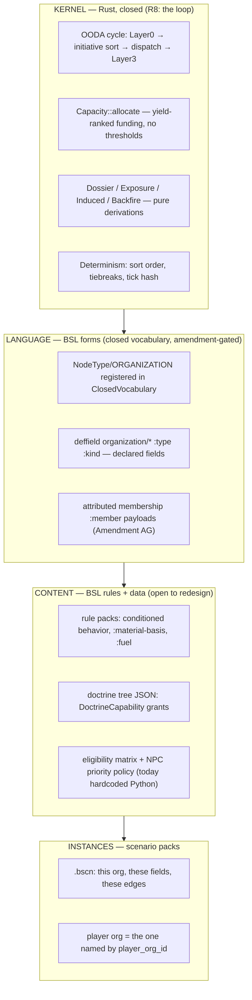

# Organization as Game Object — Design-Inputs Dossier

**Date:** 2026-08-11
**Commissioned by:** the Director, as INPUT to a brainstorm on "Organization as game object: an
abstract base contract content instantiates."
**Compiled by:** seven parallel readers + one synthesis lead. Source sections (scratchpad, not
committed): `section-1-engine-model`, `section-2-verbs-ooda`, `section-3-political`,
`section-4-epochs`, `section-5-ai-corpus`, `section-6-docs-constitution`, `section-7-rust-target`.

**Gap-fill pass (same day, eight further readers).** An adversarial critic found eight sources the
sweep never touched; each was read in full and merged here. They are: `reports/bsl-gap-analysis-2026-08-10.md`
(the worked kernel/content seam decomposition); the **player-facing projection layer**
(`src/babylon/projection/verbs/`, `projection/organization.py`, `projection/fog/`, plus the deleted
Ratatui `views/verbs.rs`/`views/peek.rs` recovered from git); the **test estate** (`tests/`, per
CLAUDE.md's own "tests are the behavioral contract" doctrine); **Constitution I.21** (dropped from
synthesis despite P1 tier); the **dormant LIQUIDATE death rule** and the retired KeyFigure estate;
four already-commissioned **historical dossiers** (organizational-methods, funding-verb, heat-system,
social-topology); the **BSL conformance corpus** (`babylon-bsl/tests/conformance/`); and the
**Ledger's org-instance data grounding**. Where a gap-fill corrected a claim, the correction is
stated and attributed — the superseded claim is not silently deleted.

**What this document is.** An evidence base, not a design. Every claim carries a `file:line`
citation or a verbatim quote. Where sources disagree, the disagreement is recorded rather than
resolved (§6). Where a question can only be settled by the Director — because it touches the
ideological line, a primitive, or v1.0 scope — it is filed in §5 and NOT pre-decided here.

**What this document is not.** It does not propose the target design. §4 translates the Director's
own phrasing ("an abstract base contract content instantiates") into the Rust/BSL substrate
*honestly* — naming what exists, what is stipulated but unbuilt, and every language gap in the
way with its known train. That is still input.

---

## Reading order for the brainstorm

1. **§3 first** if you want the walls. The law is short and several clauses are hard.
2. **§1** for what is actually built and running (or built and dormant).
3. **§5** is the payload — 20 numbered questions, each with evidence pro/con.
4. **§6** if a claim in §1–§4 feels wrong; the disagreement is probably recorded there.

---

# 1. WHAT AN ORGANIZATION IS TODAY

## 1.1 The one-sentence ontology

The vocabulary sentinel carries the canonical definition, and ADR184 cites it verbatim as law:

> **"ORGANIZATION: A collective actor that observes and acts (OODA)."**
> — `src/babylon/models/enums/topology.py:34`

Drawn against its two neighbours in the same docstring (`topology.py:35,37`):

> "INSTITUTION: A durable apparatus housing organizations."
> "SOVEREIGN: A political authority claiming territories."

Three sharp lines: **Organization = the acting collective subject**; **Institution = the durable
house an organization can live inside**; **Sovereign = the territorial claim layer**.

A live constitutional test of Organization-hood already exists in the migration layer: the legacy
record "Systemic Racism" is dropped at conversion time because it is *"not an organization (social
relation per Constitution I.16)"* (`src/babylon/domain/organizations/migration.py:50-51,90-91`).
A social relation is not eligible to be an Organization. That is a real, enforced boundary.

## 1.2 The frozen Python object — 22 base fields, 4 closed subtypes

`src/babylon/models/entities/organization.py:116-238` — a frozen Pydantic `BaseModel`
(`model_config = ConfigDict(frozen=True)`), dispatched as a discriminated union
(`organization.py:432-436`):

```python
OrganizationType = Annotated[
    StateApparatus | Business | PoliticalFaction | CivilSocietyOrg,
    Field(discriminator="org_type"),
]
```

| Field | Type | Default | Meaning |
|---|---|---|---|
| `id` | `str` | — | unique identifier, `min_length=1` |
| `name` | `str` | — | human-readable name |
| `org_type` | `OrgType` | — | the discriminator |
| `class_character` | `ClassCharacter` | — | **which class this org objectively serves** |
| `cohesion` | `Probability` | 0.1 | internal unity and coordination |
| `cadre_level` | `Probability` | 0.0 | leadership quality |
| `budget` | `Currency` | 0.0 | available resources |
| `legal_standing` | `LegalStanding` | REGISTERED | SOVEREIGN/CHARTERED/REGISTERED/INFORMAL/UNDERGROUND |
| `consciousness_tendency` | `ConsciousnessTendency` | LIBERAL | ideological tendency pushed on communities |
| `territory_ids` | `list[str]` | `[]` | territories where the org operates |
| `headquarters_id` | `str \| None` | None | must be in `territory_ids` |
| `heat` | `Probability` | 0.0 | state attention level |
| `is_institution` | `bool` | False | **DEPRECATED** (Feature 040) |
| `institutional_persistence` | `float \| None` | None | **DEPRECATED** (Feature 040) |
| `member_node_ids` | `list[str]` | `[]` | key-figure / cadre node ids |
| `acquired_doctrine_ids` | `tuple[str,...]` | `()` | Doctrine Tree nodes acquired, in order |
| `theoretical_labor` | `float` ≥0 | 0.0 | the doctrine-tree currency |
| `doctrine_tags` | `dict[DoctrineTag,float]` | `{}` | decaying per-tag strength (0.55%/tick) |
| `congress_tag_snapshot` | `dict[DoctrineTag,float]` | `{}` | tag baseline at last Party Congress |
| `study_target_id` | `str \| None` | None | player-directed Educate(Doctrine) study order |
| `office_tenure` | `float` ≥0 | 0.0 | tenure-ticks holding office (P25 U11) |
| `institutional_pull` | `float` [0,1] | 0.0 | officeholder capture drift (Michels) |

Three `model_validator` invariants (`organization.py:240-264`): `headquarters_id` must be in
`territory_ids`; `institutional_persistence` must be `None` when `is_institution` is `False`;
setting either deprecated field fires a `DeprecationWarning` at construction.

**The base/superstructure split is baked into the type.** `class_character` (which class the org
*objectively serves*) and `consciousness_tendency` (what it *believes*) are independent fields the
engine expects to diverge:

> "Which class an organization objectively serves (Feature 031). **May differ from the
> organization's stated mission or membership composition.** Determined by material analysis of
> the organization's structural role in class reproduction."
> — `src/babylon/models/enums/social.py:107-121`

### The four subtypes

- **`StateApparatus`** (`organization.py:267-332`) — "Wields state violence and surveillance."
  Adds `jurisdiction`, `violence_capacity`, `surveillance_capacity`, `legal_authority`,
  `intel_methodology: IntelMethodology` (Sparrow-grounded: `centrality_analysis`,
  `equivalence_analysis`, `template_matching`, `temporal_analysis`, `observation_ceiling`, with
  three presets `local_pd()`/`fusion_center()`/`fbi()` at `organization.py:35-113`),
  `factional_alignment: StateFaction`, `faction_balance`, and `rng_seed` — required whenever
  `faction_balance` is set, or the tiebreaker silently falls back to OS entropy, "a real
  non-determinism bug" (`organization.py:283-287`).
- **`Business`** (`organization.py:335-380`) — the only subtype carrying Marx's triad directly:
  `constant_capital` (c), `variable_capital` (v), `surplus_value` (s), plus `sector`,
  `naics_2digit`, `employment_count`, `surplus_extraction_rate`, `revenue`.
- **`PoliticalFaction`** (`organization.py:383-406`) — `ideology: str`, `is_player: bool`,
  `relationship_to_player: str`. **See §6.1 — `is_player` is retired in practice.**
- **`CivilSocietyOrg`** (`organization.py:409-428`) — `service_type`, `legitimacy` (which doubles
  as the credibility factor in the consciousness-effect formula).

**Subtype is a capability gate, not decoration.** `EMPLOY` is Business-only; `INFILTRATE` is
StateApparatus-only; `EXPROPRIATE` is PoliticalFaction-only; `LOCKOUT` is Business-only; `POGROM`
is PoliticalFaction-only (`src/babylon/ooda/action_eligibility.py:23-170`).

## 1.3 Membership, composition, topology — computed, never stored

`Organization` maps to `NodeType.ORGANIZATION` on the graph (`models/world_state.py:749-750`).
Edge vocabulary (`models/enums/topology.py:99-127`):

| EdgeType | Direction | Meaning |
|---|---|---|
| `MEMBERSHIP` | Organization → SocialClass | weighted by population |
| ~~`RECRUITMENT`~~ | Organization → SocialClass | active pipeline — **RETIRED by ADR176 (34)** |
| ~~`EMPLOYMENT`~~ | Business → SocialClass | employer relationship — **RETIRED by ADR176 (34)** |
| `COMMAND` | member → member | internal hierarchy |
| `PRESENCE` | Organization → Territory | operational footprint (auto-derived from `territory_ids`, `world_state.py:748-754`) |
| `TRANSACTIONAL` | Organization → Community | service-for-support |
| `SOLIDARISTIC` | Organization → Community | deep mutual commitment |
| `ANTAGONISTIC` | org ↔ org | manufactured conflict (Feature 039) |
| `HOUSES` | Institution → Organization | housing relationship (Feature 040) |

**Two of these are already dead by ruling.** ADR176 (34): "The five dead edge types RETIRE
(TARGETS, OWNED_BY, JURISDICTION, **RECRUITMENT**, **EMPLOYMENT**); re-mint under BSL in Phase 2
with their own vocabulary ceremony." Any Organization edge vocabulary carried into Rust starts from
a **reduced** set, and re-minting one is a declared ceremony, not a free choice (Q15).

`src/babylon/domain/organizations/` supplies **pure calculators producing frozen result types,
never fields on the model**: `class_composition`/`lifecycle_composition` walk `MEMBERSHIP`
out-edges and bucket by attribute (`composition.py`); `effective_capacity` weights youth 0.0 /
adult 1.0 / elder 0.2 (BLS 65+ LFPR-derived, `config/defines/organizations.py:389-394`);
`classify_topology` extracts the undirected `COMMAND` subgraph and classifies STAR / HIERARCHY /
MESH / CELL (`topology.py:103-127`).

> **"Derived from COMMAND edge subgraph analysis — NEVER stored on the Organization model.
> The graph speaks the truth."** — `models/enums/topology.py:161-162`

`cohesion_loss_on_removal(current, removed_count, defines)` computes the decapitation arithmetic
(`new = current − removed_count × loss` — 0.2/figure, floored at `min_cohesion_threshold` 0.05, so
it never reaches zero) but **nothing calls it to actually dissolve an org** (§1.7). It is uncalled
anywhere outside its own module and re-export.

**And the members it would remove no longer exist as a model.** `NodeType.KEY_FIGURE` survives
only to type `classify_topology`'s COMMAND-edge *test fixtures*: the backing `KeyFigure` model and
`WorldState.key_figures` were formally retired under III.10 (ADR084, 2026-07-18) —

> "No scenario, seed, OODA system, or bridge in this engine version ever populated
> `WorldState.key_figures` … and the field no longer exists at all after it."
> — `src/babylon/projection/key_figure.py:11-18`

`project_key_figure()` never touches the graph (both params carry `# noqa: ARG001`, signature
parity only) and `key_figure_statblocks()` returns `()` unconditionally — *"not a withheld or
truncated result, the honest and complete one for a kind with no live producer"*
(`key_figure.py:106-107`). So the COMMAND topology classifier is a live calculator over a node type
nothing produces, and the decapitation arithmetic has no member to remove.
`docs/reference/organizations.rst` still teaches the whole estate in the present tense, including an
`import KeyFigure` line that **fails at runtime** and a function `identify_key_figures()` that does
not exist (§6.26).

## 1.4 Capacity — ADR184, the most recent and most load-bearing ruling

`ai/decisions/ADR184_capacity_belongs_to_organizations.yaml` (2026-07-30, Director-ratified
in-session). Context: Lane A's heat reformulation split the old `[0,1]` heat scalar into L
(dossier) / K (capacity) / X (exposure); K shipped **ownerless** — a bare `BTreeMap<String,u64>`
whose module doc "said 'the state' eleven times," with a `Candidate` that carried a target and
no actor. Verbatim diagnosis:

> **"An action aimed at someone, proposed by nobody."** — ADR184:19

Three grounding facts the ADR cites: (1) "the state" is not a `NodeType` — a budget owned by "the
state" is owned by nothing in the ontology; (2) the frozen Python engine **built the same
construct twice** (`state_finance.py` treasury/police_budget/tax_rate/tribute_income vs
`revolutionary_finance.py` war_chest/operational_burn/dues/expropriation/donor) — "same shape…
under two vocabularies"; (3) `Organization` already carried `budget`, `violence_capacity`,
`surveillance_capacity`, so the owner already existed.

**The ten rulings** (ADR184:47-169), the substantive ones verbatim:

- **R1** — Capacity belongs to organizations. `Capacity` carries `owner: NodeId` and has **no
  `Default`**; "an unowned budget is the error this ADR removes."
- **R2** — `Candidate.actor: NodeId`; `allocate()` rejects a candidate whose actor ≠ owner (loud
  `GraphError`, III.11).
- **R3** — **"REPRESSION AND REVOLUTIONARY ACTION ARE THE SAME ALLOCATION. A union local and a
  political police force both rank what they could do by yield per unit spent and fund down the
  list until the money runs out. Neither side gets a privileged mechanic. The allocator cannot
  tell a police budget from a strike fund, and that is the point."**
- **R4** — **"THE CLASS DIFFERENCE LIVES IN REPLENISHMENT, NOT IN ALLOCATION."** Tax and tribute
  on one side, dues and expropriation on the other — "the SIZE of the budget and the RELIABILITY
  of its sources — never a special rule in the ranking."
- **R5** — Φ may fund capacity, currency→currency, no coefficient. **"The Fundamental Theorem does
  mechanical work: imperial rent buys the repressive budget."**
- **R6** — do NOT transcribe `RevolutionaryFinance.heat`; it is exactly the object L/K/X replaced.
- **R7** — `StateFinance` and `RevolutionaryFinance` **collapse to one construct at the port**.
- **R8** — capacity is `Currency` (kernel i128 micro-units), not an abstract unit: an abstract
  unit "would need a declared currency-per-unit rate to accept imperial rent, and THAT RATE IS
  THE UNDERIVABLE COEFFICIENT ADR172 r5 FORBIDS."
- **R9** — declines are typed (`AllocationOutcome{funded, declined}`, `Declined{candidate,
  remaining}`) — "'wanted the raid, could only afford the wiretap' is the narratable fact…
  **CONSTRAINT IS THE PEDAGOGY.**"
- **R10** — every actor holds a `Dossier`; asymmetry lives in the resolution path, never the type:
  **"a state resolves by SPENDING a surveillance instrument it must fund; a movement resolves by
  BEING embedded in structures it already stands in, which costs nothing and reaches only that
  far."**

The shipped code (`rust/crates/babylon-graph/src/capacity.rs`, 846 lines) states the design's
sharpest claim in its own module doc:

> **"This module is where escalation stops being a threshold."** … "Here an actor has a finite
> budget per instrument, ranks what it could do by yield per unit spent, and takes candidates in
> that order until the budget runs out. Escalation is what *happens* when a target rises in that
> ranking. **There is no threshold constant in this file and none may be added** — a reviewer
> finding one has found a bug." — `capacity.rs:23-31`

Two consequences fall out of the arithmetic rather than a coded branch (`capacity.rs:33-43`):
*"Repression against a distributed organization declines itself"* (a redundant target's yield
divides down via `exposure.rs`'s replaceability quotient — "Nothing anywhere says 'if the org is
distributed, skip it.'"), and *"Disinformation is the cheapest mode by state capacity and among
the most expensive by movement cost — which is exactly why it dominates the historical record.
That is the ranking's arithmetic, not a designer's thumb."*

Test names are the behavioral contract: `an_organization_spends_only_its_own_means`,
`the_same_allocation_serves_a_movement_and_a_police_force`,
`escalation_is_what_a_bigger_budget_buys_not_a_threshold_crossing`,
`a_redundant_target_declines_the_strike_by_itself`,
`imperial_rent_funds_the_budget_with_no_conversion`,
`an_organization_with_no_capacity_can_see_but_not_act` (`capacity.rs:385-846`).

The four sibling Lane A modules complete the picture (all pure functions over `NodeId` handles):

- **`dossier.rs`** — L, one actor's partial belief-state. *"a movement misreads the apparatus
  exactly as the apparatus misreads a movement"* (`dossier.rs:8`). **"There is no threat score
  here, and none may be added.** Sparrow's conscious-opponent argument forbids an accumulated
  priority: an opponent who knows he is being ranked reorganizes" (`dossier.rs:41-44`). Pinned by
  `the_state_can_be_wrong_about_what_a_strike_would_yield` — *"If these two ever agree by
  construction, the engine has granted the state free omniscience and this whole split is
  decoration"* (`dossier.rs:413-414`).
- **`exposure.rs`** — X, derived-never-stored strike value:
  `decapitation_value = Δφ(v) / |signature-class(v)|`, "Sparrow's targeting rule, verbatim"
  (`exposure.rs:250-273`). Pinned by
  `decapitation_fails_against_a_distributed_org_without_a_coded_exception` (`exposure.rs:415-436`).
- **`induced.rs`** — org↔org adjacency induced from base edges, no new edge type: *"Two
  organizations that organize the same class or hold presence in the same territory share an
  exposure"* (`induced.rs:3-10`). **This is the only place production code names
  `org --MEMBERSHIP--> social_class` / `org --PRESENCE--> territory` as the intended edge
  vocabulary.**
- **`backfire.rs`** — whether repression radicalizes: *"Indiscriminate force does not have a fixed
  sign… what differs is how many of the affected people stood inside a structure when it
  happened"* (`backfire.rs:4-8`).

## 1.5 The verb surface

**Two asymmetric verb type systems by design.** `ActionType` (26 members, the org/player
vocabulary, `models/enums/actions.py:32-93`) and `StateActionType` (6 top-level + ~24 sub-verbs,
`models/enums/organizations.py:63-89`):

> **"The type system enforces asymmetry: the state cannot EDUCATE or STRIKE; the player cannot
> LEGISLATE or DISPLACE."** — `models/enums/organizations.py:66-69`

Of 26 `ActionType`s, **nine** have a real player resolver (`engine/actions/__init__.py:58-68`,
"the single source of truth mapping ActionType -> resolver"). A missing resolver is a loud
failure, never a silent success (`__init__.py:91-97`).

| Article V verb | `ActionType` | Resolver | Precondition / gate | Material effect |
|---|---|---|---|---|
| Educate | `EDUCATE` | `educate.py:46` | `doctrine_node_id` picks the sub-verb; study refuses loud if node unknown / is a trap / already acquired | 5-factor `ConsciousnessDelta` + mass-work SOLIDARITY write; or sets `study_target_id` |
| Reproduce | `RECRUIT` | `reproduce.py:37` | `mass_recruitment` needs `budget ≥ 5.0` | `cadre_training`: +0.05 cadre, +0.02 cohesion; `mass_recruitment`: −5.0 budget, −0.05 cohesion |
| Attack | `ATTACK_INFRASTRUCTURE` | `attack.py:31` | none | raises the **acting org's own** heat; target infrastructure decrement applied by Layer 3 |
| Mobilize | `PROTEST` | `mobilize.py:102` | `sub_mode=canvass` requires `grants_edge_type(…, MEMBERSHIP)` | heat/agitation; backfire at `turnout>100` emits `EXCESSIVE_FORCE` (the "George-Floyd spark"); canvass mints the engine's **only** `MEMBERSHIP` edge, weight deliberately `<1` — *"the surge is real, the power is not"* (`mobilize.py:193`) |
| Campaign | `PROPAGANDIZE` | `campaign.py:67` | `election:run` / `election:boycott` each require the matching `verb_mode` capability | consciousness delta; boycott converts a live T-7 disillusion window to agitation and pays `sect_isolation_rate` MASS_LINK decay every use |
| Aid | `PROVIDE_SERVICE` | `aid.py:41` | transfer fails loud if `budget < transfer` | consciousness delta + optional budget→wealth transfer; SOLIDARITY write happens even if the transfer fails |
| Investigate | `MAP_NETWORK` | `investigate.py:47` | player+territory gated on `mass_receptivity ≥ investigate_min_receptivity` — *"The investigation fails. The people do not trust you. You must first do mass work to earn their trust."* (`investigate.py:99-103`) | **no material graph state**; reveals attributes, writes `investigation_intel` |
| Move | `MOVE` | `move.py:27` | target must be an existing territory | rewrites `territory_ids`/`headquarters_id` |
| Negotiate | `PROPOSE_ALLIANCE` | `negotiate.py:57` | classic: `cohesion + cadre_level ≥ 0.1`; `mode=coalition` bypasses the leverage gate, requires `negotiate:coalition` | flips an antagonistic edge to TRANSACTIONAL; coalition stamps `edge_mode=CO_OPTIVE` + `co_optive_dependence`, feeding the liquidationism tracker |

NPC-only verbs resolve inside `ooda/action_effects.py` (AGITATE, REPRESS/SURVEIL, ASSIMILATE, the
three fascist verbs). One behavioral gem worth carrying: repression of an *organization* has no
`repression_faced` field to write, so the increment propagates to its SOLIDARITY-linked class
base — **"State violence against an organization IS violence against its class base"**
(`action_effects.py:245-247`). The test estate records *why* it must propagate rather than write
directly: a bump on the org "is dropped silently on the next `WorldState.from_graph()` round-trip
(Aleksandrov Test: fabricated, not material)" (`tests/unit/ooda/test_action_effects.py:751-761`).

**But NPC organizations mostly do not yet do what the player's organization does.** This is the
test estate's sharpest finding and it directly qualifies the symmetry claim in §4.3. All nine
player verbs resolve through `resolve_player_action` with real, asserted graph effects; NPC-issued
verbs are still the pre-W1 blind summary wrap. `TestNpcDriverGetsMaterialRepressionEffect` proves
REPRESS/SURVEIL for `StateApparatus` orgs was wired to the real `resolve_action` machinery — and
its own control test, `test_other_npc_verbs_still_use_the_plain_summary_wrap`, proves the opposite
for everyone else: a `POLITICAL_FACTION` NPC's default-priority EDUCATE carries
`direct_effects == {}` (`tests/unit/ooda/test_ooda_system.py:402-492`). Only REPRESS/SURVEIL for
StateApparatus plus the four fascist verbs have real effects on the NPC side. **The dispatch path
is symmetric; the effects are not, yet** (§6.32).

### OODA — the loop

`OODASystem.step` (`engine/systems/ooda.py:108-265`) is three phases: Layer 0 (every Business
auto-emits `EMPLOY`; Business orgs are then *skipped* in the action phase) → the initiative-ordered
Action Phase → Layer 3 consequence propagation (heat, edge transitions, infrastructure,
contestation). Initiative score = `speed + institutional + counterintel + embeddedness + momentum`
(`ooda/initiative.py:22-67`), sorted descending with `org_id` ascending tiebreak (III.7).
`OODAProfile` (`ooda/types.py:21-86`) is the per-org action contract: `sensor_latency`,
`ideological_coherence`, `analytical_capacity`, `decision_mode` (AUTOCRATIC 1.0 / DELEGATE 2.0 /
DEMOCRATIC 3.0 / CONSENSUS 5.0), `bureaucratic_depth`, `action_points`, `coordination_range`,
`autonomy`.

**Player and NPC share the identical dispatch path.** Player actions arrive via
`context.persistent_data["player_actions"][org_id]`; `_resolve_for_organization` checks that dict
first and falls through to NPC selection only if absent (`ooda.py:175-178,311-333`). There is no
separate player verb engine and no player-only `OrgType`.

### Doctrine capability gating

`DoctrineCapability` (`models/entities/doctrine.py:26-61`, frozen, `extra="forbid"`) has three
fields: `verb_modes`, `edge_types`, `cadre_valve_decouple`. Its docstring states the inversion:

> *"What acquiring a doctrine node GRANTS — capability rewires, not punitive static `tag_deltas`"*
> … *"the five electoral stances carry rich capabilities and ZERO `tag_deltas`"*
> — `doctrine.py:27-34`

Three live gate sites, grep-complete: `mobilize.py:145-153` (canvass → MEMBERSHIP edge type),
`campaign.py:99-105` (election run/boycott), `negotiate.py:95-103` (coalition). All refuse
**loudly**, never falling back to the ungated path, and the gate is data-driven:

> *"nothing here enumerates stance ids. Adding a stance to `doctrine_tree_mvp.json` with a
> `capabilities` block is the only step needed to grant a tactic."* — `_capability.py:13-15`

A second, independent doctrine mechanism runs alongside: accumulated `CLASS_ANALYSIS` multiplies
consciousness delta and `MASS_LINK` continuously amplifies SOLIDARITY gain — *"a CONTINUOUS
amplification, not a binary gate: an org with `MASS_LINK == 0` still organizes… doctrine makes it
organize BETTER"* (`_mass_work.py:26-30`).

## 1.6 Political machinery (Program 25)

Five systems layer political character onto org attributes, none of it hardcoded.

**DoctrineSystem @14.7** (`engine/systems/doctrine.py`) — a per-org 5-step tick loop: decay every
tag by 0.55%/tick ("unexercised theory fades"), accrue `theoretical_labor = study_allocation ×
cadre_level` (*"theoretical labour is intellectual work, so a party's cadre quality (not its
material budget) is the apt capacity measure"*, `doctrine.py:9-12`), bootstrap the free root,
greedily auto-acquire the cheapest affordable unlocked non-trap node, fire any reachable trap
whose DSL condition evaluates true — **involuntarily**.

Every `congress_interval_ticks` the **Party Congress** convenes first: one purge attempt against
the first held trap, resolved by a seeded RNG draw weighted by tag-vector movement since the last
congress, with the theoretical-labor cost paid on the *attempt*, win or lose
(`domain/doctrine/congress.py:16-19,74-82`). Line-splits keep the newest stance and shed the rest,
assets converting below par — *"electeds rarely follow you out; canvass-cadre skills don't convert
at par"* / *"hysteresis, 'you become what you do'"* (`doctrine.py:484-485`).

**The deliberate namespace split** is the architectural core of U11: `DoctrineTag` (3 values,
accumulated, acquisition-driven) vs `PracticeVariable` (5 values, **I-FRESH, read fresh each tick
from the org's graph position, NEVER accumulated** — `models/enums/doctrine.py:64-68`,
*"A namespace DISTINCT from `DoctrineTag` — the charter's 'do NOT fake pseudo-tags' rule"*).
`liquidationism`'s trap condition is a pure `PracticeVariable` expression with `cost_tl: 0`
(`doctrine_tree_mvp.json:144-158`):

> *"you are not told you liquidated; you measurably did"* — `doctrine.py:171-172`

**Officeholder capture** (`doctrine.py:270-310`): while seated, `office_tenure` accrues and
`institutional_pull` drifts toward 1, **resisted by `cadre_level × cohesion`** — "Michels' iron law
as a RATE… not a destiny." An org whose stance sets `cadre_valve_decouple` (only
`abstention_boycott`) accrues tenure but zero pull — *"it does not seat its cadre in the assembly,
so there is no cadre to convert."*

**AllegianceSystem @17.42** — party platforms are **computed fresh every tick** from
MEMBERSHIP-edge class interests plus a donor term ("the donor's material interest IS capital's",
`allegiance.py:307-309`), never a stored field. The valve:

> *"SOLIDARITY bridges present ⟹ the boost lands in organization (the Bernie→DSA surge); bridges
> absent ⟹ the excess routes into `fascist_delta` … (the Obama→Trump pipeline). **The game never
> chooses; the topology chooses.**"* — `allegiance.py:461-464`

**ElectoralSystem @17.45** — FPTP counts, government formation ("An elected government steers the
existing state, it does not replace it", `electoral.py:135`), legitimation refresh ("a walkover
manufactures less consent than a contest"), L-SUSPEND, T-7 disillusion routing. Doctrine stances
gate electoral mechanics directly: `independent_ballot_line` → spoiler arithmetic (*"the
lesser-evil arithmetic can seat the greater evil — 'heightening the contradictions' as a mechanical
loop the player owns"*, `electoral.py:756-757`); `entryism` → derecognition (terminal, no
re-recognition path); `entryism`/`governance_road` → the popular-front COMMIT arm (*"defending the
state walks the org toward liquidationism with no punitive delta anywhere"*,
`electoral.py:502-504`).

**PolicySystem @17.47** — LEGISLATE's resolver and the **reform ceiling**
(`SW_deliverable = min(SW_promised, t_claim + φ_share·Φ_inflow − debt_service)`), the entryist host
discipline clamp ("the duopoly governs through the status quo ante… capital reacts to the platform
attempted, not the fraction permitted", `policy.py:371-378`), the per-class delivery ledger
("**the single most load-bearing new quantity of the design**", `policy.py:591-594`), and the
governance fork: RUPTURE requires organs of dual power **AND** `institutional_pull < capture
threshold`, else CAPITULATE — *"a governing party without organs of dual power administers the
veto (SYRIZA 2015)… a party captured by its own office administers it too (Michels)"*
(`domain/politics/governance_endgame.py:11-15`).

**StruggleSystem @16.0** is, on inspection, a **class**-agency system with almost no org-facing
surface — one register read (`electoral_governments` for the legitimation-backfire multiplier,
`struggle.py:242-264`). UPRISING / SPONTANEOUS_RIOT / POWER_VACUUM carry no `org_id`.

## 1.7 Lifecycle — the negative finding

**No system in the frozen Python engine creates or destroys an Organization node at runtime.**
Grep-verified across every candidate:

- `CommunitySystem` (675 lines) only *reads* orgs to compute community consciousness.
- `LifecycleSystem` (293 lines) has **zero** organization references — it is the human D-P-D'
  population circuit. There is no organization-lifecycle system in the engine at all.
- `FascistFactionSystem` accrues chauvinism on MEMBERSHIP edges and fires
  `ORGANIZATIONAL_FRACTURE` / `RED_BROWN_COUP` **as bus events only** — no `remove_node` call
  exists in the file. Its own docstring admits the chauvinism accumulator cannot survive
  `from_graph()` round-trips and that "the base canonical world seeds no player orgs" for that
  path (`reactionary.py:296-305`).
- The two systems `NodeType`'s docstring names as runtime node-minters mint `SOCIAL_CLASS`
  (`decomposition.py`) and `SOVEREIGN` (`collapse_transition.py`) — never `ORGANIZATION`.

Organizations are **scenario-literal at authoring time and immortal at runtime**. What exists
instead are three *absorbing partial deaths*, all leaving the node alive: derecognition
(`electoral.py:573-577`, terminal), liquidationism (`doctrine_tree_mvp.json:144-158`, absorbing),
and the Allende geometry (`electoral.py:880-888` — the seat is stripped, the node survives).

The one documented *creation* mechanism in the whole corpus belongs to Institutions, not the
player: `Institution.spawning_blueprints` → `ReproductionEvent` spawns a replacement Organization
when a housed one is destroyed (`docs/reference/institutions.rst:223-249,328-350`).

### The death rule that exists and is unreachable (gap-fill correction)

"Nothing kills one" is right at the *system/tick* level and **wrong as a whole-repo claim**. A
complete, defines-backed, unit + contract + integration-tested organizational death rule exists:
`resolve_liquidate` (`src/babylon/ooda/state_ai/repress_effects.py:307-371`) removes a key-figure
id from `target_org["key_figure_ids"]`, applies a fixed coherence hit, computes a legitimacy cost
halved above a deniability threshold, and returns

```python
# Singleton collapse
org_collapsed = is_singleton
```

Four things keep it inert, and they are four different failure modes, not one:

1. **The wire is cut at a named line.** The *decision* is live every tick — `RuleBasedStateAI.select_action()`
   scores INFILTRATE / RAID / PROSECUTE / LIQUIDATE with real utility weights and Sparrow topology
   scores, reachable from `OODASystem`. But the `StateAction → Action` converter throws the sub-verb
   away for everything except LEGISLATE (`npc_stub.py:495-503` stamps a bare
   `action_type=ActionType.REPRESS` with no `params={"state_sub_verb": …}`, where the LEGISLATE
   branch immediately above it *does* stamp one). **The RAID/PROSECUTE/LIQUIDATE choice computed
   every tick is discarded at that conversion boundary.** All four `repress_effects` resolvers have
   zero production callers; they are exercised only by tests (ADR109 "designed, tested, dormant").
2. **It would no-op on field name even if wired.** Every function in `repress_effects.py` reads and
   writes `coherence` (`target_org.get("coherence", 1.0)`), a key `Organization` does not declare —
   the model's field is `cohesion`. This is exactly the attribute-shape bug the vocabulary sentinel
   exists to catch: damage always computes off the hardcoded `1.0` fallback and lands on a key
   nothing consumes (§6.28).
3. **`is_singleton` has no production producer.** It is a caller-supplied `bool` set only by
   hardcoded test literals; the machinery that would compute it (`classify_topology`,
   `identify_key_figures`, the `KeyFigure` model) is itself dead by ADR084 (§1.3).
4. **The defines advertise a mechanic the code does not implement.**
   `liquidate_singleton_collapse_chance = 0.7` ("P(org collapses if singleton leader liquidated)",
   `config/defines/state_apparatus.py:432-437`, mirrored into `defines.yaml:834` and the Rust
   canonical-defines fixture) has **zero readers**: collapse is a deterministic pass-through of
   `is_singleton`, not a roll (§6.27). Whoever wires this chooses between two different games —
   delete the coefficient and keep deterministic collapse, or actually roll against it.

The live Rust echo of the same idea is `exposure.rs`, which computes `decapitation_value`,
`removal_differential` and `giant_component_fraction` over org-internal networks whose member nodes
are typed `"cadre"` in its fixtures — *"`X` is derived, never stored… target priority must be
recomputed from live structure every time it is asked for"* (`exposure.rs:4-6`). That is the design
principle any revived org-death mechanic should be built on, in explicit contrast to the dead
Python `structural_importance` field that tried to *store* the same thing.

## 1.8 The player's seat, as built

- `WorldState.player_org_id: str | None` — *"The organization the player embodies (EH ruling 6,
  owner 2026-07-16)… **orgs stay symmetric — no per-org flag.**"* (`world_state.py:495-505`), a
  graph-level singleton (`G.graph["player_org_id"]`).
- The canonical player org is a **`CivilSocietyOrg`**, id `ORG001`, "Wayne County Organizing
  Committee", `legal_standing=INFORMAL`, `service_type=MUTUAL_AID`, `cohesion=0.5`,
  `cadre_level=0.1`, `budget=100.0`, `heat=0.0` (`engine/scenarios/_legacy_wayne.py:574-595`).
  Its docstring: *"A small, nascent political formation — a reading group that wants to become
  something more. Low resources, low heat, high potential."*
- `GameSession.issue_verb()` is documented as *"The FIRST real write the player can make on the
  world"*; it resolves `player_org_id`, raising `RuntimeError` if absent
  (`game/session.py:1412-1485`). `verb_plate_view()` returns None without one — "an honest absence
  (Constitution III.11), never a fabricated plate for an org that does not exist."
- Fog/epistemic reach is computed relative to `player_org_id` — the player's vision is a property
  of *which org the player is*, symmetric with every other org's.

**And it has never been played.** ADR126 (2026-07-22):

> *"the player cannot currently issue a single action in the shipping TUI. All nine Article V verbs
> have real, non-stub resolvers in the engine dispatch table, but `submit_verb` has zero production
> callers, `render_verb_plate` is never mounted, and the palette is navigation-only."*

The Player Interface Shell plan approved to fix that targeted the Ratatui client, which Amendment
AF (ADR186, 2026-08-10) **deleted outright**; `babylon-client` (Bevy) is standing up now. The
player-as-organization loop has been architecturally real and player-unreachable across two
successive client generations.

## 1.9 The verb as a base contract, on the player's side

The engine's answer to "what is a verb" is a resolver. The *player's* answer is a row — and the
closest thing in the repo to a formal verb ABC is `VerbRow`
(`src/babylon/projection/verbs/view_models.py:44-78`), frozen, `extra="forbid"`, eight fields:
`verb`, `eligible`, `reason`, `remedy`, `can_afford`, `afford_note`, `preview`,
`candidate_target_ids`. This layer went entirely unread by the first sweep and it is where the
"abstract base contract" the Director asked about already half-exists.

**Two gates, deliberately never collapsed into one boolean:**

> "`eligible`: Target-existence predicate result — **the UI disables on this alone, never on
> affordability**." … "`can_afford`: Affordability via the same check that gates submission, **so
> the plate can never disagree with a rejection**." — `view_models.py:48-53`

A verb can be `eligible=True, can_afford=False` — legal but currently unaffordable — and the
contract is to *render* it with an honest `afford_note`, never hide it. "The plate can never
disagree with a rejection" appears verbatim in three files (`view_models.py:53`, `plate.py:10-11`,
`submit.py:8`): a load-bearing cross-module invariant, not a one-off comment.

**`VerbPlateView`** (`view_models.py:80-95`) is one `org_id`, one `tick`, and a **9-tuple of
`VerbRow` in canonical order** — the order is `preview.py:25-35`'s `VERB_TO_ACTION_TYPE` dict
iteration order (educate, reproduce, attack, mobilize, campaign, aid, investigate, move, negotiate),
which F1–F9 zip positionally.

**`build_verb_plate`** (`plate.py:40-155`) is a pure function doing **one bounded graph pass** that
accumulates the eligibility boolean AND the backing candidate-id list in lockstep, so
"eligibility must never launder a fixture into `eligible: true`" (`plate.py:17`).
`candidate_target_ids` is "never a fabricated id beyond what that pass actually found" — which is
what lets the write side derive an honest target without re-touching the graph. One oddity in the
uniformity: **`reproduce`'s eligibility is hardcoded `True`** (self-targeting, `plate.py:107`), so
its ineligibility copy row is unreachable in normal play.

**Preview honesty is a two-tier seam, not uniform.** `preview.py:1-11` states it: EDUCATE, CAMPAIGN
and AID call **the same pure helper the real resolvers call**
(`ooda.action_effects.compute_consciousness_delta`), so "preview == resolution (spec-116 FR-4.4)";
the remaining verbs (`attack`, `mobilize`, `reproduce`, `investigate`, `negotiate`, `move`) use
**documented hand-coded heuristics** — e.g. `success_probability = min(0.8, 0.3 + org_cohesion*0.4)`
(`preview.py:162-186`). Any "abstract base contract" narrative has to carry this asymmetry:
*eligibility and affordability are exact; the preview is exact for three verbs and heuristic for
six.* (Those heuristic constants are also, incidentally, stipulated forms of the kind §3.4 bars.)

**Ineligibility copy is treated as a verifiable claim about the game's own capabilities**, not
flavor text — "every remedy names only capabilities that exist" (`copy.py:13`), with a fixed bug
preserved as a cautionary tale:

> "EDUCATE's remedy … previously promised NO action, on the reasoning that nothing could create an
> organized community … That was an accurate description of a BUG, not of the domain… **Copy that
> describes a defect as though it were a rule outlives the defect and becomes a lie.**"
> — `copy.py:17-26`

**Submission is the one write, and it is an enqueue, not a mutation:**

> "A verb submission is a row in the runtime action queue (`game_turn`) and nothing else: no direct
> graph mutation — the engine's OODASystem folds the queue into the next tick's action phase and
> adjudicates (Ruling R4, Article V atomicity)." — `submit.py:1-6`

Two facts from this seam matter for design. First, **`action_point_cost` is currently cosmetic**:
the M2 seam contract records, as a deviation, that `OODAProfile.action_points` and
`ooda/constraints.py::enforce_action_points` are declared but **nothing in the live path calls
them** — "the live path has only a global `max_actions_total=500`" — and refuses to write the
assertion because it would be "a green test over a dead feature"
(`2026-07-27-m2-seam-contracts.md:193-206`). Every `VerbPreview` shows the player an AP cost no
budget enforces (§6.31). Second, ATTACK alone carries a *second* affordability check in `submit.py`
charging mode-specific labor pools; the other eight fall through to the same `check_can_afford` the
plate used.

**The deleted Ratatui client is the only place a human's fingers ever touched this contract**
(recovered via `git show 7d9f0d94^:rust/crates/babylon-tui/src/views/verbs.rs`, deleted by the
Amendment AF ceremony). Three of its stated invariants are design statements, not UI polish:

- **Nine-verb completeness is a game-level invariant.** A truncated payload is matched back onto
  the canonical order *by verb name* so a dropped verb renders a loud missing-marker at ITS F-key —
  "Article V's nine verbs are 'always available', so a missing row is a caller bug, never silently
  dropped" (`verbs.rs:407-408`).
- **Investigate's three sub-verbs surface faithfully, not collapsed** — `Investigate(Territory)`,
  `Investigate(Org)`, `Investigate(Edge)` render as three named lines sharing one row's
  eligibility/cost/preview and one F-key (`verbs.rs:17-22`). This is the shipped precedent for
  ADR176's sub-mode doctrine (§3.9 rulings 12/15/37).
- **Three states, never two:** absent (`"null"` → honest "no campaign bound") vs unreadable (loud
  crimson) vs present (III.11).

The verb plate was a **permanently visible bottom dock**, not a modal — chronicle rail right,
watchlist rail left, HUD top, wiki/dossier centre (`m2-seam-contracts.md` §6).

**One projection-layer gap the brainstorm must know about.** The MATERIAL / POLITICAL split for
organizations — `MATERIAL_VIEW_FIELDS` (name, org_type, class_character, legal_standing, budget,
territory_ids, headquarters_id, is_institution) vs `POLITICAL_VIEW_FIELDS` (heat,
consciousness_tendency, cohesion, cadre_level), with the canonical fog list at
`fog/filter.py:70-90` — is **DOCUMENTED ONLY, NOT WIRED**. `project_organization` never calls
`apply_fog`; the docstring says outright that a live caller is expected to gate, and names "Lane E
WO-41" as the owner (`projection/organization.py:66-69,375-377`). **Today every field of every
organization projects fully visible.** The declared split *is* machine-checked to partition the
model and to be a subset of the fog list (`tests/unit/projection/test_organization.py`) — the
contract is proven well-formed and never enforced. That is the precursor artifact ADR182's earned
depth (§3.7) sits on top of, and it means INVESTIGATE currently earns the player nothing a free
peek would not already show (§6.30).

A coincidence worth not mistaking for a design: because `OrganizationView` declares all eight
MATERIAL fields *before* the four POLITICAL ones, and the deleted `peek.rs` truncates by field
declaration order at depth 0/1/2 (1/3/6 rows), the low-depth peek tiers were **already, structurally,
a MATERIAL-only view** — an artifact of ordering plus truncation, with nothing stopping a future
field reorder from leaking a POLITICAL field into a hover preview.

---

# 2. WHAT IT WAS MEANT TO BE

The Director's framing for this section: implementation will be off; **intent counts**.

## 2.1 The brainstorm thesis — Organizations ARE the agents

`ai/brainstorms/network/percynotes2.md` (six sequential spec prompts, `020`–`025`, pre-P25) is the
fullest Organization design in the corpus and the direct ancestor of the shipped code:

> **"In Babylon, Organizations ARE the agents. SocialClass and Territory are substrate."** (`:6`)

> *"SocialClass blocks don't act — they're acted upon, recruited from, extracted from.
> Organizations are the entities that make decisions, take actions, have goals. This is orthodox
> Marxism: **a class-in-itself is a statistical category; a class-for-itself requires
> organization.**"* (`:28`)

> *"**Organization**: Voluntary coordination for collective action. Has members, internal topology,
> can be destroyed. **Institution**: Crystallized social relations that reproduce themselves. Has
> legal standing, fixed assets, survives member turnover. … The FBI is an Organization housed
> within the DOJ Institution. A union local is an Organization housed within a labor federation
> Institution."* (`:30-34`)

On OODA as metabolism, and the sharpest pedagogical claim in the brainstorm:

> *"Democratic centralism (Leninist model) is an OODA optimization: centralized decision (fast
> DECIDE phase) with democratic input (better ORIENT phase), disciplined execution (reliable ACT
> phase)."* (`:222-223`)

> *"Cadre labor is the scarce resource — this is why leadership development matters."* (`:274`)

> *"Player org actions come from player input, not AI."* (`:307-308`)

## 2.2 The epochs — three incompatible drafts and one very consistent intent

57 files under `ai/epochs/` read in full. **The epochs never converge on one answer to "what IS an
Organization."** Three architectural shapes coexist, all `PLANNED`, none shipped:

1. **A component riding on SocialClass nodes** (`epoch3/cohesion-mechanic.yaml:186-229`):
   `cohesion`, `entropy`, `cadre_ratio`, `member_count`, `heat_accumulated`.
2. **A standalone entity with a resource sub-model** (`epoch3/vanguard-economy.yaml:739-782`):
   `cadre_labor` / `sympathizer_labor` / `reputation`, three non-fungible currencies.
3. **A first-class `Faction` graph node** (`epoch3/balkanization-spec.yaml`,
   `epoch2-persistence.yaml:230-348`), distinct from Sovereign, carrying `colonial_stance`
   (UPHOLD/IGNORE/ABOLISH — *"**THE FUNDAMENTAL POLITICAL AXIS**"*, `:280`), competing for
   territorial `INFLUENCES`.

Epoch 1 (shipped) has **no Organization entity at all** — only a bare `organization: float` on
class nodes feeding `P(S|R) = Organization / Repression`, framed explicitly as a placeholder for a
not-yet-built mechanic:

> *"Why doesn't revolution happen immediately? Answer: **Organization is too low to act on
> revolutionary consciousness**… revolution is RATIONAL but not POSSIBLE until organization
> builds."* — `epoch1/balance-tuning.yaml:216-223`

That is the founding intent: **Organization is the missing gate between correct consciousness and
actual revolutionary capacity.**

### The laws the epochs wanted

- **The Transmission Law** — `Effective_Transmission = min(Solidarity_Strength, Cohesion_Level)`:
  *"You cannot transmit revolutionary energy through a broken organization. A 0.9 Solidarity edge
  through a 0.2 Cohesion org delivers only 0.2. The excess dissipates as 'Heat.'"*
  (`cohesion-mechanic.yaml:96-100`)
- **The Scale Law** (Michels, formalized) —
  `Entropy_Growth = base_rate × log(Member_Count+1) × (1 − cadre_ratio)`. Epigraph: *"Who says
  organization, says oligarchy."* (`cohesion-mechanic.yaml:6,124`)
- **The Coherence Factor** — a sigmoid over cadre:sympathizer ratio gating effective output, with
  two named failure modes: the **Influencer Trap** ("You have a million followers and zero
  soldiers") and the **Reading Group Trap** ("You have perfect theory and no praxis")
  (`vanguard-economy.yaml:46-76,240`). *(Note: this specific sigmoid is now barred as an imposed
  form — §3.4.)*
- **"The masses are the motor; the Party is the steering wheel."** (`vanguard-economy.yaml:75`)
- **"A general strike requires generals."** (`vanguard-economy.yaml:711`)
- **"Half a million followers. A hundred true cadres. The revolution needed a party; it got a
  mailing list."** (`cohesion-mechanic.yaml:507-509`)

### What the epochs wanted an Organization to DO

Transmit or block consciousness; convert resources into action at an efficiency set by its own
internal ratio; **generate Theoretical Labor** for doctrine; hold and spend money as a constraint
with named costs per funding source (dues = safe/slow, expropriation = fast/heat,
donors = fast/reformist-drift, `political-economy-liquidity.yaml:173-234`); **fight**; **be a
target** (the COINTELPRO module attacks the org's *internal trust network*: bad-jacketing,
false-flag missions, snitch recruitment — plus the **Malinovsky Paradox**, where at sufficient
discipline an infiltrator becomes a net contributor, `repression-logic.yaml:371-843`); **see, or
not** — *"You cannot KNOW a territory until you WIN it politically. **Intelligence is not gathered,
it is EARNED through mass work.**"* (`fog-of-war.yaml:79`); and **become the enemy** — the PatSoc
Pipeline's terminus:

> *"GAME TRANSFORMATION: You become the Enemy Faction. The player organization is now functionally
> fascist. All previous allies become enemies. The State may now RECRUIT you as auxiliary force."*
> — `doctrine-tree.yaml:792-796`
>
> *"You are the fascist who thought he was a communist."* — the Strasserism game-over screen,
> `doctrine-tree.yaml:1106`

### Death, in the epochs, was real

`ORGANIZATIONAL_SPLIT` (cohesion < 0.2 in crisis — the node fractures into two hostile fragments
with a new HOSTILITY edge, `cohesion-mechanic.yaml:322-367`); `ORGANIZATIONAL_COLLAPSE` (cohesion
< 0.1 AND entropy > 0.8 — *"The name remains but the substance is gone"*, `:369-388`);
`RED_BROWN_COUP` (30% cadre casualties, 50% wealth seized, `reactionary-subject.yaml:417-431`);
and the four doctrine traps. **These are independent game-over states.** The current engine has
none of them (§1.7).

### The pedagogy mandate

> **"THE TREE MUST HAVE NO 'OPTIMAL PATH.'… Each trunk must be playable to victory, dangerous in
> specific ways, tempting for different player styles."** — `doctrine-tree.yaml:57-70`
>
> *"Attempting Leninism in 1840s France is adventurism. Attempting Reformism in 1917 Russia is
> liquidationism."* — `:81-82`
>
> *"The concrete analysis of concrete conditions is the living soul of Marxism."* — `:84`

And the tutorial philosophy: **"Failure teaches the lesson"** / "Let players fail, then explain
why" (`tutorial-design.yaml:15,33`) — Lesson 1 "The Iron Law" triggers on the player's *first mass
recruitment*; Lesson 3 "Who You Organize Matters" on their *first labor-aristocracy recruitment*.

### The player's relationship, as intended

The player never *founds* from nothing — they inherit a scattered proto-movement (Epoch 1's
"Coalescence" pre-stage, `territorial-schema.yaml:457-481`), survive "The Purge" at Year 4
(`:483-512`), and thereafter play as steward/strategist:

> *"External actions CONSUME resources; Cohesion determines CAPACITY. Together they form the
> complete 'Player Agency' system."* — `cohesion-mechanic.yaml:26-27`

## 2.3 Other intent worth carrying

- **"You cannot build socialism on stolen land."** — `balkanization-spec.yaml:20,469,553`
- **"The State does not hate you. The State processes you."** — `synopticon-spec.yaml:13`
- **"The State sees the fire, not the arsonist with a plan."** — `state-attention-economy.yaml:557`
- **"You are not a spy in their midst — you are their organization, and they are your eyes."** —
  `fog-of-war.yaml:409-410`
- **"Collapse is certain. Revolution is possible. Organization is the difference."** —
  `warlord-trajectory.yaml:201`
- **"The UI must visualize verbs (flows, transfers, decay) not just nouns (current wealth)."** —
  `ai/brainstorms/gui/babylon_ui_constitution.md:118-120`

## 2.4 The historical record — four commissioned dossiers the sweep never cited

Four already-written research dossiers (`reports/organizational-methods-dossier.md` 1,308 lines;
`reports/funding-verb-historical-dossier.md` 407; `reports/heat-system-dossier.md` 1,096;
`reports/social-topology-spine-dossier.md` 457) had **zero hits** across all seven source sections.
They are the corpus grounding for exactly the three surfaces ADR176 rulings 14/16/38 chartered —
cadre, dues, security — and they converge on a compositional answer to "what is an Organization"
that no code source states: **a standing claim on a finite pool of qualified attention-hours,
wrapped in a membership contract that prices participation, exposed to a hostile state's
map-making.**

**Cadre, not cash, is the binding constraint.** *"The scarce input is not money. It is qualified
attention-hours. **Every organization in the record hit its ceiling on cadre before it hit its
ceiling on cash**"* (`organizational-methods-dossier.md:462-464`) — the funding dossier reaches the
same place from the opposite direction (Lenin's answer to a funding deficit was the organisation of
professional revolutionaries, not a funding channel). Mao: *"Cadres are a decisive factor, once the
political line is determined"*, with five costed levers of cadre care including **material help with
personal difficulty**. Cadre supply is *tiered with different friction, not different commitment*
(MIM / RAIL / USW — the incarcerated tier has a wholly different verb menu because of censorship and
restricted mail), and **study produces organizing capacity rather than competing with it**. Tier
transitions are staged events, not headcount thresholds: In Struggle!'s sympathizer → probationer →
full member ladder has an explicit transit time; the Boston Political Collective records a discrete
state change — *"in the study group, we were training ourselves… our collective, however, was
founded in order to intervene."* Allocation follows Mao's "playing the piano": one principal task
weighted, secondary fields nonzero but lesser — with **two symmetric collapse modes** attested
("all ten fingers down" = the CPUSA 1933 directive producing nothing; "one finger only" = the OCIC
campaign whose own report says *"the whole question of cadre development is consequently
liquidated"*).

**Dues are a growth-gating dial, not a revenue lever** — the single best-attested mechanic in the
funding corpus. The IWMA's 1866 threepence/member levy proved *"an insurmountable obstacle to the
affiliation of organised bodies"* and was cut to a halfpenny; the IWW capped initiation at $5
because *"keeping workers out of a union by a prohibitive initiation fee forces them to scab."*
Raise the rate, lose the affiliation you were trying to fund. RSDLP 1903 Rule 1 makes financial
support **constitutive of membership** ("accepts the Party's programme, supports the Party
financially, and renders it regular personal assistance") — contested on the floor as class-biased
(*"This point might be needed for professors, but certainly not for broad strata of the workers"*).
Rule 6/9 centralize the treasury; **Rule 11, freshly verified on disk and previously uncited, pairs
the money obligation with an information obligation** — every organisation must supply the CC "all
information regarding every aspect of its activity **and all its members**." Dues-collection and
cadre-census are the same upward flow, legislated in the same rule-set. Peters' manual makes the
same identity operational: the Financial Secretary tracks dues *and* holds custody of the membership
list "so that agents of the class enemy do not get hold of it." Lawrence 1912: *"the relief apparatus
was the discipline apparatus"* — a scab book, no aid across the picket line, **funding doubling as
loyalty verification**. And dues can be *re-routed as a weapon*: the 1928 Save the Union campaign
issued rival dues cards as proof of allegiance, on a fraction-share ladder (majority → charter +
cards + affiliation; substantial minority → charter + cards; small minority → cards only).

**Security is bidirectionally lossy, and non-monotonic in secrecy.** Lenin's formula — *"strengthening
and increasing the number of illegal nuclei, surrounding them by a network of legal strong-points"* —
comes with the mechanical distinction that study tolerates secrecy but **recruitment cannot**: you
cannot enroll a stranger who cannot find you. Both ends of the dial are punished: right
liquidationism and "left" liquidationism (*"making a fetish of illegal organization… crippling the
party's ability to wage the struggle to win the masses"*) are named symmetric failure modes; Serge's
comparison is the numeric version (the legal-only Yugoslav CP with 120,000 members "disappeared from
the political scene" after its 1921 ban; the illegal-plus-legal German CP came out of its 1923 ban
"with its forces hardly impaired" and won 3.5 million votes a year later). Under *isolating*
repression the correct move is **more** visibility (the prison STG material: *"the only chance We got
to defeat STG is to end Our isolation"*). Security assumes penetration and screens on **process, not
intuition** — *"Trust should stem from action in the proletarian direction, not knowledge of the
individual."* Cell size is the most concretely numeric parameter in the whole evidence base: three
independent traditions converge on **3–12** as the unit-of-loss (Peters forms at 3+, splits at 10–12
because "a large unit is a fat target for a company spy"; CPI (Maoist) runs 3–5; MIM's 2005
reorganization ran "many independent cells, linked only by political line"). Security is a
**recurring tax on cadre**, not a purchase — In Struggle!'s 80/20 internal/public ratio was set by
remembered repression and never brought back down — and it **shrinks the effective cadre pool** by
disqualifying whoever cannot operate at that level (*"it will not be optional for MIM leaders to be
ignorant of clandestine methods of struggle"*).

**The state targets structure, not conduct.** The most heavily repressed BPP program was legal,
unarmed service delivery — Hoover on the Breakfast for Children Program: it "represents the best and
most influential activity going for the BPP and, as such, is potentially the greatest threat" — while
a legally identical white-led women's movement was left alone because informants reported *"this
movement has no leaders, dues or organizations."* **"The discriminating variable is organization, not
conduct."** Targeting doctrine operates on bridging centrality and **irreplaceability**: *"If another
individual exists, who can take over the same role… then the target individual was not well chosen"* —
which makes **succession capacity a real organizational asset** (Pratt inheriting Bunchy Carter's
position; Tampa organizations surviving King-Pin decapitation by promoting from within; a few dozen
fighters had ever met Guzmán, and detachments were active again within two days). Severity is a
**price**, not a stipulated multiplier: *"Puerto Rican independentistas drew 35–90 years for
property-only offenses because the sentencing constituency does not count them"* — **"Same appetite,
different price"** — grounded on the already-computed ADR171 bribe mass.

**The sober corrective, from the fourth dossier.** Every mechanic above is currently unrepresentable
as a live graph relation: *"of nine verbs, exactly one creates an edge between two organizations, two
create org→class edges… five are purely scalar"*; **PRESENCE has no verb writer at all**; MEMBERSHIP
has exactly one producer (`mobilize:canvass`); org↔org SOLIDARITY is structurally blocked because
`_mass_work.py` early-returns unless the target is a `social_class`
(`social-topology-spine-dossier.md:107-131`). That last fact is why the Sparrow repress wiring is
inert (§3.2a) and why Q16's SOLIDARITY exclusion bites.

Two questions the org-methods dossier explicitly reserves to the Director are carried forward here
as Q20: whether clandestinity is a verb, a persistent stance, or a doctrine-identity property (the
corpus supports all three); and whether the player may **lose by being too secretive** — named there
as "exactly the pedagogy the Director's compass criterion asks for."

---

# 3. WHAT THE LAW REQUIRES

Binding constraints, verbatim where they bind. Violating one is an amendment, not a design choice.

## 3.1 Constitution I.16 — Organization is the sole agent type

> "Organization = voluntary coordination, can be destroyed. Institution = crystallized social
> relations, survives member turnover. Organizations become institutions through formalization.
> **The player builds organizations; the state operates institutions.** Destroying an organization
> kills it. Destroying an institution requires replacing the social relations it crystallizes.
> **Organizations ARE the agents — they are the entities that take action via verbs. SocialClass,
> Territory, and Community are substrate, not agents.**" — `CONSTITUTION.md:458`

P1-tier load-bearing under III.9 (`CONSTITUTION.md:530`).

## 3.2 Constitution I.17 / Amendment C — OODA is organizational metabolism

> "Every organization/institution has an OODA profile… determining action capacity per turn.
> Trade-offs: speed vs coherence, autonomy vs coordination, democracy vs reaction time…
> **The profile constrains which verbs are available and how many per tick.**"
> — `CONSTITUTION.md:460`; the shipped home is **organization graph-node metadata** (the
> `ooda_profile` attribute), superseding three earlier candidate homes.

**That clause collides with Article V's P0 wall** ("All always available", §3.3) and the collision
is registered nowhere. The shipped code resolves it the same way ADR176 (5) resolved the doctrine
version — eligibility is keyed by **`org_type`** (static, set at construction:
`action_eligibility.py:20-99`, and all nine Article V verbs are eligible for a `PoliticalFaction`),
and `action_points` is a **spending budget**, not a visibility lock. There is no code path making a
verb invisible because of the OODA profile; there is no `available_verbs()` function anywhere in the
repo (grep: zero hits). **The code is not in conflict with itself; the prose is, and no amendment or
ADR says so** (§6.24). Note the tier asymmetry: Article V is P0 (never drop), I.17 is P2
(elaboration, droppable) — so a context-triaging agent keeps the clause that contradicts the one it
drops.

## 3.2a Constitution I.21 — the topological grammar of the verbs (P1, and dropped in synthesis)

The first sweep never quoted I.21. It should have: it is **P1-tier** (`CONSTITUTION.md:530`, named
alongside I.16), **I.16's own See Also points at it** ("I.21 — verbs operate through orgs via
targeting modes"), IX.4 names it MUST-RETAIN for anyone editing `engine/systems/solidarity.py`, and
IX.3 uses it as the Constitution's own worked example of an under-specified clause. It is the single
densest statement in the whole Constitution of **what a player verb DOES to an Organization's
position in the graph**:

> "**21. Sparrow Three-Targeting-Modes Framework** — State repression and player resistance both
> operate through three topological targeting modes: **centrality** (hubs and critical nodes),
> **singletons** (isolated targets — vulnerable because they lack solidarity edges, but also
> invisible because they lack network presence), and **cutsets** (bridges and bottlenecks…).
> Repress sub-verbs (Surveil, Infiltrate, Raid, Prosecute, Liquidate) map to these modes: Surveil
> identifies singletons; Infiltrate targets cutsets; Raid hits centrality. **Player verbs map to the
> inverse: Educate creates centrality; Aid strengthens cutsets; Attack exposes singletons.** This is
> the topological grammar that gives both sides a combinatorial game to fight over.
> `[RATIFIED · PENDING CODE …]`" — `CONSTITUTION.md:470` (Amendment J, v2.6.0)

So the base contract for a verb is not only its resolver-level material effect (consciousness delta,
wealth transfer, heat). It is **also** a constitutional claim about which topological role in the
SOLIDARITY network the verb builds or exposes — symmetric between state and player.

**The PENDING-CODE bracket is half stale, and the two halves are in very different states:**

- **The repress side landed.** Two commits (`692cba95`, `d2d24f5c`, 2026-07-22) added
  `_compute_sparrow_topology_scores()` (`ooda/npc_stub.py:200-347`), which consumes
  `sparrow.analyze_network()` verbatim ("no centrality/cutset algorithm is reimplemented here, only
  consumed") and returns `{RAID: centrality, LIQUIDATE: centrality, INFILTRATE: cutset, SURVEIL:
  isolation}` — a literal implementation of I.21's repress correspondence, reachable every tick via
  `select_npc_actions()` → `OODASystem` (`ooda.py:338`).
- **…and is inert for the reason §2.4 named.** Its own docstring is honest about it: no verb writes
  an org↔org SOLIDARITY edge, so the observed subgraph is structurally empty, centrality and cutset
  scores are all-zero, and `select_repress_target()` falls back to the heat×visibility sort.
  SURVEIL's isolation score is uniformly 1.0 on an empty subgraph — "the textbook-purest form of
  isolation" — which changes no ranking. *"This wiring is honestly a no-op for those three modes
  until something populates org-to-org SOLIDARITY edges"* (`npc_stub.py:281-283`).
- **The player inverse does not exist at all.** All three resolvers read in full —
  `engine/actions/educate.py` (132 lines), `aid.py` (119), `attack.py` (73) — contain **zero**
  references to centrality, cutsets, singletons, degree, betweenness, or `sparrow`. Nothing computes
  whether an Attack target is a singleton; nothing "exposes" anything beyond a heat bump.
- **`sparrow.py`'s own vocabulary inverts I.21's prose.** Its `identified_singletons` field means
  *"a node whose betweenness exceeds 2× the mean, indicating it is a critical hub"*
  (`sparrow.py:121-124`) — the opposite of I.21's "isolated… lacks solidarity edges". The
  repress-wiring commit discovered this and deliberately did **not** use that field, computing
  `isolation = 1.0 − degree_centrality` instead. Its cutsets are articulation **points**, not the
  edge cutsets I.21's prose describes (§6.25).

**Why it matters to the brainstorm:** a player-verb design that treats Educate/Aid/Attack as "just"
their resolver effects is missing a P1-tiered dimension of what those verbs constitutionally *are* —
and the opposing half of the symmetry is already sitting in the codebase, tested and tick-reachable,
as a ready-made template for what the player-side wiring would look like. Filed as **Q18**.

## 3.3 Article V — the verb vocabulary and the hard wall

> "**Educate, Aid, Attack, Mobilize, Campaign, Move, Investigate, Reproduce, Negotiate**."
>
> "Player-facing (3x3): Build org | Project power | Manage resources. **Engine-facing: Organization
> (node) | Population (org↔class edges) | Other actors (org↔org edges).** Every verb maps to a
> graph operation. Atomic per target instance. **All always available.** Deterministic."
> — `CONSTITUTION.md:562-564`

Investigate carries three atomic sub-verbs; **Investigate(Org)** "Reveals org internals (cadre
quality, funding sources, OODA profile). One org node per tick" (`CONSTITUTION.md:566-572`).

The State's six verbs (Administer / Develop / Research / Co-opt / Repress / Withdraw) are
deliberately asymmetric: "No separate state Negotiate verb… **Asymmetry is structural**"
(`CONSTITUTION.md:576-578`). The design standard rules this asymmetry **pedagogy**:

> "the constitutional **verb asymmetry is pedagogy**: you cannot LEGISLATE (you are not the state);
> the state cannot NEGOTIATE (it has nothing to negotiate with you). The standard requires this
> asymmetry be *taught* — surfaced in tutorial and interface copy — not buried in enum docstrings."
> — `docs/superpowers/specs/2026-07-29-game-design-standard-design.md` §2

And the wiring doctrine's corollary:

> "**A tenth verb is a constitutional event and should feel like one.**" — `ai/wiring-doctrine.md`
> §3, which also fixes the surface: "mechanics reach the player/CPU surface ONLY as products —
> verb × target-sort × parameter — on the **fixed 9 player + 6 state generators**."

## 3.4 ADR172 ruling 5 / ADR175 — no imposed functional forms

> "NO functional form — sigmoid included — may be IMPOSED on mechanics; sigmoid-shaped behavior
> must EMERGE from P(revolution)/P(acquiescence) dynamics and the algebraic Lawverian operations."
> — `ADR172_amendment_ae_refoundation_ratified.yaml:44-47`

Applied to Organization mechanics specifically by `capacity.rs:30-31`: *"There is no threshold
constant in this file and none may be added — a reviewer finding one has found a bug."* Any
Organization "success probability," "growth rate," or "repression yield" that is not provably
emergent from graph structure needs the same per-family Director review that
`vitality.bsl:20-25`'s Grinding Attrition is stuck behind (ADR175).

**Consequence for §2's inherited intent:** the Coherence-Factor sigmoid and the Scale Law's
stipulated `log` are exactly the shape this ruling bars from being transcribed as-is.

## 3.5 Amendment AE (iv) — AI observes, the engine adjudicates

> "the engine adjudicates; AI narrates; clients render — no exceptions without amendment" —
> survives verbatim with "engine" rebound to the Rust kernel (`CONSTITUTION.md`, Amendment AE
> clause (iv)).

## 3.6 R8 — kernel loop, content brain

From the Program 28 roadmap (`docs/superpowers/specs/2026-08-10-program-28-bevy-cutover-roadmap-design.md`,
row R8), verbatim:

> "**BSL-first porting doctrine, escape by proof.** Every system's default port target is a BSL
> rule pack… **The Director rules OODA unique**: it ports as a kernel/engine module, never BSL…
> **Refinement (same day): kernel loop, content brain** — 'OODA is unique' rules the LOOP only
> (cycle order, budget conservation, arbitration, dispatch — adjudication, the engine's job); the
> policy consulted inside it (doctrine-conditioned scoring, target preferences, what counts as a
> live option) is BSL/data content the kernel invokes… **A maximal-kernel reading would collapse
> ideological differentiation into coefficient tweaks, against the no-imposed-forms line.**"

This is the single most load-bearing sentence for the brainstorm. It draws the exact line:

- **Kernel (Rust, closed):** the OODA three-phase structure, the deterministic initiative sort, AP
  budget conservation, the dispatch mechanism itself, `Capacity::allocate`'s yield-ranking
  arbitration.
- **Content (BSL, open to redesign):** the NPC priority queues (`_NPC_PRIORITIES`, today a
  hardcoded Python dict), the `(OrgType × ActionType)` eligibility matrix (also hardcoded today),
  every `DoctrineCapability`-gated sub-mode, and the Sparrow targeting-mode assignment.

### The worked decomposition (gap-fill addition)

That two-bucket sort is directionally right but **coarser than its own source**.
`reports/bsl-gap-analysis-2026-08-10.md` §6 (`:686-771`) — written one day before this sweep and
cited zero times by it — sorts the same system into **13 named kernel seams (L1–L13)** against
**11 named content seams (P1–P12, two of them singled out)**. The resolution difference is not
cosmetic: it tells you which content seams are *ready* and which are *blocked*.

> "**Stays kernel (13 seams, L1–L13).** Tick-phase orchestration; bounded org/action iteration; the
> initiative sort mechanics; the verb-resolver dispatch *mechanism*; the budget-constrained greedy
> loop (L7) and the argmax/tie-break loop (L9) — **the Lane A rank-order-under-budget pattern**; all
> real graph algorithms Sparrow depends on (L8); event routing; the LEGISLATE agenda plumbing."
>
> "**Becomes content (11 seams).** Action eligibility (P1) as per-verb `when` conditions; the NPC
> priority table (P2) and the cost tables (P3) as `:const` rows; the three faction objectives and
> their weighted combination (P4)… escalation affinity (P5); the verb→metric *mapping* (P6, the
> mapping only); per-candidate scoring expressions feeding the kernel's argmax (P7); the candidate
> query (P8); **the doctrine-scaled five-factor consciousness formula end to end (P10) — the richest
> content candidate in the system**; the LEGISLATE axis table (P12)."

Three findings from that section bear directly on Organization design:

1. **P11 — the dispatch cascade DISSOLVES; it does not port.** *"The `if action_type == …` dispatch
   cascade in `action_effects.py:152-186` and the five-processor dispatch in `layer3.py:60-70` do
   not port at all — they dissolve into rule anchoring. Each verb becomes its own rule with its own
   effects block; **the kernel's question changes from 'which branch' to 'which rules anchor
   here'**"* (`:741-746`, verified against the code). Consequence: "the org's action set" stops being
   a registry and becomes "the rules whose `when` guard that org satisfies." A verb-surface design
   that assumes a central dispatch table is assuming a Python implementation detail the Rust target
   explicitly discards.
2. **P9 is OPEN and blocks P1** — the doctrine-capability gate reads a JSON `DoctrineTree`, not
   graph state, so a rule's `when` cannot gate on "has an acquired stance granting verb-mode X"
   until either the doctrine tree becomes queryable graph structure or capability membership becomes
   a kernel intrinsic. The report's mermaid draws `P9 -.blocks.-> P1`: **the kernel/content split
   does not fully resolve until the Director rules this.** Filed as **Q17**.
3. **OODA is architecturally unique.** Of the 34 systems, "17 BSL_RULES, 16 HYBRID, **1
   kernel-loop/content-brain (OODA)**" — and "of the 17 BSL_RULES targets, **12 carry at least one
   hard language blocker**." Every *other* organization-adjacent system (FactionInfluence, Doctrine,
   Survival, Struggle, Consciousness, FascistFaction, Allegiance, Electoral, Policy, Sovereignty) is
   HYBRID or blocked-BSL. R8's split is a one-off ruling, not a template that repeats. Doctrine
   @14.7's own row states the same P9 dependency from the other side: "trap conditions already prove
   out as BSL content; decay, accrual and greedy acquisition **wait on the doctrine tree becoming
   graph content**."

The same report supplies the sharpest available statement of §3.4's teeth: **"cap-legality is not
doctrine-legality."** `exp` sits inside the intrinsic cap, and *"three of the five `exp` call sites
in the estate stipulate a logistic sigmoid that ADR173 and the 2026-07-29 no-imposed-sigmoids ruling
already retire"* — `formulas/survival_calculus.py:41-43` (P(S|A)), `formulas/reactionary.py:91`
(defection probability), `domain/economics/reserve_army/calculator.py:44-57` (wage pressure). **"A
verbatim port of those formulas would pass the cap check and violate the theory line."** Its
recommendation: **never declare `sigmoid` as a BSL intrinsic** — "declaring `sigmoid` as an intrinsic
hands content the exact mechanism ADR172 r5 forbids."

## 3.7 ADR182 — earned depth, the inspector model

> "**(R2) STRUCTURE IS THE PREMISE; MAGNITUDES ARE EARNED.** An unorganized player sees THAT their
> wage traces through imperial rent to a named periphery node, values REDACTED with a remedy…
> **organizing buys the QUANTITY, not the FACT.**" — `ADR182:45-50`
>
> "**(R5) INSPECTION DEPTH IS GATED BY DoctrineCapability.** Shallow inspection free; deeper
> traversal requires the org to have developed analytical practice. **ANALYSIS IS A PRACTICE THE
> MOVEMENT DEVELOPS** — 'no investigation, no right to speak' as a mechanic." — `ADR182:66-69`

So an Organization's doctrine state gates **two** surfaces: what it can *do* (verb sub-modes) and
what its player can *see* (derivation depth). Both are "level-up" axes and neither is a stat.

## 3.8 The Game Design Standard — the player's seat

> "A campaign is one deterministic, seeded, 100-year (5,200-tick) history of the United States,
> **begun by founding a single organization in a chosen county or metro**." — `design.md` §1
>
> "**You are the founding core of one organization.** Its entire life is the play surface: line,
> practice, cadre, resources, congresses, splits, the risk of capture and the temptation of
> liquidation." — `design.md` §2
>
> "**Line is an ordered pair.** The organization holds a **(Major, Minor) doctrine** over the four
> trunks — twelve non-commutative identities… the pair is **one registered opposition** (a W-𝔇
> motion under ADR109), where `sign(w)` names the principal trunk…, `|w|` is how sharply the line
> is drawn, `w = 0` is the legitimate INERT pre-congress state, and there is no (A,A) diagonal…
> Doctrinal **strain is measured**…, never a hand-authored matrix — a stipulated interaction matrix
> would be an imposed functional form under ADR172 ruling 5." — `design.md` §2
>
> "**Any line is playable — including wrong ones — and the sim never editorializes mid-run.**… a
> reformist Major gets no scripted scolding — it gets the material consequences of routing
> agitation into electoralism, on the same map and ledgers as everything else. The consequences are
> the editorial; the epilogue is where the verdict speaks plainly." — `design.md` §2
>
> "**The tutorial teaches the loop, not the line.**… nobody is lectured into MLM-TW; they organize
> their way into understanding it, or they liquidate and read why in the verdict." — `design.md` §2

The standard is honest about what is NOT built: `DoctrineTrunk` ships **three** members, the fourth
(Autonomist) is authored and untranscribed at `ai/epochs/epoch3/doctrine-tree.yaml:441-500`; and
"Capability resolution today is a commutative union (`any()` — `_capability.py:61`), **which cannot
express Major/Minor.**" Both are Phase-2 chartered, Director-gated.

Its own §2 exit gate, and its own named hazard: "twelve identities produce twelve distinguishable
trajectory fingerprints; (A,B) and (B,A) diverge from the same seed. **Known hazard: the qa goldens
all carry `org_count=0`, so the byte-gate cannot protect this estate.**"

**Gap-fill correction — the hazard is real and stated loosely; the precise version is worse.**
Enumerated directly from `tools/regression_scenarios.py`'s `SCENARIOS` dict, `qa:regression` is
**11 scenarios**, not six: `imperial_circuit, two_node, starvation, glut, fascist_bifurcation,
single_county, mitterrand, syriza, weimar, debs, bernie_valve`. **None of the 11 canonical baselines
contains the string `org_count` at all** (grep count 0 on every file) — the field is not pinned at
zero, it is absent, because no canonical scenario seeds an ORGANIZATION node. `org_count` appears in
exactly one byte-identical baseline in the whole tree, `detroit-tri-county-5t.json`, a separate
5-tick coverage-gap fixture **outside the 11**, where it is 0 across every recorded tick. The
project's own `COVERAGE_GAPS_DATA` declares this in writing for both OODASystem and DoctrineSystem —
*"the turn-resolution loop's own control flow runs, but no organizational action, initiative
resolution, or verb-resolver logic ever exercises"* (`regression_scenarios.py:2634-2643`). And the
**golden-vault gate has the identical blind spot independently**: both vault manifests
(`single_county` 7 pages, `detroit_tri_county` 13 pages) list **zero `organization/*.md` pages**
despite `organization.md.j2` being fully wired through `tick_baker.py:173-175` →
`render_organization.py` → `materializer.py` — the loop body simply never executes. A template bug
there has zero CI protection anywhere in the repo.

## 3.9 ADR176 — the rulings batch that already settled much of this

`ai/decisions/ADR176_director_rulings_batch_gds_dispositions.yaml` (2026-07-29, accepted) records
~38 Director rulings disposing the Game Design Standard's §11 Decision Queue in one live session.
**Several bear directly on Organization and are already law. Do not re-litigate them in the
brainstorm.** Verbatim, the org-relevant ones:

**Doctrine surface (#377):**

- **(4)** "The fourth trunk is **AUTONOMIST** (transcribed from
  `ai/epochs/epoch3/doctrine-tree.yaml:441-500`)." — the 3-vs-4 trunk question is closed.
- **(5)** "**(Major, Minor) mechanics: authorization stays a commutative union; asymmetry lands in
  COST/EFFICACY** (Major full efficacy, Minor strictly worse, Major-first trap exposure, Major-wins
  precedence). **Doctrine never hides or locks a verb.**" — this settles the "All always available"
  tension (§6.8) *and* rules that the ordered pair does **not** ship as an authorization change.
- **(6)** "**Line origin: CHOOSE the Major at founding; EARN the Minor from measured practice**,
  ratified at the first congress."
- **(7)** "**Congress failure: TRANSPOSITION is the default motion** (w flips, the pair persists);
  **SPLIT fires only at extremes.**"
- **(8)** "MILITANCY has both faces — raises P(S|R)'s numerator AND multiplies repression exposure
  on the denominator."
- **(9)** "`is_goal` DEMOTES to a projection label (the line's self-understanding; adjudicates
  nothing)."
- **(10)** "The `DoctrineTag` namespace opens by **AE RIDER** (content vocabulary) alongside the
  trunk transcription."
- **(36)** "Player-facing trunk names: **KEEP the doctrinal names** — Reformist / Scientific /
  Insurrectionist / Autonomist. The game states its line and proves it in play (**'Babylon means
  exactly what it says'**)."

**Strike lane and verb estate (#378):**

- **(11)** "**THE BRIBE, NOT THE FIGHT, SETS THE CORE WAGE**: a won core wage strike yields
  organization, tension, and material cost — zero wage gain while Phi holds. **Economism is not
  punished by a debuff; it simply does not work.** Narrator + decision-zone legibility required."
- **(12)** "Strike surface: `mobilize:strike` **SUB-MODE** … **nine keys hold**."
- **(13)** "Strike's permanent product: **ORGANIZATION**, plus a narrow cited SOLIDARITY exemption
  to ADR087."
- **(14)** "**Funding is a DOCTRINE-PAIR SURFACE**: clandestine lines run illegal economies with
  the state-attention bill; Autonomists crowdfund and REFUSE party enterprise; Scientific
  socialists run principled party businesses and keep options open. **Ship simple at start.**"
- **(15)** "`BUILD_INFRASTRUCTURE` goes LIVE via an existing stem's sub-mode mapped onto the tested
  resolver (Article V ruling; **no tenth key**)."
- **(16)** "**CHARTER BOTH absences**: a **clandestinity/security posture** (heat management,
  illegal funding, P(S|R)-denominator hardening) AND a **metabolic/restoration surface** (BUILD its
  natural home)." — this is the ruling that answers "an org that cannot manage its own security is
  not a living organization."
- **(37)** "**EXPROPRIATE lives as a BUILD-stem sub-mode**: seizure-for-construction (dual power) —
  expropriation TRANSFERS value, it does not destroy it; **the Attack framing is rejected.**"
- **(38)** "**Reformist funding: INSTITUTIONAL MONEY, AND IT IS THE CAPTURE VECTOR** — union
  officialdom dues, campaign finance, foundation/NGO grants, officeholder salaries, each coupled to
  the existing capture machinery… **The money is the leash; pedagogy through the org's own bank
  account.**"

**Pacing (#380):** **(22)** "**STANDING ORDERS** are in scope for v1.0 (declared deterministic verb
repetition with material interrupts; amendment-free)."

**Vocabulary (#382):** **(34)** "The five dead edge types RETIRE (TARGETS, OWNED_BY, JURISDICTION,
**RECRUITMENT**, **EMPLOYMENT**); re-mint under BSL in Phase 2 with their own **vocabulary
ceremony**."

**Net effect on this dossier:** rulings 5, 12, 15, 16, 22, 37 together fix the verb estate — the
nine keys hold, growth is sub-modes, and the two named absences (security posture, metabolic/BUILD
surface) are chartered rather than open. Rulings 4, 5, 6, 7, 36 fix the doctrine surface's shape.
Ruling 38 makes **the organization's bank account a primary pedagogy surface**, which sharpens the
Currency-storage gap (§4.4 gap 4) from an engineering nuisance into a design blocker.

## 3.10 The standing compass

From `CLAUDE.md`, the Director's own criterion, which the whole brainstorm answers to:

> **"What gameplay mechanics are both engaging AND instill education about the correct
> revolutionary theory?"** — engagement and correct-theory pedagogy are **one criterion, not a
> trade-off.**

---

# 4. THE TARGET SHAPE

The Director's phrasing: *"Organization as game object: an abstract base contract content
instantiates."* Translated into the Rust/BSL substrate honestly.

## 4.1 The honest starting position

**There is no `Organization` type anywhere in Rust.** `"organization"` exists only as an ad hoc
string passed to `add_node(node_type: &str)` (`babylon-graph/src/substrate.rs:80`), stored as a
bare `String` (`memory.rs:43,110-115`), validated against nothing. **No non-test production code in
babylon-graph / babylon-bsl / babylon-tick / babylon-client / babylon-kernel ever writes or checks
the string** (grep-exhaustive). The Bevy client returns zero hits for `organization`.

Meanwhile the five Lane A modules (§1.4) are ~2,300 lines of the most carefully argued "what an
organization can do" reasoning in the codebase, with a Director ruling behind them — built entirely
on untyped `NodeId` handles.

**This is a design-maturity inversion: the mechanics are ahead of the schema.** The brainstorm's
job is to supply the schema the mechanics have been waiting for.

## 4.2 What "abstract base contract + content instantiates" decomposes into



**Layer by layer, with what exists:**

1. **Node type + declared fields (the base contract).** A registered `NodeType/ORGANIZATION` plus
   `deffield organization/…` declarations. The rendering discipline is specified and unit-tested
   (`bsl-language.rst` §2.9: lowercase the member, `_`→`-`, so `NodeType/ORGANIZATION` →
   `organization`; `vocabulary.rs:170-181`). **Gap: `ClosedVocabulary::new` has zero production
   call sites** — the one real driver sets `vocabulary_registry: None` with the comment
   *"The registry is Phase-2 content work"* (`babylon-tick/src/lib.rs:176-188`). An Organization
   port is the first system that would need to wire this for real (§4.3 gap 2).
2. **Capability/doctrine data.** Already proven data-driven in Python: "Adding a stance to
   `doctrine_tree_mvp.json` with a `capabilities` block is the only step needed to grant a tactic"
   (`_capability.py:13-15`). This layer ports as content, not code.
3. **Capacity mechanics in kernel.** `capacity.rs` already implements the ADR184 contract with an
   owner. Nothing about it needs a schema to be correct — but nothing about it is reachable from
   BSL either, because `Capacity` is a **separate Rust value keyed by `NodeId`, not a graph-visible
   field** (§4.3 gap 4).
4. **BSL rules as conditioned behavior.** The five *shipped* rule packs
   (`babylon-tick/content/rules/*.bsl`) establish the convention: one `:material-basis`
   natural-language justification (required, `vitality.bsl:32`), a static `:fuel` budget,
   `bindings`, a `when` guard, `effects`. All five are `SOCIAL_CLASS`/`TERRITORY`-only, zero
   organization hits — that much is unchanged. **But the convention is not unproven for
   organizations.** Three BSL conformance fixtures already instantiate it against `organization/*`
   fields — `doctrine_liquidationism.bsl`, `doctrine_adventurism.bsl`,
   `doctrine_liquidation_absorbing.bsl` (`babylon-bsl/tests/conformance/`) — transcribing the frozen
   Python DoctrineSystem's real trap conditions, and they are **loaded through the production
   `load_rule` pipeline, typechecked, and `when`-evaluated for real** by `conformance_corpus.rs`
   (which also proves the `:optional :default 0` honest-null discipline and that an unknown
   coefficient or variable fails loud with `E-LOAD-010`). One of them, verbatim:

   ```scheme
   (rule doctrine/liquidationism
     :material-basis "theory and militancy both abandoned dissolves the organization into the movement it tailed"
     :fuel 16
     (bindings
       (binding class-analysis :field organization/class-analysis :optional :default 0)
       (binding militancy :field organization/militancy :optional :default 0))
     (when (and (<= class-analysis 0) (<= militancy 0)))
     (effects
       (emit EventType/DOCTRINE_TRAP (trap-id 2))))
   ```

   They are conformance vectors, not shipped content: their field *types* live in the Rust test
   harness's `TypeEnv` rather than in a `deffield` form, and their `effects` are typechecked but
   never executed by any test. The one real `(deffield organization/claim-strength :type coefficient
   :kind intensive)` in the crate is also test-local (`r9_chapters.rs:103`, used throughout that
   file's R9 chapter tests, alongside `MetricDomain::Element("organization")`). **An Organization
   pack would not be inventing the shape from nothing; it would be promoting an already-working
   template from `tests/conformance/` to `content/rules/`.**
5. **Scenario packs as instances.** `.bscn` seeds nodes, attributes, and integer-strength edges.
   **Zero of the 38 scenario files contain the string "organization"** — unlike the rule layer
   above, the *instance* slate really is blank rather than thin. And it is blank on both sides of
   the pipeline: there is no authoring surface for org instances at all (§4.4 gap 12), and the
   material data that would back one is either unwired or unacquired (§4.6).

## 4.3 Player-org vs AI-org symmetry: same contract, different decide-driver

Every source that touches this agrees, and the agreement is unusually strong:

- **Engine, as built:** player and NPC share the identical dispatch path; the only fork is whether
  `context.persistent_data["player_actions"][org_id]` is populated (`ooda.py:311-333`).
- **Ontology:** `player_org_id` is a graph singleton *precisely so* "orgs stay symmetric — no
  per-org flag" (`world_state.py:495-505`).
- **Brainstorm:** NPC orgs run the same model and same vocabulary, differentiated only by an
  `NPCDecisionStrategy` that picks actions heuristically instead of from player input
  (`percynotes2.md:774-776`).
- **ADR184 R3/R4:** state and movement are the *same allocator*; the difference is replenishment.
- **ADR184 R10:** the state/movement asymmetry lives in the **resolution path** (spend an
  instrument vs. already be embedded), never in the type.

**Design implication, stated as evidence not decision:** any player-facing "repression resource"
vs "movement resource" split should be a display/narrative layer over one mechanic. The asymmetry
the player *feels* should be replenishment reliability and dossier reach/price — not two action
menus. Two things already break symmetry in code and would need a ruling to keep or retire: the
INVESTIGATE player-only intel bonus (`investigate.py:81-90`) and the receptivity gate that applies
only to player+territory investigation.

**Gap-fill qualification — the symmetry is in the dispatch, not yet in the effects.** The test
estate proves the current asymmetry is much larger than those two carve-outs: all nine *player*
verbs mutate real state through `resolve_player_action`, while *NPC* verbs are mostly the pre-W1
blind summary wrap (`direct_effects == {}`), with REPRESS/SURVEIL for `StateApparatus` and the four
fascist verbs as the only upgraded exceptions (§1.5). A port must **decide explicitly** whether to
carry that asymmetry or close it, rather than inheriting whichever behavior falls out of a literal
translation. Two adjacent asymmetries in the same family: NPC dispatch itself forks on a data
attribute — an org node carrying `faction_balance` routes to `RuleBasedStateAI` (real target
selection, honest no-op when no threat is visible) instead of the static `OrgType` priority queue,
and **only Wayne-shaped scenarios ever seed that attribute**, so the branch had "never once
executed" before it was seeded; and the deepest ordering guarantee (AS1/AS2/AS3 — consequence
systems postdate every per-org resolution, and post-tick state is independent of per-org iteration
order) is pinned **only by Python mock-patching of `OODASystem._resolve_for_organization`**, which
does not meet CLAUDE.md's own rewrite-test bar and is exactly the guarantee a Rust `HashMap` port is
most likely to break (§5 Q16, §6.33).

## 4.4 Every language/storage gap in the way, mapped to its train

| # | Gap | Evidence | Known train / disposition |
|---|---|---|---|
| 1 | **No enum-valued field storage.** `deffield` has six types (`int`, `bool`, `currency`, `probability`, `intensity`, `coefficient`); `Enum<T>` is typechecker-only and "no `<type-name>` position can name" it | `bsl-language.rst:2148-2165,2203-2213` (ADR191 R4) | **D-row Q9**, filed in `2026-08-11-bsl-query-evaluation-plan.md:756`, explicitly "Outside this train… **Director-facing**." Blocks: doctrine tag, org form, legal standing, ideological tendency — every closed-set Organization attribute |
| 2 | **No production `ClosedVocabulary` registration path** | `vocabulary_registry: None`, `babylon-tick/src/lib.rs:184`; `ClosedVocabulary::new` called only from tests | "The registry is **Phase-2 content work**" (`lib.rs:187`). An Organization port is plausibly its first consumer |
| 3 | **Membership / edge / hyperedge attribute STORAGE is Slice 4** — `update-edge`, `update-hyperedge`, `update-membership`, `membership-field-of`, `add-*` field-inits beyond `:strength` | `2026-08-11-bsl-query-evaluation-plan.md:233-238,729-737` | **Widens `CanonicalState` ⇒ tick-hash change under III.7 ⇒ ADR, not a plan.** Director ruling recorded 2026-08-11: "**DEFERRED TO FIRST CONSUMER**… the hash-widening train charters when a system port actually consumes an edge/membership attribute" (`:824-827`). If Organization needs a member's role, it charters Slice 4 |
| 4 | **Currency-typed field storage does not exist at the substrate level.** Graph attributes are `f64`; a `Currency` deffield is refused at seed time | `scenario.rs:684`; `substrate.rs:25-27` | Half 2 of the typed-attribute-seeding design (`reports/typed-attribute-seeding-design-2026-08-11.md`), **"DEFERRED TO ITS FIRST CONSUMER (Director ruling, 2026-08-11 popup)"** (`scenario.rs:40-48`). Note: `Capacity` already stores real `Currency` correctly — but off-graph, so **BSL content cannot read or write an org's budget through `field-of`/`update-node` at all today** |
| 5 | **`.bscn` cannot seed hyperedges at all** | `scenario.rs:54-55`: "The grammar has room for them; nothing in slice 1 needs one, and **an unused form is an untested form**" | Blocks Organization-as-hyperedge (the Amendment AG-native shape): an initial roster could not be authored in content; it would have to be built at runtime via `add-hyperedge`, a path no shipped scenario tests |
| 6 | **`.bscn` edge strength is integer-only** | `scenario.rs:869-880` | Stricter than the recently widened fractional node-attribute seeding. A fractional initial MEMBERSHIP strength cannot be authored — and MEMBERSHIP weight is *deliberately* `<1` in the Python design (`mobilize.py:193`) |
| 7 | **No `defconst` for a plain out-of-`[0,1]` value; no field storage for one** | `Ratio` addendum (#492/ADR194) closed the *literal* gap; `metabolism.bsl:18-40` narrates hitting the *storage* wall for `entropy_factor` | The identical wall recurs for any Organization coefficient with a domain outside `[0,1]` |
| 8 | **Stipulated functional forms remain Director-gated per family** | ADR175, cited `vitality.bsl:20-25` | Any Organization growth/success/yield curve that is not provably emergent needs the same review |
| 9 | **Content slate is near-blank, not blank** (corrected). Zero SHIPPED org content — no `content/rules/*.bsl` is organization-scoped, no `.bscn` seeds one, no non-test `deffield organization/…` exists. But three org-facing BSL **rules** exist as conformance fixtures, real and evaluated | `babylon-bsl/tests/conformance/doctrine_{liquidationism,adventurism,liquidation_absorbing}.bsl`; `conformance_corpus.rs`; `r9_chapters.rs:103`; `bsl-gap-analysis-2026-08-10.md:757-762` calls them "**the proven BSL content shape**" | There IS something to port *from*. What is missing is **production wiring**: promote the shape from `tests/conformance/` to `content/rules/`, declare the fields with real `deffield` forms instead of a test-local `TypeEnv`, and register `NodeType/ORGANIZATION` in a production `ClosedVocabulary` (gap 2) |
| 10 | **`MEMBERSHIP` / `PRESENCE` are asserted in a doc-comment, registered nowhere** | `induced.rs:9` names them; no `EdgeType` enum or deffield registers them | Design intent recorded in prose, not a checked contract |
| 11 | **No per-node indexed metrics.** `:metric` is a graph-scope scalar; **every Sparrow score OODA needs is per-org**, so the whole targeting seam has no way to reach content | `bsl-gap-analysis-2026-08-10.md:523-543` (B4) + `:748-751`; chapter **C9** in that report's spec plan | Independently sourced, absent from every earlier gap list. `exposure.rs`'s decapitation/betweenness math is finished, tested Rust — C9 is the missing bridge that would let a BSL rule *consume* it as a scoring input. Until it lands, "what makes an org a good REPRESS target" is necessarily hardcoded Rust, against R8's own intent that P6/P7 live in content. The chapter must also state the ordering/hashing obligations, since a Rust-computed metric enters the tick hash through the fields rules write from it |
| 12 | **No authoring surface for org INSTANCES, and no versioning story for one.** `defines.yaml` is the only documented moddable surface and it holds *coefficients*, not content; there is no `org_seeds.yaml` analogue to `business_seeds.json`. `docs/versioning.md` defines save-compat purely in schema/binding terms and never mentions scenario content as a versioning axis | `docs/how-to/modding-defines.rst` (read in full); `docs/versioning.md` (read in full); `business_seeds.json:12` already carries a `content_hash` | Today the only two paths to an org instance are hand-writing a Python scenario builder or regenerating the Business seed artifact. "Content instantiates the contract" needs a content surface that does not exist yet — and whether changing it is MINOR or save-breaking is undefined (§4.6) |

## 4.5 Two shape questions the gaps force

The gaps are not neutral — two of them push toward a data-shape decision that only the Director can
make (filed as Q11 and Q12 in §5):

- **Organization-as-node** (what shipped in Python, what every Lane A module assumes) keeps the
  roster in `MEMBERSHIP` edges. Cost: edge attributes beyond `:strength` are Slice 4 (gap 3); a
  member's role/rank has nowhere to live.
- **Organization-as-hyperedge with attributed membership** (Amendment AG's native shape,
  `CONSTITUTION.md` Amendment AG (i); worked example `community/strength` + `community/visibility`
  at `bsl-language.rst:1731-1734`) is the constitutionally-sanctioned way to carry per-member
  payload — and `bsl-architecture-standard.md` S-8/S-9 rules that any n-ary membership construct
  (a coalition, a united front) **must** be a first-class hyperedge, never a clique of pairwise
  edges: *"No BSL verb converts a member list into pairwise edges."* Cost: it charters Slice 4 AND
  hits gap 5 (no scenario seeding).

There is also an unremarked hint in the test fixtures: `capacity.rs`/`dossier.rs`/`exposure.rs`/
`backfire.rs` consistently use `"cadre"` as their org-analogue node-type string, while
`memory.rs`/`conformance.rs`/`induced.rs` use `"organization"`. Neither is registered anywhere real
— but nobody has settled whether "the acting body" and "the org the player sees" are the same node
type, or whether cadre-cells are a finer grain inside an org. **A sharper hazard than the dossier
first recorded:** `"cadre"` is *also* used in the same crate as a **capacity instrument name**
(`capacity.replenish("cadre", money(4))`, `capacity.rs:480,488,498`) — same string, two unrelated
concepts, in a crate with no `NodeType` enum at all (`add_node` takes a bare unvalidated `&str`).
That is a live collision risk for whoever formalizes the Rust vocabulary, not a resolved naming
decision.

## 4.6 Where would org INSTANCES come from? (the Aleksandrov question)

"Content instantiates the contract" invites the immediate follow-up the Constitution's own
substitute-no-fixtures rule forces: **what material data backs an instance?** The Ledger was never
swept for this. Swept now, the answer is three-tiered, not binary:

| org_type | Grounding source | Wired? | Grain |
|---|---|---|---|
| `Business` | `fact_qcew_annual` (BLS QCEW) via `business_seeds.json` / `business_seeds.py` | **YES** — `build_seeded_businesses()` | top-5 NAICS sectors by employment, per scope (US / county) |
| `StateApparatus` | `fact_coercive_infrastructure` + `dim_coercive_type` (HIFLD) | **NO** — the table feeds `Territory.surveillance`, never an org field | per-county facility counts |
| `PoliticalFaction` | none | NO | — |
| `CivilSocietyOrg` | none | NO | — |

**1. The one org type with real facility data still gets magic numbers.** `fact_coercive_infrastructure`
is real (3,867 rows), catalogued — *"per-county carceral/repressive-facility counts — the material
basis of the state's coercive apparatus (the Repression term in P(S|R))"*
(`data-catalog.yaml:1131-1132`) — and consumed: `hex_hydrator.py:724-798` normalizes facility counts
into a **Territory** node's `surveillance` at tick-0. It never touches a `StateApparatus`. Detroit PD
in the flagship scenario gets `violence_capacity=0.6` / `surveillance_capacity=0.5` as hand-picked
constants justified in prose, **even though Wayne County has rows in that table**. That is a
built, tested, hash-covered table sitting one join away from the Organization it describes — exactly
the shape `ai/wiring-doctrine.md` exists to catch. Two caveats: the schema's `enforcement` and
`military` categories are **100% unpopulated** (every row is `carceral`, from one HIFLD prison-boundary
extract), so the honest scope today is "prisons and jails only" (§6.35).

**2. The movement side is not as data-less as it looks.** The *same table and same pipeline* that
seed `Business` already carry the entire NAICS **813** tree at county grain with `has_qcew_data=1` —
labor unions (81393), political organizations (81394), religious (8131), grantmaking/foundations
(8132), social advocacy (8133), civic and social (8134). National 2024 private-ownership rows
include 12,109 labor-union establishments / 105,717 employees / $6.36B wages and 2,948 political-org
establishments / 14,953 employees / $1.08B; Wayne County alone shows 109 union establishments (1,794
employees, $119.7M) and 13 political orgs. **Nothing queries any of it** — no scenario builder and
no seed tool reaches for NAICS 813.

**3. But QCEW is an employer census, not a membership census.** It counts paid staff and wage bills
the way it counts a grocery store, and it is disclosure-anonymized at the NAICS×county cell — you
get "labor unions in Wayne County," never "UAW Local 600." It cannot answer membership,
identity/name, `ideology`, `ConsciousnessTendency` or `legitimacy`. The datasets that could —
**OLMS LM-2** (named locals, membership, officer salaries, dues income), **FEC** (named committees,
receipts by source), **IRS Form 990** (named nonprofits, program revenue, board) — are absent from
`data-catalog.yaml` (1,544 lines), `data-artifacts.yaml` (1,223 lines) and the babylon-data trove
entirely; grep finds them as candidate, planned, or even rejected sources exactly zero times.

**The ruling that already needs them was written before anyone looked.** ADR176 (38)'s three named
capture vectors map one-to-one onto the three missing datasets: "union officialdom dues" = OLMS/LM-2,
"campaign finance" = FEC, "foundation/NGO grants" = IRS 990. The mechanic and the data gap were
designed independently and are connected here for the first time. Filed as **Q19**.

**And the player's own org is entirely hand-authored fiction** — no "reading group" table exists or
could. The consequence is sharper than it sounds: in the one scenario that instantiates both sides,
the player's `CivilSocietyOrg` and the Detroit PD `StateApparatus` are given the **identical
`budget=100.0`**, which is a direct failure to realize ADR184 R4 ("the historical asymmetry… is the
SIZE of the budget and the RELIABILITY of its sources"). The state side could be sized from real
data today with **zero new ingestion**; the movement side needs either the QCEW-813 aggregate or a
new pull (§6.34).

---

# 5. THE DECISION SURFACE

**20 numbered questions** (Q1–Q16 from the first sweep; **Q17–Q20 added by the gap-fill pass**).
Each is one the Director must rule because it touches the ideological
line, a constitutional primitive, v1.0 scope, or a hash-widening train. Each carries evidence
pro/con and a workforce recommendation. **The recommendations are advisory input to the brainstorm,
not proposals awaiting silence-as-consent.**

**Already ruled, filed here only so nobody re-opens them** (§3.9 has the verbatim text): the fourth
trunk is Autonomist and the trunk names stay doctrinal (ADR176 4, 36); (Major, Minor) authorization
stays a commutative union with asymmetry in cost/efficacy, and **doctrine never hides or locks a
verb** (5); the Major is chosen at founding and the Minor earned from practice (6); congress failure
transposes by default and splits only at extremes (7); the nine keys hold and strike/BUILD/
EXPROPRIATE are sub-modes (12, 15, 37); the security and metabolic absences are chartered (16);
standing orders are v1.0 scope (22); five edge types retire and re-mint by ceremony (34); funding is
a doctrine-pair surface and reformist money is the capture vector (14, 38).

## A. Ontology and taxonomy

### Q1 — Does the four-type `OrgType` taxonomy survive the port, and is it closed?

**Evidence for keeping it:** it is a real capability gate today, not decoration — `EMPLOY`
Business-only, `INFILTRATE` StateApparatus-only, `EXPROPRIATE` PoliticalFaction-only
(`action_eligibility.py:23-170`). The brainstorm derived it from a two-layer agent/substrate
argument (`percynotes2.md:14-26`). It maps cleanly onto real social forms (state / capital / party
/ civil society).

**Evidence against:** the four subtypes carry *wildly* asymmetric field sets — `Business` alone
carries Marx's c/v/s triad; `StateApparatus` carries an entire `IntelMethodology` sub-model. In the
BSL world, "subtype" would be either (a) an enum-valued field — **which has no storage, gap 1** —
or (b) four separate `NodeType`s, which multiplies the vocabulary. The epochs never settled on this
taxonomy at all (three competing shapes, §2.2). ADR184 R3/R4 argue *against* type-level asymmetry
in the one place it was tested: the allocator "cannot tell a police budget from a strike fund."

**Workforce recommendation:** keep the four as **content-declared kinds, not kernel types** — one
`NodeType/ORGANIZATION`, with the eligibility matrix moving to BSL content per R8. That preserves
the capability gating (which is real pedagogy: a reading group cannot LOCKOUT) while honoring
"kernel loop, content brain." But it needs Q12's enum-storage answer first.

### Q2 — Is Organization a node, or a hyperedge over its members?

**For node** (status quo everywhere): every Lane A module takes a `NodeId`; `induced.rs:9` names
`org --MEMBERSHIP--> social_class`; `NodeType.ORGANIZATION` is a first-class enum member in Python.

**For hyperedge:** Amendment AG (i) mints attributed membership specifically so a *(member,
hyperedge)* pair can carry typed payload — the role/strength/visibility family. S-8/S-9 of the BSL
standard **requires** hyperedge shape for n-ary membership: "No BSL verb converts a member list
into pairwise edges." If organizational membership ever needs a role, rank, or dues status, the
dyadic shape has nowhere to put it (gap 3).

**Cost of hyperedge:** charters Slice 4 (Director ADR, `CanonicalState` widening, III.7) and hits
gap 5 (`.bscn` cannot seed hyperedges — the initial roster would have to be minted at runtime).

**Workforce recommendation:** node for the org itself, with the *coalition/united-front* construct
as the hyperedge (that is genuinely n-ary and genuinely needs payload). Defer per-member role
payload until a mechanic actually demands it — that is exactly the "deferred to first consumer"
discipline the Director already ruled for Slice 4 and Currency storage.

### Q3 — Does `Institution` survive as a separate type, and does an Organization still "become" one?

**Evidence:** Article I.16's prose says "Organizations become institutions through formalization,"
but the code moved this to a **separate entity + `HOUSES` edge** (Feature 040), deprecating
`is_institution`/`institutional_persistence`, which still fire `DeprecationWarning` at construction
(`organization.py:249-263`). No amendment records the reconciliation. Institutions own the only
documented org-*creation* mechanism (`SpawningBlueprint`/`ReproductionEvent`,
`institutions.rst:223-249`).

**Workforce recommendation:** drop both deprecated fields at the port (ADR183 explicitly licenses
repairing this class of defect at the port) and either amend I.16's prose to match the
housed-entity model or rule that in-place transmutation is the intended future mechanic. Do not
carry a live contradiction into a fresh type.

## B. The player's seat

### Q4 — Retire `PoliticalFaction.is_player`?

**Evidence:** `world_state.py:495-505` says outright "orgs stay symmetric — **no per-org flag**."
The web bridge documents `is_player` as **retired and never set**: *"This previously checked the
retired `is_player` attribute (never set by any scenario under `src/babylon/engine/scenarios/` — it
exists only on `PoliticalFaction`, not the `CivilSocietyOrg`/`StateApparatus` pair scenarios
actually create)"* (`web/game/engine_bridge.py:4105-4114`). Yet `docs/reference/organizations.rst`
and the Constitution-adjacent docs still teach it as *the* player marker, and
`epistemic_horizon.py:181` still reads it as a legacy fallback.

**One nuance the gap-fill adds:** the *test estate* does set it — `PoliticalFaction(...,
is_player=True, relationship_to_player="self")` is the shape of "the player's organization" across
`tests/contract/verbs/conftest.py:47-57`, `tests/unit/projection/test_organization.py:35-52` and
`tests/integration/test_organization_detroit.py:92-110`. So the field is not merely stale docs: it
is the behavioral contract three test suites currently encode, against a shipped scenario that
never sets it. Retiring it is a test-estate change, not only a doc change.

**Workforce recommendation:** retire it; carry only the graph singleton into Rust. This is close to
a cleanup, but it is filed here because two published reference docs teach the wrong answer, three
test suites encode it, and a Director word settles it in one line.

### Q5 — What subtype does the player start as, and is that a design statement?

**Evidence:** the canonical player org is a `CivilSocietyOrg` — mutual aid, INFORMAL legal
standing, budget 100, cadre 0.1 — *"a reading group that wants to become something more"*
(`_legacy_wayne.py:574-595`). But `PoliticalFaction`'s own docstring claims the player's faction
lives there, and the design standard says "you are the founding core of one organization" without
naming a kind.

Starting as the weakest subtype is a strong pedagogical statement (you begin below the threshold
of political existence and must build toward it). It also means the player begins **ineligible**
for `EXPROPRIATE` (PoliticalFaction-only) and `STRIKE` — which may be intended, or may be an
accident of scenario authoring.

**Workforce recommendation:** rule it deliberate and make it visible — the "reading group →
party" arc is exactly the Coalescence intent from Epoch 1 and the "no optimal path" pedagogy. If
so, the *transition* between kinds becomes a mechanic that needs a home (see Q7).

### Q6 — Can there ever be more than one player organization?

**Evidence for one:** the design standard is unambiguous — "**one organization**… Its entire life
is the play surface" (`design.md` §1-2). `player_org_id` is a singleton by construction. Fog,
verb plate, and epistemic reach all key off it and return honest absences without it.

**Evidence pushing back:** the epochs' Faction layer casts the player as *patron/kingmaker* among
three NPC Factions (`balkanization-spec.yaml`'s Red Settler Trap scenario), which "sits awkwardly
against the entire Vanguard-Economy/Cohesion apparatus that assumes the player directly operates
cadre." The line-split mechanic already *produces* a second political formation conceptually
(`LINE_STRUGGLE_SPLIT`) but models it as asset shedding, not a second node. And a united-front
mechanic (Q2's hyperedge) means the player is *inside* a multi-org formation without controlling
the others.

**Workforce recommendation:** hold at one, and rule explicitly that splits produce **NPC** orgs
carrying the shed line — that makes "changing your line costs you the comrades who held the old
one" (ADR137) into a visible, persistent adversary rather than a number going down.

### Q7 — Is player capability progression *identical to* doctrine-tree position?

**Evidence for yes:** it is already true on two independent axes. `DoctrineCapability` gates verb
sub-modes (three live sites) and ADR182 R5 gates *inspection depth* by the same field. Both are
data-driven; neither is a stat. The design standard's "9 verbs = 9 keys; N sub-modes = the depth"
framing depends on it.

**Evidence for no / partial:** other things also gate capability today and are not doctrine —
`cohesion + cadre_level ≥ 0.1` gates classic Negotiate (`negotiate.py`), `budget ≥ 5.0` gates mass
recruitment, `mass_receptivity` gates player territory investigation, `violence_capacity > 0` opens
REPRESS to a non-state org. These are *material* gates, and arguably they should stay material —
a doctrine cannot buy you a treasury.

**Workforce recommendation:** rule the two-channel model explicitly — **doctrine gates what you may
attempt; material state gates whether the attempt lands.** That keeps "no investigation, no right
to speak" as an unlock while preventing doctrine from becoming a universal skill tree.

## C. Lifecycle

### Q8 — Is founding a moment of play, or campaign setup?

**The gap in one sentence:** founding an organization is the campaign's entire stated premise
(`design.md` §1) and **no verb in the registry mints an Organization node** — Reproduce grows
membership of an existing org. The only documented creation path belongs to Institutions
(`SpawningBlueprint`/`ReproductionEvent`).

**Already ruled, and it constrains this:** ADR176 (6) — "**CHOOSE the Major at founding**; EARN the
Minor from measured practice, ratified at the first congress." So founding is at minimum a *choice
point*, and it carries the doctrine pair's origin. What it does not say is whether the org node
comes into existence through a player action.

**Evidence for setup, not a verb:** the tenth-verb wall (§3.3) makes a founding verb a
constitutional event; the epochs' own framing is that the player *inherits* a scattered
proto-movement (Coalescence, `territorial-schema.yaml:457-481`) rather than founding ex nihilo; and
"pick a county, name your org, choose your Major" is a natural pre-tick setup screen.

**Evidence for play:** if the first thing the campaign does is hand you an org, "founding core" is
flavor text. And splitting (Q9/Q10) needs *some* path that mints a second org node regardless.

**Workforce recommendation:** founding is campaign setup carrying ruling (6)'s Major choice; the
node-minting question then reduces entirely to **splitting**, which ADR176 (7) already says fires
"only at extremes." Rule what a split *produces* — a second node, or an event and a number.

### Q9 — Do Organizations die, and by what rule?

**Evidence:** Constitution I.16 says flatly "**Destroying an organization kills it**." The epochs
specified three real death states (`ORGANIZATIONAL_SPLIT`, `ORGANIZATIONAL_COLLAPSE`,
`RED_BROWN_COUP`) as **independent game-over conditions**. No *system* in the tick order implements
any of them — `cohesion_loss_on_removal` computes a floor-clamped value nothing consumes;
`ORGANIZATIONAL_FRACTURE`/`RED_BROWN_COUP` fire as bus events that delete nothing. Rust's
`remove_node` cascades cleanly and observably (ADR185 R2, `substrate.rs:82-99`) — the mechanism
exists, the rule does not.

**Corrected by gap-fill: a death rule DOES exist, four steps from reachable.** `resolve_liquidate`
(`repress_effects.py:307-371`) is complete, defines-backed, and covered by unit + contract +
integration tests: it strips a key figure, damages coherence, prices legitimacy against deniability,
and collapses the org iff that figure was the sole leader. It is unreachable because the sub-verb is
flattened to generic `REPRESS` at `npc_stub.py:495-503`; it writes `coherence` where the model
declares `cohesion`; `is_singleton` has no production producer (the KeyFigure estate that would
compute it was retired by ADR084); and its `liquidate_singleton_collapse_chance = 0.7` has zero
readers, advertising a probabilistic mechanic the code implements deterministically. Full detail in
§1.7. **So the question is not "should orgs die" from a standing start — it is "do we finish the
death rule that was already designed, and on which of its two readings."**

Three absorbing *partial* deaths do exist and are arguably better pedagogy than node deletion:
derecognition (terminal), liquidationism (you drift in by measured practice), the Allende geometry
(seat stripped, org survives). The historical corpus (§2.4) argues for compound death over a single
mechanism: it records six distinct destruction modes (federationism; the all-consuming internal
campaign that liquidates cadre development; **labor exhaustion with no state action at all** — the
Bethune Bookstore closed after six years because it "has always depended on volunteer labour";
governance-cadence starvation; state decapitation, which reliably *fails* against orgs with
succession capacity; and the professionalization ratchet, which is irreversible by construction).

**Workforce recommendation:** rule that dissolution is **real and rule-driven, not threshold-driven**
— a threshold constant would violate §3.4 and would be exactly the "has heat crossed 0.7?" mechanic
`capacity.rs` was written to kill. The honest shape: an org with no capacity, no members, and no
edges *is* dead by arithmetic, and the write-log observes it. This needs a Director ruling because
"can the player lose by organizational collapse?" is a game-over design decision.

### Q10 — When a split fires, what comes out the other side — and does the game narrate it?

**Already ruled:** ADR176 (7) — "**TRANSPOSITION is the default motion** (w flips, the pair
persists); **SPLIT fires only at extremes**." So splits are rare and dramatic by design. What is not
ruled is their *product*: today `LINE_STRUGGLE_SPLIT` keeps the newest stance, sheds the rest, and
converts assets below par (`doctrine.py:476-495`) — the shed comrades go nowhere. Nothing is minted.

**The narration tension is real.** The epochs wanted failure to teach — "Let players fail, then
explain why" (`tutorial-design.yaml:15,33`), with the PatSoc Pipeline as a five-phase narrated slide
where "the player *does it to themselves*." The design standard rules the opposite for *mid-run*
tone: "the sim never editorializes mid-run… The consequences are the editorial; the epilogue is
where the verdict speaks plainly" (`design.md` §2). Yet trap text is authored narration that fires
mid-run — "**THE APOCALYPSE CONTINUES, BUT NOW YOU MANAGE IT**"
(`doctrine_tree_mvp.json:156`) — and ADR176 (11) explicitly *requires* "narrator + decision-zone
legibility" for the strike lane's null result.

**Workforce recommendation:** rule where the editorial line sits — a trap/absorbing state **naming
itself** is the state speaking, not the sim editorializing; a scripted "you were wrong" is
editorial. Without a ruling, content authors will guess differently every time. And rule whether a
split mints a rival org node (which would make "changing your line costs you the comrades who held
the old one" into a persistent adversary rather than a number going down).

## D. The verb surface

### Q11 — Does the state's six-verb estate port, or does the state stay a club?

**The player side is ruled.** The nine keys hold; growth is sub-modes on them
(`mobilize:strike`, BUILD via an existing stem, EXPROPRIATE as a BUILD-stem sub-mode — ADR176 12,
15, 37); the two named absences (clandestinity/security posture, metabolic/restoration surface) are
**chartered** (16); standing orders are v1.0 scope (22). So "which player verbs ship" is closed:
**all nine, plus chartered sub-modes, no tenth key.**

**The state side is not ruled and is materially broken.** `StateActionType`'s sub-verbs are
**collapsed into legacy `REPRESS` for everything except LEGISLATE** (`npc_stub.py:466-503`) — RAID,
LIQUIDATE, AUDIT, REVOKE, INVEST, REZONE, DISPLACE, NEGLECT, FUND, STAFF all resolve as the same
generic repression. The codebase's own comment names this as **the exact bug class** the LEGISLATE
carve-out was written to fix: *"EVERY StateAction was stamped ActionType.REPRESS below — a selected
LEGISLATE materially resolved as repression."*

**Why it matters for Organization design specifically:** Article V's state estate is where
Develop lives — "reshape territory layer; asymmetric verb player lacks; **gentrification as verb**"
(`CONSTITUTION.md:576`). A state that can only repress cannot displace you, cannot rezone you out,
cannot audit your funding, cannot buy your neighbourhood. Every one of those is a pressure on an
organization that has no current mechanical existence. ADR184 R3/R4's symmetry claim is also only
*testable* if the state actually has a differentiated action menu to rank.

**Workforce recommendation:** rule the state verb port first-class work rather than letting the
REPRESS collapse reproduce itself in Rust. It is the difference between a state that governs and a
state that only clubs you — and the player's security posture (ruling 16) has nothing to be a
posture *against* without it.

### Q12 — How do enum-shaped Organization attributes get stored, given `deffield` has no enum row?

**Evidence:** confirmed twice independently — `bsl-language.rst:2203-2213` (ADR191 R4: the six rows
"are its whole vocabulary"; `Enum<T>` is typechecker-only) and the query-eval plan's D-row Q9,
which names the gap and hands it forward as **Director-facing**. Every closed-set Organization
attribute is blocked: doctrine tag, org kind (Q1!), legal standing, ideological tendency,
consciousness tendency, class character.

Three options, all with costs: int ordinals (loses type safety, invites arithmetic on a category —
the exact anti-pattern the intensivity rules exist to prevent), a set of `bool` flags (loses
mutual exclusion), or a spec addition minting an `enum` row (an amendment-adjacent language change).

**Workforce recommendation:** this one genuinely cannot be worked around cleanly; recommend the
spec addition, because at least four load-bearing Organization fields are enum-shaped and encoding
all four as ordinals would put category arithmetic into the tick hash. But it is a language change
and therefore Director-gated.

### Q13 — Where does an Organization's budget live: `Capacity` (off-graph) or a declared field?

**Evidence:** `Capacity` already stores real `Currency` correctly with an owner and a deterministic
allocator (ADR184 R1/R8) — but it is a Rust value keyed by `NodeId`, **invisible to BSL**: content
cannot read or write it through `field-of`/`update-node`. A graph-visible `currency`-typed deffield
is refused at seed time today (`scenario.rs:684`) and blocked on typed-attribute storage Half 2,
itself "deferred to its first consumer."

**ADR176 (38) raises the stakes considerably.** "Reformist funding: INSTITUTIONAL MONEY, AND IT IS
THE CAPTURE VECTOR — union officialdom dues, campaign finance, foundation/NGO grants, officeholder
salaries, each coupled to the existing capture machinery… **The money is the leash; pedagogy through
the org's own bank account.**" Plus (14): funding is a **doctrine-pair surface** — clandestine lines
run illegal economies with a state-attention bill, Autonomists crowdfund and refuse party
enterprise, Scientific socialists run principled party businesses.

If the bank account is a *pedagogy surface* whose composition differs by line, then BSL content must
be able to read and write it — which makes budget storage a design blocker, not an engineering
nuisance. `Capacity`'s per-instrument budgets are the right shape for *spending*; ADR176 (14)/(38)
describe a *replenishment* structure (which sources, at what political cost) that ADR184 R4 already
places outside the allocator.

**Workforce recommendation:** if BSL rules must condition on how rich an organization is and *where
the money came from* — and rulings 14/38 say the second is the whole lesson — then Organization *is*
the first consumer of typed Currency storage, and the port should charter it out loud rather than
routing budget reads through kernel escapes. Note "**Ship simple at start**" (14) licenses a thin
first version.

## E. Doctrine, differentiation, and vocabulary

### Q14 — How is the (Major, Minor) pair *measured*, and what evidence closes its gate?

**The shape is ruled.** Four trunks with doctrinal names (ADR176 4, 36); authorization stays a
commutative union; asymmetry lands in **cost/efficacy** — Major full efficacy, Minor strictly worse,
Major-first trap exposure, Major-wins precedence (5); Major chosen at founding, Minor earned from
measured practice (6); transposition by default, split at extremes (7).

**What is not ruled is the measurement.** The design standard fixes the pair as "**one registered
opposition**" where `sign(w)` names the principal trunk, `|w|` is how sharply the line is drawn,
`w=0` is the legitimate INERT pre-congress state — and it fixes strain as **measured**, "a
`unitDefect`-shaped gap between the org's actual practice-tag vector and the profile its declared
line implies," explicitly *never* a hand-authored matrix, because "a stipulated interaction matrix
would be an imposed functional form under ADR172 ruling 5."

Two things follow that need a Director word:

1. **What is the profile a declared line implies?** The strain measure needs a target vector per
   identity. If that vector is authored, it is the stipulated matrix ADR172 r5 bars, wearing a
   different hat. If it is derived, from what?
2. **What evidence closes the gate?** The standard's own §2 exit condition is "twelve identities
   produce twelve distinguishable trajectory fingerprints; (A,B) and (B,A) diverge from the same
   seed" — a strong empirical claim with no defined measurement. And its own named hazard is that
   `org_count=0` in every qa golden means **the byte gate cannot protect this estate at all**; the
   fingerprint gates would be its only protection.

**Workforce recommendation:** rule the strain target's derivation *before* any implementation
starts, because the two honest options (derive from the trunk's own tag_deltas vs. author a profile)
differ by whether the whole construct is legal under ADR172 r5. And define the fingerprint metric
concretely — "distinguishable" needs a distance and a threshold, and a threshold here is itself
subject to §3.4.

### Q15 — What edge vocabulary does Organization get, now that two of its edges are retired?

**Newly sharpened by ADR176 (34):** RECRUITMENT and EMPLOYMENT — both Organization edges — "RETIRE;
re-mint under BSL in Phase 2 with **their own vocabulary ceremony**." So the Organization port does
not inherit its edge set; it *proposes* one, and each re-mint is a ceremony.

**What the evidence says the real set is:** `induced.rs:9` is the only production statement of
intent — `org --MEMBERSHIP--> social_class` and `org --PRESENCE--> territory` — and it is a
doc-comment, registered in no `EdgeType` enum or deffield (contradiction 6.20). `MEMBERSHIP`'s only
producer is one doctrine-gated sub-mode (`mobilize:canvass`), weight deliberately `<1` — "the surge
is real, the power is not." `PRESENCE` is auto-derived from `territory_ids`, which itself duplicates
the CLAIMS/TENANCY substrate the political systems actually read (contradiction 6.21). COMMAND
carries the whole topology classification (STAR/HIERARCHY/MESH/CELL) and the decapitation
arithmetic. TRANSACTIONAL/SOLIDARISTIC carry the org↔community relationship and its deepening.
ANTAGONISTIC and HOUSES are Feature-039/040 constructs.

**Why this is Director-facing:** the closed vocabulary falls under Amendment AE (ii), each
re-mint is a declared ceremony, and the choice determines what an organization structurally *is* —
whether membership is an edge or a hyperedge payload (Q2), and whether an org's spatial footprint is
its own edge or a read of the sovereignty substrate.

**Workforce recommendation:** propose a minimal set — MEMBERSHIP, PRESENCE, COMMAND, and the
TRANSACTIONAL/SOLIDARISTIC pair — and let each additional edge earn its ceremony when a mechanic
needs it. That matches the "deferred to first consumer" discipline the Director has now applied
twice (Slice 4, Currency storage).

## F. Coverage and consequence

### Q16 — Should the canonical outcomes read the organizational apparatus?

**Evidence — this is the sharpest finding in the whole dossier.** All five canonical endgames touch
Organizations through **exactly one channel**: a `SOVEREIGN` node's `ruling_faction_id` → that
org's `colonial_stance` (`endgame_detector.py:696-724,794-812`). **None** of them read
`acquired_doctrine_ids`, `doctrine_tags`, `office_tenure`, `institutional_pull`,
`electoral_governments`, `policy_delivery`, `governance_endgame`, `political_form_org_positions`,
`popular_front`, or `electoral_derecognized` — every register Program 25 spent thousands of lines
building.

Worse: `REVOLUTIONARY_VICTORY`'s cross-divide SOLIDARITY gate counts only edges between two
`state.entities` (i.e. SocialClass), so an **org-sourced SOLIDARITY edge — the product of the
mass-work verbs and the entire MASS_LINK trunk — resolves to `None` and is silently excluded**
(`endgame_detector.py:753-777`). The doctrine tree's mass-base trunk does not count toward the win
condition that measures mass base.

An adjacent instance of the same class — **CORRECTED in post-synthesis verification; the sweep's
"no producer at all" claim was wrong**: `social_class.organization` — the P(S|R) numerator, the
founding intent of the whole concept (§2.2) — **does have a live producer, but not an
organizational one**. `AllegianceSystem._convert` (the P25 U8 valve, ADR134;
`engine/systems/allegiance.py:446-486`) converts `agitation × hope` into organization gain every
tick agitation is positive, and TerritorySystem's PENAL_COLONY write suppresses it to 0.0 on
eviction. What no code path does is let an **Organization** produce it: no verb in the registry
writes the field — ORGANIZE's material effect is the TRANSACTIONAL→SOLIDARISTIC edge flip
(`ooda/layer3.py:121-155`) — so the org apparatus reaches P(S|R) only through Survival's
solidarity multiplier and through whatever agitation it stirs upstream. The mediated chain is
real; the win gate then severs it at the finish line (previous paragraph). And the determinism
gates protect none of this: **11**
canonical qa:regression scenarios, **zero** of which contain `org_count` as a field at all, plus a
golden-vault gate whose two manifests render **zero** `organization/*.md` pages through a fully
wired template (corrected figures and evidence in §3.8).

**What DOES protect an Organization port, stated honestly** (the test-estate sweep found a
materially stronger net than "org_count=0 everywhere" implied): **A** shape/type contracts
(`test_organization_detroit.py` — 4 subtypes, frozen, graph round-trip; `test_organization.py` —
one-producer-per-field, honest `None`, `extra="forbid"`, the machine-checked MATERIAL/POLITICAL
partition); **B** eligibility/cost/constraint (`test_eligibility.py`'s full `OrgType × ActionType`
matrix plus the three attribute overrides, `test_action_costs.py`, `test_constraints.py`,
`test_lifecycle_capacity.py`); **C** per-verb effect contracts — `tests/contract/verbs/test_effects.py`
is **the single highest-value file for port safety**, pinning each of the nine verbs' real mutation
with defines-driven coefficients and edge-shape invariants, backed by `test_roundtrip.py`'s
survives-`from_graph()` proofs; **D** orchestration (`test_ooda_system.py` + the Hypothesis
invariants AS1/AS2/AS3); **E** the StateApparatus faction-balance contract (F-01…F-05, including
*"fascism is easier to enter than to exit"* as asymmetric hysteresis). Layers A–E are real. **Layer
F, the byte-identical floor, has a total confirmed blind spot** — and Layer D's deepest guarantee is
pinned only by Python mock-patching, so a Rust port inherits no story for it (§6.33).

**Workforce recommendation:** this is not a "nice to have." A fully doctrine-mature, elected,
uncaptured, rupture-arm revolutionary party currently produces **no direct signal toward
revolutionary victory**. Recommend the Director rule the causal chain
(org verbs → solidarity topology → P(S|R) → rupture → outcome — with the Allegiance valve as the
scalar's actual producer, per the correction above) as **port-blocking**, because that
chain is what makes playing an organization matter at all. The single highest-leverage safety fix is
the one the coverage-gap rows themselves name seven times: **add one canonical, org-seeding scenario
to both gates.**

## G. Questions added by the gap-fill pass

### Q17 — Does the doctrine tree become queryable graph structure, or does capability membership become a kernel intrinsic?

**Why it is Director-facing:** it blocks the kernel/content split from resolving. The
doctrine-capability gate an Organization's action eligibility depends on
(`engine/actions/_capability.py:31-93`) reads a **JSON-loaded `DoctrineTree`, not graph state**, so
a BSL rule's `when` cannot ask "does this org hold a stance granting verb-mode X." The gap-analysis
report draws `P9 -.blocks.-> P1` — action eligibility itself, the first content seam.

**Branch (a), graph-native:** doctrine acquisition becomes nodes and `EdgeType/CAPABILITY_GRANT`-shaped
edges a guard queries directly —

```scheme
(exists (edges EdgeType/CAPABILITY_GRANT) (= (grant-mode it) VerbMode/CAMPAIGN_ELECTION_RUN))
```

— which needs edge-attribute reads (Q1 of that report) and endpoint filtering (its Q2), so P9 then
falls out of the chapter plan automatically. **Branch (b), kernel intrinsic:** capability membership
becomes an engine-exposed seam analogous to the RNG-draw intrinsic, and the tree stays outside the
graph.

**The report's own recommendation, verbatim:** *"the Director rules the doctrine tree graph-native,
and P9 falls out"* — on consistency grounds, since DoctrineSystem @14.7 is itself slated as BSL
content and its own row says decay/accrual/greedy acquisition "wait on the doctrine tree becoming
graph content."

**Why it is not a neutral engineering choice.** (a) makes an org's acquired capabilities **visible,
queryable world-state** — a rival org's rule could in principle read or target them, and the player
can see "this org can now run electoral campaigns because it acquired X." (b) keeps it a hidden
engine check no content author or opposing player can observe. That is a pedagogy decision about
whether doctrine is a *fact about the world* or a *rule of the machine*.

### Q18 — Does the player half of I.21's topological grammar get built?

**Evidence:** I.21 is P1, ratified since v2.6.0, and states the player inverse in one line —
**"Educate creates centrality; Aid strengthens cutsets; Attack exposes singletons"** (§3.2a). The
repress half is implemented, tick-reachable, and inert only because no verb writes an org↔org
SOLIDARITY edge. The player half does not exist: all three resolvers contain zero topology logic.

**What a ruling has to settle, in order:** (1) is the mode↔verb correspondence still the design, or
did Lane A's L/K/X reformulation supersede it? (2) if it stands, the blocking dependency is the
missing org↔org SOLIDARITY producer, which is the same blocker as Q16's excluded edges and §2.4's
"exactly one verb creates an org↔org edge" — one fix unblocks three findings. (3) I.21's bracket
needs a PATCH-level correction either way: it currently reads as blanket-unwired when half of it
shipped three weeks ago, and its own cited evidence module names "singleton" for the *inverse* of
what the clause means.

**Workforce recommendation:** rule I.21 either live-and-blocked or superseded, and say which — a P1
clause whose status marker has been wrong for three weeks is the kind of drift Amendment P exists to
correct. If it is live, the org↔org SOLIDARITY producer becomes the highest-leverage single edge in
the whole Organization estate.

### Q19 — Where do Organization instances come from, given the Aleksandrov Test?

**Evidence (§4.6):** `Business` is QCEW-grounded; `StateApparatus` has real county facility data
that lands on `Territory.surveillance` and never on the org; `PoliticalFaction` and
`CivilSocietyOrg` have nothing. The same QCEW table already carries the whole NAICS 813 tree —
labor unions, political organizations, religious, civic, advocacy — at county grain, unqueried. The
three datasets that would give **named** locals, committees and nonprofits with real membership and
money (OLMS LM-2, FEC, IRS 990) are absent from every catalog and from the trove.

**Three decisions, in ascending cost:** (i) wire the facility count that already exists into
`StateApparatus` capacity/replenishment — zero new ingestion, and it is the cheapest way to make
ADR184 R4's size asymmetry *true* instead of aspirational; (ii) wire the QCEW-813 aggregate as an
employer-footprint prior for movement/civil-society orgs, accepting that it counts paid staff and
not members and is anonymized at the cell; (iii) charter ingestion of OLMS/FEC/990, which is what
ADR176 (38)'s "union officialdom dues / campaign finance / foundation grants" capture vectors
actually require to be more than flavor.

**Also needs a word:** there is no authoring surface for org instances at all (gap 12), and
`docs/versioning.md` does not say whether changing seeded org content is MINOR or save-breaking.
"Content instantiates the contract" implies a content pipeline that does not exist yet.

### Q20 — Is clandestinity a verb, a stance, or a property of the line — and can the player lose by over-securing?

**Already chartered, not yet shaped:** ADR176 (16) charters "a clandestinity/security posture (heat
management, illegal funding, P(S|R)-denominator hardening)". The historical corpus supports **all
three modalities** and the org-methods dossier explicitly reserves the choice, calling it "a
modelling decision with ideological weight and is not ours."

**What the record constrains** (§2.4): security is **bidirectionally lossy** (both liquidationisms
are named failure modes; the Yugoslav CP vanished legal-only, the German CP survived
illegal-plus-legal); it is **non-monotonic** — under isolating repression the correct move is *more*
visibility; it is a **recurring tax on cadre**, not a purchase, and it **shrinks the effective cadre
pool** by disqualifying whoever cannot operate at that level; cell size (3–12) is the most concrete
number in the whole evidence base; and content-typing is a hard line — *"Things that the enemy wants
to know should be expressed as 95% disinformation. History, current events, analysis and theory
should all be 100% truth."*

**The reserved question, verbatim from the dossier that raised it:** whether the game should let a
player **be wrong about clandestinity in both directions** — i.e. lose by being too secretive — is
"exactly the pedagogy the Director's compass criterion asks for." It is a line call about what the
game teaches, and the three findings above individually argue for three different mechanic shapes
(a soft dial, a discrete state, a recomputed-each-tick composition).

---

# 6. CONTRADICTIONS REGISTER

Stated plainly. Each is a place two sources disagree, or a source disagrees with the code.

**6.1 — Which field marks the player org.** `docs/reference/organizations.rst:193-217` and
`organization.py:386` both teach `PoliticalFaction.is_player`. `world_state.py:495-505` says the
opposite in the same breath as its own mechanism: "orgs stay symmetric — **no per-org flag**."
`web/game/engine_bridge.py:4105-4114` settles it factually: `is_player` is "the **retired**
`is_player` attribute (**never set by any scenario**)". *Verified independently during synthesis.*
Two of our seven readers reported the doc answer and one reported the code answer — the docs are
wrong, and they are the ones a designer would read first.

**6.2 — Which subtype the player is.** Docs say `PoliticalFaction`. The shipped scenario creates a
`CivilSocietyOrg` (`_legacy_wayne.py:574-595`). Not merely cosmetic: `EXPROPRIATE` and `STRIKE`
eligibility differ between them.

**6.3 — Organization: node, subgraph view, or off-graph agent.** `percynotes2.md:39-41` proposed a
*view*: "An Organization is NOT a separate node type added to the graph."
`ai/architecture.yaml:113-130` independently proposed an *off-graph* "Franchise Owner" CPU:
"NOT in the graph — external entities." **Both were overridden by what shipped** (a first-class
node), and **no ADR records why**.

**6.4 — Three incompatible epoch drafts, none shipped.** Component-on-SocialClass vs standalone
resource entity vs first-class `Faction` node (§2.2). "There is no canonical prior answer to
inherit — three drafts, not one."

**6.5 — "Faction" names at least three unrelated things.** `OrgType.POLITICAL_FACTION` (an
Organization subtype); `NodeType.FACTION` / `BalkanizationFaction` (the spec-070 territorial
overlay `FactionInfluenceSystem` operates on); and `StateFaction`
(FINANCE_CAPITAL/SECURITY_STATE/SETTLER_POPULIST, the state-AI's internal split). None share code
or data. The project's own gotchas list already flags this class of trap.

**6.6 — "organization" names at least three unrelated things.** The `Organization` entity; the
scalar `SocialClass.organization` (the P(S|R) numerator); and carceral `avg_organization` (the
Terminal Crisis Arc bifurcation, `docs/reference/events.rst:445-447`). All three are live and
correct in their own context.

**6.7 — I.16's "organizations become institutions" vs the code.** The code moved this to a separate
entity + `HOUSES` edge and deprecated the in-place flag. Constitutional prose unamended.

**6.8 — "All always available" vs sub-mode gating — RESOLVED, but the docs still disagree.**
Article V says verbs are "All always available"; the design standard's §2 describes Minor-mode
fluency fading; three live code sites refuse sub-modes loudly. **ADR176 (5) settles it:
"authorization stays a commutative union; asymmetry lands in COST/EFFICACY… Doctrine never hides or
locks a verb."** The nine verbs are always available; sub-modes within a verb are the gated layer;
a Minor line is *worse*, never *forbidden*. Recorded here because the design standard's own §2 text
still reads the other way and would mislead a content author.

**6.9 — Founding is the premise; no verb founds.** `design.md` §1 vs an exhaustive verb registry
that mints no Organization node. (Q8.)

**6.10 — I.16 says destroying an organization kills it; nothing kills one.** No `remove_node`
targeting an Organization exists in any engine system. (Q9.)

**6.11 — The endgame detector ignores the entire P25 apparatus,** and silently excludes org-sourced
SOLIDARITY edges from the revolutionary-victory gate. (Q16.)

**6.12 — no Organization verb produces `social_class.organization` (CORRECTED — the sweep's
"no producer at all" was wrong).** The live producer is the electoral valve, not the party:
`AllegianceSystem._convert` (P25 U8, ADR134; `allegiance.py:446-486`) writes the agitation×hope
conversion every tick, and the PENAL_COLONY eviction write suppresses to 0.0. No verb in the
registry writes the field — ORGANIZE flips edge types instead (`ooda/layer3.py:121-155`). Epoch
1's "missing gate" is thus fed by electoral disillusion but never directly by organizing work.

**6.13 — Stipulated closed forms inside OODA.** `compute_cycle_time`'s additive four-phase formula
and the initiative score's weighted sum are stipulated, not emergent — flagged against §3.4's
no-imposed-forms line. Arguable defense: they govern *tempo/turn order*, not revolutionary
probability. Director judgment, not asserted as a violation.

**6.14 — `compute_community_embeddedness` is a live term that is structurally always 0.0.** Its own
docstring says so ("no production writer ever populates `SocialClass.community_memberships`…
`liveness_class=STRUCTURALLY_IMPOSSIBLE`", `initiative.py:104-108`), yet it is a weighted term in
every org's initiative score. Also the blocker on ADR184 R10's movement-embeddedness resolution
path (task #47, awaiting a Director granularity ruling).

**6.15 — The state-AI collapses every sub-verb except LEGISLATE into legacy REPRESS.** The
codebase's own comment names this as the exact bug class LEGISLATE's carve-out fixed
(`npc_stub.py:466-503`); still live for every other sub-verb.

**6.16 — `ooda_payloads.py`'s docstring is false.** It claims `StateRepressionEvent` /
`StateSurveillanceEvent` are "SPECULATIVE: no `event_bus.publish(...)` call exists yet"; `ooda.py`
publishes both. A reader trusting the docstring concludes live events are dead code.

**6.17 — `ai/entities.yaml` and `ai/game-loop-architecture.yaml` describe an engine that no longer
exists** (7 systems, NetworkX, flat `factions.json`) and are marked `status: APPROVED_ARCHITECTURE`.
`ai/architecture.yaml`'s presentation section still narrates the Ratatui client as live, post-AF.

**6.18 — Python `effective_capacity` ≠ Rust `Capacity`.** Python's is a single [0,1]
lifecycle-weighted multiplier on action effectiveness; Rust's is a per-instrument currency budget
with ranked allocation. ADR183 licenses non-reproduction; the composition question is open.

**6.19 — `"cadre"` vs `"organization"` as the org node-type string** in different Rust test suites
(§4.5). Harmless today (neither is registered), but nobody has ruled whether cadre-cells are a
finer grain inside an org.

**6.20 — `MEMBERSHIP`/`PRESENCE` are design intent in a doc-comment**, registered in no `EdgeType`
enum or deffield on the Rust side (`induced.rs:9`).

**6.20b — Two Organization edge types are ruled retired but still live.** ADR176 (34) retires
RECRUITMENT and EMPLOYMENT; both are still enum members
(`models/enums/topology.py:110-111`) and both are still taught in `docs/reference/organizations.rst`
and `docs/reference/data-models.rst` as part of Organization's edge vocabulary. *Verified during
synthesis; none of the seven readers caught it, because every source they read predates or ignores
the ruling.* (Q15.)

**6.21 — `Organization.territory_ids` vs the CLAIMS/TENANCY edge substrate.** Two seemingly
redundant notions of an org's spatial footprint that the political systems never reconcile.

**6.22 — Two independently-computed "how much can this org do" numbers never interact.**
`policy.py`'s fiscal L-CEILING and `doctrine.py`'s cadre-driven theoretical-labor economy have no
interaction term; an org can be doctrine-rich and fiscally ceilinged, or the reverse.

**6.23 — `.bscn`'s "no hyperedges yet" is framed as low-risk** ("an unused form is an untested
form") but is a **direct blocker** for any Organization-as-hyperedge design.

### Added by the gap-fill pass

**6.24 — I.17's "the profile constrains which verbs are available" vs Article V's "All always
available."** The same shape of collision ADR176 (5) resolved for doctrine, but for the OODA
profile — and it is registered in no amendment, ADR, or open-question list. The code resolves it
(eligibility is `org_type`-static; `action_points` is a budget, not a lock; no `available_verbs()`
function exists anywhere), but **no document says that is the resolution**, so a future implementer
has no citation. Note the tier trap: Article V is P0, I.17 is P2 — the droppable clause is the one
that contradicts the never-drop clause.

**6.25 — I.21's PENDING-CODE bracket is half stale, and its own cited module inverts its
vocabulary.** The repress-side mode↔verb correspondence shipped 2026-07-22 and is tick-reachable;
the bracket still reads as blanket-unwired, unrevised across 16 subsequent amendments. Separately,
`sparrow.py`'s `identified_singletons` means "critical hub" — the inverse of I.21's "isolated…
lacks solidarity edges" — a collision the wiring engineer worked around (computing
`1.0 − degree_centrality`) but which the clause never flags. Its "cutsets" are articulation points,
not edge cutsets. (§3.2a, Q18.)

**6.26 — `docs/reference/organizations.rst` teaches a retired estate in the present tense.** It
documents `KeyFigure` with a full field table and an **import line that fails at runtime**, plus a
function `identify_key_figures()` that exists nowhere in `src/babylon/`, type-hinted `G: nx.DiGraph`
(NetworkX, removed repo-wide by Amendment L). The model was retired by ADR084 on 2026-07-18; the doc
has been describing dead code, unmarked, ever since. It also defines a *different* `is_singleton`
semantics (no other node shares its degree/neighborhood signature) than `resolve_liquidate`'s
docstring uses (the org's sole leader).

**6.27 — `liquidate_singleton_collapse_chance = 0.7` documents a mechanic the code does not
implement.** The defines field is validated, tuned, mirrored into `defines.yaml` and the Rust
canonical fixture, and describes "P(org collapses if singleton leader liquidated)". The code sets
`org_collapsed = is_singleton` — deterministic, no roll, no defines read. Two different games; the
code silently picked one and the schema still advertises the other.

**6.28 — `coherence` vs `cohesion`.** Every function in `repress_effects.py` reads/writes
`target_org["coherence"]`, a key no Organization subtype declares (the field is `cohesion`). On real
org data the damage always computes off the `1.0` fallback and lands on a key nothing consumes — the
attribute-shape bug class `mise run check:vocabulary` exists to catch. Meanwhile
`cohesion_loss_on_removal` gets the name right and is itself uncalled: **two non-communicating,
both-dormant cohesion-damage paths.**

**6.29 — "Blank content slate" contradicts a sibling report written one day earlier.**
`bsl-gap-analysis-2026-08-10.md:757-762` calls the three `doctrine_*.bsl` conformance fixtures "**the
proven BSL content shape**" and builds a recommendation on them; §4.2/§4.4's original text called the
slate blank with "nothing to port from." Root cause: the grep scope was `content/rules/*.bsl` +
`.bscn` (shipped content) and its true zero was reported as if it covered the crate, missing
`babylon-bsl/tests/conformance/` entirely. Corrected in §4.2 (4) and §4.4 gap 9.

**6.30 — The MATERIAL/POLITICAL fog split for organizations is declared, machine-checked, and never
enforced.** `project_organization` never calls `apply_fog`; every field of every org projects fully
visible today (`projection/organization.py:66-69,375-377`; owner named as "Lane E WO-41"). ADR182's
earned-depth model (§3.7) sits on top of a gate that does not exist, and INVESTIGATE currently earns
nothing a free peek would not already show. `fog/filter.py:75-76` further admits the player-org
bypass lives in a *different, legacy* module (`web/game/engine_bridge.py`), not in the fog filter's
own contract.

**6.31 — `action_point_cost` is shown to the player and enforced by nothing.**
`OODAProfile.action_points` and `ooda/constraints.py::enforce_action_points` are declared but have no
live caller; the live path has only a global `max_actions_total=500`. The M2 seam spec caught this
while writing a test and refused to assert it — "a green test over a dead feature (the exact
anti-pattern CLAUDE.md's vocabulary-sentinel section documents)"
(`2026-07-27-m2-seam-contracts.md:193-206`). A per-tick AP budget is a **constitutional** claim (I.17,
"how many per tick"), so this is a live clause with no enforcement.

**6.32 — "Organizations act symmetrically, player or NPC" is contradicted by the implementation.**
All nine player verbs mutate real state; NPC verbs are mostly the blind `direct_effects == {}` stub,
upgraded only for REPRESS/SURVEIL on `StateApparatus` and the four fascist verbs
(`test_ooda_system.py:402-492`). NPC dispatch also forks on `faction_balance`, an attribute only
Wayne-shaped scenarios seed.

**6.33 — Determinism-gate figures were stated loosely, and the precise version is worse.**
`qa:regression` is **11** scenarios, not six; **none** of the 11 baselines contains `org_count` as a
field at all (it is absent, not zero); the only baseline carrying it (`detroit-tri-county-5t.json`)
is outside the 11 and pinned at 0. The golden-vault gate independently renders zero
`organization/*.md` pages through a fully wired template. And the deepest ordering guarantee
(AS1/AS2/AS3 — consequence-after-actions, iteration-order independence) is pinned only by
`patch.object` on `OODASystem._resolve_for_organization`, which does **not** satisfy CLAUDE.md's own
rewrite-test bar: a Rust port needs either an equivalent internal seam or a golden-trace rewrite
before the Python reference retires. Also stale: `test_baseline_neutrality.py`'s allowlist still
names `tui/app.py`, deleted by the AF ceremony (harmless, over-inclusive).

**6.34 — ADR184 R4's size asymmetry is not realized in the only scenario that instantiates both
sides.** The player's `CivilSocietyOrg` and the Detroit PD `StateApparatus` both get a hand-picked
`budget=100.0` — no size difference, because nothing sizes either number from data. The state side
could be sized today from an already-catalogued, already-consumed table (§4.6).

**6.35 — `dim_coercive_type`'s schema promises more than its data delivers.** The CHECK constraint
models `carceral`, `enforcement` and `military`, and 9 of 15 defined types are military
installations — but **100% of the 3,867 populated rows are carceral**, from a single HIFLD
prison-boundary extract. Any design conversation reading "coercive infrastructure = prisons +
military + police" is working from the schema's ambition, not the data's coverage.

**6.36 — `tests/integration/test_organization_detroit.py` promises nine end-to-end scenarios and
implements seven.** Scenarios 7 and 8 are silently absent (classes are numbered 1–6 and 9), and the
docstring's promised "consciousness effect" coverage is tested by none of the seven present ones —
an undocumented hole at exactly the integration level an org→community consciousness mechanic would
need.

---

## Appendix — verbatim gems, for tone

> "A collective actor that observes and acts (OODA)." — `models/enums/topology.py:34`

> "The graph speaks the truth." — `models/enums/topology.py:162`

> "A class-in-itself is a statistical category; a class-for-itself requires organization." —
> `percynotes2.md:28`

> "A small, nascent political formation — a reading group that wants to become something more.
> Low resources, low heat, high potential." — `_legacy_wayne.py:580-582`

> "An action aimed at someone, proposed by nobody." — ADR184:19

> "The allocator cannot tell a police budget from a strike fund, and that is the point." — ADR184 R3

> "The class difference lives entirely in replenishment — tax and tribute on one side, dues and
> expropriation on the other." — `capacity.rs:18-19`

> "There is no threshold constant in this file and none may be added — a reviewer finding one has
> found a bug." — `capacity.rs:30-31`

> "Disinformation is the cheapest mode by state capacity and among the most expensive by movement
> cost — which is exactly why it dominates the historical record. That is the ranking's arithmetic,
> not a designer's thumb." — `capacity.rs:40-43`

> "The state buys a wide, shallow, standardized view; the movement gets a narrow, deep,
> untransferable one." — ADR184 R10

> "If these two ever agree by construction, the engine has granted the state free omniscience and
> this whole split is decoration." — `dossier.rs:413-414`

> "CONSTRAINT IS THE PEDAGOGY." — ADR184 R9

> "State violence against an organization IS violence against its class base." —
> `action_effects.py:245-247`

> "The game never chooses; the topology chooses." — `allegiance.py:463-464`

> "You are not told you liquidated; you measurably did." — `doctrine.py:171-172`

> "Taking a line does not make you worse; PRACTICING it might." — ADR137

> "Changing your line costs you the comrades who held the old one." — ADR137

> "Electeds rarely follow you out; canvass-cadre skills don't convert at par." /
> "You become what you do." — `doctrine.py:484-485`

> "The surge is real, the power is not." — `mobilize.py:193`

> "The investigation fails. The people do not trust you. You must first do mass work to earn their
> trust." — `investigate.py:99-103`

> "Intelligence is not gathered, it is EARNED through mass work." — `fog-of-war.yaml:79`

> "ANALYSIS IS A PRACTICE THE MOVEMENT DEVELOPS — 'no investigation, no right to speak' as a
> mechanic." — ADR182 R5

> "Organizing buys the QUANTITY, not the FACT." — ADR182 R2

> "Actually contest for state power. Winning is possible — and the most seductive moment in the
> game: the policy levers are in your hand. Then the ceiling." — `doctrine_tree_mvp.json:132`

> "THE APOCALYPSE CONTINUES, BUT NOW YOU MANAGE IT." — `doctrine_tree_mvp.json:156`

> "THE REVOLUTION DIED SO YOUR WAR COULD CONTINUE." — `doctrine_tree_mvp.json:252`

> "You are the fascist who thought he was a communist." — `doctrine-tree.yaml:1106`

> "Who says organization, says oligarchy." — Michels, `cohesion-mechanic.yaml:6`

> "The masses are the motor; the Party is the steering wheel." — `vanguard-economy.yaml:75`

> "Half a million followers. A hundred true cadres. The revolution needed a party; it got a mailing
> list." — `cohesion-mechanic.yaml:507-509`

> "A general strike requires generals." — `vanguard-economy.yaml:711`

> "The State does not hate you. The State processes you." — `synopticon-spec.yaml:13`

> "You cannot build socialism on stolen land." — `balkanization-spec.yaml:20,469,553`

> "Collapse is certain. Revolution is possible. Organization is the difference." —
> `warlord-trajectory.yaml:201`

> "An org that cannot manage its own security is not a living organization." —
> `reports/design-inputs-dossier-2026-07-29.md:1418`

> "9 verbs = 9 keys; N sub-modes = the depth. The player learns nine motions in the first hour and
> spends the next seventy discovering what their line lets those nine motions mean." —
> `reports/design-inputs-dossier-2026-07-29.md:1341`

> "A tenth verb is a constitutional event and should feel like one." — `ai/wiring-doctrine.md` §3

> "A maximal-kernel reading would collapse ideological differentiation into coefficient tweaks,
> against the no-imposed-forms line." — R8 refinement, Program 28 roadmap

> "The registry is Phase-2 content work." — `rust/crates/babylon-tick/src/lib.rs:187`

### Added by the gap-fill pass

> "This is the topological grammar that gives both sides a combinatorial game to fight over." /
> "Educate creates centrality; Aid strengthens cutsets; Attack exposes singletons." — I.21,
> `CONSTITUTION.md:470`

> "I.21 defines three targeting modes but does not define the exact graph operation for Educate →
> read the verb spec." — IX.3, `CONSTITUTION.md:693` (the Constitution's own governance section
> admitting the gap the clause leaves open)

> "this wiring is honestly a no-op for those three modes until something populates org-to-org
> SOLIDARITY edges" — `npc_stub.py:281-283`

> "The kernel's question changes from 'which branch' to 'which rules anchor here'." —
> `bsl-gap-analysis-2026-08-10.md:744-745` (the clearest one-line statement of what porting a
> dispatch-cascade verb system to BSL actually means)

> "cap-legality is not doctrine-legality… A verbatim port of those formulas would pass the cap check
> and violate the theory line." — `bsl-gap-analysis-2026-08-10.md:597-600`

> "The specification already commits to a capability its grammar cannot express." —
> `bsl-gap-analysis-2026-08-10.md:27-34` (on BSL's own normative reference)

> "the plate can never disagree with a rejection" — `view_models.py:53`, `plate.py:10-11`,
> `submit.py:8` (three files, one invariant)

> "eligibility must never launder a fixture into `eligible: true`" — `plate.py:17`

> "Copy that describes a defect as though it were a rule outlives the defect and becomes a lie." —
> `copy.py:26`

> "Article V's nine verbs are 'always available', so a missing row is a caller bug, never silently
> dropped." — the deleted `views/verbs.rs:407-408`

> "the honest design for a kind with zero producers is to not pretend there is something to look
> up." — `projection/key_figure.py:32-33`

> "`X` is derived, never stored… target priority must be recomputed from live structure every time
> it is asked for, not carried forward from past conduct." — `exposure.rs:4-6`

> "theory and militancy both abandoned dissolves the organization into the movement it tailed." —
> the `:material-basis` string of `doctrine_liquidationism.bsl:3` — the first sentence of BSL
> content ever written about an organization

> "the proven BSL content shape" — `bsl-gap-analysis-2026-08-10.md:758`, on the three
> `doctrine_*.bsl` fixtures

> "Cadres are a decisive factor, once the political line is determined." — Mao, Sixth Plenum 1938

> "The scarce input is not money. It is qualified attention-hours. Every organization in the record
> hit its ceiling on cadre before it hit its ceiling on cash." —
> `reports/organizational-methods-dossier.md:462-464`

> "A member of the Russian Social-Democratic Labour Party is one who accepts the Party's programme,
> **supports the Party financially**, and renders it regular personal assistance under the direction
> of one of its organisations." — RSDLP 1903 Rules, Rule 1

> "Every Party organisation is obliged to supply both to the Central Committee and to the editorial
> board of the Central Organ all information regarding every aspect of its activity and all its
> members." — RSDLP 1903 Rules, Rule 11 (the dues clause's sibling: money and census are one flow)

> "Keeping workers out of a union by a prohibitive initiation fee forces them to scab." — IWW, on
> why dues are a growth dial and not a revenue lever

> "this movement has no leaders, dues or organizations" — FBI informant, on why a legal movement was
> left alone. **"The discriminating variable is organization, not conduct."**

> "Same appetite, different price." — `reports/heat-system-dossier.md:830-839`

> "To build the party means strengthening and increasing the number of illegal nuclei, surrounding
> them by a network of legal strong-points." — Lenin 1912, restated CPUSA/ML 1981

> "the relief apparatus was the discipline apparatus" — Lawrence 1912; funding doubling as loyalty
> verification

> "In this anonymity there is accountability. The entire Party takes credit for and is held
> accountable for the political line and practice of the Party." — MIM byline policy

> "Things that the enemy wants to know should be expressed as 95% disinformation. History, current
> events, analysis and theory should all be 100% truth." — MIM security rule (the line a security
> mechanic may never cross)

> "per-county carceral/repressive-facility counts — the material basis of the state's coercive
> apparatus (the Repression term in P(S|R))." — `data-catalog.yaml:1131-1132`, describing a table
> that reaches Territory and never reaches the Organization it is about

> "A small, nascent political formation — a reading group that wants to become something more."
> — the player's entire starting material condition, in prose, with no data behind a single number
> (`_legacy_wayne.py:580-581`)
