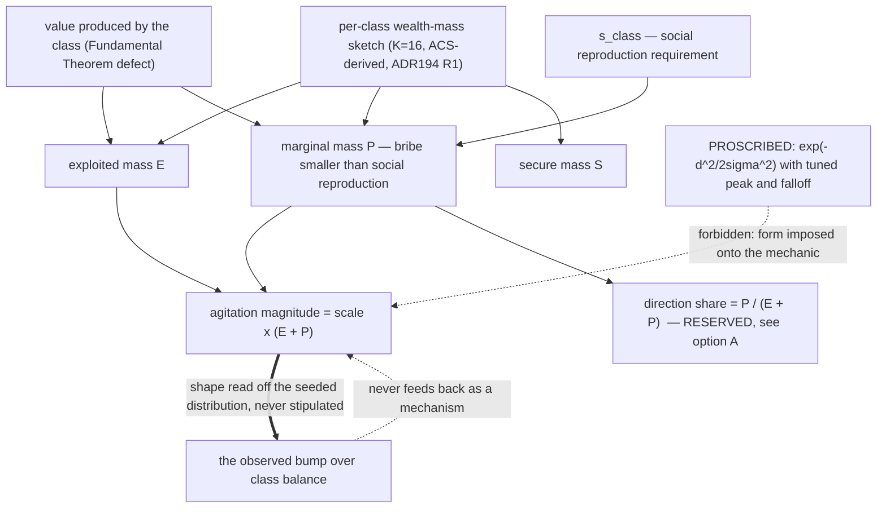
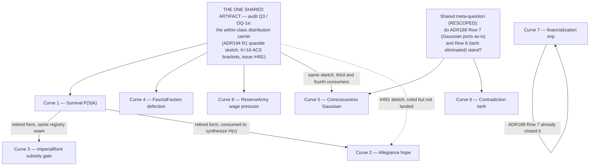

# The Curves Dossier — P29-T4

**Status:** research dossier, no code changed. Produced under **ADR198 R5** (Program 29 charter,
2026-08-12): *"Engineering produces ONE curves dossier — every stipulated curve in the frozen
engine, its material meaning, and a derived emergent reformulation per the ADR173
P(S|A)-as-measure pattern — then a dedicated session where the Director rules the lot (the
heat-dossier precedent). Piecemeal per-train ratification and defer-to-first-consumer were
declined."*

**Tracking:** issue **#561** (`director-gate: P29-T4 — the curves dossier and ruling session`);
the rows are the eight curve rows of the port-estate register, issue **#564** §5a
(`reports/port-estate-survey-2026-08-12.md:296-307` — the §5a heading is `:296`, the eight rows
`:300-307`).

> **Groundedness pass, 2026-08-12.** An adversarial citation audit re-checked every section against
> the working tree (≥3 sampled `file:line` citations per curve, plus every ADR quotation). Wrong line
> numbers were corrected in place; **five substantive corrections are marked `[AUDIT CORRECTION]`
> inline** — Curve 1 §3.3 (the BSL sketch does not load: D138 refuses a conditional fold body),
> Curve 5 §1 (ADR188 Row 7 rules that site PORT-AS-IS and was not cited), Curve 6 §3a (the claim "not
> covered by an existing ruling" is false — ADR188 Row 8 ruled the `tanh` eliminated), Curve 6 §3b
> (the proposed transcription is refused by D138 and `E-TYPE-040`), and Curve 8 §1 (this row has a
> legible Appendix-B REFUTED counterpart). Where a correction changes what the Director is being
> asked, the summary table and the session agenda were updated to match. Two of the corrections
> **narrow the session's job**: rows 5 and 6 are asks to revisit ratified rulings, not open questions.

**Binding law:** ADR172 ruling 5 — *no imposed functional forms; sigmoids must EMERGE from
P(revolution)/P(acquiescence) and the Lawverian algebra, never be stipulated by a mechanic* —
as executed by **ADR173** (the survival family: P(S|A) becomes the measure of class members whose
wealth clears subsistence; the S-curve is a theorem of within-class dispersion, `steepness_k`
ceases to exist as a knob) and extended in posture by **ADR175 (1)** (every remaining confirmed
imposed-form site: the Python reference freezes as-is, each site re-derives at its Rust/BSL port,
and **each derivation is presented to the Director per-family before it lands**). The Aleksandrov
Test, `GameDefines` coefficient discipline and determinism apply throughout.

**Precedent:** `reports/heat-system-dossier.md` — one research dossier, one ruling session, no
piecemeal ratification.

**Coverage:** 8 of 8 register rows. No gaps.

**How the session uses this document.** Each curve section is self-contained and ends in a
**decision surface**: 3–4 named options with their trade-offs, one recommendation with reasoning,
and an explicit list of **reserved-line flags** the engineering workforce did not decide. The
Director rules all eight rows in one sitting. Sections 3 and 5 below (summary table, session
agenda) are the session's working surface; the eight curve sections are the evidence behind them.
Every claim carries a `file:line`; every unverified claim is marked **UNVERIFIED** inline. Where a
section corrects a premise in the register row it answers, it says so and cites the correction.

---

## Summary — the eight rows at a glance

| # | System / site | Frozen form | Proposed disposition | Recommendation |
|---|---|---|---|---|
| **1** | Survival @15.0 — `formulas/survival_calculus.py:21-43` | `1/(1+exp(−k·(w−s)))`, `steepness_k = 10.0`, ±500 clamp, evaluated on the class **mean** | **Already ruled** by ADR173; residue = carrier + distribution family + the A0 (C/G/P) derivation | **A** — empirical rung ladder (carrier α) at the Survival port, with D's honesty fence, behind 3 prerequisites |
| **2** | Allegiance @17.42 — `formulas/politics.py:54-72` | `max(0, P(S\|A)(w+t) − P(S\|A)(w))`, two calls to the same logistic | **Inherited, not fresh**: the band measure `Σ_k m_k·[S−t ≤ w·r_k < S]` — the mass a promise lifts across the line | **A** — adopt the band measure as the fourth consumer of the #491 sketch; **D** (stub the valve) as the sequencing fallback |
| **3** | ImperialRent @9.0 Phase 4 — `engine/systems/economic.py:596-617` | `stability_ratio = P(S\|R)/P(S\|A) > 0.8` gates the CLIENT_STATE subsidy | **Inherited by ADR173** through the formula-registry seam — same function, same operand type, original meaning | **A** — rule INHERITED, gated on seeding `population`/`inequality` on client-state classes |
| **4** | FascistFaction @17.4 — `formulas/reactionary.py:70-91` | `sigmoid(chauvinism − discipline)`, implicit `k=1`, midpoint 0, then one Bernoulli roll **per class** | Measure of members whose bribe share exceeds the org's disciplinary reach — the same fold as ADR173 on a different pole pair | **C now, A when OQ-1e lands** — split the port: fix the class-as-individual error today, defer the shape |
| **5** | Consciousness @17.0 — `formulas/sustained_exploitation.py:197-198` | Gaussian bump `sensitivity·exp(−(b−peak)²/2·falloff²)`; all three coefficients self-declared PROVISIONAL | **ADR188 Row 7 rules this site PORT-AS-IS under `exp`** (`:58-60`) — §1's AUDIT CORRECTION. Proposed alternative: three-way partition (exploited `E` / marginal `P` / secure `S`) read off the #491 quantile sketch against value produced | **B** — magnitude-only emergent reformulation behind #491 — **but B is a request to REVERSE ADR188 Row 7 for this site and must be put as one**; **A** (direction channel) opened as a separate Director question. The narrow question if Row 7 stands: does "ports as-is under `exp`" also dispose the two PROVISIONAL shape coefficients? |
| **6** | Contradiction @18.0 — `formulas/market.py:97-107` | `tanh(log_ratio / scale)`, `scissors_balance_scale = 0.5`, on the CANONICAL `price_value` opposition | **ADR188 Row 8 already ruled the squash ELIMINATED, no rider** (`:61-63`) — §3a's AUDIT CORRECTION; the derivation is a value-mass-weighted measure over the **already-existing per-county oscillator ensemble**, no intrinsic, no coefficient | **Option 3** (Carrier B) is the ADR188-conformant path. Option 4 (port frozen) is a **time-boxed dispensation from ADR188 Row 8**, not a neutral deferral, and must be put as one. Open: which ensemble, which extensive weight |
| **7** | Contradiction @18.0 — `engine/systems/contradiction.py:445-455` | `exp(clamp(fictitious_log, ±max_abs_log = 2.0))` | **Already ruled** by ADR188 Row 7 as a coordinate change, not an imposed form; the survey re-opened a closed ruling | **D** — uphold ADR188, rule the one genuinely unexamined thing (the clamp's ±0.7616 balance cap), record ratio-of-sums as a data-blocked target |
| **8** | ReserveArmy @5.0 / TickDynamics @4.0 — `domain/economics/reserve_army/calculator.py:41-65` | Baseline-renormalized logistic; `sigmoid_k = 20.0`, `sigmoid_r0 = 0.08`, `wage_pressure_ceiling = 0.5` | **Closed ruling, undone design work** (ADR188 Row 7 + ADR175 (1)): the measure of the wage-dependent population that cannot hold out, `H < L` | **D** — class-block measure at the port now, ladder upgrade shared with P(S\|A) when audit Q3 is ruled; pull the absorption-flow producer forward |

**The one artifact four rows share:** rows 1, 2, 4 and 8 all consume a single within-class
distribution carrier — audit Q3 / OQ-1e, given direction by **ADR194 R1** (empirical quantile
sketch, K=16 ACS-derived mass fields, step reading) and designed at
`reports/quantile-sketch-wealth-field-design-2026-08-11.md`, landing as issue **#491**. Ruling that
carrier once discharges the dispersion half of four families. See the session agenda.

---

## Curve 1 — Survival `P(S|A)`: the emergent reformulation

*Register row 1 (survey §5a). All claims cited to `file:line`; speculation marked UNVERIFIED.*

### 1. The frozen form

`calculate_acquiescence_probability(wealth, subsistence_threshold, steepness_k)` returns
`1 / (1 + exp(−k·(w − s)))` with the exponent clamped to ±500
(`src/babylon/formulas/survival_calculus.py:21-43`; the clamp at `:42`). The module docstring
states the form as a definition — *"P(S|A) = 1 / (1 + e^(-k(x - x_crit))) : Survival via
acquiescence (sigmoid)"* (`survival_calculus.py:1-9`) — and `THE_FORMALISM.md:525-528` (theorem
T-6) carries the same form as definitional. The two operands that set the shape are both
`GameDefines` entries whose own field descriptions name no material process: `steepness_k = 10.0`,
*"Game design: sigmoid sharpness in acquiescence probability"*
(`src/babylon/config/defines/survival.py:18-22`; `src/babylon/data/defines.yaml:164`), and
`default_subsistence = 0.3`, constrained `ge=0.0 le=1.0`, *"Game design: minimum wealth for
survival through compliance"* (`config/defines/survival.py:23-28`; `defines.yaml:165`). The sole
per-tick production consumer fetches it through the registry seam
(`engine/formula_registry.py:106`; `engine/systems/survival.py:102`) and evaluates it on the class
**mean** — `wealth_per_capita = wealth / population` (`engine/systems/survival.py:143`, passed at
`:154-158`). An off-registry twin duplicates the shape with an implicit `k=1` and **no** overflow
clamp (`models/entities/precarity_state.py:90-92`).

### 2. What the curve is FOR, materially

The codebase's own theory documents make one claim with it, and it is a claim about **hegemony as
containment**. T-6, the Fundamental Theorem, reads: while `W_c/V_c > 1` (labor aristocracy) and
`P(S|A)` is *bounded away from 0*, consciousness drift has a stable pacified fixed point,
organization cannot accumulate, and `P(S|R) = Org/Repression` never overtakes the rent-funded
`P(S|A)` — *"revolution in the Core is impossible while `W_c > V_c`; the gap is Φ"*
(`THE_FORMALISM.md:525-528`). Its Warsaw Ghetto corollary states the converse: *"As `P(S|A) → 0`
the acquiescence branch loses its fixed point: `P(S|R) > P(S|A)` holds for **any** `Org > 0` —
revolt fires regardless of organization… Hegemony is precisely the machinery that keeps `P(S|A)`
bounded away from 0"* (same lines). So the quantity is the **measured purchase imperial rent
buys**: the share of a class that can still reproduce itself by compliance. The reform seam is
written the same way — the delivered social wage enters by *lowering the subsistence bar at read
time*, never by minting wealth (`engine/systems/survival.py:131-139`, P25 U9/ADR135). Everything
beyond this — in particular whether high intra-class inequality should make rupture *more* or
*less* switch-like — is reserved (§5, flag R2).

### 3. The derived reformulation

#### 3.0 Row 1's residue is already ruled — scope

**ADR173 decision (1) closes the row.** `P(S|A)` becomes *"the measure of class members whose
wealth clears subsistence, the S-curve derived as a THEOREM from within-class wealth dispersion
integrated against the threshold"*; the frozen Python keeps its logistic as an honest reference;
**`steepness_k` ceases to exist as a knob**
(`ai/decisions/ADR173_audit_and_stops_dispositions.yaml`, decision (1)); the `precarity_state.py`
twin folds into the same construct at port. Nothing about *whether* to de-impose is open. What
remains open, per the standard's own register, is **three things inside the ruled formulation**,
and this section addresses only those:

- **OQ-1e** — the C/G/P derivation under Axiom A0 has not been exhibited, and the carrier is
  missing (`ai/bsl-architecture-standard.md:1100`);
- **audit Q3** — the canonical within-class distribution is undecided
  (`reports/p27-proscription-audit-2026-07-29.md:315`);
- **audit Q5** — the substantive theory claim the emergent form *adds* (same line), explicitly
  reserved.

Rows 2 and 3 of the register (`reports/port-estate-survey-2026-08-12.md:300-303`) — Allegiance's
`counterfactual_hope_gain` and ImperialRent's Phase-4 subsidy — are **not** inherited from ADR173
and are out of this section's scope.

#### 3.1 The A0 derivation (discharging OQ-1e's first half)

The construct is **P of a C over a G**, all three from A0's enumerated closure
(`ai/THE_FORMALISM.md:169-173` — Axiom A0 at `:169`, the C bullet `:171`, the G bullet `:172`):

1. **C (composition)** — a per-member thresholded opposition: individual accumulated wealth ⊣ that
   member's subsistence requirement. This is the existing `wage`/`capital_labor` family's own gap
   read at the individual rung of the ratified social chain
   `individual ≺ community ≺ class ≺ bloc` (`THE_FORMALISM.md:165`).
2. **G (coarse-graining)** — the *individual → class* motion along that same lattice.
   `THE_FORMALISM.md:165` states the requirement in the exact terms needed: *"every aggregation in
   the system … is a motion along a level lattice, and must present itself as one."*
3. **P (projection)** — the count-share readout of the coarse-grained indicator.

So `P(S|A)` is the pushforward of a crossing indicator along the class's population measure —
`1 − F_class(s)`. The audit reached the same tree independently
(`reports/p27-proscription-audit-2026-07-29.md:§2.1`). **The one thing to say honestly:** A0's G
bullet enumerates *"level-lattice coarse-graining and Aufhebung (§I.7); partition quotients (§IV.5);
regime/endgame classification (§IV.2, §VI.6)"* — a population **measure** is not literally named
among them (`THE_FORMALISM.md:172`, quoted verbatim including its section refs), which is exactly
what OQ-1e flags. The derivation above reads it as an
instance of level-lattice coarse-graining (individual→class *is* a rung of the ratified social
chain). That reading is mine and is the piece that needs Director sign-off; it is a reading of an
existing bullet, not a new constructor family.

#### 3.2 The carrier (discharging OQ-1e's second half)

OQ-1e's parenthetical — *"`social_class` nodes carry no member population (no carrier)"*
(`ai/bsl-architecture-standard.md:1100`) — is **imprecise as of today's tree, and the correction
matters for the cost estimate**:

- `social-class/population` is a declared, live field in the Rust port
  (`rust/crates/babylon-tick/content/rules/vitality.bsl:46`; declared as content,
  `rust/crates/babylon-bsl/src/scenario.rs:1852`, `(deffield social-class/population int
  extensive)`).
- Subsistence already has a **materially decomposed** carrier: `social-class/s-bio` and
  `social-class/s-class` — biological floor vs. the standard of living the class position requires
  — plus `economy/base-subsistence` and `social-class/subsistence-multiplier`
  (`vitality.bsl:48-51`; the `(+ s-bio s-class)` consumption read is `:74`).
- A **scalar dispersion carrier already exists**: `SocialClass.inequality: Gini`, *"Intra-class
  Gini coefficient. 0=equality, 1=tyranny (bottom gets nothing)"*
  (`src/babylon/models/entities/social_class.py:411-414`; type at
  `src/babylon/models/types.py:274-294`), read today by VitalitySystem
  (`engine/systems/vitality.py:229,246-249`; seam row
  `src/babylon/sentinels/seam/registry.py:1449-1454`), and **already declared in Rust content** —
  `(deffield social-class/inequality int intensive)`
  (`rust/crates/babylon-tick/content/scenarios/vitality-lifecycle-combined-conformance.bscn:46`),
  correctly `intensive`.

What genuinely does not exist is a **shape** carrier — the distribution itself. Two candidates, and
the choice *is* audit Q3:

**Carrier α — the empirical rung ladder (recommended).** A per-class ladder of wealth strata, each
rung carrying an extensive headcount. The data is a verified build-product fact, re-verified this
pass against the read-only reference DB: `fact_census_income` holds **7,207,200** rows and
`dim_income_bracket` carries the real 16-rung ACS B19001 ladder (`Less than $10,000` … `$200,000 or
more`). Today that table is consumed only as a top-2/bottom-2 band ratio proxy
(`src/babylon/domain/economics/throughput/adapters.py:793`).

**Carrier β — one-parameter analytic, sourced from the existing Gini.** Uses `inequality` alone;
requires *choosing a distributional family* (the audit's lognormal-vs-Pareto pair,
`reports/p27-proscription-audit-2026-07-29.md:§2.2`; the repo already carries
`compute_pareto_gini`, `G = 1/(2α−1)`, `src/babylon/formulas/lifecycle.py:143-163`). **Note the
language constraint that decides this on its own:** the lognormal reading needs a Gaussian CDF, and
the declarable intrinsic set is `{exp, log, floor}` with `sigmoid` a **reserved prohibited name**
(`E-LOAD-024`) (`docs/reference/bsl-language.rst:3216-3219` for the declarable set; `:3239-3244` for the `sigmoid` prohibition). Only the Pareto reading is
even expressible, and expressing it as `exp(α·(log w_min − log s))` is precisely the *"routing
around a gate that is deliberately mechanical"* the register already names for the `tanh` row
(`reports/port-estate-survey-2026-08-12.md:300-306`, row 6).

#### 3.3 The fold, and its expressibility in the actual algebra

With carrier α, `P(S|A)` is a **population-weighted count-share of a 0/1 clearance indicator** —
the complementary empirical CDF, with **no intrinsic call at all**. The shape it produces is a
monotone staircase whose rise is concentrated wherever the class's own mass sits near the line:
steepness *is* dispersion, read off data, with nothing to tune. Sketch, on §2.12's ratified two-hop
shape (`docs/reference/bsl-language.rst:2134-2160`) and its `membership-field-of` payload read
(AG (i), `:2100-2115`):

```scheme
(binding subsistence :expr (+ s-bio s-class))
(binding cleared :expr
  (fold max (hyperedges-of self HyperedgeType/WEALTH_LADDER) :as ladder
        (fold mean (members-of ladder HyperedgeType/WEALTH_LADDER)
              (if (>= (field-of it wealth-rung/floor) subsistence) 1 0)   ; ILLEGAL BODY — see below
              :weight (membership-field-of ladder it wealth-ladder/headcount))))
```

The constructs it uses are individually in the closed grammar: `fold mean` with an extensive
`:weight` (`:1181-1183`, §3.4's law `:2569-2605`), `members-of`/`hyperedges-of` queries
(`:944-949`), `if` in expression position (`:1205-1207`), `:as` outer-element naming, per-member
payload reads. Fuel is bounded by `:max-members` — *"a fold over members reading payload is bounded
by the same declared number as a fold over members reading nothing"* (`:2115-2116`), and VIII.9 is
untouched (`:2127-2132`).

> **[AUDIT CORRECTION — the sketch as written does not load.]** The inner fold's BODY is an `(if …)`,
> and **a fold body may not be a compound (conditional) expression**: `rule_pipeline.rs::field_ref_for`
> reduces a fold body to exactly three shapes — a bare `<qname>`, a `field-of` accessor, or a nested
> fold — returning the uncoded `compound_fold_error` for anything else, *"including an `if`-based role
> filter"*, and `:weight` goes through the identical restriction (D138,
> `docs/reference/bsl-language.rst:6651-6690`, esp. `:6667-6676`). This is the same constraint
> Curve 4 §3.3 and Curve 8 §3.3 verify and design around; `if` being legal *in expression position*
> (`:1205-1207`) is a different question from `if` being legal *as a fold body*, and the sentence
> above conflated them. **The sketch is therefore illustrative of the measure, not of a loadable
> rule.** The sanctioned shape is the landed D134/D136 pattern the other two sections use: the 0/1
> clearance indicator is materialized by a per-rung rule's `when` guard into a declared field, and
> the consumer folds that field plainly. Nothing about the *measure* changes; the transcription does.
> Carrier α's rung ladder must therefore be costed with one extra producer rule per ladder, and the
> two D-rows below stand unchanged.

**Three expressibility findings this sketch surfaced, all verified, all worth their
own D-rows regardless of which option is chosen:**

1. **A share cannot be written as a ratio of two sums.** §3.4's arithmetic bullet makes extensive ÷
   extensive `E-TYPE-040` — *"an area-of-an-area"* (`bsl-language.rst:2563-2566`), and the AG repair
   confirms the rejection is deliberate (`:2611-2624`). The weighted-mean-of-indicator spelling
   above is the legal form. **This is not a problem the emergent form creates — the frozen form has
   it too:** its own input `wealth / population` (`engine/systems/survival.py:143`) is extensive ÷
   extensive, so *a verbatim transcription of the logistic is not type-legal either*.
2. **`E-TYPE-040` is normative but unimplemented.** In the **Rust estate** the code appears exactly
   once, in a doc comment that says so: `rust/crates/babylon-bsl/src/typecheck.rs:19` — *"`E-TYPE-040`
   kind mixing"* arrives "with the expression typechecker in later tasks". (Tree-wide the string also
   appears in `docs/reference/bsl-language.rst` and `ai/bsl-architecture-standard.md`, i.e. only in
   the two normative documents.) The implemented `TypeCode` set is
   `E-TYPE-016`/`017`/`041`/`042`/`043`/`044` (`typecheck.rs:44-75`); of the kind rules, only
   `SumOfIntensive`/`UnweightedMeanOfIntensive`/`NonExtensiveWeight` = 041/042/043 and the enum-body
   rule `EnumFoldBody` = 044 are enforced (`typecheck.rs:50-60, 68-73, 150-195`). **040 is the one
   kind rule with no implementation.** That is why `lifecycle.bsl:305` (`(/ deaths pop-d-prime)`) and
   `:319` load today. Either spelling works *now*; only one survives the gate being implemented.
3. **The result kind of a weighted mean over a kind-neutral body is undetermined.** §3.4's table
   gives result kinds for the other rows and D90 ruled the intensive-body case intensive
   (`:2591`; the AG repair that states it is `:2611-2624`), but the neutral row states only
   *"Legal unweighted. Result carries the body kind."* (`:2584-2586`) — the
   neutral-body-plus-`:weight` cell is unaddressed. By the
   AG repair's own reasoning ("two implementations free to read the blank differently … is a
   III.12(a) failure") that blank needs a row. A share has no extent; **intensive** is the answer
   unit algebra gives.

#### 3.4 What must exist for it

| Requirement | Status |
|---|---|
| `social-class/population`, `s-bio`, `s-class` | **exist**, live in BSL content (`vitality.bsl:46-50`) |
| Intra-class dispersion scalar (`inequality`, Gini) | **exists** both sides (`social_class.py:411-414`; `…-conformance.bscn:46`) |
| Per-class rung headcounts (carrier α) | **absent** — needs a data-build derivation from `fact_census_income` (7.2M rows, verified) plus a declared ACS-household → `SocialClass` mapping |
| A `WEALTH_LADDER` hyperedge type / rung node type | **absent**. Field declaration is content (`scenario.rs:1852` — a `deffield` inside a unit-test scenario source; the same form appears in shipped `.bscn` content, e.g. `vitality-conformance.bscn:23`); whether *type-enum members* are content-mintable or kernel-closed is **UNVERIFIED in this section** — §2.13 exists (`bsl-language.rst:2160-2200`) and I did not read it; Curve 8 §3.4 route (i) reads the same section as ruling that content MAY populate the closed graph vocabulary via `defvocabulary`. If Curve 8's reading holds, this row is content work, not a kernel vocabulary change |
| A subsistence threshold in the **same units** as the ladder | **absent, and this is a hard prerequisite.** Survival's is `[0,1]`-constrained (`ge=0.0 le=1.0`, `config/defines/survival.py:23-28`); Vitality's is Currency (`s-bio + s-class`, `vitality.bsl:74`). The two subsistences are not commensurable today |
| Survival ported to BSL at all | **not ported.** The eight rule packs are dispossession, organization, fundamental-theorem, lifecycle, production, vitality, metabolism, territory — no `survival.bsl`. **There is no forcing function; this decision is upstream of any port** |

**One consequence that is not optional to mention:** Vitality's Grinding Attrition is *blocked on
this exact construct*. Its rule header says so verbatim — the attrition rate *"is a stipulated
functional form with a tuned knob, and it is the same construct as ADR173's P(S|A): the mass of the
within-class wealth distribution that fails to clear subsistence"*
(`rust/crates/babylon-tick/content/rules/vitality.bsl:31-36`). The frozen implementation confirms
it: `attrition_rate = clamp(deficit × (0.5 + inequality), 0, 1)`
(`engine/systems/vitality.py:22-25, 208-210`), with `attrition_base_factor = 0.5` and
`inequality_impact` described as *"Game design"* (`config/defines/survival.py:82-93`). **Mortality
and acquiescence are two level-sets of one below-subsistence measure** — `s_bio` vs
`s_bio + s_class`, both already declared. Deriving `P(S|A)` as a measure discharges Vitality Phase
2's second blocker in the same motion. (Whether to *unify* them is audit Q4 — §5, flag R3.)

### 4. Fidelity and divergence

| Property | Frozen logistic | Emergent measure | Consequence |
|---|---|---|---|
| **Range** | open `(0,1)`; the ±500 clamp only bounds the exponent (`survival_calculus.py:42`) | attains exactly `0` and exactly `1` | T-6's Warsaw Ghetto corollary — *"as `P(S\|A) → 0` … revolt fires regardless of organization"* (`THE_FORMALISM.md:528`) — becomes **reachable in finite state** instead of asymptotically. Under the frozen curve it is a limit; under the measure it is a game state a class can actually be in |
| **Midpoint** | exactly `0.5` when **mean** wealth = subsistence (`survival_calculus.py:26`) | `0.5` only when **median** wealth = subsistence | For right-skewed wealth (median < mean) a class whose *mean* clears the line has **fewer than half** its members clearing it ⟹ lower `P(S\|A)`, earlier crossover. The drift is **systematic and one-directional**, not noise |
| **Steepness** | `k = 10.0`, identical for every class in every county (`defines.yaml:164`) | per-block, = that block's own dispersion | Two blocks with identical mean wealth now respond differently. Any golden that implicitly assumed cross-block uniformity of response drifts |
| **Crossover inverse** | closed form via `math.log(1/p_rev − 1)` (`survival_calculus.py:68-92`, registered `formula_registry.py:108`) | no continuous inverse; the crossover is the `(1 − P(S\|R))`-**quantile** of the class's distribution, and on a staircase it is an *interval*, not a point | `crossover_threshold` does not port as a formula — it ports as a `select-min` over rungs. A separate transcription decision |
| **Reform seam** | social wage lowers the subsistence bar at read time (`survival.py:131-139`) | **unchanged** — the threshold shifts, the measure re-reads | P25 U9/ADR135's ledger seam survives the reformulation intact. Worth stating: nothing about the electoral reform valve is disturbed |

**Goldens and ports.** ADR173 already disposes the baseline question: the survival family's Phase-1
conformance vectors *"encode IT, not the logistic"*, and *"cross-implementation checks for survival
quantities compare against the emergent formulation's own vectors, not Python replay"*
(`ADR173…yaml`, decision (1) + consequences). So there is **no `Baselines: blessed(…)` ceremony
owed against Python for this family**, and — because Survival is not ported — **no drift exists in
the tree today**. The drift that does arrive later is downstream: `counterfactual_hope_gain` →
Allegiance @17.42 reaches the same function *past* the registry seam
(`formulas/politics.py:19,68-71`; `engine/systems/allegiance.py:58,442`), and ImperialRent @9.0
Phase 4 gates the CLIENT_STATE subsidy on `p_revolution/p_acquiescence`
(`engine/systems/economic.py:596-613`). Both are register rows 2 and 3 and both need **their own**
rulings before either can consume an emergent `P(S|A)`.

### 5. The decision surface

**A. Adopt carrier α (empirical rung ladder) at the Survival port, and unify Vitality's attrition
onto the same measure.** *Zero intrinsics, zero shape parameters, per-county rather than
per-archetype, and it discharges Vitality Phase 2's blocker in the same train* — at the cost of a
data-build derivation, a vocabulary addition, a unit reconciliation between two incompatible
subsistences, and a runtime fold over 16 rungs per class node.

**B. Adopt carrier β (Gini-sourced Pareto tail).** *Cheapest — the `inequality` field already
exists on both sides and needs no new data* — but it re-imposes a distributional family, and
expressing it as `exp(α·(log w_min − log s))` builds a prohibited shape out of two permitted
intrinsics, which is the gate-routing pattern the register already flags elsewhere.

**C. Defer: leave Survival unported, D-record the carrier dependency.** *Costs nothing and blocks
nothing today* (Survival has no BSL pack; no forcing function) — but Vitality's Grinding Attrition
stays blocked on the same construct, and every tick of the ported engine runs without an
acquiescence branch at all, so the Fundamental Theorem has no runtime expression.

**D. Hybrid: α where county-attributed, β behind a declared `NoDataSentinel` / `{absence}` fence.**
*Honest coverage without a silent fallback* — the audit's own recommendation for the coverage gap
(`reports/p27-proscription-audit-2026-07-29.md:315`) — at the cost of two code paths and a
hash-visible fence.

**Recommendation: A, with D's honesty fence, sequenced behind three prerequisites.** The reasoning:
(i) A is the only option whose *shape* is data rather than a chosen family, so it is the only one
that passes §3.10's gate 2 — *"can this be re-derived as a measure instead?"*
(`bsl-language.rst:3234-3237`) — without further argument; (ii) it needs **no** transcendental, so
it sidesteps the `{exp, log}` cap and the `sigmoid` prohibition entirely rather than negotiating
with them; (iii) it converts `steepness_k`'s deletion into a *gain* rather than a loss — the
variance that the mean threw away comes back as structure instead of as a knob; (iv) it unblocks a
second system for free. The prerequisites, in order: **(1)** the subsistence unit reconciliation
(`[0,1]` vs Currency) — nothing else can proceed past it; **(2)** the audit-Q3 ruling on the
ACS-household → `SocialClass` mapping; **(3)** the two language D-rows from §3.3 (implement or
retire `E-TYPE-040`; fill §3.4's blank result-kind cell), which are owed **whichever option is
chosen** — the frozen form's own `wealth / population` trips the same rule.

#### Reserved-line flags (Director's, not mine)

- **R1 — audit Q5, the substantive claim the emergent form adds.** More intra-class inequality ⟹
  *flatter* survival response ⟹ *less* switch-like rupture. The audit says plainly it *"can
  construct the argument in both directions and cannot adjudicate it; this is squarely
  reserved-line"* (`reports/p27-proscription-audit-2026-07-29.md:315`). Adopting A or B makes the
  model **assert** this rather than assume it. It is the ideological content of the reformulation
  and it needs an explicit ruling, not an implied one.
- **R2 — reuse beyond the original site.** ADR173 retires the form for its *original survival use
  only*. Feeding an emergent `P(S|A)` into the electoral hope field `H(c)` or the imperial-subsidy
  `stability_ratio` synthesizes new quantities from it and is a **fresh** ruling
  (`reports/port-estate-survey-2026-08-12.md:301-302`, rows 2–3).
- **R3 — audit Q4, unifying survival and vitality thresholds.** Structurally clean (one measure,
  two level-sets, and it gives "precariat" a *measured* definition) but it couples systems at @1
  and @15, and the Director may prefer them independent for pedagogical legibility.
- **R4 — the income-shape provenance.** Carrier α reads ACS **household income** brackets as the
  within-class **wealth** distribution. A Director ruling on file makes the class-income proxy
  explicitly **provisional** and reserves the coupling choice (issue #510). That ruling governs this
  use directly. **UNVERIFIED**: I did not locate an in-repo ADR for it in this pass — it is carried
  in session memory, and the dossier should cite the issue, not me.

#### Also UNVERIFIED

Whether §2.13 permits content to mint new `NodeType`/`HyperedgeType` members (decides whether
carrier α's ladder is content work or a kernel vocabulary change — a material cost difference);
whether any commit since 2026-07-29 has begun Rust/BSL survival work beyond the eight existing rule
packs (I checked the pack list, not the git log); and the disposition of `SurvivalDefines`' sibling
knobs (`default_organization`, `default_repression`, `revolution_threshold`,
`config/defines/survival.py:29-52`), which govern `P(S|R)` and are outside this row.

---

## Curve 2 — Allegiance `counterfactual_hope_gain`

*Register row 2 (survey §5a).*

### 1. The frozen form

`counterfactual_hope_gain(wealth, subsistence, promised_transfer, steepness_k)` returns
`max(0, P(S|A | wealth+transfer) − P(S|A | wealth))`, computed by calling
`calculate_acquiescence_probability` twice (`src/babylon/formulas/politics.py:54-72`, verified
verbatim; the direct module-level import — not the `formula_registry` seam — is `politics.py:19`).
That callee is the stipulated logistic `1/(1+exp(−k·(wealth − subsistence)))` with a ±500 exponent
clamp (`src/babylon/formulas/survival_calculus.py:21-43`, verified; the clamp literal is `:42`, the
curve `:43`). Its one coefficient is `SurvivalDefines.steepness_k = 10.0`, described in its own
schema as *"Game design: sigmoid sharpness in acquiescence probability"*
(`src/babylon/config/defines/survival.py:18-22`; `src/babylon/data/defines.yaml:164`).
`AllegianceSystem._hope` calls it once per (class, party), with
`promised = max(0.0, fit) * defines.phi_social_share * subsistence`
(`src/babylon/engine/systems/allegiance.py:441-442`; `phi_social_share = 0.25`, Θ_theory,
`src/babylon/config/defines/politics.py:62-74`), aggregates through `hope_field` =
`Σ_p allegiance_p · viability_p · max(0, Δ_p)` (`politics.py:37-51`) and clamps `min(1.0, …)`
(`allegiance.py:444`). What it **stipulates**: that a class's believed survival response to money
is a logistic in the class *mean* wealth gap, with a tuned global sharpness.

### 2. What the curve is FOR, materially

Per the code's own theory notes, hope is not a mood primitive but *"the believed arithmetic of the
acquiescence branch — the allegiance-weighted, viability-discounted promised improvement in
survival-by-acquiescence (Aleksandrov chain, III.8)"* (`politics.py:40-44`). Its function in the
game is **the valve**: while hope is high, Agitation→Organization conversion is suppressed *"not by
decree but because the promised gradient of P(S|A) outcompetes P(S|R)'s risk in every rational
survival ledger"* (`politics.py:25-28`), realized as `valve_multiplier(hope, valve_strength)`
scaling the conversion gain (`allegiance.py:470-475`), plus turnout (`electoral.py:711`) and
`HOPE_SPIKE` (`allegiance.py:486-513`). The law pinned in test is **L-HOPE-MATERIAL**: a platform
promising no P(S|A) improvement contributes exactly zero — *"no hope without a promise trace"*
(`politics.py:44-45`; `tests/unit/formulas/test_politics.py:101-109`). And **T-5**, in the
function's own docstring: *"the gain is the SAME sigmoid the engine adjudicates … never a parallel
feed"* (`politics.py:62-64`). That identity claim is the load-bearing invariant of this row.

### 3. The derived reformulation

#### 3.0 First, a correction to the register row's premise

The survey row frames this as *"a fresh ruling, not an inherited one."* That is half right, and the
half that is wrong changes the decision.

- The proscription audit **did** raise `politics.py:68` as its own finding, and the adversarial
  pass **REFUTED** it: *"The site is a boundary contract, not an imposed form"*
  (`reports/p27-proscription-audit-2026-07-29.md:378`, Appendix B). So this site is **not** an
  independently confirmed imposed-form site, and ADR175's *"every remaining confirmed imposed-form
  site"* clause (`ai/decisions/ADR175_emergence_extension_logging_phi_sign.yaml:31-38`) does not
  reach it by enumeration.
- But the **confirmed** finding's blast radius names it explicitly: *"`formulas/politics.py:68`
  `counterfactual_hope_gain`, hence the whole hope-field → Allegiance @17.42 → Electoral @17.45
  chain"* (`:78`), and the confirmed finding's adversarial verdict says the registry-seam mitigation
  is *overstated* precisely because *"the electoral hope path is hard-bound to the logistic —
  strengthening the finding"* (`:34`).

Read together: hope is not a *second* imposition, it is a **consumer** of the one confirmed
imposition. ADR173 ruling (1) already retires that curve and replaces it with *"the measure of class
members whose wealth clears subsistence"*
(`ai/decisions/ADR173_audit_and_stops_dispositions.yaml:36-45`). **If the port honours T-5 — hope's
counterfactual keeps calling the same P(S|A) the engine adjudicates — then the reformulation is
inherited, not minted, and no new theory is required.** The genuinely open question is narrow and
mechanical: *what does "the same function, evaluated under an overlay" mean when the function is a
measure rather than a closed form?* Section 3.2 answers that.

#### 3.1 The substrate already exists and is already ruled

The within-class distribution is no longer open in direction. **ADR194 R1** resolved audit Q3: the
canonical within-class wealth distribution is an **empirical quantile sketch** — *"Data-driven
brackets (ACS-derived quantiles) carried as a first-class field. No imposed functional form"*
(`ai/decisions/ADR194_director_rulings_batch2_2026_08_11.yaml:80-96`, as quoted at
`reports/quantile-sketch-wealth-field-design-2026-08-11.md:38`). The concrete field design is ruled
(`reports/quantile-sketch-wealth-field-design-2026-08-11.md:11-23, 205-266`):

- **K = 16** per-class `coefficient` intensive mass fields `social-class/wealth-mass-01..16`
  (OQ-A RULED, `:15`, `:213-220`);
- a universal **mean-relative** `Ratio` `defconst` cut grid `wealth-sketch/cut-01..15`, so `cut_k`
  in money is `wealth × ratio_k` and every write to scalar `wealth` re-anchors the sketch at read
  time with no write of its own (`:222-240`);
- the **step reading** (OQ-B RULED): count only brackets whose **lower edge clears S**,
  `c_k ∈ {0,1}`, zero assumptions, visible ≤16-value staircase accepted (`:16`);
- the member-population carrier is `social-class/population` × mass (`:261-265`), which exists today
  (`src/babylon/models/entities/social_class.py:406`).

The design lists three consumers of one field: survival P(S|A) (ADR173), mortality-as-measure
(ADR191 R3), and the wiring-completeness "holdout term" (`:44-58`). **The hope counterfactual is not
among them.** It should be the fourth, and it needs **no new field**.

#### 3.2 The derived form

Let `w` = per-capita class wealth, `S` = `subsistence_threshold`, `m_k` = `wealth-mass-k`,
`r_k` = `cut-k`, `t_p` = the platform's promised per-capita transfer (unchanged:
`max(0,fit)·phi_social_share·S`, `allegiance.py:441`).

Under the ruled step reading, the acquiescence measure is
  `P(S|A)(c) = Σ_k m_k · [ w·r_k ≥ S ]`.
A promised transfer is an additive per-capita overlay, which shifts every member's wealth by `t_p`,
hence every bracket's clearing test by `t_p`:
  `P(S|A)(c | +t_p) = Σ_k m_k · [ w·r_k + t_p ≥ S ]`.

The difference **collapses to a single band measure**:

> **`Δ_p(c) = Σ_k m_k · [ S − t_p ≤ w·r_k < S ]`**
>
> *— the mass of the class the platform's promise would actually lift across the subsistence line.*

**Why this is a derivation and not a substitution.** Nothing about the shape is chosen. The band is
the set-difference of the two measures ADR173 already rules; the curve `Δ_p` traces as `t_p` grows
is the **cumulative mass of the sketch below the line**, read off the empirical ACS bracket data —
the class's own dispersion **is** the steepness. `steepness_k` has no place to enter. `exp` and the
±500 clamp disappear. And the frozen form's qualitative signature is *reproduced, not lost*: the
logistic's gain peaks where `wealth ≈ subsistence` because a sigmoid's derivative peaks at its
threshold; the band measure peaks there because that is where the class's members actually are. The
frozen curve was an unweighted stand-in for exactly this density, with a global knob substituting
for each class's real one.

**L-HOPE-MATERIAL becomes a theorem, not an assertion.** At `t_p = 0` the band `[S, S)` is empty, so
`Δ_p = 0` exactly — by construction, not by a `max(0, ·)` guard. Monotonicity in `t_p` is likewise
structural (a larger transfer can only widen the band), so the `max(0.0, …)` inside `hope_field`
(`politics.py:51`) and in `counterfactual_hope_gain` (`politics.py:72`) both become provably dead.
The outer `min(1.0, …)` (`allegiance.py:444`) is also redundant: party masses sum to ≤ 1 by mass
discipline (`apply_allegiance_drift`, `politics.py:191-212`, verified — returns masses + abstention
summing to exactly 1.0), viability is `0.5·funding_share + 0.5·member_share` ∈ [0,1]
(`allegiance.py:331-357` per the port inventory's reading), and each `Δ_p` ∈ [0,1] as a mass.
*Marked UNVERIFIED: I did not re-derive the viability share bounds from source, only from the port
inventory's description.*

#### 3.3 Expressibility in the actual algebra

The verified constructs: `(if <cond> <expr> <expr>)` is in expression position
(`docs/reference/bsl-language.rst:1173`); arithmetic is **strictly binary**, `(+ a b c)` is
`E-PARSE-040` (`:1188-1190`); `Ratio`'s one legal operation is `Currency × Ratio → Currency`,
half-even (`:2459-2468`, recorded as D99 at `:2515`; implemented at
`rust/crates/babylon-bsl/src/evaluator.rs:553-566` per the design doc `:233-239`).

**Important constraint — this is a sum, not a fold.** The ruled design records that **there is no
query head over fields**: the five heads are `nodes`, `edges`, `neighbors`, `members-of`,
`hyperedges-of` (`bsl-language.rst:944-949`; the design doc's own `:933-938` cite is off by eleven lines), and *"A set of fields on one node is not a `<query>`
and therefore not foldable. K scalar fields must be consumed by explicit"* term-by-term arithmetic
(`reports/quantile-sketch-wealth-field-design-2026-08-11.md:154-156`). So the band measure lands as
a **K-term nested binary sum of `(if …)` guards**, exactly the shape survival's own measure must
take:

```scheme
(+ (if (and (>= (+ (* (field-of self social-class/wealth) wealth-sketch/cut-01) t)
                (field-of self social-class/subsistence-threshold))
            (<  (* (field-of self social-class/wealth) wealth-sketch/cut-01)
                (field-of self social-class/subsistence-threshold)))
       (field-of self social-class/wealth-mass-01) 0)
   (+ (if … cut-02 … ) …))          ; K = 16 terms, binary-nested
```

The fold-shaped alternative — one node or membership per bracket, folded with `members-of` +
`membership-field-of` (Amendment AG,
`ai/decisions/ADR189_amendment_ag_attributed_membership_lattice_instances.yaml:31-45`; accessor at
`bsl-language.rst:1820,1847`) — is **available in the language but was rejected by the ruled
design**, on the ground that a bracket is *"a measurement partition of a class, not a distinct
material relation, and minting node types for measurement artefacts is the failure mode the
hex/community disposition already warns against"* (`:200-204`). I do not reopen that; I note it only
so the Director knows the fold form exists and was declined.

#### 3.4 Data and dependencies this requires

1. **The #491 sketch must land first.** No new fields beyond it. This row is a consumer, not a
   charter.
2. **`t_p` and `S` must be in one grain.** The frozen path already treats `wealth`,
   `subsistence_threshold` and `promised` as per-capita (`allegiance.py:439-442`), so no new grain
   question is introduced — but the design's own `extensive ÷ extensive` gap (OQ-I, GAP-B, `:23`)
   governs how per-capita `wealth` is obtained if the scalar is stored extensively. **Flag, do not
   assume.**
3. **The ACS income-shape proxy propagates into hope.** OQ-E/F is PROVISIONALLY ruled — shared
   county income shape as every class's dispersion, stratification entering only through
   theory-laden per-class means, independence never acceptable, with a Director-mandated expiry at
   **issue #510** (`:19`; memory `direction-class-income-proxy-provisional`). Any hope reformulation
   inherits that provisional stamp and must cite #510 where the proxy enters.
4. **Not discharged:** OQ-1e's **C/G/P derivation under Axiom A0** for a population measure remains
   open — *"not supplied by any field design and stays open"* (`:265-266`, OQ-D). This reformulation
   inherits that debt; it does not add to it.

### 4. Fidelity and divergence

| | Frozen logistic | Band measure |
|---|---|---|
| Support | Strictly positive for **any** `t>0`, at any wealth | **Exactly zero** when no bracket edge falls in `[S−t, S)` |
| Class-discrimination | Two classes with equal `w−S` get identical hope | Diverge by their actual mass near the line |
| Continuity | Smooth in `t` | ≤16-value staircase (accepted cost, OQ-B `:16`) |
| Knob | `steepness_k = 10.0` global | none; steepness **is** the sketch |

Consequences worth naming:

- **A qualitative mechanic change, not a numeric drift.** A labor aristocracy sitting far above
  subsistence gets **zero** hope from a social-wage promise — the valve stops throttling it — where
  the frozen sigmoid always granted it some. Symmetrically, a class far below the line gets zero
  from a token promise that does not reach. Hope concentrates in the stratum piled up *at* the line.
  This is a substantive claim about who social-democratic promises actually purchase, and it is the
  Director's to ratify (§5).
- **Downstream firing patterns move.** `HOPE_SPIKE` triggers on `hope − prev_hope > hope_spike_gain`
  (`allegiance.py:488-513`); a staircase produces different spike timing than a smooth curve.
  Turnout (`electoral.py:711`) and the valve (`allegiance.py:470-475`) shift with it.
- **Goldens: divergence is by design, and already licensed.** ADR173's consequences state it
  outright: *"The frozen Python reference diverges from the Rust engine BY DESIGN on this family:
  cross-implementation checks for survival quantities compare against the emergent formulation's own
  vectors, not Python replay"* (`ADR173…yaml:69-73`). All five electoral goldens run through the
  valve and turnout, so their Rust vectors must be **authored from the emergent form**, never
  transcribed from Python replay. That is the same posture the survival family already carries —
  this row adds scope to it, not a new kind of obligation.
- **Independent blockers remain.** Even with this ruled, `_hope` stays blocked on the undeclared
  `sqrt` intrinsic via `interest_fit`, and `HOPE_SPIKE` on the event-payload node-reference gap
  (`reports/port-inventories/allegiance-port-phase1-inventory-2026-08-12.md`, `_hope` and
  `HOPE_SPIKE` rows, §5a table). Resolving Curve 2 unblocks the *derivation*, not the whole port of
  `_hope`.

### 5. The decision surface

**Option A — Adopt the band measure at port; register hope as the fourth consumer of the #491
sketch.** No new fields, no new theory, T-5 preserved by construction, `steepness_k` leaves the
politics path entirely; costs a staircase in H(c) and a golden re-authoring, and sequences behind
#491.

**Option B — Port the frozen sigmoid verbatim under a D-record and defer.** Cheapest and preserves
Python-replay comparability; but re-instantiates a retired form in a **new** construct, and T-5's
own docstring claim ("the SAME sigmoid the engine adjudicates") becomes **false the moment Survival
ports to the measure** — the engine would adjudicate a measure while the preview evaluates a
logistic, which is precisely the "parallel feed" T-5 forbids.

**Option C — Rule H(c) exempt: hope is a *belief* construct, not P(S|A), so S-7 does not bind it.**
Defensible in theory (beliefs need not be the engine's own arithmetic) and cheapest to hold
long-term; but it must then *drop* the T-5 identity claim and rewrite `politics.py:62-64`'s
docstring, converting hope into an admitted parallel feed — and re-opens what a class believes and
how it comes to believe it, which is a larger reserved-line question than the one being asked.

**Option D — Sequencing fallback: port Allegiance with hope stubbed (`valve_multiplier` ≡ 1) and
land H(c) with the sketch.** Unblocks the Allegiance train immediately without minting anything; but
the valve — the system's headline mechanic — is inert in the interim, which is a real gameplay hole,
not a cosmetic one.

**Recommendation: A, with D as the sequencing fallback if the Allegiance port is ready before #491
lands.**

Reasoning: A is the only option that costs no new theory. The reformulation is a **set difference of
two measures the Director has already ruled** (ADR173 ruling 1 + ADR194 R1's step reading), so it
mints nothing — which matters, because the register row's own framing ("a fresh ruling") overstates
what is being asked; the audit refuted this site as an independent imposition and confirmed it only
as a *consumer* of the retired curve (`p27-proscription-audit-2026-07-29.md:78, 378`). B is the
option that actually creates a new problem, by making a docstring-level invariant false at the exact
moment the rest of the engine becomes correct. C is coherent but buys a small saving with a large
reserved-line reopening.

**Reserved-line flags — Director's call, not the workforce's:**

1. **Is hope a belief construct exempt from S-7?** Option C's entire premise. A theory question
   about whether the game models believing-with-the-engine's-arithmetic or believing-otherwise.
2. **"Hope = the mass a promise lifts over the line."** This is a substantive MLM-TW claim about
   where reformist hope has purchase. It *coheres* with the Fundamental Theorem (the bribed stratum
   above the line is unmoved by social-wage promises), but coherence is not ratification.
3. **Zero hope for classes the promise does not reach** is a mechanic with visible political content
   — it changes which classes the valve suppresses.
4. **The #510 provisional proxy propagates into hope** and therefore into the valve and turnout; the
   Director-mandated expiry now reaches further than the seeding lane it was granted for.

---

## Curve 3 — ImperialRent @9.0, Phase 4 (the "Iron Lung" subsidy gate)

*Register row 3 (survey §5a). Every claim below was re-verified against the working tree; the
gatherer's facts held except where noted.*

### 1. The frozen form

Phase 4 of the 5-phase Imperial Circuit (`src/babylon/engine/systems/economic.py:26-44` class
docstring, `:70-74` phase ordering, `:546-666` the method) gates the core bourgeoisie's client-state
subsidy on a **ratio of two stipulated survival probabilities**. It calls the registry-bound
`acquiescence_probability` (`engine/formula_registry.py:106-107` →
`formulas/survival_calculus.py:21-43`) on the CLIENT_STATE edge's target node —
`P(S|A) = 1/(1 + exp(−k·(wealth − subsistence_threshold)))` with `k = steepness_k = 10.0`
(`config/defines/survival.py:18-22`; `data/defines.yaml:164`) and a hardcoded `±500` exponent clamp
(`survival_calculus.py:42`) — pairs it with `P(S|R) = cohesion/(repression + EPSILON)` capped at 1.0
(`survival_calculus.py:46-65`), forms `stability_ratio = p_revolution / p_acquiescence`
(`economic.py:606-613`), and fires the subsidy only when that ratio clears
`subsidy_trigger_threshold = 0.8` (`economic.py:615-617`; `config/defines/economy_basic.py:240-245`;
`defines.yaml:84`). The payment is then sized by four `min` caps — edge-borne `subsidy_cap`,
`tribute_inflow × subsidy_conversion_rate`, source wealth, available pool
(`economic.py:619-632`) — skipped below `negligible_subsidy = 0.01`
(`economy_basic.py:260-264`), and converted into the target's `repression_faced` at
`repression_boost = max_subsidy × subsidy_conversion_rate` (`economic.py:636-649`;
`subsidy_conversion_rate = 0.1`, `economy_basic.py:234-239`). **What is stipulated is exactly one
thing: the logistic shape and its free steepness knob.** The caps are linear, the threshold is a
comparison constant, and `repression_boost` is a linear conversion — none of those is a functional
*form* in S-7's sense.

Two facts the gathered dossier did not carry, both load-bearing:

- **Both CLIENT_STATE endpoints are `SocialClass` nodes.** The canonical circuit wires `C003` (core
  bourgeoisie) → `C002` (comprador bourgeoisie) (`engine/scenarios/_legacy.py:325-337` builds C002
  as `SocialRole.COMPRADOR_BOURGEOISIE`; the CLIENT_STATE edge at `_legacy_wayne.py:450-458`;
  `models/entity_registry.py:54`). The "client state" is *represented by a class node*, not a
  sovereign or territory. This is decisive for §3 — it means ADR173's construct applies to this
  site's operand type **directly**, with no new object needed.
- **`steepness_k = 10.0` has already crossed into the Rust estate as data**
  (`rust/crates/babylon-kernel/tests/fixtures/canonical_defines.json`,
  `"survival":{…"steepness_k":10.0}`, alongside `subsidy_trigger_threshold` and
  `subsidy_conversion_rate`). ADR173 rules that `steepness_k` "ceases to exist as a knob"
  (`ai/decisions/ADR173_audit_and_stops_dispositions.yaml`, decision (1)). That fixture row is a
  live inconsistency awaiting this decision.

### 2. What the curve is FOR, materially

The codebase's own theory documents frame Phase 4 as the fourth disbursement of the imperial rent
pool: *"4 Subsidy | `CLIENT_STATE` | pool → client states (the 'Iron Lung'; outflow) |
`IMPERIAL_SUBSIDY`"* (`ai/THE_FORMALISM.md:609`, in §V.5 "The Imperial Circuit: the international
value pump"). The same section frames the circuit's phases as "each phase a typed edge-flow with its
event," with Phase 3 buying core labor-aristocracy quiescence (Amin/Wallerstein) and Phase 5 as "the
OODA of capital" (`THE_FORMALISM.md:600-612` — §V.5's heading `:600`, the phase-table framing `:602`, the phase table
`:606-610`, the OODA sentence `:612`). Materially, then: **core-extracted surplus, having
become tribute, is spent buying repressive stability in the periphery when the periphery's comprador
stratum's own survival calculus starts favouring rupture over acquiescence** — the mirror of the
domestic super-wage. `docs`-side, the periphery mirror is described as "CLIENT_STATE conditionality,
the comprador bench, and hair-trigger capital flight as one factor"
(`config/defines/politics.py:317-324`; `defines.yaml:1110`).

The curve's specific job inside that process is narrow and worth stating precisely: **it decides
whether the client state's social base is still bought off.** `P(S|A)` answers "does this class's
membership clear subsistence"; `P(S|R)` answers "is it organized relative to what represses it"; the
ratio is a rupture-proximity reading, and `0.8` is the imperial treasury's trigger finger. That is
the *original* meaning of `P(S|A)`, applied to a class node — not a synthesized new quantity.

I flag one framing question as **Director-reserved, not resolvable here**: the subsidy raises
`repression_faced` *on the comprador class itself* (`economic.py:640`), where that field is declared
"State violence directed at this class" (`models/entities/social_class.py:359-362`). Mechanically
this lowers the comprador's `P(S|R)` and so "stabilizes" it; theoretically, "the core buys the
client state's repressive capacity" would more naturally raise the repression borne by the periphery
proletariat (`C001`). Whether the comprador node is standing in for the client state *as a whole*
(making the write correct-by-abstraction) or the write lands on the wrong side of the relation is a
question about the political content of the model, which is the Director's line. **UNVERIFIED: no
ADR or spec I found rules on it.**

### 3. The derived reformulation

**Residue scope first.** Register row 2 (Allegiance) is open because it *re-instantiates* `P(S|A)`
to synthesize a **new** quantity `H(c)` (`formulas/politics.py:54-72`, two calls at `:68` and
`:71`). **Row 3 is not that case.** ImperialRent consumes the registered formula for its original
meaning, on the same operand type (a `SocialClass` node), through the same hot-swappable registry
seam. On the evidence, curve 3 is a **consumer of the survival family, and ADR173 already ruled the
survival family** — `P(S|A)` becomes "the measure of class members whose wealth clears subsistence…
derived as a THEOREM from within-class wealth dispersion" (ADR173 decision (1); restated at
`ai/bsl-architecture-standard.md:365-378` as §3.2 fact 2). Because the call goes through
`services.formulas.get("acquiescence_probability")` (`economic.py:596-599`), replacing the
registered construct **reformulates this site automatically**. My recommendation in §5 is that the
Director confirm inheritance rather than open a fresh per-family derivation — but the residue that
genuinely *is* open is data, not theory, and it is specific to this site. Details below.

**The dispersed quantity.** Per-member wealth inside the client-state class block. `SocialClass`
already declares everything needed: `wealth` (total, `social_class.py:308-311`), `population` (int,
"Block size — number of individuals in this demographic block", `:406-410`), `inequality` (`Gini`,
"Intra-class Gini coefficient. 0=equality, 1=tyranny", `:411-414`), and the per-capita subsistence
pair `s_bio`/`s_class` (`:386-396`) plus `subsistence_multiplier` (`:398-404`).

**The aggregation — and it is already live in the frozen engine, one system earlier.**
VitalitySystem @1 computes exactly this shape on exactly these fields:
`wealth_per_capita = wealth / population`, `coverage_ratio = wealth_per_capita / (s_bio + s_class)`,
`threshold = 1.0 + inequality`, and "attrition_rate [0,1] representing **fraction of population**
that dies" (`formulas/vitality.py:17-49`; `engine/systems/vitality.py:229-258`). That is a
measure-of-members-below-threshold, read off the block's declared dispersion. So the reformulation
is not new machinery — it is **the construct the engine already uses for mortality, promoted to the
survival gate**, which is what ADR173 asked for.

Concretely, the measure is two nested folds:

**(a) Within a block.** `P(S|A)_block = share of members with wᵢ ≥ s`, evaluated as the complement
of the within-block wealth CDF at subsistence, parameterized by
`(μ = wealth/population, G = inequality, s = s_bio + s_class)`. Under the minimum-assumption
dispersion family — uniform support `[μ(1−3G), μ(1+3G)]`, whose Gini is exactly `G` — this is a
clipped linear ramp:

```
P(S|A)_block = clip( (μ(1+3G) − s) / (6μG), 0, 1 )        for G > 0
             = step(μ − s)                                 for G = 0
```

Its **steepness is `1/(6μG)` — the block's measured dispersion, not a knob** — and it needs no
transcendental at all: only `+ − × /` and `if`, all inside the closed algebra
(`docs/reference/bsl-language.rst:1174-1183`). I present uniform as the *minimum-assumption
instance*, **not** as a proposal to adopt. The canonical within-class distribution is explicitly
undecided (`bsl-architecture-standard.md:376-378`, audit Q3), and the family choice determines the
emergent shape (uniform → ramp; a smooth heavy-tail family → a smooth S). Choosing it is a claim
about how wealth disperses within a class — theory, hence Director-reserved. **I deliberately do not
stipulate one.**

**(b) Across the client state's blocks.** Where the client state's base is more than one class node,
the base-level measure is the population-weighted mean of block shares — a genuine BSL fold, since
`fold mean` takes a mandatory `:weight` for intensive aggregation (`bsl-language.rst:1181-1183`,
`:1886-1891`), `if` is legal in expression position (`:1205-1207`), `neighbors` now carries a
mandatory result `NodeType` operand that legalises the foreign type's `:field` reads inside the body
(`:1098-1114`), and `:as` names outer elements for two-hop rules (`:1213-1240`). Illustrative sketch
— **the exact typing needs Phase-1 confirmation, I did not typecheck it**:

```scheme
(fold mean (neighbors self EdgeType/EXPLOITATION :in NodeType/SOCIAL_CLASS)
      (block-share-clearing it)
      :weight (field-of it social-class/population))
```

**Why this replaces rather than approximates the frozen curve.** It does not reproduce the logistic
and should not try to. The logistic's `k=10` has "no written Aleksandrov chain"
(`bsl-architecture-standard.md:361-364`), and §3.10 names `P(S|A)` as one of "three of the five
`exp` call sites in the frozen estate [that] stipulate a logistic sigmoid that ADR173 and the
standing… ruling retire" — adding that a verbatim transcription "would pass the cap check and
violate the theory line," with gate 2's question being "**can this be re-derived as a measure
instead?**" (`bsl-language.rst:3223-3238`). It can, and the answer above is that derivation. Note
also that the frozen shape is not even *writable* in BSL as-is: `sigmoid` is a reserved
**prohibited** intrinsic name, `E-LOAD-024` (`bsl-language.rst:3239-3245`, `:5032-5033`) — a port
would have to spell it `(/ 1 (+ 1 (exp …)))` out of the two capped intrinsics, which is precisely
the "routing around a gate that is deliberately mechanical" the register flags at row 6.

**What data must exist — this is the real blocker.** The CLIENT_STATE target in every canonical
scenario sets **neither `population` nor `inequality`**: the comprador is built with `wealth`,
`ideology`, `organization`, `repression_faced`, `subsistence_threshold` only (`_legacy.py:325-337`;
`_legacy_wayne.py:420-432`), so it inherits `population = 1` and `inequality = 0.0`
(`social_class.py:406-414`). A measure over one member with zero dispersion **degenerates to a step
function**. The reformulation is therefore blocked on seeding real `population` and `inequality` for
periphery/comprador classes — not on theory.

### 4. Fidelity and divergence

**At the canonical seed the gate verdict does not move; the reported magnitude does.** With
`create_imperial_circuit_scenario` defaults (`_legacy.py:255-262`: `periphery_wealth = 0.6`,
`repression_level = 0.5`), the comprador carries `wealth = 1.2`, `subsistence_threshold = 0.2`,
`organization = 0.5`, `repression_faced = 0.3`. Frozen: `P(S|A) = 1/(1+e^{−10}) ≈ 0.9999546`,
`P(S|R) = min(1, 0.5/0.3) = 1.0`, ratio ≈ `1.00005` — subsidy fires. Emergent at the *current*
seeding (pop 1, G 0): the single member clears subsistence, `P(S|A) = 1.0`, ratio `= 1.0` — subsidy
still fires. So the **boolean gate is stable and `qa:regression` scenario outcomes would likely be
unchanged at this seed**, while the `stability_ratio` carried in the IMPERIAL_SUBSIDY payload
(`economic.py:655-665`) shifts by ~5×10⁻⁵.

**Where they diverge sharply:**

1. **Near the crossing.** Divergence concentrates in the band where the logistic is unsaturated
   (`|w − s| ≲ 0.5` at `k = 10`). There, with `G = 0`, the emergent measure is a **step** where the
   logistic is smooth — the gate becomes bang-bang. This is a regression in behaviour, and it is
   caused by missing dispersion data, not by the reformulation.
2. **The frozen curve does not survive populated classes at all.** It compares **extensive** total
   `wealth` against a per-capita-scale `subsistence_threshold` (default `5.0`,
   `social_class.py:351-354`; seeded `0.2`–`0.3` in scenarios). The moment periphery classes get
   realistic `population`, `k·(wealth − s)` saturates and `P(S|A) ≡ 1.0` for every client state
   forever — the gate would fire on `P(S|R) ≥ 0.8` alone. **The frozen curve is only meaningful
   because `population = 1`.** The emergent form, working in `wealth/population`, is the one that
   scales.
3. **The scenario seed is calibrated to the frozen shape.**
   `periphery_wealth: float = 0.6, # Calibrated: P(S|A) > P(S|R) prevents immediate revolt`
   (`_legacy.py:256`). Any curve change re-opens that calibration comment as a claim.
4. **Two competing subsistence representations.** Survival reads `subsistence_threshold`; Vitality
   reads `s_bio + s_class` (`vitality.py:236-240`). The emergent construct must pick one, and they
   are not seeded consistently.

**For goldens and ports.** The Python lane does not move: ADR183 R2 rules "defects are repaired at
the port, not in the frozen lane," and ADR173 explicitly freezes the Python engine "as-is (reference
estate, honest about its imposed curve)." So **no `qa:regression` or golden-vault ceremony is owed
by this decision** — that is a real cost saving and it argues for deciding now. On the Rust side I
verified there is **no port of this path yet**: zero matches for `acquiescence` anywhere under
`rust/` except the `canonical_defines.json` fixture. ADR173 already rules that survival-family
conformance vectors "encode IT, not the logistic," and that "the frozen Python reference diverges
from the Rust engine BY DESIGN on this family: cross-implementation checks for survival quantities
compare against the emergent formulation's own vectors, not Python replay." **If curve 3 inherits
ADR173, the Phase-4 subsidy vectors inherit that exemption too — and no conformance vector currently
pins this path, so nothing needs re-blessing.**

### 5. The decision surface

| # | Option | Trade-off |
|---|---|---|
| **A** | **Rule curve 3 INHERITED by ADR173** — no fresh per-family ruling; the registry swap reformulates the site; landing gated on seeding `population`/`inequality` for periphery classes | Cheapest and most consistent: same function, same operand type, original meaning. Risk: it decides by analogy that row 3 ≠ row 2, and if the Director reads the *gate* use as a new quantity, A is wrong |
| **B** | **Fresh per-family ruling under the ADR175 posture** — treat "imperial subsidy" as its own family, derivation presented before landing | Maximum rigor, matches ADR175's "each derivation is presented to the Director PER-FAMILY before it lands." Cost: another gate cycle for a site that may need no new mathematics |
| **C** | **Port the frozen form with a D-record and defer** | Fastest to a running Rust Phase 4. But it requires spelling the prohibited sigmoid out of `exp` — the "routing around a deliberately mechanical gate" the register names at row 6 — and it ports a curve that breaks the moment `population > 1` (§4.2). Buys little, owes much |
| **D** | **Hybrid: port the gate's structure now, leave `P(S\|A)` unbound** — port the 4-cap sizing, pool bookkeeping and event, and hold the gate on `P(S\|R)` alone until the measure lands | Unblocks the ImperialRent port immediately without shipping an imposed form. Cost: a temporarily one-sided gate — an honest placeholder, but a placeholder, and the CLAUDE.md standard forbids shipping TODO-shaped work |

**Recommendation: A, with two conditions.**

*Reasoning.* The register poses row 3 as "Same" as row 2, but the two are not alike in the way that
matters. Row 2's openness rests on `counterfactual_hope_gain` **synthesizing a new quantity `H(c)`**
from two calls to `P(S|A)` (`politics.py:54-72` — verified: calls at `:68` and `:71`). Row 3 makes
**one** call, for `P(S|A)`'s own meaning, on a `SocialClass` node — the exact object ADR173's
construct is defined over. ADR173 retires the form "for its original use"; this *is* the original
use, one consumer downstream. Requiring a second ruling to re-derive a construct that is already
ruled, for a call site that will inherit it automatically through the formula registry
(`economic.py:596-599`), spends a Director gate to reach the same place.

*Condition 1 (blocking, and this is the substance of the residue).* Landing must be gated on
**seeding `population` and `inequality` on client-state class nodes**. At
`population = 1, inequality = 0.0` the emergent measure degenerates to a step and the subsidy gate
becomes bang-bang (§4.1) — strictly worse than the curve it replaces. This is a data train, not a
theory question, and it should be recorded as a D-record against the ImperialRent port. Adopting A
without it would be a regression.

*Condition 2 (housekeeping).* `steepness_k` must be removed from
`rust/crates/babylon-kernel/tests/fixtures/canonical_defines.json` when the construct lands — ADR173
rules it "ceases to exist as a knob," and it is currently sitting in the Rust fixture.

**Reserved-ideological-line flags — I did not decide any of these:**

1. **The within-class distribution family** (§3a) determines the emergent curve's actual shape. It
   is a claim about how wealth disperses inside a class. Open per
   `bsl-architecture-standard.md:376-378` (audit Q3) and unresolved by ADR173. **Director's.**
2. **Whether the comprador class node is the right carrier for "the client state,"** and therefore
   whether `repression_boost` landing on the comprador's own `repression_faced` is
   correct-by-abstraction or inverted (§2). **Director's.** If it is inverted, it is an ADR183-R2
   "repair at the port" defect and should be recorded as such rather than transcribed.
3. **`subsidy_trigger_threshold = 0.8`** survives untouched under every option — a threshold is not
   a functional form, and `:const` reads are explicitly legal (`bsl-language.rst:844`). But it is a
   feel-tier constant with no derivation, and `subsidy_conversion_rate = 0.1` does **double duty**
   (sizing the payment from tribute *and* converting wealth to repression, `economic.py:625` and
   `:638`) — one coefficient carrying two unrelated physical meanings. Both are lower-priority
   residue worth a D-record; neither blocks this decision.

**Also UNVERIFIED, carried forward from the gathered facts and confirmed still open:**
`subsidy_cap` is read from CLIENT_STATE edge attributes (`economic.py:593`) rather than
`GameDefines`, and its population source is untraced — in the canonical scenarios the edge is built
without it (`_legacy_wayne.py:450-458`), so it defaults to `0.0`, which would make `max_subsidy`
zero and skip on `negligible_subsidy`. I did not trace which fixture, if any, sets it; that path may
be partly inert in the frozen engine and should be checked before the port takes its behaviour as
contract (ADR183 R1: the frozen engine is not authoritative for "values produced by adapters that
were never fed").

---

## Curve 4 — FascistFaction defection sigmoid

*Register row 4 (survey §5a). Submitted under ADR175 (1) as this family's required pre-landing
derivation review.*

### 1. The frozen form

`calculate_defection_probability(chauvinism, discipline)` stipulates
`P_defection = sigmoid(chauvinism − discipline)` — literally
`exponent = -(chauvinism - discipline)`, clamped to ±500.0, returned as
`1.0 / (1.0 + math.exp(exponent))` (`src/babylon/formulas/reactionary.py:70-91`,
exponent/clamp/return at `:89-91`). Steepness is an implicit hardcoded `1` and the midpoint an
implicit hardcoded `0`; neither is a `ReactionaryDefines` field, and the ±500.0 overflow guard is a
bare literal — the module's own docstring claim that "all defaults trace to `ReactionaryDefines`"
(`reactionary.py:13-14`) is false for exactly this function. The consumer
(`src/babylon/engine/systems/reactionary.py:233-291`) groups `EdgeType.MEMBERSHIP` edges by
organization, filters targets to `SocialRole.LABOR_ARISTOCRACY` (`:246-254`), accrues `chauvinism`
on each membership edge as `base_rate (+ superwage_bonus)` clamped to 1.0 (`:293-311`), reads
`discipline` as the org node's `cadre_level` or `ReactionaryDefines.defection_default_discipline`
(`:325-333`), and on a crisis tick only (`:61-68`, `:240`, `:336`) performs **one seeded Bernoulli
roll per membership edge**, `if rng.random() < p_defect` (`:261-265`), publishing
`ORGANIZATIONAL_FRACTURE` per success (`:266-278`) and `RED_BROWN_COUP` when
`defections > red_brown_coup_fraction * len(edges)` (`:279-291`).

**The structural fact the frozen form hides, and the one everything below turns on:** the "member"
being rolled is not a person. It is an entire `social_class` node reached by an
`org --MEMBERSHIP--> social_class` edge (`reactionary.py:246-254`; the topology is documented at
`rust/crates/babylon-graph/src/induced.rs:9`). The engine therefore flips one coin for a whole
stratum, and `len(edges)` — the denominator of the coup gate — counts *classes*, typically a
handful. Downstream consumers have already been misled by this:
`src/babylon/models/event_severity.py:1132-1135` glosses `ORGANIZATIONAL_FRACTURE` as "a single
member's defection… an individual, reversible defection," and
`src/babylon/models/events/reactionary_payloads.py:50-61` documents it as "emitted per-member when a
Labor Aristocracy member defects." Both describe an individual; the code rolls a class.

### 2. What the curve is for, materially

The codebase's own theory statement is the module docstring
(`src/babylon/formulas/reactionary.py:1-21`, verbatim): this is "the fascism branch of the George
Jackson bifurcation (Constitution I.4). When the imperial bribe (Φ) decays, crisis agitation that
would route to revolution under solidarity instead routes to **fascism** in its absence. The
privileged strata (labor aristocracy, petty/comprador bourgeoisie) carry an **entitlement** — a
stake in the imperial order — that amplifies agitation into a **fascist pull**." Its
structural-provenance note (`:10-14`) fixes the material referents under Constitution III.8:
"`entitlement` is the material stake in imperial rent; `solidarity` in the denominator is the
cross-colonial bridge (I.4) that reroutes agitation to revolution — its presence suppresses the
fascist pull."

The organization-level mechanic sits inside that: a labor-aristocratic stratum inside a
revolutionary organization holds a material stake in the order that organization exists to
overturn. When crisis arrives, the organization either holds that stratum through cadre discipline
or loses it to reaction. The stake itself is a computed quantity, not a mood: `super_wage_bonus` is
paid out of the imperial rent pool as `min(max_bonus, available_pool)`, stamped on the `WAGES` edge,
under the Amin/Wallerstein identity `wages = productivity + super_wage_bonus`
(`src/babylon/engine/systems/economic.py:458-476`, `:504-507`), and read back by the reactionary
system at `reactionary.py:320`. The neighbouring formula in the same module,
`calculate_fascist_pull` (`reactionary.py:33-67`), expresses the same social process in a pure
multiplicative form — `agitation × (entitlement / (solidarity + ε))` — and the proscription audit
found it clean, with the defection sigmoid named as "the one exception" in the same module
(`reports/p27-proscription-audit-2026-07-29.md`, Appendix C).

So the curve is asked to answer one material question: **how much of an organization's bribed base
breaks to reaction when crisis hits, given what that base stands to lose and what the organization
can hold it with.** That is a question about a population. The frozen form answers it with a coin
flip.

### 3. The derived reformulation

#### 3.0 Status correction: this family's posture is already ruled

The gathered facts state that "no Director ruling exists specifically for it." That is **wrong**,
and the correction matters for how this section should be read. ADR175
(`ai/decisions/ADR175_emergence_extension_logging_phi_sign.yaml`) names this exact site in its
context block — "the emergence reading for the non-survival imposed-sigmoid sites (audit
OQ-1/OQ-1c: bifurcation consciousness_sigmoid, **reactionary.py's defection sigmoid**, reserve-army
wage pressure, the wealth-distribution spring)" — and rules it in decision (1), "SIGMOID SITES —
'Extend ADR173 treatment': every remaining confirmed imposed-form site gets the survival family's
posture — the Python reference freezes as-is…; each site receives an emergent re-derivation from
material operations at its Rust/BSL port; each derivation is presented to the Director PER-FAMILY
before it lands." `ai/bsl-architecture-standard.md:378-386` (§3.2 fact 3) carries the same ruling
and names `reactionary.py`'s defection sigmoid explicitly.

The audit's internal adversarial verifier did mark the finding REFUTED, and that verdict is
**truncated mid-word in the stored report** (`reports/p27-proscription-audit-2026-07-29.md:369`,
Appendix B: "…implicit unit steepne / …what the code already computes one l") — I confirm the
truncation is in the file, so the reasoning is unrecoverable. (Every Appendix-B row, `:361-385`, is
truncated the same way; the truncation is the appendix's format, not damage specific to this row.) But ADR175 post-dates the audit and
rules the site anyway. **UNVERIFIED (my reconstruction):** the legible fragment "what the code
already computes one le[vel down]" most plausibly refers to `defections / len(edges)` at
`reactionary.py:279` — the coup gate genuinely is a fraction. If that is the argument, it is half
right and half wrong in a way §3.2 below resolves: the fraction is real, but its denominator counts
*classes*, and each numerator term is still an independent draw against a stipulated sigmoid.

The residue is therefore **not** whether to derive — that is ruled — but **what** the derivation is.
This section is that submission.

#### 3.1 The dispersed quantity

The population is the members of each labor-aristocratic class attached to the organization. The
dispersed per-member quantity is **the member's own share of the imperial bribe** — what that
individual stands to lose if the imperial order is overturned. It is dispersed for a reason already
carried in the model: `social_class` declares `inequality: Gini`, "Intra-class Gini coefficient.
0=equality, 1=tyranny (bottom gets nothing)" (`src/babylon/models/entities/social_class.py:411-414`,
type at `src/babylon/models/types.py:274-284`), and that field is **live**, not decorative —
`VitalitySystem` reads it for grinding attrition (`src/babylon/formulas/vitality.py:39,47`) and it
carries a seam-registry row (`src/babylon/sentinels/seam/registry.py:1449-1454`).

#### 3.2 The crossing point and the measure

A member is held when the discipline the organization actually brings to bear on them exceeds their
stake; a member defects when it does not. Per member the crossing quantity is `stake_i − reach`. The
organization-level answer is then the **measure of members whose stake exceeds reach**:

> defecting share of class c = the measure of c's members whose bribe share exceeds the org's
> disciplinary reach = `1 − F_c(reach)`, where `F_c` is the bribe-holding distribution of class c
> induced by its own population, mean bribe, and intra-class Gini.

**This is not an analogy to ADR173 — it is the same fold on a different pole pair.** ADR173 decision
(1) rules `P(S|A)` to be "the measure of class members whose wealth clears subsistence… the S-curve
derived as a THEOREM from within-class wealth dispersion integrated against the threshold."
Substitute (wealth → bribe share) and (subsistence → cadre reach) and the construct is identical.
Curve 4 needs no carrier of its own, no distribution ruling of its own, and no derivation machinery
of its own. **It is a second consumer of the carrier OQ-1e already owes**
(`ai/bsl-architecture-standard.md:1100`).

Where the shape comes from, stated so it is auditable: `1 − F_c` is monotone decreasing in reach and
bounded in [0,1] by construction, and its slope at any point is the density of bribe-holders there.
**Steepness ceases to be a knob and becomes the class's intra-class Gini** — exactly ADR173's
"steepness_k ceases to exist as a knob: curve steepness becomes the class's actual wealth
dispersion." The two limits are materially legible: a homogeneously bribed stratum (Gini → 0) gives
a step — it moves as a bloc; a sharply stratified one (Gini → 1) gives a long shallow tail — a thin
top layer breaks at any discipline while the mass holds. The frozen sigmoid's implicit unit
steepness says nothing whatever about the class it is applied to.

**I am not choosing `F_c` here, and this dossier must not.** The distributional family is audit
Q3 / OQ-1e (lognormal / Pareto / empirical ACS brackets) and belongs to the survival family's
carrier ruling. One consequence is worth surfacing for that decision: the **bracket** route needs no
transcendental at all — the measure above a threshold is a plain `fold sum` over declared bracket
masses — whereas a lognormal route needs an erf-class intrinsic, and the intrinsic table is capped
and Phase-2 gated (`docs/reference/bsl-language.rst:1210-1214`, `:1243-1246`, §3.10 at `:3199`).

#### 3.3 The aggregation, in the algebra the engine actually has

Two BSL constraints bind the shape of the fold, and I verified both:

1. **A fold body may not be conditional.** `rule_pipeline.rs::field_ref_for` reduces a fold body to
   exactly three shapes — a bare `<qname>`, a `field-of` accessor, or a nested fold — and refuses
   anything else, including an `if`-based role filter; no `(fold sum <query> <body> :when <pred>)`
   form exists and `:weight` goes through the identical restriction
   (`docs/reference/bsl-language.rst:6663-6677`; mirrored as D138 at
   `rust/crates/babylon-tick/content/rules/production.bsl:129-143`). The sanctioned workaround is
   the landed D134/D136 pattern: **the role filter lives in a rule's `when` guard, which
   materializes an already-filtered per-node field, and the consumer folds it plainly**
   (`production.bsl:139-143`, landed at `:163-191` and `:192-223`).
2. **An unweighted mean of an intensive quantity across classes is the recorded variance error**;
   §3.4's weighted-mean obligation makes `:weight` mandatory (`bsl-language.rst:1288-1292`,
   `:1722-1729`; worked weighted fold at `:1947-1951`).

The fold operators available are the closed set `sum | mean | min | max | count`
(`bsl-language.rst:1181-1183`). The construct fits:

```scheme
; ILLUSTRATIVE — not typechecked; social-class/defecting-share is not a landed field.
(rule reaction/r1-class-defecting-share
  :material-basis "..."
  (bindings
    (binding role  :field social-class/role)
    (binding gini  :field social-class/inequality)
    (binding reach :expr <org cadre reach>)
    (binding bribe :expr <per-class bribe carrier>))
  (when (= role SocialRole/LABOR_ARISTOCRACY))
  (effects
    (update-node self social-class/defecting-share (set <measure of bribe > reach under (gini)>))))

(rule reaction/r2-org-fracture
  (bindings
    (binding share :expr (fold mean (neighbors self EdgeType/MEMBERSHIP :out NodeType/SOCIAL_CLASS)
                               social-class/defecting-share
                               :weight social-class/population)))
  (when (and <crisis> (> share reaction/red-brown-coup-fraction)))
  (effects ...))
```

The role filter sits in `r1`'s `when` (satisfying constraint 1); `r2` folds an intensive share
weighted by an extensive population (satisfying constraint 2).

#### 3.4 What must exist — and what already does

The most useful finding of this pass: **the carriers OQ-1e declares missing are already landed in
the ported BSL content estate.** `ai/bsl-architecture-standard.md:1100` states "`social_class` nodes
carry no member population (no carrier)". As of the current port that is stale:

| Carrier | Status | Evidence |
|---|---|---|
| `social-class/population` | **landed**, `int extensive` | `rust/crates/babylon-tick/content/scenarios/vitality-conformance.bscn:23`; `production-conformance.bscn:112`; `us-counties-lifecycle-demo.bscn:74` |
| `social-class/inequality` (intra-class Gini) | **landed**, `int intensive` | `vitality-conformance.bscn:34`; `us-counties-lifecycle-demo.bscn:79`; `vitality-lifecycle-combined-conformance.bscn:46` |
| `social-class/role` (`enum SocialRole`) | **landed** | `production-conformance.bscn:110` |
| `EdgeType/MEMBERSHIP` | **in the vocabulary** | `rust/crates/babylon-tick/src/lib.rs:415`; topology at `babylon-graph/src/induced.rs:9` |
| per-class bribe carrier | **owed** — frozen engine holds `super_wage_bonus` as a `WAGES` **edge** attribute (`economic.py:476`, read `reactionary.py:320`); needs an edge `deffield` or a producer-side push field on the `production-value` pattern | `production.bsl:139-143` |
| org cadre reach | **owed** — landed org vocabulary has `organization/militancy`, `organization/mass-link`, `organization/rank`, no `cadre-level`; frozen engine reads it off the node with a defines fallback | `reactionary.py:325-333`; org field enumeration over `rust/` |
| `F_c` (distribution family) | **owed, and NOT this family's to decide** | OQ-1e, `ai/bsl-architecture-standard.md:1100` |

Retired by the reformulation: the ±500.0 clamp, the implicit unit steepness and zero midpoint, the
per-class Bernoulli draw, and `defection_default_discipline` as a *curve* input (it survives, if at
all, as a fallback reach).

**One genuine open question I am flagging rather than deciding.** The frozen `chauvinism`
accumulator is a `+=` on membership state clamped to 1.0 (`reactionary.py:305-311`). The emergent
measure reads the *current* bribe instead, so the accumulator has no obvious survivor. Standard S-17
("Gaps are measured, never accumulated"; `ai/bsl-architecture-standard.md:699`, VIII.11) points away
from the accumulator, but S-17 governs *gaps*, and a stock of accumulated loyalty-to-the-bribe is
not obviously a gap — so I am not claiming a violation. Note in passing that the accumulator is
already only half-live: `reactionary.py:293-305` documents that `chauvinism` is graph edge-state
dropped by `WorldState.from_graph()`, so it resets to 0.0 every tick on the facade path. A measure
over current state is structurally immune to that entire bug class.

### 4. Fidelity and divergence

**The forms differ in kind, not degree.** The frozen output is a probability consumed by an RNG
draw; the emergent output is a fraction of a base. Concretely:

- **`ORGANIZATIONAL_FRACTURE`** currently fires per (org, class) pair carrying
  `defection_probability` (`reactionary.py:266-278`; typed at `reactionary_payloads.py:50-61`).
  Under the emergent form the natural payload is a defecting *mass* (share × population). The event
  schema changes, and so does the chronicle text that reads `defection_probability` (per the
  gathered facts, `game/chronicle_adapter.py:366-373` — **not independently verified in this
  pass**).
- **`RED_BROWN_COUP`** currently fires when the count of successful coin flips exceeds
  `0.5 × (number of member classes)` (`reactionary.py:279`). Under the emergent form it fires when
  the population-weighted defecting share exceeds 0.5 — an actual majority of the organization's
  labor-aristocratic base. **This is a fidelity improvement measured against the code's own
  documentation**: `event_severity.py:1132-1135` already claims the coup completes "once a majority
  accumulates," which is true of the emergent form and false of the frozen one.
- **Variance collapses.** With a handful of member classes the frozen coup gate is a 2-or-3-trial
  binomial — it fires or doesn't on essentially arbitrary draws. The emergent form is deterministic
  and graded, and an organization can lose 30% of its base without a coup, which the frozen form
  cannot represent at all.

**Golden and port impact is unusually cheap here, for three verified reasons.** (i) Nothing of this
system is ported — no reactionary/defection code exists anywhere under `rust/` (grep clean). There
are no Rust goldens to break. (ii) The Python reference freezes with its imposed curve *by design*
under ADR173/ADR175, so cross-implementation replay for this family is out of scope by construction,
exactly as for the survival family; ADR173's consequences require conformance vectors to encode the
emergent formulation, "not Python replay." (iii) The Python `qa:regression` baselines are untouched
because nothing in the frozen engine changes.

**One port-sequencing hazard worth naming:** removing the RNG roll removes draws from the seeded
per-tick stream (`resolve_rng(services, tick)`, `reactionary.py:44,241`). If that stream is shared
across systems within a tick, deleting draws shifts every downstream consumer's values and changes
tick hashes for *unrelated* systems. **UNVERIFIED** — I did not establish whether the per-tick
stream is shared or per-system. It should be checked before the port train reaches @17.4, not after.

### 5. The decision surface

| # | Option | Trade-off |
|---|---|---|
| **A** | **Adopt the full emergent measure at port**, sequenced *after* OQ-1e's carrier/distribution ruling lands | Theoretically complete and mechanically cheap once OQ-1e exists; but it blocks the @17.4 port on a decision owned by another family |
| **B** | **Port the frozen sigmoid verbatim** with a D-record and defer | Zero port friction, preserves the AS-IS port discipline; but transcribes an imposed form into the engine ADR172 (5) was written to keep it out of, and carries the class-as-individual error forward into the conformance corpus |
| **C** | **Split the port: land the aggregation half now, defer the shape** — kill the per-class Bernoulli, materialize a per-class `defecting-share` field, and fold it population-weighted at the org (§3.3), with the per-class share transcribed from the frozen sigmoid and D-recorded until OQ-1e lands | Fixes the error that is *not* a curve question without pre-empting the one that is; costs one D-record and one later swap of a single field's producer rule |
| **D** | **Rule dispersion out for v1.0** — the bribed stratum defects as a bloc on a deterministic threshold, no distribution at all | Simplest and needs no carrier; but it is a substantive theoretical claim about the labor aristocracy's internal structure, not an engineering simplification |

#### Recommendation: **C now, A when OQ-1e lands.**

The reasoning is that this site contains **two independent defects that the frozen form fuses**, and
only one of them is a curve question. The class-as-individual error — flipping one coin for an
entire stratum and calling the count of classes a majority — is a modeling error decidable on its
own terms today, with every carrier it needs already landed (`social-class/population`,
`social-class/inequality`, `social-class/role`, `EdgeType/MEMBERSHIP`, §3.4), and it is the defect
actively misleading downstream consumers (`event_severity.py:1132-1135`;
`reactionary_payloads.py:50-61`). The curve question — what `F_c` is — is genuinely OQ-1e's, and
deciding it per-family here would mint a distribution ruling for the whole estate through a side
door, which is precisely what ADR175's per-family gate exists to prevent. C separates them; A is
then a one-rule swap.

I recommend against B specifically because the port train has not reached @17.4 yet, so the usual
argument for AS-IS transcription (don't refactor mid-port) has no purchase here — there is nothing
to keep byte-identical, and the frozen reference stays authoritative on its own terms either way.

#### Reserved-line flags

- **Option D is an ideological ruling, not an engineering one.** "The labor aristocracy defects as a
  bloc" versus "as a dispersed population" is a claim about the internal structure of the bribed
  stratum and belongs to the MLM-TW line. It is the Director's alone. The same is true, more weakly,
  of A vs C — C defers the claim, A commits to the dispersed reading.
- **The routing structure is already reserved.** Landed content marks the analogous appropriation
  routing "RESERVED LINE — the routing structure is the Director's ideological line, transcribed
  exactly" (`rust/crates/babylon-tick/content/rules/production.bsl:193`). Which strata are eligible
  to defect to reaction sits in the same register and should be transcribed, not re-derived,
  whichever option is chosen.
- **This document is the ADR175 (1) per-family submission.** No derivation for this family may land
  without the Director's review of it.

---

## Curve 5 — Consciousness chauvinist-pressure Gaussian (`sustained_exploitation.py:198`)

*Register row 5 (survey §5a).*

### 1. The frozen form

`sustained_exploitation_magnitude(balance, sensitivity, chauvinist_peak_location,
chauvinist_peak_falloff)` (`src/babylon/formulas/sustained_exploitation.py:102-107`) stipulates a
two-branch magnitude over the wage-value balance: linear on the exploited side,
`-balance * sensitivity` (`:195-196`), and a **Gaussian bump** on the bribed side,
`sensitivity * exp(-(balance - peak)² / (2·falloff²))` (`:197-198`). All three coefficients are
`GameDefines.consciousness` fields and all three are self-declared `PROVISIONAL`:
`sustained_exploitation_sensitivity=0.02` (`src/babylon/config/defines/consciousness.py:147-162`),
`chauvinist_peak_location=0.1` (`:173-190`, calibration gap "pending Cope's *Divided World Divided
Class* acquisition"), `chauvinist_peak_falloff=0.3` (`:191-204`); mirrored player-editable at
`src/babylon/data/defines.yaml:225-227`. Sole production call site is
`consciousness_routing.py:171-176`, folded additively into `compute_agitation_delta`'s return at
`:188`; `ideology.py:239-258` builds the per-class balance via
`calculate_wealth_asymmetry_balance(v_produced, w_paid)` = `(w_paid − v_produced)/(w_paid +
v_produced)` clamped to `[-1,1]` (`formulas/contradiction.py:67-102`) and passes it at
`ideology.py:372-380`; the result drives `route_agitation_to_ternary` (`:394-400`) and is written
back as `class_consciousness`/`national_identity`/`agitation` (`:418-426`). ConsciousnessSystem sits
at position 17.0 (`simulation_engine.py:311,349`). Five behavioral contracts pin the shape
(`tests/unit/formulas/test_sustained_exploitation.py:188-234`), the load-bearing one being
`test_non_monotonic_from_one_toward_zero` (`:223-234`): sampling `balance` from 1.0 down to 0.0 must
show **both** a rise and a fall.

**Disposition status is genuinely contested and I could not resolve it from the tree.** The
proscription audit raised this exact site as Tier-2 finding 2.4
(`reports/p27-proscription-audit-2026-07-29.md:106`) *and* proposed its replacement in §4.3
(`:287`), yet its own adversarial appendix lists it "REFUTED … on four independent grounds"
(`:368`) — and that line is truncated mid-word in the committed file, with the four grounds
appearing nowhere else in the repo (verified: `rg "four independent grounds"` hits only that file,
`:368` and `:376`). ADR173 rules only three confirmed findings and does not name this one
(`ai/decisions/ADR173_audit_and_stops_dispositions.yaml:35-60`). ADR175 then extends the ADR173
posture to "**every remaining confirmed** imposed-form site"
(`ai/decisions/ADR175_emergence_extension_logging_phi_sign.yaml:28-32`) — whether a *refuted*
finding is a "confirmed site" is exactly the ambiguity, and the port-estate survey re-lists the row
as open without citing either disposition (`reports/port-estate-survey-2026-08-12.md:304`).

> **[AUDIT CORRECTION — a Director ruling on this exact site was missed, and it points the other
> way.]** **ADR188 Row 7** (2026-08-10, the Director's "i approve all", transcribed row by row)
> disposes the five `exp` call sites explicitly: the three stipulated-sigmoid sites re-derive as
> measures, and *"The two ordinary in-cap uses (**the sustained-exploitation Gaussian**, the
> financialization index) **port as-is under exp**"*
> (`ai/decisions/ADR188_intrinsic_rider_slate_dispositions.yaml:54-60`, the Gaussian clause at
> `:58-60`). Curve 7 §3 of this dossier cites the same row for its own half of the sentence. So this
> row is **not** in the ambiguity the paragraph above describes: on the record as it stands today the
> Gaussian is ruled PORT-AS-IS, and the audit's truncated REFUTED verdict is corroborated by, not in
> tension with, the later ADR. Two consequences the Director should weigh, and neither is mine to
> settle: (i) option **C** below (port frozen with a D-record) is not the cheap deferral this section
> framed it as — **it is the standing ruling**, and the recommendation of **B** is a request to
> REVERSE ADR188 Row 7 for this site; (ii) ADR188 Row 7 is silent on the Gaussian's two `PROVISIONAL`
> coefficients (`chauvinist_peak_location`, `chauvinist_peak_falloff`), which is the substantive thing
> §3 below is actually about — "ports as-is under `exp`" is a disposition of the *intrinsic*, and
> whether it also disposes the *shape* under ADR172 ruling 5 is the narrow question worth putting.
> The rest of this section stands as the derivation to weigh against the standing ruling; read its
> §5 recommendation as contingent on that reversal.

### 2. What the curve is FOR materially

The function's own docstring (`sustained_exploitation.py:108-194`) states the process, and I am
restating it rather than extending it — the theory line is Director-reserved. The Gaussian is the
**magnitude half of the Consciousness Recoupling correction** to a real defect: the retired
`sustained_exploitation_agitation` (`:61-99`) hard-gated `balance >= 0 → 0.0`, and since under the
ratified theory `balance > 0` holds for every wage-earning class inside US borders, that gate
discarded the political energy of the entire domestic population (`:37-43`). The corrected claim:
**a positive balance does not suppress political energy, it redirects it** (`:120-121`), on three
cited grounds — Emmanuel, *Unequal Exchange* p.180-184 (British dockers, the US labor aristocracy,
Algeria's European proletariat as high-energy, chauvinism-directed cases); MIM
`mim-lumpen.txt:206-217` (falling status + settler consciousness routes to fascism as the rule);
Amin, *The Law of Worldwide Value* p.127 (the social-democratic compromise is the political form of
the imperial bribe) (`:122-133`). The **specific shape** encodes one further claim, MIM
`mim-internal-colonies.txt:521-525` — the *marginal* labor aristocracy is "the most reactionary of
all" (`:139-148`): energy must be low near `balance≈0`, peak at a small positive balance
("scrambling for crumbs"), and fall as `balance→1` (securely bribed, complacent). The docstring is
explicit about the counter-shape it guards against: a symmetric `|balance|` form would make the
*securely* bribed the alarmed pole, "backwards from the theory" (`:163-168`). Direction is
emphatically not this function's job — it is the separate linear `chauvinist_pressure` term
(`ideology.py:252-255`, scaled by `chauvinist_pressure_scale`, `defines/consciousness.py:205-219`)
feeding `route_agitation_to_ternary` (`consciousness_routing.py:288-370`).

**The theory is not the problem. The realization is.** Everything above is a claim about *which
stratum* carries the energy — i.e. about a **partition of a population**. The frozen code answers it
with a bell curve over a class *mean*.

### 3. The derived reformulation

The audit already named the target in one sentence: the marginal-aristocracy claim "would emerge as
**the measure of the stratum within threat-distance of losing its bribe** under the current Φ trend,
not as a bell curve over the mean" (`reports/p27-proscription-audit-2026-07-29.md:106`, restated
`:287` — "only the Gaussian realization and its two parameters need replacing"). What was missing in
July was a carrier. **It now exists.**

**The substrate that unblocks this (all landed or ruled since the audit):** ADR194 R1 resolved audit
Q3 in direction — the canonical within-class wealth distribution is an **empirical quantile
sketch**, "data-driven brackets (ACS-derived quantiles) carried as a first-class field. No imposed
functional form" (`ai/decisions/ADR194_director_rulings_batch2_2026_08_11.yaml:80-96`). Its field
design is ruled (`reports/quantile-sketch-wealth-field-design-2026-08-11.md:11-23`, the §0 Director-rulings postscript): **K=16
per-class `coefficient` mass fields**, `:kind intensive`, over a universal **mean-relative `Ratio`
`defconst` cut grid** (OQ-A), with the within-bracket reading ruled **STEP** — count only brackets
whose lower edge clears the threshold, zero assumptions, visible staircase accepted (OQ-B, `:16`). The
precedent for what survives S-7 is in the same table: OQ-H keeps a scale constant κ because "κ
scales the flow uniformly and **bends nothing**, which is why it clears S-7 where
`attrition_base_factor` did not."

**The dispersed quantity.** Not the class mean balance. The **within-class wealth distribution** of
the class's own members, read against **the value those members produce**. Each member either clears
the value line (bribed) or does not (exploited); of the bribed, each is either within reach of
losing the bribe (marginal) or not (secure). That is a three-way partition of one measure — and it
is the same partition the theory paragraph in §2 is *about*.

**The aggregation (a fold-free, K-term arithmetic the algebra already expresses).** Because the cut
grid is **mean-relative**, the bribe line needs no division at all — population and per-capita
cancel. Bracket *k*'s lower edge clears the value line exactly when
`wealth × cut_k ≥ value_produced`, a `Currency × Ratio → Currency` product (the one legal `Ratio`
operation, `docs/reference/bsl-language.rst:2269-2278`, D99) compared to a `Currency`. So:

- **exploited mass** `E = Σ_k mass_k · [ wealth × cut_k < value_produced ]`
- **secure mass** `S = Σ_k mass_k · [ wealth × cut_k ≥ value_produced + R ]`
- **marginal (precarious) mass** `P = 1 − E − S`

where `R` is the **threat distance** — the size of the bribe that would have to vanish for the
member to fall back across the value line. Illustrative BSL shape (not final content; `+` is
strictly binary so this spells out as nested pairs, `bsl-language.rst:1188-1191`; there is no query
head over fields, so K terms are written explicitly, design doc C6):

```scheme
(binding exploited-mass :expr
  (+ (if (< (* wealth wealth-sketch/cut-01) value-produced) mass-01 0.0)
     (+ (if (< (* wealth wealth-sketch/cut-02) value-produced) mass-02 0.0)
        ... )))          ; 16 terms, step reading per ADR194 OQ-B
```

**Two candidate threat distances `R`, and I recommend the second:**

1. **The Φ-trend band** (the audit's literal wording): `R` = this tick's decline in the class's
   imperial rent. Material and already computed — `fundamental-theorem.bsl:12` writes
   `social-class/imperial-rent (set (- wages value-produced))` — but it needs last tick's value,
   i.e. a cross-system register/one-tick handoff (`bsl-language.rst` §4.7). **Risk I want on the
   record:** one tick's rent decline is plausibly far narrower than a 16-bracket step (`ACS B19001`
   brackets span a large fraction of the mean), so under the ruled STEP reading `P` would read
   exactly `0.0` on most ticks — a dead term. Marked UNVERIFIED as to magnitude; it depends on the
   seeded grid, which does not exist yet.
2. **The social-reproduction band** (recommended): `R` = the class's **social reproduction
   requirement**, already a declared field — `s_class`, "Social reproduction requirement (lifestyle
   maintenance)" (`social_class.py:391-395`), alongside `s_bio` "Biological minimum for survival
   (calories, water)" (`:386-390`). A member is *marginal* precisely when their bribe is **smaller
   than the cost of their own social reproduction** — losing it drops them below the
   historically-and-morally determined subsistence they are organized around. This needs no
   register, is wide enough to carry real bracket mass, and reads the marginal-aristocracy claim in
   the estate's own III.8-grounded quantities.

**Why the frozen shape emerges rather than being replaced.** `E` and `S` are both monotone in the
class balance (as `b` rises, the value line slides down the mean-relative grid, so `E` falls and `S`
rises); **`P = 1 − E − S` is their complement over a band of roughly fixed relative width, i.e. the
mass of the empirical distribution swept by that band** — which is, up to the grid, the
distribution's *density* at the point the value line has reached. An income-shaped distribution is
right-skewed with its mode below its mean, so as `b` runs 0→1 the band sweeps from the mean, down
through the mode, to zero: `P(b)` is **low near b=0, peaks where the band meets the mode, and
vanishes as b→1**. That is the Gaussian's qualitative shape, produced as the *result* of aggregating
a measured population — the ADR173 pattern exactly (CDF of a real distribution → the S-curve; here,
difference of two CDF reads → the bump). Both `PROVISIONAL` knobs die on contact:
**`chauvinist_peak_location` becomes the mode of the seeded ACS shape re-anchored to the class's own
mean**, and **`chauvinist_peak_falloff` becomes that distribution's actual spread** — precisely the
ADR173 sentence "curve steepness becomes the class's actual wealth dispersion" (`ADR173…:44-45`).
`sustained_exploitation_sensitivity` survives as a **scale**, on OQ-H's reasoning: it multiplies
uniformly and bends nothing.



**Data and fields that must exist:** (i) the K=16 `wealth-mass-NN` fields + the `Ratio` cut grid —
issue #491, ruled but **not yet landed**; (ii) `social-class/value-produced` — already a BSL field
(`fundamental-theorem.bsl:9`); (iii) `s_class` ported as a declared field; (iv) the presence gate
must survive verbatim — `ideology.py:207-230` and `consciousness_routing.py:165-168` deliberately
map "no wage-value transaction this tick" to a hard `0.0` contribution rather than `balance=0.0`,
and under a measure formulation the equivalent trap is a class with **no seeded sketch**, which must
refuse to contribute rather than read as all-mass-in-one-bracket; (v) the ACS-shape proxy is a
**declared approximation with a Director-mandated expiry** (issue #510) and every site it enters
must say so (`quantile-sketch…:19`, OQ-E/F).

**Not already ruled — and the residue is bigger than one line.** Row 1 (survival) is closed by
ADR173; this row is not. It is *governed in posture* by ADR175 if it counts as a confirmed site, and
that predicate is the unverifiable Appendix-B truncation above. The per-family **derivation review
is owed regardless** and is exactly what this section is a draft of
(`ai/bsl-architecture-standard.md:307-309`, standing instruction). Two obligations inherited from
ADR173 remain open here too: the **C/G/P derivation under Axiom A0** for a population measure
(OQ-1e, `bsl-architecture-standard.md:684`) and the `extensive ÷ extensive` §3.4 repair, GAP-B
(`quantile-sketch…:23`, OQ-I) — though the totals-form algebra above avoids the division for the
bribe line specifically.

### 4. Fidelity and divergence

- **Frozen Python does not move.** ADR175's posture is "the Python reference freezes as-is (honest
  about its imposed curves)" (`ADR175…:30-31`). `qa:regression`, the vault byte-gate, and every
  existing baseline stay untouched; no ceremony is owed by this proposal.
- **Nothing is gated right now.** Consciousness @17.0 is BLOCKED on Slice 2 plus a `GraphSubstrate`
  edge-attribute reader for `core_wages`/`solidarity_pressure`
  (`reports/port-estate-survey-2026-08-12.md:99`), so the disposition is not on any critical path —
  it becomes live when that blocker and #491 both clear.
- **Where the numbers differ.** (a) **Peak location moves.** The frozen peak is stipulated at
  `balance=0.1`; the emergent peak lands where the band meets the seeded distribution's mode.
  Order-of-magnitude only, **UNVERIFIED** (I did not compute B19001 masses): a mode/mean ratio near
  0.65 would put the peak near `b≈0.2` rather than `0.1` — same order, different value, and
  *measured* rather than chosen. (b) **The output is a staircase, not a curve** — at most ~16
  distinct levels under the ruled STEP reading, already accepted for the mortality family (OQ-B);
  agitation will visibly step as balance drifts. (c) **The negative branch changes too.** The audit
  separately cleared the linear exploited branch as carrying no imposed curve
  (`p27-proscription-audit:402`); a unified partition replaces it with the exploited *mass* `E`,
  which is a wider change than the row's stated scope (`:198` only). A Director may legitimately
  want the linear negative branch kept — see option B. (d) **The five sentinel tests survive as
  behavioral contracts** and should be transcribed as conformance expectations rather than deleted:
  non-monotonicity, `peak > 0` and `peak > 1` endpoints, and `precarious(0.05) > secure(0.9)` all
  hold for a right-skewed distribution — they stop pinning a coefficient and start pinning a
  *property of the seeded shape*, which is the stronger contract.
- **Conformance vectors.** Follow ADR173's Task-17 rule for its family: the consciousness-family
  vectors encode the **emergent** formulation, never Python replay
  (`bsl-architecture-standard.md:307-309`). Expect the frozen reference and the Rust engine to
  diverge on this family **by design**, and say so in the vector headers.
- **The mechanical gate will not help.** `DECLARABLE_INTRINSICS = ["exp","log","floor"]` and
  `PROHIBITED_INTRINSIC_NAMES = ["sigmoid"]` (`rust/crates/babylon-bsl/src/declarations.rs:110,
  112-116`); a Gaussian built from `exp` never names `sigmoid`, so a verbatim port would pass every
  automated check — the same routing-around-a-mechanical-gate the register flags for row 6. Whatever
  is decided here is enforced by review, not by tooling.

### 5. The decision surface

| | Option | Trade-off |
|---|---|---|
| **A** | **Unified partition — magnitude AND direction from one measure.** Magnitude `= scale × (E + P)`; the chauvinist *direction* share becomes `P/(E+P)`, retiring `chauvinist_pressure_scale` as well. | Most theoretically coherent (magnitude and direction stop being two independent functions of the same scalar) — but it rewrites the **bifurcation direction channel**, which is ratified law (ADR016, `consciousness_routing.py:295-303`) and the `national_identity` axis. **RESERVED LINE — Director only.** |
| **B** | **Magnitude-only emergent reformulation (recommended).** Replace `:197-198` with the `E`/`P`/`S` measure; keep the existing linear `chauvinist_pressure` direction term (`ideology.py:252-255`) untouched. | Kills both `PROVISIONAL` coefficients, satisfies ADR175 with the smallest blast radius, leaves the bifurcation law alone. Blocked on #491 landing; still owes OQ-1e. |
| **C** | **Port the frozen Gaussian with a D-record; defer the derivation.** | Cheapest and unblocks the port immediately — but transcribes a stipulated form into the *new* engine, which is the one thing ADR175 says the port is for undoing ("each site receives an emergent re-derivation **at its Rust/BSL port**"). Also carries the two PROVISIONAL knobs into v1.0. |
| **D** | **Rule the row CLOSED as already-refuted** (audit Appendix B `:368`) and port frozen. | Honest only if the Director can reconstruct the four grounds; the committed text is truncated and unrecoverable from the tree, and the same report's §4.3 (`:287`) recommends replacement. Closing on an unreadable verdict sets a bad precedent for the register. |

**Recommendation: B, sequenced behind #491, with A opened as a separate Director question.**
Reasoning: (1) the reformulation is not speculative work — the audit already specified it in one
sentence (`:106`) and ADR194's sketch supplies the carrier it lacked, so B is *cheaper than it was
in July* and gets cheaper still because the same field design already serves survival (ADR173) and
mortality (ADR191 R3) — one artifact, three consumers (`quantile-sketch…` §1.2). (2) B keeps the
estate's best-documented theory intact — nothing in §2 changes; only the realization does, and the
sentinel tests survive as properties. (3) B retires `chauvinist_peak_location` and
`chauvinist_peak_falloff`, which are flagged **twice** — once as a form question (survey `:304`) and
once, distinctly, on the survey's own reserved-line column for position 17.0 (`:99`) as touching the
National Question line. A form that measures the ACS-seeded shape has no such coefficient to
reserve, which dissolves the second escalation surface rather than deferring it. (4) C is only
correct if the Director rules this site *not* a confirmed imposed form — i.e. it depends on D, which
cannot be verified.

**Two things the Director must settle that I cannot:** (i) **the disposition itself** — REFUTED
(audit `:368`, unreadable) vs. open under ADR175 — because everything above assumes the latter; (ii)
**whether the direction channel moves** (option A), which touches the ratified bifurcation law and
the `national_identity` axis and is reserved. Secondary, and worth an explicit yes/no: whether the
threat distance is the Φ-trend band or the `s_class` social-reproduction band — that choice *is* the
material content of "marginal", and it is a theory call, not an engineering one.

---

## Curve 6 — "Contradiction tanh on `price_value`"

*Register row 6 (survey §5a).*

### 1. The frozen form

`calculate_scissors_balance(log_ratio, *, scale)` returns
`max(-1.0, min(1.0, math.tanh(log_ratio / scale)))` — a stipulated hyperbolic-tangent squash mapping
the national log price-to-value ratio onto the opposition `Balance ∈ [-1,1]`, positive meaning the
price/form pole dominates its value/substance (`src/babylon/formulas/market.py:97-107`, read
verbatim). Its sole caller is `ContradictionSystem`'s input extraction,
`market_balance = calculate_scissors_balance(float(market_raw["price_log"]),
scale=float(services.defines.market.scissors_balance_scale))`
(`src/babylon/engine/systems/contradiction.py:424-430`), reading the graph-level `market` attribute
written by `MarketScissorsSystem`. The scale is a single free coefficient,
`MarketDefines.scissors_balance_scale = 0.5`, described in the generated YAML as *"Engineering: tanh
scale mapping the log price-to-value ratio onto the opposition Balance in [-1, 1]; 0.5 saturates
near a 65% price-over-value divergence"* (`src/babylon/config/defines/market.py:93`;
`src/babylon/data/defines.yaml:998`). The catalog consumes it as a pass-through —
`_price_value_measure` re-clamps and sets `gap = abs(balance)`
(`src/babylon/domain/dialectics/instances/catalog.py:528-541`), explicitly noting *"the engine owns
the tanh scale"*. The binding is `key="price_value"`, `pole_a="value"`, `pole_b="price"`,
**CANONICAL since ADR078** (`catalog.py:880-899`), so this curve is the boundary condition on
whether the market scissors can win principal-contradiction competition and fire
`EventType.RUPTURE` at `gap > 0.9 AND rate > 0` (`contradiction.py:1011-1033`;
`src/babylon/config/defines/survival.py:140-148`).

**The arithmetic that curve stipulates, made explicit.** With `scale = 0.5`, `gap > 0.9` requires
`|log_ratio| > 0.5·atanh(0.9) = 0.7361`, i.e. a price/value ratio above **2.088** or below **0.479**
(computed). The `max_abs_log = 2.0` rail caps the balance at `tanh(4) = 0.99933`.

### 2. What the curve is FOR, materially

Per the codebase's own theory text, `price_value` is the Market Scissors reading *"the price-form
presupposes the value it expresses; MELT is the unit of their adjunction and the scissors its
measured defect (Capital Vol. I ch. 1 §3 / Vol. III ch. 10) — Program 23, ADR077"*
(`catalog.py:885-887`). The state it squashes is produced by a damped-driven oscillator in log-ratio
space whose reversion term *"IS the law of value (gravitation of price to value, Capital Vol. III
ch. 10)"* (`market.py:72-73`). A positive balance is, in the catalog's words, *"price above value —
the form pole dominant, fictitious validation outrunning production"* (`catalog.py:535-537`) —
claims validated in the price form that the value actually produced does not support, which ADR078's
correction mechanism later snaps via wealth evaporation and reserve-army influx
(`market_scissors.py:415`, `:439`).

The tanh itself is not that theory. It is the **last step only**: a bounding map from an unbounded
oscillator state to the `[-1,1]` interval the opposition algebra requires. Nothing in Vol. I ch. 1 §3
or Vol. III ch. 10 specifies a saturating response, and the coefficient's own docstring calls its
rationale *"Engineering"* — the label the proscription audit uses to mark a shape with no
Aleksandrov chain (`reports/p27-proscription-audit-2026-07-29.md:103`, row 2.1).

### 3. The derived reformulation

#### 3a. Residue status — CORRECTED: a Director ruling DOES cover this row

> **[AUDIT CORRECTION — this section's original claim, "this row is not covered by an existing
> ruling", is false.]** **ADR188 Row 8** (2026-08-10, the Director's "i approve all", transcribed row
> by row) rules the scissors `tanh` **ELIMINATED**: *"Row 8 tanh — ELIMINATED: the scissors balance
> re-derives as a measure (the share of realised value above and below price); the squash is not
> kept; no rider."* (`ai/decisions/ADR188_intrinsic_rider_slate_dispositions.yaml:61-63`; the
> consequences bind it to MarketScissors' rule pack at `:80-85`, and ADR188's closing line is *"No
> BSL rule may ever stipulate a logistic form"* at `:86-87`.) The language spec records the same
> supersession: the rider slate *"is **not normative and declares nothing** on its own … **ADR188
> (2026-08-10) disposed all twelve rows**"* (`docs/reference/bsl-language.rst:3246-3254`), so the
> slate row 8 text quoted in §5 Option 1 below (*"Rider only if the Director keeps the squash"*,
> `:3310-3315`) is the **proposal column**, not the disposition.
>
> Three consequences, all of which the session should treat as facts rather than open questions:
> **(1)** the "status ruling" this section calls a precondition has already been made — the answer
> was *eliminate*; **(2)** Option 1 (port frozen under a `tanh` rider) and the recommended Option 4
> (port frozen under a D-record, derivation later) both **conflict with a ratified Director ruling**
> and can only be adopted as an explicit reversal or a scoped, time-boxed dispensation — they are not
> the low-risk defaults this section presented; **(3)** Option 3 (the emergent measure) is the
> **ADR188-conformant** path, and what remains genuinely open for this row is *which ensemble* and
> *which extensive weight* — the two reserved-line flags §5 already names — plus the sequencing cost.
> The material below stands as the derivation ADR188 Row 8 requires; only its framing of the
> status question was wrong.

- ADR173 rules **only the survival family** (`ai/decisions/ADR173_audit_and_stops_dispositions.yaml`,
  ruling 1; restated `ai/bsl-architecture-standard.md:364-375`: *"the remediation reading is RULED
  for the survival family and ONLY for it"*).
- ADR175 ruling (1) extends the *posture* — derive-at-port, per-family Director review — but its
  enumerated confirmed sites are *"bifurcation `consciousness_sigmoid`, `reactionary.py`'s defection
  sigmoid, reserve-army wage pressure, the wealth-distribution spring"*
  (`ai/decisions/ADR175_emergence_extension_logging_phi_sign.yaml`, context;
  `bsl-architecture-standard.md:377-386`). **The scissors tanh is absent from that list**, because
  the audit had recorded it REFUTED (`reports/p27-proscription-audit-2026-07-29.md:366`).
- The port survey re-raises it: Contradiction @18.0's blocker (iii) is *"`tanh` as an
  ADR172-ruling-5 escalation"*, and MarketScissors @17.8 explicitly routes it here — *"the `tanh`
  doctrine question belongs to its actual caller, Contradiction @18.0"*
  (`reports/port-estate-survey-2026-08-12.md:105,106`).

**The refutation defeated the proposed remedy, not the finding.** The audit's REFUTED line reads:
*"The finding is mathematically self-refuting. Its proposed 'principled' alternative (p−v)/(p+v) is
IDENTICALLY"* — and the sentence is truncated there in the source, with no continuation in the repo
(verified: `reports/p27-proscription-audit-2026-07-29.md:366`; the reconstruction
`(e^x−1)/(e^x+1) = tanh(x/2)` is mine, not the source's). The reconstruction is correct, and it does
defeat the audit's own row-2.1 remedy (`:103`). But it establishes only that *an algebraic rewrite of
the same two national scalars* is the same imposed shape under another name. It says nothing about
the remedy ADR172 ruling 5 actually asks for — **aggregation over a dispersed population** — which
the audit never considered for this row, *although it applied exactly that pattern to two
neighbouring rows*: row 2.3, *"An organization is a population of members; defection under crisis is
the fraction whose accumulated chauvinism exceeds the discipline the org can bring to bear"*, and
row 2.4, *"it would emerge as the measure of the stratum within threat-distance of losing its
bribe… not as a bell curve over the mean"* (`:103` table). Applying the audit's own pattern to its
own row 2.1 is what follows.

#### 3b. The dispersed quantity, and the aggregation

**Underlying dispersed quantity.** The per-unit price⟷value defect. Two carriers exist in production
*today*:

- **Carrier A (per-node wage defect, already extracted):** every active node carrying both `w_paid`
  and `v_produced` — the loop at `contradiction.py:411-423` sits **three lines above** the
  `calculate_scissors_balance` call and already builds `wage_value_ids`. `price_value`'s own
  per-node pole measure is already this population: `_price_value_poles = _wage_poles`
  (`catalog.py:1218` region / `catalog.py:464-475, 505-512`).
- **Carrier B (per-county oscillator ensemble, already maintained):**
  `MarketScissorsSystem._step_county_axes` runs an independent scissors oscillator per county from
  that county's own `(Σw_paid, Σv_produced)` flow history — *"credit is one national system; a
  county's exposure is its own flow history"* — storing them under
  `MARKET_COUNTY_ATTR = "market_county"` and projecting each onto its territory node as
  `PRICE_DIVERGENCE_ATTR = "price_divergence"` (`market_scissors.py:74,79,105-129,202-241,246-264`).

**The aggregation.** Replace the squash with the **value-mass-weighted measure of the population on
the price-dominant side**, exactly the `_mean_asymmetry` family the codebase already uses for
`wage`, `imperial`, `tenancy` and `capital_labor`:

```
M₊ = Σ_{i : pᵢ > vᵢ} mᵢ        M₋ = Σ_{i : pᵢ < vᵢ} mᵢ        M = Σᵢ mᵢ
balance = (M₊ − M₋) / M  =  2·μ(price-dominant) − 1
gap     = |balance|
```

with `mᵢ` the unit's extensive value mass. This is the identical construction ADR173 ruled for
survival — *"P(S|A) is formulated as the measure of class members whose wealth clears
subsistence"* — with "wealth clears subsistence" replaced by "price realization clears value
produced". Weighting by extensive mass is not optional: `_mean_asymmetry`'s docstring records why,
*"An unweighted mean lets a tiny pair swing the field reading as hard as an enormous one — the
intensive-aggregation error class (U7.6 sensor; owner ruling 2026-07-19)"* (`catalog.py:359-378`),
and notes the weighted per-pair form *"telescopes algebraically to the exact ratio of sums"* — which
is precisely what makes it a fold.

**BSL expressibility — this needs zero intrinsics, but not the spelling first written here.**
`<fold-op> ::= "sum" | "mean" | "min" | "max" | "count"` with an optional `:weight`
(`docs/reference/bsl-language.rst:1181-1183`); arithmetic is `<arith> ::= "+" | "-" | "*" | "/"`
(`:1178`); `abs` for the gap is expressible without a rider: *"`(if (>= a b) (- a b) (- b a))`
expresses it"* (`:3287-3290`). **No `exp`, no `log`, no `tanh`, no rider, no coefficient.** The
reformulation does not route around gate 1 (`E-LOAD-021`) via exp/log — it exits the intrinsic-cap
question entirely, and answers gate 2's own stated test verbatim: *"the question it asks is always
the same: can this be re-derived as a measure instead?"* (`:3235-3237`).

> **[AUDIT CORRECTION — the transcription sketched here is refused twice over.]** The original
> sentence read "two `fold sum`s over `nodes` with a comparison predicate and `(+ w_paid v_produced)`
> as the mass, then one division and one subtraction". Two constraints this dossier verifies
> elsewhere refuse exactly that: **(i)** a fold BODY may not be a compound expression — only a bare
> `<qname>`, a `field-of` accessor, or a nested fold (D138, `bsl-language.rst:6651-6690`, esp.
> `:6667-6676`; Curve 4 §3.3 and Curve 8 §3.3 design around it), so `(+ w_paid v_produced)` cannot be
> a fold body and a `(if …)`-shaped side selector cannot be smuggled in through `:weight` either;
> **(ii)** the final division is **extensive ÷ extensive**, which §3.4's arithmetic bullet makes
> `E-TYPE-040`, *"an area-of-an-area"* (`:2563-2566`) — the same rule Curve 1 §3.3 finding 1 and
> Curve 8 §3.3 constraint 2 both record. The legal shape is the one those sections already name: a
> per-unit rule materializes an intensive 0/1 side indicator through its `when` guard, and the
> consumer takes `fold mean` of that field with an **extensive `:weight`** (the unit's value mass),
> which is the population share *without* a rejected division (`:2584-2591`, D90). The measure is
> unchanged; the rule pack is two rules instead of one expression. Costing for Option 3 should carry
> that.

**Why the frozen shape emerges rather than being replaced.** Write each unit's defect as
`xᵢ = d + εᵢ` — a common national drift `d` plus dispersion `ε` with mass-weighted CDF `F`. Then
`μ(xᵢ > 0) = F(d)` and `balance(d) = 2F(d) − 1`: an S-curve **read off the ensemble's dispersion**,
exactly the §3.2 arrow *"shape is read off the distribution's CDF, never stipulated"*
(`ai/bsl-architecture-standard.md:322-350`). If `F` is logistic with scale `b`, then
`2F(d) − 1 = tanh(d/2b)` identically. Setting `2b = scale = 0.5` gives `b = 0.25`. **So the frozen
curve is the emergent measure under one hidden empirical assertion: that county/class price-value
defects are logistically dispersed with scale 0.25 — a log-units standard deviation of 0.4534, a
multiplicative spread of 1.574** (computed; the two forms agree to 4 decimals at
`d ∈ {0.1, 0.25, 0.5, 0.7361, 1.0, 2.0}`). That is the same move ADR173 made on survival:
*"`steepness_k` ceases to exist as a knob: curve steepness becomes the class's actual wealth
dispersion."* Here, `scissors_balance_scale` ceases to exist as a knob; saturation becomes the
ensemble's actual dispersion — and the coefficient's own claim to *"saturate near a 65%
price-over-value divergence"* becomes a **falsifiable prediction about county data** rather than a
tuning choice.

**Data/fields required.** Carrier A: none — `w_paid`, `v_produced`, `active` are already read in the
same function (`contradiction.py:411-423`). Carrier B: `price_divergence` on territory nodes
(already written, `market_scissors.py:263`) plus an extensive weight; `Territory` declares both
`population` and `wealth` (`src/babylon/models/entities/territory.py:49,55`), either of which serves
— **which weight is correct is a modelling choice I am not making.**

#### 3c. The carrier tradeoff — the real substance of this row

Carrier A is available immediately and needs no new substrate, **but it is degenerate**:
`_wage_value_reading` over that same population *is* the `wage` and `imperial` aggregate
(`catalog.py:401-416, 487-496`), so adopting it would collapse `price_value`'s aggregate into
`wage`'s and discard the oscillator's distinct content — the speculative drive, the
fictitious-capital anchor, the correction snap. Carrier B preserves that content (each county
carries its own oscillator history) and is the theoretically right ensemble, but the survey records
its port blockers: *"(i) per-county axis — `county_fips` is an open-domain string, no `deffield`
string type; (ii) `price_divergence`'s tri-state has no representation"*
(`port-estate-survey-2026-08-12.md:105`). **Folding over territory nodes' `price_divergence` rather
than the FIPS-keyed dict avoids blocker (i) entirely**, and the survey itself records the resolution
for (ii): *"`:optional`/`:default` replaces `bound?`"* (same row). I have not verified that the
`:optional` mechanism is landed rather than specified — **UNVERIFIED**.

### 4. Fidelity and divergence

| | Frozen tanh | Emergent measure |
|---|---|---|
| Input | one national scalar `price_log` | ensemble of per-unit defects |
| Free coefficients | `scissors_balance_scale = 0.5` | none |
| Intrinsics | `tanh` (not in cap; rider-gated) | none |
| `balance = 0` when | national ratio exactly 1 | value mass evenly split |
| `gap > 0.9` (rupture) when | ratio > 2.088 or < 0.479 | ≥95% of value mass on one side |
| Shape | stipulated, smooth | ensemble CDF; **step-like at small N** |

Four divergences matter:

1. **Not byte-identical, by construction.** Any golden touching `price_value` gap/balance,
   `dialectical_regime` (`contradiction.py:1039+`), principal-contradiction selection
   (`opposition.py:499-526,576-578`), regime classification (`regime.py:41-86`) or `RUPTURE`
   payloads will move. Because `price_value` is CANONICAL and competes on
   `gap*(1+rate_weight*|rate|)`, a shifted gap can change **which opposition is principal**, which
   is a discrete flip, not a numeric nudge — and that propagates to the coupling graph
   (`catalog.py:1218,1227,1232`) and to every `opposition_states` carrier (`bridge.py:569-630`,
   `_legacy.py:342,2804`, `incremental_baker.py:26-33`). ADR173 already licenses this class of
   divergence for its own family — *"The frozen Python reference diverges from the Rust engine BY
   DESIGN on this family"* — but that license is family-scoped and does **not** currently extend
   here (§3a).
2. **Small-N granularity is a genuine risk, not a rounding issue.** OQ-1e records the identical
   hazard for survival: *"a population measure over an intra-class distribution is not among A0's
   enumerated G-members… `social_class` nodes carry no member population (no carrier)"*
   (`bsl-architecture-standard.md:1100`). With a handful of class nodes, Carrier A's measure is a
   coarse step function that can jump the rupture threshold discontinuously. Carrier B (thousands of
   counties) does not have this problem — which is a second, independent argument for Carrier B. The
   qa scenarios' *"synthetic single-county graphs stay axis-free"* (`market_scissors.py:112-113`),
   meaning under Carrier B those scenarios would read honest absence, `GapReading(0,0)`, rather than
   a fabricated balance. **Whether that is a fidelity loss or a fidelity gain is a theory question**,
   though Constitution III.11 (absence over fabrication), which the catalog cites for exactly this
   case (`catalog.py:531-534`), points one way.
3. **`gap = |balance|` becomes a weaker instrument.** An evenly-split but violently polarized
   ensemble reads `gap = 0`. Under the frozen form only exact national parity does. A companion
   polarization fold exists and is expressible, but **introducing one is a theory change and
   therefore reserved** — I am flagging it, not proposing it.
4. **Rupture semantics shift meaning.** "National ratio above 2.09" and "95% of value mass
   price-dominant" are different claims about when the scissors becomes *the* leading contradiction.
   The `rupture_gap_threshold = 0.9` rationale is calibrated against the `capital_labor` empirical
   band `~[0.03, 0.67]` (`src/babylon/config/defines/survival.py:144-148`), not against a
   measure-form gap, so the threshold's justification does not automatically transfer.

### 5. The decision surface

**Option 1 — Port the frozen form under a `tanh` rider + D-record, defer.** Fastest; preserves
goldens exactly; keeps Contradiction @18.0 unblocked on blocker (iii). Costs: **it reverses ADR188
Row 8**, which took the elimination branch and explicitly declined the rider (*"the squash is not
kept; no rider"*, `ADR188…yaml:61-63`). The slate text often quoted for this row — *"Elimination
presented first… re-derive the scissors balance as a measure. Rider only if the Director keeps the
squash"* (`bsl-language.rst:3310-3315`) — is the slate's **non-normative proposal column**, superseded
by ADR188 (`:3246-3254`). It also ships `scissors_balance_scale = 0.5` — an "Engineering"-labelled
knob with no Aleksandrov chain — into the v1.0 engine.

**Option 2 — Adopt the emergent measure on Carrier A (per-node wage defect) at port.** Zero new
substrate, zero intrinsics, lands immediately. Costs: collapses `price_value`'s aggregate into
`wage`'s, discarding the oscillator's distinct content, and inherits the small-N step hazard. **Not
recommended** — it buys de-imposition by destroying the opposition's specificity.

**Option 3 — Adopt the emergent measure on Carrier B (per-county ensemble via territory
`price_divergence`), value-mass weighted.** Theoretically correct: the national scissors becomes the
integral of its own already-existing per-county oscillators, `scissors_balance_scale` retires as a
derived quantity, no intrinsic is needed, and the small-N problem disappears. Costs: goldens move
(including a likely `qa:vault-regression-ci` drift, since `observe()` pages render economy state);
depends on blocker (ii)'s `:optional` resolution being landed (**UNVERIFIED**); the qa scenarios'
single-county graphs go axis-free.

**Option 4 — Hybrid: port frozen with a D-record now, ship Option 3 as a declared post-port
derivation review.** Unblocks @18.0 today at zero golden cost, and schedules the derivation into
exactly the machinery ADR175 built for it (*"each derivation is presented to the Director PER-FAMILY
before it lands"*). Costs: the knob ships in v1.0 unless the follow-on lands before release, **and —
per §3a — this is a temporary dispensation from ADR188 Row 8, not a neutral deferral**; it must be
written as one, with an expiry.

**Recommendation, CORRECTED after the groundedness pass: Option 3 is the ADR188-conformant path;
Option 4 is a request for a scoped dispensation from ADR188 Row 8, and must be put as one.**
The original recommendation ("Option 4, with a required status ruling first") was written on the
false premise that no ruling covered this row. It does: ADR188 Row 8 ruled the squash ELIMINATED
(§3a). What survives from the original reasoning, and what changes:

- *Survives.* (a) The emergence construction is unusually clean — no new mathematics, no intrinsic,
  no coefficient, no new data — and it reproduces the frozen curve exactly under a stated, checkable
  dispersion hypothesis. (b) It is nevertheless a *behaviour* change on a CANONICAL opposition that
  gates RUPTURE, so it should not ride in on a port PR alongside unrelated blockers.
- *Changes.* The sequencing argument no longer picks the option — it picks the *shape of the ask*.
  If Contradiction @18.0's port must move before the measure lands, the honest instrument is an
  explicit, time-boxed **dispensation** naming ADR188 Row 8 and the release before which it expires,
  not a D-record recording an open question. The D-record should state plainly that the frozen form
  is retained against a ratified elimination, and that its scale is an unratified dispersion
  assertion.

**Reserved-line flags — Director only, do not delegate:**

1. **Status — ANSWERED, retained for the record.** The question as originally posed ("is the scissors
   tanh a confirmed imposed-form site?") is closed by ADR188 Row 8: eliminated, no rider (§3a). The
   audit's REFUTED verdict (`:366`) defeated the proposed `(p−v)/(p+v)` remedy, not the finding, and
   the later ADR overtakes it either way. What the Director may still want to say here is whether
   Row 8's *"the share of realised value above and below price"* is satisfied by the construction in
   §3b — i.e. whether this dossier discharges Row 8's derivation obligation or only proposes to.
2. **Which ensemble the law of value is measured over** — counties (Carrier B) versus classes
   (Carrier A). This decides whether price-value gravitation is asserted nationally or realized
   locally, which is a reading of Vol. III ch. 10, not an engineering choice.
3. **The extensive weight** — `population` versus `wealth` on territory nodes
   (`territory.py:49,55`). Weighting a validation defect by headcount versus by capital are
   different theoretical claims.
4. **Whether `gap` should remain `|balance|`** or read ensemble polarization (§4 item 3). Named,
   deliberately not proposed on.
5. **Lattice placement.** The binding's `level_name` is deliberately empty — *"the national scissors
   sits on no county/bloc lattice rung yet"* (`catalog.py:889-890`). Carrier B effectively places it
   on the county rung, which under Amendment AG is a lattice-instance declaration, not a refactor.

---

## Curve 7 — `exp` on `financialization_index` (Contradiction @18.0)

*Register row 7 (survey §5a).*

### 1. The frozen form

The Python reference recovers a plain fictitious/real ratio from the Market Scissors' log-space axis
by exponentiating it: it reads `market_raw["fictitious_log"]`, clamps it symmetrically to
`±services.defines.market.max_abs_log`, and returns `math.exp(clamped)`
(`src/babylon/engine/systems/contradiction.py:445-455`, inside `_build_graph_inputs`). The result is
packed as `financialization_index` into `GraphInputs` (`contradiction.py:483`; field declared
`catalog.py:342`, documented `catalog.py:245-250`). One coefficient enters — `max_abs_log`, a
Pydantic field with `default=2.0, gt=0.0, le=5.0` and the description *"Engineering: hard clamp on
both log ratios (e^2 ~ 7.4x divergence); momentum zeroes at the rail so the clamp cannot pump
energy"* (`src/babylon/config/defines/market.py:103-112`), generated as `max_abs_log: 2.0`
(`src/babylon/data/defines.yaml:999`). It is the same define the upstream oscillator uses as its
integration rail (`src/babylon/formulas/market.py:69-95`, `calculate_scissors_step`'s `max_abs_log`
kwarg). `math.exp` itself is parameter-free. Downstream, the index reaches the `financial`
opposition (`pole_a='real'`, `pole_b='fictitious'`, `catalog.py:947-961`) through
`_financial_measure` → `_ratio_reading` (`catalog.py:544-607`), a zero-parameter saturating map
`gap = x/(1+x)`, `balance = 2·gap − 1`. The wiring is sentinel-registered
(`src/babylon/sentinels/coupling/registry.py:105-114`), and that row's own comment records that
`market_scissors.py` is the real producer of `fictitious_log` and `contradiction.py` "only reads
it".

### 2. What the curve is FOR materially

The codebase's own theory text is the `financial` opposition's `unity` string: *"a bond, a share and
a mortgage are titles to future surplus value, not the value itself; they are bought and sold as
capital while the labour that must validate them has not been performed — the paper presupposes the
production it has already outrun (Capital Vol. III ch. 25, 29)"* (`catalog.py:951-957`). The
quantity is the ratio of accumulated titles-to-future-value against the production that must
validate them; `_ratio_reading`'s docstring states the reading of its own crossing point — the
balance crosses zero exactly at `x = 1`, *"paper exactly at parity with production"*, below which
the substance leads and above which the claim leads (`catalog.py:558-566`). Its material origin is
`FictitiousCapitalStock.ratio_to_real(real_gdp) = total_claims / real_gdp`, where
`total_claims = government_debt + corporate_equity + corporate_debt + household_debt`, derivatives
deliberately excluded (`src/babylon/domain/economics/credit/types.py:240-268`). That real ratio
enters the engine only as a *pull*: `fictitious_anchor()` returns
`log(stock.ratio_to_real(real_output))` as the log-space target the oscillator is drawn toward, with
`NoDataSentinel` on every degenerate input (`src/babylon/domain/economics/monetary/anchor.py:42-70`),
read at `market_scissors.py:132-151` and applied at `:181`, honest-absent past the 2024 FRED
horizon.

### 3. The derived reformulation

**First, the scope correction: the `exp` at this site is already ruled, and it is not the imposed
form.** Three independent documents classify it as a coordinate change, and I verified all three
verbatim:

- **ADR188 Row 7** (2026-08-10, Director "i approve all"): the three stipulated-sigmoid `exp` sites
  re-derive as measures, and *"The two ordinary in-cap uses (the sustained-exploitation Gaussian,
  the financialization index) port as-is under exp"*
  (`ai/decisions/ADR188_intrinsic_rider_slate_dispositions.yaml:54-60`).
- **The gap analysis** ADR188 transcribes: *"Three of five: yes… The Gaussian at
  `sustained_exploitation.py:198` and the financialization index at `contradiction.py:455` are
  ordinary in-cap uses"* (`reports/bsl-gap-analysis-2026-08-10.md`, §4 row 7).
- **The ADR172-ruling-5 proscription audit**, Appendix C "found clean":
  *"`financialization_index = math.exp(clamped fictitious_log)` is the exact inverse transform of a
  log-ratio back to ratio space… derived quantity"* and *"the financialization exp() clamp bound
  comes from `defines.market.max_abs_log`; documented as corruption-guard, not tuning"*
  (`reports/p27-proscription-audit-2026-07-29.md`, Appendix C).

`exp` here is monotone, parameter-free, and inverts an already-log-valued state variable. It
stipulates no response shape. **The survey's row 7 phrasing — "shaping rather than computing a
physical quantity" (`reports/port-estate-survey-2026-08-12.md:296-306`) — re-opens a closed ruling
without citing it**, though the adjacent row 8 does cite ADR188 Row 7 by name. Per the
row-1/ADR173 instruction, I scope the residue rather than re-derive the transform.

**The genuinely emergent alternative, stated so the Director can weigh it.**
`financialization_index` has a fold-expressible definition that is already implemented twice in this
codebase, and it needs no transcendental at all:

- **Aggregation:** a *ratio of sums*, `Σclaims / Σreal-output`, never a mean of per-element ratios.
  This is the exact discipline its three sibling ratios in the same measure family already follow —
  `_county_money_ratios` sums `interest_payments + ground_rent + taxes_on_surplus` and
  `accumulated_debt` over counties in sorted-FIPS order against `Σtotal_surplus_produced`, with a
  docstring naming the *intensive-aggregation error class* it avoids
  (`contradiction.py:659-725`, esp. `:665-670`; models at
  `src/babylon/domain/economics/distribution/types.py:94-121, 174-196`).
- **Both halves already exist as folds.** The denominator is live: `_aggregate_wage_value` folds
  `Σ v_produced` over active paid-worker nodes (`market_scissors.py:95-102`) and that same `value`
  is what the anchor is computed against (`:181`). The numerator exists as a data-pipeline
  computation: `DefaultFictitiousCapitalCalculator.compute_financialization_index(fictitious,
  real_gdp) → total_claims / real_gdp`
  (`src/babylon/domain/economics/credit/fictitious_capital.py:50-61` Protocol; stock assembled at
  `:95-155` from FRED/Z.1 with `NoDataSentinel` on every missing series).
- **BSL expressibility:** two `fold sum` queries and a divide.
  `<fold-op> ::= "sum" | "mean" | "min" | "max" | "count"` (`docs/reference/bsl-language.rst:1181-1183`);
  the `(<cmp> (fold sum …) …)` aggregation forms at `:793-800`; per-member `:field` reads legal
  inside a fold body over that type at `:1101-1109`. No intrinsic is consumed — this **removes**
  `exp` from the site, the same shape of result as ADR188 Row 6 (`sqrt` eliminated) and Row 8
  (`tanh` eliminated).
- **The blocking data fact:** the claims *stock* exists only at national scope.
  `FictitiousCapitalStock` is national (`fips="USA"`, `credit/types.py`;
  `fictitious_capital.py:105-155`), and the per-county records carry claim *flows* on surplus
  (`interest_payments`, `ground_rent`, `taxes_on_surplus`) and accumulated deficit
  (`accumulated_debt`), not titles-to-future-value. A true per-element fold therefore needs a
  per-element claim-stock field that **does not exist today**. I searched `credit/types.py` and
  `distribution/types.py`; UNVERIFIED whether any other table carries sub-national claim stock.

So: the emergent form is buildable at national scope from data that already exists, and is *not*
buildable as a genuine per-member measure without new declared fields. Note also that the
ratio-of-sums form is **static per tick** — the frozen path's dynamics (momentum, reversion,
damping) come from the oscillator, not from `exp`.

**Where the real stipulation lives, if the Director wants one named.** One level upstream:
`calculate_scissors_step` integrates `x'' = drive − reversion·x − damping·x'`
(`formulas/market.py:69-95`) with drive coefficients `fictitious_drive_sensitivity: 0.9` and
`momentum_coupling: 0.5` (`defines.yaml:995-996`). That damped-driven oscillator, not the `exp`, is
what gives `financialization_index` its trajectory shape. It appears on **no** register row. I
describe it; I do not propose on it.

### 4. Fidelity and divergence

**A verified finding none of the three prior documents examined.** Because `exp` is monotone and the
clamp sits at `±2.0`, the frozen form bounds the index to `[e⁻², e²] = [0.1353, 7.3891]`. Pushed
through `_ratio_reading`'s `gap = x/(1+x)`, `balance = 2·gap − 1` (`catalog.py:584-587`), the
`financial` opposition's outputs are structurally confined to `gap ∈ [0.1192, 0.8808]` and
**`balance ∈ [−0.7616, +0.7616]`**. The frozen form therefore *cannot* express a fully
fictitious-dominated reading, and the rail is materially reachable — `e² ≈ 7.4×` claims-to-output is
above but not far above the empirical US ratio the stock is built from. A clamp documented as a
corruption guard has a curve-shape consequence downstream. The audit's "corruption-guard, not
tuning" verdict is correct **about the clamp's purpose at its own site** and incomplete about its
effect one consumer away.

Divergence between forms, concretely:

- **Trajectory:** frozen = oscillator state (momentum, overshoot, rail-zeroing per
  `market.py:88-94`); emergent = the material ratio itself. Direction of movement is preserved under
  both (both feed the same monotone `_ratio_reading`), trajectory is not. Every golden reading the
  `financial` opposition's gap/balance moves.
- **Range:** the emergent form saturates freely toward `balance → ±1`; the frozen form caps at
  `±0.7616`.
- **Absence semantics:** frozen returns `None` when no market axis published
  (`contradiction.py:445-446`); emergent returns `None` when `Σreal-output ≤ 0` — the sibling
  convention (`contradiction.py:716-718`, Constitution III.11). Different tick sets go absent.
- **Port consequence:** ADR173's precedent applies — the frozen Python reference diverges from Rust
  *by design* on any re-derived family, and conformance vectors encode the emergent formulation, not
  Python replay (`ADR173…yaml`, consequences). Adopting the emergent form here means this family's
  vectors stop being byte-comparable against the freeze, and the `financial` opposition's
  contribution to the tick hash changes.

### 5. The decision surface

**A. Uphold ADR188 Row 7; close survey row 7 as already-ruled.** Port
`exp(clamp(fictitious_log))` verbatim. — *Cheapest, byte-preserving, honest to a Director ruling made
2 days before the survey; carries the ±0.762 balance cap forward unexamined.*

**B. Uphold ADR188 Row 7 for the transform, and rule separately on the clamp's downstream range.**
The transform ports as-is; the open question narrows to whether `max_abs_log` may bound an
opposition's balance. — *Preserves the closed ruling, addresses the one thing genuinely unexamined; a
small scoped decision, not a re-derivation.*

**C. Adopt the ratio-of-sums emergent form at the port.** `Σclaims / Σv_produced`, eliminating `exp`
at this site. — *Strongest theory posture and it removes an intrinsic; but at national scope only (no
per-element claim stock exists), it discards the oscillator's dynamics for this consumer, and it
breaks the family's goldens.*

**D. Hybrid — B now, C as a chartered data train.** Port frozen under ADR188, rule the clamp
question, and file a D-record naming the ratio-of-sums target plus its blocking data gap
(per-element claim stock). — *Keeps the port moving, records the target so the question does not
return a fourth time, defers the cost to where the data lands.*

**Recommendation: D (B executed now, C recorded).** Reasoning: the `exp` at `contradiction.py:455`
is an exact monotone inverse of an already-log-valued state variable, and three documents —
including a Director-ratified ADR — independently classified it as a coordinate change rather than
an imposed form. Re-deriving it would be re-litigating a closed ruling, which ADR173's own row-1
precedent says to scope rather than reopen. But the survey was not wrong to look twice, and looking
twice found something real that "port as-is" would carry forward silently: a define described as an
overflow guard is a binding range limit on a canonical opposition's balance. That is a one-question
decision, not a program. Option C should be recorded rather than executed because its blocker is
data, not theory — and because the frozen form's *dynamics* come from the oscillator, so swapping in
a static ratio is a larger behavioral change than the theory line requires.

**Reserved-line flags (Director's line, not mine):**

1. **The `financial` opposition's material definition is theory content.** Its unity text and
   Vol. III ch. 25/29 grounding (`catalog.py:951-957`) are the Director's reserved line; any change
   to what the measure *means* — including whether financialization may read as fully
   fictitious-dominated — escalates.
2. **The ±0.7616 balance cap is a pedagogy question, not only a numeric one.** It determines whether
   the game can ever show the player a financial contradiction at full antagonism. That is squarely
   the "engaging AND instills correct revolutionary theory" criterion.
3. **The upstream oscillator's stipulated second-order form** (`formulas/market.py:69-95`) and its
   two drive coefficients appear on no register row. Named for the Director's awareness only; no
   proposal made.

**Mechanical gap worth one line of answer (not a theory question):** the survey's blocker-lane table
lists `exp`/`log` intrinsic **dispatch** as gating 5 systems — Survival, Consciousness, Community,
MarketScissors, ImperialRent — *"Declarable, not dispatchable — `KernelIntrinsicHost` serves `floor`
alone"* (`reports/port-estate-survey-2026-08-12.md:127`; the fact-brief cited `:106`, which is the
§4 Contradiction row — the correct citation is `:127`). **Contradiction is not among the five**,
despite the `math.exp` call living in `engine/systems/contradiction.py:455`. UNVERIFIED whether that
is intentional scoping under MarketScissors (which owns `fictitious_log`) or an omission in the
count.

**Residue, unresolved:** `DefaultFictitiousCapitalCalculator` (`fictitious_capital.py:95-160`,
instantiated `domain/economics/factory.py:416`, liveness-registered
`sentinels/liveness/registry.py:210`) computes a same-named index directly from FRED/Z.1 by a
different path. The two connect only through the anchor pull (`anchor.py:42-70` →
`market_scissors.py:148,181`). I did not trace whether its output reaches
`market_raw["fictitious_log"]` by any route other than that documented anchor — **UNVERIFIED**, and
it matters for option C, since that calculator is exactly the numerator C would fold.

---

## Curve 8 — ReserveArmy / TickDynamics wage pressure

*Register row 8 (survey §5a). This section is itself the per-family derivation ADR175 requires be
presented to the Director before the port lands.*

### 1. The frozen form

`DefaultWagePressureCalculator.compute_wage_pressure` maps the scalar `reserve_ratio` to a
wage-pressure coefficient through a baseline-renormalized logistic:
`raw = 1/(1+exp(−k·(r−r0)))`, rebased so `p(0)=0` and rescaled to a ceiling —
`src/babylon/domain/economics/reserve_army/calculator.py:41-65`, with the overflow clamps hardcoded
inline at `:51` and `:56`. Its three knobs are `sigmoid_k = 20.0`, `sigmoid_r0 = 0.08`,
`wage_pressure_ceiling = 0.5` (`src/babylon/config/defines/economy_labor.py:62-96`;
`src/babylon/data/defines.yaml:414-416`) — all three descriptions name only their consumer, never a
derivation. Two live call sites apply it multiplicatively, in the same tick, to two different wage
carriers: `ReserveArmySystem` @5.0 reads the territory node's `reserve_ratio` and writes
`median_wage *= (1 − p)` (`src/babylon/engine/systems/reserve_army.py:94`, `:106`, after the P25
border valve at `:89`), and `TickDynamicsSystem`'s Vol-I layer @4.0 Step 3.5 reads a
FRED-UNRATE/NROU-derived ratio and writes the same product onto `CountyEconomicState.median_wage`
(`src/babylon/domain/economics/tick/system/__init__.py:1239-1241`). What is stipulated is precisely
the mapping: *where* pressure switches on (8% reserve ratio), *how sharply* (k=20), and *how far* it
can go (0.5). The audit raised the finding at
`reports/p27-proscription-audit-2026-07-29.md:94-97` (row 1.4, ✅) and marked all three knobs for
retirement with the form at `:260` ("Fails the Aleksandrov Test as written").

> **[AUDIT CORRECTION — this row has an Appendix-B counterpart too, and it is legible.]** The
> adversarial pass listed **both** halves of this site as REFUTED: the calculator itself — *"REFUTED
> on all three legs of the 'imposed-form / short-circuited operation' charge"*
> (`p27-proscription-audit-2026-07-29.md:362`) — and its two defines
> (`defines/economy_labor.py:62`, *"The finding is refuted on its own terms. (1) `sigmoid_r0` is not a
> pure curve-shape parameter…"*, `:365`). Unlike rows 5 and 6, **these two verdicts are not truncated
> past the point of use**, so the session's slot-1 meta-question (what a truncated refutation
> disposes) does **not** reach this row. It does not change the disposition — ADR175 (1) names
> reserve-army wage pressure among its confirmed sites and ADR188 Row 7 rules it re-derives as a
> measure, both post-dating the audit — but the record should say that the adversarial verifier
> disagreed, and that the later ADRs overrode it rather than never seeing it.

**Governing rulings, corrected from the gathered facts.** ADR173 left this row explicitly open
(`ai/decisions/ADR173_audit_and_stops_dispositions.yaml:75-78`), but ADR175 — which the gathered
facts did not surface — **closed the posture the same day**: "Extend ADR173 treatment" to *every*
remaining confirmed imposed-form site, naming reserve-army wage pressure by name
(`ai/decisions/ADR175_emergence_extension_logging_phi_sign.yaml:17`, decision (1) at `:28-36`): the
Python reference freezes as-is, each site gets an emergent re-derivation from material operations
**at its Rust/BSL port**, and *each derivation is presented to the Director per-family before it
lands*. The BSL Architecture Standard records the same disposition for this row at
`ai/bsl-architecture-standard.md:1098` (OQ-1c) and `:377-383`. ADR188 Row 7 then re-affirmed the
*what* (`ai/decisions/ADR188_intrinsic_rider_slate_dispositions.yaml:54-59`) while omitting this row
from its per-system ownership list at `:80-86`. So the register's "the WHAT is ruled, the WHO/WHEN
is not" is accurate only about **ownership** — the *posture and the review gate* were ruled by
ADR175 on 2026-07-29.

### 2. What the curve is FOR, materially

The docstrings name the process without hedging: the calculator "implements the bounded sigmoid
mapping from reserve_ratio to wage pressure. Higher reserve ratios produce stronger downward
pressure on wages" (`calculator.py:1-4`; the same sentence in `economy_labor.py:53-54`), and
`ReserveArmySystem` "computes a wage_pressure coefficient that reduces median_wage"
(`engine/systems/reserve_army.py:26-31`). The theory home is Marx, *Capital* Vol. I Ch. 25 — the
codebase's own sibling module states the chain: rising organic composition displaces workers into
the industrial reserve army, firm failures add a second inflow, and the accumulated stock's share of
the labor force *is* `reserve_ratio` (`src/babylon/domain/economics/reserve_army/accumulation.py:1-27`,
computed at `:160-173`). That producer half is already non-imposed and Aleksandrov-clean; the audit
is explicit that only the **`reserve_ratio → wage_pressure` mapping** is the stipulated step, and
that the material process it short-circuits is "labour-market confrontation … downward wage movement
could emerge from employed/reserve replacement flows and organizational strength"
(`reports/p27-proscription-audit-2026-07-29.md:97`).

Why it matters more than its size suggests: falling `W_c` is the trigger of the whole bifurcation
loop under the Fundamental Theorem (revolution impossible while `W_c > V_c`; `CLAUDE.md`
Mathematical Core; audit `:97` states it in exactly these terms — "this curve's shape parameterizes
when the game's core loop fires at all"). And the wage it reduces feeds `phi_hour` downstream, since
Step 3.5 "runs before imperial rent (Step 4) so adjusted wages propagate through phi_hour"
(`tick/system/__init__.py:1181-1186`). A tuned midpoint on this curve is a tuned answer to *when the
American working class begins to be pushed toward rupture* — which is why it is a per-family Director
gate and not an engineering detail.

### 3. The derived reformulation

#### 3.1 The residue is scoped, not already ruled

ADR175 ruled the **posture** (derive at port, per-family review) and ADR188 Row 7 ruled the
**verdict** (re-derive as a measure, no `exp` port). What is *not* ruled, and what this section
supplies for decision, is: **which measure**, over **which dispersed quantity**, with **which
threshold** — plus the owning train. ADR188's phrasing ("the S-curve emerges from within-class
dispersion") is Survival's own construction language and does not transfer verbatim: this curve's
input is a labor-market stock ratio, not a wealth distribution integrated against subsistence.

#### 3.2 The micro-relation the aggregate is a measure OF

Marx's mechanism is a confrontation, not a response function: a worker can refuse a wage cut exactly
as long as they can survive the interval of unemployment refusal risks, or as long as an
organization can carry them through it. Two per-capita facts decide each worker's side of that
confrontation, both already declared:

- **Hold-out horizon** `H = wealth ÷ (subsistence_threshold × subsistence_multiplier)` — how many
  ticks a worker eats without a wage. Declared: `SocialClass.wealth`
  (`src/babylon/models/entities/social_class.py:308`), `subsistence_threshold` (`:351`),
  `subsistence_multiplier` (`:398`). Units: ticks. No coefficient invented; this is a division of
  two declared Currencies.
- **Exposure** `L` — how long that interval actually is. This is a stock/flow accounting identity
  (Little's law), not a functional form: `L = reserve_army_stock ÷ absorption_flow`.
  `Territory.reserve_army_stock` is declared and accumulated
  (`src/babylon/models/entities/territory.py:226-234`; written at `accumulation.py:169-173`); the
  absorption flow is *declared but dead* — `ReserveArmyDynamics.expansion_absorption` is hardcoded
  `0` at `accumulation.py:133` and enters `net_inflow` at
  `src/babylon/domain/economics/reserve_army/types.py:72-76`. **This is the one data producer the
  reformulation forces into existence.**

A worker concedes iff `H < L` and no organization carries them. The class-wide (territory-wide) wage
pressure is then not a curve but a **share**: the measure of the wage-dependent population that
cannot hold out.

#### 3.3 The aggregation, in constructs the engine actually has

The BSL algebra gives `fold sum|mean|min|max|count` over `nodes` / `neighbors` / `edges` /
`hyperedges` / `members-of`, plus `exists`/`forall` (`docs/reference/bsl-language.rst:1181-1183`,
`:2363`). Two hard constraints shape the encoding, and both are already load-bearing in landed
content:

1. **A fold body may not be a compound expression (D138).** `rule_pipeline.rs::field_ref_for`
   reduces a fold body to a bare qname, a `field-of` accessor, or a nested fold, and refuses
   anything else, *including an `if`-based filter* (`docs/reference/bsl-language.rst:6651-6681`; the
   landed rationale is mirrored in `rust/crates/babylon-tick/content/rules/production.bsl:129-146`).
   So the `H < L` test cannot live inside the fold. The landed workaround is exactly the one
   production.bsl chose: push the filter into a per-node rule's `when` guard and let it write an
   **already-filtered per-node field** (`production.bsl:86-102`, `:139-146`).
2. **Extensive ÷ extensive is `E-TYPE-040`** (`bsl-language.rst:2565-2567`, restated at `:2623`) — a
   share may not be written as `conceding_count / labor_force`. The sanctioned shape is the
   **weighted mean of an intensive indicator**: `mean` over an intensive body is legal *only* with
   an extensive `:weight`, and the result `Σ(w·x)/Σ(w)` is intensive (`bsl-language.rst:2578-2586`,
   `:2605-2620`). A population-weighted mean of a 0/1 indicator **is** the population share,
   expressed without a division the type system rejects.

So the emergent rule pack is two rules:

```scheme
;; (a) per-class (or per-stratum): the confrontation, filter in the WHEN guard (D138)
(rule concedes-under-replacement
  (bindings
    (binding wealth      :field social-class/wealth)
    (binding sub         :field social-class/subsistence-threshold)
    (binding mult        :field social-class/subsistence-multiplier)
    (binding hold-out    :expr  (/ wealth (* sub mult)))       ; ticks of survival
    (binding exposure    :field territory/replacement-horizon)) ; L, stock ÷ absorption
  (when (< hold-out exposure))
  (effects (update-node self social-class/concedes (set 1))))   ; intensive 0/1

;; (b) territory side: the MEASURE — no if, no division, no transcendental
(binding wage-pressure :expr
  (fold mean (neighbors self EdgeType/WAGES :in NodeType/SOCIAL_CLASS)
        social-class/concedes
        :weight social-class/population))
```

The `NodeType/SOCIAL_CLASS` annotation on the `neighbors` query is what legalises reading a foreign
type's `:field` inside the fold (`bsl-language.rst:1101-1109`); `population` is the extensive weight
(`social_class.py:406`); `L` sits on the territory as an ordinary field, or on a `:ceiling 1`
carrier if it is graph-scope (the blessed carrier-node idiom,
`ai/bsl-architecture-standard.md:724-760`, ADR198 R6).

**Where the shape comes from.** The output is `p(L) = F(L)`, the **empirical CDF of hold-out horizon
across the population**, evaluated at the replacement horizon. Nothing about the S is written down:
the curve's steepness at any point is the *density of people* whose cushion sits near `L`, and its
ceiling is the *measured share* that never concedes. As the reserve stock grows, `L` walks up the
population's own cushion ladder and the response traces whatever shape that ladder has. This is the
ADR173 pattern (`ai/bsl-architecture-standard.md:344-360`: "shape is read off the distribution's
CDF, never stipulated"), transposed from wealth-vs-subsistence to cushion-vs-exposure — which is the
audit's own proposed mechanism ("employed/reserve replacement flows and organizational strength",
`:97`), not a re-use of Survival's construction.

#### 3.4 The dispersion problem — the one genuinely open dependency

At class granularity the measure is a **staircase**: `SocialClass` is a block with one `wealth`
(`social_class.py:308`) and one `population` (`:406`), so `F` has as many steps as there are
wage-dependent classes on the territory. It is honest, knob-free and expressible **today**, but
"within-class dispersion" it is not.

To get a real CDF the class needs a declared ladder beneath it. Three routes, in descending order of
Aleksandrov strength:

- **(i) An empirical wealth/cushion bracket ladder.** Declare `NodeType/WEALTH_STRATUM` via
  `defvocabulary` (content may populate the closed graph vocabulary — `bsl-language.rst:2160-2200`),
  each stratum node hanging off its class with `population` (extensive) and `wealth-per-capita`
  (intensive); rule (a) runs per stratum, rule (b) folds over strata. Zero free parameters, zero
  transcendentals. The data candidate is the ACS bracket CDF the audit names as "strongest on
  Aleksandrov grounds" — its 7.2M-row availability and county coverage are the audit's claim at
  `reports/p27-proscription-audit-2026-07-29.md:309`, **UNVERIFIED by me in this pass**, as is the
  runtime fuel cost of a per-stratum fold across ~3,300 counties
  (`tick/system/__init__.py:1200-1204` shows the county ceiling in the frozen engine).
- **(ii) A parametric ladder from the class's own `inequality` Gini** (`social_class.py:411`). This
  is the audit's Q3 lognormal/Pareto option (`:309`) — but a lognormal CDF needs `erf`, which is
  **not** in the Director-affirmed `{exp, log}` cap (ADR188 THE CAP, `ADR188…yaml:29-33`), so route
  (ii) either re-opens the cap or gets discretised into a ladder anyway, i.e. collapses into (i). It
  also inherits Q9: `SocialClass.inequality` is "declared, typed `Gini`, required-read by
  VitalitySystem, and **seeded by nothing** — 0.0 across the canon" (`:325`).
- **(iii) Class-block staircase** — no new type, no new data, ships at the port.

**The decisive fact for the Director: this is the same open decision as audit Q3, which ADR173's
survival family also blocks on** (`ai/bsl-architecture-standard.md:355-360` lists the canonical
within-class distribution as one of two obligations still open *inside* the ruled P(S|A)
formulation). One ladder artifact serves both curves. Ruling Q3 once discharges the dispersion half
of two families.

#### 3.5 The organizational arm — and where the ceiling really comes from

The audit's second named source is organizational strength (`:97`). It enters rule (a)'s guard, not
as a multiplier: a worker covered by an organization whose fund can carry them past `L` does not
concede. The nearest declared stock is `Organization.budget`
(`src/babylon/models/entities/organization.py:164`); no strike-fund field exists, so the port must
either declare one or read `budget` — a declaration choice, not a coefficient. This is also where
ADR184's "capacity belongs to organizations" lands naturally.

And it is what replaces `wage_pressure_ceiling = 0.5`: the frozen ceiling asserts by fiat that wages
can never be cut more than half. Under the measure, the saturation level is **whatever share of the
labor force is cushioned or organized** — a fact about the territory, which the player can move by
building organization. The knob becomes a consequence of play. All three knobs (`sigmoid_k`,
`sigmoid_r0`, `wage_pressure_ceiling`, `economy_labor.py:62-96`; `defines.yaml:414-416`) retire;
`min_employed_fraction` (`:99-115`) is untouched — it bounds `reserve_ratio` upstream
(`accumulation.py:171-173`), not this curve.

#### 3.6 Data and declarations the reformulation requires

| Requirement | Status |
|---|---|
| `expansion_absorption` (hiring/absorption flow) as a real producer | **Declared, dead** — hardcoded `0`, `accumulation.py:133` |
| `territory/replacement-horizon` `L = stock ÷ absorption` | New field; both operands above |
| Per-stratum ladder (route i) or class-block acceptance (route iii) | Open — audit Q3, `:309` |
| `social-class/concedes` (intensive 0/1) + `population` weight | New field; weight declared (`social_class.py:406`) |
| Strike-fund readable stock on Organization | `budget` exists (`organization.py:164`); dedicated field is a choice |
| Absence posture when absorption is unknown | Already correct: `wage_pressure` is certified `DECLARED_CONDITIONAL` — no fabricated `0.0` (seam registry, per the gathered facts) |

### 4. Fidelity and divergence

**Preserved.** Sign and monotonicity (a larger reserve stock lengthens `L`, so weakly more of the
ladder concedes). The zero boundary: at `reserve_army_stock = 0`, `L = 0`, nobody concedes —
matching `calculator.py:41-42` and the two zero-pressure tests at
`tests/unit/economics/reserve_army/test_calculator.py:12-20`. Bounded output in `[0, 1)` by
construction (a share). Saturation exists — at a measured level.

**Divergent, and deliberately.**

1. **Wage pressure stops being a function of `reserve_ratio` alone.** Two counties with identical
   reserve ratios but different wealth ladders or different union density get different pressure.
   This is the entire content of the reformulation, and it breaks the frozen curve's *arity*, not
   just its parameters — so no re-tuning reproduces it.
2. **The 8% switch-on and the k=20 sharpness vanish** with no successor. The emergent analogue of
   "midpoint" is wherever the cushion ladder's median sits; there is no reason for it to land at
   `reserve_ratio ≈ 0.08`. Expect materially *earlier* onset in a territory whose workers hold no
   cushion, and materially *later* onset where they do — the qualitative pedagogy the frozen curve
   flattens.
3. **The 0.5 ceiling can be exceeded** where nearly nobody is cushioned or organized. Whether the
   *wage* may then fall below the value of labour power is a theory question, not an engineering one
   — see §5's reserved-line flag.
4. **The second call site cannot host the measure.** `TickDynamicsSystem`'s Step 3.5 computes
   pressure from a FRED-derived scalar with no class-side population in hand
   (`tick/system/__init__.py:1235-1241`). A measure over the labor force is not computable there.
   The port must collapse the two applications into the graph-anchored one, or re-anchor Step 3.5 to
   the same class data. Note the pre-existing hazard this exposes: the frozen engine applies
   `(1 − p)` **twice** in one tick against **two independently sourced ratios** (FRED at @4.0 on
   `CountyEconomicState.median_wage`; the accumulation-derived node attr at @5.0 on the territory's
   `median_wage`), and whether those two reductions are reconciled onto one field within the tick is
   **UNVERIFIED** (would require tracing `stamp_county_attrs_to_territories`). A redesign has to
   resolve it either way.

**Goldens and ports.** `wage_pressure` itself is transient — excluded from the `from_graph()` round
trip at `src/babylon/models/world_state.py:118` — but `median_wage` is state and feeds `phi_hour`
(`tick/system/__init__.py:1181-1186`), so any change moves qa baselines *and* the vault goldens.
ADR173's disposition already covers this class of drift: the frozen Python reference "diverges from
the Rust engine BY DESIGN on this family" and cross-implementation checks compare against the
emergent formulation's **own vectors, not Python replay**
(`ai/decisions/ADR173_audit_and_stops_dispositions.yaml:70-74`). The wage-pressure family should be
declared into that same regime explicitly, or the port will look like a regression.

**One transcription trap.** `tests/unit/economics/reserve_army/test_calculator.py:39-46` pins the
sigmoid's midpoint value and `:48-58` pins that a larger `k` yields more pressure at a fixed ratio.
Both are form-pins on a retired mechanism. They must be ruled out of the Rust conformance corpus as
a **class**, exactly as ADR173 (2) ruled out outcome-equality assertions (`ADR173…yaml:46-51`) —
otherwise the imposed curve re-enters the rewrite through its behavioral contract.

### 5. The decision surface

**Reserved-line flags — Director's call, not the engineering workforce's:**

- **(R1) Is there a wage floor, and is it the value of labour power?** Retiring
  `wage_pressure_ceiling` removes the only thing stopping wages from being driven arbitrarily low.
  Imposing subsistence as a hard floor would make **super-exploitation inexpressible** — wages below
  the value of labour power in the periphery is the MLM-TW account of imperialism, and the engine
  already treats negative/asymmetric extraction as real for internal colonies (ADR175 (4),
  `ADR175…yaml:60-72`). A zone-dependent floor is the obvious shape; its *theory* is reserved.
- **(R2) Audit Q5's dual, transposed** (`reports/p27-proscription-audit-2026-07-29.md:315`): under a
  measure, a working class with a *wider* cushion dispersion concedes more gradually — the wage
  decline becomes a slow bleed rather than a rupture-adjacent shock. Whether "more unequal ⟹ less
  switch-like wage collapse" is MLM-TW-correct cuts both ways and is squarely reserved.
- **(R3) The organizational arm is a pedagogy commitment.** Making union/party fund the thing that
  stops wage decline teaches "organization is what holds the line" — engaging *and* correct-theory
  under the Director's compass — but it also means a labor aristocracy cushioned by imperial rent
  resists wage pressure *without* organizing, which is the theoretically sharper and more
  uncomfortable lesson. Which of those two the mechanic is built to teach is the Director's line.

**Options:**

| | Option | Trade-off |
|---|---|---|
| **A** | **Full replacement-measure at the port** — stratum ladder (route i) + absorption-flow producer + organizational arm | Highest fidelity to ADR175/ADR188 and the audit's own proposed mechanism; costs two new data producers and an unruled Q3 before the port can land, and blocks the reserve-army port behind them |
| **B** | **Class-block measure at the port** (route iii) — same rule pack, `SocialClass` granularity, no new node type | Ships now with declared fields only, retires all three knobs, satisfies "no imposed form" literally; response is a coarse staircase, so "within-class dispersion" is asserted rather than delivered |
| **C** | **Port the frozen sigmoid with a D-record and defer** | Cheapest and preserves goldens — but ADR188 Row 7 (`:54-59`) and ADR175 (1) (`:28-36`) both foreclose it; needs an explicit Director dispensation, and it freezes an imposed form into the Rust conformance corpus, which is exactly the failure ADR188's context paragraph warns about (`:20-24`) |
| **D** | **Staged: land B at the port, declare the ladder as the artifact shared with ADR173's P(S\|A), upgrade both families together when Q3 is ruled** | Discharges the per-family obligation with something knob-free immediately; couples this row's remaining residue to the survival family's identical residue so the Director rules Q3 **once**; costs one extra content revision when the ladder lands, and the intermediate response is B's staircase |

**Recommendation: D, with the absorption-flow producer pulled forward into the same train as B.**

Reasoning. First, B's rule pack is *the same rule pack* as A's — only the query's granularity changes
(`neighbors … NodeType/SOCIAL_CLASS` becomes `… NodeType/WEALTH_STRATUM`), so staging costs a query
edit and a fixture, not a redesign. Second, the honest blocker is not the measure but the
**threshold**: without a real absorption flow there is no `L`, and `expansion_absorption` has been a
hardcoded `0` since it was written (`accumulation.py:133`) — that producer is owed regardless of
which option wins and should not wait on Q3. Third, C is available only by dispensation and would
put a tuned midpoint into the conformance vectors that become the rewrite's behavioral contract; A
stalls the port on a data decision the Director has not been asked to make in the right frame. D
asks the one question that is actually ripe — *which distribution artifact serves both this curve and
P(S|A)* — and lets the port proceed meanwhile with a form that stipulates nothing.

**Ownership, still unnamed.** No ADR, train or issue names an owner for this row (consistent with
ADR188's consequences list omitting ReserveArmy/TickDynamics at `:80-86`). The natural home is the
**ReserveArmy port train**, with the absorption-flow producer as its first unit and this section as
its ADR175 per-family review packet; the ladder decision belongs to whichever train answers audit Q3
for the survival family, and should be chartered as **one** decision serving both.

---

## Session agenda — the eight rulings, in order

The order below is not the register's numbering. It is sequenced so that each ruling is made once
and inherited downward, and so that the two rows whose *status* is contested are settled before the
rows that depend on that status.

### Cross-curve dependencies, stated first



1. **Rows 1, 2, 4, 8 (and 5) consume ONE artifact.** The within-class distribution carrier — audit
   Q3 / OQ-1e, given direction by ADR194 R1 and designed at
   `reports/quantile-sketch-wealth-field-design-2026-08-11.md`, landing as issue #491. Ruling it
   once discharges the dispersion half of four to five families. **Do not rule it five times.**
2. **Rows 2 and 3 share the retired form with row 1.** Both reach
   `calculate_acquiescence_probability`; row 3 through the registry seam for its original meaning,
   row 2 past the seam to synthesize a new quantity. Row 1 must be settled first; rows 2 and 3 then
   reduce to *inherit or not*.
3. **Row 1 is largely ruled already.** ADR173 decision (1) closes the *whether*. The session decides
   the carrier and confirms three residues (OQ-1e's A0 reading, audit Q3, audit Q5).
4. **Row 8's ADR188 Row 7 is a closed ruling with undone design work.** The *what* is ruled twice
   over (ADR175 (1) + ADR188 Row 7); only ownership, sequencing, and the ladder-vs-staircase staging
   are open.
5. **Row 7's ADR188 Row 7 is also closed — the other way.** It ruled port-as-is. The survey re-opened
   it without citation. The session should close it and rule only the newly-found clamp consequence.
6. **Rows 5 and 6 were both marked REFUTED in the proscription audit's adversarial appendix**, and
   both verdicts are truncated mid-word in the committed file (`:368` and `:366`; the whole appendix
   `:361-385` is truncated the same way). **CORRECTED after the groundedness pass: this is no longer
   a live status ambiguity** — ADR188 (2026-08-10) disposed both sites explicitly, Row 7 ruling the
   Consciousness Gaussian PORT-AS-IS under `exp` (`:58-60`) and Row 8 ruling the scissors `tanh`
   ELIMINATED with no rider (`:61-63`). What remains is not "what does a truncated refutation
   dispose" but "does the session keep, narrow or reverse each of those two rulings," which is a
   substantive Director question rather than a documentary one.

### The running order

| Slot | Row | The question put | Depends on | Recommendation on the table |
|---|---|---|---|---|
| **1** | — | **Meta, RESCOPED after the groundedness pass: do ADR188 Rows 7 and 8 stand for rows 5 and 6?** The original question ("what does a truncated Appendix-B REFUTED verdict dispose?") is moot — ADR188 disposed both sites two days before the survey re-listed them. The live question is whether the session keeps Row 7 (Gaussian ports as-is under `exp`) and Row 8 (`tanh` eliminated, no rider), and whether "ports as-is under `exp`" also disposes a *shape* under ADR172 r5 | none | Keep both rulings unless reversed on the record; rows 5 and 8 below are then asks for a reversal / a dispensation, not open questions |
| **2** | **1** — Survival | Which carrier for the ruled measure: empirical rung ladder (α) or Gini-sourced analytic (β)? And confirm the three residues: OQ-1e's A0 reading, audit Q3, audit Q5 | slot 1 not required | **A** (carrier α) with **D**'s honesty fence, behind (i) the `[0,1]`-vs-Currency subsistence reconciliation, (ii) the ACS-household→`SocialClass` mapping, (iii) two language D-rows (`E-TYPE-040`; §3.4's blank result-kind cell) |
| **3** | **3** — ImperialRent | Is the Phase-4 subsidy gate INHERITED by ADR173, or does it need a fresh per-family derivation? | row 1 | **A** — INHERITED, gated on seeding `population`/`inequality` on client-state classes; plus remove `steepness_k` from `canonical_defines.json` |
| **4** | **2** — Allegiance | Is H(c) inherited (band measure) or a fresh minting? Is hope a belief construct exempt from S-7? | rows 1 + #491 | **A** — the band measure as the fourth consumer of the #491 sketch; **D** (stub the valve) as the sequencing fallback |
| **5** | **8** — ReserveArmy | **audit Q3, ruled once for both families**: which distribution artifact serves this curve *and* P(S\|A)? Plus: who owns the redesign, and when? | row 1 (same artifact) | **D** — class-block measure at the port now, ladder upgrade shared with row 1; pull the absorption-flow producer forward as the train's first unit |
| **6** | **4** — FascistFaction | Split the port (fix the class-as-individual error now, defer the shape) or wait on OQ-1e? Does the labor aristocracy defect as a bloc or as a dispersed population? | rows 1 + 5 (carrier) | **C now, A when OQ-1e lands.** Note: this section IS the ADR175 (1) per-family submission for this family |
| **7** | **5** — Consciousness | **Does ADR188 Row 7's "ports as-is under `exp`" survive for this site**, and does it dispose the two PROVISIONAL shape coefficients as well as the intrinsic? If reversed: magnitude-only reformulation, or also the direction channel? And: Φ-trend band or `s_class` social-reproduction band as the threat distance? | slots 1 + 2, #491 | **B** — magnitude-only, behind #491 — **explicitly framed as a reversal of ADR188 Row 7 for this site**; **A** (direction channel, touches ratified bifurcation law and the `national_identity` axis) opened as a **separate** reserved-line question |
| **8** | **6** — Contradiction `tanh` | **ADR188 Row 8 already ruled it ELIMINATED, no rider.** So: which ensemble does the law of value measure over — counties or classes — and which extensive weight? And does §3b discharge Row 8's derivation obligation, or only propose to? | slot 1 | **Option 3** (Carrier B, per-county ensemble) as the ADR188-conformant path; Option 4 only as an explicit, expiring dispensation if @18.0 must port first |
| **9** | **7** — financialization `exp` | Uphold ADR188 Row 7 and close the row; then the one new question: may `max_abs_log` bound a canonical opposition's balance to ±0.7616? | none | **D** — uphold + rule the clamp; record the ratio-of-sums target with its blocking data gap (no per-element claim stock exists) |

### Reserved lines the session must not delegate

Collected from the eight sections; each is flagged in place with its citation.

- **The within-class distribution family** (rows 1, 3, 4, 8) — a claim about how wealth disperses
  inside a class. ADR194 R1 gives direction (empirical sketch, no imposed family); the
  ACS-household→`SocialClass` mapping is still open.
- **Audit Q5 and its dual** (rows 1, 8) — does *more* intra-class inequality make rupture *less*
  switch-like? The audit states it can argue both directions and cannot adjudicate.
- **Audit Q4 — unifying survival and vitality thresholds** (row 1) — one measure, two level-sets,
  versus pedagogical independence of @1 and @15.
- **The #510 provisional income-shape proxy** (rows 1, 2, 5) — Director-mandated expiry now reaches
  hope, the electoral valve and turnout, beyond the seeding lane it was granted for.
- **Whether hope is a belief construct exempt from S-7** (row 2), and the substantive claim "hope =
  the mass a promise lifts over the line."
- **Whether the comprador class node is the right carrier for "the client state"** (row 3) — and
  therefore whether `repression_boost` lands on the correct side of the relation.
- **Bloc versus dispersed defection of the labor aristocracy** (row 4), and the already-reserved
  routing structure (`production.bsl:193`).
- **The bifurcation direction channel and the `national_identity` axis** (row 5, option A) —
  ratified law, ADR016.
- **Which ensemble the law of value is measured over, and its extensive weight** (row 6) — a reading
  of Vol. III ch. 10, plus a lattice-instance placement under Amendment AG.
- **Whether financialization may read as fully fictitious-dominated** (row 7) — a pedagogy question
  about what the player can be shown.
- **Whether there is a wage floor and whether it is the value of labour power** (row 8) — imposing
  subsistence as a floor makes super-exploitation inexpressible.
- **What the organizational arm teaches** (row 8) — "organization holds the line" versus "imperial
  rent cushions without organizing."

### Standing obligations that survive every option

- **OQ-1e's C/G/P derivation under Axiom A0** for a population measure is owed whichever carrier is
  chosen (`ai/bsl-architecture-standard.md:1100`). Row 1 §3.1 exhibits a reading; it needs sign-off,
  not silence.
- **Two language D-rows** (row 1 §3.3) are owed regardless: implement or retire `E-TYPE-040`
  (normative, unimplemented — `rust/crates/babylon-bsl/src/typecheck.rs:19` is a doc comment), and
  fill §3.4's blank result-kind cell for a weighted mean over a kind-neutral body. **The frozen
  form's own `wealth / population` trips the same rule**, so this is not a cost of de-imposition.
- **Conformance-vector posture** (rows 1–5, 8): ADR173's consequences already rule that re-derived
  families compare against the emergent formulation's own vectors, **never Python replay**. Each
  family adopted here must be declared into that regime explicitly, or its port will read as a
  regression.
- **Form-pinning tests must be retired as a class** (row 8 §4): tests that pin a midpoint value or a
  steepness monotonicity are behavioral contracts on a retired mechanism, and they re-import the
  imposed curve through the back door if transcribed.
