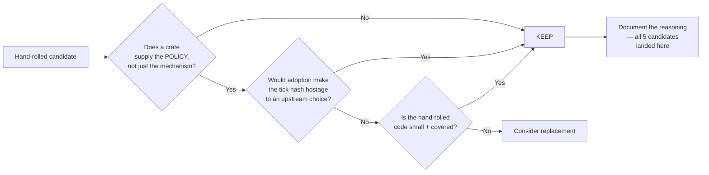
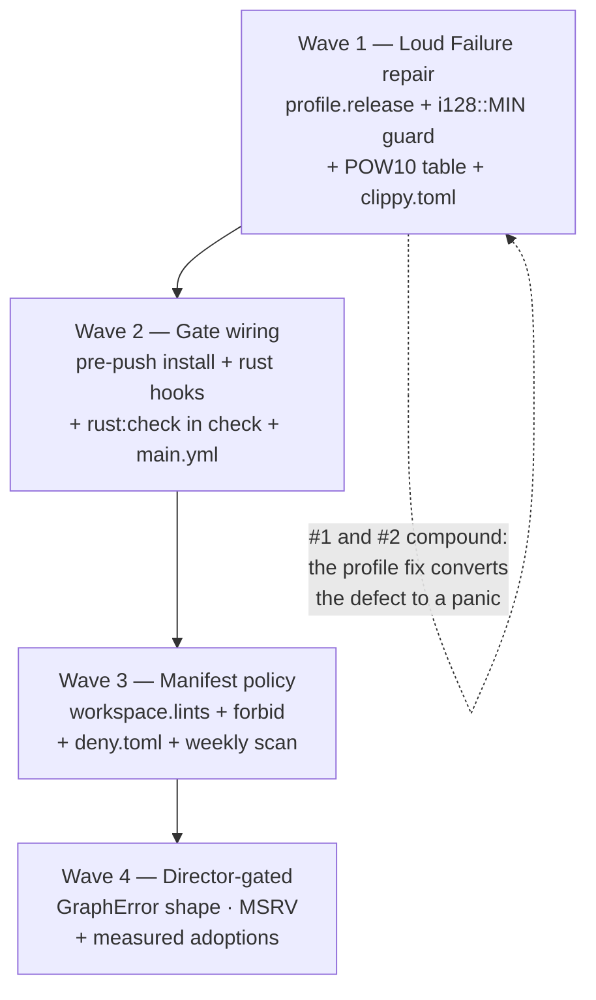

# Rust Estate Audit — 2026-07-31

**Scope:** `rust/` workspace (7 crates), its toolchain/manifest configuration, its gates
(pre-commit, mise, CI), and the hand-rolled-vs-crate question across `babylon-kernel`,
`babylon-graph`, `babylon-bsl`, `babylon-tick`.
**Method:** six parallel read-only surveys + five adversarial verdicts on hand-rolled code.
**Nothing was compiled or executed.** See §7 for what that costs this audit.
**Prepared for:** the Director.

---

## 1. Verdict

The Rust *code* is tight; the Rust *estate around it* is not. The engine language under
Amendment AE passes through exactly one gate — the `rust-gate` job in
`.github/workflows/ci.yml:147-188`, PR-only — while the frozen, reference-only Python estate
gets pre-commit, pre-push, `mise run check`, and CI. The single most important gap is that
`rust/Cargo.toml` declares **no `[profile.release]`**, so Cargo's implicit
`overflow-checks = false` ships in the release binary — and the adversarial review independently
found a live arithmetic site that this silently converts from a loud panic into a wrong answer
(`round_half_even_div` with `denominator == i128::MIN`, `currency.rs:153`). Those two findings
are separately minor and jointly a Constitution III.11 breach in the money-math intrinsic. Every
other finding is real but subordinate to that compound, and to its structural cause: the
workspace's entire lint and profile policy lives in a shell string in `.mise.toml`, not in the
manifests, so only one invocation on earth actually enforces it.

---

## 2. What is already good

This is not a struggling estate. Credit where it is earned, with citations.

**Panic discipline is close to exemplary.** Zero `unwrap()` / `panic!()` / `todo!()` /
`unimplemented!()` in production code across all four engine crates — all 380+ occurrences live
inside `#[cfg(test)]` modules, established by boundary-line cross-reference rather than eyeball.
The seven production `.expect()` sites each assert a named invariant
(`reader.rs:776` "scale is at most 9 by the check above"; `clock.rs:75` "SimClock::advance: tick
counter overflow"), and the two production `panic!()` sites — `babylon-tui-python/src/lib.rs:44`
and `:67` — are the deliberate III.11 loud-failure pattern the crate's own doc comment at
`lib.rs:16-24` explains.

**The determinism reasoning is written down, not assumed.** `state_hash.rs:10-14` states the
cross-language contract explicitly ("another engine in another language must be able to reproduce
these bytes from this description alone") and `:34-36` names the sort as "the whole determinism
argument." `rng.rs:49-51` explains length-prefixing so `("ab","c")` and `("a","bc")` cannot
collide; `:87-90` explains the 53-bit float conversion as platform-independent by construction.
`grid.rs:1-8` records that the ROUND_HALF_UP port was *verified against the live Python on
2026-07-30 before the file was written* — "transcription discipline, not assumption." That is
the standard the rest of this dossier measures against.

**Ordered collections are used correctly where order feeds the hash.** Every determinism-relevant
iteration reaches for `BTreeMap`/`BTreeSet`; `MemoryGraph` uses `HashMap` for storage and sorts
at the encode boundary (`memory.rs:81-121`), which is the correct split. The `EventBus` uses a
flat `Vec` with linear scan rather than a `HashMap`, making it deterministic by construction —
stronger than the Python original it ports.

**`#[allow]` sites carry proofs, not shrugs.** 12 of 15 sites carry a specific exactness argument
(`rng.rs:91` "53-bit value: exact in f64 by construction"; `scenario.rs:335-341` guards with a
runtime `unsigned_abs() > 1<<53` check *before* allowing the cast). Three lack one — see §3.

**BSL's fuel meter is a real answer to a hard problem.** `fuel.rs` / `bound_checker.rs` /
`evaluator.rs` give content-driven recursion a two-layer bound: a load-time static cost proof
against declared cardinality ceilings, backstopped by a runtime fuel charge that errors loudly on
mismatch. That is a genuine discharge of the "statically provable loop bound" rule for the one
place a fixed cap is impossible (arbitrary rule ASTs).

**`cargo-deny` is well-configured and honestly annotated.** `rust/deny.toml` runs all four checks
(`ci.yml:184-188`), sets `[graph] all-features = true`, and gives each of its two advisory
ignores a dependency path *and* an exit condition (`deny.toml:16-18`). The `[sources]` allowlist
for the rev-pinned `hypergraph-rs` git dep notes explicitly that no advisory feed covers a git
dep. `wildcards = "deny"` with `allow-wildcard-paths = true` shows the distinction was thought
about.

**`babylon-graph` and `babylon-tick` have zero external runtime dependencies**, and
`babylon-kernel`'s four (`bnum`, `rand_chacha`, `rand_core`, `sha2`) are all determinism-load-
bearing. The engine core's whole external surface is auditable from the manifests. Whatever else
changes, protect that property.

**Function length and complexity are fine.** Only three functions exceed 80 lines
(`capacity.rs:270-382` at 113, `babylon-tick/src/main.rs:66-167` at 102,
`reader.rs:344-432` at 89), none tangled. `capacity.rs` and `memory.rs` are majority test code.

---

## 3. Gaps, ranked

Ranked by (severity × likelihood) / effort. Every row cites a file:line or config location.

| # | Gap | Sev | Effort | What breaks if ignored |
|---|-----|-----|--------|------------------------|
| 1 | **No `[profile.release]`** in `rust/Cargo.toml` (verified: file is 22 lines, `[workspace]` + `[workspace.package]` only). Cargo's implicit release default is `overflow-checks = false`. | high | trivial | **Compounds with #2.** Dev builds panic on overflow; the shipped release binary wraps silently and produces a *different tick hash* with no error. This is exactly the class III.11 exists to catch. Also leaves `codegen-units` at the release default of 16 — the last undeclared LLVM nondeterminism axis, in a project that pinned BLAS to 1 thread for precisely this reason. |
| 2 | **`round_half_even_div(n, i128::MIN)` is silently wrong in release.** `currency.rs:153` calls `denominator.abs()`, which overflows for `i128::MIN`: panics in debug, returns `MIN` (still negative) in release. The `Ordering` comparison then always yields `Greater`, so the quotient steps when it must not — `round_half_even_div(1, i128::MIN)` should be `0`, returns `-1`. | high | trivial | A silent wrong answer inside the §6.2 normative rounding intrinsic, re-exported publicly at `lib.rs:17`. Not reachable through BSL today (`evaluator.rs:565` rejects `divisor <= 0`, param is `i64`), so the guarantee rests on caller discipline, not on the intrinsic. Fix: compare via `unsigned_abs()`. Note `div_integer`'s `# Panics` section (`:129-131`) also omits the `r.checked_mul(2)` overflow case. |
| 3 | **`f64::powi` in three BSL evaluation paths that feed the state hash** — `evaluator.rs:231`, `rule_pipeline.rs:204`, `tick.rs:201`. Rust std documents `powi` precision as "non-deterministic… varies by platform, Rust version, and can even differ within the same execution." No `clippy.toml` exists anywhere (verified: `find` returns empty). | high | trivial | Latent, not live: LLVM lowers `powi` to an exact multiply chain for n∈[0,9] on mainstream targets, and the `scale ≤ 9` bound **is** enforced at `reader.rs:766-776`, not merely asserted in prose as one survey claimed. Becomes real on a Rust version bump or a new target. III.7 makes latent non-determinism a bug regardless. Fix: a `const POW10: [f64; 10]` table + `rust/clippy.toml` `disallowed-methods` so it cannot recur. |
| 4 | **The local `pre-push` hook is git-lfs's stub, not pre-commit's.** `cat $(git rev-parse --git-common-dir)/hooks/pre-push` prints only `git lfs pre-push "$@"` (verified). The shared git-common-dir is `/home/user/projects/game/babylon/.git`, so this affects every worktree. | high | trivial | **Scope is wider than Rust.** All 10 hooks declared `stages: [pre-push]` are dormant for everyone — including `semgrep` (architectural rules, `.semgrep.yml`) and `radon-mi`, which have **no CI fallback** (`ci.yml` contains no semgrep or radon step). Two declared gates are currently running nowhere, on any branch, in any language. Fix: `uv run pre-commit install --hook-type pre-push`. |
| 5 | **`rust:check` is in neither `mise run check` nor pre-commit.** `.mise.toml:149` `depends = [...]` has no Rust entry (verified). `rg -i 'rust\|cargo' .pre-commit-config.yaml` returns only three *exclude* patterns for the vendored `babylon-md` (lines 229, 237, 240). | high | small | Under Amendment AE, a contributor or agent can run the full documented Definition-of-Done gate, commit through pre-commit, and never compile the engine. First signal arrives in PR CI. Already tracked as task #49 / issue #442; this audit supplies the evidence. |
| 6 | **No `[lints]` / `[workspace.lints]` table anywhere** (verified: zero matches across `rust/Cargo.toml` and all 7 crate manifests). Policy lives entirely in `.mise.toml:1632-1648`. | high | small | `cargo clippy` from rust-analyzer, an IDE, an agent, or a fresh clone applies a *weaker* lint set than the gate. The pedantic tier is also asymmetric with no stated reason: `.mise.toml:1643,1645` give `-D clippy::pedantic` to `babylon-kernel` and `babylon-bsl` only. `babylon-graph`'s pedantic rests solely on its source attribute (`lib.rs:28`); `babylon-tick` — the tick-driving crate — has **no crate-level attributes at all** and gets neither pedantic nor `forbid(unsafe_code)`. Directly under-serves house rule #7. |
| 7 | **`state_hash.rs` claims a cross-language contract but pins almost no bytes.** Five of its six tests are purely relational (equal/not-equal/stable) and would stay green if every integer flipped to little-endian. The one byte-pinning test (`:322-338`) checks `bytes[0..13]` of section `0x01` and stops. | high | small | The engine's central determinism artifact has weaker byte-pinning than its own siblings: `content_digest.rs:69-92` pins two hex digests cross-checked against Python, and `canonical_ast.rs:298-305` pins the spec's 421-byte worked example and both digests. Under Amendment AE the Rust estate's gates must be at least as strong as Python's. Here they are not. Fix: one end-to-end test over all four sections pinning the full digest. |
| 8 | **`StateEncoder`'s sort precondition is enforced by doc comment only.** `write_nodes`/`write_attributes`/`write_edges`/`write_hyperedges` (`:123`, `:136`, `:154`, `:173`) each say "must already be sorted"; the encoder deliberately does not reorder. | high | trivial | The sole caller `MemoryGraph::encode_state` (`memory.rs:81-121`) honours it — verified, all four keys match. But **ADR179 T3 puts a second substrate behind this trait.** A second implementation passing unsorted rows produces a per-process-varying tick hash with every existing test green, because every test uses the one compliant caller. Fix: `debug_assert` the ordering inside each `write_*`. |
| 9 | **`main.yml` — the "full pipeline" on push to `main` — has zero Rust jobs** (verified: `rg 'cargo\|rust' .github/workflows/main.yml` returns nothing across 383 lines). | high | small | The deep validation tier is a total Rust blind spot while `ci.yml`'s dev lane runs `rust-gate`. Bites on a direct push to `main`, an admin override, a hotfix, or any squash/rebase producing a tree the PR never validated. |
| 10 | **`round_half_even_div_i256` has no direct test.** The test module imports `round_half_even_div` only; the i256 twin (`currency.rs:181-198`) is exercised only indirectly through `div_currency`'s three tests (`:282-304`), none of which lands on a tie. | med | trivial | A duplicated determinism-critical algorithm with no equivalence check — the tie-to-even branch, the subtle half, is untested in one of its two copies. Fix: a differential test `i256(widen(n), widen(d)) == widen(i128(n, d))` over the existing sign-quadrant table plus ties. This is the correct DRY mitigation, **not** genericization (see §4). |
| 11 | **No scheduled RustSec scan.** `cargo-deny` runs only in `ci.yml` (push to `dev`, PR, dispatch — `ci.yml:18-22`). `weekly-security.yml:29-30` has exactly one step: `mise run security:pip-audit`. Verified. | med | trivial | 355 locked crates; a new critical advisory against an unchanged lockfile is invisible until the next push. The frozen Python estate has the weekly scan; the live engine does not. Fix: copy the `cargo-deny-action` step into `weekly-security.yml` with `command: check advisories` only. |
| 12 | **`deny.toml` leaves `unused-ignored-advisory` at its `warn` default.** The file's header states each ignore "names its dependency path and its exit condition" (`deny.toml:10-12`) — but nothing fires when the exit condition is met. | med | trivial | When log4rs moves to yaml-rust2, the stale ignore sits there emitting a warning nobody reads. Also `unsound` defaults to `"workspace"` (transitive unsoundness passes silently) and `maximum-db-staleness` to `P90D`. Three lines make the file's own stated discipline self-enforcing. |
| 13 | **`cargo-deny-action@v2` ships an unpinned `cargo-deny` binary** (`ci.yml:185`). The action exposes no version input; the `v2` tag tracks a moving tool. | med | trivial | Gate semantics can change with no commit in this repo to point at — out of step with an estate that pins sqlite to 3.53.1, Rust to 1.91.1, and `hypergraph-rs` to a rev, each with a written rationale. Fix: pin the action to a SHA (Dependabot's `github-actions` ecosystem will bump it). |
| 14 | **The declared MSRV is false.** `rust/Cargo.toml:20` declares `rust-version = "1.87"` with a five-line comment explaining why a false floor would be wrong. `babylon-md/Cargo.toml:13` declares `1.88.0` and is a workspace member. Verified both. Nothing anywhere verifies either. | med | trivial | The manifest violates the principle its own comment states, by one minor version. **Prefer demotion to tooling**: every crate is `publish = false` and the toolchain is patch-pinned, so this is a promise made to nobody. Either raise to `1.88` or drop the claim and let `rust-toolchain.toml` be the single truth. Do *not* add a `cargo-hack` MSRV leg to defend it. |
| 15 | **`#![forbid(unsafe_code)]` missing on `babylon-tick` and `babylon-tui`** — present on kernel (`lib.rs:4`), graph (`lib.rs:27`), bsl (`lib.rs:3`); absent from the other three (verified). Neither `babylon-tick` nor `babylon-tui` contains any `unsafe`. | med | trivial | Free today, and converts "we happen to have none" into "unsafe cannot be added without a reviewed attribute removal." **`babylon-tui-python` must NOT get it** — pyo3 0.29's `#[pymodule]`/`#[pyfunction]` expansion emits `unsafe` blocks and `forbid` would fail to compile. |
| 16 | **No `missing_docs` lint anywhere** (verified: zero matches workspace-wide), yet `babylon-kernel/src/lib.rs:2-3` claims "every public item is doc-commented (`RUSTDOCFLAGS='-D warnings' cargo doc` gate)." | med | small | `missing_docs` is allow-by-default and is *not* enabled by `-D warnings`; the cited gate catches broken intra-doc links, not missing docs. Per the project's own verifiability principle: back the claim with `#![warn(missing_docs)]` or weaken the comment. |
| 17 | **No Rust coverage measurement at all**, while `.mise.toml:367` gates Python at `--fail-under=80`. | med | medium | The coverage gate sits entirely on the frozen estate. Tool choice is clear-cut — see §5. Do **not** import the 80% number; measure first. |
| 18 | **Three `#[allow]` sites carry no rationale**, against 12 that do: `structural_verbs.rs:164`, `:180` (`too_many_arguments`), `:736` (`type_complexity`). Also `scenario.rs:379`'s `cast_precision_loss` lacks the exactness bound its sibling 39 lines earlier enforces at `:335-341`. | med | trivial | Erodes the discipline that makes the other 12 trustworthy. Four one-line comments. |
| 19 | **`babylon-tui`'s 999-line raster surface** (`raster_bridge.rs` 125 + `scene3d.rs` 874, both `#[cfg(feature = "raster")]`) — no CI step passes `--features raster` or `--all-features`. **Surveys disagree on whether it is covered.** See §3.1. | med | small | Coverage of a 999-line surface depends on a feature-unification side effect of an unrelated crate's dependency declaration rather than on any deliberate request. |
| 20 | **`count_as_f64()` duplicated byte-for-byte** — `exposure.rs:57-61` and `backfire.rs:137-141`. The second copy's doc comment *notices* the duplication ("matching `crate::exposure`'s discipline") without fixing it. | low | trivial | Two copies of one overflow policy in a determinism-critical crate; they diverge the first time one is tweaked. |
| 21 | **`babylon-md` ships two test-only crates in `[dependencies]`** — `pretty_assertions` (`:35`) and `rstest` (`:38`); every use is inside `#[cfg(test)]`. Verified. | low | small | Inherited from upstream tui-markdown 0.3.9, not authored here. Costs build time and audit surface on every client build. **No unused-dep tool catches this** — cargo-shear's own docs state `#[cfg(test)]` unit-test deps cannot be detected as misplaced. In-policy as a fourth BABYLON PATCH; worth upstreaming. |
| 22 | **No `[workspace.dependencies]`** — `sha2` declared twice (kernel `:14`, bsl `:21`), `ratatui` **three** times (md `:45`, tui `:45`, tui-python `:21`), `pretty_assertions` four times. | low | small | `babylon-tui-python`'s standalone `ratatui = "0.30"` is redundant with its transitive requirement through `babylon-tui`. A one-sided semver bump there produces a hard type mismatch at exactly the FFI boundary that crate exists to bridge. |
| 23 | Rust toolchain install duplicated inline in `ci.yml:56-59` (build-wheel) and `:159-163` (rust-gate), already drifted — only rust-gate adds `--component rustfmt --component clippy`. No `bootstrap-rust` composite action exists (`.github/actions/` has only bootstrap-python, fetch-reference-db, postgres-up). | fyi | trivial | DRY only, not gate correctness. |
| 24 | `babylon-kernel::event_bus` (428 lines, ~30% of the crate) and `ContentDigest` have **zero callers** outside their own tests (verified by workspace-wide `rg`). | fyi | trivial | Not a bug — deliberately-dormant constructs under ADR109's wiring doctrine, documented as such at `event_bus.rs:1-4`. Flagged so they get a Phase-2/3 wiring-gap-ledger row rather than quietly rotting. |
| 25 | Edition is 2021 workspace-wide (`Cargo.toml:15`); 2024 stabilized in 1.85 and the pin is 1.91.1. | fyi | medium | Not urgent. If migrating, do it while the workspace is 7 small crates. The 2024 `unsafe extern` requirement is a genuine safety-visibility win at the pyo3 boundary. `babylon-md` should stay on 2021 to keep upstream rebases cheap. |

### 3.1 Where the surveys disagreed

Two disagreements, neither resolved by reading alone. Recording both rather than picking.

**(a) Is the `raster` feature actually linted?** The static-analysis survey says the raster
surface "is never deliberately linted by any CI step" and flags whether workspace feature
unification covers it as "a real but unverified question." The ecosystem survey asserts the
opposite reading as a *strength*: because `babylon-tui-python/Cargo.toml:16` declares
`babylon-tui = { path = "../babylon-tui", features = ["raster"] }` (verified), the
`--workspace` legs unify raster ON, while the scoped `-p babylon-tui` legs
(`.mise.toml:1640-1641`) build it alone with raster OFF — so *both* configurations are covered,
which is why `cargo-hack` is unnecessary.

The mechanism the ecosystem survey describes is real and documented (resolver 2 unifies features
across normal dependencies of packages built together), and I verified the dependency
declaration. It is the more likely reading. But **neither agent ran cargo**, and the conclusion
"our glyph-floor fallback is tested" rests on it. Resolve by measurement, not by argument:
`cargo tree -p babylon-tui --workspace -f '{p} {f}'`. Either way the coverage should be
*requested*, not inherited — and if the ecosystem survey is right, its recommendation stands
independently: **add a comment to `rust:check` explaining why the `-p babylon-tui` legs follow
the `--workspace` legs**, or a future simplification pass will delete them as redundant and
silently drop all coverage of the Amendment AE clause (xi) glyph floor
(`views/topology.rs:624, 816, 821, 826`).

**(b) Should `GraphError` gain `Display` + `Error`?** The code-quality survey rates its absence
`medium` and recommends adding both, noting `substrate.rs:45-49` is a single opaque
`{ message: String }` against `babylon-bsl`'s ten disciplined per-module error enums. The
adversarial verdict on the same subject argues the *opposite*: `babylon-graph` currently has zero
external dependencies, its errors are matched at construction and propagate as typed values, and
the correct action is to **document why** they deliberately implement neither. Both agree the
status quo is undocumented. They disagree on the remedy. My reading: `impl Display` costs no
dependency (it is std), so the two positions are less opposed than they look — add `Display` +
`Error` (which the adversarial verdict's dependency argument does not touch), keep the enum split
deferred, and document the reasoning either way. Flagged for the Director because it is a taste
call inside her estate, not a correctness one.

**(c) Minor factual correction.** The ecosystem survey lists three `powi` sites; there is a
fourth at `babylon-tui/src/scene3d.rs:225` (`(x - sx).powi(2) + …`). It is rendering IDW
interpolation and does not feed the tick hash, so the survey's *conclusion* is unaffected — but a
`clippy.toml` `disallowed-methods` entry would fire there too and needs a scoped `#[allow]` with
a "rendering, not hashed" comment.

---

## 4. The hand-rolled question

Five candidates went to adversarial review. **All five came back JUSTIFIED_BUT_DOCUMENT. Zero
replacements are recommended.** The point of recording them here is so nobody re-litigates them
in six months — each defence is stated in enough detail to close the question.



### 4.1 DEFENDED — do not re-open

**Graph traversal (`exposure.rs`, `backfire.rs`) — petgraph rejected.** Four independent grounds.
`petgraph::algo::connected_components` returns a *count*, not the partition
`components()` produces (`Vec<Vec<NodeId>>`, members ascending, components ordered by smallest
member); it also requires `NodeCompactIndexable`, and `NodeId` is deliberately opaque and
non-compact (`substrate.rs:30-33`) over a sparse id space. petgraph's `IntoNeighbors` returns an
**infallible** iterator; `GraphSubstrate::neighbors()` returns `Result` for a ruled reason
(`substrate.rs:172-176`: "a dangling NodeRef must never read as an empty neighborhood"). Any
adapter must swallow the error — silently converting a dangling ref into "coordinates with
nobody," a determinism-stable *wrong* answer — or panic. Third: `signature_in_scope` is **not a
BFS**. It computes Everett & Borgatti layering with no visited-set exclusion; the test at
`exposure.rs:381-391` pins hub `= [3,1]` in a 3-star, where the hub's second layer is the hub
itself. `petgraph::visit::Bfs` visits each node once and would return different numbers —
a semantic change disguised as a refactor. Fourth: `backfire::measure` is not a traversal at all
but a declared modelling partition. And the project already ruled this way for the *storage*
layer (`docs/reference/graph-storage-capability-delta.md` §1), for reasoning that transfers
verbatim.

**Half-even rounding division (`currency.rs:147-198`) — `rust_decimal` rejected.** The algorithm
**is** a normative spec clause: `docs/reference/determinism-contract.rst:1177-1180` is marked
"normative as of Phase 1 Task 3" and states it in prose, statement for statement, with three
worked examples pinned as tests at `currency.rs:230-248`. Replacing it would make a normative
constitutional document describe something Babylon no longer computes. The hostage argument is
not hypothetical *in this exact file*: `currency.rs:166-176` documents the bnum 0.14 break
verbatim (`From<primitive>` → `TryFrom`, `ZERO`/`ONE` consts removed) — and note precisely what
survived it. The 18-line rounding algorithm was untouched, because it depends on nothing but
`/`, `%`, `signum`, `abs` and `Ord`, semantics fixed by the language reference. `rust_decimal` is
base-10, 96-bit significand, max scale 28 — a representation change, not a swap, and it offers no
half-even integer division at i128, let alone at the I256 width `div_currency` provably needs
(`:297-304` shows the i256 intermediate is load-bearing). **Genericizing the i128/I256 duplicate
is also rejected**: it needs either `num-traits` (a new dependency edge in the determinism path,
to save 18 lines) or ~30 lines of sealed trait to eliminate 18 — and it would obscure the real
difference between the two copies (`checked_mul(2)` vs an unchecked multiply with a headroom
argument at `:185`). The correct DRY mitigation is the differential **test** at gap #10.

**Canonical binary encodings (`state_hash.rs`, `canonical_ast.rs`) — bincode/postcard rejected.**
The decisive fact the original survey missed: this is not a one-off hand-roll but the project's
**normative house encoding**, specified in `docs/reference/bsl-language.rst` §5.1-§5.5
("All multi-byte integers are big-endian"; "always length-prefixed, never NUL-terminated") and
already implemented three times — `canonical_ast.rs`, `content_digest.rs` (where the empty rule
set's hash is literally `SHA-256(0x03 ‖ u32 0)`, recomputed independently at `:101`), and
`state_hash.rs`. `content_digest.rs:37-42` states the reason: "the kernel owns the project's one
hashing convention so that content, state and any future digest agree **by construction rather
than by coincidence**." Adopting a serializer for the state half while the content half stays
spec-normative would fork that convention down the middle. It would also break the rewrite test
(III.12 / Amendment Q): "reproducible from a 10-line prose diagram" becomes "reproducible by
reimplementing a Rust crate." And option (c) — delegate only float canonicalization — is the
worst of the three: `push_f64` (`:106-121`) is four lines and every one is project policy.
It **refuses NaN loudly** ("a hash that silently accepted one would launder it", `:50`) where a
serializer would happily encode the bit pattern, and it normalizes `-0.0 → +0.0` because an
upstream sign bit from `-1.0*0.0` is not a change in the world. Note finally that the "serialization
is easy to get wrong" heuristic does not apply: **there is no decoder.** `StateEncoder` is
write-only, and the entire class of subtle serialization bugs lives on the decode side.

**BSL lexer/parser (`reader.rs`) — nom/chumsky not recommended.** Explicit-stack iterative design
so hostile nesting cannot overflow (`:278-282`, tied to III.11: "a crash is not a loud error"),
small grammar, minimal dependency graph. Honest caveat, stated by the survey itself: a
combinator crate *can* be written stack-safely, so the anti-recursion argument alone does not
force hand-rolling. The stronger argument is that its 26 `LexCode` variants carry the BSL spec's
error codes verbatim, which is the same policy-not-mechanism point as everywhere else here.

**`EventBus` (`event_bus.rs`) — pub/sub crates rejected.** The four guarantees are a
project-specific contract, not plumbing: registration-order synchronous dispatch,
append-before-emit history, priority-descending stable sort with registration-order tiebreak, and
an ALLOW/BLOCK/MODIFY verdict where a BLOCK logs the **original** pre-modification event for
auditability while a MODIFY is what history and handlers see (`rs:161`, `:169-172`, pinned at
`:394-427`, mirroring the Python `# Log original event for auditability`). Mainstream Rust
pub/sub crates are concurrency primitives that trade cross-subscriber ordering for throughput —
the exact property III.7 needs is the one they decline to guarantee, and several key subscribers
by `HashMap` with per-process `RandomState`. The current design's total external determinism
surface is **one** documented std guarantee (`slice::sort_by_key` stability). That is the floor.
The port itself was already ruled: `docs/superpowers/specs/2026-07-28-program-27-refoundation-design.md:321`
— "EventBus … **Port.** … preserved byte-for-byte." Two traps it avoided that a reviewer should
know it avoided: it uses `Reverse(priority)` rather than negating the key (negation overflows on
`i32::MIN`), and it sorts *indices* rather than the interceptor vector.

**Also correctly hand-rolled, no dissent:** `grid.rs:17-32` (ROUND_HALF_UP ported byte-for-byte
and verified against live Python before the file was written — the strongest example in the tree
of hand-rolling being the correct choice); `rng.rs` seed-framing and 53-bit float conversion
(the generator itself is `rand_chacha::ChaCha8Rng`, **not** hand-rolled — a sweep for LCG/xorshift/
splitmix constants across the tree returned empty); `memory.rs`'s monotonic `u64` id counters
(`slotmap`/`generational-arena` exist to *enable* id reuse, the exact opposite of the invariant
at `:151-155`); `babylon-tick`'s five-line positional argv destructure.

### 4.2 Questions for the Director

Only two items in this entire audit are hers rather than an agent's.

1. **`GraphError`'s shape.** Two surveys reached opposite recommendations (§3.1(b)). It is a
   taste call about how much error ergonomics the engine core buys with std-only tools. My
   suggestion: `impl Display` + `impl Error` (zero dependency cost), defer the enum split, and
   write down the reasoning. But it is your estate's idiom.
2. **The MSRV claim (gap #14).** The comment at `rust/Cargo.toml:15-19` states the right
   principle and the manifest violates it. The question is not how to verify 1.87 — it is
   **whether the promise should exist**. Every crate is `publish = false`, there are no external
   consumers, and `rust-toolchain.toml` pins 1.91.1. An MSRV is a promise to people building with
   an older compiler, and this project has none. Recommend demotion over tooling; your call.

Nothing else here touches the ideological line, a constitutional primitive, or a theory ruling.
The rest is engineering an agent can execute against a green gate.

---

## 5. Recommended tooling

Four adoptions survive scrutiny. Everything else was rejected, and §5.2 is the more valuable half.

| Tool | What it catches **here** | Where it runs | Cost |
|------|--------------------------|---------------|------|
| **`rust/clippy.toml`** with `disallowed-methods` | The gap #3 `powi` class and its successors: `f64::powf`, `exp`, `ln`, `log10`, trig, and `mul_add` (explicit FMA changes rounding). This is the *answer* to "is there tooling to detect non-deterministic float usage in Rust" — there is no dedicated tool; `clippy.toml` is the mechanism, and it is how determinism-critical crates in the ecosystem handle it. | Free — `clippy::disallowed_methods` fires as a warning once entries exist, and the existing `-D warnings` (`.mise.toml:1638`) promotes it. Zero new invocations. | trivial |
| **`cargo-llvm-cov`** | Nothing today; it *measures* so a floor can be set from reality. LLVM source-based instrumentation, region granularity, Linux/macOS/Windows. | New `rust:coverage` mise task → CI rust-gate as a **reporting step first, no threshold.** | medium |
| **`cargo-nextest`** | **Process-per-test isolation — a determinism check, not a speed feature.** libtest runs all tests of a binary in one process; a `OnceLock`, `lazy_static`, or thread-local primed by an earlier test stays warm. For an engine whose whole contract is that identical inputs give identical hashes, a test that passes only because a predecessor warmed a global is a false green over exactly the property being asserted. Nextest also gives per-test timeouts (a hang dies loudly instead of eating the 20-min ceiling) and `--retries` flaky classification. | Replaces `cargo test` in `rust:check`; **add an explicit `cargo test --workspace --locked --doc` leg**, since nextest does not run doctests. | small |
| **`cargo-mutants`** (local-only) | Whether tests would *notice* a mutation, which coverage cannot distinguish — pointed at `grid.rs`, `content_digest.rs`, `currency.rs`, `bound_checker.rs`, exactly where a surviving mutant is most dangerous. Already installed at `~/.cargo/bin/cargo-mutants`, unwired. | New `rust:mutants` mise task, description stating **LOCAL-ONLY, never CI**, mirroring the Python mutmut scoping. Do not gate on the score. | small |

Two integration costs to know before adopting nextest: the 22 `insta` snapshot files need
`cargo insta test --test-runner nextest` when *accepting* snapshots (plain verification is
unchanged), and `cargo llvm-cov` + nextest need the documented three-step doctest merge. Expect
the first nextest run to surface real failures — **treat any test that passes under `cargo test`
and fails under nextest as a genuine defect (shared global state) and fix the test.** Never paper
over it with `test-threads=1`.

For coverage: do **not** import Python's 80% (`.mise.toml:367`). It was chosen for a
differently-shaped estate, and inventing a threshold before measuring is exactly the
unverified-claim pattern the documentation philosophy forbids. Scope any eventual `--fail-under`
to kernel/graph/bsl; `babylon-tui` is UI where percentage is a poor proxy, `babylon-md` is
vendored.

### 5.2 NOT recommended, and why

Eleven tools were evaluated and rejected. Several because the existing setup already covers the
ground correctly — which is itself a finding.

- **`miri`** — kernel, graph and bsl already carry `#![forbid(unsafe_code)]`; tick and tui contain
  zero `unsafe`. The only unsafe in the workspace is pyo3 macro expansion in
  `babylon-tui-python`, and miri cannot meaningfully execute a CPython extension module. Its
  10-100× slowdown buys nothing. **Gap #15 (add `forbid` to tick and tui) is the cheap structural
  substitute** — it is the finding that makes miri unnecessary, not the one that motivates it.
- **`cargo-careful`** — same reasoning; ~1.5× overhead on every test run for nothing.
- **`cargo-audit`** — strictly redundant with cargo-deny's `advisories`: same RustSec database,
  same ignore mechanism. Adopting it creates a *second* place to record an ignore, and they
  drift. The real gap is **scheduling** the cargo-deny you already have (#11).
- **`cargo-udeps`** — requires nightly, contradicting `rust-toolchain.toml`'s `channel = "1.91.1"`.
  A moving nightly beside a patch-pinned stable, in a repo that pins sqlite for byte-identity, is
  a poor trade.
- **`cargo-machete` / `cargo-shear`** — near-zero payoff on seven hand-curated manifests where
  nearly every entry carries a justifying comment. And **neither detects the one real misplaced
  dependency in the tree** (gap #21) — cargo-shear's own docs state `#[cfg(test)]` unit-test deps
  cannot be detected as misplaced.
- **`cargo-hack`** — two non-default features total (`raster`, `highlight-code`), and both are
  already exercised (subject to §3.1(a)). Also do not add it to defend the MSRV: paying a CI leg
  for a promise made to nobody is ceremony.
- **`cargo-semver-checks`** — every crate is `publish = false`. No API consumers, no semver
  surface, zero value.
- **`cargo-vet` / `cargo-crev`** — cargo-vet's reference deployment is mozilla-central; this is a
  solo-Director project with 355 locked crates. The per-crate audit burden is disproportionate.
  The existing defence (`[sources]` allowlist, rev-pinned git dep, committed lockfile, `--locked`
  everywhere) is proportionate.
- **`committed` / `cocogitto`** — `commitizen` already validates commit messages at
  `.pre-commit-config.yaml:169-173`. A second conventional-commit validator is the same
  duplication failure as cargo-audit vs cargo-deny.
- **`typos` / `typos-cli`** — 22 `insta` snapshots plus byte-identity baselines. A
  spell-corrector touching a string literal inside a golden, a BSL identifier, or a snapshot
  silently drifts a hash. The exclude list needed to make it safe removes most of the value.
- **`bacon` / `cargo-watch`** — local ergonomics, zero gate value, and mildly at odds with the
  single-flight heavy-build rule (a save-triggered rebuild loop competes for the one target-dir
  lock).
- **Reproducible-builds tooling** — the property this project needs is not a byte-identical
  *binary* but an identical *tick hash across platforms*, which no reproducible-builds checker
  measures. The genuine post-1.0 gap is running the hash-conformance tests on macOS/Windows
  runners — which is exactly what would have caught the `powi` hazard. Amendment AA shields
  pre-1.0 from Windows obligations, so this is correctly deferred, but note it for the 1.0 plan.
- **`clippy::cargo`** — most of its lints target crates.io publishing metadata, moot for
  `publish = false`; its one substantive lint (duplicate versions) has already been deliberately
  ruled on in `deny.toml:21-25` with a written rationale.
- **`clippy::as_conversions` / `clippy::float_arithmetic`** — the first would force a *second*
  allow attribute on ~15 already-reasoned cast sites with zero new information; the second exists
  for no_std contexts avoiding floats entirely, not a floating-point economic simulation.

**Worth adopting from clippy's restriction tier, at near-zero cost** (measured, not guessed):
`clippy::unwrap_used` — a per-file sweep splitting occurrences by `#[cfg(test)]` boundary found
**zero production `.unwrap()` in any of the four crates** (graph 251/251 in tests, bsl 100, kernel
29, tui 11 — all test-side), so this converts an already-followed informal discipline into a
self-defending gate with `#[cfg_attr(test, allow(...))]` as the escape valve. And
`clippy::panic` — it would need **exactly one** documented allow workspace-wide
(`babylon-tui-python/src/lib.rs:44,67`, whose III.11 rationale is already written in prose).
`clippy::arithmetic_side_effects` should be scoped to `currency.rs` only, not crate-wide.
`clippy::indexing_slicing` is worth **one local sweep**, not a standing gate — a panic on
out-of-bounds is already III.11-compatible, so a permanent gate would just push code toward
`.get(i).expect(...)`: the same panic with more ceremony.

---

## 6. Proposed execution order

Four waves. Waves 1-3 are agent-executable and self-merge on green. Wave 4 needs a ruling.



### Wave 1 — Loud Failure repair (agent, self-merge on green)

Do this first. Gaps #1, #2, #3, #8, #10, #18. These are correctness, not hygiene, and #1+#2
compound.

**1a.** `rust/Cargo.toml`, append:

```toml
# Determinism knobs, declared rather than inherited (Constitution III.7/III.11).
# overflow-checks in release: an overflowing tick/currency value must PANIC in
# the shipped binary, not wrap into a different hash. Same tradeoff already made
# for the BLAS=1 pin — pay the perf cost to keep Loud Failure.
# codegen-units=1: removes the last LLVM codegen-unit-boundary nondeterminism axis.
[profile.release]
overflow-checks = true
codegen-units = 1

# Declared so the next reader does not have to reconstruct Cargo's implicit table.
[profile.dev]
overflow-checks = true
```

**1b.** `currency.rs:153` — replace `denominator.abs()` with an `unsigned_abs()`-based comparison
(cannot overflow), or reject `denominator == i128::MIN` explicitly. Add the `r.checked_mul(2)`
overflow case to `div_integer`'s `# Panics` section (`:129-131`). *Changes no output for any
currently reachable input — a hardening, not a re-bless. If a baseline does move, §6.5 ceremony.*

**1c.** Add `const POW10: [f64; 10]` in `babylon-bsl` and replace `powi` at `evaluator.rs:231`,
`rule_pipeline.rs:204`, `tick.rs:201`. Error loudly for `scale > 9` — the bound is already
enforced at `reader.rs:766-776`, so this makes it enforced *at the consumer* too.

**1d.** New file `rust/clippy.toml`:

```toml
# Determinism contract (III.7): libm transcendentals do not reproduce across
# platforms/Rust versions. std documents f64::powi precision as
# "non-deterministic ... can even differ within the same execution".
# -D warnings (.mise.toml:1638) promotes these to hard errors at zero extra cost.
disallowed-methods = [
  { path = "f64::powi",    reason = "non-portable precision — use the POW10 table" },
  { path = "f64::powf",    reason = "libm — not bit-stable across platforms" },
  { path = "f64::exp",     reason = "libm — not bit-stable across platforms" },
  { path = "f64::ln",      reason = "libm — not bit-stable across platforms" },
  { path = "f64::log10",   reason = "libm — not bit-stable across platforms" },
  { path = "f64::mul_add", reason = "explicit FMA changes rounding" },
]
```

Expect this to fire at `babylon-tui/src/scene3d.rs:225` (rendering IDW, not hashed) — allow it
there with a `// rendering, never reaches the tick hash` comment.

**1e.** `debug_assert` the sort precondition inside `write_nodes` / `write_attributes` /
`write_edges` / `write_hyperedges` (`state_hash.rs:123, 136, 154, 173`). Cheap, and it fires in
the profile where ADR179 T3's second substrate will run its tests.

**1f.** Add the `round_half_even_div_i256` differential test (gap #10), the `state_hash.rs`
end-to-end digest-pinning test (gap #7), and four one-line `#[allow]` rationales (gap #18).

### Wave 2 — Gate wiring (agent; this *is* task #49)

**2a.** One command, and it fixes the Python estate too:

```bash
cd /home/user/projects/game/babylon && uv run pre-commit install --hook-type pre-push
```

Verify with `cat $(git rev-parse --git-common-dir)/hooks/pre-push` — it should show the
pre-commit template *and* a trailing call to the renamed git-lfs legacy script. Then harden it:
extend `tools/check_worktree_contract.py` (or add `check:hooks-installed`) to assert all three
hook types are pre-commit-owned, since this regresses silently on any clone that runs
`git lfs install` before `mise run setup`.

**2b.** Three new mise tasks, mirroring the Python `format`/`format:check` split:

```toml
[tasks."rust:fmt-check"]
description = "Rust format check only, no rewrites (pure syntax pass — safe for pre-commit)"
dir = "rust"
run = "cargo fmt --all -- --check"

[tasks."rust:clippy"]
description = "Rust clippy, workspace + pedantic engine crates (needs warm target/ — pre-push tier)"
dir = "rust"
run = """
set -e
cargo clippy --workspace --all-targets --locked -- -D warnings
cargo clippy -p babylon-kernel --all-targets --locked -- -D warnings -D clippy::pedantic
cargo clippy -p babylon-bsl --all-targets --locked -- -D warnings -D clippy::pedantic
"""

[tasks."rust:test"]
description = "Rust test across the workspace (pre-push CI mirror)"
dir = "rust"
run = "cargo test --workspace --locked"
```

**2c.** `.pre-commit-config.yaml`, appended:

```yaml
  # ==========================================================================
  # RUST — fmt is a pure syntax pass and fast enough for pre-commit; clippy and
  # test need full compilation and move to pre-push (same R4/ADR181 rationale
  # as the Python sentinels/import-boundaries/radon/semgrep hooks above). CI's
  # rust-gate (mise run rust:check) stays the authoritative full gate, including
  # cargo doc and cargo-deny, which are too slow/variable for any local hook.
  # ==========================================================================
  - repo: local
    hooks:
      - id: rust-fmt-check
        name: cargo fmt --check (rust/ workspace)
        entry: mise run rust:fmt-check
        language: system
        pass_filenames: false
        files: ^rust/.*\.rs$

      - id: rust-clippy
        name: cargo clippy -D warnings (rust/ workspace, pre-push CI mirror)
        entry: mise run rust:clippy
        language: system
        pass_filenames: false
        files: ^rust/          # not \.rs$ — a Cargo.toml/lock change must trigger it
        stages: [pre-push]

      - id: rust-test
        name: cargo test (rust/ workspace, pre-push CI mirror)
        entry: mise run rust:test
        language: system
        pass_filenames: false
        files: ^rust/
        stages: [pre-push]
```

**2d.** Add a `rust-gate`-equivalent job to `main.yml` (reuse `ci.yml:147-188` verbatim).

**2e.** Add the missing `-p` clippy legs to `rust:check` — `babylon-graph` and `babylon-tick`,
matching kernel/bsl — and add the explanatory comment about why the `-p babylon-tui` legs follow
the `--workspace` legs (§3.1(a)).

**Do not add `rust:check` to `mise run check`'s `depends` until you have measured the cold and
warm cost.** If it exceeds the fast-loop budget, add a `rust:check-quick` (fmt + clippy, no
test/doc) and depend on that instead.

### Wave 3 — Manifest policy (agent, self-merge on green)

**3a.** `rust/Cargo.toml`:

```toml
[workspace.lints.rust]
unsafe_code = "forbid"

[workspace.lints.clippy]
pedantic = { level = "warn", priority = -1 }
```

Then `[lints] workspace = true` in every member **except**: `babylon-md` (vendored fork — our
pedantic set would generate churn against upstream and make ADR150 rebasing expensive; give it
its own bare block) and `babylon-tui-python` (pyo3 0.29 macro expansion emits `unsafe`;
`forbid` would fail to compile — it needs its own `[lints]` block with a comment naming pyo3 as
the reason). **Hard constraint:** mixing `workspace = true` with per-package lints in the same
`[lints]` table is a hard error, so any exception needs a full block.

Once this lands, delete the now-redundant `-D clippy::pedantic` flags from `.mise.toml:1643,1645`
and let `-D warnings` be the single promotion switch. Adopt `clippy::unwrap_used` and
`clippy::panic` at the same time (measured cost: zero and one allow respectively).

**3b.** `rust/deny.toml`, `[advisories]`:

```toml
unused-ignored-advisory = "deny"   # each documented exit condition becomes a gate (III.11)
unsound = "all"                    # transitive unsoundness is still unsoundness here
maximum-db-staleness = "P7D"       # matched to the weekly scan cadence
```

Expect the first to be a no-op today and to pay off exactly once, loudly.

**3c.** Copy the `cargo-deny-action` step into `weekly-security.yml` with
`command: check advisories` only (bans/licenses/sources are lockfile-shaped — scheduling them
adds noise without signal). Pin the action to a SHA while you are in there (gap #13).

**3d.** Add `[workspace.dependencies]` for the 2+-crate deps and drop
`babylon-tui-python`'s redundant standalone `ratatui`. Move `babylon-md`'s `pretty_assertions`
and `rstest` to `[dev-dependencies]` as BABYLON PATCH 4, in the existing patch-comment style.
Deduplicate `count_as_f64` (gap #20). Add `#![warn(missing_docs)]` to kernel — or weaken the
claim at `lib.rs:2-3`.

### Wave 4 — Director-gated, and measurement-gated

- `GraphError`'s shape (§4.2 item 1) — needs a ruling.
- MSRV: raise to 1.88 or drop the claim (§4.2 item 2) — needs a ruling.
- `cargo-nextest`, `cargo-llvm-cov`, `cargo-mutants` — adopt only after Wave 2 proves the hook
  timings are livable, and after the first nextest run's failures are triaged as real defects.
- Edition 2024 migration (gap #25) — cheap now, expensive after Phase 2 content lands.
- Domain-invariant sentinels for Rust. The ~20 Python `check:*` sentinels plus `.semgrep.yml`
  encode Constitution-level invariants over the *frozen* estate and have **no Rust counterpart**
  — `find rust -iname '*sentinel*'` finds only `babylon-bsl/src/default_lint.rs`, which is a BSL
  *content* lint, i.e. a runtime feature of the DSL, not dev tooling. Clippy cannot express
  Babylon-specific rules at any strictness. This is a design and porting program, not a config
  fix — track it separately, likely first candidates being a hash-stability check (III.7) and a
  no-silent-absence check (III.11).

---

## 7. Limits of this audit

**No agent compiled or executed anything.** No `cargo build`, `check`, `clippy`, `test`, `fmt`,
no `pytest`, no hook run. Every claim above comes from reading source, manifests, workflows and
config, plus `rg`/`find`/`cat`/`sed`. Anything requiring execution is UNVERIFIED and must be
measured before adoption. Specifically:

- **Whether any proposed lint actually fires, and how noisily.** `clippy::unwrap_used`,
  `clippy::panic`, `missing_docs`, `disallowed-methods`, and the `[workspace.lints]` pedantic
  promotion are all predicted from static reading of the code and of clippy's documented
  semantics. The measured `.unwrap()` counts are real (per-file sweeps split on the
  `#[cfg(test)]` boundary), but "therefore zero new warnings" is an inference.
- **Whether `-D warnings` on the `--workspace` leg actually promotes `babylon-graph`'s
  source-level `#![warn(clippy::pedantic)]` to a hard error.** That is a real question about
  Cargo/clippy lint-level composition and it was reasoned about, not tested.
- **Whether `--workspace` unifies the `raster` feature** (§3.1(a)) — the central unresolved
  disagreement between two surveys. Resolve with `cargo tree`, not argument.
- **Hook timings.** "cargo fmt is sub-second, clippy needs a warm target/" is from the tools'
  documented behaviour and the existing 20-minute CI budget, not from a stopwatch on this box.
  The pre-commit/pre-push split in Wave 2 rests on it.
- **Whether `pre-commit install --hook-type pre-push` cleanly migrates git-lfs's existing hook.**
  Pre-commit documents a rename-to-`.legacy`-and-chain behaviour; that was not exercised here.
  Verify the resulting file before trusting LFS push-time behaviour.
- **The `i128::MIN` defect's release-mode behaviour.** Derived from Rust's documented `abs()`
  semantics; the wrong value (`-1` instead of `0`) was computed by hand, not observed. It is also
  the one claim in this dossier where gap #1's fix would change the observation — with
  `overflow-checks = true` in release it panics instead.
- **The upstream doc claims** (`f64::powi` non-determinism, nextest's process isolation, petgraph's
  `connected_components` signature, cargo-shear's `#[cfg(test)]` limitation, cargo-deny's config
  defaults) come from documentation, not from local experiment.
- **Not audited at all:** `babylon-tui`'s ~17.7k lines beyond its lint/feature configuration;
  `babylon-md` internals (correctly treated as vendored third-party per ADR150); the actual
  content of the BSL spec beyond the sections cited by the adversarial reviews; test *quality*
  beyond counting and boundary-classification; and any runtime or performance characteristic
  of anything.

One methodological caveat on §4: the adversarial verdicts were commissioned to stress-test
replacement, and all five returned KEEP. That is a strong signal, but it is five reviews by the
same class of reviewer against candidates selected by another. The defences are cited well enough
that you can check any one of them against the source in a few minutes — please spot-check the
`signature_in_scope`-is-not-a-BFS claim (`exposure.rs:381-391`) and the
`determinism-contract.rst:1177-1180` normativity claim, since those two carry the most weight.
