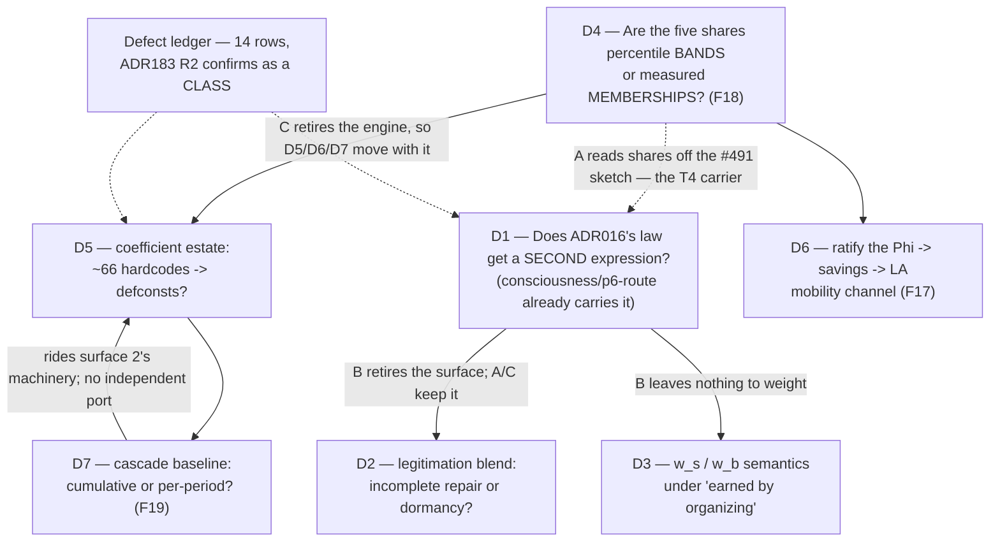

# The TickDynamics Reserved-Trio Dossier — P29-T6

**Status:** research dossier, no code changed, nothing executed. Produced under the Director's
**third-sitting ruling of 2026-08-17**: the TickDynamics reserved trio gets **full dossier
treatment (Option C)** before any port attempt — the option register memo row 21 listed as *"all
three through the T4-style dossier pattern first. Most rigorous; delays the largest Material-Base
port behind a new document."*

**Chartered by:** ADR208 **R13** (2026-08-17 docket) — *"TICKDYNAMICS — SPLIT. The engineering half
proceeds now: #563's per-scenario dormancy re-read and the ServicesProtocol boundary charter. The
reserved trio (bifurcation directional score, five-share ClassDistribution,
dispossession_cascade_milestones) returns at the next sitting as a precise question once the charter
output exists."* Both prerequisites now exist: the charter
(`reports/t6-tickdynamics-dormancy-reread-2026-08-17.md`) and the precise question
(`reports/register-memos/tickdynamics-reserved-trio-2026-08-17.md`). This dossier is the Option-C escalation of that question.

**Tracking:** issue **#564** row 21 (`reports/register-memos/rows-21-24.md:22-80`); the port train
is **#563** (Program 29 T6). System under review: `TickDynamicsSystem` @4.0,
`src/babylon/domain/economics/tick/system/__init__.py:112` — the largest unported Material-Base
surface, and per its own Phase-1 inventory's self-correction *"the ideologically densest system in
the batch."*

**Format precedent:** `reports/p29-t4-curves-dossier-2026-08-12.md` (the T4 curves dossier). Each
surface section runs **frozen form → material reading → derived reformulation → fidelity/divergence
table → decision surface**, ends in lettered options with a workforce recommendation marked as such,
and lists the reserved-line flags the workforce did not decide. Every claim carries a `file:line`;
every unverified claim is marked **UNVERIFIED** inline.

---

## Ruled context this dossier incorporates as settled

These are **not re-opened**. They are law here, and the dossier's job is to derive their
consequences.

1. **The revolutionary term's structural zeroing under no-SOLIDARITY-seeding is a FEATURE —
   "earned by organizing."** Fascism is the default drift of unorganized crisis; revolution requires
   built organization. Director ruling, 2026-08-17.
   **Corroboration found this pass, and it is total:** ADR016 already says this in its own words.
   Its context section reads *"Material disruption (wage decline) creates 'agitation energy' that has
   NO INHERENT DIRECTION… The direction depends on PRE-EXISTING solidarity infrastructure (unions,
   internationals, worker organizations). If solidarity infrastructure exists: agitation → class
   awakening → revolution. If solidarity infrastructure absent: agitation → fascist turn →
   reaction,"* and its decision section: *"solidarity_strength = 0.0 means NO solidarity
   infrastructure. Must be BUILT through player/system actions (like the 3rd International)"*
   (`ai/decisions/ADR016_fascist_bifurcation.yaml`). **The "defect" reading of the asymmetry was
   never available on the record.** Today's ruling restates ADR016; it does not extend it. §1 below
   derives what the score's material reading is *given* that, and §1.3 shows the asymmetry is the
   score's entire content rather than a flaw in it.
2. **Confirmed verbatim:** the 0.40 LA bootstrap share (`system/__init__.py:822-830`), the 5/10/15pp
   milestones (`config/defines/economy_basic.py:137-140`), and highest-milestone-only semantics
   (`system/__init__.py:1147-1151`). §2.5 and §3 below reason *from* these as fixed points — and
   §2.3's F18 finding shows the 0.40 confirmation is stronger than a calibration blessing, because
   0.40 turns out to be an arithmetic identity rather than a tunable.
3. **No imposed functional forms** — ADR172 ruling 5, as executed by ADR173 (P(S|A) becomes a
   measure; the S-curve is a theorem of within-class dispersion) and extended in posture by ADR175
   (1). Any sigmoid or imposed curve found inside these three surfaces must be surfaced with an
   emergent-measure reformulation option. §2.2 reports the read-through's result against this rule.
4. **ADR183 R1/R2** — *"the frozen Python engine is a contract source, not a correctness oracle… It
   is NOT authoritative for VALUES produced by adapters that were never fed"*; *"DEFECTS ARE
   REPAIRED AT THE PORT, NOT IN THE FROZEN LANE."* This governs every defect row below and it does
   heavy lifting: all three surfaces are near-entirely unfed, so their frozen values are **not**
   conformance-vector sources, which makes re-derivation cheap rather than ceremony-laden.
5. **ADR070 / Program 19** — the emergent class partition coexists with this taxonomy rather than
   superseding it. Its own aggregation policy is on the record and binds §1.3's repair:
   *"reads = population-weighted aggregate"* (`ADR070_emergent_class_partition.yaml:104`).
6. **ADR184** — capacity belongs to organizations; repression and revolutionary action draw on the
   same allocation. Bears on §1 as the reason the "earned by organizing" ruling is mechanically
   coherent: there is an organizational budget for solidarity to be built *out of*.

---

## Summary — the three surfaces at a glance

| # | Surface | Frozen form | What the read-through found | Proposed disposition | Recommendation |
|---|---|---|---|---|---|
| **1** | Bifurcation directional score — `crisis/bifurcation.py:71-260`, built at `system/__init__.py:2269-2306` | `score = clamp((−w_s·solidarity + w_b·burden)·(1−legitimation), −1, +1)` | **`(1−legitimation) ≡ mean(agitation)`, test-pinned** ⟹ the score IS ADR016's law in closed form (energy × direction). **And ADR016's law is ALREADY PORTED** — `consciousness/p6-route`, richer and non-degenerate. Plus 4 mechanical defects | The county score is a **second expression of one law**; the live one is the ternary. Reformulate as a coarse-graining of the ported ternary | **D1-B** — retire the scalar, coarse-grain the ternary: population-weighted mean of `(fascist − revolutionary)`. Zero coefficients, zero intrinsics |
| **2** | Five-share `ClassDistribution` + Feature-016 transition engine — `dynamics/types.py:27-139`, `dynamics/transition_engine.py:107-331` (+ 4 collaborator modules) | 4 rate constructors → 3 linear flow equations → clamp + renormalize | **NO transcendental, NO sigmoid, NO imposed curve anywhere** (ADR172 r5 satisfied as-is). But: **the five shares are defined as percentile bands the engine then moves** (F18); accumulation applies the savings rate **twice** (F11); **~66 coefficients hardcoded, zero in `defines.yaml`** (F12) | Taxonomy shape confirms; the percentile/dynamics contradiction and the coefficient estate are the real questions | **D4-B / D5-C** — rule the percentile descriptions the defect, the shares measured memberships; port every constant as a BSL `defconst`, not a hidden module literal |
| **3** | `crisis.dispossession_cascade_milestones` — `config/defines/economy_basic.py:137-140`, `_check_dispossession_cascade` `system/__init__.py:1115-1170` | `[0.05, 0.10, 0.15]`, highest crossed only, on `decline = baseline_la − current_la` | **`baseline_la` is the PREVIOUS BOUNDARY, not a run baseline** — the payload calls it `cumulative_la_decline` (`:1164`). Inside the engine's own EXPECTED envelope the single-boundary ceiling is **2.5pp — half the smallest milestone**. **Zero test coverage** | The event has never fired for an *arithmetic* reason, not a wiring one — a lost baseline | **D7-A** — restore the cumulative baseline; that is the only reading under which the confirmed 5/10/15pp constants function |

**The one structural fact all three surfaces share:** each is a *second* expression of a law or a
state that the Rust/BSL engine already carries once. Surface 1 duplicates
`consciousness/p6-route`'s ADR016 routing; surface 2's taxonomy duplicates (and contradicts) Program
19's emergent partition; surface 3 rides surface 2's machinery and adds nothing of its own. **The
dossier's through-line is therefore: rule what the single home of each is, and the port shrinks
rather than grows.** See the agenda.

---

## Surface 1 — the bifurcation directional score

### 1.1 The frozen form

`BifurcationRiskCalculator.compute(graph, fips, crisis_state, previous_distribution,
current_distribution) -> BifurcationRiskMetric` (`src/babylon/domain/economics/crisis/bifurcation.py:71-124`).
Feature 018, FR-011 through FR-014. The composition, verbatim at `:115-117`:

```python
raw      = -self._w_s * solidarity + self._w_b * burden
dampened = raw * (1.0 - legitimation)
score    = max(-1.0, min(1.0, dampened))
```

The module docstring states the same three lines as the definition and states the sign convention as
semantics: *"-1.0 = fully revolutionary trajectory / +1.0 = fully fascist trajectory / 0.0 = neutral
/ non-crisis"* (`:9-17`). A non-crisis short-circuit returns `BifurcationRiskMetric.neutral()`
before any component is computed (`:93-94`).

**Four defines are read at the construction site**, confirming the memo's correction of an earlier
three-count (`system/__init__.py:2269-2277`): `bifurcation_solidarity_weight` (w_s, default 1.0),
`bifurcation_burden_weight` (w_b, default 1.0), `class_burden_epsilon` (0.001) — all three passed to
the constructor at `:2271-2275` — plus `bifurcation_event_threshold` (0.5) read separately at
`:2277` and gating the event at `:2295`. All four are declared in
`config/defines/economy_basic.py:113-134`; three carry a `"Game design:"` provenance prefix and
`class_burden_epsilon` carries `"Engineering:"`.

Three sub-computations feed it:

- **Solidarity density** (`_compute_solidarity_density`, `:126-180`): actual-over-possible
  **ordered** cross-class `SOLIDARITY` edge pairs within one county — an O(n²) all-pairs count over
  every node in the graph, filtered to `node.node_type != "social_class"` (`:148`) and
  `attrs.get("county_fips") != fips` (`:151-152`). Returns 0.0 with fewer than two distinct `role`
  values (`:156-158`). Both directions of each unordered pair are counted in numerator and
  denominator alike (`:161-166`, `:171-178`), so the ratio is well-formed but the pair count is 2×
  the unordered count.
- **Legitimation** (`_compute_legitimation`, `:182-235`): collects `ideology.agitation` off the
  county's `social_class` nodes (`:207-219`), forms `agitation_inverse = clamp(1 − mean(agitation),
  0, 1)` (`:221-225`), and — *when* a `lifecycle_legitimation` argument is supplied — blends it
  `blend_weight·structural + (1−blend_weight)·agitation_inverse` (`:227-233`). The empty-set case
  returns `1.0`, i.e. full legitimation (`:221-222`).
- **Class burden ratio** (`_compute_class_burden_ratio`, `:237-260`):
  `min(|ΔLA| / max(|ΔProl|, ε), 1.0)`, returning 0.0 when `ΔLA` is exactly zero (`:256-257`).

The event: `|score| >= threshold` publishes `BIFURCATION_THRESHOLD` with a `direction` string
`"revolutionary" if score < 0 else "fascist"` (`:2329`) and four 6-decimal-rounded payload values
(`:2336-2340`). `EventType.BIFURCATION_THRESHOLD = "bifurcation_threshold"` exists
(`models/enums/events.py:98`).

**Step order, verified — and it matters.** The call site is labelled *"Step 5b"* but executes
**after** *"Step 6: Simulate class transitions"* (`system/__init__.py:270-276` then `:278-285`). So
`county_states` are post-transition and `prev_county_states` is `existing_state.county_states`
(`:209`) — the previous *annual frame*. The burden ratio is therefore a genuine year-over-year
delta, not an identically-zero self-comparison. (Had the labels reflected execution, this would have
been the first thing to check; the mislabelled comment is a documentation row, not a defect.)

**Dormancy, re-confirmed.** `.compute()` never fires in any qa scenario — the sole annual boundary
has empty `prev` state and returns early (`:2265-2266`, `:2281-2284`); it needs a second boundary
(tick ≥ 104). It fires in `michigan_canada_e2e` from the second boundary onward but is structurally
NEUTRAL while crisis stays NORMAL (`bifurcation.py:93-94`).

### 1.2 What the score is FOR, materially — given today's ruling

The dossier's central finding on this surface is an **identity**, and it converts the formula from
three loosely-coupled terms into one legible law.

**`(1 − legitimation) ≡ clamp(mean(agitation), 0, 1)`.** In every scenario that reaches this code
the blend never engages (§1.3, F5), so `legitimation` is exactly `agitation_inverse =
clamp(1 − mean(agitation), 0, 1)` (`bifurcation.py:221-225, 235`). The identity is not an inference
— **it is pinned by a test**: `test_legitimation_reads_agitation_with_real_county_fips_shape` asserts
`legitimation == pytest.approx(0.4)` for a fixture seeded at `mean_agitation=0.6`
(`tests/unit/economics/crisis/test_bifurcation_risk.py:452-467`). Substituting:

> **`score = clamp( mean(agitation) · ( w_b·burden − w_s·solidarity_density ), −1, +1 )`**

Read that against ADR016's context paragraph, quoted in full above: *"Material disruption creates
'agitation energy' that has NO INHERENT DIRECTION… The direction depends on PRE-EXISTING solidarity
infrastructure."* The frozen score is that sentence rendered as arithmetic:

- **`mean(agitation)` is the energy** — the magnitude of material disruption available to be routed.
  At zero agitation the score is exactly 0 regardless of every other input. An empty county likewise
  scores 0 (`:221-222` → `1 − 1 = 0`).
- **`(w_b·burden − w_s·solidarity_density)` is the direction** — solidarity infrastructure pulls the
  sign negative (revolutionary), its absence leaves the burden term to pull it positive (fascist).

So the "legitimation dampener" is **misnamed**. It is not a dampener applied to a pre-existing
score; it is the score's *magnitude factor*, and the bracket is its *sign*. And the asymmetry the
memo flagged as possibly a defect — a revolutionary term that cannot fire without built solidarity
against a fascist term with no equivalent restraint — is not a flaw in the formula. **It is the
formula's entire content.** Under today's ruling and ADR016 alike, a bifurcation score that could go
revolutionary without organization would be the defect.

What the *burden* term contributes materially is thinner than the score's framing suggests. `|ΔLA| /
|ΔProl|` asks: of the churn between the labor aristocracy and the proletariat this year, how much of
it landed on the LA? A high ratio means the LA absorbed the year's dislocation — the bribed stratum
losing its bribe, which is exactly the Fundamental Theorem's `W_c → V_c` convergence read at the
class-share grain. That is a defensible fascist-direction indicator on MLM-TW terms: the
proletarianizing labor aristocracy is the classical fascist recruitment base. **But the frozen
implementation cannot actually express it** — see F3.

### 1.3 The derived reformulation

#### 1.3.0 The decisive fact: ADR016's law is already ported, and not degenerately

`rust/crates/babylon-tick/content/rules/consciousness.bsl` ships a rule pack whose own header names
this exact law as its headliner: *"p6-route (the ADR016 bifurcation law RE-POINTED at the stored
ternary — the headliner)"* (`:11-13`). The rule's `:material-basis` states it in full: *"The ratified
bifurcation law (ADR016; route_agitation_to_ternary, consciousness_routing.py:345-370) RE-POINTED at
the stored ternary: solidarity routes agitation revolutionary-ward, its absence fascist-ward;
chauvinist pressure (the positive-balance imperial bribe, Director flag 2's ruling) biases the split
fascist-ward"* (`:294`). Its arithmetic (`:295-341`):

```scheme
(binding consumed  :expr (* agitation consumption))              ; the energy
(binding chauvinist :expr (* (if (> balance 0) balance 0) chauv-scale))
(binding eff-sol   :expr (clamp (- (clamp inbox) chauvinist) 0 1)) ; the direction
(binding delta-r   :expr (* (* consumed eff-sol) routing-scale))
(binding delta-f   :expr (* (* (* consumed (- 1 eff-sol)) routing-scale) (- 1 suppression)))
(binding delta-l   :expr (- 0 (+ delta-r delta-f)))
; … then a verbatim normalize_to_simplex onto (r, l, f)
```

**Same structure — energy × solidarity-determined direction — and strictly richer on four axes:**

| | TickDynamics score | `consciousness/p6-route` |
|---|---|---|
| Energy carrier | `mean(agitation)`, **unweighted** across the county's classes | per-class `social-class/agitation`, no aggregation at all |
| Solidarity input | `SOLIDARITY` edge presence — **deliberately never seeded** (`bridge.py:842-846`, III.5/Q4) | `social-class/solidarity-inbox`, **produced in-pack** by `p2-org-solidarity-push` / `p3-class-solidarity-push` |
| Bribe channel | absent | `chauvinist` from `social-class/wage-balance` — the positive-balance imperial bribe, biasing fascist-ward |
| Output | one `[−1,+1]` scalar per county | a stored three-way simplex `(r, l, f)` per class, with a liberal/hegemonic middle |

The consequence is that the ported instantiation's revolutionary arm **can** fire — its solidarity
input has a live producer — while the frozen score's cannot, because nothing in the frozen engine
seeds the edge type it reads. **The two are not "a law and its port." They are one law and a
degenerate duplicate of it.** The question this surface actually poses is therefore narrower and
better than the one the memo could pose without this evidence: *does ADR016's law need a second
numeric expression at all?*

#### 1.3.1 The reformulation, if a county-grain readout is still wanted

There is a real use for a county-level directional readout — the tension lens, the event feed, and
the Bevy client's three lenses all want a per-county number, and `BIFURCATION_THRESHOLD` is a
narrative beat. That readout does not need a new law. It is a **coarse-graining of the ported
ternary**: the G-motion `class → county` along the ratified social level lattice, followed by a P
projection to the `[−1,+1]` axis the sign convention already defines.

> **`score_county = ( Σ_c population_c · (fascist_c − revolutionary_c) ) / ( Σ_c population_c )`**
>
> *— the population-weighted net fascist-minus-revolutionary mass of the county's classes.*

**Why this is a derivation and not a substitution.** Every quantity on the right already exists and
is already ruled. `(r, l, f)` is a simplex point per class (`consciousness.bsl:180-196`, the A-001
seeding law at the ruled unorganized rest state `(0, 1, 0)`), so `f − r ∈ [−1, +1]` per class by
construction and the population-weighted mean inherits that range **without a clamp**. The sign
convention is unchanged: all-revolutionary → −1, all-fascist → +1, all-liberal (the hegemonic
default) → 0. `social-class/population` is a live declared BSL field, `int extensive`
(`rust/crates/babylon-tick/content/rules/vitality.bsl:46`). Nothing is minted.

**What it retires:** `w_s`, `w_b`, `class_burden_epsilon`, the burden ratio, the legitimation
dampener, the `node.id == fips` lookup, and the `(1−legitimation)` misnomer — six of the surface's
seven coefficient-or-formula elements. `bifurcation_event_threshold = 0.5` survives unchanged as an
event gate on the measure. **Coefficient count goes 4 → 1; intrinsic count 0 → 0.**

**Expressibility, checked against landed content.** This is a territory-subject rule folding over
the county's classes. The idiom exists and is exercised: `production.bsl` already folds
`(neighbors self EdgeType/TENANCY :in NodeType/SOCIAL_CLASS)` from the territory side and reads
`social-class/population` as the weight (`production.bsl:135`, `:169-174`, `:198`, `:230`). The
known hazard is already documented there too — **D45, the double-count**: a class with two TENANCY
edges was counted into both territories' accumulators, and the fix round is recorded in the pack
header (`production.bsl:84-93`). Any port of this reformulation inherits that hazard and its
recorded resolution rather than discovering it. **UNVERIFIED:** whether a weighted `fold mean` with
a kind-neutral body resolves to `intensive` — the T4 dossier found §3.4's result-kind cell blank for
exactly this case (Curve 1 §3.3, finding 3) and owed it a D-row. That D-row is owed here too, and
it is owed whichever option is chosen.

#### 1.3.2 The defect ledger on this surface

Four mechanical findings. Under **ADR183 R2** all four are repaired *at the port*, never in the
frozen lane; they are listed for confirmation, not deliberation, except where noted.

**F3 — the burden ratio is sign-blind, and this is a theory defect.** `:253-254` takes `abs()` of
both deltas before dividing. A county whose LA share is **growing** — embourgeoisement, upward
mobility, the bribe working — produces exactly the same positive (fascist-direction) burden as a
county whose LA is **collapsing**. The material reading in §1.2 requires the collapse direction and
gets magnitude instead. Worse, under the flow equations' exact mass conservation (§2.2, F10)
`ΔLA = −ΔProl` whenever the P↔L flows balance, which makes the ratio saturate at its `1.0` clamp
(`:259-260`) in precisely the regime the term is supposed to discriminate. **Recommendation:** the
signed form `clamp((LA_prev − LA_curr) / max(|ΔProl|, ε), 0, 1)` — zero when the LA is growing.
Under D1-B the term retires entirely and this row is moot, which is one more argument for D1-B.

**F4 — `mean(agitation)` is an unweighted mean of an intensive across class nodes** (`:224`). This is
the repo's own named anti-pattern (variance error; never unweighted-mean intensives across
classes/space). A county whose 5,000-member vanguard is at agitation 0.9 and whose 400,000-member
labor aristocracy is at 0.05 reports mean 0.475 — an energy level neither class has. Two precedents
bind: **ADR070's own read policy is *"population-weighted aggregate"*** (`:104`), and the *sibling*
bifurcation estate already does it right — `domain/bifurcation/legitimation.py:12` documents
`mean_legitimation` as a *"population-weighted mean of territory legitimation_index"* and reads a
`population` attribute to do it (`:73`, docstring example `:62`). **Recommendation:**
population-weight. Under D1-B the reformulation is population-weighted by construction, so again
moot — the same way.

**F5 — `node.id == fips` is an incomplete repair, not documented dormancy.** At `:101-104` the
legitimation blend's structural input is fetched by iterating `NodeType.TERRITORY` nodes and
comparing `node.id == fips`. Node ids are bridge-minted graph-local labels like `T001`; county
identity is a separate 5-char FIPS string. The comparison is always false, so the blend never
engages anywhere. Four facts make this a defect rather than an intentional dead end:

1. **The producer exists and is live.** `LifecycleSystem` writes `legitimation_index` onto territory
   nodes every tick (`engine/systems/lifecycle.py:117-127`, via `graph.update_node`), and it is a
   *declared* Territory field, not an exemption row — the vocabulary registry records
   *"legitimation_index: removed 2026-07-27 (ADR140) — now a DECLARED Territory field (rule 3 passes
   without exemption)"* (`sentinels/vocabulary/registry.py:213-214`).
2. **The correct idiom exists in the same subsystem, with a comment explaining why.**
   `graph_bridge.py:146-164` builds a `fips_to_node` map via `resolve_county_identity`, and its
   comment states the exact trap: *"county_states are keyed by real 5-digit FIPS, but territory node
   ids may be graph-local labels (bridge-minted 'T001', owner item 25)."*
3. **This precise bug class was already found and fixed in this very file — and the fix stopped one
   line short.** The test suite carries a class named for it, `TestRealProductionNodeShape`, whose
   docstring records: *"Before this fix, `_compute_solidarity_density` / `_compute_legitimation`
   filtered on that fabricated key, so cross-class solidarity density was silently 0.0 — and the
   agitation-fallback legitimation path silently unreachable — for every county in every real game"*
   (`tests/unit/economics/crisis/test_bifurcation_risk.py:415-432`). The repair corrected the two
   `social_class` call sites to `county_fips` and left the territory-node comparison at `:101-104`
   untouched.
4. **No test pins the current behavior.** Zero hits for `lifecycle_legit`, `legitimation_index` or
   `blend` anywhere in `test_bifurcation_risk.py` — the blend branch (`:227-233`) has no coverage at
   all. Fixing it breaks nothing.

**Two consequences ride the repair and must be recorded with it.** (i) **Causality order:**
TickDynamics is @4 and LifecycleSystem is @7 (`engine/simulation_engine.py:333, 336`), so a repaired
lookup reads the *previous* tick's `legitimation_index` — a one-tick lag out of a 52-tick boundary
interval, materially negligible but hash-relevant and a real ordering fact, not an oversight to
paper over. (ii) It is a **behavior change**, not a typo fix: it changes which branch computes
`legitimation` in every scenario reaching this code, so where the score is live it moves goldens and
owes a §6.5 ceremony — which under ADR183 R2 is exactly why it belongs at the port and not in
Python.

**F6 — `blend_weight` is a bare constructor default that duplicates a real define.**
`bifurcation.py:64` defaults `blend_weight: float = 0.6`, and the construction site passes only
three of the four constructor arguments (`system/__init__.py:2271-2275`) — so the blend weight can
never be configured through `GameDefines`. Meanwhile the define **exists**:
`legitimation_blend_weight` (`config/defines/organizations.py:190`; `data/defines.yaml:525`,
*"Structural vs agitation blend weight for bifurcation feed"* — named for this consumer), and the
identical blend arithmetic is already implemented against it at
`domain/economics/lifecycle/legitimation.py:134-137`. So there are **two implementations of one
formula**, one define-driven and one hardcoded, agreeing today only because both happen to read
`0.6`. Re-tuning the define would silently desynchronize them. A DRY violation and a latent
divergence, currently masked by F5's dormancy. **Recommendation:** if the blend survives at all, one
home — `lifecycle/legitimation.py`'s — and the bifurcation consumer calls it. Under D1-B it retires.

**F8 — vocabulary inconsistency (documentation row, not a behavior row).** `:101` uses the enum
`NodeType.TERRITORY` while `:148` and `:209` compare against the raw string `"social_class"`. The
project rule is `NodeType.*`, never a hand-stamped string; `mise run check:vocabulary` enforces it
for stamps. Harmless today, worth not transcribing.

### 1.4 Fidelity and divergence

| Property | Frozen score | Coarse-grained ternary measure (D1-B) | Consequence |
|---|---|---|---|
| **Range** | `[−1, +1]` by an explicit clamp (`:117`) | `[−1, +1]` **by construction** — each `(f−r)` is a simplex difference | The clamp becomes provably dead. A clamp that can never bind is honest; one that silently binds (as `:259-260` does today, F3) hides state |
| **Energy carrier** | unweighted `mean(agitation)` over the county's classes (F4) | per-class, population-weighted | Two counties with identical mean agitation but different class sizes now differ. Any golden assuming size-blind aggregation drifts — none exists, the score is dormant in every qa scenario |
| **Direction under no organization** | `+w_b·burden` only — fascist-ward, per ADR016 and today's ruling | `f − r` with `r` at the A-001 rest state `0.0` — fascist-ward, same law | **The ruled feature is preserved, and preserved better:** the ported `solidarity-inbox` has a live producer, so "earned by organizing" becomes a state the player can actually reach rather than a branch nothing can enter |
| **Middle** | `0.0` means "neutral / non-crisis" — an *absence* | `0.0` means liberal/hegemonic dominance — a *presence*, the ruled unorganized rest state `(0,1,0)` | A real gain in legibility: the frozen zero conflates "no crisis," "no classes," "zero agitation," and "solidarity exactly balances burden." The measure's zero means one thing |
| **Non-crisis gate** | hard short-circuit to `neutral()` before any component (`:93-94`) | no gate needed — with no agitation, routing has moved nothing | The `CrisisPhase.NORMAL` special case disappears rather than being transcribed |
| **Coefficients** | 4 defines (w_s, w_b, ε, threshold) + 1 unwired hardcode (F6) | 1 define (threshold) | Three "Game design:" knobs retire. Under ADR172 r5 that is the direction of travel |
| **Event payload** | 4 fields, `round(x, 6)` half-even (`:2336-2340`) | `score` survives; `solidarity_density` / `legitimation` / `class_burden_ratio` have no referent | **A payload shape change.** The `round()` half-even gap (no `round` intrinsic in BSL; `floor(x+0.5)` is half-*up*) applies to whichever fields survive — memo 1 §3.2's D-row, unchanged and still owed |

**Goldens.** Nothing to bless. `.compute()` never fires in any qa scenario (`:2265-2266`,
`:2281-2284`), `BIFURCATION_THRESHOLD` appears in no committed artifact, and per **ADR183 R1** the
frozen values from a never-fed adapter are not conformance-vector sources anyway. The `michigan_canada_e2e`
column is the only place the score computes at all, and it is structurally NEUTRAL there while
crisis stays NORMAL. **A reformulation on this surface costs zero baseline ceremonies.** That is the
single strongest practical argument against verbatim transcription: verbatim buys no fidelity that
anything measures.

### 1.5 The decision surface

**D1 — Does ADR016's law get a second numeric expression?**

- **A. Port the score verbatim as a diagnostic readout.** Transcribe formula, four defines, three
  sub-computations, direction string; keep F5's disengaged blend as documented dormancy. *Cheapest
  to specify; preserves the event payload shape exactly.* But it ships four known defects into new
  content, re-instantiates a law that already has a live richer home, and ratifies the disengaged
  blend by silence — the precise outcome R13 exists to prevent.
- **B. Retire the scalar; derive the county readout as a coarse-graining of the ported ternary
  (§1.3.1).** *Zero new coefficients, zero intrinsics, retires three "Game design:" knobs, all four
  defects moot by construction, the ruled feature preserved on a solidarity input that actually has a
  producer, and zero golden cost.* Costs: a payload shape change, one territory-subject rule
  inheriting production.bsl's D45 hazard, and the blank result-kind D-row.
- **C. Repair the four defects and port the repaired score.** *Keeps the county scalar and the payload
  intact while fixing what is provably wrong.* But it spends a train hardening a second expression of
  a law whose first expression is already live and better-fed — and it must still answer D3.
- **D. Defer to the TickDynamics port charter.** Bundle with T6's other residue (`employment_source`).
  *Blocks nothing today.* But the port charter is the document that would otherwise transcribe it by
  silence, which is where this started.

**Workforce recommendation: B.** Reasoning: (i) the identity in §1.2 shows the frozen score and
`consciousness/p6-route` are the *same law*, and Program 27's one-home discipline (visible all over
`consciousness.bsl`'s header — *"THE one home,"* *"one-home law, pack D-record 3"*) says a law gets
one expression; (ii) B is the only option whose *shape* is a measure over existing state rather than
a chosen combination, so it passes ADR172 r5's gate without argument, exactly as the T4 dossier's
Carrier-α reasoning ran; (iii) B's revolutionary arm is reachable while A's and C's are not, which
serves today's ruling better than transcribing the ruling's degenerate case — *"earned by
organizing"* should name a state the player can reach; (iv) zero golden cost makes it as cheap as A
in practice. The one thing B gives up is the burden ratio's specific content — the
proletarianizing-LA signal — and §2 shows that signal is better sourced from the class-share
dynamics directly, where its sign survives.

**Reserved-line flags — the Director's, not the workforce's:**

- **R1 — Whether ADR016's law may have two expressions at all.** D1-B asserts one law, one home.
  That is a theory-architecture call, not an engineering one. ADR016's own text is about a *branch
  point*, not about a county diagnostic; whether the diagnostic is part of the law or a reading of it
  is the Director's to state.
- **R2 — Whether `f − r` is the right projection of a three-way simplex onto one axis.** It discards
  the liberal middle's *magnitude*: a county at `(0.1, 0.8, 0.1)` and one at `(0.5, 0.0, 0.5)` both
  read 0.0. That may be exactly right (net direction) or may hide the difference between hegemonic
  stability and polarized deadlock — which is a substantive claim about what bifurcation *means*.
- **R3 — The −1/+1 direction semantics themselves are ADR016's law.** Whether this dossier's ruling
  touches that law or only its TickDynamics instantiation is worth settling explicitly, as the memo
  flagged.

---

## Surface 2 — the five-share `ClassDistribution` + the Feature-016 transition engine

*This is the dossier's largest new ground: the transition engine has never been read through in any
prior inventory, and it was out of TickDynamics' own Phase-1 scope by explicit design (external
`ServicesProtocol` calculators are named as dependencies, not re-derived). All of
`dynamics/transition_engine.py` (346 lines) plus its six collaborator modules —
`types.py` (321), `crisis.py` (181), `accumulation.py` (106), `dispossession.py` (127),
`savings_schedule.py` (95), `validation.py` (300) — were read in full for this section: 1,476 lines
across seven modules.*

### 2.1 The frozen form

**The state object.** `ClassDistribution` (`dynamics/types.py:27-139`), frozen Pydantic, five
`float` shares each `ge=0.0 le=1.0`, with a `model_validator(mode="after")` enforcing sum-to-one at
tolerance `0.001` (`:70-83`). Two shares are externally fixed, three are engine-driven:
`dynamic_shares()` returns `(LA, proletariat, lumpen)` (`:100-110`) and
`with_updated_dynamics(la, prol, lumpen)` rebuilds the model preserving bourgeoisie and
petit-bourgeoisie **and incrementing `year` by 1** — *"one simulation period = one year"*
(`:112-139`). Bootstrap `0.01 / 0.09 / 0.40 / 0.35 / 0.15`
(`system/__init__.py:822-830`), confirmed verbatim by the Director.

**The engine.** `DefaultClassTransitionEngine.simulate_transitions(dist, conditions, crisis_phase)`
(`transition_engine.py:107-198`), six declared steps:

1. **Accumulation rate.** `_acc_calc.compute(wage=conditions.median_wage, phi_hour=…,
   class_position=ClassPosition.PROLETARIAT)` (`:133-137`) → `_convert_accumulation_to_rate`:
   `0.0` if non-positive else `min(annual_accumulation / 142_000.0, 0.08)` (`:200-217`).
2. **Dispossession rate.** `_disp_calc.compute(fips, year)`; a `NoDataSentinel` **aborts the whole
   transition** by early return (`:143-146`); otherwise `disp_result.la_to_p_rate`.
3. **Precaritization** `= clamp(u·0.5 + eviction·(1−0.5), 0, 1)` (`:219-236`) and **stabilization**
   `= clamp(0.15·(1−u), 0, 1)` (`:238-253`).
4. **Crisis amplification.** A `TransitionRates` model (all four fields `ge=0.0 le=1.0`,
   `types.py:183-212`) is built and passed through the amplifier — `amplify_phased(rates, phase)` if
   the collaborator has that attribute, else `amplify(rates, conditions.crisis)`, selected by a
   **runtime `hasattr` duck-type check** (`:162`).
5. **Flow equations** (`_apply_flows`, `:255-289`):
   ```
   LA'     = LA     − disp·LA     + acc·Prol
   Prol'   = Prol   + disp·LA     − acc·Prol − precar·Prol + stab·Lumpen
   Lumpen' = Lumpen + precar·Prol − stab·Lumpen
   ```
6. **Clamp and normalize** (`_normalize`, `:291-331`): `max(·, 0)` each share, then rescale so the
   three sum to `1 − fixed_share`; the all-zero degenerate case assigns `target/3` to each
   (`:326-329`).

Then `validate_class_shares` logs a warning or error (`:188-192`) and
`dist.with_updated_dynamics(...)` returns.

**The amplifier** (`dynamics/crisis.py`). Two implementations behind one protocol.
`DefaultCrisisAmplifier` multiplies downward rates by `2.5` and upward by `0.3`, each `min(·, 1.0)`
(`:20-21`, `:99-109`). `PhasedCrisisAmplifier` applies a five-phase × four-rate multiplier table
(`:24-55`) — NORMAL all 1.0; ONSET 1.2/1.5/0.8/0.7; EARLY 1.8/2.5/0.4/0.4; DEEP 3.0/3.5/0.1/0.2;
RECOVERY 1.3/1.2/0.6/0.5 (dispossession/precaritization/accumulation/stabilization) — and maps the
boolean protocol call to `DEEP if crisis else NORMAL` (`:150`).

**The dispossession composite** (`dynamics/dispossession.py:102-111`): `la_to_p = 0.6·foreclosure +
0.3·bankruptcy + 0.1·eviction`; `p_to_l = 0.1·foreclosure + 0.3·bankruptcy + 0.6·eviction`. Three
independent `NoDataSentinel` returns with distinct messages (`:77-99`). **Note `p_to_l_component` is
computed and returned but never read by the transition engine** — step 3 derives precaritization
from `conditions` instead (`:149`, `:233-235`). A live dead-end output inside surface 2.

**The accumulation calculator** (`dynamics/accumulation.py:85-90`): `effective_savings =
min(base_rate + phi_adj, 1.0)`; `consumption = wage·(1 − s)`; `accumulation = (wage − consumption)·s`.
Savings rates by class from `savings_schedule.py:21-27` — bourgeoisie 0.38, PB 0.20, LA 0.12,
proletariat 0.03, lumpen 0.00 — and `phi_adjustment = min(phi_hour·HOURS_PER_YEAR / wage, 0.05)`
(`:90-92`; `HOURS_PER_YEAR = 2080`, `formulas/constants.py:32`).

**Call-site synthesis** (`system/__init__.py:2366-2458`): gated `transition_engine is None → return`
(`:2366-2367`); `effective_wage = median_wage · HOURS_PER_YEAR`, **zeroed** when
`should_halt_accumulation(median_wage, DEFAULT_V_REPRODUCTION=12.0, floor_ratio=0.8)` fires
(`:2378-2380`, FR-017 — i.e. below $9.60/hr); dispossession rates from the wired source or the
module defaults `0.006 / 0.006 / 0.063` (`:104-109`, `:2383-2396`); years clamped to `[2007, 2030]`
twice (`:2374`, `:2432`); a non-`ClassDistribution` result leaves the county unchanged (`:2430`,
`:2455-2456`).

**Dormancy, re-confirmed.** The taxonomy and its bootstrap are LIVE in all six scenarios (present on
every county from tick 0; the sum-to-one validator runs every boundary). The **engine** is live only
in `michigan_canada_e2e` (83 counties × 9 boundaries), frozen at bootstrap in all four qa scenarios
and in `detroit_tri_county`'s committed artifact.

### 2.2 What the read-through found

**F9 — the headline, and it is a negative: there is no imposed functional form anywhere in the
transition engine.** No `exp`, no `log`, no `tanh`, no sigmoid, no Gaussian, no power law — no
transcendental of any kind across all 1,476 lines of the seven modules. The entire mathematical
content is: four rate constructors (one division-and-cap, one weighted sum of three data rates, one
convex blend, one linear complement), three linear flow equations, one multiplicative amplification
table, and a clamp-and-renormalize. **ADR172 ruling 5 is satisfied by this surface as it stands**,
and the register row's implicit worry — the reason the T4 dossier's eight-site pattern was invoked
for this trio — does not materialize. `{exp, log, floor}` are not needed; nothing here negotiates
with the intrinsic cap or the `sigmoid` name prohibition. **This is the single most consequential
finding for the port's cost**: surface 2 needs no emergent reformulation of its forms. Its problems
are elsewhere, and they are worse.

**F10 — the flow equations are exactly mass-conserving, which makes `_normalize` a no-op and its
degenerate branch an arbitrary constant.** Summing `:279-287`: `−disp·la` cancels `+disp·la`,
`+acc·prol` cancels `−acc·prol`, `−precar·prol` cancels `+precar·prol`, `+stab·lumpen` cancels
`−stab·lumpen`. So `LA' + Prol' + Lumpen' ≡ LA + Prol + Lumpen` in exact arithmetic. Therefore
`total_dynamic == target` and the rescale at `:320-324` computes `scale ≡ 1.0` — it is a
floating-point re-anchor, not a correction. The **only** channel that can change mass is the
`max(·, 0)` clamp at `:313-315`, reachable when an amplified rate drives a share negative (rates are
capped at 1.0 individually, but `disp·la` and `precar·prol` can jointly exceed `prol`). And the
degenerate branch — all three shares zero → `target/3` each (`:326-329`) — is a **silent equal-thirds
reset**: an arbitrary constant with no material basis, unreachable in practice but hash-visible if
ever reached. A port must decide whether it is law or an assert.

**F11 — the accumulation channel applies the savings rate twice, and the result is quantitatively
inert.** `consumption = wage·(1 − s)`, so `wage − consumption = wage·s` — that is *already* the
amount saved. Multiplying by `s` again (`accumulation.py:90`) yields `wage·s²`, and the module
docstring states the collapse itself without flagging it: *"Which simplifies to: annual_accumulation
= wage · effective_savings^2"* (`:40-41`). It is dimensionally wrong — a rate applied to a quantity
that is already the rate's product. The magnitude:

| | value | source |
|---|---|---|
| proletariat base savings rate | 0.03 | `savings_schedule.py:25` |
| annual wage at the bootstrap $21.00/hr × 2080 | $43,680 | `system/__init__.py:2378`; wage default per memo 1 §3.1 |
| accumulation **as implemented** (`wage·s²`) | $39.31/yr | `accumulation.py:90` |
| accumulation **as `wage − consumption`** | $1,310/yr | — |
| resulting transition rate (`/142,000`, capped 0.08) | **0.000277** | `transition_engine.py:217` |
| the engine's own `ACCUMULATION_EXPECTED_MIN` | **0.001** | `validation.py:36` |
| the engine's own `ACCUMULATION_WARNING_MIN` | **0.0001** | `validation.py:38` |

So the P→LA rate lands **3.6× below the engine's own EXPECTED floor**, inside the warning band, on
every boundary — and `_log_validation` (`:333-343`) duly logs *"WARNING: accumulation=0.0003 outside
expected range"* every time the engine runs. Under the correct arithmetic the rate is 0.0092 —
comfortably inside `[0.001, 0.03]`. **The upward-mobility channel is a factor-of-33 understatement,
and the engine's own three-tier validator has been reporting it as out-of-range all along.** Note the
error's shape: the understatement factor is exactly `1/s`, so it is **worst for the poorest classes**
— 33× at the proletariat's 0.03, 8× at the LA's 0.12, 2.6× at the bourgeoisie's 0.38. A defect that
suppresses mobility hardest where mobility is scarcest is not a neutral scaling error; it silently
steepens the very class rigidity the model is supposed to *derive*. This is
the cleanest possible ADR183 R2 defect: the frozen lane keeps it; the port repairs it. Note the
consequence for surface 1's F3 and for surface 3: with `acc·prol` ≈ 0, `ΔLA ≈ −disp·la`, which is
what makes the burden ratio saturate and what sets surface 3's arithmetic ceiling.

**F12 — the entire coefficient estate is hardcoded module-level constants; none is in
`defines.yaml`; none is player-moddable.** Counted directly:

| Module | Constants | Lines |
|---|---|---|
| `transition_engine.py` | 4 — wealth threshold 142,000.0, eviction weight 0.5, base stabilization 0.15, max accumulation 0.08 | `:51-54` |
| `crisis.py` | 2 legacy multipliers (2.5, 0.3) + **20** phase-table multipliers | `:20-21`, `:24-55` |
| `dispossession.py` | 6 composite weights | `:30-36` |
| `savings_schedule.py` | 5 class savings rates + phi cap 0.05 | `:21-27`, `:30` |
| `validation.py` | 17 rate thresholds + 12 share thresholds | `:29-54`, `:60-73` |
| **total** | **≈66 numbers** | — |

Zero appear in `src/babylon/data/defines.yaml`. This is a direct violation of the project's own
standing rule — *"Never hardcode a coefficient — add a define and regenerate the YAML"* — and it is
the sharpest contrast in the whole trio: **surface 1's four coefficients are all proper defines with
provenance prefixes; surface 2's sixty-six are none of them.** For a game whose modding seed (#531)
promises HOI4-style packs with a first external modder already waiting, an entire class-mobility
engine with no moddable surface is a substantive gap, not a hygiene note. Several of the 66 are
plainly theory-laden and belong in front of the Director rather than inside a Python module:
the 0.6/0.3/0.1 foreclosure-weighted dispossession composite, the five-class savings ladder, and the
DEEP-phase 3.0/3.5/0.1/0.2 row that encodes how sharply a crisis proletarianizes.

**F13 — docstring/constant contradiction.** `base_stabilization` is documented *"Max stabilization
rate. Default 0.10"* twice (`transition_engine.py:74`, `:98`) while the constant is `0.15`
(`:53`). One of the two is wrong and the port must not transcribe the pair.

**F14 — `_MAX_ACCUMULATION_RATE` is commented as a validator tier but used as a hard clamp.** The
constant carries `# Warning upper bound` (`:54`) and is applied as `min(…, _MAX_ACCUMULATION_RATE)`
(`:217`). Its value `0.08` equals `ACCUMULATION_WARNING_MAX` exactly (`validation.py:39`). So the
engine clamps accumulation precisely where its own validator would begin warning — which is either
an elegant invariant (the engine never produces a value it would warn about) or a coincidence of
copy-paste. **It is worth preserving deliberately**; it is not worth preserving by accident, and
under F11's repair the clamp starts to bind for the first time.

**F15 — two absence encodings collide at the call boundary, and the collapse is invisible in the
output.** A dispossession `NoDataSentinel` aborts the entire transition (`:143-146`), and the caller
treats a non-`ClassDistribution` result as *"leave the county unchanged"* (`:2430`, `:2455-2456`).
That output is **byte-identical** to "transitions ran and produced no net change." Accumulation, by
contrast, has no sentinel path at all — a missing wage silently becomes zero accumulation. This is
memo 1's hazard 4 (three encodings of "absent": `None` / `NoDataSentinel` / documented default)
appearing inside surface 2 with a fourth wrinkle: the *distinguishability* is lost at the boundary,
not just the encoding. A port's `Option`/`Result` types must keep "no data" and "no change" apart.

**F16 — four of the five calibrated savings rates are dead in this path.** `class_position` is
hardcoded `ClassPosition.PROLETARIAT` at the only call site (`:136`). The intent is right — it is
proletarians accumulating *into* the LA — but it means `_DEFAULT_RATES`' bourgeoisie 0.38, PB 0.20,
LA 0.12 and lumpen 0.00 (`savings_schedule.py:22-26`), all four *"Fed SCF calibrated (Saez & Zucman
2020),"* are never read by the transition engine. A WS4 ledger row: are they reserved for a
consumer, or is the schedule four-fifths dead?

**F17 — imperial rent buys upward mobility into the labor aristocracy, mechanically, right here.**
`phi_adjustment = min(phi_hour·2080 / wage, 0.05)` raises `effective_savings`
(`savings_schedule.py:90-92`; `accumulation.py:87`), which raises accumulation, which raises the
P→LA transition rate, which grows the LA share. **This is the Fundamental Theorem's bribe expressed
as a class-transition channel** — Φ literally converts proletarians into labor aristocrats — and it
is the only place in the trio where imperial rent touches the class structure directly. It is
theory-load-bearing and it is currently governed by a hardcoded `0.05` cap with no define, no
provenance note, and (via F11) an effect size two orders of magnitude below its own validator's
floor. Whichever way the Director rules, this channel should be ruled *explicitly* rather than
inherited by transcription.

### 2.3 The finding that reframes surface 2

**F18 — the five shares are *defined* as fixed percentile bands, and the engine then moves them.**
The field descriptions (`types.py:37-41`, `:58-68`) are not labels, they are definitions:

| Share | Declared meaning | Bootstrap | Percentile arithmetic |
|---|---|---|---|
| `bourgeoisie_share` | *"Top 1% wealth share"* | 0.01 | = 0.01 |
| `petit_bourgeoisie_share` | *"90th-99th percentile share"* | 0.09 | = 0.99 − 0.90 |
| `labor_aristocracy_share` | *"50th-90th percentile share"* | **0.40** | = 0.90 − 0.50 |
| `proletariat_share` | *"Bottom 50% employed share"* | 0.35 | ⎫ = 0.50, split |
| `lumpenproletariat_share` | *"Bottom 50% excluded share"* | 0.15 | ⎭ by employment |

**Every bootstrap value is the percentile arithmetic exactly.** This settles the Director's flag on
the 0.40 LA share more strongly than a confirmation could: **0.40 is not a calibration choice, it is
`0.90 − 0.50`.** There was never a tunable there. (And the Director's verbatim confirmation is
therefore safe in a way the memo could not know: confirming 0.40 confirms an identity.)

But the same fact produces a contradiction the engine cannot survive as written. **A share defined
as "the 50th-90th percentile of the wealth distribution" is 40% of any population, by construction,
forever.** It cannot become 0.35 — the 50th-to-90th percentile band is always 40 percentiles wide.
Yet `_apply_flows` moves exactly these three shares year over year, and the goldens record them
moving. So one of two things is true:

- **(a) The shares are percentile bands.** Then they are constants, the transition engine is
  incoherent, and what should be moving is the *wealth threshold* at each band edge (or the class
  *composition* within fixed bands) — not the band widths.
- **(b) The shares are class memberships** measured by relation to the means of production, which
  merely *happened* to be seeded from percentile brackets as a data proxy. Then the field
  descriptions are wrong and have been miscommunicating the model since Feature 016.

Reading (b) is almost certainly the intent — MLM-TW class position is a relation, not a quantile, and
Program 19/ADR070's whole premise is that class position is *derived per-node from the dialectic*
rather than read off a distribution. Reading (b) is also what the *engine's* mechanics assume. But
reading (a) is what the *schema* says, and the schema is what a modder, a reviewer, and a port author
all read first.

**Why this is the deepest finding in the trio.** It is exactly the coexistence question ADR070 left
open — the memo's reserved flag *"whether the taxonomy's two-fixed/three-dynamic split is still
correct given Program 19's emergent class-partition work"* — but sharpened from a sequencing question
into a **contradiction inside the frozen taxonomy itself**, independent of Program 19. And it is
directly relevant to the standing class-income-proxy ruling (#510, PROVISIONAL): if the five shares
are quantile bands, the proxy *is* the model rather than a seeding expedient, which is the coupling
the provisional ruling explicitly reserved. **UNVERIFIED:** whether any prior document has named
this contradiction. I found none in the register memos, the T6 dormancy memos, the T6 charter, or
ADR070; the Phase-1 inventory did not flag the taxonomy at all, which is what put it in the reserved
trio.

### 2.4 The derived reformulation

Because F9 found no imposed forms, this surface does not need a form re-derivation. What it needs is
a **home** decision, and F18 forces it. Three coherent target shapes:

1. **Taxonomy as seed, dynamics as content.** Keep the five shares as measured memberships (reading
   (b)); rewrite the field descriptions to say what they mean; port the flow equations verbatim as a
   BSL rule pack with all ~66 constants as `defconst`s. This is the minimum-change target and it
   satisfies ADR172 r5 already.
2. **Taxonomy as a projection of Program 19's partition.** The five shares become a *readout* of the
   emergent per-node class positions (`PoleSample`/`PoleReading`), aggregated population-weighted
   per ADR070's own read policy (`:104`), and the transition engine retires — mobility becomes an
   emergent consequence of nodes changing pole readings rather than a separate flow model. Most
   faithful to ADR070; largest scope; makes surface 3 moot.
3. **Percentile bands with moving thresholds** (reading (a) taken seriously). The five widths are
   constants; what moves is the wealth cut at each edge, read off the #491 quantile sketch (ADR194
   R1, K=16 ACS-derived mass fields). This is the option that *reuses the T4 dossier's own ruled
   carrier* — and it is the only one of the three that could make "the LA share fell 5pp" mean
   something under reading (a). But it changes what a class *is*, which is reserved-line territory.

**One further note on the register row's characterization.** ADR070's related list describes Feature
016's transition engine as one of *"the two tested, unwired derive-don't-seed prototypes"*
(`ADR070_emergent_class_partition.yaml:149`, citing ADR059's fork-ledger context). That is prior art
worth putting in front of the Director: this surface was already adjudicated once as
**prototype-grade**, not as ratified law — which weighs against "the frozen engine's core MLM-TW
structure, golden-pinned and heavily validated" as the whole story. Both are true: the *taxonomy* is
golden-pinned in all six scenarios; the *engine* is a prototype live in one.

### 2.5 Fidelity and divergence

| Property | Frozen | Consequence for the port |
|---|---|---|
| **Sum-to-one** | validator at tolerance 0.001 (`types.py:80`); flows conserve exactly (F10); rescale is a no-op | Portable as an invariant assertion rather than a computation. The `target/3` degenerate branch (F10) needs a ruling: law or assert? |
| **Year semantics** | `with_updated_dynamics` increments `year` by 1 (`types.py:132-133`); the caller clamps to `[2007,2030]` **twice** (`:2374`, `:2432`) and rebuilds the model to do it | Two clamps around one increment, both golden-visible. The 2007/2030 window is a hardcoded pair inside a Pydantic `Field` constraint (`types.py:57`, `:172`), not a define |
| **Rate bounds** | `TransitionRates` fields are `ge=0.0 le=1.0` (`types.py:209-212`), so an amplified rate above 1.0 would raise `ValidationError` — the amplifier's `min(·, 1.0)` (`crisis.py:174-177`) is what prevents it | The clamp is load-bearing for *validity*, not just realism. A port that drops it turns a clamp into a crash |
| **Accumulation magnitude** | `wage·s²`, 33× understated (F11); logs a validator warning every boundary | Repaired at the port per ADR183 R2. **This moves `michigan_canada_e2e`'s class shares materially** — the one scenario where the engine is live — so the repair owes a §6.5 ceremony *in the Rust lane's own vectors*, and per ADR183 R1 the frozen numbers are not the oracle to compare against |
| **Amplifier selection** | runtime `hasattr(self._crisis_amp, "amplify_phased")` (`:162`) | Duck-typing is not expressible in BSL and should not be. The port picks one amplifier; `DefaultCrisisAmplifier` (the 2.5/0.3 legacy path) is then dead — a WS4 row |
| **`p_to_l_component`** | computed, returned, never read (`dispossession.py:107-111`, `:120`) | A dead output *inside* a live calculator — register row 24's category, same disposition (verbatim or WS4 retire, no third option) |
| **Goldens** | taxonomy + bootstrap byte-pinned in all six scenarios; the *engine*'s outputs pinned only in `michigan_canada_e2e` | The taxonomy's shape and bootstrap must survive byte-exactly (memo 1's *"defaults are behavior"*). The engine's *values* are ADR183 R1-exempt — one scenario, prototype-grade, repaired at port |
| **Test oracle** | strong: `test_transition_engine.py`, 686 lines, 22 tests, incl. a 2010→2019 multi-period composition-range test and crisis-direction matches | **The best conformance oracle in the trio by a wide margin.** These are behavioral tests (given conditions → share direction), so they survive the F11 repair as *direction* checks even where magnitudes move |

### 2.6 The decision surface

**D4 — Are the five shares percentile bands or measured memberships? (F18)**

- **A. Percentile bands (reading (a)).** The widths are constants; the transition engine is
  incoherent and retires; mobility is expressed as moving wealth thresholds on the #491 sketch.
  *Internally consistent with the schema as written and reuses a ruled carrier.* But it redefines
  class as a quantile, which contradicts ADR070's premise and the #510 provisional ruling's reserved
  coupling.
- **B. Measured memberships (reading (b)); the percentile descriptions are the defect.** Rewrite the
  five field descriptions; keep the shares dynamic; the bootstrap keeps its numbers as a **seed**
  rather than an identity. *Smallest change, matches the engine's own mechanics and MLM-TW theory,
  and preserves the Director's verbatim confirmation of 0.40 as a seed value.* Costs: an honest
  admission that a schema has been miscommunicating the model since Feature 016, and it leaves the
  seed's provenance (ACS percentiles) as a proxy needing #510's expiry.
- **C. Project from Program 19's partition.** The five shares become a population-weighted readout of
  emergent per-node pole readings; the transition engine retires; surface 3 becomes moot. *Most
  faithful to ADR070 and removes a whole duplicate ontology.* Largest scope by far, and it couples
  the TickDynamics port to Program 19's cutover schedule.
- **D. Defer — port verbatim with the contradiction D-recorded.** *Unblocks the train immediately.*
  But it ships a schema whose descriptions contradict its own dynamics into new content that modders
  will read, which is the failure mode F18 exists to name.

**Workforce recommendation: B**, with C recorded as the post-cutover target. Reasoning: (i) B is the
only option that changes no behavior and no golden while making the model honest — the contradiction
is in the *descriptions*, and descriptions are the cheapest thing in the repo to fix; (ii) A and C
both redefine what a class is, which is reserved-line work that should not ride a port train;
(iii) B keeps the Director's confirmed 0.40 meaningful (as a seed) rather than either dissolving it
into an identity or deleting it; (iv) C remains available and B does not foreclose it — ADR070 already
rules coexistence, and a corrected description makes the eventual projection *easier* to specify.

**D5 — The transition engine's functional forms and its coefficient estate. (F9, F12)**

- **A. Port verbatim, constants inline as BSL literals.** *Fastest.* Reproduces the moddability gap
  in the target estate and ships ~66 unnamed numbers into content.
- **B. Port verbatim; promote the constants to `GameDefines` in Python first, then transcribe.**
  *Familiar path.* But it is a frozen-lane change touching one live scenario's goldens — the
  archetypal ADR183 R2 repair trap, for numbers the Rust engine will read from content anyway.
- **C. Port as a BSL rule pack with every constant a named `defconst`, provenance in the
  `:material-basis`.** *Satisfies ADR172 r5 as-is (F9: nothing to re-derive), makes the whole
  mobility engine moddable in one motion, and puts the theory-laden rows (the 0.6/0.3/0.1 composite,
  the savings ladder, the DEEP row) in front of the Director as named content rather than buried
  literals.* Costs a naming pass over ~66 constants and the F13/F14 disambiguations.
- **D. Retire the engine; mobility becomes emergent (= D4-C).** Sequenced behind Program 19.

**Workforce recommendation: C.** The forms need no reformulation, so the only real question is where
the numbers live — and every argument (modding seed #531, the coefficient-discipline rule, ADR183
R2's "don't fix it in Python", the Director's own need to see the theory-laden rows) points at named
content. C also naturally carries the F11 repair, the F13/F14 disambiguations and the F15 absence
encodings as declared decisions rather than transcription accidents.

**D6 — Ratify the Φ → savings → LA mobility channel. (F17)**

- **A. Ratify explicitly** as the Fundamental Theorem's class-transition expression; give `phi_cap` a
  define with provenance; record it in the rule's `:material-basis`.
- **B. Rule it an artifact** of Feature 016's savings model and remove the Φ term from accumulation.
- **C. Defer** to the Fundamental-Theorem pack, which already exists
  (`content/rules/fundamental-theorem.bsl`) and is the natural home for a Φ mechanic.

**Workforce recommendation: A, with C as the home.** The channel is theoretically correct — imperial
rent purchasing entry into the labor aristocracy is precisely the bribe the theorem describes — and
it should be *stated* rather than inherited. Its current form (a hardcoded 5pp savings cap, effect
size 33× suppressed by F11) means it has never actually done its job; ratifying it and repairing F11
turns a dormant theory claim into a live mechanic. Locating it in `fundamental-theorem.bsl` puts it
where a reader looks for it.

**Reserved-line flags — the Director's:**

- **R4 — What a class IS.** D4 is the question in its narrowest available form. A/B/C each answer it
  differently and only the Director can.
- **R5 — The two-fixed/three-dynamic split.** Bourgeoisie and PB are externally fixed by fiat
  (`types.py:31-32`). Under reading (b) that is a claim that the top 10% has no mobility the model
  needs to represent — defensible for a game about the collapse of the *core's* labor aristocracy,
  but it is a claim.
- **R6 — The theory-laden coefficients F12 surfaces**, in particular the 0.6/0.3/0.1 dispossession
  composite (foreclosure weighted 6× eviction for LA→P — a claim about which dispossession
  mechanism proletarianizes the labor aristocracy), the five-class savings ladder, and the DEEP-phase
  3.0/3.5/0.1/0.2 row (how sharply crisis proletarianizes). These are pedagogy, not calibration.
- **R7 — Whether the Φ channel should exist at all** (D6-B's premise).

---

## Surface 3 — `crisis.dispossession_cascade_milestones`

### 3.1 The frozen form

`[0.05, 0.10, 0.15]`, declared *"Game design: LA share decline milestones for
DISPOSSESSION_CASCADE events"* (`config/defines/economy_basic.py:137-140`) — a proper define, unlike
surface 2's estate. Sole reader `_check_dispossession_cascade`
(`system/__init__.py:1115-1170`):

```python
baseline_la = prev_county.class_distribution.labor_aristocracy_share   # :1140
current_la  = new_dist.labor_aristocracy_share                        # :1141
decline     = baseline_la - current_la                                # :1142
if decline <= 0: return                                               # :1144-1145
crossed = None
for milestone in sorted(milestones):                                  # :1149
    if decline >= milestone: crossed = milestone                      # :1150-1151
```

On a crossing it publishes `DISPOSSESSION_CASCADE` with `cumulative_la_decline`,
`milestone_crossed`, `current_la_share`, `baseline_la_share` — three of the four
`round(x, 6)` (`:1158-1170`). `EventType.DISPOSSESSION_CASCADE = "dispossession_cascade"` exists
(`models/enums/events.py:97`). Reachability is triple-gated at the only call site (`:2445-2452`):
the transition engine must be wired, `crisis_phase != CrisisPhase.NORMAL`, and `prev_county_states`
must be non-empty. Highest-milestone-only semantics confirmed verbatim by the Director.

**Dormancy, re-confirmed:** emitted in **zero committed artifacts** across the estate — including
`michigan_canada_e2e`, where all three gates are open at multiple boundaries.

### 3.2 What the milestones are FOR, materially

The dispossession of the labor aristocracy is the central arc of the game's own theory: as
`W_c → V_c` the bribe fails, and the stratum that imperial rent had purchased is thrown back into
the proletariat. `DISPOSSESSION_CASCADE` is the **narrative beat** that names it — the moment the
player is told the LA is losing its position, at 5, 10 and 15 percentage points of decline. In
event-archetype terms it is mapped to the unrest-wave archetype
(`tests/unit/ai/test_event_archetypes.py:161`). It is the pedagogical payoff of surface 2's entire
machinery.

### 3.3 The derived reformulation — and the answer to memo §4's open question #3

**F19 — `baseline_la` is the previous *boundary*, not a run baseline, and the milestones are scaled
for the latter.** `prev_county_states` is `existing_state.county_states` — the last persisted annual
frame (`system/__init__.py:209`), threaded to the cascade check unchanged (`:2449`). So `decline` is
a **single-period delta**. But the payload calls it `cumulative_la_decline` (`:1164`) and the
docstring's own summary line says *"Emit DISPOSSESSION_CASCADE at LA share decline milestones"*
while its body says *"Compares current LA share to the previous tick's LA share (baseline)"*
(`:1123-1127`) — the name and the implementation disagree about what is being measured.

**The scale mismatch is provable from the engine's own declared envelope, with no run required.**
Under F10's exact conservation and F11's near-zero accumulation, the maximum single-boundary decline
is `disp · la` — dispossession rate times the current LA share. Taking the bounds from
`dynamics/validation.py`, which is the engine's own statement of what its rates may be:

| Regime | `disp` ceiling | `la` ceiling | max single-boundary decline | reaches 5pp? | reaches 10pp? |
|---|---|---|---|---|---|
| **EXPECTED** | 0.05 (`:30`) | 0.50 (`:61`) | **2.5pp** | **no — half the smallest milestone** | no |
| **WARNING** | 0.10 (`:32`) | 0.60 (`:63`) | **6.0pp** | only at *simultaneously* warning-level rate and warning-high LA | no |
| **FAIL boundary** | 0.20 (`:33`) | 0.60 | 12.0pp | yes | yes — but the validator logs `FAIL` (`:99-103`) |

**So: inside the engine's own EXPECTED envelope the 5pp milestone is unreachable by a factor of two;
the 10pp and 15pp milestones are unreachable at any dispossession rate the engine's validator does
not declare invalid.** That is why `DISPOSSESSION_CASCADE` has never fired in any committed
artifact — **not** a wiring gap and **not** a crisis-phase coincidence, but an arithmetic scale
mismatch between a per-period measurement and cumulative-scale thresholds. Memo §4's open question 3
(*"whether that is because no county's decline ever crosses 5pp, or because crisis phase never leaves
NORMAL when a county does"*) is **answered analytically: the former, structurally, always.** No
scenario run is needed, and none would have been conclusive without this bound.

**F20 — under a cumulative reading the same constants are well calibrated.** At plausible
dispossession rates the per-boundary decline is 0.4–1.4pp (composite `la_to_p` of 0.0117 at the
module-default rates, up to ~0.0385 at 2009-Detroit-scale foreclosure rates, times an LA share of
0.40, times a DEEP multiplier of 3.0). Over `michigan_canada_e2e`'s nine boundaries that accumulates
to roughly 4–13pp — which spans 5pp and 10pp and approaches 15pp. **The 5/10/15pp milestones are
exactly right for a cumulative baseline and exactly wrong for a per-period one.** Combined with the
payload key `cumulative_la_decline`, the most parsimonious history is that the run-start baseline was
lost (or never implemented) and the per-period `prev_county_states` was substituted for it.

**F21 — zero behavioral test coverage.** No test anywhere exercises `_check_dispossession_cascade`.
The only `DISPOSSESSION_CASCADE` references in `tests/` are the defines-default assertion
(`tests/unit/config/test_defines.py:263`) and event plumbing — conversion
(`tests/unit/engine/test_event_conversion.py:1147, 1172`), serialization, severity, and the
archetype map. **The highest-milestone-only semantics the Director confirmed have no behavioral
contract in the repo**, which is precisely how a scale mismatch survives three years of green gates.

**F22 — highest-milestone-only, on a per-period baseline, is blind to attrition.** Because the
baseline resets every boundary, a county declining steadily at 1pp/year for a decade emits
**nothing, ever** — while a county that jumps 16pp in a single boundary emits exactly one event, at
15pp, silently skipping 5pp and 10pp. The mechanic therefore rewards discontinuity and ignores
accumulation, which is the opposite of what the word *cascade* promises and the opposite of the
dispossession arc §3.2 describes. Under a **cumulative** baseline the same highest-only rule reads
correctly: each milestone fires once as the decline deepens past it, and the "highest only" clause
does its intended job of suppressing duplicate beats within one boundary. **The Director's confirmed
highest-milestone-only semantics and the confirmed 5/10/15pp constants are both correct — they are
correct *together with a cumulative baseline*, and only there.**

**The reformulation** is therefore a single carrier, not a formula change: a per-county
`baseline_la_share`, seeded at bootstrap alongside the class distribution and carried forward
untouched, against which `decline` is measured. `CountyEconomicState` has no such field today
(`domain/economics/tick/types.py:299-368` — `class_distribution`, `crisis_state`,
`bifurcation_risk`, no baseline). On the BSL side the analogous carrier already exists as a landed
pattern: `consciousness/p7-persist-baselines` (`consciousness.bsl:341+`) does exactly this job for
the wage/wealth baselines the routing law needs. The idiom is proven; only the field is missing.

### 3.4 Fidelity and divergence

| Property | Frozen (per-period) | Cumulative baseline (D7-A) |
|---|---|---|
| **Firing** | never, in any committed artifact; structurally unreachable in the EXPECTED envelope (F19) | fires at 5/10/15pp over a multi-year arc; ~4–13pp reachable across `michigan_canada_e2e`'s nine boundaries (F20) |
| **Semantics of `cumulative_la_decline`** | mislabelled — a one-period delta | the name becomes true |
| **Highest-milestone-only** | blind to attrition, rewards discontinuity (F22) | suppresses duplicate beats within a boundary, as intended |
| **New state** | none | one `baseline_la_share` per county — persisted, hash-visible, and needed at bootstrap |
| **Goldens** | zero events emitted anywhere ⟹ nothing pinned | **the event begins firing**, adding rows to `michigan_canada_e2e`'s event log. New emissions in a scenario that previously had none: a declared §6.5 ceremony, in the Rust lane |
| **Oracle** | none (F21) | must be hand-built — memo 1 §5's *"no conformance oracle exists"* row applies in full |

### 3.5 The decision surface

**D7 — The cascade's baseline semantics.**

- **A. Restore the cumulative baseline.** Add a per-county `baseline_la_share` seeded at bootstrap;
  keep the confirmed `[0.05, 0.10, 0.15]` and the confirmed highest-only rule unchanged. *The only
  reading under which both confirmed constants function as confirmed; makes the payload name true;
  turns a dead narrative beat into a live one; reuses a landed baseline-persistence idiom.* Costs one
  persisted field and a §6.5 ceremony when events start appearing.
- **B. Keep the per-period baseline; re-scale the milestones** to what a single boundary can reach
  (roughly 0.5/1.0/2.0pp). *No new state.* But it contradicts the Director's verbatim confirmation of
  5/10/15pp, renames the payload, and makes the beat fire on ordinary year-to-year churn rather than
  on an arc — F22's blindness to attrition survives.
- **C. Port verbatim; D-record the unreachability.** *Zero work.* Ships a permanently-dead event and
  a payload whose name contradicts its value into new content, having now *proved* it dead — which
  is materially worse than shipping it unexamined.
- **D. Retire the event on the WS4 ledger.** *Cleanest target estate; hash-neutral today (it has never
  fired).* But it deletes the narrative beat for surface 2's central arc, and register row 24's
  reserved-line caution applies: retiring a construct whose intended consumer is a design plan is a
  Director call, not a port-efficiency one.

**Workforce recommendation: A.** Reasoning: (i) it is the only option consistent with *both* things
the Director confirmed verbatim — the constants and the highest-only rule are simultaneously correct
only under a cumulative baseline (F20, F22); (ii) F19 converts this from a calibration preference
into a defect finding, and ADR183 R2 puts the repair at the port, where the field can simply be
declared rather than migrated; (iii) the beat is the pedagogical payoff of the entire Feature-016
estate — a dispossession engine whose dispossession event cannot fire is the honesty gap in miniature;
(iv) the carrier pattern is already landed (`p7-persist-baselines`), so the cost is one field, not a
design. C is the option the dossier exists to prevent: it would ship a construct we have now *proved*
dead. D is defensible only if D4-C retires surface 2 wholesale, in which case the question moves with it.

**Reserved-line flags — the Director's:**

- **R8 — Whether 5/10/15pp is the intended *pace* of dispossession pedagogy.** Confirmed as
  constants; but F20 shows they encode "roughly a decade of crisis to reach the third milestone,"
  which is a pedagogical claim about how fast the labor aristocracy falls.
- **R9 — Whether the baseline should be the run start or a rolling window.** A run-start baseline
  means a county that recovers and re-declines never re-fires. A rolling multi-year window would.
  Both are cumulative; they teach different things about whether dispossession is reversible.
- **R10 — Whether an event that has never fired may be retired by the workforce at all** (D7-D's
  premise) — register row 24's general question, still open on the record.

---

## The count, and the defect ledger

**Genuinely-open decision surfaces after today's rulings: seven.** D1–D7 above. Three are
ideological (D4 what a class is; D6 the Φ channel; D7's baseline semantics), two are architectural
(D1 one law's home; D5 where coefficients live), and two were named as open in the tasking (the
legitimation-blend disposition → **D2**; `w_s`/`w_b` semantics → **D3**, both below). Every other
finding in this dossier is a **defect** whose disposition ADR183 R2 already rules — *repaired at the
port, never in the frozen lane* — and which needs confirmation rather than deliberation:

| # | Defect | Site | Disposition under ADR183 R2 | Moot under |
|---|---|---|---|---|
| F3 | burden ratio sign-blind (`abs()` both deltas) | `bifurcation.py:253-254` | repair signed at port | D1-B |
| F4 | unweighted mean of an intensive across classes | `bifurcation.py:224` | population-weight (ADR070 `:104`) | D1-B |
| F5 | `node.id == fips` — **incomplete repair**, not dormancy | `bifurcation.py:101-104` | repair with `county_fips`/`resolve_county_identity`; record the one-tick Lifecycle lag | D1-B |
| F6 | `blend_weight` hardcoded; define exists; formula duplicated | `bifurcation.py:64` vs `lifecycle/legitimation.py:137` | one home | D1-B |
| F8 | raw `"social_class"` string beside `NodeType.TERRITORY` | `bifurcation.py:148, 209` | do not transcribe | — |
| F10 | `target/3` equal-thirds silent reset | `transition_engine.py:326-329` | rule law-or-assert | — |
| F11 | savings rate applied twice (`wage·s²`) — 33× understated | `accumulation.py:90` | repair at port; owes Rust-lane vectors | — |
| F13 | docstring says 0.10, constant is 0.15 | `transition_engine.py:53, 74, 98` | disambiguate | — |
| F14 | validator-tier constant used as a hard clamp | `transition_engine.py:54, 217` | preserve deliberately | — |
| F15 | "no data" and "no change" collapse at the boundary | `transition_engine.py:143-146`; `system/__init__.py:2430` | `Option`/`Result` must distinguish | — |
| F16 | four of five savings rates dead in this path | `transition_engine.py:136` | WS4 row | — |
| — | `p_to_l_component` computed, never read | `dispossession.py:107-111` | register row 24 category | — |
| — | "Step 5b" executes after "Step 6" | `system/__init__.py:278` | documentation | — |
| — | `round()` half-even × 7 payload sites | `system/__init__.py:1164-1167, 2336-2340` | memo 1 §3.2's D-row, **still owed** | — |

**Two further decision surfaces, both named in the tasking, both narrow:**

**D2 — The legitimation-blend `node.id`/FIPS disengagement disposition. (F5)**

- **A. Rule it an incomplete repair; fix at the port.** Use `county_fips` via the existing
  `resolve_county_identity`/`fips_to_node` idiom (`graph_bridge.py:146-164`); record the one-tick
  Lifecycle lag (@4 before @7) as a declared causality fact; fold `blend_weight` onto the existing
  define and the existing single implementation (F6).
- **B. Rule it documented dormancy; port the dead comparison verbatim.** Preserves the frozen call
  graph exactly. But ADR183 R4's *"§5.4 Defects not to transcribe"* exists for precisely this, and
  the in-file repair precedent (`TestRealProductionNodeShape`) makes "intentional" untenable.
- **C. Delete the blend entirely; legitimation is the agitation inverse, full stop.** Honest and
  simplest; discards Feature 030's structural legitimation input, which has a live producer.

**Workforce recommendation: A if the score survives D1; otherwise moot.** The evidence for "defect,
not dormancy" is as strong as this repo gets: a live producer, a documented correct idiom in the same
subsystem, the *same bug class already fixed in the same file with a test class named for it*, and
zero test coverage pinning the current behavior. **Rule D1 first** — under D1-B the blend, the
dampener and this entire surface retire together, and D2 never needs answering.

**D3 — `w_s`/`w_b` weight semantics under the "earned by organizing" ruling. (§1.2)**

- **A. Keep both weights as independent knobs.** Preserves tuning latitude over how strongly
  solidarity pulls revolutionary versus how strongly burden pulls fascist.
- **B. Collapse to one ratio** (`w_b/w_s`), since only the relative weight affects the sign — the
  magnitude is already carried by `mean(agitation)` (§1.2's identity). One knob instead of two,
  same expressive power.
- **C. Retire both.** Under D1-B there is no linear combination to weight: the direction is
  `f − r`, a difference of two simplex components, and a weight on either would be a thumb on
  ADR016's scale.

**Workforce recommendation: C, with B as the fallback if the score survives D1.** Reasoning: today's
ruling makes the asymmetry *law* rather than *calibration* — and a law expressed through two free
coefficients invites re-tuning the law by adjusting a knob. §1.2's identity also shows the two
weights are over-parameterized even in the frozen form: only their ratio can change the sign, and the
magnitude is already `mean(agitation)`, so `w_s = w_b = 1.0` is not a coincidence but the only
setting at which the formula means what its docstring says. If the Director keeps a scalar score
(D1-A/C), B removes the redundancy without touching the law.

---

## §agenda — the ruling order, dependencies first

The order is not the surfaces' numbering. It is sequenced so each ruling is made once and inherited
downward, and so the surfaces whose *existence* is in question are settled before the surfaces that
depend on their internals.



**Cross-surface dependencies, stated first**

1. **D1 gates D2 and D3 entirely.** Both are questions about the *internals* of a scalar whose
   existence D1 decides. Ruling D1-B makes both moot by construction. **Do not rule three surfaces
   where one suffices.**
2. **D4 gates D5, D6 and D7.** If the five shares retire in favor of Program 19's partition (D4-C),
   the transition engine retires with them and the coefficient estate, the Φ channel and the cascade
   all move to that program. Ruling D4 first can shrink the docket from seven to four.
3. **D7 has no independent port decision.** It rides Feature-016's machinery exactly as register row
   21 said. It is a *ruling* about semantics, but its implementation lands inside D5's pack.
4. **The defect ledger is one confirmation, not fourteen.** ADR183 R2 already disposes the class;
   the ledger needs the Director to confirm the class applies here and to note the two rows with
   golden consequences (F11, F5) as ceremony-owing.
5. **D4-A would reach for the T4 dossier's own ruled carrier** — the #491 quantile sketch (ADR194
   R1, K=16 ACS mass fields). If the Director is drawn to A, it should be ruled *with* that carrier's
   ladder, not separately, and #510's provisional-proxy expiry reaches it.

**The running order**

| Slot | Surface | The question put | Depends on | Recommendation on the table |
|---|---|---|---|---|
| **1** | **D1** | Does ADR016's law get a second numeric expression, given `consciousness/p6-route` already carries it — richer, and with a solidarity input that has a live producer? | none | **B** — retire the scalar; county readout = population-weighted mean of `(f − r)` over the county's classes. 4 coefficients → 1, zero intrinsics, zero golden cost, all four surface-1 defects moot |
| **2** | **D2** | Legitimation blend: incomplete repair or documented dormancy? | D1 (moot under B) | **A** — incomplete repair; fix at the port with `county_fips`; record the one-tick @4→@7 lag; one home for the blend formula |
| **3** | **D3** | Do `w_s`/`w_b` survive as knobs when the asymmetry is law rather than calibration? | D1 (moot under B) | **C** — retire both; **B** (collapse to one ratio) if the scalar survives |
| **4** | **D4** ★ | Are the five shares percentile **bands** (constants — the schema's own words) or measured **memberships** (dynamic — what the engine does)? They cannot be both, and the bootstrap is the percentile arithmetic exactly | none | **B** — memberships; the percentile descriptions are the defect; the bootstrap is a seed, not an identity. **C** recorded as the post-cutover target under ADR070 |
| **5** | **D5** | Where do the transition engine's ~66 coefficients live — and does anything in it need re-derivation under ADR172 r5? | D4 | **C** — nothing needs re-derivation (**F9: no imposed forms at all**); port as a BSL pack with every constant a named `defconst`, provenance in `:material-basis` |
| **6** | **D6** | Ratify the Φ → savings → LA mobility channel — imperial rent buying entry into the labor aristocracy? | D4, D5 | **A**, homed in `fundamental-theorem.bsl`; give `phi_cap` a define. Repairing F11 is what makes it a live mechanic rather than a dormant claim |
| **7** | **D7** | Cascade baseline: cumulative (as the payload name says) or per-period (as the code does)? The confirmed 5/10/15pp and the confirmed highest-only rule are correct **only together with a cumulative baseline** | D4, D5 | **A** — restore the cumulative baseline; one persisted field on the landed `p7-persist-baselines` pattern; ceremony when the event first fires |
| **8** | **Ledger** | Confirm ADR183 R2 disposes the 14-row defect ledger as a class; note F11 and F5 as the two rows with golden consequences | all | Confirm as a class; the `round()` half-even D-row stays owed |

**Reserved lines the session must not delegate**

- **R1/R3** — whether ADR016's law may have two expressions, and whether a ruling here touches the
  −1/+1 direction law itself or only its TickDynamics instantiation.
- **R2** — whether `f − r` is the right one-axis projection of a three-way simplex (it discards the
  liberal middle's magnitude: hegemonic stability and polarized deadlock both read 0.0).
- **R4/R5** — what a class IS (D4), and whether the top 10% is legitimately immobile by fiat.
- **R6** — the theory-laden coefficients F12 surfaces: the 0.6/0.3/0.1 dispossession composite, the
  five-class savings ladder, the DEEP-phase 3.0/3.5/0.1/0.2 row. Pedagogy, not calibration.
- **R7** — whether the Φ → mobility channel should exist at all.
- **R8/R9** — the intended pace of dispossession pedagogy, and run-start vs rolling baseline (is
  dispossession reversible?).
- **R10** — whether an event proved never to fire may be retired by the workforce (register row 24's
  general question).

**Standing obligations that survive every option**

1. The **`round()` half-even D-row** (memo 1 §3.2): BSL declares `{exp, log, floor}` and has no
   `round`; `floor(x+0.5)` is half-*up* and diverges at exact ties. Seven payload sites here
   (`system/__init__.py:1164-1167`, `:2336-2340`). Owed whichever way D1 and D7 go.
2. The **blank result-kind cell** for a weighted `fold mean` over a kind-neutral body (T4 Curve 1
   §3.3, finding 3). D1-B needs it; so would any population-weighted repair under D1-A/C.
3. **ADR198 R7's int-FIPS encoding** with the leading-zero trap D-recorded — still unexercised, no
   `0xxxx` county in any committed scenario (memo 1 §3.3).
4. **`production.bsl`'s D45 double-count hazard** is inherited by any territory-side fold over
   TENANCY-incident classes (D1-B, and D4-C's aggregation).
5. **Memo 1 §5's "no conformance oracle exists"** row applies to surface 3 in full (F21: zero
   behavioral coverage) and to surface 1 (dormant everywhere). Surface 2 is the exception — its
   686-line behavioral suite is the trio's one real oracle, and it survives the F11 repair as
   *direction* checks even where magnitudes move.

---

## Sources

**Read in full this pass:** `src/babylon/domain/economics/dynamics/transition_engine.py`,
`types.py`, `crisis.py`, `accumulation.py`, `dispossession.py`, `savings_schedule.py`,
`validation.py`; `src/babylon/domain/economics/crisis/bifurcation.py`.

**Read in part, cited by line:** `src/babylon/domain/economics/tick/system/__init__.py`
(`:104-109`, `:195-294`, `:815-835`, `:1110-1175`, `:2255-2464`);
`src/babylon/config/defines/economy_basic.py:105-146`; `src/babylon/config/defines/organizations.py:190`;
`src/babylon/data/defines.yaml:525`; `src/babylon/engine/systems/lifecycle.py:108-135`;
`src/babylon/domain/economics/lifecycle/legitimation.py:130-140`;
`src/babylon/domain/economics/tick/graph_bridge.py:140-170`;
`src/babylon/domain/economics/tick/types.py:295-370`;
`src/babylon/engine/simulation_engine.py:290-340`;
`src/babylon/sentinels/vocabulary/registry.py:205-225`;
`src/babylon/domain/bifurcation/legitimation.py` (§1.3 F4's precedent);
`src/babylon/models/enums/events.py:97-98`; `src/babylon/formulas/constants.py:32`;
`src/babylon/domain/economics/crisis/wage_compression.py:66-80`;
`tests/unit/economics/crisis/test_bifurcation_risk.py:139-480`;
`tests/unit/economics/dynamics/test_transition_engine.py` (test inventory);
`rust/crates/babylon-tick/content/rules/consciousness.bsl:1-40, 180-196, 280-341`;
`rust/crates/babylon-tick/content/rules/production.bsl:74-140, 155-235`;
`rust/crates/babylon-tick/content/rules/vitality.bsl:46`;
`rust/crates/babylon-tick/content/scenarios/vitality-lifecycle-combined-conformance.bscn:24-31`.

**Governing documents:** `ai/decisions/ADR016_fascist_bifurcation.yaml` (read),
`ADR070_emergent_class_partition.yaml` (`:38-149`), `ADR172_amendment_ae_refoundation_ratified.yaml`
(ruling 5, via ADR173/T4), `ADR173_audit_and_stops_dispositions.yaml` (`:34-85`),
`ADR183_get_it_right_in_rust.yaml` (`:43-100`), `ADR184_capacity_belongs_to_organizations.yaml`
(cited, not re-read this pass), `ADR198_program29_substrate_widening_charter.yaml` (R6/R7, via memo 1),
`ADR208_docket_sitting_2026_08_17.yaml` (`:174-179`, `:269-279`).

**Prior art:** `reports/register-memos/tickdynamics-reserved-trio-2026-08-17.md` and `reports/t6-tickdynamics-dormancy-reread-2026-08-17.md`
(this directory); `reports/register-memos/rows-21-24.md` (row 21);
`reports/p29-t4-curves-dossier-2026-08-12.md` (format precedent + Curve 1 §3.3's two owed language
D-rows); `reports/t6-tickdynamics-services-charter-2026-08-14.md` and `reports/t6-dormancy/*`
(via memo 1); `reports/port-inventories/tick-dynamics-port-phase1-inventory-2026-08-12.md` (via memo 1).

**Nothing was executed.** No scenario was run, no test invoked, no build performed. The two questions
memo §4 listed as read-only-unanswerable are resolved differently than that memo anticipated:
question 3 (why `DISPOSSESSION_CASCADE` never fires) is **answered analytically** by F19's envelope
bound and needs no run; question 1 (has the score ever gone negative from live data) is **superseded**
by §1.3.0 — the frozen score's revolutionary arm reads an edge type nothing seeds, while the ported
`p6-route`'s reads a field its own pack produces, so the interesting question is now about the ported
surface rather than the frozen one.
