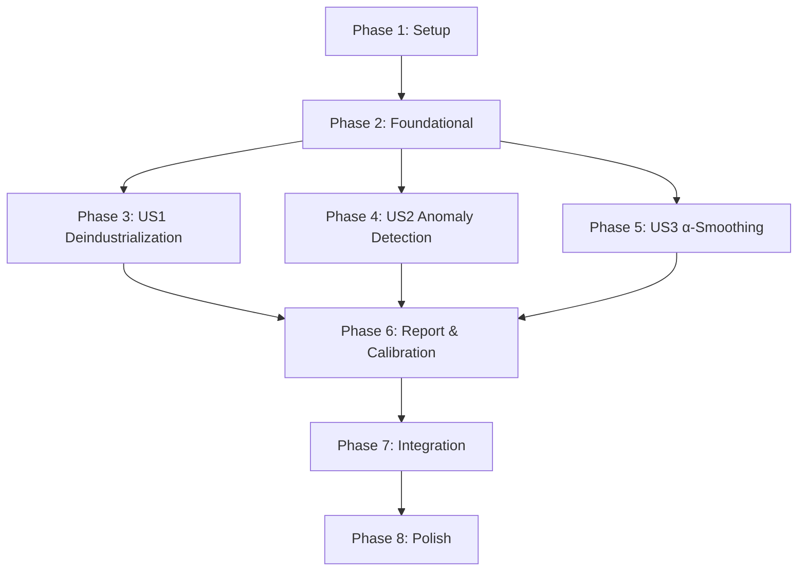

# Tasks: Hydrator Temporal Validation & Deindustrialization Signals

**Input**: Design documents from `/specs/003-hydrator-temporal-validation/`
**Prerequisites**: plan.md ✓, spec.md ✓, research.md ✓, data-model.md ✓, contracts/ ✓

**Tests**: Included per project TDD requirements (CLAUDE.md: "We use Test Driven Development").

**Organization**: Tasks grouped by user story for independent implementation and testing.

## Format: `[ID] [P?] [Story] Description`

- **[P]**: Can run in parallel (different files, no dependencies)
- **[Story]**: Which user story this task belongs to (US1, US2, US3)
- Include exact file paths in descriptions

## Path Conventions

Per plan.md source structure:

- Source: `src/babylon/economics/temporal/`
- Calibration: `src/babylon/economics/calibration/`
- Unit tests: `tests/unit/economics/temporal/`
- Integration tests: `tests/integration/economics/`

______________________________________________________________________

## Phase 1: Setup (Shared Infrastructure)

**Purpose**: Create module structure and shared Pydantic models

- [ ] T001 Create temporal module directory structure at `src/babylon/economics/temporal/`
- [ ] T002 Create calibration module directory structure at `src/babylon/economics/calibration/`
- [ ] T003 [P] Create test directory structure at `tests/unit/economics/temporal/`
- [ ] T004 [P] Add temporal module exports to `src/babylon/economics/__init__.py`

______________________________________________________________________

## Phase 2: Foundational (Blocking Prerequisites)

**Purpose**: Core models and enums that ALL user stories depend on

**⚠️ CRITICAL**: No user story work can begin until this phase is complete

### Models (from data-model.md)

- [ ] T005 Implement `DetectionMethod` enum in `src/babylon/economics/temporal/models.py`
- [ ] T006 [P] Implement `AnomalyFlag` model in `src/babylon/economics/temporal/models.py`
- [ ] T007 [P] Implement `AnomalyThresholdConfig` model with `fallback_threshold` property in `src/babylon/economics/temporal/models.py`
- [ ] T008 Implement `TemporalTransition` model with `is_anomalous` property in `src/babylon/economics/temporal/models.py`
- [ ] T009 [P] Implement `SmoothedCoefficientSeries` model with `variance_reduction` property in `src/babylon/economics/temporal/models.py`
- [ ] T010 [P] Implement `DeindustrializationSignal` model with `core_declining`/`core_stagnating` properties in `src/babylon/economics/temporal/models.py`
- [ ] T011 [P] Implement `TransitionAnnotation` model in `src/babylon/economics/temporal/models.py`
- [ ] T012 Implement `TemporalValidationReport` model with computed properties (`anomalous_transitions`, `flags_by_year`, `systemic_shock_years`) in `src/babylon/economics/temporal/models.py`

### Model Unit Tests

- [ ] T013 [P] Unit tests for `DetectionMethod` enum in `tests/unit/economics/temporal/test_models.py`
- [ ] T014 [P] Unit tests for `AnomalyThresholdConfig.fallback_threshold` logic in `tests/unit/economics/temporal/test_models.py`
- [ ] T015 [P] Unit tests for `TemporalTransition` validation (year_to = year_from + 1) in `tests/unit/economics/temporal/test_models.py`
- [ ] T016 [P] Unit tests for `SmoothedCoefficientSeries` validation (alpha ∈ [0,1], equal list lengths) in `tests/unit/economics/temporal/test_models.py`
- [ ] T017 [P] Unit tests for `DeindustrializationSignal` validation (year_range[0] < year_range[1]) in `tests/unit/economics/temporal/test_models.py`

### Protocol Definitions

- [ ] T018 Copy protocol definitions from `specs/003-hydrator-temporal-validation/contracts/temporal_validation.py` to `src/babylon/economics/temporal/protocols.py`

**Checkpoint**: Foundation ready - all models validated, protocols defined

______________________________________________________________________

## Phase 3: User Story 1 - Detect Deindustrialization Signal (Priority: P1) 🎯 MVP

**Goal**: Compare Dept I trajectories between Wayne (Detroit core) and Oakland (affluent suburb) to validate deindustrialization pattern

**Independent Test**: Hydrate tensors for Wayne (26163) and Oakland (26125) across available years, compute Dept I trajectory slopes, verify divergence

**Reference**:

- spec.md: US1 acceptance scenarios
- data-model.md: `DeindustrializationSignal` entity
- contracts/temporal_validation.py: `DeindustrializationDetector` protocol
- research.md: Linear trend estimation methodology

### Tests for User Story 1

> **NOTE: Write these tests FIRST, ensure they FAIL before implementation**

- [ ] T019 [P] [US1] Unit test for linear trend computation in `tests/unit/economics/temporal/test_signals.py`
- [ ] T020 [P] [US1] Unit test for signal detection criteria (core ≤ 0, core < suburb) in `tests/unit/economics/temporal/test_signals.py`
- [ ] T021 [US1] Integration test for Wayne vs Oakland comparison in `tests/integration/economics/test_temporal_validation.py`

### Implementation for User Story 1

- [ ] T022 [US1] Implement `compute_trend()` helper (linear regression slope) in `src/babylon/economics/temporal/signals.py`
  - Reference: research.md "Linear Trend Estimation" section
- [ ] T023 [US1] Implement `DeindustrializationDetectorImpl.detect_deindustrialization()` in `src/babylon/economics/temporal/signals.py`
  - Must satisfy `DeindustrializationDetector` protocol from T018
  - Takes core_fips, suburb_fips, years sequence
  - Hydrates tensors using MarxianHydrator
  - Computes Dept I share trend slopes via `compute_trend()`
  - Returns `DeindustrializationSignal` with signal_detected and signal_strength
- [ ] T024 [US1] Add Detroit metro constants (WAYNE_FIPS, OAKLAND_FIPS, MACOMB_FIPS) to `tests/constants.py` if not present
- [ ] T025 [US1] Validate SC-001: Wayne Dept I share decline/stagnation relative to Oakland in ≥80% of year-pairs

**Checkpoint**: US1 complete - deindustrialization signal detection works independently

______________________________________________________________________

## Phase 4: User Story 2 - Flag Anomalous Year-over-Year Jumps (Priority: P1)

**Goal**: Detect statistically anomalous YoY changes using tiered threshold system (Z-score → empirical → bootstrap)

**Independent Test**: Create multi-year tensor series with known anomaly, verify flag raised with correct detection method

**Reference**:

- spec.md: US2 acceptance scenarios, FR-001, FR-002
- data-model.md: `TemporalTransition`, `AnomalyFlag`, `AnomalyThresholdConfig`
- contracts/temporal_validation.py: `TransitionComputer`, `AnomalyDetector` protocols
- research.md: Z-score computation, rolling statistics

### Tests for User Story 2

> **NOTE: Write these tests FIRST, ensure they FAIL before implementation**

- [ ] T026 [P] [US2] Unit test for YoY delta percentage computation in `tests/unit/economics/temporal/test_transitions.py`
- [ ] T027 [P] [US2] Unit test for Z-score computation with rolling window in `tests/unit/economics/temporal/test_anomaly.py`
- [ ] T028 [P] [US2] Unit test for tiered detection method selection (Z_SCORE vs EMPIRICAL vs BOOTSTRAP) in `tests/unit/economics/temporal/test_anomaly.py`
- [ ] T029 [US2] Integration test for anomaly detection across multi-year series in `tests/integration/economics/test_temporal_validation.py`

### Implementation for User Story 2

- [ ] T030 [US2] Implement `TransitionComputerImpl.compute_transition()` in `src/babylon/economics/temporal/transitions.py`
  - Must satisfy `TransitionComputer` protocol from T018
  - Takes fips, year_from, year_to
  - Hydrates both years' tensors
  - Computes delta_total_v, delta_dept_shares, delta_profit_rate as percentages
  - Returns `TemporalTransition` (z_scores and flags_raised populated by detector)
- [ ] T031 [US2] Implement `rolling_zscore()` helper in `src/babylon/economics/temporal/anomaly.py`
  - Reference: research.md "Z-Score Computation" section with NumPy implementation
  - Returns None for insufficient history (< window size)
- [ ] T032 [US2] Implement `AnomalyDetectorImpl.compute_z_scores()` in `src/babylon/economics/temporal/anomaly.py`
  - Must satisfy `AnomalyDetector` protocol from T018
  - Uses `rolling_zscore()` for each component
- [ ] T033 [US2] Implement `AnomalyDetectorImpl.detect_anomalies()` in `src/babylon/economics/temporal/anomaly.py`
  - Implements tiered threshold logic from FR-002:
    - Primary: Z-score with k=2.5, 5-year rolling (if ≥5 years history)
    - Fallback: Empirical 95th percentile (if \<5 years, threshold computed)
    - Bootstrap: 15% threshold (if national threshold not calibrated)
  - Sets `detection_method` on each `TemporalTransition`
  - Creates `AnomalyFlag` for each threshold violation
- [ ] T034 [US2] Validate SC-002: ≤5% false positive rate on historical QCEW data (excluding known shocks)

**Checkpoint**: US2 complete - anomaly detection works independently

______________________________________________________________________

## Phase 5: User Story 3 - Apply α-Smoothed Coefficients (Priority: P2)

**Goal**: Provide EWMA-smoothed coefficients for simulation stability per Constitution II.4

**Independent Test**: Apply smoothing with α=0.3 to known series, verify variance reduction ≥40%

**Reference**:

- spec.md: US3 acceptance scenarios, FR-004
- data-model.md: `SmoothedCoefficientSeries`
- contracts/temporal_validation.py: `CoefficientSmoother` protocol
- research.md: α-Smoothing (EWMA) formula and variance reduction

### Tests for User Story 3

> **NOTE: Write these tests FIRST, ensure they FAIL before implementation**

- [ ] T035 [P] [US3] Unit test for EWMA formula correctness in `tests/unit/economics/temporal/test_smoothing.py`
- [ ] T036 [P] [US3] Unit test for α=0 boundary (full smoothing, output = first value) in `tests/unit/economics/temporal/test_smoothing.py`
- [ ] T037 [P] [US3] Unit test for α=1 boundary (no smoothing, output = raw values) in `tests/unit/economics/temporal/test_smoothing.py`
- [ ] T038 [P] [US3] Unit test for single year edge case (returns raw with warning) in `tests/unit/economics/temporal/test_smoothing.py`
- [ ] T039 [US3] Unit test for gap handling (missing years flagged in metadata) in `tests/unit/economics/temporal/test_smoothing.py`

### Implementation for User Story 3

- [ ] T040 [US3] Implement `ewma()` helper function in `src/babylon/economics/temporal/smoothing.py`
  - Formula: S_t = α * X_t + (1 - α) * S\_{t-1}
  - S_0 = X_0 (first value)
- [ ] T041 [US3] Implement `CoefficientSmootherImpl.smooth_coefficients()` in `src/babylon/economics/temporal/smoothing.py`
  - Must satisfy `CoefficientSmoother` protocol from T018
  - Takes fips, years, coefficient name, alpha
  - Hydrates tensors and extracts coefficient values
  - Applies `ewma()` to compute smoothed series
  - Handles gaps (missing years) with metadata flag
  - Logs warning for single-year series
  - Returns `SmoothedCoefficientSeries`
- [ ] T042 [US3] Validate SC-003: Variance reduction ≥40% with α=0.3 across Detroit metro 2015-2022
- [ ] T043 [US3] Validate SC-006: α-smoothing adds \<10% overhead to tensor retrieval for 10-year series

**Checkpoint**: US3 complete - coefficient smoothing works independently

______________________________________________________________________

## Phase 6: Report Generation & Calibration

**Goal**: Combine all components into aggregate report (FR-007) and calibration artifact (FR-008)

**Reference**:

- spec.md: FR-006 (annotations), FR-007 (report), FR-008 (calibration)
- data-model.md: `TemporalValidationReport`, `TransitionAnnotation`
- contracts/temporal_validation.py: `ReportGenerator`, `ThresholdCalibrator` protocols

### Tests

- [ ] T044 [P] Unit test for `TemporalValidationReport` computed properties in `tests/unit/economics/temporal/test_reports.py`
- [ ] T045 [P] Unit test for threshold calibration persistence in `tests/unit/economics/calibration/test_thresholds.py`
- [ ] T046 Integration test for full report generation in `tests/integration/economics/test_temporal_validation.py`
- [ ] T060 [P] Unit test for `AnnotationManager` CRUD operations in `tests/unit/economics/temporal/test_annotations.py`

### Implementation

- [ ] T047 Implement `ReportGeneratorImpl.generate_report()` in `src/babylon/economics/temporal/reports.py`
  - Must satisfy `ReportGenerator` protocol from T018
  - Orchestrates: transitions, anomaly detection, smoothing, signals
  - Returns `TemporalValidationReport` with all outputs
- [ ] T048 Implement `ThresholdCalibratorImpl` in `src/babylon/economics/calibration/thresholds.py`
  - `calibrate_national_threshold()`: Compute 95th percentile of YoY changes across all counties
  - `persist_threshold()`: Save to calibration artifact (JSON file)
  - `load_threshold()`: Load from artifact
- [ ] T049 Validate SC-007: National 95th percentile threshold computed and documented in calibration artifact
- [ ] T059 Implement `AnnotationManagerImpl` in `src/babylon/economics/temporal/annotations.py`
  - Must satisfy `AnnotationManager` protocol from contracts/temporal_validation.py
  - `annotate_transition()`: Create TransitionAnnotation with generated key and timestamp
  - `get_annotations()`: Retrieve annotations with optional fips/year filters
  - `delete_annotation()`: Remove annotation by transition_key
  - Persist annotations to JSON file in calibration directory

**Checkpoint**: Report and calibration complete

______________________________________________________________________

## Phase 7: Integration & TemporalValidator Facade

**Goal**: Combine all implementations into unified `TemporalValidator` class satisfying combined protocol

### Implementation

- [ ] T050 Implement `TemporalValidator` facade class in `src/babylon/economics/temporal/validator.py`
  - Composes: `TransitionComputerImpl`, `AnomalyDetectorImpl`, `CoefficientSmootherImpl`, `DeindustrializationDetectorImpl`, `ReportGeneratorImpl`
  - Satisfies `TemporalValidator` combined protocol from T018
  - Injects `MarxianHydrator` dependency via constructor
- [ ] T051 Update `src/babylon/economics/temporal/__init__.py` with public API exports
- [ ] T052 Integration test for `TemporalValidator` end-to-end in `tests/integration/economics/test_temporal_validation.py`

**Checkpoint**: Unified interface complete

______________________________________________________________________

## Phase 8: Polish & Cross-Cutting Concerns

**Purpose**: Final validation and documentation

- [ ] T053 Validate SC-004: Analysts can resolve 90% of flags within 5 minutes using metadata
- [ ] T054 Validate SC-005: Deindustrialization signal tests pass across all available QCEW years for Wayne/Oakland
- [ ] T055 Run quickstart.md examples as integration tests
- [ ] T056 [P] Add docstrings to all public classes and functions (Sphinx-compatible RST format)
- [ ] T057 [P] Update `src/babylon/economics/__init__.py` to export temporal validation public API
- [ ] T058 Run full test suite and verify all markers pass (`@pytest.mark.math`, `@pytest.mark.integration`)

______________________________________________________________________

## Dependencies & Execution Order

### Phase Dependencies



- **Setup (Phase 1)**: No dependencies - can start immediately
- **Foundational (Phase 2)**: Depends on Setup - BLOCKS all user stories
- **User Stories (Phases 3-5)**: All depend on Foundational phase
  - US1, US2, US3 can proceed in parallel after Phase 2
- **Report/Calibration (Phase 6)**: Depends on US1, US2, US3 completion
- **Integration (Phase 7)**: Depends on Phase 6
- **Polish (Phase 8)**: Depends on all previous phases

### User Story Dependencies

- **User Story 1 (P1)**: Independent after Foundational - uses `MarxianHydrator.hydrate()`, `DeindustrializationSignal` model
- **User Story 2 (P1)**: Independent after Foundational - uses `MarxianHydrator.hydrate()`, `TemporalTransition` model, `AnomalyFlag` model
- **User Story 3 (P2)**: Independent after Foundational - uses `MarxianHydrator.hydrate()`, `SmoothedCoefficientSeries` model

### Within Each User Story

1. Tests MUST be written and FAIL before implementation
1. Helper functions before main implementation
1. Protocol implementation before validation
1. Success criteria validation last

### Parallel Opportunities

**Phase 2 (Foundational) - Models can be parallelized:**

```bash
# Run in parallel (different models, same file but independent):
T006, T007, T009, T010, T011  # Independent model implementations
T013, T014, T015, T016, T017  # Independent unit tests
```

**Phases 3-5 (User Stories) - Entire phases can be parallelized:**

```bash
# After Phase 2 completes, all three can run in parallel:
Phase 3 (US1): T019-T025
Phase 4 (US2): T026-T034
Phase 5 (US3): T035-T043
```

______________________________________________________________________

## Implementation Strategy

### MVP First (User Story 1 Only)

1. Complete Phase 1: Setup
1. Complete Phase 2: Foundational (models only, minimal)
1. Complete Phase 3: User Story 1 (deindustrialization signal)
1. **STOP and VALIDATE**: Test Wayne vs Oakland comparison
1. If signal detected correctly → MVP validated

### Incremental Delivery

1. Setup + Foundational → Foundation ready
1. Add US1 (Deindustrialization) → Test → Core validation passes
1. Add US2 (Anomaly Detection) → Test → Data quality layer added
1. Add US3 (α-Smoothing) → Test → Coefficient stability added
1. Add Report/Calibration → Test → Full feature complete
1. Integration + Polish → Production ready

### Parallel Team Strategy

With 3 developers:

1. Team completes Setup + Foundational together
1. Once Foundational done:
   - Developer A: User Story 1 (T019-T025)
   - Developer B: User Story 2 (T026-T034)
   - Developer C: User Story 3 (T035-T043)
1. Reconvene for Phase 6-8 (sequential)

______________________________________________________________________

## Notes

- [P] tasks = different files, no dependencies
- [Story] label maps task to specific user story for traceability
- Each user story is independently testable after completion
- PRE-001 (QCEW data 2010-2024) is now loading - integration tests may be limited until complete
- Commit after each task or logical group
- Reference sections in data-model.md and research.md for implementation details
