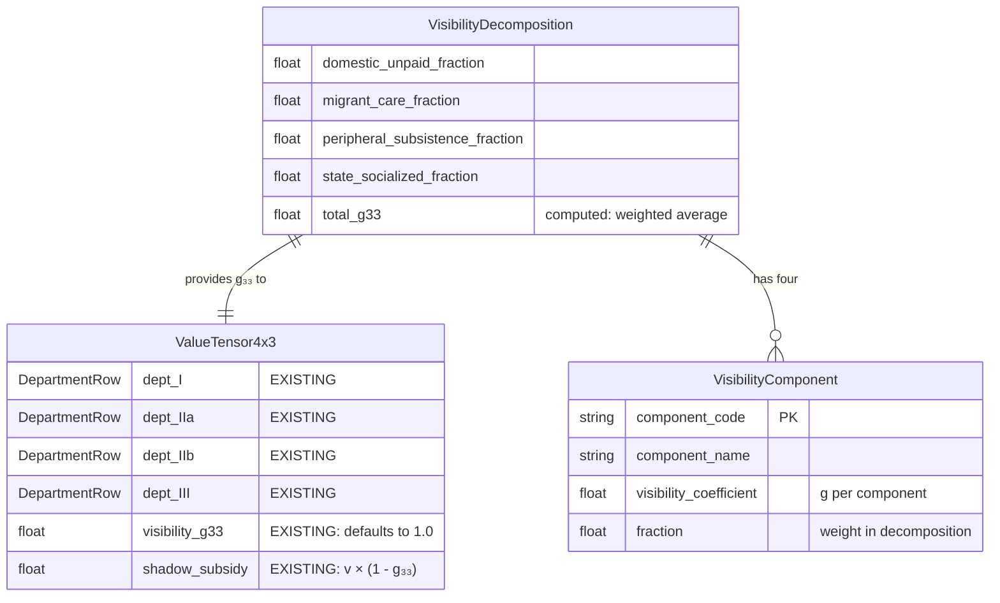
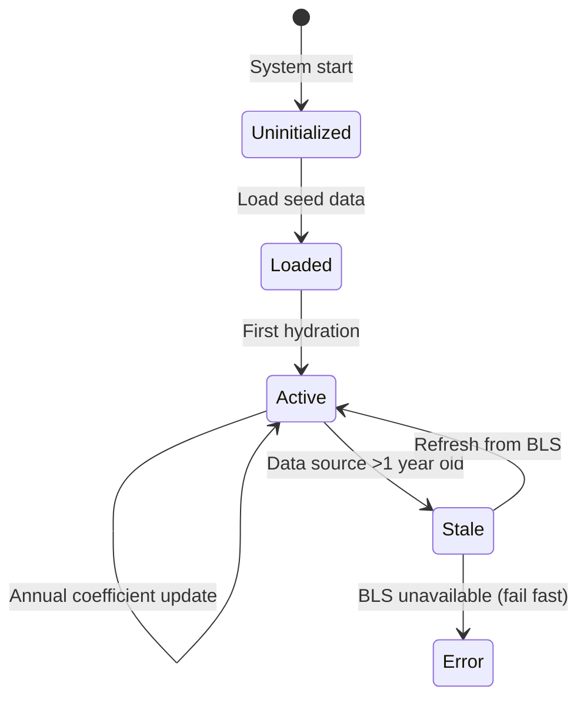
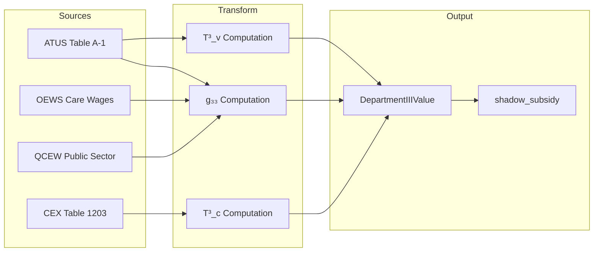

# Data Model: ATUS Department III - Visibility Decomposition

**Feature**: 005-atus-department-iii
**Date**: 2026-01-31
**Status**: Complete

## Overview

This document defines the data models for visibility decomposition (g₃₃). Models follow existing Babylon patterns: Pydantic for domain models.

**Scope Clarification**: The existing `ValueTensor4x3` already has `dept_III`, `visibility_g33`, and `shadow_subsidy`. This feature adds the `VisibilityDecomposition` model to decompose g₃₃ into four structural categories.

______________________________________________________________________

## Entity Relationship Diagram



> **Note**: `ValueTensor4x3` already exists in `src/babylon/economics/tensor.py`. This feature adds `VisibilityDecomposition` which provides the computed g₃₃ to replace the default 1.0.

______________________________________________________________________

## Domain Models (Pydantic)

### 1. VisibilityDecomposition

```python
class VisibilityDecomposition(BaseModel):
    """Breakdown of g₃₃ visibility coefficient into four components.

    The visibility coefficient represents what fraction of reproductive
    labor is visible to the price system (monetized). Components:
    - domestic_unpaid: Unwaged household labor (invisible)
    - migrant_care: Cash economy care work (partially visible)
    - peripheral_subsistence: Reproduction borne by periphery (invisible)
    - state_socialized: Public sector care (fully visible)

    Invariant: All fractions must sum to 1.0 ± 0.001
    """

    model_config = ConfigDict(frozen=True)

    domestic_unpaid_fraction: Annotated[float, Field(ge=0.0, le=1.0)]
    migrant_care_fraction: Annotated[float, Field(ge=0.0, le=1.0)]
    peripheral_subsistence_fraction: Annotated[float, Field(ge=0.0, le=1.0)]
    state_socialized_fraction: Annotated[float, Field(ge=0.0, le=1.0)]

    # Visibility coefficients per component
    domestic_unpaid_g: float = 0.0      # Invisible by definition
    migrant_care_g: float = 0.3         # Partially visible
    peripheral_subsistence_g: float = 0.0  # Invisible to core
    state_socialized_g: float = 1.0     # Fully visible

    @computed_field
    @property
    def total_g33(self) -> float:
        """Weighted visibility coefficient g₃₃."""
        return (
            self.domestic_unpaid_fraction * self.domestic_unpaid_g
            + self.migrant_care_fraction * self.migrant_care_g
            + self.peripheral_subsistence_fraction * self.peripheral_subsistence_g
            + self.state_socialized_fraction * self.state_socialized_g
        )

    @model_validator(mode="after")
    def validate_fractions_sum_to_one(self) -> Self:
        total = (
            self.domestic_unpaid_fraction
            + self.migrant_care_fraction
            + self.peripheral_subsistence_fraction
            + self.state_socialized_fraction
        )
        if abs(total - 1.0) > 0.001:
            raise ValueError(f"Fractions must sum to 1.0, got {total}")
        return self
```

### 2. ReproductiveLaborCoefficient

```python
class ReproductiveLaborCoefficient(BaseModel):
    """National-level T³_v coefficient for a class position.

    Represents reproductive labor hours per week for a given class,
    derived from ATUS data with occupation-based multipliers.
    """

    model_config = ConfigDict(frozen=True)

    class_position: Literal["proletariat", "petty_bourgeoisie", "bourgeoisie"]
    weekly_hours: Annotated[float, Field(ge=0.0, description="Hours per week")]
    sample_size: Annotated[int, Field(ge=0, description="ATUS sample size")]
    survey_year: Annotated[int, Field(ge=2003, description="ATUS survey year")]
    confidence_flag: Literal["HIGH", "MEDIUM", "LOW"] = "HIGH"

    @computed_field
    @property
    def is_reliable(self) -> bool:
        """Sample size >= 30 is considered statistically reliable."""
        return self.sample_size >= 30
```

### 3. CEXExpenditure

> **OUT OF SCOPE**: CEX data integration is deferred. The existing hydrator populates `dept_III.c` from QCEW. See [spec.md](./spec.md) "Scope Clarification" section.

### 4. DepartmentIIIValue (Reference Only)

> **ALREADY EXISTS**: `ValueTensor4x3` in `src/babylon/economics/tensor.py` already has `dept_III`, `visibility_g33`, and `shadow_subsidy`. No new model needed.

The existing model (`ValueTensor4x3`) includes:

```python
@computed_field
@property
def shadow_subsidy(self) -> Currency:
    """Unpaid reproductive labor value: v × (1 - g₃₃)."""
    return Currency(self.dept_III.v * (1 - self.visibility_g33))
```

This feature computes g₃₃ from `VisibilityDecomposition` instead of using the default 1.0.

______________________________________________________________________

## Persistence Models (SQLAlchemy)

### Existing Tables (Reference)

| Table                          | Purpose                         | Status |
| ------------------------------ | ------------------------------- | ------ |
| `dim_atus_activity_category`   | ATUS code → Babylon category    | EXISTS |
| `dim_gender`                   | Gender dimension                | EXISTS |
| `dim_time`                     | Year dimension                  | EXISTS |
| `dim_data_source`              | Data provenance                 | EXISTS |
| `fact_atus_reproductive_labor` | National averages by occupation | EXISTS |

### New Tables

#### 1. dim_visibility_component

```sql
CREATE TABLE dim_visibility_component (
    component_id INTEGER PRIMARY KEY AUTOINCREMENT,
    component_code TEXT NOT NULL UNIQUE,
    component_name TEXT NOT NULL,
    visibility_coefficient REAL NOT NULL CHECK (visibility_coefficient >= 0 AND visibility_coefficient <= 1),
    description TEXT
);

-- Seed data
INSERT INTO dim_visibility_component (component_code, component_name, visibility_coefficient, description) VALUES
    ('DOMESTIC_UNPAID', 'Domestic Unpaid Labor', 0.0, 'Unwaged household reproductive labor'),
    ('MIGRANT_CARE', 'Migrant Care Work', 0.3, 'Cash economy care work by migrants'),
    ('PERIPHERAL_SUBSISTENCE', 'Peripheral Subsistence', 0.0, 'Reproduction costs borne by periphery'),
    ('STATE_SOCIALIZED', 'State Socialized Care', 1.0, 'Public sector care services');
```

#### 2. fact_visibility_decomposition

```sql
CREATE TABLE fact_visibility_decomposition (
    decomposition_id INTEGER PRIMARY KEY AUTOINCREMENT,
    time_id INTEGER NOT NULL REFERENCES dim_time(time_id),
    source_id INTEGER NOT NULL REFERENCES dim_data_source(source_id),
    class_position TEXT NOT NULL CHECK (class_position IN ('proletariat', 'petty_bourgeoisie', 'bourgeoisie')),
    domestic_unpaid_fraction REAL NOT NULL,
    migrant_care_fraction REAL NOT NULL,
    peripheral_subsistence_fraction REAL NOT NULL,
    state_socialized_fraction REAL NOT NULL,
    total_g33 REAL NOT NULL,
    UNIQUE (time_id, class_position)
);
```

#### 3. fact_cex_expenditure

> **OUT OF SCOPE**: CEX expenditure table is deferred. See [spec.md](./spec.md) "Scope Clarification" section.

______________________________________________________________________

## State Transitions

Department III values are **coefficients** (per Constitution II.4), not quantities. They update annually via coefficient smoothing, not per-tick flux.



______________________________________________________________________

## Validation Rules

| Entity                       | Rule                                  | Error Type          |
| ---------------------------- | ------------------------------------- | ------------------- |
| VisibilityDecomposition      | Fractions sum to 1.0 ± 0.001          | ValidationError     |
| ReproductiveLaborCoefficient | sample_size >= 30 for HIGH confidence | Warning (not error) |
| CEXExpenditure               | All expenditure components >= 0       | ValidationError     |
| DepartmentIIIValue           | s == 0 (enforced by model)            | ValidationError     |
| DepartmentIIIValue           | visibility_g33 in [0, 1]              | ValidationError     |

______________________________________________________________________

## Data Flow


