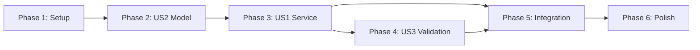

# Tasks: ATUS Department III - Visibility Decomposition

**Input**: Design documents from `/specs/005-atus-department-iii/`
**Prerequisites**: plan.md (required), spec.md (required), research.md, data-model.md, contracts/

**Tests**: TDD approach per project CLAUDE.md - tests written FIRST to fail, then implementation.

**Organization**: Tasks grouped by user story to enable independent implementation and testing.

## Format: `[ID] [P?] [Story] Description`

- **[P]**: Can run in parallel (different files, no dependencies)
- **[Story]**: Which user story this task belongs to (US1, US2, US3)
- Paths are relative to repository root (`src/babylon/`, `tests/`)

______________________________________________________________________

## Phase 1: Setup (Shared Infrastructure)

**Purpose**: Minimal setup - most infrastructure already exists

- [ ] T001 Add visibility_weights section to src/babylon/data/atus/seed_data.yaml
- [ ] T002 [P] Create validation module structure at src/babylon/economics/validation/__init__.py
- [ ] T003 [P] Create test directory structure at tests/unit/economics/validation/

**Checkpoint**: Seed data and module structure ready

______________________________________________________________________

## Phase 2: User Story 2 - Four-Category Visibility Decomposition (Priority: P2) 🎯 MVP Foundation

**Goal**: Create the VisibilityDecomposition Pydantic model with four-category breakdown

**Why P2 First**: The model is foundational - US1 (g₃₃ computation) depends on this model existing

**Independent Test**: Verify fractions sum to 1.0 ± 0.001, weighted g₃₃ computes correctly

### Tests for User Story 2 (TDD RED Phase)

> **NOTE: Write these tests FIRST, ensure they FAIL before implementation**

- [ ] T004 [P] [US2] Create test_visibility.py with model validation tests at tests/unit/data/atus/test_visibility.py
- [ ] T005 [P] [US2] Write test: fractions must sum to 1.0 ± 0.001 (should FAIL - model doesn't exist)
- [ ] T006 [P] [US2] Write test: total_g33 computed as weighted average (should FAIL - property doesn't exist)
- [ ] T007 [P] [US2] Write test: model rejects invalid fractions (negative, >1) (should FAIL)
- [ ] T007a [P] [US2] Write test: fractions normalize with warning if drift > 0.01 (edge case per spec.md L84)
- [ ] T007b [P] [US2] Write test: g₃₃ clamped to [0,1] with warning for out-of-bounds input (edge case per spec.md L82)

### Implementation for User Story 2 (TDD GREEN Phase)

- [ ] T008 [US2] Add VisibilityDecomposition model to src/babylon/data/atus/models.py
- [ ] T009 [US2] Implement four fraction fields with Field(ge=0.0, le=1.0) constraints
- [ ] T010 [US2] Implement model_validator to ensure fractions sum to 1.0 ± 0.001
- [ ] T011 [US2] Add visibility coefficient constants (g_domestic=0.0, g_migrant=0.3, g_peripheral=0.0, g_state=1.0)
- [ ] T012 [US2] Implement computed_field total_g33 as weighted average
- [ ] T012a [US2] Implement fraction normalization with warning if drift > 0.01
- [ ] T012b [US2] Implement g₃₃ clamping to [0,1] with warning for out-of-bounds values
- [ ] T013 [US2] Run tests - all T004-T007b should now PASS

**Checkpoint**: VisibilityDecomposition model complete and independently testable

______________________________________________________________________

## Phase 3: User Story 1 - Compute g₃₃ from Data Sources (Priority: P1)

**Goal**: Create VisibilityComputer service that computes g₃₃ from seed data weights

**Independent Test**: Provide input weights, verify g₃₃ falls within [0.2, 0.5] range (SC-003)

### Tests for User Story 1 (TDD RED Phase)

> **NOTE: Write these tests FIRST, ensure they FAIL before implementation**

- [ ] T014 [P] [US1] Write test: VisibilityComputer.get_national_g33() returns value in [0.2, 0.5] (should FAIL)
- [ ] T015 [P] [US1] Write test: compute_visibility() returns VisibilityDecomposition (should FAIL)
- [ ] T016 [P] [US1] Write test: service raises DataSourceUnavailableError if weights missing (should FAIL)
- [ ] T017 [P] [US1] Write test: computed g₃₃ is deterministic given same inputs (should FAIL)

### Implementation for User Story 1 (TDD GREEN Phase)

- [ ] T018 [US1] Create src/babylon/data/atus/visibility.py with VisibilityComputer class
- [ ] T019 [US1] Implement __init__ to load visibility weights from seed_data.yaml
- [ ] T020 [US1] Implement get_national_g33() method per contracts/visibility_protocol.py
- [ ] T021 [US1] Implement compute_visibility() method returning VisibilityDecomposition
- [ ] T022 [US1] Add DataSourceUnavailableError handling for missing weights
- [ ] T023 [US1] Add VisibilityComputerProtocol to src/babylon/data/atus/protocol.py
- [ ] T024 [US1] Export VisibilityComputer from src/babylon/data/atus/__init__.py
- [ ] T025 [US1] Run tests - all T014-T017 should now PASS

**Checkpoint**: g₃₃ computation works independently, falls within theoretical range

______________________________________________________________________

## Phase 4: User Story 3 - Validate Falsifiability Criteria (Priority: P3)

**Goal**: Implement regression validation (domestic_hours ~ 1/income with β > 0)

**Independent Test**: Run regression on ATUS occupation multipliers, verify positive coefficient

### Tests for User Story 3 (TDD RED Phase)

> **NOTE: Write these tests FIRST, ensure they FAIL before implementation**

- [ ] T026 [P] [US3] Create test_regression.py at tests/unit/economics/validation/test_regression.py
- [ ] T027 [P] [US3] Write test: regression produces positive coefficient β > 0 (should FAIL)
- [ ] T028 [P] [US3] Write test: regression uses scipy.stats.linregress (should FAIL)
- [ ] T029 [P] [US3] Write test: regression returns RegressionResult with slope, p_value (should FAIL)

### Implementation for User Story 3 (TDD GREEN Phase)

- [ ] T030 [US3] Create src/babylon/economics/validation/regression.py
- [ ] T031 [US3] Implement RegressionResult Pydantic model (slope, intercept, r_value, p_value, std_err)
- [ ] T032 [US3] Implement validate_domestic_hours_regression() function using scipy.stats.linregress
- [ ] T033 [US3] Load occupation multipliers from existing ATUS seed data as proxy for income
- [ ] T034 [US3] Export from src/babylon/economics/validation/__init__.py
- [ ] T035 [US3] Run tests - all T026-T029 should now PASS

**Checkpoint**: Falsifiability validation independently testable, confirms theoretical expectation

______________________________________________________________________

## Phase 5: Integration & Shadow Subsidy Update

**Goal**: Wire VisibilityComputer into existing ShadowLaborService via dependency injection

**FR-004 Coverage**: This phase satisfies FR-004 ("override default g₃₃=1.0") by injecting VisibilityComputer into ShadowLaborService. The computed g₃₃ flows through to shadow_subsidy calculation, effectively overriding the default.

**Independent Test**: End-to-end test verifying shadow_subsidy uses computed g₃₃

### Tests for Integration (TDD RED Phase)

- [ ] T036 [P] Create test_visibility_integration.py at tests/integration/economics/test_visibility_integration.py
- [ ] T037 [P] Write test: ShadowLaborService accepts VisibilityComputer via DI (should FAIL)
- [ ] T038 [P] Write test: shadow_subsidy = v × (1 - computed_g33), not default 1.0 (should FAIL)
- [ ] T039 [P] Write test: shadow_subsidy accounts for 50-80% of reproductive labor value (SC-004) (should FAIL)

### Implementation for Integration (TDD GREEN Phase)

- [ ] T040 Update src/babylon/economics/shadow_labor.py to accept VisibilityComputer
- [ ] T041 Implement optional visibility_computer parameter with fallback to default g33=1.0
- [ ] T042 Update shadow_subsidy calculation to use computed g₃₃ when VisibilityComputer provided
- [ ] T043 Run tests - all T036-T039 should now PASS
- [ ] T044 Run full test suite: mise run test:all

**Checkpoint**: Full integration complete, shadow_subsidy reflects actual invisibility

______________________________________________________________________

## Phase 6: Polish & Cross-Cutting Concerns

**Purpose**: Final validation and cleanup

- [ ] T045 [P] Add docstrings to all new public classes/functions (Sphinx-compatible)
- [ ] T046 [P] Run mypy on new files: mypy src/babylon/data/atus/visibility.py src/babylon/economics/validation/
- [ ] T047 [P] Run ruff on new files: ruff check src/babylon/data/atus/visibility.py src/babylon/economics/validation/
- [ ] T048 Verify all success criteria (SC-001 through SC-006) pass
- [ ] T049 Update src/babylon/data/atus/__init__.py exports if needed
- [ ] T050 Final validation: run mise run check

______________________________________________________________________

## Dependencies & Execution Order

### Phase Dependencies



### User Story Dependencies

- **User Story 2 (P2)**: No dependencies - model is foundational (implement FIRST despite P2 priority)
- **User Story 1 (P1)**: Depends on US2 model existing
- **User Story 3 (P3)**: Can start after US1 service exists (uses same seed data)

### Within Each Phase

1. RED: Write tests that FAIL (T004-T007, T014-T017, etc.)
1. GREEN: Implement until tests PASS (T008-T013, T018-T025, etc.)
1. Commit after each phase completion

### Parallel Opportunities

**Phase 1** (all parallel):

```bash
Task T001: seed_data.yaml
Task T002: validation/__init__.py
Task T003: test directory
```

**Phase 2 Tests** (all parallel):

```bash
Task T004-T007: All test files can be written simultaneously
```

**Phase 3 Tests** (all parallel):

```bash
Task T014-T017: Service tests can be written simultaneously
```

______________________________________________________________________

## Implementation Strategy

### MVP First (User Story 2 + User Story 1)

1. Complete Phase 1: Setup (seed data, module structure)
1. Complete Phase 2: US2 Model (VisibilityDecomposition)
1. Complete Phase 3: US1 Service (VisibilityComputer)
1. **STOP and VALIDATE**: Test g₃₃ computation independently
1. Deploy/demo if ready - shadow_subsidy now uses real data

### Incremental Delivery

1. Setup → Model → Service → **MVP: g₃₃ computation works**
1. Add US3 Validation → **Falsifiability confirmed**
1. Add Integration → **Full shadow_subsidy integration**
1. Polish → **Production ready**

### TDD Cycle Per Phase

```
RED:   Write tests (T004-T007) → All FAIL
GREEN: Implement (T008-T013) → All PASS
COMMIT: git commit -m "feat(atus): add VisibilityDecomposition model"
```

______________________________________________________________________

## Notes

- [P] tasks = different files, no dependencies on incomplete work
- [Story] labels map tasks to user stories for traceability
- TDD: Tests MUST fail before implementation
- Commit after each phase or logical group
- Stop at any checkpoint to validate independently
- Existing infrastructure (dept_III, shadow_subsidy, ATUS loader) is NOT modified except for integration points
