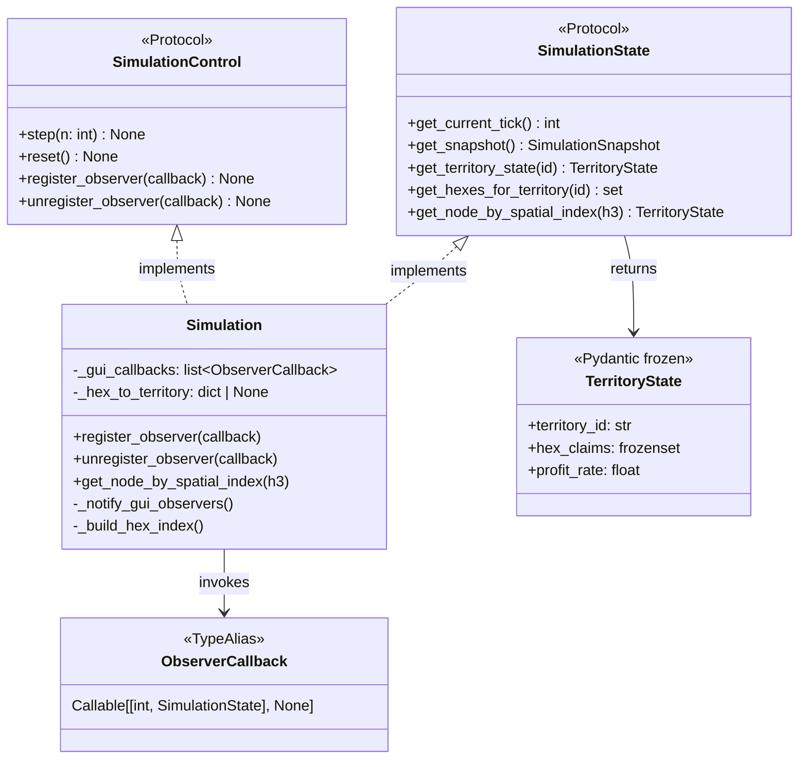

# Data Model: GUI Protocol Extension

**Feature**: 006-gui-protocol-extension
**Date**: 2026-01-31

## Overview

This feature extends two existing protocols and adds one new class. No new persistent entities are introduced.

## Type Aliases

### ObserverCallback

```python
from typing import Callable, TYPE_CHECKING

if TYPE_CHECKING:
    from babylon.models.snapshots import SimulationSnapshot

ObserverCallback = Callable[[int, "SimulationSnapshot"], None]
```

**Description**: Type alias for GUI observer callbacks.

**Parameters**:

- `tick: int` - Current simulation tick number (0-indexed)
- `snapshot: SimulationSnapshot` - Immutable, frozen snapshot of state at notification time

**Returns**: None

**Thread Safety**: Callbacks receive a frozen Pydantic model that cannot be mutated. The snapshot is created by `ProtocolObserverAdapter.notify()` BEFORE iteration begins. GUI callbacks NEVER receive a live reference to Simulation internals.

______________________________________________________________________

## Protocol Extensions

### SimulationControl (Extended)

**Location**: `src/babylon/protocols/simulation_control.py`

**Existing methods** (unchanged):

- `step(n: int = 1) -> None`
- `reset() -> None`

**New methods**:

| Method                | Signature                              | Description                              |
| --------------------- | -------------------------------------- | ---------------------------------------- |
| `register_observer`   | `(callback: ObserverCallback) -> None` | Register callback for tick notifications |
| `unregister_observer` | `(callback: ObserverCallback) -> None` | Remove previously registered callback    |

**Behavior**:

- Callbacks invoked at end of each `step()` call
- Invocation order: registration order
- Duplicate registration: idempotent (callback invoked once per tick)
- Unregister unknown callback: no-op

______________________________________________________________________

### SimulationState (Extended)

**Location**: `src/babylon/protocols/simulation_state.py`

**Existing methods** (unchanged):

- `get_current_tick() -> int`
- `get_snapshot() -> SimulationSnapshot`
- `get_territory_state(territory_id: str) -> TerritoryState | None`
- `get_hexes_for_territory(territory_id: str) -> set[str]`

**New methods**:

| Method                      | Signature                           | Description |
| --------------------------- | ----------------------------------- | ----------- |
| `get_node_by_spatial_index` | \`(h3_index: str) -> TerritoryState | None\`      |

**Behavior**:

- Valid H3 index claimed by territory: returns TerritoryState
- Valid H3 index not claimed: returns None
- Invalid H3 format: raises ValueError

______________________________________________________________________

## New Classes

### ProtocolObserverAdapter

**Location**: `src/babylon/engine/observer_adapter.py`

**Purpose**: Thread-safe bridge between engine observer notifications and GUI callbacks. Creates snapshot BEFORE invoking callbacks to ensure complete isolation—GUI never touches mutable Simulation internals.

**Attributes**:

| Attribute     | Type                     | Description                                    |
| ------------- | ------------------------ | ---------------------------------------------- |
| `_simulation` | `SimulationState`        | Reference to simulation for snapshot creation  |
| `_callbacks`  | `list[ObserverCallback]` | Registered GUI callbacks                       |
| `_lock`       | `threading.Lock`         | Synchronization for callback list modification |

**Methods**:

| Method       | Signature                              | Description                                     |
| ------------ | -------------------------------------- | ----------------------------------------------- |
| `__init__`   | `(simulation: SimulationState)`        | Initialize with simulation reference            |
| `register`   | `(callback: ObserverCallback) -> None` | Add callback (thread-safe, idempotent)          |
| `unregister` | `(callback: ObserverCallback) -> None` | Remove callback (thread-safe, no-op if missing) |
| `notify`     | `(tick: int) -> None`                  | Create snapshot, then notify all callbacks      |

**Thread Safety Guarantees**:

1. `_lock` protects `_callbacks` list during register/unregister
1. `notify()` creates snapshot BEFORE iterating (snapshot is immutable)
1. Callbacks receive `SimulationSnapshot`, NOT `SimulationState` reference
1. Callback exceptions are caught and logged (per ADR003)

**Implementation Pattern**:

```python
import threading
import logging

logger = logging.getLogger(__name__)

class ProtocolObserverAdapter:
    """Thread-safe bridge between simulation and GUI callbacks."""

    def __init__(self, simulation: SimulationState) -> None:
        self._simulation = simulation
        self._callbacks: list[ObserverCallback] = []
        self._lock = threading.Lock()

    def register(self, callback: ObserverCallback) -> None:
        """Register callback (thread-safe, idempotent)."""
        with self._lock:
            if callback not in self._callbacks:
                self._callbacks.append(callback)

    def unregister(self, callback: ObserverCallback) -> None:
        """Unregister callback (thread-safe, no-op if missing)."""
        with self._lock:
            if callback in self._callbacks:
                self._callbacks.remove(callback)

    def notify(self, tick: int) -> None:
        """Notify all callbacks with frozen snapshot.

        Thread-safe: creates snapshot before iteration, exceptions logged.
        Callbacks receive immutable snapshot, not live simulation reference.
        """
        # Create snapshot while simulation is in consistent state
        snapshot = self._simulation.get_snapshot()

        # Copy callback list under lock
        with self._lock:
            callbacks = list(self._callbacks)

        # Notify outside lock (callbacks may take time)
        for callback in callbacks:
            try:
                callback(tick, snapshot)  # Frozen snapshot, not self
            except Exception as e:
                logger.warning("Observer callback failed: %s", e)
```

**Why This Matters**:

- GUI callbacks NEVER hold a reference to mutable Simulation internals
- Snapshot is created at a single consistent point in time
- GUI thread can process the snapshot at leisure without races
- Complete isolation between engine thread and GUI thread

______________________________________________________________________

## Simulation Class Extensions

### Spatial Query and Adapter Integration

**Location**: `src/babylon/engine/simulation.py` (extending existing class)

**Purpose**: Implement spatial query and delegate observer management to ProtocolObserverAdapter.

**New Attributes**:

| Attribute           | Type                      | Description                            |
| ------------------- | ------------------------- | -------------------------------------- |
| `_adapter`          | `ProtocolObserverAdapter` | Thread-safe observer bridge            |
| `_hex_to_territory` | `dict[str, str] \| None`  | Lazy reverse index for spatial queries |

**New Methods**:

| Method                      | Signature                                   | Description                              |
| --------------------------- | ------------------------------------------- | ---------------------------------------- |
| `register_observer`         | `(callback: ObserverCallback) -> None`      | Delegate to `self._adapter.register()`   |
| `unregister_observer`       | `(callback: ObserverCallback) -> None`      | Delegate to `self._adapter.unregister()` |
| `get_node_by_spatial_index` | `(h3_index: str) -> TerritoryState \| None` | H3 → Territory lookup                    |
| `_notify_gui_observers`     | `() -> None`                                | Call `self._adapter.notify(tick)`        |
| `_build_hex_index`          | `() -> dict[str, str]`                      | Internal: build reverse H3 index         |

**Implementation Pattern**:

```python
def __init__(self, ...):
    # ... existing initialization ...
    self._adapter = ProtocolObserverAdapter(self)
    self._hex_to_territory: dict[str, str] | None = None

def register_observer(self, callback: ObserverCallback) -> None:
    """Register GUI callback (delegates to adapter)."""
    self._adapter.register(callback)

def unregister_observer(self, callback: ObserverCallback) -> None:
    """Unregister GUI callback (delegates to adapter)."""
    self._adapter.unregister(callback)

def _notify_gui_observers(self) -> None:
    """Notify adapter which creates snapshot and invokes callbacks."""
    self._adapter.notify(self.get_current_tick())
```

______________________________________________________________________

## Existing Entities (Reference)

### TerritoryState

**Location**: `src/babylon/models/snapshots.py`

**Used as**: Return type for `get_node_by_spatial_index()`

**Key attributes**:

- `territory_id: str` - FIPS code
- `hex_claims: frozenset[str]` - H3 indices claimed
- `tick: int` - Snapshot tick
- `profit_rate: float` - Current profit rate [0.0, 1.0]
- `equilibrium_r: float` - Territory equilibrium

**Immutability**: `model_config = ConfigDict(frozen=True)`

______________________________________________________________________

## Entity Relationships



______________________________________________________________________

## Validation Rules

### H3 Index Validation

**Input**: `h3_index: str`

**Rules**:

1. Must be valid per `h3.is_valid_cell(h3_index)` (structural validity)
1. Format: 15-character lowercase hexadecimal (project standard: resolution 5)

**Error**: `ValueError` with descriptive message

### Callback Registration

**Input**: `callback: ObserverCallback`

**Rules**:

1. Callback must be callable
1. Duplicate registration is idempotent (no error, single invocation)
1. Unregistration of unknown callback is no-op (no error)

______________________________________________________________________

## State Transitions

### Hex Index Cache

```
┌─────────────┐   step()    ┌─────────────┐
│ Cache Valid │ ──────────► │Cache Invalid│
│ (dict)      │             │ (None)      │
└─────────────┘             └─────────────┘
       ▲                           │
       │    get_node_by_spatial_   │
       │    index() [first call]   │
       └───────────────────────────┘
```

**Invariant**: Cache is always invalidated at end of `step()` to ensure consistency.
