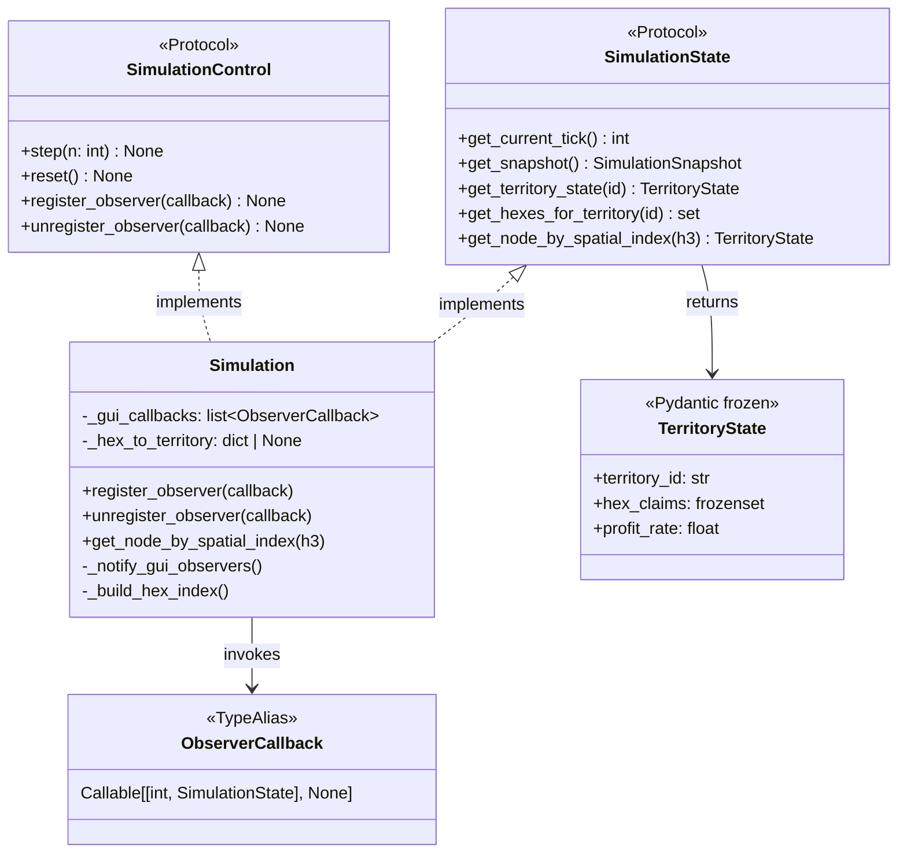

# Data Model: GUI Protocol Extension

**Feature**: 006-gui-protocol-extension
**Date**: 2026-01-31

## Overview

This feature extends two existing protocols and adds one new class. No new persistent entities are introduced.

## Type Aliases

### ObserverCallback

```python
from typing import Callable, TYPE_CHECKING

if TYPE_CHECKING:
    from babylon.protocols import SimulationState

ObserverCallback = Callable[[int, "SimulationState"], None]
```

**Description**: Type alias for GUI observer callbacks.

**Parameters**:

- `tick: int` - Current simulation tick number (0-indexed)
- `state: SimulationState` - Read-only interface to simulation state

**Returns**: None

______________________________________________________________________

## Protocol Extensions

### SimulationControl (Extended)

**Location**: `src/babylon/protocols/simulation_control.py`

**Existing methods** (unchanged):

- `step(n: int = 1) -> None`
- `reset() -> None`

**New methods**:

| Method                | Signature                              | Description                              |
| --------------------- | -------------------------------------- | ---------------------------------------- |
| `register_observer`   | `(callback: ObserverCallback) -> None` | Register callback for tick notifications |
| `unregister_observer` | `(callback: ObserverCallback) -> None` | Remove previously registered callback    |

**Behavior**:

- Callbacks invoked at end of each `step()` call
- Invocation order: registration order
- Duplicate registration: idempotent (callback invoked once per tick)
- Unregister unknown callback: no-op

______________________________________________________________________

### SimulationState (Extended)

**Location**: `src/babylon/protocols/simulation_state.py`

**Existing methods** (unchanged):

- `get_current_tick() -> int`
- `get_snapshot() -> SimulationSnapshot`
- `get_territory_state(territory_id: str) -> TerritoryState | None`
- `get_hexes_for_territory(territory_id: str) -> set[str]`

**New methods**:

| Method                      | Signature                           | Description |
| --------------------------- | ----------------------------------- | ----------- |
| `get_node_by_spatial_index` | \`(h3_index: str) -> TerritoryState | None\`      |

**Behavior**:

- Valid H3 index claimed by territory: returns TerritoryState
- Valid H3 index not claimed: returns None
- Invalid H3 format: raises ValueError

______________________________________________________________________

## Simulation Class Extensions

### GUI Callback Management

**Location**: `src/babylon/engine/simulation.py` (extending existing class)

**Purpose**: Manage lightweight GUI callbacks alongside existing `SimulationObserver` pattern.

**New Attributes**:

| Attribute           | Type                     | Description                            |
| ------------------- | ------------------------ | -------------------------------------- |
| `_gui_callbacks`    | `list[ObserverCallback]` | Registered GUI callbacks               |
| `_hex_to_territory` | `dict[str, str] \| None` | Lazy reverse index for spatial queries |

**New Methods**:

| Method                      | Signature                                   | Description                            |
| --------------------------- | ------------------------------------------- | -------------------------------------- |
| `register_observer`         | `(callback: ObserverCallback) -> None`      | Add GUI callback (idempotent)          |
| `unregister_observer`       | `(callback: ObserverCallback) -> None`      | Remove GUI callback (no-op if missing) |
| `get_node_by_spatial_index` | `(h3_index: str) -> TerritoryState \| None` | H3 → Territory lookup                  |
| `_notify_gui_observers`     | `() -> None`                                | Internal: notify all GUI callbacks     |
| `_build_hex_index`          | `() -> dict[str, str]`                      | Internal: build reverse H3 index       |

**Thread Safety**:

- Copy `_gui_callbacks` list before iteration (basic thread safety)
- Snapshots are frozen Pydantic models (immutable, safe across threads)
- Callback exceptions are caught and logged (per ADR003)

**Implementation Pattern**:

```python
def _notify_gui_observers(self) -> None:
    """Notify all registered GUI callbacks with current state.

    Thread-safe: copies list before iteration, exceptions logged.
    """
    # Copy list to avoid mutation during iteration
    callbacks = list(self._gui_callbacks)

    tick = self.get_current_tick()
    for callback in callbacks:
        try:
            callback(tick, self)  # self implements SimulationState
        except Exception as e:
            logger.warning("Observer callback failed: %s", e)
```

**Note**: A separate `ProtocolObserverAdapter` class was considered but deferred (YAGNI). The Simulation class already manages observers and can directly host GUI callbacks.

______________________________________________________________________

## Existing Entities (Reference)

### TerritoryState

**Location**: `src/babylon/models/snapshots.py`

**Used as**: Return type for `get_node_by_spatial_index()`

**Key attributes**:

- `territory_id: str` - FIPS code
- `hex_claims: frozenset[str]` - H3 indices claimed
- `tick: int` - Snapshot tick
- `profit_rate: float` - Current profit rate [0.0, 1.0]
- `equilibrium_r: float` - Territory equilibrium

**Immutability**: `model_config = ConfigDict(frozen=True)`

______________________________________________________________________

## Entity Relationships



______________________________________________________________________

## Validation Rules

### H3 Index Validation

**Input**: `h3_index: str`

**Rules**:

1. Must be valid per `h3.is_valid_cell(h3_index)` (structural validity)
1. Format: 15-character lowercase hexadecimal (project standard: resolution 5)

**Error**: `ValueError` with descriptive message

### Callback Registration

**Input**: `callback: ObserverCallback`

**Rules**:

1. Callback must be callable
1. Duplicate registration is idempotent (no error, single invocation)
1. Unregistration of unknown callback is no-op (no error)

______________________________________________________________________

## State Transitions

### Hex Index Cache

```
┌─────────────┐   step()    ┌─────────────┐
│ Cache Valid │ ──────────► │Cache Invalid│
│ (dict)      │             │ (None)      │
└─────────────┘             └─────────────┘
       ▲                           │
       │    get_node_by_spatial_   │
       │    index() [first call]   │
       └───────────────────────────┘
```

**Invariant**: Cache is always invalidated at end of `step()` to ensure consistency.
