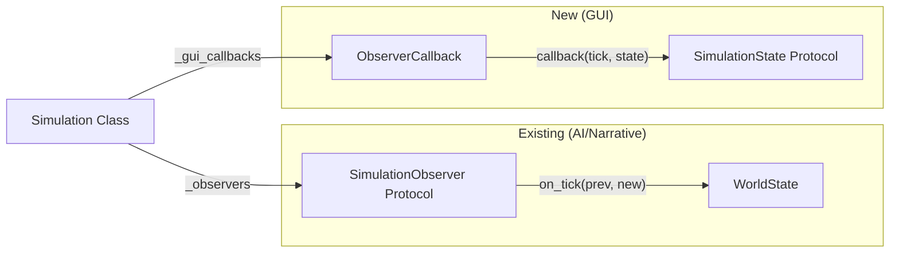
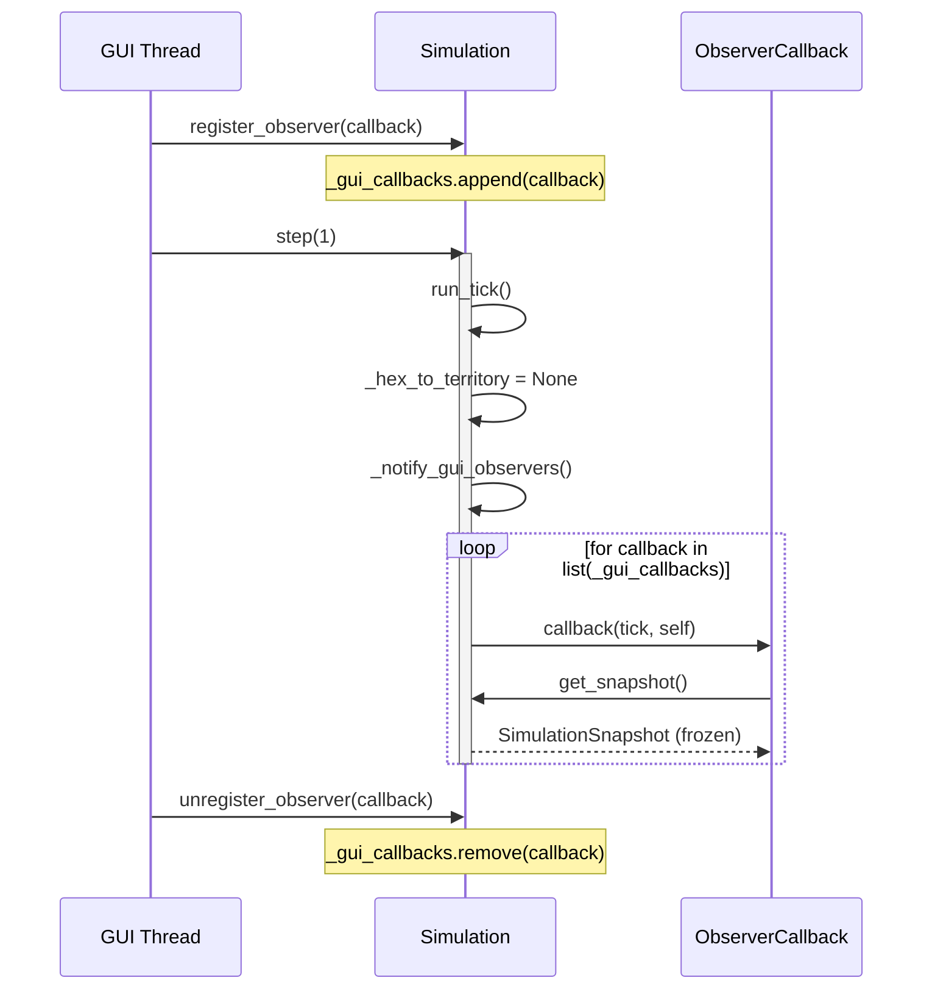

# Implementation Plan: GUI Protocol Extension (Phase 0)

**Branch**: `006-gui-protocol-extension` | **Date**: 2026-01-31 | **Spec**: [spec.md](spec.md)
**Input**: Feature specification from `/specs/006-gui-protocol-extension/spec.md`

## Summary

Extend the existing SimulationControl and SimulationState protocols to support GUI integration:

1. Add `register_observer`/`unregister_observer` to SimulationControl for callback-based notifications
1. Add `get_node_by_spatial_index(h3_index)` to SimulationState for H3→Territory lookup

This enables GUI layers to receive simulation state updates without coupling to implementation details.

## Observer Pattern Relationship

This feature adds a **lightweight callback pattern** alongside the existing `SimulationObserver`:



| Pattern              | Interface                                   | Use Case                                      | State Access                 |
| -------------------- | ------------------------------------------- | --------------------------------------------- | ---------------------------- |
| `SimulationObserver` | 3 methods (`on_start`, `on_tick`, `on_end`) | AI/Narrative observers needing full lifecycle | `WorldState` (internal)      |
| `ObserverCallback`   | Single callable `(tick, state) -> None`     | GUI needing lightweight tick updates          | `SimulationState` (protocol) |

**Why two patterns?** GUI code should depend only on protocols, not internal `WorldState`. The lightweight callback avoids forcing GUI to implement unused lifecycle methods.

## Technical Context

**Language/Version**: Python 3.12+
**Primary Dependencies**: Pydantic 2.x (frozen models), NetworkX 3.x (graph), h3 4.2 (spatial indexing)
**Storage**: N/A (in-memory protocols, no persistence changes)
**Testing**: pytest with hypothesis for property-based testing
**Target Platform**: Linux/macOS/Windows (cross-platform Python)
**Project Type**: Single project (extending existing engine)
**Performance Goals**: Observer notification < 1ms overhead per tick; spatial query O(1) via index
**Constraints**: Thread-safe delivery to GUI event loop; backward compatible protocol extension
**Scale/Scope**: Typical simulation: 10-100 territories, 1-10 observers

## Constitution Check

*GATE: Must pass before Phase 0 research. Re-check after Phase 1 design.*

| Principle                                    | Status  | Notes                                                                               |
| -------------------------------------------- | ------- | ----------------------------------------------------------------------------------- |
| II.5 AI Observes, Never Controls             | ✅ PASS | Observer pattern is read-only; GUI receives snapshots, cannot modify state          |
| II.6 State is Data, Engine is Transformation | ✅ PASS | Protocol extensions return immutable snapshots (frozen Pydantic)                    |
| II.3 NetworkX as Discretized Manifold        | ✅ PASS | Spatial query bridges H3 index to graph topology                                    |
| III.2 Falsifiability Required                | ✅ PASS | Acceptance scenarios are testable with concrete inputs/outputs                      |
| VI.3 Determinism from Material Conditions    | ✅ PASS | Observer registration is deterministic; callbacks are invoked in registration order |

**Gate Result**: PASS - No constitution violations. Proceed to Phase 0.

## Project Structure

### Documentation (this feature)

```text
specs/006-gui-protocol-extension/
├── spec.md              # Feature specification (complete)
├── plan.md              # This file
├── research.md          # Phase 0 output
├── data-model.md        # Phase 1 output
├── quickstart.md        # Phase 1 output
└── contracts/           # Phase 1 output (protocol definitions)
```

### Source Code (repository root)

```text
src/babylon/
├── protocols/
│   ├── __init__.py              # Export protocols + ObserverCallback type
│   ├── simulation_control.py    # MODIFY: Add register/unregister_observer
│   └── simulation_state.py      # MODIFY: Add get_node_by_spatial_index
├── engine/
│   └── simulation.py            # MODIFY: Implement new protocol methods + _gui_callbacks
└── models/
    └── snapshots.py             # EXISTING: TerritoryState (return type)

tests/
├── unit/
│   └── protocols/
│       ├── test_simulation_control.py  # NEW: Observer registration tests
│       └── test_simulation_state.py    # NEW: Spatial query tests
└── integration/
    └── engine/
        └── test_gui_observer.py        # NEW: Thread-safety tests
```

**Structure Decision**: Extending existing `src/babylon/protocols/` and `src/babylon/engine/` directories. No new classes needed—callbacks managed directly by `Simulation._gui_callbacks`.

## Complexity Tracking

No constitution violations requiring justification. Feature is a minimal protocol extension.

______________________________________________________________________

## Phase 0: Research

### Research Tasks

1. **PyQt6 Thread Communication**: Best practices for cross-thread signal/slot patterns
1. **H3 Validation**: Python h3 library validation functions
1. **Existing Observer Pattern**: Current SimulationObserver implementation details

### Research Findings

See [research.md](research.md) for detailed findings.

**Summary of Key Decisions**:

| Topic                  | Decision                                 | Rationale                                                                        |
| ---------------------- | ---------------------------------------- | -------------------------------------------------------------------------------- |
| Thread Safety          | Deep copy + frozen Pydantic models       | Compatible with Qt QueuedConnection; immutability guarantees no races            |
| H3 Validation          | Use `h3.is_valid_cell()`                 | Library function more robust than regex for edge cases                           |
| Callback Signature     | `Callable[[int, SimulationState], None]` | Tick number enables delta tracking; SimulationState provides full read interface |
| Duplicate Registration | Idempotent (single invocation)           | Simplest behavior; matches edge case spec                                        |

______________________________________________________________________

## Phase 1: Design & Contracts

### Data Model

See [data-model.md](data-model.md) for entity definitions.

**Key Entities**:

| Entity            | Type      | Description                                 |
| ----------------- | --------- | ------------------------------------------- |
| SimulationControl | Protocol  | Extended with observer registration methods |
| SimulationState   | Protocol  | Extended with spatial query method          |
| ObserverCallback  | TypeAlias | `Callable[[int, SimulationState], None]`    |

### Contracts

See [contracts/](contracts/) for protocol definitions.

**Protocol Extensions**:

```python
# SimulationControl additions
def register_observer(self, callback: Callable[[int, SimulationState], None]) -> None: ...
def unregister_observer(self, callback: Callable[[int, SimulationState], None]) -> None: ...

# SimulationState additions
def get_node_by_spatial_index(self, h3_index: str) -> TerritoryState | None: ...
```

### Quickstart

See [quickstart.md](quickstart.md) for usage examples.

______________________________________________________________________

## Per-Tick Update Rule

Observer callbacks are invoked at the end of each `step()` call:

```
step(n=1):
    for _ in range(n):
        new_state = engine.run_tick(graph, services, context)
        self._current_state = WorldState.from_graph(graph)
        self._hex_to_territory = None  # Invalidate spatial cache
        self._notify_gui_observers()   # Invoke registered callbacks
```

The notification occurs AFTER state reconstruction, ensuring observers receive consistent state.

### Sequence Diagram



______________________________________________________________________

## Implementation Phases

### Phase 1: Protocol Extension (Tasks 1-2)

1. **Extend SimulationControl protocol with observer methods**

   - File: `src/babylon/protocols/simulation_control.py`
   - Contract: [contracts/simulation_control.py](contracts/simulation_control.py)
   - Add `register_observer(callback)` and `unregister_observer(callback)`
   - Add `ObserverCallback` type alias to `protocols/__init__.py`

1. **Extend SimulationState protocol with spatial query**

   - File: `src/babylon/protocols/simulation_state.py`
   - Contract: [contracts/simulation_state.py](contracts/simulation_state.py)
   - Research: [research.md#2-h3-validation](research.md#2-h3-validation)
   - Add `get_node_by_spatial_index(h3_index: str) -> TerritoryState | None`

### Phase 2: Simulation Implementation (Tasks 3-4)

3. **Implement observer registration in Simulation class**

   - File: `src/babylon/engine/simulation.py`
   - Data model: [data-model.md#protocolobserveradapter](data-model.md#protocolobserveradapter) (callback list pattern)
   - Add `_gui_callbacks: list[ObserverCallback]` attribute
   - Implement `register_observer()`, `unregister_observer()`
   - Add `_notify_gui_observers()` called at end of `step()`
   - Thread safety: copy list before iteration (see [research.md#1](research.md#1-pyqt6-thread-communication))

1. **Implement spatial query with H3 index lookup**

   - File: `src/babylon/engine/simulation.py`
   - Research: [research.md#4-spatial-index-implementation](research.md#4-spatial-index-implementation)
   - Add lazy `_hex_to_territory: dict[str, str] | None` cache
   - Implement `get_node_by_spatial_index()` with `h3.is_valid_cell()` validation
   - Invalidate cache at end of `step()`

### Phase 3: Testing & Integration (Tasks 5-6)

5. **Unit tests for protocol methods**

   - Files: `tests/unit/protocols/test_simulation_control.py`, `test_simulation_state.py`
   - Patterns: See [quickstart.md#1-observer-registration](quickstart.md#1-observer-registration) for usage examples
   - Test cases: registration, unregistration, duplicate handling, callback invocation order, exception isolation

1. **Integration tests for thread safety**

   - File: `tests/integration/engine/test_gui_observer.py`
   - Patterns: See [quickstart.md#3-thread-safe-gui-integration](quickstart.md#3-thread-safe-gui-integration)
   - Test cases: concurrent step + callback registration, frozen snapshot delivery

______________________________________________________________________

## Risk Assessment

| Risk                                                     | Likelihood | Impact | Mitigation                                           |
| -------------------------------------------------------- | ---------- | ------ | ---------------------------------------------------- |
| H3 index collision (multiple territories claim same hex) | Low        | Medium | First-match lookup; document behavior                |
| Callback exception halts simulation                      | Low        | High   | Wrap in try/except per ADR003                        |
| Thread race in callback list                             | Medium     | Medium | Copy list before iteration; frozen snapshots         |
| Backward compatibility break                             | Low        | High   | Protocol extension (additive), not modification      |
| Spatial cache stale after external territory change      | Low        | Low    | Cache invalidated per tick; no external mutation API |

______________________________________________________________________

## Success Criteria Verification

| Criterion                              | Task | Verification Method                                        |
| -------------------------------------- | ---- | ---------------------------------------------------------- |
| SC-001: Callbacks within tick boundary | 3, 5 | Unit test: mock callback, verify invocation count per step |
| SC-002: H3 query correctness           | 4, 5 | Unit test: known hex→territory mapping, 100% accuracy      |
| SC-003: Thread-safe snapshots          | 6    | Integration test: concurrent step + read, no corruption    |
| SC-004: Graceful callback failure      | 3, 5 | Unit test: callback raises exception, simulation continues |
| SC-005: Backward compatibility         | ALL  | Existing tests pass without modification                   |
