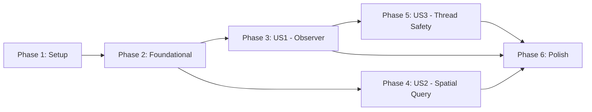

# Tasks: GUI Protocol Extension (Phase 0)

**Input**: Design documents from `/specs/006-gui-protocol-extension/`
**Prerequisites**: plan.md (required), spec.md (required), research.md, data-model.md, contracts/

**Tests**: This specification explicitly defines acceptance scenarios and success criteria, so test tasks are included.

**Organization**: Tasks are grouped by user story to enable independent implementation and testing of each story.

## Format: `[ID] [P?] [Story] Description`

- **[P]**: Can run in parallel (different files, no dependencies)
- **[Story]**: Which user story this task belongs to (e.g., US1, US2, US3)
- Include exact file paths in descriptions

## Path Conventions

- **Single project**: `src/babylon/`, `tests/` at repository root
- Protocol files: `src/babylon/protocols/`
- Engine files: `src/babylon/engine/`

______________________________________________________________________

## Phase 1: Setup (Shared Infrastructure)

**Purpose**: Project initialization and type definitions

- [ ] T001 [P] Add `ObserverCallback` type alias to `src/babylon/protocols/__init__.py`
- [ ] T002 [P] Add `import h3` to `src/babylon/engine/simulation.py` imports section

______________________________________________________________________

## Phase 2: Foundational (Protocol Extension)

**Purpose**: Extend protocols BEFORE implementing in Simulation class

**CRITICAL**: Protocol changes MUST be complete before any user story implementation

- [ ] T003 [P] Extend SimulationControl protocol with `register_observer(callback: ObserverCallback) -> None` in `src/babylon/protocols/simulation_control.py` per [contracts/simulation_control.py](contracts/simulation_control.py)
- [ ] T004 [P] Extend SimulationControl protocol with `unregister_observer(callback: ObserverCallback) -> None` in `src/babylon/protocols/simulation_control.py` per [contracts/simulation_control.py](contracts/simulation_control.py)
- [ ] T005 [P] Extend SimulationState protocol with `get_node_by_spatial_index(h3_index: str) -> TerritoryState | None` in `src/babylon/protocols/simulation_state.py` per [contracts/simulation_state.py](contracts/simulation_state.py)

**Checkpoint**: Protocols extended - implementation can now begin

______________________________________________________________________

## Phase 3: User Story 1 - GUI Observer Registration (Priority: P1)

**Goal**: GUI developers can register callbacks to receive tick notifications

**Independent Test**: Register mock callback, verify it receives (tick, state) after step()

### Tests for User Story 1

> **NOTE: Write these tests FIRST, ensure they FAIL before implementation**

- [ ] T006 [P] [US1] Unit test: callback receives tick and state after step() in `tests/unit/protocols/test_simulation_control.py`
- [ ] T007 [P] [US1] Unit test: unregistered callback not invoked in `tests/unit/protocols/test_simulation_control.py`
- [ ] T008 [P] [US1] Unit test: multiple observers invoked in registration order in `tests/unit/protocols/test_simulation_control.py`
- [ ] T009 [P] [US1] Unit test: duplicate registration is idempotent (invoked once) in `tests/unit/protocols/test_simulation_control.py`
- [ ] T010 [P] [US1] Unit test: callback exception logged but simulation continues in `tests/unit/protocols/test_simulation_control.py`

### Implementation for User Story 1

#### Adapter Infrastructure (must complete before Simulation integration)

- [ ] T011 [US1] Create `src/babylon/engine/observer_adapter.py` with ProtocolObserverAdapter class per [data-model.md#protocolobserveradapter](data-model.md#protocolobserveradapter)
- [ ] T012 [P] [US1] Unit test: adapter.register() adds callback (thread-safe) in `tests/unit/engine/test_observer_adapter.py`
- [ ] T013 [P] [US1] Unit test: adapter.unregister() removes callback (thread-safe) in `tests/unit/engine/test_observer_adapter.py`
- [ ] T014 [P] [US1] Unit test: adapter.notify() creates snapshot BEFORE iterating callbacks in `tests/unit/engine/test_observer_adapter.py`
- [ ] T015 [P] [US1] Unit test: adapter.notify() catches callback exceptions and logs them in `tests/unit/engine/test_observer_adapter.py`

#### Simulation Integration (delegates to adapter)

- [ ] T016 [US1] Add `_adapter: ProtocolObserverAdapter` attribute to Simulation.__init__ in `src/babylon/engine/simulation.py` per [data-model.md#simulation-class-extensions](data-model.md#simulation-class-extensions)
- [ ] T017 [US1] Implement `register_observer()` delegating to `self._adapter.register()` in `src/babylon/engine/simulation.py`
- [ ] T018 [US1] Implement `unregister_observer()` delegating to `self._adapter.unregister()` in `src/babylon/engine/simulation.py`
- [ ] T019 [US1] Implement `_notify_gui_observers()` calling `self._adapter.notify(tick)` in `src/babylon/engine/simulation.py`
- [ ] T020 [US1] Call `_notify_gui_observers()` at end of `step()` in `src/babylon/engine/simulation.py` per [plan.md#per-tick-update-rule](plan.md#per-tick-update-rule)

**Checkpoint**: User Story 1 complete - observers receive notifications on step()

______________________________________________________________________

## Phase 4: User Story 2 - Spatial Query by H3 Index (Priority: P2)

**Goal**: Map visualization can lookup territory by H3 hex index

**Independent Test**: Query known H3 index, verify correct TerritoryState returned

### Tests for User Story 2

> **NOTE: Write these tests FIRST, ensure they FAIL before implementation**

- [ ] T021 [P] [US2] Unit test: valid H3 index returns owning TerritoryState in `tests/unit/protocols/test_simulation_state.py`
- [ ] T022 [P] [US2] Unit test: valid H3 index not claimed returns None in `tests/unit/protocols/test_simulation_state.py`
- [ ] T023 [P] [US2] Unit test: invalid H3 format raises ValueError in `tests/unit/protocols/test_simulation_state.py`
- [ ] T024 [P] [US2] Unit test: cache invalidated after step() in `tests/unit/protocols/test_simulation_state.py`

### Implementation for User Story 2

- [ ] T025 [US2] Add `_hex_to_territory: dict[str, str] | None = None` attribute to Simulation.__init__ in `src/babylon/engine/simulation.py`
- [ ] T026 [US2] Implement `_build_hex_index()` to build reverse H3 -> territory_id mapping in `src/babylon/engine/simulation.py` per [research.md#4-spatial-index-implementation](research.md#4-spatial-index-implementation)
- [ ] T027 [US2] Implement `get_node_by_spatial_index()` with `h3.is_valid_cell()` validation in `src/babylon/engine/simulation.py`
- [ ] T028 [US2] Add cache invalidation `self._hex_to_territory = None` at end of step() in `src/babylon/engine/simulation.py`

**Checkpoint**: User Story 2 complete - spatial queries work independently

______________________________________________________________________

## Phase 5: User Story 3 - Thread-Safe State Snapshot (Priority: P3)

**Goal**: GUI thread can safely read state while engine runs in another thread

**Independent Test**: Concurrent step() + callback verification shows no data races

### Tests for User Story 3

> **NOTE: Write these tests FIRST, ensure they FAIL before implementation**

- [ ] T029 [P] [US3] Integration test: snapshot is immutable (frozen Pydantic) in `tests/integration/engine/test_gui_observer.py`
- [ ] T030 [P] [US3] Integration test: concurrent register + step doesn't corrupt callback list in `tests/integration/engine/test_gui_observer.py`
- [ ] T031 [P] [US3] Integration test: callback receives consistent snapshot (no partial updates) in `tests/integration/engine/test_gui_observer.py`

### Implementation for User Story 3

- [ ] T032 [US3] Verify ProtocolObserverAdapter.notify() copies list before iteration in `src/babylon/engine/observer_adapter.py` (implemented in T011)
- [ ] T033 [US3] Verify callbacks receive `SimulationSnapshot` (frozen) not `SimulationState` (live reference) in `src/babylon/engine/observer_adapter.py`
- [ ] T034 [US3] Add docstring noting thread-safety guarantees to `register_observer` in `src/babylon/engine/simulation.py`

**Checkpoint**: User Story 3 complete - thread-safe GUI integration verified

______________________________________________________________________

## Phase 6: Polish & Cross-Cutting Concerns

**Purpose**: Final verification and documentation

- [ ] T035 [P] Run existing test suite to verify backward compatibility (SC-005)
- [ ] T036 [P] Run [quickstart.md](quickstart.md) examples to validate documentation
- [ ] T037 Verify protocol implementations with `isinstance()` check in `tests/unit/protocols/test_simulation_control.py`
- [ ] T038 Update `src/babylon/protocols/__init__.py` exports if needed

______________________________________________________________________

## Dependencies & Execution Order

### Phase Dependencies

- **Setup (Phase 1)**: No dependencies - can start immediately
- **Foundational (Phase 2)**: Depends on Setup - BLOCKS all user stories
- **User Stories (Phase 3-5)**: All depend on Foundational phase completion
  - US1 Adapter (T011-T015) BLOCKS US1 Simulation Integration (T016-T020)
  - US1 and US2 have NO dependencies on each other (can run in parallel)
  - US3 depends on US1 (thread-safety of observer callbacks)
- **Polish (Phase 6)**: Depends on all user stories being complete

### User Story Dependencies



- **User Story 1 (P1)**: Can start after Foundational - No dependencies on other stories
- **User Story 2 (P2)**: Can start after Foundational - No dependencies on other stories
- **User Story 3 (P3)**: Depends on US1 (tests observer callback thread-safety)

### Within Each User Story

- Tests MUST be written and FAIL before implementation
- Implementation tasks in dependency order (attributes before methods)
- Core implementation before edge case handling

### Parallel Opportunities

**Phase 2 (Foundational)**: T003, T004, T005 can all run in parallel

**Phase 3 (US1 Tests)**: T006-T010 can all run in parallel

**Phase 3 (US1 Adapter Tests)**: T012-T015 can all run in parallel (after T011 creates the file)

**Phase 4 (US2 Tests)**: T021-T024 can all run in parallel

**Cross-Story**: US1 and US2 can be implemented in parallel by different developers

______________________________________________________________________

## Parallel Example: User Story 1 Tests

```bash
# Launch all behavioral tests for User Story 1 together:
Task: T006 "callback receives tick and state after step()"
Task: T007 "unregistered callback not invoked"
Task: T008 "multiple observers invoked in registration order"
Task: T009 "duplicate registration is idempotent"
Task: T010 "callback exception logged but simulation continues"

# Launch all adapter unit tests in parallel (after T011 creates the file):
Task: T012 "adapter.register() adds callback (thread-safe)"
Task: T013 "adapter.unregister() removes callback (thread-safe)"
Task: T014 "adapter.notify() creates snapshot BEFORE iterating"
Task: T015 "adapter.notify() catches callback exceptions"
```

______________________________________________________________________

## Implementation Strategy

### MVP First (User Story 1 Only)

1. Complete Phase 1: Setup (T001-T002)
1. Complete Phase 2: Foundational (T003-T005)
1. Complete Phase 3: User Story 1 (T006-T020)
   - Adapter Infrastructure (T011-T015)
   - Simulation Integration (T016-T020)
1. **STOP and VALIDATE**: Test observer registration independently
1. Deploy/demo if ready - GUI can now receive tick notifications

### Incremental Delivery

1. Complete Setup + Foundational -> Protocol extensions ready
1. Add User Story 1 -> Test independently -> Observer callbacks work
1. Add User Story 2 -> Test independently -> Spatial queries work
1. Add User Story 3 -> Test independently -> Thread safety verified
1. Each story adds value without breaking previous stories

### Parallel Team Strategy

With two developers after Foundational:

1. Team completes Setup + Foundational together
1. Once Foundational is done:
   - Developer A: User Story 1 (observer registration)
   - Developer B: User Story 2 (spatial queries)
1. Developer A continues to User Story 3 (thread safety)
1. Stories complete and integrate independently

______________________________________________________________________

## Notes

- [P] tasks = different files or independent scenarios, no dependencies
- [Story] label maps task to specific user story for traceability
- Each user story should be independently completable and testable
- Verify tests fail before implementing (TDD RED phase)
- Commit after each task or logical group
- Stop at any checkpoint to validate story independently
- Avoid: vague tasks, same file conflicts, cross-story dependencies that break independence
