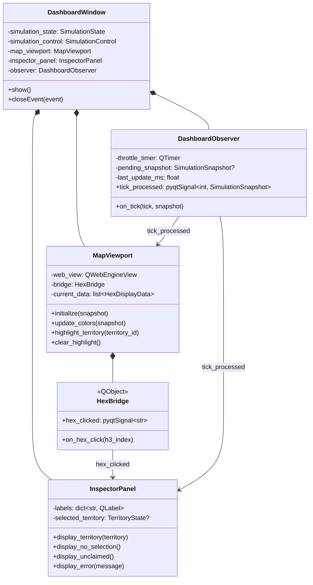
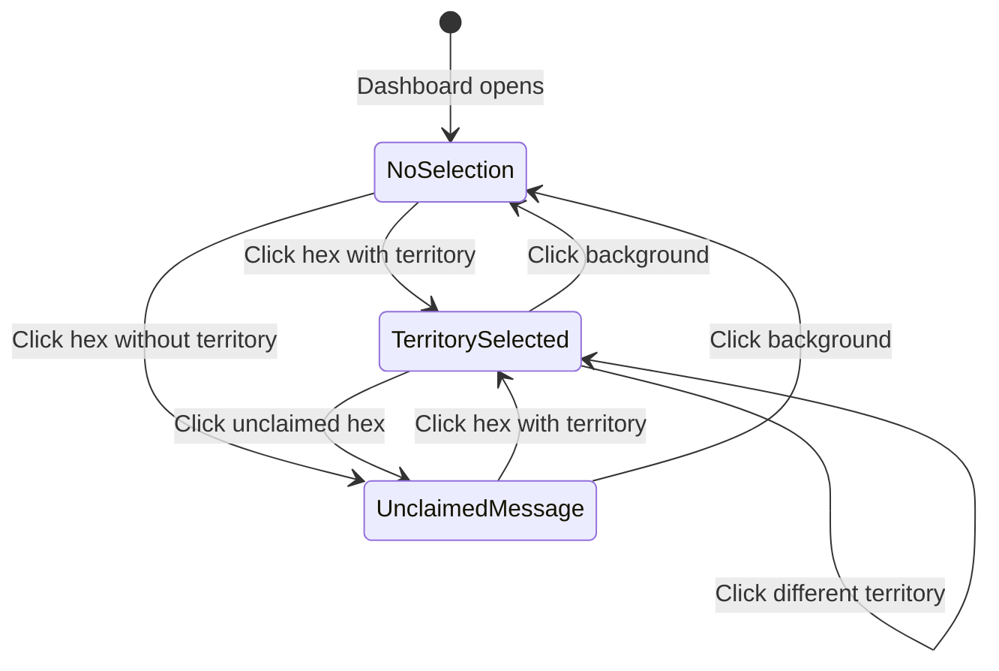

# Data Model: God Mode Dashboard (Phase 1)

**Feature**: 007-god-mode-dashboard | **Date**: 2026-01-31

## Overview

This document defines the component architecture and data structures for the God Mode Dashboard. The dashboard is a read-only visualization layer that receives data from the simulation via the SimulationState and SimulationControl protocols (Feature 006).

## Component Hierarchy



## Data Structures

### Existing (from Feature 006)

These structures are defined in `src/babylon/models/snapshots.py` and used as-is:

```python
class TerritoryState(BaseModel):
    """Frozen territory snapshot for GUI display."""
    territory_id: str           # 5-digit FIPS code
    controlling_polity: str     # Same as territory_id for MVP
    hex_claims: frozenset[str]  # H3 indices at resolution 5
    tick: int                   # >= 0
    profit_rate: float          # [0.0, 1.0] - color mapping input
    equilibrium_r: float        # [0.0, 1.0] - reference value

class SimulationSnapshot(BaseModel):
    """Complete simulation state at a tick."""
    tick: int
    territories: dict[str, TerritoryState]
    hexes: dict[str, HexState]
    edges: list[EdgeState]      # Empty for MVP
```

### New (Dashboard-specific)

```python
# src/babylon/ui/dashboard/models.py

from pydantic import BaseModel, ConfigDict


class HexDisplayData(BaseModel):
    """Data for a single hex in the map display.

    This is the internal format used by MapViewport for pydeck rendering.
    Derived from TerritoryState on each update.
    """
    model_config = ConfigDict(frozen=True)

    h3: str                    # H3 index (15-char hex string)
    color: tuple[int, int, int]  # RGB color from profit_rate
    territory_id: str | None   # Territory that claims this hex, or None
    selected: bool = False     # True if part of selected territory


class InspectorDisplayData(BaseModel):
    """Formatted data for the inspector panel.

    Converts TerritoryState to display-ready strings.
    """
    model_config = ConfigDict(frozen=True)

    territory_id: str
    controlling_polity: str
    tick: int
    profit_rate_display: str   # e.g., "0.42" or "42.0%"
    equilibrium_r_display: str # e.g., "0.50"
    hex_count: int             # len(hex_claims)


class ConnectionStatus(BaseModel):
    """Dashboard connection state."""
    model_config = ConfigDict(frozen=True)

    connected: bool
    last_tick: int | None      # Last received tick, or None
    error_message: str | None  # Most recent error, or None
```

## Value Tensor Display

The Inspector panel displays what the spec calls the "Value Tensor" - all numeric properties of TerritoryState:

| Property | Type | Display Format |
|----------|------|----------------|
| territory_id | str | As-is (FIPS code) |
| controlling_polity | str | As-is |
| tick | int | Integer |
| profit_rate | float | Percentage (e.g., "42.0%") or decimal |
| equilibrium_r | float | Decimal (e.g., "0.50") |
| hex_count | int | Integer (derived from len(hex_claims)) |

## Color Mapping

### Profit Rate to RGB

```python
def profit_rate_to_rgb(rate: float) -> tuple[int, int, int]:
    """Map profit_rate [0,1] to RGB tuple.

    Linear interpolation between:
    - 0.0 → phosphor_burn_red (212, 0, 0)
    - 1.0 → data_green (57, 255, 20)
    """
    low_r, low_g, low_b = 212, 0, 0      # #D40000
    high_r, high_g, high_b = 57, 255, 20 # #39FF14

    rate = max(0.0, min(1.0, rate))  # Clamp

    r = int(low_r + (high_r - low_r) * rate)
    g = int(low_g + (high_g - low_g) * rate)
    b = int(low_b + (high_b - low_b) * rate)

    return (r, g, b)
```

### Boundary Values

| profit_rate | RGB | Hex | Description |
|-------------|-----|-----|-------------|
| 0.0 | (212, 0, 0) | #D40000 | phosphor_burn_red |
| 0.5 | (134, 127, 10) | ~#867F0A | Midpoint (amber-ish) |
| 1.0 | (57, 255, 20) | #39FF14 | data_green |

## Selection State

### State Machine



### Selection State Model

```python
from dataclasses import dataclass
from enum import Enum

class SelectionState(Enum):
    NO_SELECTION = "no_selection"
    TERRITORY_SELECTED = "territory_selected"
    UNCLAIMED_HEX = "unclaimed_hex"

@dataclass
class CurrentSelection:
    state: SelectionState
    territory: TerritoryState | None = None
    clicked_h3: str | None = None  # For unclaimed hex message
```

## Layout Specification

From ai-docs/epochs/epoch1/ui-wireframes.yaml and epoch2/pyqt-visualization.yaml:

```
┌─────────────────────────────────────────────────────────────────────┐
│ Dashboard Window (1460×820 minimum)                                 │
├───────────────────────────────────────────────┬─────────────────────┤
│                                               │                     │
│                                               │   Inspector Panel   │
│                                               │       (30%)         │
│              Map Viewport (70%)               │                     │
│                                               │   ┌─────────────┐   │
│                                               │   │ territory_id│   │
│              [H3 Hexagonal Map]               │   │ polity      │   │
│                                               │   │ tick: 42    │   │
│                                               │   │ profit: 67% │   │
│                                               │   │ eq_r: 0.50  │   │
│                                               │   │ hexes: 127  │   │
│                                               │   └─────────────┘   │
│                                               │                     │
├───────────────────────────────────────────────┴─────────────────────┤
│ Status Bar: "Connected | Tick: 42 | Selected: Wayne County"        │
└─────────────────────────────────────────────────────────────────────┘
```

### Dimensions

| Element | Size | Notes |
|---------|------|-------|
| Window minimum | 1460×820 px | Per ai-docs layout spec |
| Map viewport | 70% width | Left/center area |
| Inspector panel | 30% width | Right edge |
| Splitter | Adjustable | QSplitter between map and inspector |

## Validation Rules

### H3 Index Format

```python
H3_INDEX_PATTERN = re.compile(r"^[0-9a-f]{15}$")

def is_valid_h3_index(index: str) -> bool:
    """Check if string is valid H3 index format."""
    return bool(H3_INDEX_PATTERN.match(index.lower()))
```

### Territory ID Format

```python
FIPS_PATTERN = re.compile(r"^[0-9]{5}$")

def is_valid_fips(code: str) -> bool:
    """Check if string is valid 5-digit FIPS code."""
    return bool(FIPS_PATTERN.match(code))
```

### Profit Rate Bounds

```python
def is_valid_profit_rate(rate: float) -> bool:
    """Check if profit rate is in valid range [0.0, 1.0]."""
    return 0.0 <= rate <= 1.0
```

## Error States

| Error | Display | Recovery |
|-------|---------|----------|
| SimulationState.get_snapshot() throws | Error indicator in status bar | Retry on next tick |
| Invalid H3 index from click | Log warning, ignore click | No action needed |
| Memory growth >50MB | Log warning | Continue (monitoring only for MVP) |
| Connection lost | "Disconnected" status, preserve selection | Auto-reconnect when available |

## Thread Safety

For MVP, all operations occur on the main Qt thread:

1. Observer callbacks received on main thread (per spec assumption)
2. QWebChannel signals delivered on main thread
3. No mutex/lock needed

Post-MVP threading considerations documented in research.md.
