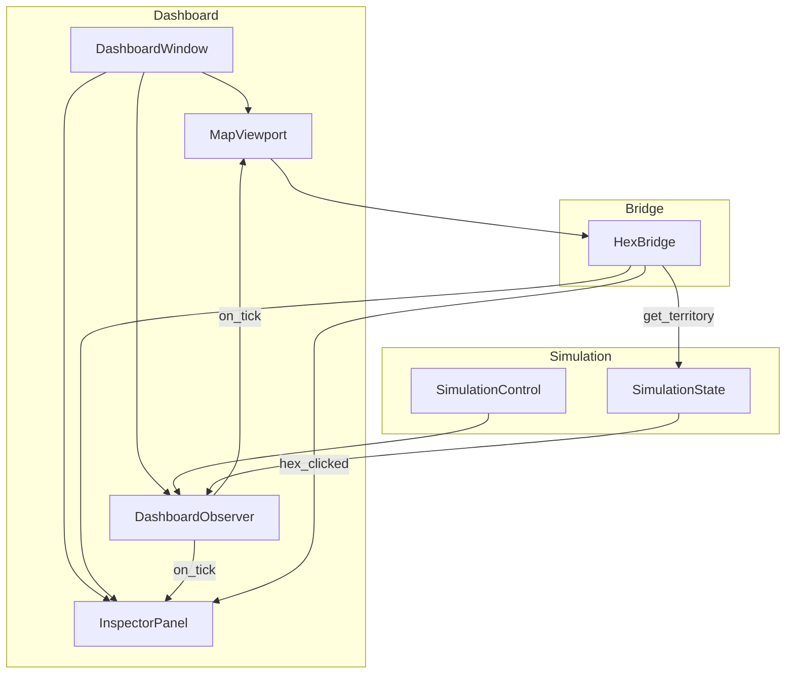

# Implementation Plan: God Mode Dashboard (Phase 1)

**Branch**: `007-god-mode-dashboard` | **Date**: 2026-01-31 | **Spec**: [spec.md](./spec.md)
**Input**: Feature specification from `/specs/007-god-mode-dashboard/spec.md`

## Summary

Build a real-time visualization dashboard for the Babylon simulation using PyQt6 with pydeck H3 hexagonal map rendering. The dashboard displays Detroit region territories colored by profit_rate, enables hex-click selection with territory inspection via QWebChannel bridge, and integrates with the simulation engine via the observer pattern (Feature 006). The "Bunker Constructivism" theme uses dark backgrounds with industrial accent colors per the design system.

## Technical Context

**Language/Version**: Python 3.12+
**Primary Dependencies**: PyQt6, PyQt6-WebEngine, pydeck, h3
**Storage**: N/A (in-memory visualization only; reads from SimulationState protocol)
**Testing**: pytest with pytest-qt for GUI components
**Target Platform**: Linux desktop (Ubuntu 22.04+), with macOS/Windows as secondary
**Project Type**: Single project (extends existing `src/babylon/` structure)
**Performance Goals**: 30 FPS throttled updates, 100ms update visibility, <5s initial load
**Constraints**: <50MB memory growth over 10,000 ticks, no frame exceeds 100ms render time
**Scale/Scope**: Detroit metro region (~17 territories, ~2,000 hexes at resolution 5)

## Constitution Check

*GATE: Must pass before Phase 0 research. Re-check after Phase 1 design.*

| Principle | Status | Notes |
|-----------|--------|-------|
| I.4 George Jackson Bifurcation | N/A | Dashboard is observation layer, not mechanics |
| I.8 Tragedy of Inevitability | N/A | Visualization only, no game logic |
| I.11 Emergent Pedagogy | ✅ PASS | Dashboard reveals simulation state without prescribing interpretation |
| II.5 AI Observes, Never Controls | ✅ PASS | GUI implements SimulationObserver - receives state, cannot modify mechanics |
| II.6 State is Data, Engine is Transformation | ✅ PASS | Dashboard receives frozen SimulationSnapshot, never mutates simulation state |
| III.1 No Magic Constants | ✅ PASS | Colors and layout defined in ai-docs/design-system.yaml |
| III.4 Data Source Traceability | N/A | Visualization layer, not data computation |

**Gate Result**: PASS - Dashboard is purely observational, aligns with Constitution II.5/II.6.

## Project Structure

### Documentation (this feature)

```text
specs/007-god-mode-dashboard/
├── plan.md              # This file
├── spec.md              # Feature specification
├── checklists/
│   ├── requirements.md  # Basic quality checklist
│   └── comprehensive.md # Detailed QA checklist (51 items)
├── research.md          # Phase 0 output (technology decisions)
├── data-model.md        # Phase 1 output (component design)
├── quickstart.md        # Phase 1 output (usage guide)
└── contracts/           # Phase 1 output (interface contracts)
    ├── dashboard_window.py
    ├── map_viewport.py
    ├── inspector_panel.py
    └── hex_bridge.py
```

### Source Code (repository root)

```text
src/babylon/
├── ui/
│   ├── __init__.py           # Existing (update exports)
│   ├── design_system.py      # Existing (theme constants)
│   ├── dpg_runner.py         # Existing (DearPyGui, not modified)
│   └── dashboard/            # NEW - God Mode Dashboard
│       ├── __init__.py
│       ├── main_window.py    # DashboardWindow (QMainWindow)
│       ├── map_viewport.py   # MapViewport (QWebEngineView + pydeck)
│       ├── inspector_panel.py # InspectorPanel (QWidget)
│       ├── hex_bridge.py     # HexBridge (QObject for QWebChannel)
│       ├── theme.py          # BunkerConstructivismTheme (QSS)
│       └── observer.py       # DashboardObserver (tick update handler)
├── protocols/
│   ├── simulation_state.py   # Existing (Feature 006)
│   └── simulation_control.py # Existing (Feature 006)
└── models/
    └── snapshots.py          # Existing (TerritoryState, SimulationSnapshot)

tests/
├── unit/
│   └── ui/
│       └── dashboard/
│           ├── test_map_viewport.py
│           ├── test_inspector_panel.py
│           └── test_hex_bridge.py
├── integration/
│   └── ui/
│       └── test_dashboard_simulation.py
└── conftest.py              # Add pytest-qt fixtures
```

**Structure Decision**: Single project extending `src/babylon/ui/`. New code goes in `src/babylon/ui/dashboard/` subdirectory to keep DearPyGui code (`dpg_runner.py`) separate during migration. This follows the existing pattern where `ui/` contains visualization components.

## Complexity Tracking

> No constitution violations requiring justification.

## Phase 0: Research

### Technology Decisions

| Decision | Choice | Rationale |
|----------|--------|-----------|
| GUI Framework | PyQt6 | Matches epoch2 architecture; QWebEngineView supports pydeck HTML |
| Map Renderer | pydeck + H3HexagonLayer | WebGL acceleration for 2,000+ hexes; existing ai-docs patterns |
| JS-Python Bridge | QWebChannel | Native Qt solution; bidirectional messaging for hex clicks |
| Theme System | Qt Stylesheets (QSS) | Per ai-docs/epochs/epoch2/pyqt-visualization.yaml |
| Threading Model | Main thread only (MVP) | Callbacks on main thread per spec assumptions |

### Dependencies to Add

```toml
# pyproject.toml [tool.poetry.dependencies]
PyQt6 = "^6.6"
PyQt6-WebEngine = "^6.6"
pydeck = "^0.9"
```

### Risk Assessment

| Risk | Mitigation |
|------|------------|
| pydeck HTML regeneration (10MB concern) | Use incremental JSON update pattern per FR-011 |
| QWebChannel latency | Profile in integration tests; 100ms target allows margin |
| Memory leaks in observer pattern | Explicit unregister in closeEvent; weak refs if needed |

## Phase 1: Design

### Component Responsibilities



### Data Flow

1. **Initialization**:
   - DashboardWindow created with SimulationState + SimulationControl references
   - MapViewport generates initial pydeck HTML from `get_snapshot().territories`
   - DashboardObserver registers via `register_observer()`

2. **Tick Update** (30 FPS throttled):
   - Simulation calls observer callback with `(tick, snapshot)`
   - DashboardObserver coalesces if <33ms since last update
   - MapViewport receives JSON update with territory colors
   - InspectorPanel updates if selected territory changed

3. **Hex Click**:
   - User clicks hex in pydeck map
   - JavaScript fires event via QWebChannel
   - HexBridge receives H3 index, calls `get_node_by_spatial_index()`
   - InspectorPanel displays TerritoryState or "No territory claims this hex"

### Interface Contracts

See `contracts/` directory for detailed Python protocols:
- `DashboardWindow`: Main window orchestration
- `MapViewport`: H3 map rendering and updates
- `InspectorPanel`: Territory detail display
- `HexBridge`: QWebChannel message handler

### Color Mapping

```python
def profit_rate_to_color(rate: float) -> str:
    """Map profit_rate [0,1] to hex color string.

    Uses design system colors:
    - 0.0 (low) → phosphor_burn_red (#D40000)
    - 1.0 (high) → data_green (#39FF14)

    Linear interpolation in RGB space.
    """
    low = (212, 0, 0)    # #D40000
    high = (57, 255, 20) # #39FF14
    r = int(low[0] + (high[0] - low[0]) * rate)
    g = int(low[1] + (high[1] - low[1]) * rate)
    b = int(low[2] + (high[2] - low[2]) * rate)
    return f"#{r:02x}{g:02x}{b:02x}"
```

### Theme Constants

From `ai-docs/design-system.yaml`:

```python
# src/babylon/ui/dashboard/theme.py
BUNKER_CONSTRUCTIVISM = {
    "void": "#050505",           # Deep black base
    "wet_concrete": "#1a1a1a",   # Primary background
    "soot": "#2d2d2d",           # Secondary background
    "data_green": "#39FF14",     # High profit rate
    "phosphor_burn_red": "#D40000",  # Low profit rate
    "amber_warning": "#ff8c00",  # Warnings
    "steel_gray": "#708090",     # Neutral UI chrome
}

QSS_THEME = """
QMainWindow {
    background-color: #1a1a1a;
}
QLabel {
    color: #39FF14;
    font-family: monospace;
}
QFrame#inspector {
    background-color: #2d2d2d;
    border-left: 2px solid #708090;
}
"""
```

## Implementation Sequence

1. **Infrastructure** (pytest-qt setup, dependencies)
2. **Theme** (QSS stylesheet, color constants)
3. **InspectorPanel** (static display, no simulation)
4. **MapViewport** (pydeck HTML generation, static)
5. **HexBridge** (QWebChannel + click handling)
6. **DashboardWindow** (layout, splitter)
7. **DashboardObserver** (throttling, coalescing)
8. **Integration** (connect to Simulation)

## Open Questions for Phase 2 (Tasks)

1. Should we use `pyqtSignal` for internal component communication?
2. Should MapViewport use `setHtml()` or `setUrl()` with temp file?
3. What H3 resolution should we use? (Spec references res 5, verify)

---

*Plan ready for `/speckit.tasks` to generate implementation tasks.*
