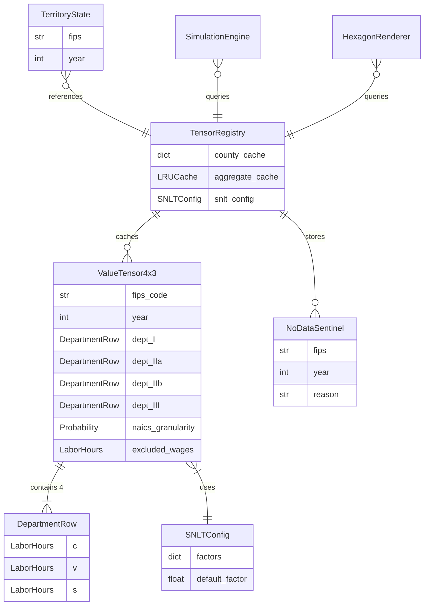

# Data Model: Fundamental Tensor Primitive

**Feature**: 011-fundamental-tensor-primitive
**Date**: 2026-02-01

## Entity Overview



---

## Core Types

### LaborHours

**Purpose**: Constrained type for labor-time values, distinct from Currency.

```python
LaborHours = Annotated[float, Field(ge=0.0, description="Labor-time in hours")]
```

**Validation Rules**:
- Must be >= 0.0 (labor-time cannot be negative)
- Primitive tensor cells use this type
- Derived tensors may use signed values (see `SignedLaborHours`)

**Relationships**:
- Used by `DepartmentRow.c`, `DepartmentRow.v`, `DepartmentRow.s`
- Aggregation preserves type (sum of LaborHours is LaborHours)

### SignedLaborHours

**Purpose**: Constrained type for derived values that can be negative.

```python
SignedLaborHours = Annotated[float, Field(description="Labor-time allowing negative")]
```

**Validation Rules**:
- No constraint on sign (can be negative, zero, or positive)
- Used only for derived tensors (e.g., imperial rent)

**Relationships**:
- Used by derived fields like `ValueTensor4x3.imperial_rent`
- Not used in primitive tensor cells (those must be non-negative)

---

## DepartmentRow

**Purpose**: Single row of the 4×3 tensor, representing one Marxian department.

### Fields

| Field | Type | Description |
|-------|------|-------------|
| `c` | LaborHours | Constant capital (dead labor transferred) |
| `v` | LaborHours | Variable capital (living labor wages) |
| `s` | LaborHours | Surplus value (unpaid labor) |

### Computed Fields

| Field | Type | Formula |
|-------|------|---------|
| `total_value` | LaborHours | `c + v + s` |
| `organic_composition` | float \| None | `c / v` if v > 0 else None |
| `exploitation_rate` | float \| None | `s / v` if v > 0 else None |

### Validation Rules

- All fields must be non-negative (enforced by LaborHours type)
- Immutable (frozen=True in Pydantic config)

### State Transitions

None - DepartmentRow is pure data without state.

---

## ValueTensor4x3

**Purpose**: The fundamental tensor primitive. Single county-year economic snapshot.

### Fields

| Field | Type | Description |
|-------|------|-------------|
| `fips_code` | str | 5-digit FIPS code (e.g., "26163") |
| `year` | int | Calendar year (>= 1900) |
| `dept_I` | DepartmentRow | Means of production |
| `dept_IIa` | DepartmentRow | Wage goods |
| `dept_IIb` | DepartmentRow | Luxury goods |
| `dept_III` | DepartmentRow | Reproductive labor |
| `naics_granularity` | Probability | Coverage quality (0-1) |
| `excluded_wages` | LaborHours | Government wages excluded |
| `visibility_g33` | Probability | Dept III visibility (0=shadow, 1=monetized) |

### Computed Fields

| Field | Type | Formula |
|-------|------|---------|
| `total_value` | LaborHours | Sum of all department totals |
| `total_v` | LaborHours | Sum of v across departments |
| `total_s` | LaborHours | Sum of s across departments |
| `profit_rate` | float \| None | `total_s / (total_c + total_v)` |
| `exploitation_rate` | float \| None | `total_s / total_v` |
| `organic_composition` | float \| None | `total_c / total_v` |
| `shadow_subsidy` | LaborHours | `dept_III.total * (1 - visibility_g33)` |
| `imperial_rent` | SignedLaborHours | `total_v - total_value` (can be negative) |

### Validation Rules

| Rule | Description |
|------|-------------|
| fips_code format | Must be exactly 5 digits |
| year range | Must be >= 1900 |
| naics_granularity | Must be in [0.0, 1.0] |
| visibility_g33 | Must be in [0.0, 1.0] |
| department values | All must be non-negative (LaborHours constraint) |

### Relationships

- **Contained by**: `TensorRegistry` (keyed by `(fips_code, year)`)
- **Contains**: 4 `DepartmentRow` instances
- **Referenced by**: `TerritoryState.tensor_ref`

---

## NoDataSentinel

**Purpose**: Explicit marker when tensor data is unavailable.

### Fields

| Field | Type | Description |
|-------|------|-------------|
| `fips` | str | FIPS code that was queried |
| `year` | int | Year that was queried |
| `reason` | str | Human-readable explanation |

### Validation Rules

- Immutable (frozen dataclass)
- `__bool__` returns `False` (allows `if tensor := registry.get(...)` pattern)

### Example Reasons

- `"No QCEW data available for this county-year"`
- `"County FIPS code not in database"`
- `"Year outside available data range (2010-2025)"`

---

## TensorRegistry

**Purpose**: Cached container for tensor primitives. Single source of truth.

### Fields

| Field | Type | Description |
|-------|------|-------------|
| `_county_cache` | dict[tuple[str, int], ValueTensor4x3 \| NoDataSentinel] | Primary cache |
| `_aggregate_cache` | LRUCache | Cached state/nation aggregates |
| `_snlt_config` | SNLTConfig | Year-specific conversion factors |
| `_hydrator` | TensorHydrator | Database loader (injected) |

### Methods

| Method | Signature | Description |
|--------|-----------|-------------|
| `get` | `(fips: str, year: int) -> ValueTensor4x3 \| NoDataSentinel` | Get single county tensor |
| `get_aggregate` | `(level: GeoLevel, code: str, year: int) -> ValueTensor4x3 \| NoDataSentinel` | Get state/nation aggregate |
| `available_years` | `(fips: str) -> frozenset[int]` | Years with data for county |
| `hydrate` | `(fips_codes: Sequence[str], years: Sequence[int]) -> None` | Bulk load from database |
| `clear` | `() -> None` | Clear all caches |

### State Transitions

```
EMPTY -> HYDRATING -> READY
         ^              |
         |              v
         +--- PARTIAL --+
```

| State | Description |
|-------|-------------|
| EMPTY | No data loaded |
| HYDRATING | Database queries in progress |
| READY | All requested data loaded |
| PARTIAL | Some data loaded; more can be added |

### Validation Rules

- Thread-safe (all cache operations use locks)
- LRU eviction for aggregate cache (prevents unbounded memory)
- Immutable tensors (cache returns references, not copies)

### Concurrent Access Pattern

The `TensorRegistry` is designed for safe concurrent read access from multiple consumers (SimulationEngine, HexagonRenderer, derived tensor calculators) while supporting exclusive write access during hydration.

**Threading Model**:

```
┌─────────────────────────────────────────────────────────────────┐
│                      TensorRegistry                              │
│                                                                  │
│  ┌──────────────────┐    ┌──────────────────┐                   │
│  │  _county_lock    │    │  _aggregate_lock │                   │
│  │  (threading.Lock)│    │  (threading.Lock)│                   │
│  └────────┬─────────┘    └────────┬─────────┘                   │
│           │                       │                              │
│           v                       v                              │
│  ┌──────────────────┐    ┌──────────────────┐                   │
│  │  _county_cache   │    │  _aggregate_cache│                   │
│  │  (dict)          │    │  (LRU cache)     │                   │
│  └──────────────────┘    └──────────────────┘                   │
└─────────────────────────────────────────────────────────────────┘
```

**Lock Acquisition Rules**:

| Operation | County Lock | Aggregate Lock | Notes |
|-----------|-------------|----------------|-------|
| `get()` | Acquired | - | Read from county cache |
| `put()` | Acquired | - | Write to county cache, invalidates aggregates |
| `get_aggregate()` | - | Acquired | May read county cache (no lock needed - immutable) |
| `hydrate()` | Acquired | Acquired | Bulk write, clears aggregate cache |
| `clear()` | Acquired | Acquired | Clears both caches |

**Invariants**:

1. **Readers never block readers**: Multiple threads can call `get()` or `get_aggregate()` concurrently (short critical sections).
2. **Writers invalidate aggregates**: Any mutation to `_county_cache` clears `_aggregate_cache` to prevent stale aggregates.
3. **Immutable tensors**: `ValueTensor4x3` is frozen; cache returns direct references safely.
4. **Lock ordering**: When both locks needed, always acquire `_county_lock` first, then `_aggregate_lock`.

**Cache Invalidation Strategy**:

When `put()` adds a new tensor or overwrites an existing one:
1. Acquire `_county_lock`
2. Update `_county_cache[(fips, year)] = tensor`
3. Call `_invalidate_aggregates()` which clears all aggregate cache entries

This conservative strategy ensures correctness at the cost of recomputing aggregates after any write. Future optimization could use fine-grained invalidation based on affected state/nation keys.

---

## SNLTConfig

**Purpose**: Year-specific SNLT conversion factors.

### Fields

| Field | Type | Description |
|-------|------|-------------|
| `factors` | dict[int, float] | Year → SNLT factor mapping |
| `default_factor` | float | Fallback when year not in factors |

### Methods

| Method | Signature | Description |
|--------|-----------|-------------|
| `get_factor` | `(year: int) -> float` | Get SNLT factor for year |

### Validation Rules

- All factors must be > 0.0
- Default factor must be > 0.0
- Immutable (frozen Pydantic model)

### Example Configuration

```python
SNLTConfig(
    factors={
        2010: 1.0,   # Base year
        2015: 0.95,  # 5% productivity increase
        2020: 0.90,  # 10% productivity increase
    },
    default_factor=1.0,  # Use base year for unknowns
)
```

---

## GeoLevel

**Purpose**: Enumeration of geographic aggregation levels.

```python
class GeoLevel(Enum):
    COUNTY = "county"  # 5-digit FIPS
    STATE = "state"    # 2-digit state FIPS
    NATION = "nation"  # Single aggregate
```

---

## Integration with Existing Types

### TerritoryState (Modified)

Add tensor reference for visualization access:

```python
class TerritoryState(BaseModel):
    # Existing fields...
    territory_id: str  # FIPS code
    tick: int
    profit_rate: float

    # NEW: Reference for tensor lookup
    tensor_year: int  # Year for tensor lookup (may differ from tick)
```

### SimulationSnapshot (Modified)

Include registry reference for consumer access:

```python
class SimulationSnapshot:
    territories: dict[str, TerritoryState]
    hexes: dict[str, HexState]
    tensor_registry: TensorRegistry  # NEW: Shared reference
```

---

## Data Flow Summary

```
┌─────────────────────────────────────────────────────────────────┐
│                         SQLite Database                          │
│  ┌──────────────┐  ┌──────────────┐  ┌──────────────┐          │
│  │ fact_qcew_*  │  │ fact_bea_*   │  │ dim_county   │          │
│  └──────┬───────┘  └──────┬───────┘  └──────┬───────┘          │
└─────────┼─────────────────┼─────────────────┼───────────────────┘
          │                 │                 │
          v                 v                 v
┌─────────────────────────────────────────────────────────────────┐
│                      TensorHydrator                              │
│  - Queries QCEW wages by NAICS                                   │
│  - Applies BEA ratios (with fallback)                           │
│  - Converts via SNLTConfig                                       │
│  - Creates immutable ValueTensor4x3                             │
└──────────────────────────────┬──────────────────────────────────┘
                               │
                               v
┌─────────────────────────────────────────────────────────────────┐
│                      TensorRegistry                              │
│  ┌─────────────────────────────────────────────────────────────┐│
│  │ _county_cache: {(fips, year): ValueTensor4x3 | Sentinel}    ││
│  └─────────────────────────────────────────────────────────────┘│
│  ┌─────────────────────────────────────────────────────────────┐│
│  │ _aggregate_cache: LRU{(level, code, year): ValueTensor4x3}  ││
│  └─────────────────────────────────────────────────────────────┘│
└──────────────────────────────┬──────────────────────────────────┘
                               │
          ┌────────────────────┼────────────────────┐
          │                    │                    │
          v                    v                    v
┌─────────────────┐  ┌─────────────────┐  ┌─────────────────┐
│ SimulationEngine│  │ HexagonRenderer │  │ Derived Tensors │
│ (read-only)     │  │ (read-only)     │  │ (read-only)     │
└─────────────────┘  └─────────────────┘  └─────────────────┘
```
