# Implementation Plan: Fundamental Tensor Primitive

**Branch**: `011-fundamental-tensor-primitive` | **Date**: 2026-02-01 | **Spec**: [spec.md](./spec.md)
**Input**: Feature specification from `/specs/011-fundamental-tensor-primitive/spec.md`

## Summary

Establish ValueTensor4x3 as the single source of truth for all economic data in Babylon. The primitive stores labor-hour values (via SNLT proxy conversion), loads from SQLite, and serves both simulation systems and hexagon visualization. Key architectural change: tensors become **persistent cached primitives** rather than ephemeral per-hydration objects.

## Technical Context

**Language/Version**: Python 3.12+ (existing stack)
**Primary Dependencies**: Pydantic 2.x (validation), NumPy (tensor ops), SQLAlchemy 2.x (ORM)
**Storage**: SQLite (`marxist-data-3NF.sqlite` for source data; in-memory tensor cache)
**Testing**: pytest with `@pytest.mark.math` for tensor operations
**Target Platform**: Linux/macOS development, headless server deployment
**Project Type**: Single project (src/babylon/)
**Performance Goals**: 100 counties × 10 years in <5 seconds; <500MB memory for full US
**Constraints**: Zero database queries after initialization; hexagons receive only tensor data
**Scale/Scope**: 3,143 US counties × 50 years = ~157k potential tensor slices (sparse)

## Constitution Check

*GATE: Must pass before Phase 0 research. Re-check after Phase 1 design.*

| Principle | Status | Notes |
|-----------|--------|-------|
| II.2 Primitives vs Derived | ✅ PASS | Tensor stores labor-hours (primitive); c/v/s ratios derived on demand |
| II.5 AI Observes, Never Controls | ✅ PASS | Tensor layer is mechanical, not AI-driven |
| II.6 State is Data, Engine is Transformation | ✅ PASS | Tensor is frozen Pydantic data; hydration is transformation |
| III.1 No Magic Constants | ✅ PASS | SNLT factors from configuration, BEA ratios from database or interpolation |
| III.4 Data Source Traceability | ✅ PASS | QCEW (labor hours proxy via wages), BEA (c/v, s/v ratios) |
| VI.1 UI Observes, Never Controls | ✅ PASS | Hexagons receive tensor data read-only; no mutations |
| VII.1 Solidarity as Scalar | N/A | Not relevant to tensor primitive |

**Gate Status**: PASSED - No violations requiring justification.

## Project Structure

### Documentation (this feature)

```text
specs/011-fundamental-tensor-primitive/
├── plan.md              # This file
├── research.md          # Phase 0 output
├── data-model.md        # Phase 1 output
├── quickstart.md        # Phase 1 output
├── contracts/           # Phase 1 output
│   └── tensor_api.py    # Protocol definitions
└── tasks.md             # Phase 2 output (/speckit.tasks)
```

### Source Code (repository root)

```text
src/babylon/
├── economics/
│   ├── tensor.py                # MODIFY: Add labor-hour support, sentinel types
│   ├── tensor_registry.py       # NEW: Cached tensor primitive container
│   ├── snlt.py                  # NEW: Year-specific SNLT conversion factors
│   ├── hydrator.py              # MODIFY: Return cached tensors, not ephemeral
│   ├── department_mapper.py     # EXISTING: No changes needed
│   └── adapters.py              # EXISTING: Minor updates for BEA interpolation
├── data/reference/
│   ├── hydrator.py              # MODIFY: Use tensor registry
│   └── schema.py                # EXISTING: No changes needed
├── models/
│   ├── snapshots.py             # MODIFY: Add tensor reference to TerritoryState
│   └── types.py                 # MODIFY: Add LaborHours type
└── engine/
    └── simulation.py            # MODIFY: Initialize tensor registry at startup

tests/
├── unit/economics/
│   ├── test_tensor_registry.py  # NEW
│   ├── test_snlt.py             # NEW
│   └── test_tensor.py           # MODIFY: Add labor-hour tests
├── integration/
│   └── test_tensor_data_flow.py # NEW: Full SQLite → Tensor → Simulation flow
└── constants.py                 # MODIFY: Add tensor test constants
```

**Structure Decision**: Single project structure under `src/babylon/`. The tensor primitive extends the existing `economics/` package with a new registry pattern for caching.

## Complexity Tracking

No violations requiring justification.

---

## Phase 0: Research Findings

### R1: Existing Tensor Implementation

**Decision**: Extend existing `ValueTensor4x3` rather than replace it.

**Rationale**: The 4×3 structure (departments × components) is correct per Marxist theory. The Pydantic model with computed properties for `profit_rate`, `exploitation_rate`, `organic_composition` is well-tested. What's missing is:
- Labor-hour representation (currently Currency)
- Multi-tensor container with caching
- "No data" sentinel pattern

**Alternatives Considered**:
- NumPy ndarray directly: Rejected—loses Pydantic validation and computed field semantics
- xarray labeled array: Rejected—overkill for fixed 4×3 shape, adds dependency
- Complete rewrite: Rejected—existing tests and computed fields are valuable

### R2: SNLT Conversion Strategy

**Decision**: Year-specific conversion factors as configuration, with wage-proportional proxy as interim.

**Rationale**: Per spec clarification, until SNLT is fully calibrated:
- Tensor values = wage-proportional labor-time proxies
- Derived ratios (r, e, OCC) are exact (ratios cancel units)
- Absolute magnitudes require eventual SNLT calibration

**Implementation**: `SNLTConfig` Pydantic model with `get_factor(year: int) -> float`. Default factor = 1.0 (no conversion) until calibration data is available.

**Alternatives Considered**:
- Single global SNLT: Rejected—productivity changes over time (user specified year-specific)
- Inflation adjustment only: Rejected—masks real productivity changes

### R3: BEA Ratio Fallback Pattern

**Decision**: Temporal interpolation from nearest available year when BEA ratios are missing.

**Rationale**: Per spec clarification, BEA ratios are relatively stable across years. Interpolation:
1. Query exact year
2. If missing, query nearest prior year
3. If no prior, query nearest future year
4. If none found, use department-level YAML defaults (existing behavior)

**Alternatives Considered**:
- Return "no data": Rejected—QCEW data would be unusable
- National averages: Rejected—less accurate than temporal interpolation

### R4: Geographic Aggregation Strategy

**Decision**: Lazy computation with LRU caching.

**Rationale**: Pre-computing all 50 states × 50 years would consume memory for rarely-accessed combinations. Lazy computation:
1. Aggregates computed on first request
2. Results cached with LRU eviction
3. Cache invalidated on tensor update

**Implementation**: `TensorRegistry.get_state_aggregate(state_fips: str, year: int)` computes sum of county tensors, caches result.

**Alternatives Considered**:
- Eager pre-computation: Rejected—memory overhead for full US dataset
- No caching: Rejected—repeated queries would be slow

### R5: "No Data" Sentinel Pattern

**Decision**: `NoDataSentinel` frozen object distinct from zero-valued tensor.

**Rationale**: Per spec, zero is a valid value (a county could legitimately have zero Dept III activity). The sentinel:
- Is a singleton frozen object
- Implements `__bool__` returning `False`
- Provides `reason: str` field explaining the gap

**Implementation**:
```python
@dataclass(frozen=True)
class NoDataSentinel:
    fips: str
    year: int
    reason: str

    def __bool__(self) -> bool:
        return False
```

Consumers use: `if tensor := registry.get(fips, year): ...`

### R6: Hexagon Data Access Pattern

**Decision**: Hexagons receive tensor references via `TerritoryState`, never import database modules.

**Rationale**: Per spec FR-004, hexagons must not touch the database. The pattern:
1. `TerritoryState` includes `tensor_ref: str | None` (registry key)
2. Visualization layer receives `TensorRegistry` reference at startup
3. Hexagons call `registry.get(territory.tensor_ref)` for data

**Verification**: Import analysis confirms `src/babylon/ui/` has no imports from `src/babylon/data/`.

---

## Phase 1: Design & Contracts

### Data Model

See [data-model.md](./data-model.md) for complete entity definitions.

**Key Entities**:

1. **LaborHours** (new type): Constrained float >= 0.0, distinct from Currency
2. **ValueTensor4x3** (extended): Now stores LaborHours, supports sentinel pattern
3. **TensorRegistry** (new): LRU-cached container keyed by (fips, year)
4. **SNLTConfig** (new): Year-specific conversion factors
5. **NoDataSentinel** (new): Explicit "no data available" marker

### Contracts

See [contracts/tensor_api.py](./contracts/tensor_api.py) for protocol definitions.

**Key Protocols**:

```python
class TensorPrimitive(Protocol):
    """Read-only access to tensor data."""
    def get(self, fips: str, year: int) -> ValueTensor4x3 | NoDataSentinel: ...
    def get_aggregate(self, level: GeoLevel, code: str, year: int) -> ValueTensor4x3 | NoDataSentinel: ...
    def available_years(self, fips: str) -> frozenset[int]: ...

class TensorHydrator(Protocol):
    """Loads tensors from database into registry."""
    def hydrate_counties(self, fips_codes: Sequence[str], years: Sequence[int]) -> None: ...
    def hydrate_state(self, state_fips: str, years: Sequence[int]) -> None: ...
```

### Agent Context Update

```bash
.specify/scripts/bash/update-agent-context.sh claude
```

Technologies added:
- LRU caching pattern for tensor registry
- Sentinel object pattern for missing data
- Year-specific configuration pattern for SNLT

---

## Architecture Diagram

```mermaid
flowchart TD
    subgraph Database["SQLite (Cold)"]
        QCEW[fact_qcew_annual]
        BEA[fact_bea_*]
        H3[bridge_county_h3]
    end

    subgraph TensorLayer["Tensor Layer (Warm)"]
        Registry[TensorRegistry<br/>LRU Cache]
        SNLT[SNLTConfig<br/>year → factor]
        Hydrator[TensorHydrator]
    end

    subgraph Consumers["Consumers (Read-Only)"]
        Sim[SimulationEngine]
        Hex[Hexagon Visualization]
        Derived[Derived Tensors<br/>Imperial Rent, etc.]
    end

    QCEW --> Hydrator
    BEA --> Hydrator
    Hydrator --> |"hydrate(fips, year)"| Registry
    SNLT --> |"convert wages → hours"| Hydrator

    Registry --> |"get(fips, year)"| Sim
    Registry --> |"get(fips, year)"| Hex
    Registry --> |"get(fips, year)"| Derived

    H3 --> |"h3_index → fips"| Hex

    style Database fill:#1a0000,stroke:#dc143c
    style TensorLayer fill:#1a0000,stroke:#ffd700
    style Consumers fill:#1a0000,stroke:#c0c0c0
```



**Data Flow**:
1. **Initialization**: `TensorHydrator.hydrate_counties(fips_codes, years)` loads from SQLite
2. **Conversion**: QCEW wages × SNLT factor → LaborHours
3. **Caching**: `TensorRegistry` stores `ValueTensor4x3` keyed by `(fips, year)`
4. **Access**: Simulation and hexagons call `registry.get(fips, year)` — no database touch
5. **Aggregation**: `registry.get_aggregate(GeoLevel.STATE, "26", 2022)` computed lazily

---

## Success Criteria Verification

| Criterion | How Verified |
|-----------|--------------|
| SC-001: Zero DB queries after init | Integration test with query counter mock |
| SC-002: No hexagon DB imports | Static import analysis in CI |
| SC-003: Geographic aggregation ±0.01% | Unit test: sum(counties) == state within tolerance |
| SC-004: Temporal aggregation ±0.01% | Unit test: sum(quarters) == annual within tolerance |
| SC-005: 100 counties × 10 years <5s | Benchmark test with timeout assertion |
| SC-006: <500MB for full US | Memory profiler in integration test |
| SC-007: Formula tests use labor-hours | Review all test assertions for unit consistency |
| SC-008: Derived tensors match manual calc | Unit tests comparing tensor-derived vs manual |

---

## Risk Assessment

| Risk | Mitigation |
|------|------------|
| BEA ratio data gaps | FR-015 temporal interpolation; YAML defaults as last resort |
| Memory pressure with full US data | LRU eviction; lazy loading; benchmark tests |
| Breaking existing hydration tests | Extend rather than replace; maintain backward compat |
| SNLT calibration deferred | Wage-proportional proxy with explicit documentation |

---

## Next Steps

Run `/speckit.tasks` to generate implementation task list.
