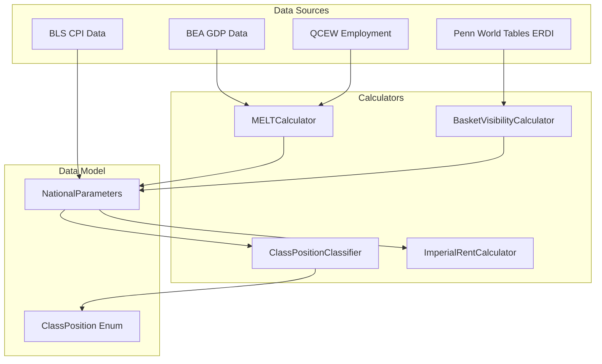

# Data Model: MELT and Basket Visibility Computation

**Feature**: 013-melt-basket-visibility | **Date**: 2026-02-01

## Entities

### ClassPosition (Enum)

Wage-based class position for imperial rent analysis.

```python
class ClassPosition(Enum):
    """Three-category wage-based class position.

    Scope limitation: This classification is wage-based only. It classifies
    workers by their wage relative to value thresholds. It cannot identify:
    - Bourgeoisie (non-wage income from capital ownership)
    - Lumpen (excluded from production entirely)

    Note: Subproletariat ≠ Lumpen. A subproletarian is *working* but paid
    below reproduction cost. A lumpen is *excluded* from wage labor entirely.
    """
    LABOR_ARISTOCRACY = auto()  # W > τ_effective, Φ_hour > 0
    PROLETARIAT = auto()         # τ_effective ≥ W > V_reproduction
    SUBPROLETARIAT = auto()      # W ≤ V_reproduction
```

| Position | Condition | Φ_hour | Description |
|----------|-----------|--------|-------------|
| LABOR_ARISTOCRACY | W > τ_effective | > 0 | Net extractor of peripheral labor |
| PROLETARIAT | τ_effective ≥ W > V_reproduction | ≤ 0 | Exploited but self-reproducing |
| SUBPROLETARIAT | W ≤ V_reproduction | << 0 | Working but below reproduction cost |

### NationalParameters (Frozen Pydantic Model)

Immutable container holding annual parameters for class position analysis.

```python
class NationalParameters(BaseModel):
    """Annual national parameters for class position determination.

    Immutable: Parameters are point-in-time snapshots. Once computed for a
    year, they should not change during a simulation run. This enables
    caching and ensures consistent calculations across all consumers.

    All monetary values are in current-year dollars (not inflation-adjusted)
    per TSSI (Temporal Single-System Interpretation).
    """
    model_config = ConfigDict(frozen=True)

    year: int = Field(..., ge=2010, le=2030, description="Calendar year")
    tau: float = Field(..., gt=0, description="MELT in $/labor-hour")
    alpha: float = Field(..., ge=0, le=1, description="Import share of consumption")
    gamma_import: float = Field(..., gt=0, le=1, description="Weighted avg peripheral visibility")
    gamma_basket: float = Field(..., gt=0, le=1, description="Basket visibility coefficient")
    tau_effective: float = Field(..., gt=0, description="Labor aristocracy threshold in $/hour")
    v_reproduction: float = Field(..., gt=0, description="Subsistence floor in $/hour")
    estimated: bool = Field(default=False, description="True if using MVP hardcoded values")
```

**Field Semantics**:

| Field | Units | Source | Notes |
|-------|-------|--------|-------|
| year | calendar year | input | 2010-2024 data range |
| tau | $/labor-hour | BEA GDP / (QCEW employment × 2080) | National MELT |
| alpha | dimensionless [0,1] | Census trade data | Import share |
| gamma_import | dimensionless (0,1] | Penn World Tables ERDI | Peripheral visibility |
| gamma_basket | dimensionless (0,1] | 1/(α/γ_import + (1-α)) | Basket visibility |
| tau_effective | $/labor-hour | τ × γ_basket | LA threshold |
| v_reproduction | $/labor-hour | $12 (2024) adjusted by CPI | Subsistence floor |
| estimated | boolean | computation mode | MVP flag |

### MELTCalculator (Service)

Service that computes national MELT τ[year] from BEA GDP and QCEW employment.

```python
class MELTCalculator(Protocol):
    """Protocol for MELT computation service.

    Computes τ = GDP / L where L = employment × 2080 hours/year.
    """

    def get_melt(self, year: int) -> float | NoDataSentinel:
        """Compute national MELT for a given year.

        Args:
            year: Calendar year (2010-2024)

        Returns:
            τ in $/labor-hour, or NoDataSentinel if data unavailable

        Raises:
            ValueError: If year outside valid range
        """
        ...

    def validate_melt(self, tau: float) -> tuple[bool, str | None]:
        """Validate MELT against sanity ranges.

        Args:
            tau: MELT value to validate

        Returns:
            (valid, warning_message) - valid is False if outside fail range
        """
        ...
```

### BasketVisibilityCalculator (Service)

Service that computes γ_basket[year] from import shares and ERDI data.

```python
class BasketVisibilityCalculator(Protocol):
    """Protocol for basket visibility computation service.

    Computes γ_basket = 1 / (α/γ_import + (1-α)) per TVT Axiom D3.
    Supports MVP mode with hardcoded γ_basket = 0.68.
    """

    def get_gamma_basket(
        self,
        year: int,
        alpha: float | None = None,
        gamma_import: float | None = None,
    ) -> tuple[float, bool]:
        """Compute basket visibility for a given year.

        Args:
            year: Calendar year
            alpha: Import share (optional, uses data source if None)
            gamma_import: Peripheral visibility (optional, uses data source if None)

        Returns:
            (γ_basket, estimated) where estimated=True if using MVP fallback
        """
        ...

    @property
    def mvp_gamma_basket(self) -> float:
        """MVP hardcoded value: 0.68"""
        ...
```

### ClassPositionClassifier (Service)

Service that classifies wage rates into class positions.

```python
class ClassPositionClassifier(Protocol):
    """Protocol for class position classification service.

    Classifies wages into LABOR_ARISTOCRACY, PROLETARIAT, or SUBPROLETARIAT
    based on NationalParameters thresholds.
    """

    def classify(self, wage: float, params: NationalParameters) -> ClassPosition:
        """Classify a wage rate into class position.

        Args:
            wage: Hourly wage in $/hour
            params: National parameters containing thresholds

        Returns:
            ClassPosition enum value
        """
        ...

    def classify_distribution(
        self,
        wages: Sequence[float],
        params: NationalParameters,
    ) -> dict[ClassPosition, float]:
        """Classify a wage distribution into class position shares.

        Args:
            wages: Sequence of hourly wages
            params: National parameters containing thresholds

        Returns:
            Dict mapping ClassPosition to share [0, 1], summing to 1.0
        """
        ...
```

### ImperialRentCalculator (Service)

Service that computes imperial rent metrics for individual workers (TVT formulas).

```python
class ImperialRentCalculator(Protocol):
    """Protocol for imperial rent computation service (TVT Axioms E3-E4).

    Computes:
    - Φ_hour = (W/τ) × (1/γ_basket) - 1 (imperial rent per hour)
    - L_commanded = (W/τ) × (1/γ_basket) (labor hours commanded)
    """

    def compute_phi_hour(self, wage: float, params: NationalParameters) -> float:
        """Compute imperial rent per hour worked.

        Args:
            wage: Hourly wage in $/hour
            params: National parameters

        Returns:
            Φ_hour in labor-hours extracted per hour worked (can be negative)
        """
        ...

    def compute_labor_commanded(self, wage: float, params: NationalParameters) -> float:
        """Compute labor hours commanded per hour worked.

        Args:
            wage: Hourly wage in $/hour
            params: National parameters

        Returns:
            L_commanded in labor-hours per hour worked (always ≥ 0)
        """
        ...

    def is_labor_aristocracy(self, wage: float, params: NationalParameters) -> bool:
        """Check if wage qualifies for labor aristocracy.

        Labor aristocracy iff L_commanded > 1, i.e., commands more labor
        than they expend.

        Args:
            wage: Hourly wage in $/hour
            params: National parameters

        Returns:
            True if L_commanded > 1 (equivalently, W > τ_effective)
        """
        ...
```

## Relationships



## State Transitions

`NationalParameters` is immutable - no state transitions. Parameters are computed once per year and cached.

`ClassPosition` is determined by comparing wage to thresholds:

```
W > τ_effective       → LABOR_ARISTOCRACY
τ_effective ≥ W > V_reproduction → PROLETARIAT
W ≤ V_reproduction    → SUBPROLETARIAT
```

## Validation Rules

### NationalParameters Validation

1. **year**: Must be in range [2010, 2030]
2. **tau**: Must be > 0; warning if outside [40, 100]; fail if outside [20, 200]
3. **alpha**: Must be in [0, 1]
4. **gamma_import**: Must be in (0, 1]
5. **gamma_basket**: Must be in (0, 1]; capped at 1.0 if computed > 1.0
6. **tau_effective**: Must be > 0; should equal tau × gamma_basket
7. **v_reproduction**: Must be > 0; should be ~$12 (2024 dollars) adjusted by CPI
8. **Theoretical constraint**: v_reproduction < tau_effective (log warning if violated)

### Wage Classification Validation

1. **wage**: Must be ≥ 0 (negative wages are invalid)
2. **Classification completeness**: All wages must map to exactly one ClassPosition
3. **Share summation**: classify_distribution shares must sum to 1.0 (within floating-point tolerance)

## Caching Strategy

### NationalParameters Cache

- **Key**: `year: int`
- **Value**: `NationalParameters | NoDataSentinel`
- **Invalidation**: Clear entire cache when configuration changes (e.g., different δ or MVP mode toggle)
- **Lifetime**: Session-scoped (cache cleared on engine restart)

```python
class NationalParametersCache:
    def __init__(self):
        self._cache: dict[int, NationalParameters | NoDataSentinel] = {}

    def get(self, year: int) -> NationalParameters | NoDataSentinel | None:
        return self._cache.get(year)

    def set(self, year: int, params: NationalParameters | NoDataSentinel) -> None:
        self._cache[year] = params

    def clear(self) -> None:
        self._cache.clear()
```
