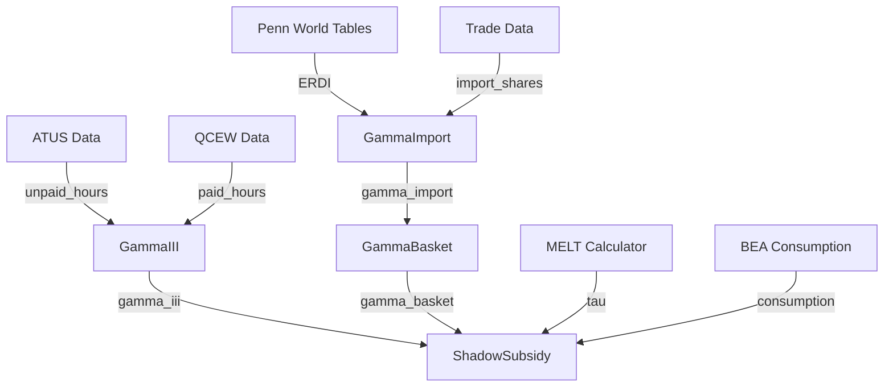

# Data Model: Gamma (Visibility) Tensor

**Feature**: 015-gamma-visibility-tensor
**Date**: 2026-02-04

## Overview

This document defines the Pydantic models for the Gamma (γ) Visibility Tensor.

## Core Types

### GammaIII

Reproductive labor visibility coefficient.

```python
class GammaIII(BaseModel, frozen=True):
    """Reproductive labor visibility (γ_III).

    Measures fraction of care labor that is commodified (visible to price system)
    versus naturalized as unpaid household work (invisible).

    Formula: γ_III = L_paid_care / (L_paid_care + L_unpaid_care)

    Theoretical Range: [0.0, 1.0]
    Expected Range: [0.20, 0.40] for US national aggregate

    TVT Axiom Reference:
        - I.5 Department III (Constitution)
        - Fortunati, "Arcane of Reproduction" (1981)
    """

    year: int = Field(..., ge=2003, le=2030, description="Calendar year")
    paid_care_hours: float = Field(
        ..., ge=0.0, description="Annual paid care hours (billions)"
    )
    unpaid_care_hours: float = Field(
        ..., ge=0.0, description="Annual unpaid care hours (billions)"
    )
    gamma_iii: float = Field(
        ..., ge=0.0, le=1.0, description="Visibility coefficient"
    )
    fortunati_exploitation: float = Field(
        ..., ge=0.0, description="Fortunati exploitation rate: (1 - γ_III) / γ_III"
    )
    is_estimated: bool = Field(
        default=False, description="True if using estimated/default values"
    )
```

**Validation Rules**:
- `year`: Must be 2003+ (ATUS availability)
- `gamma_iii`: Constrained to [0.0, 1.0]
- `fortunati_exploitation`: Always ≥ 0 (can be very large if γ_III is small)

**Computed Fields**:
- `gamma_iii = paid_care_hours / (paid_care_hours + unpaid_care_hours)`
- `fortunati_exploitation = (1 - gamma_iii) / gamma_iii` (if γ_III > 0)

---

### GammaImport

International import visibility coefficient.

```python
class GammaImport(BaseModel, frozen=True):
    """International import visibility (γ_import).

    Measures weighted-average visibility of imported goods based on ERDI
    (Exchange Rate Deviation Index) differentials.

    Formula: γ_import = Σ(import_share[origin] × 1/ERDI[origin])

    Theoretical Range: (0.0, 1.0]
    Expected Range: [0.40, 0.70] for US import basket

    TVT Axiom Reference:
        - C1: ERDI = GDP_PPP / GDP_MER
        - Emmanuel-Amin unequal exchange theory
    """

    year: int = Field(..., ge=2000, le=2030, description="Reference year")
    import_shares: dict[str, float] = Field(
        ..., description="Country code -> import share [0, 1]"
    )
    erdi_values: dict[str, float] = Field(
        ..., description="Country code -> ERDI (>= 1.0 for periphery)"
    )
    gamma_import: float = Field(
        ..., gt=0.0, le=1.0, description="Weighted average import visibility"
    )
    is_mvp: bool = Field(
        default=True, description="True if using hardcoded MVP values"
    )
```

**Validation Rules**:
- `import_shares`: Must sum to 1.0 ± 0.01
- `erdi_values`: All values must be > 0 (typically ≥ 1.0)
- `gamma_import`: Constrained to (0.0, 1.0]

**Example**:
```python
GammaImport(
    year=2022,
    import_shares={"CHN": 0.18, "MEX": 0.14, "CAN": 0.13, ...},
    erdi_values={"CHN": 1.80, "MEX": 1.50, "CAN": 1.10, ...},
    gamma_import=0.65,
    is_mvp=True,
)
```

---

### GammaBasket

Composite consumption basket visibility.

```python
class GammaBasket(BaseModel, frozen=True):
    """Composite basket visibility (γ_basket).

    Combines domestic (γ=1) and imported (γ=γ_import) goods into
    weighted-average basket visibility using harmonic mean.

    Formula: γ_basket = 1 / (α/γ_import + (1-α))

    Theoretical Range: [γ_import, 1.0]
    Expected Range: [0.60, 0.85] for US consumption basket

    TVT Axiom Reference:
        - D3: Basket visibility derivation
        - D4: τ_effective = τ × γ_basket
    """

    year: int = Field(..., ge=2000, le=2030, description="Reference year")
    alpha: float = Field(
        ..., ge=0.0, le=1.0, description="Import share of consumption"
    )
    gamma_import: float = Field(
        ..., gt=0.0, le=1.0, description="From GammaImport calculation"
    )
    gamma_basket: float = Field(
        ..., gt=0.0, le=1.0, description="Composite basket visibility"
    )
```

**Edge Cases**:
- `alpha = 0`: γ_basket = 1.0 (all domestic)
- `alpha = 1`: γ_basket = γ_import (all imports)

**Validation Rules**:
- `gamma_basket >= gamma_import` always (domestic is more visible than imports)
- `gamma_basket <= 1.0` always

---

### ShadowSubsidy

Shadow subsidy calculations.

```python
class ShadowSubsidy(BaseModel, frozen=True):
    """Shadow subsidy value transfers (Φ_III, Φ_imperial).

    Quantifies hidden value transfers from:
    1. Reproductive labor naturalization (Φ_III)
    2. Imperial compression of peripheral labor (Φ_imperial)

    Formulas:
        Φ_III = (1 - γ_III) × L_unpaid × τ
        Φ_imperial = (1 - γ_basket) × Consumption

    Expected Magnitudes:
        Φ_III: $1.5-3.5 trillion/year
        Φ_imperial: $1.0-4.0 trillion/year

    TVT Axiom Reference:
        - I.2 Imperial Rent (Constitution)
        - I.5 Department III (Constitution)
    """

    year: int = Field(..., ge=2000, le=2030, description="Reference year")

    # Reproductive shadow subsidy
    phi_iii_dollars: float | None = Field(
        default=None, ge=0.0, description="Φ_III in dollars (if MELT available)"
    )
    phi_iii_labor_hours: float = Field(
        ..., ge=0.0, description="Φ_III in labor-hours (always available)"
    )

    # Imperial shadow subsidy
    phi_imperial: float = Field(
        ..., ge=0.0, description="Φ_imperial in dollars"
    )

    # Combined
    total_shadow_dollars: float | None = Field(
        default=None, ge=0.0, description="Φ_III + Φ_imperial (if both available)"
    )

    # Metadata
    melt_available: bool = Field(
        default=False, description="Whether MELT was available for conversion"
    )
```

**Validation Rules**:
- If `melt_available=True`, `phi_iii_dollars` must be set
- `total_shadow_dollars = phi_iii_dollars + phi_imperial` when MELT available

---

### ERDIData

Exchange Rate Deviation Index reference data.

```python
class ERDIData(BaseModel, frozen=True):
    """ERDI (Exchange Rate Deviation Index) by country.

    ERDI = GDP_PPP / GDP_MER

    Interpretation:
        - ERDI = 1.0: Core country (market rates reflect purchasing power)
        - ERDI > 1.0: Periphery (currency undervalued, labor compressed)
        - ERDI = 2.0: Typical periphery (labor worth 50% of nominal)

    Source: Penn World Tables 10.01 (2019 reference year)
    """

    country_code: str = Field(
        ..., min_length=2, max_length=3, description="ISO country code"
    )
    country_name: str = Field(..., description="Full country name")
    erdi: float = Field(..., gt=0.0, description="ERDI value")
    reference_year: int = Field(..., ge=2000, le=2030, description="Data year")
    source: str = Field(
        default="Penn World Tables 10.01",
        description="Data source citation"
    )
```

**MVP Constants**:
```python
MVP_ERDI_VALUES: dict[str, ERDIData] = {
    "CHN": ERDIData(country_code="CHN", country_name="China", erdi=1.80, reference_year=2019),
    "MEX": ERDIData(country_code="MEX", country_name="Mexico", erdi=1.50, reference_year=2019),
    "CAN": ERDIData(country_code="CAN", country_name="Canada", erdi=1.10, reference_year=2019),
    "VNM": ERDIData(country_code="VNM", country_name="Vietnam", erdi=2.50, reference_year=2019),
    "DEU": ERDIData(country_code="DEU", country_name="Germany", erdi=1.00, reference_year=2019),
    "JPN": ERDIData(country_code="JPN", country_name="Japan", erdi=1.00, reference_year=2019),
    "KOR": ERDIData(country_code="KOR", country_name="South Korea", erdi=1.10, reference_year=2019),
    "IND": ERDIData(country_code="IND", country_name="India", erdi=2.80, reference_year=2019),
    "TWN": ERDIData(country_code="TWN", country_name="Taiwan", erdi=1.20, reference_year=2019),
}

# Fallback values for countries not in MVP list
CORE_DEFAULT_ERDI = 1.0
PERIPHERY_DEFAULT_ERDI = 2.0
```

---

## Entity Relationships



## Validation Ranges Summary

| Type | Field | Expected | Warning | Fail |
|------|-------|----------|---------|------|
| GammaIII | gamma_iii | [0.20, 0.40] | [0.10, 0.50] | <0 or >1 |
| GammaImport | gamma_import | [0.40, 0.70] | [0.30, 0.80] | ≤0 or >1 |
| GammaBasket | gamma_basket | [0.60, 0.85] | [0.40, 0.95] | ≤0 or >1 |
| ShadowSubsidy | phi_iii_dollars | $1.5-3.5T | $0.5-5.0T | <0 |
| ShadowSubsidy | phi_imperial | $1.0-4.0T | $0.5-6.0T | <0 |
