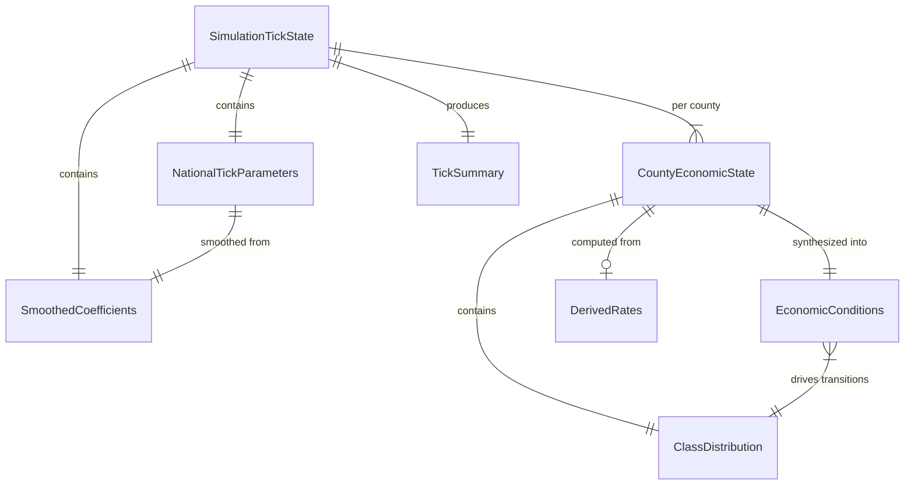
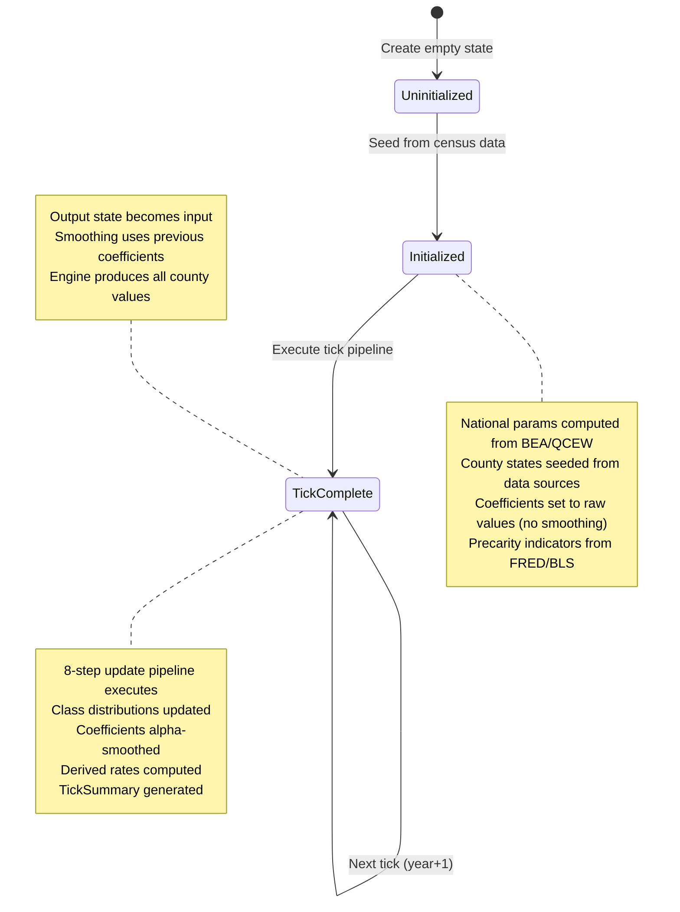
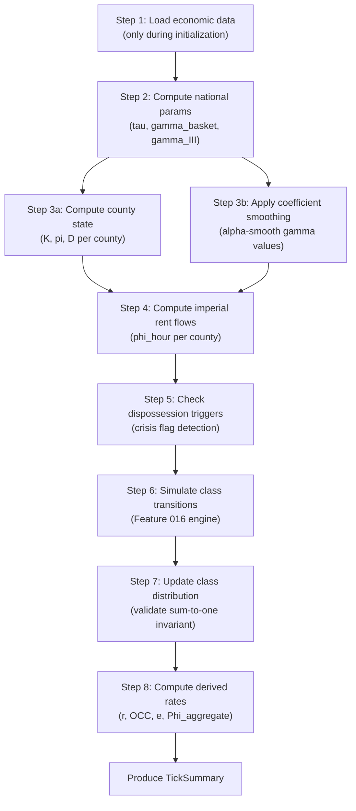
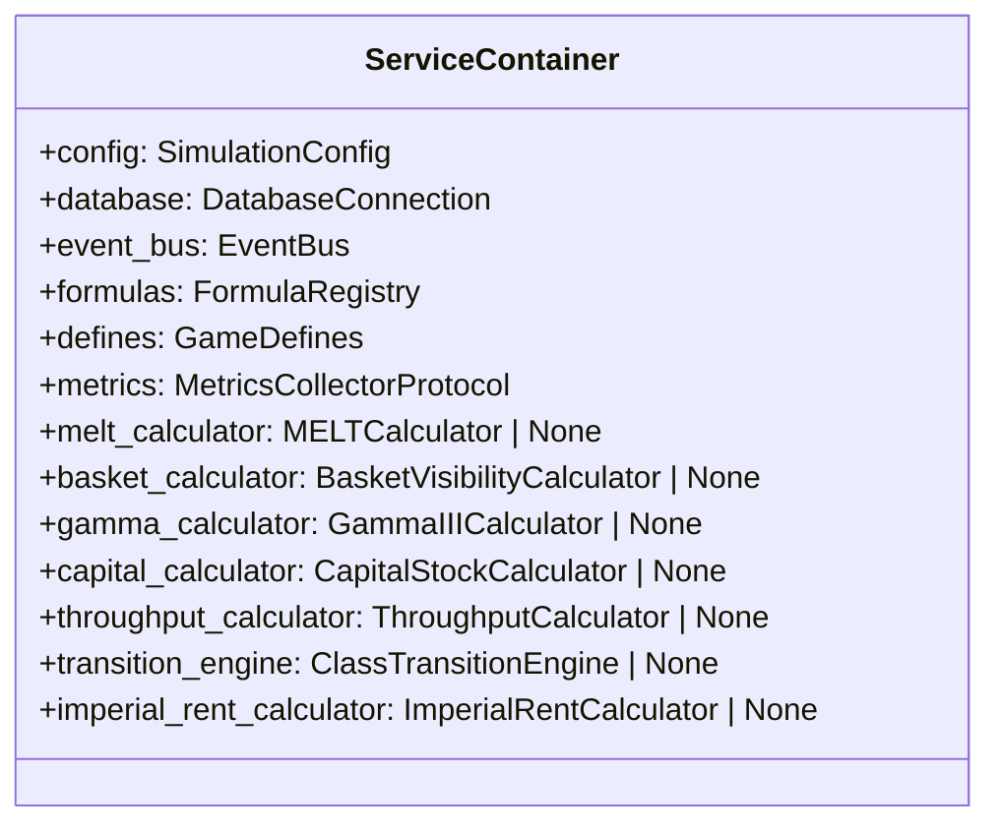

# Data Model: Simulation Tick Dynamics (Feature 017)

**Date**: 2026-02-06
**Feature**: 017-simulation-tick-dynamics

## Entity Relationship Overview



## Entities

### SimulationTickState (Root Entity)

Complete simulation state at a point in time. Pure data container, immutable. Serves as both output of tick t and input to tick t+1.

| Field | Type | Constraint | Description |
|-------|------|-----------|-------------|
| year | int | ge=2007, le=2040 | Current simulation year |
| national_params | NationalTickParameters | required | Year-scoped national context |
| county_states | dict[str, CountyEconomicState] | keys are 5-char FIPS | Per-county snapshots |
| coefficients | SmoothedCoefficients | required | Alpha-smoothed coefficient history |
| tick_summary | TickSummary or None | optional | Aggregate stats (populated after tick completes) |

**Invariants**:
- All county FIPS keys are 5-character strings
- county_states keys match CountyEconomicState.fips values
- year increments by 1 between consecutive ticks

### NationalTickParameters

Year-scoped national economic context computed once per tick, shared by all counties. Extends existing NationalParameters (Feature 013) with smoothed variants and gamma_III.

| Field | Type | Constraint | Description |
|-------|------|-----------|-------------|
| year | int | ge=2007, le=2040 | Parameter year |
| tau | float | gt=0 | National MELT ($/labor-hour) |
| gamma_basket | float | gt=0, le=1 | Basket visibility (smoothed) |
| gamma_basket_raw | float | gt=0, le=1 | Basket visibility (raw computed) |
| gamma_III | float | gt=0, le=1 | Reproductive visibility (smoothed) |
| gamma_III_raw | float | gt=0, le=1 | Reproductive visibility (raw computed) |
| tau_effective | float | gt=0 | Effective MELT = tau x gamma_basket |
| v_reproduction | float | gt=0 | Subsistence cost ($/hour) |
| estimated | bool | | True if using MVP hardcoded values |

**Derivation rules**:
- `tau` = GDP / (national_employment x 2080), from MELTCalculator
- `gamma_basket` = smoothed(raw, previous, alpha), from BasketVisibilityCalculator
- `gamma_III` = smoothed(raw, previous, alpha), from GammaIIICalculator
- `tau_effective` = tau x gamma_basket (computed, not stored independently)

### CountyEconomicState

Per-county per-year economic snapshot. During initialization, fields are seeded from census data. During simulation ticks, fields are computed by the engine.

| Field | Type | Constraint | Description |
|-------|------|-----------|-------------|
| fips | str | len=5 | County FIPS code |
| year | int | ge=2007, le=2040 | State year |
| capital_stock | float | ge=0 | Capital stock K (from Feature 012) |
| throughput_position | float | gt=0 | Pi = tau_through / tau_national (from Feature 014) |
| supply_chain_depth | float | ge=0, le=5 | Average supply chain depth D |
| unemployment_rate | float | ge=0, le=1 | County unemployment (U-3 proxy) |
| u6_rate | float | ge=0, le=1 | Broad unemployment (U-6) |
| pter_rate | float | ge=0, le=1 | Part-time for economic reasons |
| nilf_rate | float | ge=0, le=1 | Not in labor force rate |
| median_wage | float | ge=0 | County median hourly wage |
| employment | float | ge=0 | Total county employment (used in Phi_aggregate annualization) |
| class_distribution | ClassDistribution | required | Five-class share distribution |
| phi_hour | float | ge=0 | Imperial rent per hour (from Feature 013) |
| crisis | bool | | Crisis flag for this county-year |

**Source distinction**:
- **Initialization**: capital_stock from CapitalStockCalculator, throughput from ThroughputCalculator, precarity from FRED/BLS, wages from QCEW
- **Simulation**: All fields computed from prior tick state + transition engine outputs

### SmoothedCoefficients

Container for alpha-smoothed coefficients that persist across ticks.

| Field | Type | Constraint | Description |
|-------|------|-----------|-------------|
| alpha | float | gt=0, le=1 | Smoothing parameter |
| gamma_basket | float | gt=0, le=1 | Current smoothed basket visibility |
| gamma_III | float | gt=0, le=1 | Current smoothed reproductive visibility |
| gamma_import | float | gt=0, le=1 | Current smoothed import visibility |
| is_initialized | bool | | False until first tick completes |

**Update rule**: `value[t] = value[t-1] + alpha * (raw[t] - value[t-1])`
- First tick: `value[0] = raw[0]` (no smoothing applied)
- Subsequent ticks: exponential moving average

### TickSummary

Aggregate statistics for a completed tick. Read-only output.

| Field | Type | Constraint | Description |
|-------|------|-----------|-------------|
| year | int | ge=2007, le=2040 | Tick year |
| counties_processed | int | ge=0 | Number of counties computed |
| phi_aggregate | float | ge=0 | Total national imperial rent |
| national_melt | float | gt=0 | National MELT (tau) |
| mean_profit_rate | float | | Average profit rate across counties |
| mean_occ | float | ge=0 | Average organic composition |
| mean_exploitation_rate | float | ge=0 | Average exploitation rate |
| national_class_distribution | dict[str, float] | | Weighted-average class shares |

### DerivedRates

Per-county derived economic indicators computed from updated state. Read-only output.

| Field | Type | Constraint | Description |
|-------|------|-----------|-------------|
| fips | str | len=5 | County FIPS code |
| year | int | ge=2007, le=2040 | Rate year |
| profit_rate | float or None | | r = s / (K + v), None if K unavailable or if K=0 and v=0 (division by zero) |
| organic_composition | float or None | ge=0 | OCC = c / v, None if v=0 (division by zero) or data unavailable |
| exploitation_rate | float or None | ge=0 | e = s / v, None if v=0 (division by zero) or data unavailable |
| phi_hour | float | ge=0 | Imperial rent per labor-hour |

**Division-by-zero handling**: All rate fields use `Optional[float]`. None indicates a mathematically undefined result (e.g., `v=0` makes OCC and exploitation rate undefined). This is distinct from `NoDataSentinel`, which indicates data unavailability during initialization mode. During simulation ticks, None for a derived rate is a valid mathematical outcome, not an error.

## State Transition Diagram



## Tick Pipeline Execution DAG



## Reused Entities (from Feature 012-016)

These existing entities are consumed but not modified by Feature 017:

- **ClassDistribution** (Feature 016): Five-class frozen model with `with_updated_dynamics()` method
- **EconomicConditions** (Feature 016): Frozen model consumed by ClassTransitionEngine
- **TransitionRates** (Feature 016): Four-pathway transition rates
- **NationalParameters** (Feature 013): Base national parameters (Feature 017's NationalTickParameters extends this)
- **ValueTensor4x3** (Feature 011): County-year value tensor
- **DerivedTensorMetrics** (Feature 012): Capital stock, profit rate, OCC
- **ThroughputMetrics** (Feature 014): Throughput position and supply chain depth
- **GammaIII** (Feature 015): Reproductive visibility ratio
- **NoDataSentinel**: Unavailability indicator (used only during initialization mode)

## Graph Integration (Engine System Bridge)

The TickDynamicsSystem stores its state in the shared NetworkX graph so that downstream Systems in the materialist causality chain can consume it.

### Territory Node Attributes (county-level state)

Territory nodes with FIPS codes carry county economic state as node attributes:

| Attribute | Type | Source Step | Description |
|-----------|------|-------------|-------------|
| `tick_capital_stock` | float | Step 3a | Capital stock K |
| `tick_throughput_position` | float | Step 3a | Throughput pi |
| `tick_supply_chain_depth` | float | Step 3a | Supply chain depth D |
| `tick_phi_hour` | float | Step 4 | Imperial rent per hour |
| `tick_crisis` | bool | Step 5 | Crisis flag |
| `tick_class_distribution` | dict | Step 7 | Five-class share distribution |
| `tick_unemployment_rate` | float | Step 7 | County unemployment |
| `tick_median_wage` | float | Step 7 | County median wage |
| `tick_profit_rate` | float or None | Step 8 | Derived profit rate r |
| `tick_occ` | float or None | Step 8 | Organic composition of capital |
| `tick_exploitation_rate` | float or None | Step 8 | Exploitation rate e |

Attribute names are prefixed with `tick_` to distinguish from existing Territory attributes.

### Graph Metadata (national-level state)

National parameters and tick summary are stored in `graph.graph["tick_dynamics"]`:

```python
graph.graph["tick_dynamics"] = {
    "year": int,                          # Current simulation year
    "national_params": NationalTickParameters,  # National economic context
    "coefficients": SmoothedCoefficients,       # Alpha-smoothed coefficients
    "tick_summary": TickSummary,                # Aggregate statistics
    "is_year_boundary": bool,                   # Whether this tick ran the pipeline
}
```

### Extended ServiceContainer


