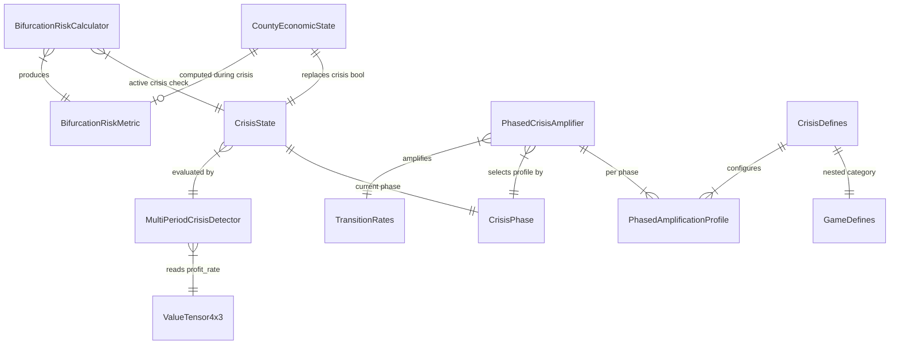
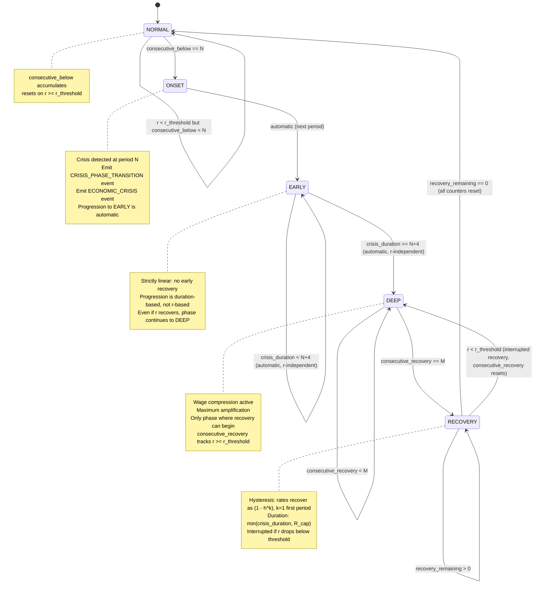
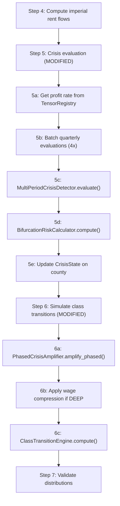

# Data Model: Crisis and Devaluation Mechanics (Feature 018)

**Date**: 2026-02-06
**Feature**: 018-crisis-devaluation-mechanics

## Entity Relationship Overview



## New Entities

### CrisisPhase (Enum)

Lifecycle phases for a county-level economic crisis. Each phase carries distinct amplification behavior.

| Value | Description | Duration |
|-------|-------------|----------|
| NORMAL | No active crisis | N/A |
| ONSET | Crisis just detected (period N) | 1 period |
| EARLY | Periods N+1 through N+4 | Up to 4 periods |
| DEEP | Period N+5 onward | Unbounded |
| RECOVERY | Profit rate above threshold for M periods | min(crisis_duration, R_cap) |

**Type**: `StrEnum` (follows existing `EventType` pattern in `babylon.models.enums`)

**Invariant**: Transitions follow the state machine in the State Transition Diagram below. No arbitrary phase jumps.

### CrisisState (Frozen Pydantic Model)

Replaces `crisis: bool` on `CountyEconomicState`. Tracks the full crisis lifecycle for one county.

| Field | Type | Constraint | Description |
|-------|------|-----------|-------------|
| phase | CrisisPhase | required | Current lifecycle phase |
| consecutive_below | int | ge=0 | Consecutive periods with r < r_threshold |
| consecutive_recovery | int | ge=0 | Consecutive periods with r >= r_threshold during recovery |
| crisis_start_period | int or None | ge=0 | Period when crisis was first detected (None if NORMAL) |
| crisis_duration | int | ge=0 | Total periods in crisis (onset through deep) |
| peak_severity | float or None | | Lowest profit rate observed during this crisis episode |
| cumulative_wage_compression | float | ge=0, le=1 | Total wage compression applied (0 = none, 1 = fully compressed) |

**Factory method**: `CrisisState.normal()` returns the default NORMAL state (all counters zero).

**Invariants**:
- When `phase == NORMAL`: `consecutive_below == 0`, `consecutive_recovery == 0`, `crisis_start_period is None`, `crisis_duration == 0`, `peak_severity is None`, `cumulative_wage_compression == 0.0`. This invariant is enforced on every transition to NORMAL (counter reset).
- When `phase == RECOVERY`: `consecutive_recovery >= 1`
- `cumulative_wage_compression` only increases during DEEP phase
- **Interrupted recovery** (RECOVERY → DEEP): `consecutive_recovery` resets to 0, `crisis_duration` and `cumulative_wage_compression` carry forward from pre-recovery values, `peak_severity` may update if new profit rate is lower than previous peak.

**Constitution II.2 Justification**: CrisisState contains accumulated temporal state (the consecutive-period counter, crisis duration) that depends on history and cannot be recomputed from current-tick primitives. Analogous to `SmoothedCoefficients` (also accumulated/persisted). This is NOT a derived quantity.

### BifurcationRiskMetric (Frozen Pydantic Model)

Political trajectory indicator computed during active crisis periods. Consumed by ConsciousnessSystem and StruggleSystem.

| Field | Type | Constraint | Description |
|-------|------|-----------|-------------|
| score | float | ge=-1, le=1 | Bifurcation direction: -1 revolutionary, +1 fascist |
| solidarity_density | float | ge=0, le=1 | Cross-class solidarity edge fraction |
| legitimation | float | ge=0, le=1 | 1 - mean(agitation) across county nodes |
| class_burden_ratio | float | ge=0, le=1 | Clamped LA loss / proletariat loss ratio |

**Default** (non-crisis): `BifurcationRiskMetric(score=0.0, solidarity_density=0.0, legitimation=1.0, class_burden_ratio=0.0)`

**Formula** (FR-011):
```
raw_score = -w_s * solidarity_density + w_b * class_burden_ratio
dampened_score = raw_score * (1 - legitimation)
score = clamp(dampened_score, -1, +1)
```

**Constitution II.2 Justification**: The metric is computed at quarterly cadence but consumed at weekly tick resolution. Inputs (solidarity density, legitimation, class burden) may change between evaluations, so the metric cannot be recomputed from current primitives at consumption time. It is a recorded measurement, not a derivation.

### PhasedAmplificationProfile (Frozen Pydantic Model)

Per-phase multiplier set for transition rate amplification.

| Field | Type | Constraint | Description |
|-------|------|-----------|-------------|
| dispossession_multiplier | float | gt=0 | LA -> Proletariat multiplier |
| precaritization_multiplier | float | gt=0 | Proletariat -> Lumpen multiplier |
| accumulation_multiplier | float | gt=0, le=1 | Proletariat -> LA multiplier |
| stabilization_multiplier | float | gt=0, le=1 | Lumpen -> Proletariat multiplier |

**Default profiles** (FR-006):

| Phase | Dispossession | Precaritization | Accumulation | Stabilization |
|-------|--------------|-----------------|--------------|---------------|
| NORMAL | 1.0 | 1.0 | 1.0 | 1.0 |
| ONSET | 1.2 | 1.5 | 0.8 | 0.7 |
| EARLY | 1.8 | 2.5 | 0.4 | 0.4 |
| DEEP | 3.0 | 3.5 | 0.1 | 0.2 |
| RECOVERY | 1.3 | 1.2 | 0.6 | 0.5 |

### CrisisDefines (Frozen Pydantic Model)

New `crisis` category in GameDefines (FR-023). All configurable crisis parameters.

| Field | Type | Default | Description |
|-------|------|---------|-------------|
| crisis_period_ticks | int | 13 | Ticks per crisis evaluation period |
| r_threshold | float | 0.05 | Profit rate threshold for crisis |
| n_consecutive | int | 3 | Periods below threshold to trigger crisis |
| m_recovery | int | 2 | Periods above threshold to enter recovery |
| r_cap | int | 8 | Maximum recovery duration (periods) |
| hysteresis_coefficient | float | 0.5 | Recovery rate dampening (h) |
| wage_compression_rate | float | 0.02 | Per-period wage reduction in deep crisis |
| wage_compression_floor_ratio | float | 0.8 | Floor as fraction of subsistence cost |
| bifurcation_solidarity_weight | float | 1.0 | w_s in bifurcation formula |
| bifurcation_burden_weight | float | 1.0 | w_b in bifurcation formula |
| class_burden_epsilon | float | 0.001 | Division-by-zero guard in burden ratio |
| bifurcation_event_threshold | float | 0.5 | |score| >= threshold emits BIFURCATION_THRESHOLD event |
| dispossession_cascade_milestones | list[float] | [0.05, 0.10, 0.15] | LA share decline milestones for DISPOSSESSION_CASCADE events |
| profiles | dict[CrisisPhase, PhasedAmplificationProfile] | FR-006 table | Per-phase multipliers |

**Location**: `GameDefines.crisis` (new field on existing `GameDefines` in `babylon.config.defines`)

## Modified Entities

### CountyEconomicState (Feature 017 - Modified)

Replace `crisis: bool` field with structured crisis state and bifurcation metric.

| Change | Old | New |
|--------|-----|-----|
| Replace field | `crisis: bool = False` | `crisis_state: CrisisState = CrisisState.normal()` |
| Add field | (none) | `bifurcation_risk: BifurcationRiskMetric = BifurcationRiskMetric.neutral()` |

**Backward compatibility**: Code reading `county.crisis` must migrate to `county.crisis_state.phase != CrisisPhase.NORMAL`. The `EconomicConditions.crisis` boolean field is derived from `crisis_state` at Step 6 synthesis time.

### EconomicConditions (Feature 016 - Read-only)

The existing `crisis: bool` field on `EconomicConditions` remains boolean. It is derived from `CrisisState.phase != NORMAL` when constructing `EconomicConditions` in Step 6 of the pipeline.

No schema change to `EconomicConditions`.

### EventType (Enum - Extended)

Add three new values to the existing `EventType` StrEnum in `babylon.models.enums`:

| Value | Description |
|-------|-------------|
| CRISIS_PHASE_TRANSITION | County transitions between crisis phases |
| DISPOSSESSION_CASCADE | Cumulative crisis-driven class displacement milestone |
| BIFURCATION_THRESHOLD | Bifurcation risk crosses configurable threshold |

## Reused Entities (Not Modified)

- **TransitionRates** (Feature 016): Input/output of amplification. Four-pathway rate structure.
- **ClassDistribution** (Feature 016): Five-class share distribution. Sum-to-one invariant preserved.
- **ValueTensor4x3** (Feature 011): Source of flow-based profit rate `s/(c+v)`.
- **SmoothedCoefficients** (Feature 017): Pattern for accumulated temporal state.
- **NationalTickParameters** (Feature 017): National context (tau, gamma values).

## State Transition Diagram



## Graph Integration Changes

### Territory Node Attributes (Changes)

| Attribute | Old | New | Source Step |
|-----------|-----|-----|------------|
| `tick_crisis` | `bool` | **Remove** (replaced by crisis_state) | Step 5 |
| `tick_crisis_phase` | (new) | `str` (CrisisPhase.value) | Step 5 |
| `tick_crisis_duration` | (new) | `int` | Step 5 |
| `tick_bifurcation_score` | (new) | `float` | Step 5 |
| `tick_wage_compression` | (new) | `float` | Step 5 |

### Graph Metadata (Unchanged)

National-level state in `graph.graph["tick_dynamics"]` is unchanged. Crisis is county-level, not national.

## Pipeline Integration


