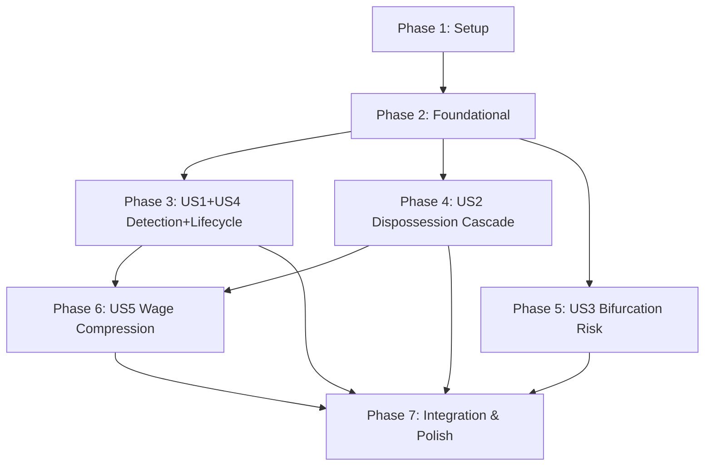

# Tasks: Crisis and Devaluation Mechanics

**Input**: Design documents from `/specs/018-crisis-devaluation-mechanics/`
**Prerequisites**: plan.md, spec.md, research.md, data-model.md, quickstart.md

**Tests**: TDD Red-Green-Refactor per project standards. Tests are written FIRST and MUST FAIL before implementation.

**Organization**: Tasks are grouped by user story to enable independent implementation and testing of each story.

## Format: `[ID] [P?] [Story] Description`

- **[P]**: Can run in parallel (different files, no dependencies)
- **[Story]**: Which user story this task belongs to (e.g., US1, US2, US3)
- Include exact file paths in descriptions

______________________________________________________________________

## Phase 1: Setup

**Purpose**: Branch creation and shared infrastructure verification

- [ ] T001 Create feature branch `018-crisis-devaluation-mechanics` from `dev`
- [ ] T002 Verify existing test suite passes (`poetry run pytest tests/unit/economics/ -v`)
- [ ] T003 [P] Create `src/babylon/economics/crisis/` package directory with `__init__.py`
- [ ] T004 [P] Create `tests/unit/economics/crisis/` test package directory with `conftest.py`

______________________________________________________________________

## Phase 2: Foundational (Blocking Prerequisites)

**Purpose**: Core types and configuration that ALL user stories depend on. No story work can begin until this phase is complete.

### Types and Enums

- [ ] T005 [P] Add `CrisisPhase` StrEnum (NORMAL, ONSET, EARLY, DEEP, RECOVERY) to `src/babylon/economics/tick/types.py` (FR-003, data-model.md CrisisPhase)
- [ ] T006 [P] Add 3 `EventType` values (CRISIS_PHASE_TRANSITION, DISPOSSESSION_CASCADE, BIFURCATION_THRESHOLD) to `src/babylon/models/enums.py` (FR-022, R8)
- [ ] T007 Add `PhasedAmplificationProfile` frozen Pydantic model to `src/babylon/economics/tick/types.py` with 4 multiplier fields: dispossession_multiplier (gt=0), precaritization_multiplier (gt=0), accumulation_multiplier (gt=0, le=1), stabilization_multiplier (gt=0, le=1) (FR-006, data-model.md)
- [ ] T008 Add `CrisisState` frozen Pydantic model to `src/babylon/economics/tick/types.py` with fields: phase, consecutive_below, consecutive_recovery, crisis_start_period, crisis_duration, peak_severity, cumulative_wage_compression. Include `CrisisState.normal()` factory method (data-model.md CrisisState)
- [ ] T009 Add `BifurcationRiskMetric` frozen Pydantic model to `src/babylon/economics/tick/types.py` with fields: score (ge=-1, le=1), solidarity_density (ge=0, le=1), legitimation (ge=0, le=1), class_burden_ratio (ge=0, le=1). Include `BifurcationRiskMetric.neutral()` factory method (FR-011, data-model.md)

### Configuration

- [ ] T010 Add `CrisisDefines` frozen Pydantic model to `src/babylon/config/defines.py` with all 12+ parameters from FR-023: crisis_period_ticks (13), r_threshold (0.05), n_consecutive (3), m_recovery (2), r_cap (8), hysteresis_coefficient (0.5), wage_compression_rate (0.02), wage_compression_floor_ratio (0.8), bifurcation_solidarity_weight (1.0), bifurcation_burden_weight (1.0), class_burden_epsilon (0.001), profiles (dict[CrisisPhase, PhasedAmplificationProfile] with FR-006 defaults)
- [ ] T011 Add `crisis: CrisisDefines` field to `GameDefines` in `src/babylon/config/defines.py` (FR-023)

### CountyEconomicState Migration

- [ ] T012 Replace `crisis: bool = False` with `crisis_state: CrisisState = CrisisState.normal()` on `CountyEconomicState` in `src/babylon/economics/tick/types.py` (R4, data-model.md Modified Entities)
- [ ] T013 Add `bifurcation_risk: BifurcationRiskMetric = BifurcationRiskMetric.neutral()` field to `CountyEconomicState` in `src/babylon/economics/tick/types.py` (FR-015, R6)

### Foundational Tests

- [ ] T014 [P] Write unit tests for CrisisPhase enum values and ordering in `tests/unit/economics/tick/test_types.py`
- [ ] T015 [P] Write unit tests for CrisisState model validation, `.normal()` factory, and invariants (phase=NORMAL implies counters zero) in `tests/unit/economics/tick/test_types.py`
- [ ] T016 [P] Write unit tests for BifurcationRiskMetric model validation, `.neutral()` factory, and clamping constraints in `tests/unit/economics/tick/test_types.py`
- [ ] T017 [P] Write unit tests for PhasedAmplificationProfile model validation (multiplier constraints) in `tests/unit/economics/tick/test_types.py`
- [ ] T018 [P] Write unit tests for CrisisDefines model with default profiles matching FR-006 table in `tests/unit/economics/test_defines.py` or appropriate location
- [ ] T019 Update existing tests that reference `CountyEconomicState.crisis` (bool) to use `crisis_state` field across `tests/unit/economics/tick/` and `tests/unit/economics/dynamics/` (backward compat migration)

**Checkpoint**: All types compile, all constraints validate, existing tests updated and passing. Foundation ready for story implementation.

______________________________________________________________________

## Phase 3: US1 + US4 - Crisis Detection + Phase Lifecycle (Priority: P1 + P2)

**Goal**: Replace `ThresholdCrisisDetector` with `MultiPeriodCrisisDetector` that tracks TRPF across consecutive periods and manages the full 5-phase lifecycle (NORMAL -> ONSET -> EARLY -> DEEP -> RECOVERY -> NORMAL).

**Rationale for combining US1 + US4**: US1 (detection) and US4 (lifecycle) are tightly coupled -- the detector IS the lifecycle manager. Implementing one without the other would require throwaway scaffolding.

**Independent Test**: Feed synthetic profit rate sequences into the detector and verify correct phase transitions, duration tracking, and counter behavior at each lifecycle stage.

### Tests (RED phase)

- [ ] T020 [P] [US1] Write acceptance tests for US1 AS1 (consecutive periods below threshold trigger crisis) in `tests/unit/economics/tick/test_multi_period_detector.py`
- [ ] T021 [P] [US1] Write acceptance tests for US1 AS2 (non-consecutive dips reset accumulator) in `tests/unit/economics/tick/test_multi_period_detector.py`
- [ ] T022 [P] [US1] Write acceptance tests for US1 AS3 (recovery after M consecutive above-threshold periods) in `tests/unit/economics/tick/test_multi_period_detector.py`
- [ ] T023 [P] [US1] Write acceptance tests for US1 AS4 (None profit rate neither counts toward nor resets accumulator) in `tests/unit/economics/tick/test_multi_period_detector.py`
- [ ] T024 [P] [US4] Write acceptance tests for US4 AS1 (below-threshold but < N stays NORMAL) in `tests/unit/economics/tick/test_multi_period_detector.py`
- [ ] T025 [P] [US4] Write acceptance tests for US4 AS2 (exactly N periods triggers ONSET + event) in `tests/unit/economics/tick/test_multi_period_detector.py`
- [ ] T026 [P] [US4] Write acceptance tests for US4 AS3 (ONSET -> EARLY -> DEEP phase progression with duration tracking) in `tests/unit/economics/tick/test_multi_period_detector.py`
- [ ] T027 [P] [US4] Write acceptance tests for US4 AS4 (DEEP -> RECOVERY -> NORMAL with hysteresis window) in `tests/unit/economics/tick/test_multi_period_detector.py`
- [ ] T028 [P] [US4] Write test for interrupted recovery (RECOVERY -> DEEP when profit rate drops, edge case #5) in `tests/unit/economics/tick/test_multi_period_detector.py`
- [ ] T029 [P] [US4] Write full lifecycle integration test (NORMAL through all phases back to NORMAL) in `tests/unit/economics/crisis/test_crisis_lifecycle.py`

### Implementation (GREEN phase)

- [ ] T030 [US1+US4] Implement `MultiPeriodCrisisDetector` in `src/babylon/economics/tick/crisis_detector.py` replacing `ThresholdCrisisDetector`. Constructor takes r_threshold, n_consecutive, m_recovery, r_cap from CrisisDefines. Method `evaluate(profit_rate: float | None, current_state: CrisisState) -> CrisisState` implements the full state machine (FR-001 through FR-005, FR-003 phase transitions, data-model.md state diagram, R1, R2)
- [ ] T031 [US1+US4] Update `_check_crisis_triggers()` in `src/babylon/economics/tick/system.py` Step 5 to use `MultiPeriodCrisisDetector` with batch-within-step quarterly evaluation (R5: iterate 4x per annual pipeline run, accessing profit rate from TensorRegistry via ServiceContainer per R2)
- [ ] T032 [US1+US4] Add crisis phase-change event emission (FR-004, FR-022) in Step 5 of `src/babylon/economics/tick/system.py` using EventBus with CRISIS_PHASE_TRANSITION and ECONOMIC_CRISIS (existing) event types
- [ ] T033 [US1+US4] Update existing `tests/unit/economics/tick/test_crisis.py` to test the new detector interface (replace ThresholdCrisisDetector tests)

**Checkpoint**: Multi-period crisis detector passes all US1 + US4 acceptance scenarios. Phase lifecycle is fully functional. `poetry run pytest tests/unit/economics/tick/test_multi_period_detector.py tests/unit/economics/crisis/test_crisis_lifecycle.py -v`

______________________________________________________________________

## Phase 4: US2 - Dispossession Cascade (Priority: P1)

**Goal**: Replace `DefaultCrisisAmplifier` with `PhasedCrisisAmplifier` that applies phase-dependent multipliers to class transition rates, with hysteresis recovery and confinement to dynamic classes.

**Independent Test**: Simulate class transitions at different crisis phases and verify amplification follows the FR-006 multiplier table. Verify sum-to-one invariant preserved.

### Tests (RED phase)

- [ ] T034 [P] [US2] Write acceptance tests for US2 AS1 (early crisis: precaritization amplified, dispossession minimal) in `tests/unit/economics/dynamics/test_phased_amplifier.py`
- [ ] T035 [P] [US2] Write acceptance tests for US2 AS2 (deep crisis: both dispossession and precaritization amplified) in `tests/unit/economics/dynamics/test_phased_amplifier.py`
- [ ] T036 [P] [US2] Write acceptance tests for US2 AS3 (recovery: hysteresis coefficient dampens upward rates, `effective = normal * (1 - h^k)`) in `tests/unit/economics/dynamics/test_phased_amplifier.py`
- [ ] T037 [P] [US2] Write acceptance tests for US2 AS4 (crisis confined to LA/Prol/Lumpen, bourgeoisie/petit-bourgeoisie unchanged) in `tests/unit/economics/dynamics/test_phased_amplifier.py`
- [ ] T038 [P] [US2] Write tests for FR-007 (rate clamping to [0, 1]) and FR-008 (sum-to-one invariant preservation) in `tests/unit/economics/dynamics/test_phased_amplifier.py`
- [ ] T039 [P] [US2] Write backward-compatibility test: `amplify(rates, crisis=True)` maps to DEEP phase multipliers (R3) in `tests/unit/economics/dynamics/test_phased_amplifier.py`

### Implementation (GREEN phase)

- [ ] T040 [US2] Implement `PhasedCrisisAmplifier` in `src/babylon/economics/dynamics/crisis.py` replacing `DefaultCrisisAmplifier`. Satisfies existing `CrisisAmplifier` protocol (`amplify(rates, crisis: bool)` maps True -> DEEP per R3). New method `amplify_phased(rates: TransitionRates, phase: CrisisPhase) -> TransitionRates` applies FR-006 multipliers with FR-007 clamping and FR-010 class confinement
- [ ] T041 [US2] Implement hysteresis recovery logic in `PhasedCrisisAmplifier`: recovery period index tracking, `effective = normal * (1 - h^k)` formula (FR-009)
- [ ] T042 [US2] Update Step 6 in `src/babylon/economics/tick/system.py` to call `amplify_phased(rates, county.crisis_state.phase)` instead of `amplify(rates, crisis=county.crisis)` (FR-019, FR-021)
- [ ] T043 [US2] Update existing `tests/unit/economics/dynamics/test_crisis.py` to test the new PhasedCrisisAmplifier interface

**Checkpoint**: Phased amplification passes all US2 acceptance scenarios. Backward-compatible protocol interface works. `poetry run pytest tests/unit/economics/dynamics/test_phased_amplifier.py -v`

______________________________________________________________________

## Phase 5: US3 - Bifurcation Risk Assessment (Priority: P2)

**Goal**: Compute a George Jackson bifurcation risk metric during active crisis that synthesizes solidarity topology, legitimation, and class burden distribution into a directional score [-1, +1].

**Independent Test**: Construct scenarios with varying solidarity densities and class burdens, verify the metric correctly indicates revolutionary vs fascist trajectory.

### Tests (RED phase)

- [ ] T044 [P] [US3] Write acceptance tests for US3 AS1 (high cross-class solidarity > 60% -> score < -0.3, revolutionary) in `tests/unit/economics/crisis/test_bifurcation_risk.py`
- [ ] T045 [P] [US3] Write acceptance tests for US3 AS2 (atomized solidarity < 20% -> score > +0.3, fascist) in `tests/unit/economics/crisis/test_bifurcation_risk.py`
- [ ] T046 [P] [US3] Write acceptance tests for US3 AS3 (disproportionate LA losses amplify fascist indicator) in `tests/unit/economics/crisis/test_bifurcation_risk.py`
- [ ] T047 [P] [US3] Write acceptance tests for US3 AS4 (high legitimation dampens both extremes toward 0) in `tests/unit/economics/crisis/test_bifurcation_risk.py`
- [ ] T048 [P] [US3] Write tests for non-crisis periods returning neutral metric (score=0.0) in `tests/unit/economics/crisis/test_bifurcation_risk.py`
- [ ] T049 [P] [US3] Write edge case tests: zero solidarity edges, single class present, division-by-zero guard (epsilon) in `tests/unit/economics/crisis/test_bifurcation_risk.py`

### Implementation (GREEN phase)

- [ ] T050 [US3] Implement `BifurcationRiskCalculator` in `src/babylon/economics/crisis/bifurcation.py`. Constructor takes solidarity_weight, burden_weight, epsilon from CrisisDefines. Method `compute(graph, fips, crisis_state, previous_distribution, current_distribution) -> BifurcationRiskMetric` implements FR-011 formula: `raw = -w_s * solidarity + w_b * burden; dampened = raw * (1 - legitimation); score = clamp(dampened, -1, +1)` (FR-011 through FR-014)
- [ ] T051 [US3] Implement solidarity density calculation (FR-012): fraction of possible cross-class SOLIDARITY edges that exist. Handle <2 class categories -> density=0
- [ ] T052 [US3] Implement legitimation index calculation (FR-013): `1 - mean(agitation)` across county nodes using IdeologicalProfile.agitation
- [ ] T053 [US3] Implement class burden ratio calculation (FR-014): `|delta_LA| / max(|delta_Prol|, epsilon)` clamped to [0, 1]
- [ ] T054 [US3] Export `BifurcationRiskCalculator` from `src/babylon/economics/crisis/__init__.py` (public API)
- [ ] T055 [US3] Integrate bifurcation computation into Step 5 of `src/babylon/economics/tick/system.py`: after crisis evaluation, compute BifurcationRiskMetric and store on CountyEconomicState.bifurcation_risk (FR-015). Emit BIFURCATION_THRESHOLD event when |score| crosses configurable threshold (FR-022)

**Checkpoint**: Bifurcation risk calculation passes all US3 acceptance scenarios. SC-004 thresholds met. `poetry run pytest tests/unit/economics/crisis/test_bifurcation_risk.py -v`

______________________________________________________________________

## Phase 6: US5 - Wage Compression and Crisis Trap (Priority: P3)

**Goal**: Model wage compression during deep crisis that halts accumulation and creates a self-sustaining crisis equilibrium (crisis trap).

**Independent Test**: Drive a county through deep crisis, verify wage rates compress, accumulation approaches zero, and crisis self-sustains.

### Tests (RED phase)

- [ ] T056 [P] [US5] Write acceptance tests for US5 AS1 (deep crisis reduces wages by 2% per period) in `tests/unit/economics/crisis/test_wage_compression.py`
- [ ] T057 [P] [US5] Write acceptance tests for US5 AS2 (accumulation halts when wages below subsistence floor) in `tests/unit/economics/crisis/test_wage_compression.py`
- [ ] T058 [P] [US5] Write acceptance tests for US5 AS3 (crisis trap: stable equilibrium without external shock) in `tests/unit/economics/crisis/test_wage_compression.py`
- [ ] T059 [P] [US5] Write test for cumulative_wage_compression field tracking (data-model.md CrisisState field, only increases during DEEP) in `tests/unit/economics/crisis/test_wage_compression.py`

### Implementation (GREEN phase)

- [ ] T060 [US5] Implement wage compression logic in Step 6 of `src/babylon/economics/tick/system.py`: when phase==DEEP, reduce effective wage rate by `wage_compression_rate` per crisis period (FR-016), tracking in `CrisisState.cumulative_wage_compression`
- [ ] T061 [US5] Implement accumulation halt: when compressed wages < `wage_compression_floor_ratio * subsistence_cost`, clamp accumulation rate to 0 (FR-017)
- [ ] T062 [US5] Verify crisis trap behavior: wage compression + accumulation halt creates self-sustaining crisis equilibrium (FR-018). No new code expected; validated by T058 test passing

**Checkpoint**: Wage compression passes all US5 acceptance scenarios. SC-006 crisis trap feedback loop demonstrated. `poetry run pytest tests/unit/economics/crisis/test_wage_compression.py -v`

______________________________________________________________________

## Phase 7: Integration and Polish

**Purpose**: Graph bridge updates, cross-cutting validation, and final cleanup

### Graph Bridge

- [ ] T063 Update `write_tick_state_to_graph()` in `src/babylon/economics/tick/graph_bridge.py`: replace `tick_crisis` (bool) with `tick_crisis_phase` (str), `tick_crisis_duration` (int), `tick_bifurcation_score` (float), `tick_wage_compression` (float) (data-model.md Graph Integration Changes)
- [ ] T064 Update `read_tick_state_from_graph()` in `src/babylon/economics/tick/graph_bridge.py`: reconstruct CrisisState and BifurcationRiskMetric from graph node attributes
- [ ] T065 Update graph bridge tests in `tests/unit/economics/tick/test_graph_bridge.py` for new crisis attributes

### Cross-Cutting Validation

- [ ] T066 Run full crisis lifecycle integration test (NORMAL -> ONSET -> EARLY -> DEEP -> RECOVERY -> NORMAL) with all subsystems (detector, amplifier, bifurcation, wage compression) in `tests/unit/economics/crisis/test_crisis_lifecycle.py` (SC-001 through SC-007)
- [ ] T067 Run backward-compatibility validation: verify `EconomicConditions.crisis` boolean field is correctly derived from `crisis_state.phase != NORMAL` in Step 6 synthesis (data-model.md Modified Entities: EconomicConditions)
- [ ] T068 Run existing economics test suite to verify no regressions: `poetry run pytest tests/unit/economics/ -v`
- [ ] T069 Run full test suite: `poetry run pytest tests/ -k "crisis" -v`

### Cleanup

- [ ] T070 Verify all `__all__` exports are updated in modified `__init__.py` files
- [ ] T071 Run `poetry run ruff check src/babylon/economics/ --fix && poetry run ruff format src/babylon/economics/`
- [ ] T072 Run `poetry run mypy src/babylon/economics/` -- fix any type errors
- [ ] T073 Run quickstart.md validation: verify code examples match actual API signatures

______________________________________________________________________

## Dependencies & Execution Order

### Phase Dependencies

- **Phase 1 (Setup)**: No dependencies
- **Phase 2 (Foundational)**: Depends on Phase 1. BLOCKS all user stories.
- **Phase 3 (US1+US4)**: Depends on Phase 2. Can run in parallel with Phase 4 and Phase 5.
- **Phase 4 (US2)**: Depends on Phase 2. Can run in parallel with Phase 3 and Phase 5.
- **Phase 5 (US3)**: Depends on Phase 2. Can run in parallel with Phase 3 and Phase 4.
- **Phase 6 (US5)**: Depends on Phase 3 (needs detector for DEEP phase) and Phase 4 (needs amplifier for accumulation halt). Cannot start until both complete.
- **Phase 7 (Polish)**: Depends on all story phases completing.

### User Story Dependencies

- **US1+US4 (P1+P2)**: Needs foundational types only. Independent of other stories.
- **US2 (P1)**: Needs foundational types only. Independent of US1 for unit testing (uses CrisisPhase enum directly). Needs US1 for pipeline integration (T042).
- **US3 (P2)**: Needs foundational types only. Independent of US1/US2. Needs US1 for pipeline integration (T055).
- **US5 (P3)**: Depends on US1 (detector provides DEEP phase) and US2 (amplifier provides accumulation rates). Cannot be tested independently without detector + amplifier.

### Within Each Story

1. Tests written FIRST (RED phase) -- must FAIL before implementation
2. Implementation (GREEN phase) -- make tests pass
3. Refactor if needed
4. Commit after each logical group

### Parallel Opportunities

- **Phase 2**: T005, T006 can run in parallel (different files). T014-T018 can all run in parallel (independent test files).
- **Phase 3**: All test tasks T020-T029 can run in parallel. Implementation is sequential (T030 before T031-T032).
- **Phase 4**: All test tasks T034-T039 can run in parallel. Implementation is sequential (T040 before T041-T042).
- **Phase 5**: All test tasks T044-T049 can run in parallel. T050-T053 can partially parallelize (T051, T052, T053 are independent sub-calculations).
- **Phase 6**: All test tasks T056-T059 can run in parallel.
- **Phase 3, 4, 5 can run in parallel** after Phase 2 completes (different files, different stories).

______________________________________________________________________

## Implementation Strategy

### MVP First (US1 + US2 Only)

1. Complete Phase 1: Setup
2. Complete Phase 2: Foundational types + config
3. Complete Phase 3: US1+US4 -- multi-period detector with full lifecycle
4. Complete Phase 4: US2 -- phased amplification
5. **STOP and VALIDATE**: Crisis detection + dispossession cascade are independently functional
6. This delivers the core crisis mechanic without bifurcation analysis or wage compression

### Full Feature (Incremental)

1. Setup + Foundational -> types ready
2. US1+US4 -> detection + lifecycle (MVP crisis mechanic)
3. US2 -> phased amplification (MVP dispossession cascade)
4. US3 -> bifurcation risk (adds political-trajectory analysis)
5. US5 -> wage compression (adds crisis trap feedback loop)
6. Polish -> graph bridge, integration tests, cleanup

______________________________________________________________________

## Summary

| Metric | Count |
|--------|-------|
| Total tasks | 73 |
| Phase 1 (Setup) | 4 |
| Phase 2 (Foundational) | 15 |
| Phase 3 (US1+US4) | 14 |
| Phase 4 (US2) | 10 |
| Phase 5 (US3) | 12 |
| Phase 6 (US5) | 7 |
| Phase 7 (Polish) | 11 |
| Test tasks (RED) | 30 |
| Implementation tasks (GREEN) | 27 |
| Infrastructure tasks | 16 |
| Parallelizable [P] tasks | 35 |
| MVP scope (Phases 1-4) | 43 tasks |

______________________________________________________________________

## Notes

- [P] tasks = different files, no dependencies
- [Story] label maps task to specific user story for traceability
- Each user story is independently completable and testable (except US5 which depends on US1+US2)
- Verify tests fail before implementing (TDD RED phase)
- Commit after each task or logical group
- Stop at any checkpoint to validate story independently
- The existing `CrisisAmplifier` protocol in `data_sources.py` is NOT modified (C-002)
- `EconomicConditions.crisis` boolean remains unchanged; derived from `crisis_state` at synthesis time
