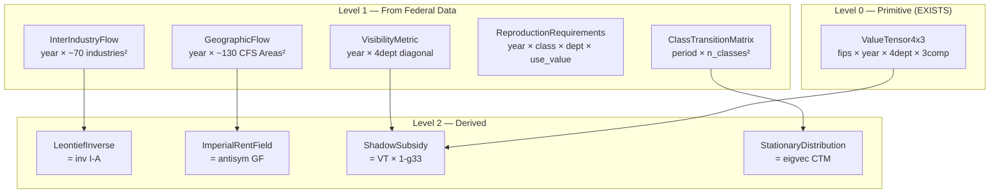
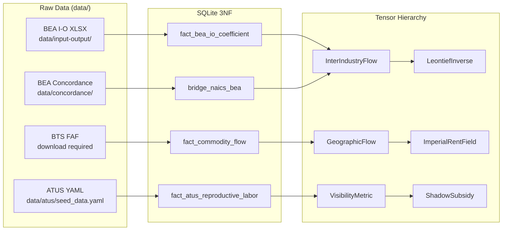

# Data Model: Tensor Hierarchy

**Feature**: 025-tensor-hierarchy | **Date**: 2026-02-26

## Entity Overview



## Level 1 Entities

### InterIndustryFlow

| Field | Type | Constraints | Source |
|-------|------|-------------|--------|
| year | int | >= 1997 | BEA I-O tables |
| table_type | IOTableType | USE, MAKE, SUPPLY, TOTAL_REQ | BEA classification |
| industries | list[str] | BEA industry codes, ordered | BEA concordance |
| n_industries | int | computed from len(industries) | — |
| coefficients | ndarray | shape (n, n), values in [0, 1] | Derived from Use table |

**Identity**: Unique by (year, table_type).
**Validation**: Column sums of direct requirements < 1.0 (productive economy). Row/column labels match industry list.
**Transformation**: Aggregates to 4x4 via weighted sum (weight = industry output share). Currency → labor-time: multiply by SNLT factor.

### VisibilityMetric

| Field | Type | Constraints | Source |
|-------|------|-------------|--------|
| year | int | >= 2003 (ATUS availability) | ATUS + QCEW |
| g_diagonal | ndarray | shape (4,), values in [0, 1] | paid/(paid+unpaid) per dept |
| g_11 | float | [0, 1], expected ≈ 1.0 | Dept I visibility |
| g_22a | float | [0, 1], expected ≈ 1.0 | Dept IIa visibility |
| g_22b | float | [0, 1], expected ≈ 1.0 | Dept IIb visibility |
| g_33 | float | [0, 1], expected < 0.5 | Dept III visibility |
| is_estimated | bool | — | True if using gamma MVP data |

**Identity**: Unique by year.
**Validation**: g_33 < g_11 (reproductive labor less visible than productive). Three-tier: expected [0.20, 0.40] for g_33, warn [0.10, 0.50], fail outside [0.0, 1.0].
**Transformation**: Scalar field — no aggregation. Inner product: price = g_uv × labor^u.
**Adapter**: Wraps `DefaultGammaIIICalculator.compute(year).gamma_iii` for g_33.

### GeographicFlow

| Field | Type | Constraints | Source |
|-------|------|-------------|--------|
| year | int | >= 2012 (FAF5) | BTS FAF |
| areas | list[str] | CFS Area codes, ordered | BTS FAF |
| n_areas | int | ~130 | — |
| flow_matrix | sparse.csr_matrix | shape (n, n), values >= 0 | O-D commodity values |
| commodity_code | str or None | SCTG code if commodity-specific | BTS SCTG |

**Identity**: Unique by (year, commodity_code). commodity_code=None means all-commodity aggregate.
**Validation**: Matrix values non-negative. Total flow conserved under aggregation.
**Transformation**: Geographic aggregation via CFS-to-state mapping (sum rows/columns of same state). Decomposes into symmetric (exchange) + antisymmetric (extraction).

### ReproductionRequirements (P4 — deferred loader)

| Field | Type | Constraints | Source |
|-------|------|-------------|--------|
| year | int | — | CEX + ATUS |
| consumption | dict[SocialRole, dict[Department, dict[str, float]]] | nested by class/dept/use_value | CEX |
| reproductive_labor | dict[SocialRole, dict[SocialRole, dict[str, float]]] | nested by reproduced/laborer/type | ATUS |

**Identity**: Unique by year.
**Transformation**: Total reproduction cost = consumption × SNLT + labor hours.

### ClassTransitionMatrix (P5 — deferred loader)

| Field | Type | Constraints | Source |
|-------|------|-------------|--------|
| period | tuple[int, int] | (start_year, end_year) | PSID |
| classes | list[SocialRole] | ordered | Babylon class system |
| n_classes | int | len(classes) | — |
| transition_matrix | ndarray | shape (n, n), rows sum to 1.0 | Estimated from panel |

**Identity**: Unique by period.
**Validation**: Stochastic matrix — each row sums to 1.0 (tolerance 1e-6). All values in [0, 1].
**Transformation**: Composes via matrix multiplication P(t+2|t) = P × P. Class aggregation via block-sum preserving stochasticity.

## Level 2 Entities (Derived)

### LeontiefInverse

| Field | Type | Constraints | Source |
|-------|------|-------------|--------|
| year | int | — | Computed from InterIndustryFlow |
| industries | list[str] | Same as source I-O table | — |
| inverse_matrix | ndarray | shape (n, n), values >= 0 | L = (I-A)^{-1} |

**Derivation**: `np.linalg.inv(np.eye(n) - A)` where A is the direct requirements matrix.
**Validation**: All elements >= 0. Diagonal elements >= 1.0. Cross-check against BEA's published `IxI_TR_Summary.xlsx`.

### ImperialRentField

| Field | Type | Constraints | Source |
|-------|------|-------------|--------|
| year | int | — | Computed from GeographicFlow |
| areas | list[str] | CFS Area codes | — |
| phi | ndarray | shape (n_areas,), signed | inflow - outflow per area |

**Derivation**: `phi[a] = F.sum(axis=0)[a] - F.sum(axis=1)[a]` (net inflow to area a).
**Validation**: `sum(phi) ≈ 0` (closed system, value conservation). |sum| < 0.1% of total flow.

### ShadowSubsidy

| Field | Type | Constraints | Source |
|-------|------|-------------|--------|
| year | int | — | Computed from ValueTensor4x3 + VisibilityMetric |
| phi_iii_labor_hours | float | >= 0 | Dept III value × (1 - g_33) |
| phi_iii_dollars | float or None | >= 0 if available | phi_iii_labor_hours × MELT |

**Derivation**: Wraps existing `DefaultShadowSubsidyCalculator.compute_phi_iii()`.

### StationaryDistribution

| Field | Type | Constraints | Source |
|-------|------|-------------|--------|
| period | tuple[int, int] | — | Computed from ClassTransitionMatrix |
| classes | list[SocialRole] | — | Same as source matrix |
| distribution | ndarray | shape (n_classes,), sums to 1.0 | Dominant eigenvector of P^T |

**Derivation**: Eigenvector of P^T with eigenvalue ≈ 1.0, normalized.

## Schema Extensions (SQLite 3NF)

### New Tables

```sql
-- BEA I-O coefficient table type dimension
CREATE TABLE dim_bea_io_table_type (
    id INTEGER PRIMARY KEY,
    table_type TEXT NOT NULL UNIQUE,  -- 'USE', 'MAKE', 'SUPPLY', 'TOTAL_REQ'
    description TEXT
);

-- BEA I-O coefficients fact table
CREATE TABLE fact_bea_io_coefficient (
    id INTEGER PRIMARY KEY,
    time_id INTEGER NOT NULL REFERENCES dim_time(id),
    table_type_id INTEGER NOT NULL REFERENCES dim_bea_io_table_type(id),
    source_industry_id INTEGER NOT NULL REFERENCES dim_bea_industry(id),
    target_industry_id INTEGER NOT NULL REFERENCES dim_bea_industry(id),
    coefficient REAL NOT NULL,
    UNIQUE(time_id, table_type_id, source_industry_id, target_industry_id)
);
```

### Existing Tables to Populate

| Table | Loader | Data Source |
|-------|--------|-------------|
| `dim_cfs_area` | NEW `bts/faf_loader.py` | BTS FAF geographic codes |
| `dim_sctg_commodity` | NEW `bts/faf_loader.py` | SCTG commodity classification |
| `fact_commodity_flow` | NEW `bts/faf_loader.py` | FAF O-D flows |
| `dim_atus_activity_category` | EXISTING `atus/loader.py` (RUN) | ATUS activity codes |
| `fact_atus_reproductive_labor` | EXISTING `atus/loader.py` (RUN) | ATUS time use data |
| `bridge_naics_bea` | EXISTING `bea/loader_concordance.py` (RUN) | BEA-NAICS mapping |

## Data Flow


