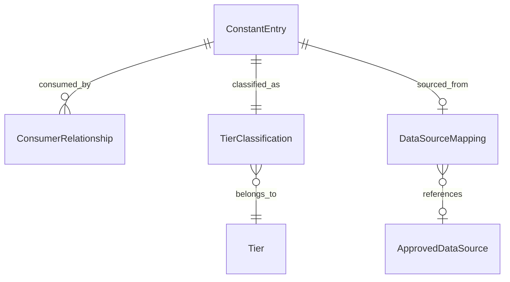

# Data Model: Magic Constants Provenance Audit

**Feature**: 027-constants-provenance-audit
**Date**: 2026-02-27

This feature produces structured reports, not runtime code. The data model defines the schema of the report artifacts.

## Entities

### ConstantEntry (constants-inventory.yaml)

Each entry in the YAML inventory represents one audited constant.

```yaml
# Schema for a single constant entry
constant_id: "economy.extraction_efficiency"  # {subsection}.{field_name} for GameDefines
                                               # {module}:{line}:{identifier} for inline literals
location:
  file: "src/babylon/config/defines.py"
  line: 123
  source_type: "GameDefines"  # enum: GameDefines | YAML | FormulaConstant | InlineLiteral | FunctionDefault | ModuleConstant
value: 0.8
value_type: "float"  # enum: float | int
purpose: "Alpha - how efficiently core extracts value from periphery"  # from Field(description=) or comment
consumers:
  - system: "ImperialRentSystem"
    file: "src/babylon/engine/systems/economic.py"
    line: 337
    usage: "direct"  # enum: direct | fallback | deprecated
  - system: "calculate_bourgeoisie_decision"
    file: "src/babylon/formulas/dynamic_balance.py"
    line: 28
    usage: "fallback"
tier: null  # Populated in Phase 1: A | B | C | D | E
```

**Identity rule**: `constant_id` is unique. For GameDefines fields, it's `{subsection}.{field}`. For inline literals, it's `{module_path}:{line}:{identifier_or_value}`.

**Validation rules**:
- `location.file` must be an existing path relative to repo root
- `location.line` must be a positive integer
- `value` must be numeric (int or float)
- `purpose` must be non-empty (may be "undocumented" if no description exists)
- `consumers` may be empty list (dead constant) but must be present

### TierClassification (constants-classification.md)

Each classified constant includes tier-specific metadata.

```yaml
# Common fields
constant_id: "economy.extraction_efficiency"
tier: "A"  # enum: A | B | C | D | E
reasoning: "Derivable from ValueTensor4x3.exploitation_rate via MarxianHydrator"

# Tier A specific (Tensor-Derivable)
derivation:
  formula: "exploitation_rate = total_s / total_v"
  infrastructure:
    available: ["ValueTensor4x3", "MarxianHydrator", "TensorRegistry"]
    missing: []  # empty = fully derivable now
  data_source: "QCEW county wages → BEA industry ratios → tensor pipeline"

# Tier B specific (Eliminable)
elimination:
  reason: "Duplicate of topology.gaseous_threshold; deprecated module-level constant"
  active_consumers: 0
  deprecated_consumers: 3

# Tier C specific (Calibration Parameter)
calibration:
  theoretical_meaning: "Rate at which state attention decays per tick in low-profile territories"
  data_source: "No direct federal data source; calibrate via parameter sweep"
  sweep_range: [0.01, 0.20]
  sweep_tooling: "mise run tune:optuna (already in search space via GameDefines introspection)"

# Tier D specific (Engineering/Precision)
engineering:
  purpose: "Division-by-zero guard; must be smaller than grid precision"
  constraint: "epsilon < 10^-decimal_places"
  change_risk: "None if constraint maintained"

# Tier E specific (Game Design Knob)
design:
  rationale: "No federal data source tracks class consciousness sensitivity; this is a narrative pacing parameter"
  labeling: "Must be documented as intentional game design choice in GameDefines Field description"
```

### ConsumerRelationship (constants-dependency-graph.md)

Directed edge from constant to consuming system.

```yaml
source: "economy.extraction_efficiency"  # constant_id
target: "ImperialRentSystem"             # system or formula name
weight: 1                                 # 1 = direct use, 0.5 = fallback default
```

**Derived metrics per constant**:
- `consumer_count`: number of distinct consuming systems
- `cascade_risk`: true if consumer_count >= 3
- `isolated`: true if consumer_count == 1

### DataSourceMapping (constants-data-sources.md)

Maps a Tier A or Tier C constant to an approved federal data source.

```yaml
constant_id: "economy.extraction_efficiency"
tier: "A"
data_source:
  name: "QCEW + BEA"
  provider: "Bureau of Labor Statistics / Bureau of Economic Analysis"
  constitution_ref: "Article III.4"
  dataset: "FactQcewAnnual + FactBEANationalIndustry"
  derivation_path: "county wages → NAICS allocation → department ratios → s/v calculation"
  existing_adapter: "MarxianHydrator.hydrate()"
  pipeline_ready: true
```

If no source available:
```yaml
constant_id: "territory.clarity_profile_coefficient"
tier: "C"
data_source:
  name: null
  provider: null
  constitution_ref: null
  unconstrained: true
  justification: "No federal dataset tracks law enforcement operational profile clarity"
  recommendation: "Calibrate via parameter sweep against Detroit carceral geography data"
```

## Report Structure

### Inventory (YAML)
```
constants:
  - {ConstantEntry}
  - {ConstantEntry}
  ...
metadata:
  total_count: 136          # In-scope GameDefines scalar fields (140 total minus 4 ServicesDefines layer numbers)
  inline_count: ~50         # best-effort inline literal count
  search_patterns: [...]    # coverage log (SC-008)
  directories_searched: [...]
  generation_date: "2026-02-27"
```

### Classification (Markdown)
```
# Constants Classification Report
## Summary Statistics
## Tier A: Tensor-Derivable (N constants)
### {constant_id} — {purpose}
## Tier B: Eliminable (N constants)
## Tier C: Calibration Parameters (N constants)
## Tier D: Engineering/Precision (N constants)
## Tier E: Game Design Knobs (N constants)
```

### Dependency Graph (Markdown + Mermaid)
```
# Constants Dependency Graph
## High-Impact Targets (3+ consumers)
## Isolated Constants (1 consumer)
## Coupled Clusters

```

### Remediation Plan (Markdown)
```
# Constants Remediation Plan
## Phase 1: Quick Wins (isolated, data-ready)
## Phase 2: High-Impact (cascade risk, data-ready)
## Phase 3: Infrastructure-Gated (requires Feature 002/021)
## Phase 4: Calibration-Only (parameter sweep)
## Phase 5: Acknowledged Design (Tier E labeling)
```

## Relationships


