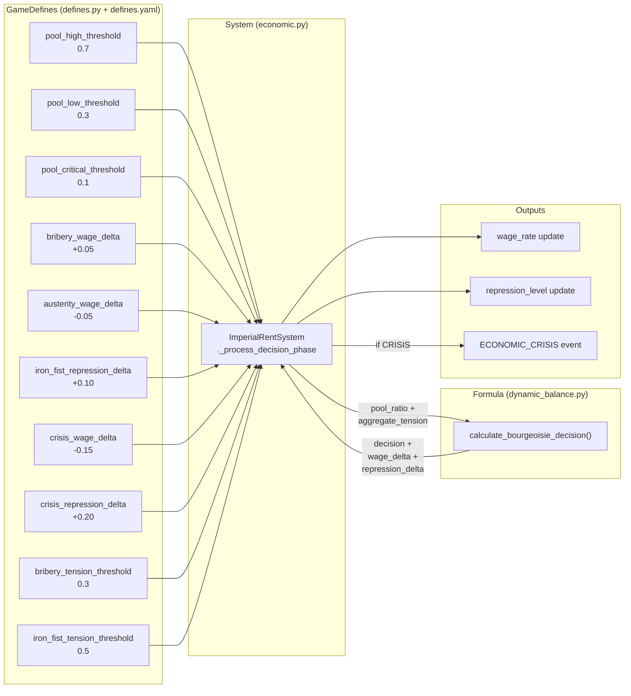
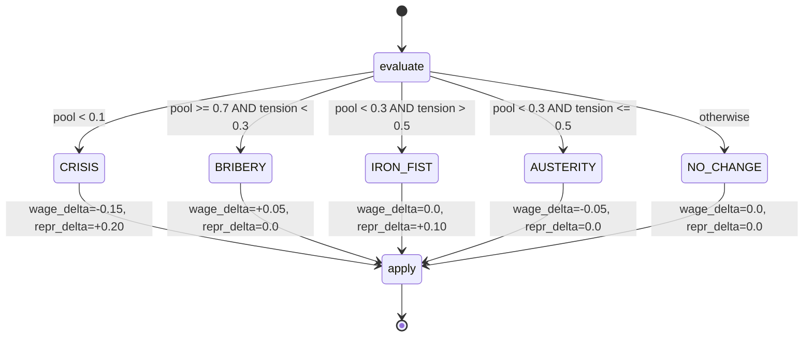

# Bourgeoisie Cluster Deep Dive

**Feature**: 027-constants-provenance-audit (FR-010)
**Date**: 2026-02-27

## Cluster Overview

The bourgeoisie cluster is a group of 10 tightly coupled constants in `EconomyDefines` that collectively parameterize a finite-state machine (FSM) governing the bourgeoisie's policy response to material conditions. The FSM is implemented in `formulas/dynamic_balance.py` as `calculate_bourgeoisie_decision()` and consumed exclusively by `ImperialRentSystem._process_decision_phase` (Phase 5 of the 5-phase imperial rent circuit).

The constants divide into three functional groups:

1. **Pool thresholds** (3): Partition the imperial rent pool ratio into zones (prosperity, neutral, austerity, crisis).
2. **Policy deltas** (5): Define the magnitude of wage and repression adjustments applied when each policy fires.
3. **Tension thresholds** (2): Determine whether tension levels permit bribery or trigger iron-fist escalation.

These 10 constants are **not independently tunable**. Changing any single value shifts the boundaries of the FSM, potentially enabling or disabling entire policy branches. They form a coupled cluster because:

- The pool thresholds create mutually exclusive zones: `critical < low < high`.
- The tension thresholds gate transitions within zones: bribery requires low tension, iron fist requires high tension.
- The policy deltas determine the output magnitude of each state transition.

## Constants in This Cluster

| Constant | Value | defines.py Line | YAML Line | Consumer | Role |
|----------|-------|-----------------|-----------|----------|------|
| `economy.pool_high_threshold` | 0.7 | 168 | 26 | `ImperialRentSystem._process_decision_phase` (L596) | Pool ratio above which prosperity is declared |
| `economy.pool_low_threshold` | 0.3 | 174 | 27 | `ImperialRentSystem._process_decision_phase` (L597) | Pool ratio below which austerity begins |
| `economy.pool_critical_threshold` | 0.1 | 180 | 28 | `ImperialRentSystem._process_decision_phase` (L598) | Pool ratio below which CRISIS fires |
| `economy.bribery_wage_delta` | 0.05 | 268 | 60 | `ImperialRentSystem._process_decision_phase` (L602) | Wage increase during prosperity |
| `economy.austerity_wage_delta` | -0.05 | 274 | 61 | `ImperialRentSystem._process_decision_phase` (L603) | Wage cut during austerity |
| `economy.iron_fist_repression_delta` | 0.10 | 280 | 62 | `ImperialRentSystem._process_decision_phase` (L604) | Repression increase during iron fist |
| `economy.crisis_wage_delta` | -0.15 | 286 | 63 | `ImperialRentSystem._process_decision_phase` (L605) | Emergency wage cut during crisis |
| `economy.crisis_repression_delta` | 0.20 | 292 | 64 | `ImperialRentSystem._process_decision_phase` (L606) | Emergency repression spike during crisis |
| `economy.bribery_tension_threshold` | 0.3 | 300 | 67 | `ImperialRentSystem._process_decision_phase` (L607) | Maximum tension permitting bribery |
| `economy.iron_fist_tension_threshold` | 0.5 | 306 | 68 | `ImperialRentSystem._process_decision_phase` (L608) | Minimum tension triggering iron fist |

All 10 constants are defined in `src/babylon/config/defines.py` within `EconomyDefines`, backed by matching entries in `src/babylon/data/defines.yaml`, and consumed by a single system: `ImperialRentSystem._process_decision_phase` in `src/babylon/engine/systems/economic.py`.

## Current State: Organization-as-Agent Pattern

The current implementation models the bourgeoisie as a **monolithic rational agent** that evaluates two scalar inputs (pool ratio, aggregate tension) and selects a discrete policy from a 5-state FSM:

```
CRISIS  -->  AUSTERITY  -->  NO_CHANGE  -->  BRIBERY
                 |
                 v
            IRON_FIST
```

The decision matrix (from `dynamic_balance.py` lines 82-118):

1. **CRISIS** (pool < 0.1): Emergency wage cut (-0.15) + repression spike (+0.20). Fires regardless of tension. Emits `ECONOMIC_CRISIS` event.
2. **BRIBERY** (pool >= 0.7 AND tension < 0.3): Wage increase (+0.05). Class compromise.
3. **IRON_FIST** (pool < 0.3 AND tension > 0.5): Repression increase (+0.10). Coercive response.
4. **AUSTERITY** (pool < 0.3 AND tension <= 0.5): Wage cut (-0.05). Extractive response.
5. **NO_CHANGE** (otherwise): Status quo. Mid-range pool, no action.

The aggregate tension is computed as the arithmetic mean of all edge `tension` attributes in the graph (`_calculate_aggregate_tension`, L659-687).

**Limitations of this pattern**:

- **Spatial homogeneity**: The FSM treats the bourgeoisie as a single national actor. In reality, bourgeoisie factions in different territories face different material conditions. Detroit's bourgeoisie and Silicon Valley's bourgeoisie should not make the same decision simultaneously.
- **No memory**: The FSM is memoryless -- it evaluates the current tick's pool ratio and tension with no regard for trend direction or recent history. A pool ratio rising from 0.25 to 0.35 (recovery) and one falling from 0.45 to 0.35 (decline) produce identical decisions.
- **Discrete jumps**: Policy deltas are applied as flat additive constants. There is no proportionality to the severity of the condition.
- **No faction differentiation**: Bribery and austerity are presented as unified bourgeoisie policies, but historically these represent distinct class fractions (industrial vs. finance capital).

Feature 017 (Simulation Tick Dynamics) introduces `CountyEconomicState` -- per-county per-year economic snapshots including value tensors, capital stock, class distribution, and precarity indicators. This infrastructure creates the possibility of **county-level bourgeoisie decisions** where local pool ratios and local tension drive locally differentiated policy responses.

## Tier Assessment

**All 10 GameDefines constants: Tier C (Calibration Parameters)**

These constants are game-design policy thresholds that model emergent political dynamics. No federal data source directly measures "when does the bourgeoisie switch from bribery to austerity." The thresholds encode a theoretical model of class behavior, not an empirical measurement.

| Constant | Tier | Reasoning |
|----------|------|-----------|
| `pool_high_threshold` | C | No dataset maps "prosperity threshold" to a ratio; design choice |
| `pool_low_threshold` | C | No dataset maps "austerity trigger" to a ratio; design choice |
| `pool_critical_threshold` | C | No dataset maps "crisis trigger" to a ratio; design choice |
| `bribery_wage_delta` | C | Magnitude of wage concession is a narrative pacing parameter |
| `austerity_wage_delta` | C | Magnitude of wage cut is a narrative pacing parameter |
| `iron_fist_repression_delta` | C | Magnitude of repression increase is a narrative pacing parameter |
| `crisis_wage_delta` | C | Emergency wage slash severity is a design choice |
| `crisis_repression_delta` | C | Emergency repression spike severity is a design choice |
| `bribery_tension_threshold` | C | Tension level for class compromise is a design choice |
| `iron_fist_tension_threshold` | C | Tension level for coercive response is a design choice |

**Calibration approach**: These constants are already introspectable by `tools/shared.py:get_tunable_parameters()` because they have `ge`/`le` constraints in their `Field()` definitions. However, they are NOT currently included in `tools/tune_agent.py:OPTIMIZATION_BOUNDS`, meaning they are excluded from the Optuna search space. Adding them to the bounds dict is a prerequisite for calibration.

**Recommended sweep ranges** (for future inclusion in `OPTIMIZATION_BOUNDS`):

| Constant | Sweep Range | Rationale |
|----------|-------------|-----------|
| `pool_high_threshold` | [0.5, 0.9] | Must exceed `pool_low_threshold` |
| `pool_low_threshold` | [0.2, 0.5] | Must exceed `pool_critical_threshold` |
| `pool_critical_threshold` | [0.05, 0.2] | Must be lowest threshold |
| `bribery_wage_delta` | [0.01, 0.10] | Positive wage increase |
| `austerity_wage_delta` | [-0.10, -0.01] | Negative wage adjustment |
| `iron_fist_repression_delta` | [0.05, 0.20] | Positive repression increase |
| `crisis_wage_delta` | [-0.25, -0.05] | Negative emergency wage cut |
| `crisis_repression_delta` | [0.10, 0.35] | Positive emergency repression |
| `bribery_tension_threshold` | [0.1, 0.5] | Low tension ceiling |
| `iron_fist_tension_threshold` | [0.3, 0.7] | High tension floor |

**Constraint**: Sweep must enforce `pool_critical_threshold < pool_low_threshold < pool_high_threshold` and `bribery_tension_threshold < iron_fist_tension_threshold` to maintain FSM zone ordering.

## Duplicate Analysis

`formulas/dynamic_balance.py` lines 28-39 duplicate all 10 values as function parameter defaults:

| GameDefines Constant | Inline Default | Line | Value Match |
|----------------------|----------------|------|-------------|
| `economy.pool_high_threshold` | `high_threshold: float = 0.7` | 28 | Exact |
| `economy.pool_low_threshold` | `low_threshold: float = 0.3` | 29 | Exact |
| `economy.pool_critical_threshold` | `critical_threshold: float = 0.1` | 30 | Exact |
| `economy.bribery_wage_delta` | `bribery_wage_delta: float = 0.05` | 32 | Exact |
| `economy.austerity_wage_delta` | `austerity_wage_delta: float = -0.05` | 33 | Exact |
| `economy.iron_fist_repression_delta` | `iron_fist_repression_delta: float = 0.10` | 34 | Exact |
| `economy.crisis_wage_delta` | `crisis_wage_delta: float = -0.15` | 35 | Exact |
| `economy.crisis_repression_delta` | `crisis_repression_delta: float = 0.20` | 36 | Exact |
| `economy.bribery_tension_threshold` | `bribery_tension_threshold: float = 0.3` | 38 | Exact |
| `economy.iron_fist_tension_threshold` | `iron_fist_tension_threshold: float = 0.5` | 39 | Exact |

All 10 inline defaults currently match their GameDefines counterparts exactly. The duplicates exist as function signature defaults to support standalone formula testing (calling `calculate_bourgeoisie_decision(pool_ratio, tension)` without injecting a full `ServiceContainer`). This is a deliberate pattern used across multiple formula modules (see also `formulas/solidarity.py`, `formulas/metabolic_rift.py`).

**Recommendation**: Classify the 10 inline versions as **Tier B (Eliminable -- Duplicates)**. The inline defaults are a convenience, not a necessity. The single consumer (`ImperialRentSystem`) always passes explicit values from `GameDefines`. Drift risk is mitigated only because both locations currently agree, but there is no automated enforcement. If a GameDefines value changes without updating the formula default, the formula's standalone behavior silently diverges.

**Inventory cross-reference**: The inline versions are catalogued in `constants-inventory.yaml` as:
- `dynamic_balance:28:high_threshold` through `dynamic_balance:39:iron_fist_tension`

## Remediation Assessment

### Short-term: Parameter Sweep Integration

**Effort**: Low (add 10 entries to `OPTIMIZATION_BOUNDS`)

The immediate remediation is to include these 10 constants in the Optuna search space:

1. Add entries to `tools/tune_agent.py:OPTIMIZATION_BOUNDS` with the sweep ranges listed above.
2. Run `mise run tune:morris 20` to rank their sensitivity (mu*).
3. Run `mise run tune:optuna 200` to find locally optimal values.
4. Update `defines.yaml` with calibrated values.

This does not change the architecture -- it calibrates the existing FSM.

### Medium-term: Trend-Aware Decisions

**Effort**: Medium (modify formula + add 2-3 new constants)

The memoryless FSM could be enhanced to consider the **direction** of pool ratio change (rising vs. falling) without replacing the entire pattern. This would require tracking `previous_pool_ratio` in the economy state and adding constants for hysteresis bands.

### Long-term: County-Level Organization-as-Agent

**Effort**: High (requires Feature 017 completion + new system)

Feature 017's `CountyEconomicState` provides the infrastructure for per-county bourgeoisie decisions. Under this model:

- Each county maintains its own pool ratio derived from local value tensors.
- Each county's aggregate tension is computed from local edges only.
- The bourgeoisie FSM runs per-county, producing spatially differentiated policies.
- National policy emerges from the aggregate of county-level decisions, weighted by economic significance.

This would not necessarily eliminate the 10 constants (the FSM logic still needs thresholds), but it would make them operate at a more granular scale. The flat thresholds might then be replaced by county-specific calibrations derived from the tensor pipeline.

### Risk Assessment

**Cascade risk**: Low. All 10 constants are consumed by a single system (`ImperialRentSystem._process_decision_phase`). No other system reads these values. Changing them affects only the decision phase of the imperial rent circuit.

**Behavioral sensitivity**: High. The CRISIS decision emits an `ECONOMIC_CRISIS` event via the event bus (L640-657), which is observable by the `EndgameDetector` and `SessionRecorder`. Incorrect thresholds can cause premature or absent crisis events, distorting the simulation's endgame trajectory.

**Interaction effects**: The pool ratio is the quotient of `current_pool / initial_pool`, where `current_pool` evolves through Phases 1-4 (extraction, tribute, wages, subsidy) before Phase 5 evaluates it. Changes to `extraction_efficiency`, `super_wage_rate`, `comprador_cut`, `trpf_coefficient`, or `rent_pool_decay` all shift the pool ratio indirectly, meaning these bourgeoisie constants interact with the broader `EconomyDefines` surface even though they are consumed by a single system.

## R-006 Erratum

R-006 in `research.md` lists `iron_fist_tension_threshold` with value 0.3. The verified value from all three sources is **0.5**:

- `defines.py` line 307: `default=0.5`
- `defines.yaml` line 68: `iron_fist_tension_threshold: 0.5`
- `dynamic_balance.py` line 39: `iron_fist_tension_threshold: float = 0.5`

The value 0.3 in R-006 appears to be a copy error from `bribery_tension_threshold` (which is 0.3). This erratum does not affect the audit's conclusions since the correct value is used throughout the codebase.

## Mermaid Dependency Diagram



## FSM State Diagram



## Summary

| Dimension | Assessment |
|-----------|------------|
| **Cluster size** | 10 constants (5 deltas, 2 tension thresholds, 3 pool thresholds) |
| **Tier** | C (Calibration Parameters) for all 10 GameDefines entries |
| **Duplicates** | 10 inline defaults in `dynamic_balance.py` (Tier B -- Eliminable) |
| **Consumer count** | 1 (`ImperialRentSystem._process_decision_phase`) |
| **Cascade risk** | Low (single consumer), but high behavioral sensitivity via ECONOMIC_CRISIS event |
| **Data source** | None. No federal dataset maps to bourgeoisie policy thresholds |
| **Calibration readiness** | Ready (GameDefines fields have bounds), but not yet in `OPTIMIZATION_BOUNDS` |
| **Long-term evolution** | Feature 017 county-level state may enable per-county decisions, making flat national thresholds a coarser approximation |
| **Remediation priority** | Phase 4 (Calibration-Only) per the remediation plan phasing |
