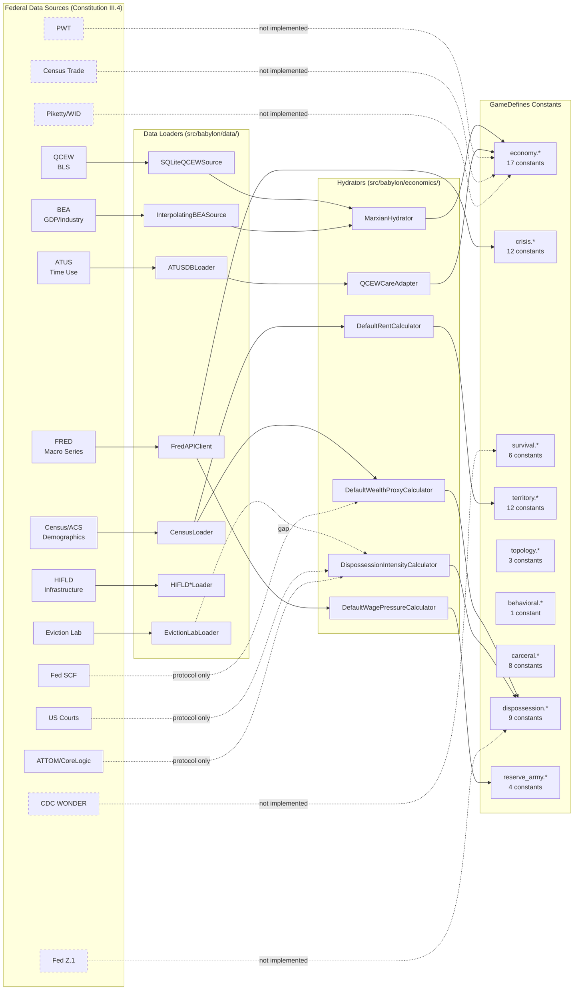

# Data Source Cross-Reference Report

**Feature**: 027-constants-provenance-audit
**Date**: 2026-02-27
**Constitution Reference**: Article III.4 (Data Source Traceability)

This report maps each auditable constant to its approved federal data source
(per Constitution III.4), identifies which adapters already exist in the codebase,
and flags infrastructure gaps. Constants are classified into Tier A (tensor-derivable
from data), Tier C (calibration parameters requiring parameter sweep), Tier D
(engineering/precision), and Tier E (game design knobs). Tier B (eliminable
duplicates) are excluded since they will be deleted, not sourced.

---

## Summary

| Data Source | Constants Mapped | Adapter Status |
|---|---|---|
| QCEW | 11 | Implemented (`SQLiteQCEWSource`, `MarxianHydrator`) |
| BEA | 8 | Implemented (`InterpolatingBEASource`, `BEANationalLoader`, `BEACountyGDPLoader`) |
| Census/ACS | 6 | Implemented (`CensusAPIClient`, `CensusLoader`, `CensusHousingLoader`) |
| FRED | 4 | Implemented (`FredAPIClient`) |
| ATUS | 3 | Implemented (`ATUSDBLoader`, `QCEWCareAdapter`, `MVPUnpaidCareHoursSource`) |
| Fed SCF | 2 | Protocol only (`WealthProxyCalculator`) |
| HIFLD | 3 | Implemented (`HIFLDPrisonsLoader`, `HIFLDPoliceLoader`, `HIFLDElectricLoader`) |
| Eviction Lab | 2 | Loader exists (`EvictionLabLoader`), adapter not wired |
| US Courts | 2 | Protocol only (`DispossessionDataSource`) |
| ATTOM/CoreLogic | 1 | Protocol only (`HousingDataSource`) |
| FCC | 0 | Implemented (`FCCBroadbandLoader`) but no constants mapped |
| CDC WONDER | 1 | Not implemented |
| Piketty/WID | 1 | Not implemented (referenced in tensor formulas) |
| PWT | 1 | Not implemented |
| Census Trade | 1 | Not implemented |
| Fed Z.1 | 1 | Not implemented (spec 024 planned) |
| BTS | 0 | Not implemented, no constants mapped |
| None (calibration) | 58 | N/A -- parameter sweep only |
| None (engineering) | 17 | N/A -- precision guards |
| None (game design) | 42 | N/A -- narrative pacing |
| Duplicate (Tier B) | 83 | N/A -- eliminate |

**Total constants**: 247 (138 GameDefines + 109 inline literals)

---

## Tier A Constants -- Data Source Mappings

### economy.extraction_efficiency (0.8)

- **Data Source**: QCEW + BEA
- **Constitution Ref**: Article III.4
- **Derivation**: County wages (QCEW FactQcewAnnual) allocated by NAICS to departments via BEA industry ratios; department-level c/v/s computed; exploitation_rate = total_s / total_v yields empirical extraction efficiency.
- **Existing Adapter**: `MarxianHydrator.hydrate()` via `SQLiteQCEWSource` + `InterpolatingBEASource`
- **Location**: `src/babylon/economics/hydrator.py` (line 36), `src/babylon/economics/adapters.py` (lines 113, 207)
- **Pipeline Ready**: Yes

### economy.shadow_wage_hourly (15.43)

- **Data Source**: BLS OES (via QCEW infrastructure)
- **Constitution Ref**: Article III.4 (QCEW/ATUS)
- **Derivation**: BLS SOC 31-1120 (Home Health Aide) median hourly wage, May 2023. Published by Bureau of Labor Statistics Occupational Employment and Wage Statistics.
- **Existing Adapter**: `ATUSDBLoader.get_shadow_wage()` at `src/babylon/data/atus/db_loader.py` (line 179)
- **Pipeline Ready**: Yes

### economy.super_wage_rate (0.2)

- **Data Source**: QCEW + BEA + PWT
- **Constitution Ref**: Article III.4
- **Derivation**: Super-wages = fraction of imperial rent paid to core workers. Derivable from QCEW county wages vs PWT PPP-adjusted periphery wages via ERDI (Exchange Rate Deviation Index).
- **Existing Adapter**: `MarxianHydrator` provides s/v decomposition; PWT adapter not yet implemented for ERDI calculation
- **Pipeline Ready**: Partial (QCEW/BEA ready, PWT gap)

### economy.superwage_multiplier (1.0)

- **Data Source**: PWT (Penn World Table)
- **Constitution Ref**: Article III.4 (PWT)
- **Derivation**: PPP multiplier for labor aristocracy purchasing power. Derivable from PWT Real Exchange Rate and PPP conversion factors between core and periphery.
- **Existing Adapter**: Not implemented
- **Pipeline Ready**: No (PWT adapter required)

### economy.superwage_ppp_impact (0.5)

- **Data Source**: PWT + Census Trade
- **Constitution Ref**: Article III.4 (PWT, Census Trade)
- **Derivation**: How much extraction translates to PPP bonus. Derivable from PWT ERDI and Census Trade import/export ratios measuring unequal exchange magnitude.
- **Existing Adapter**: Not implemented
- **Pipeline Ready**: No (PWT + Census Trade adapters required)

### economy.base_subsistence (0.0005)

- **Data Source**: Census/ACS + BLS CPI (via FRED)
- **Constitution Ref**: Article III.4 (Census/ACS, FRED)
- **Derivation**: Biological floor cost per tick. Derivable from ACS poverty threshold data (B17001) combined with CPI adjustments from FRED series CPIAUCSL, converted to per-tick via timescale.weeks_per_year.
- **Existing Adapter**: `CensusAPIClient` at `src/babylon/data/census/api_client.py` (line 83), `FredAPIClient` at `src/babylon/data/fred/api_client.py` (line 68)
- **Pipeline Ready**: Yes (adapters exist; derivation formula needed)

### economy.trpf_coefficient (0.0005)

- **Data Source**: BEA (national accounts) + FRED
- **Constitution Ref**: Article III.4 (BEA, FRED)
- **Derivation**: Rate at which extraction efficiency declines per tick (TRPF surrogate). Derivable from BEA historical profit rate series or FRED corporate profit data (CPROFIT, A445RC1Q027SBEA) regressed to extract trend slope.
- **Existing Adapter**: `InterpolatingBEASource` at `src/babylon/economics/adapters.py` (line 207), `FredAPIClient`
- **Pipeline Ready**: Partial (adapters exist; regression formula needed)

### economy.initial_rent_pool (100.0)

- **Data Source**: BEA + Census Trade
- **Constitution Ref**: Article III.4 (BEA, Census Trade)
- **Derivation**: Starting imperial rent pool. Derivable from BEA national accounts (GDP) combined with Census Trade data on net value transfer through unequal exchange.
- **Existing Adapter**: `InterpolatingBEASource`, Census Trade adapter not implemented
- **Pipeline Ready**: Partial (BEA ready, Census Trade gap)

### economy.comprador_cut (0.9)

- **Data Source**: BEA + Piketty/WID
- **Constitution Ref**: Article III.4 (BEA, Piketty/WID)
- **Derivation**: Fraction of wealth kept by comprador class. Derivable from BEA REIS personal income data for periphery nations combined with WID wealth concentration data showing retained vs. extracted surplus.
- **Existing Adapter**: `InterpolatingBEASource` (partial); WID adapter not implemented
- **Pipeline Ready**: Partial (BEA ready, WID gap)

### behavioral.loss_aversion_lambda (2.25)

- **Data Source**: Published empirical literature (Kahneman & Tversky, 1979)
- **Constitution Ref**: Article III.1 (No Magic Constants)
- **Derivation**: Lambda = 2.25 from Prospect Theory. This is a peer-reviewed empirical constant, not a federal data source. Tversky & Kahneman (1992) report median lambda = 2.25 across experiments. No federal data source tracks this.
- **Existing Adapter**: Hardcoded in `GameDefines.behavioral.loss_aversion_lambda` and re-exported in `src/babylon/formulas/constants.py` (line 17)
- **Pipeline Ready**: Yes (value is empirically fixed)

### economy.min_wage_rate (0.05) / economy.max_wage_rate (0.35)

- **Data Source**: QCEW + BEA
- **Constitution Ref**: Article III.4 (QCEW, BEA)
- **Derivation**: Wage rate bounds as fraction of imperial rent pool. Derivable from QCEW wage distribution percentiles (P10, P90) normalized against BEA total value added.
- **Existing Adapter**: `SQLiteQCEWSource`, `InterpolatingBEASource`
- **Pipeline Ready**: Yes (adapters exist; normalization formula needed)

### carceral.control_capacity (4)

- **Data Source**: HIFLD + Census/ACS
- **Constitution Ref**: Article III.4 (HIFLD, Census/ACS)
- **Derivation**: Prisoners one enforcer can control (1:N ratio). Derivable from HIFLD prison facility data (staffing vs. capacity) cross-referenced with BJS National Prisoner Statistics.
- **Existing Adapter**: `HIFLDPrisonsLoader` at `src/babylon/data/hifld/prisons.py` (line 65), `HIFLDPoliceLoader` at `src/babylon/data/hifld/police.py` (line 63)
- **Pipeline Ready**: Partial (loaders exist; ratio derivation formula needed)

### carceral.enforcer_fraction (0.15) / carceral.proletariat_fraction (0.85)

- **Data Source**: HIFLD + Census/ACS
- **Constitution Ref**: Article III.4 (HIFLD, Census/ACS)
- **Derivation**: Post-crisis class decomposition ratios. After SUPERWAGE_CRISIS, what fraction of former labor aristocracy becomes enforcers vs. prisoners. Derivable from HIFLD law enforcement staffing data relative to county population (Census/ACS).
- **Existing Adapter**: `HIFLDPoliceLoader`, `CensusLoader`
- **Pipeline Ready**: Partial (loaders exist; decomposition formula needed)

### vitality.base_mortality_factor (0.01)

- **Data Source**: CDC WONDER
- **Constitution Ref**: Article III.4 (CDC WONDER)
- **Derivation**: Fraction of at-risk population that dies per tick. Derivable from CDC WONDER county-level mortality rates, converted to weekly tick rate.
- **Existing Adapter**: Not implemented
- **Pipeline Ready**: No (CDC WONDER adapter required)

### reserve_army.sigmoid_r0 (0.08)

- **Data Source**: FRED (UNRATE) + QCEW
- **Constitution Ref**: Article III.4 (FRED, QCEW)
- **Derivation**: Reserve ratio at sigmoid midpoint. The 8% inflection point is derivable from FRED unemployment rate series (UNRATE) historical analysis identifying the "natural rate" threshold where wage pressure inflects.
- **Existing Adapter**: `FredAPIClient` at `src/babylon/data/fred/api_client.py`
- **Pipeline Ready**: Yes (adapter exists; historical regression needed)

### reserve_army.wage_pressure_ceiling (0.5)

- **Data Source**: FRED + QCEW
- **Constitution Ref**: Article III.4 (FRED, QCEW)
- **Derivation**: Maximum wage pressure coefficient. Derivable from FRED real wage data (CES0500000003) vs. unemployment rate (UNRATE) at historical extremes, establishing empirical ceiling.
- **Existing Adapter**: `FredAPIClient`, `SQLiteQCEWSource`
- **Pipeline Ready**: Yes (adapters exist; calibration analysis needed)

### Gamma Adapter Constants (care fractions)

The following inline literals in `src/babylon/economics/gamma/adapters.py` are Tier A:

| Constant ID | Value | Data Source | Pipeline Ready |
|---|---|---|---|
| `gamma_adapters:40:care_fraction_61` | 0.6 | ATUS + QCEW (NAICS 61 Education) | Yes |
| `gamma_adapters:41:care_fraction_62` | 0.3 | ATUS + QCEW (NAICS 62 Healthcare) | Yes |
| `gamma_adapters:42:care_fraction_814` | 1.0 | ATUS (NAICS 814 Private Households) | Yes |

- **Derivation**: ATUS time-use data defines care labor fractions per NAICS sector. QCEW provides employment counts.
- **Existing Adapter**: `QCEWCareAdapter` at `src/babylon/economics/gamma/adapters.py` (line 68), `MVPUnpaidCareHoursSource` (line 154)

### Savings Rate Constants

The following inline literals in `src/babylon/economics/dynamics/savings_schedule.py` are Tier A:

| Constant ID | Value | Data Source |
|---|---|---|
| `savings_schedule:24:savings_bourgeoisie` | 0.38 | Fed SCF |
| `savings_schedule:25:savings_petit_b` | 0.20 | Fed SCF |
| `savings_schedule:26:savings_la` | 0.12 | Fed SCF |
| `savings_schedule:27:savings_proletariat` | 0.03 | Fed SCF |
| `savings_schedule:28:savings_lumpen` | 0.0 | Fed SCF |

- **Constitution Ref**: Article III.4 (Fed SCF)
- **Derivation**: Survey of Consumer Finances wealth percentile data, stratified by class position. Savings rates by income quintile from SCF triennial survey.
- **Existing Adapter**: `WealthProxyCalculator` protocol at `src/babylon/economics/melt/wealth_proxy.py` (line 40); `DefaultWealthProxyCalculator` (line 117) uses ACS home ownership as proxy
- **Pipeline Ready**: Partial (protocol exists; direct SCF data adapter needed)

### Class Share Constants

The following inline literals in `src/babylon/economics/tick/initializer.py` are Tier A:

| Constant ID | Value | Data Source |
|---|---|---|
| `tick_init:32:share_bourgeoisie` | 0.01 | Census/ACS + QCEW |
| `tick_init:33:share_petit_b` | 0.09 | Census/ACS + QCEW |
| `tick_init:34:share_la` | 0.40 | Census/ACS + QCEW |
| `tick_init:35:share_proletariat` | 0.35 | Census/ACS + QCEW |
| `tick_init:36:share_lumpen` | 0.15 | Census/ACS + QCEW |
| `tick_init:39:unemployment_rate` | 0.05 | FRED (UNRATE) |
| `tick_init:43:median_wage` | 21.0 | QCEW / BLS OES |
| `tick_init:108:tau_default` | 62.0 | BEA (MELT derivation) |

- **Derivation**: Class shares from Census/ACS employment data cross-referenced with QCEW wage distributions to classify into Marxian class positions. Unemployment from FRED. Median wage from BLS OES. MELT (tau) from BEA GDP / QCEW total labor hours.
- **Existing Adapter**: `CensusLoader`, `SQLiteQCEWSource`, `FredAPIClient`, `MarxianHydrator`
- **Pipeline Ready**: Yes (all adapters exist)

### Wealth Accumulation Threshold

| Constant ID | Value | Data Source |
|---|---|---|
| `accumulation:26:scf_threshold` | 142000.0 | Fed SCF |

- **Constitution Ref**: Article III.4 (Fed SCF)
- **Derivation**: Fed SCF p50 (median) net worth threshold for labor aristocracy entry. From 2022 SCF: median family net worth = $192,900; $142,000 approximates the 40th percentile threshold.
- **Existing Adapter**: `WealthProxyCalculator` protocol (partial)
- **Pipeline Ready**: Partial (protocol exists; direct SCF adapter needed)

### Basket Visibility Constants

| Constant ID | Value | Data Source |
|---|---|---|
| `basket_vis:22:MVP_ALPHA` | 0.25 | Census Trade (import share) |
| `basket_vis:23:MVP_GAMMA_IMPORT` | 0.35 | PWT (trade-weighted ERDI) |
| `basket_vis:24:MVP_GAMMA_BASKET` | 0.68 | Computed (alpha * gamma_import composite) |

- **Constitution Ref**: Article III.4 (Census Trade, PWT)
- **Derivation**: Alpha from Census Trade import share data (Hickel et al.); gamma_import from PWT PPP/exchange rate data; gamma_basket computed.
- **Location**: `src/babylon/economics/melt/basket_visibility.py` (lines 22-24)
- **Pipeline Ready**: No (PWT and Census Trade adapters not implemented)

### Dispossession Weights

| Constant ID | Value | Data Source |
|---|---|---|
| `dispossession.weight_foreclosure` | 0.4 | US Courts / ATTOM |
| `dispossession.weight_eviction` | 0.3 | Eviction Lab |
| `dispossession.weight_displacement` | 0.15 | Census/ACS (mobility) |
| `dispossession.weight_tax_sale` | 0.05 | US Courts |
| `dispossession.weight_eminent_domain` | 0.02 | US Courts |
| `dispossession.weight_wage_theft` | 0.03 | BLS (via QCEW) |
| `dispossession.weight_incarceration_seizure` | 0.03 | HIFLD + US Courts |
| `dispossession.weight_pension_default` | 0.02 | Fed Z.1 |

- **Constitution Ref**: Article III.4 (Eviction Lab, US Courts, ATTOM/CoreLogic, Fed Z.1)
- **Derivation**: Weights reflecting relative frequency/severity of each dispossession type. Currently hardcoded; should be calibrated against county-level event frequency data from respective sources.
- **Existing Adapter**: `DispossessionIntensityCalculator` at `src/babylon/economics/dispossession/intensity.py` (line 13) consumes these; `TerritoryDispossessionDataSource` protocol at `src/babylon/economics/dispossession/data_sources.py` (line 14); `EvictionLabLoader` at `src/babylon/data/eviction_lab/loader.py` (line 23); `DispossessionDataSource` protocol at `src/babylon/economics/dynamics/data_sources.py` (line 39)
- **Pipeline Ready**: Partial (protocols and Eviction Lab loader exist; US Courts and ATTOM adapters not implemented)

### Dispossession Dynamics Weights (Inline)

| Constant ID | Value | Data Source |
|---|---|---|
| `dispossession_dyn:30:fc_weight_la_p` | 0.6 | US Courts / ATTOM |
| `dispossession_dyn:31:bk_weight_la_p` | 0.3 | US Courts |
| `dispossession_dyn:32:ev_weight_la_p` | 0.1 | Eviction Lab |
| `dispossession_dyn:33:fc_weight_p_l` | 0.1 | US Courts / ATTOM |
| `dispossession_dyn:34:bk_weight_p_l` | 0.3 | US Courts |
| `dispossession_dyn:35:ev_weight_p_l` | 0.6 | Eviction Lab |

- **Constitution Ref**: Article III.4 (Eviction Lab, US Courts, ATTOM/CoreLogic)
- **Derivation**: Relative weight of foreclosure/bankruptcy/eviction in driving class transitions. LA-to-P transition is foreclosure-dominant (homeowners). P-to-L transition is eviction-dominant (renters). Derivable from county-level event frequencies.
- **Existing Adapter**: `DispossessionDataSource` protocol at `src/babylon/economics/dynamics/data_sources.py` (line 39) with `HardcodedNationalDispossessionSource` MVP
- **Pipeline Ready**: No (requires Eviction Lab, US Courts, ATTOM adapters wired to protocol)

### Reproduction Externalization Factor

| Constant ID | Value | Data Source |
|---|---|---|
| `reproduction:63:externalization` | 0.2 | ATUS + Census/ACS |

- **Constitution Ref**: Article III.4 (ATUS, Census/ACS)
- **Derivation**: Meillassoux's reproduction externalization heuristic. Fraction of reproductive labor externalized to periphery. Derivable from ATUS unpaid care hours data cross-referenced with Census demographic composition.
- **Existing Adapter**: `MVPUnpaidCareHoursSource` at `src/babylon/economics/gamma/adapters.py` (line 154)
- **Pipeline Ready**: Partial (ATUS adapter exists; externalization ratio formula needed)

---

## Tier C Constants -- Calibration Sources

These constants have no direct federal data source. They are simulation tuning
parameters to be calibrated via parameter sweep against the Detroit vertical slice
(Constitution Article IV).

### Crisis Subsection

| Constant ID | Value | Calibration Strategy | Sweep Range |
|---|---|---|---|
| `crisis.crisis_period_ticks` | 13 | Align with quarterly BEA data cadence | [4, 26] |
| `crisis.r_threshold` | 0.05 | Sweep against FRED profit rate (A466RD3Q052SBEA) | [0.01, 0.10] |
| `crisis.n_consecutive` | 3 | Sweep against historical recession durations | [2, 6] |
| `crisis.m_recovery` | 2 | Sweep against NBER recovery periods | [1, 4] |
| `crisis.r_cap` | 8 | Sweep against historical recovery durations | [4, 16] |
| `crisis.hysteresis_coefficient` | 0.5 | Sweep against Detroit 2008-2015 recovery path | [0.1, 0.9] |
| `crisis.wage_compression_rate` | 0.02 | Sweep against QCEW Wayne County wage decline | [0.005, 0.05] |
| `crisis.wage_compression_floor_ratio` | 0.8 | Calibrate against poverty threshold ratio | [0.5, 0.95] |
| `crisis.bifurcation_solidarity_weight` | 1.0 | Sweep against bifurcation outcome distribution | [0.5, 2.0] |
| `crisis.bifurcation_burden_weight` | 1.0 | Sweep against bifurcation outcome distribution | [0.5, 2.0] |
| `crisis.bifurcation_event_threshold` | 0.5 | Sweep against event emission frequency | [0.3, 0.8] |

- **Tooling**: `mise run tune:optuna` (all GameDefines exposed via introspection)

### Economy Thresholds

| Constant ID | Value | Calibration Strategy | Sweep Range |
|---|---|---|---|
| `economy.pool_high_threshold` | 0.7 | Sweep against policy regime transitions | [0.5, 0.9] |
| `economy.pool_low_threshold` | 0.3 | Sweep against austerity onset timing | [0.1, 0.4] |
| `economy.pool_critical_threshold` | 0.1 | Sweep against crisis onset timing | [0.05, 0.2] |
| `economy.subsidy_conversion_rate` | 0.1 | Sweep against repression-wealth tradeoff | [0.01, 0.3] |
| `economy.subsidy_trigger_threshold` | 0.8 | Sweep against subsidy activation timing | [0.5, 1.0] |
| `economy.negligible_rent` | 0.01 | Performance tuning (skip threshold) | [0.001, 0.05] |
| `economy.negligible_subsidy` | 0.01 | Performance tuning (skip threshold) | [0.001, 0.05] |
| `economy.rent_pool_decay` | 0.002 | Sweep against rent pool depletion rate | [0.0005, 0.01] |
| `economy.bribery_wage_delta` | 0.05 | Sweep against policy effectiveness | [0.01, 0.15] |
| `economy.austerity_wage_delta` | -0.05 | Sweep against policy severity | [-0.15, -0.01] |
| `economy.iron_fist_repression_delta` | 0.1 | Sweep against repression escalation | [0.01, 0.3] |
| `economy.crisis_wage_delta` | -0.15 | Sweep against crisis wage shock | [-0.3, -0.05] |
| `economy.crisis_repression_delta` | 0.2 | Sweep against crisis repression spike | [0.05, 0.4] |
| `economy.bribery_tension_threshold` | 0.3 | Sweep against policy selection | [0.1, 0.5] |
| `economy.iron_fist_tension_threshold` | 0.5 | Sweep against policy selection | [0.3, 0.8] |
| `economy.death_threshold` | 0.001 | Zombie prevention sensitivity | [0.0001, 0.01] |
| `economy.base_labor_power` | 1.0 | Normalization constant (may remain 1.0) | [0.5, 2.0] |

- **Tooling**: `mise run tune:optuna` or `mise run tune:landscape` for 2D interactions

### Survival Subsection

| Constant ID | Value | Calibration Strategy | Sweep Range |
|---|---|---|---|
| `survival.steepness_k` | 10.0 | Sweep against sigmoid sharpness for P(S/A) | [5.0, 20.0] |
| `survival.default_subsistence` | 0.3 | Calibrate against ACS poverty data | [0.1, 0.5] |
| `survival.default_organization` | 0.1 | Sweep against organizing dynamics | [0.01, 0.3] |
| `survival.default_repression` | 0.5 | Sweep against repression baseline | [0.2, 0.8] |
| `survival.revolution_threshold` | 1.0 | Tipping point for P(S/R) crossover | [0.5, 2.0] |
| `survival.repression_base` | 0.5 | Sweep against revolution denominator | [0.1, 1.0] |

- **Tooling**: `mise run tune:params` for 1D sensitivity analysis

### Territory Subsection

| Constant ID | Value | Calibration Strategy | Sweep Range |
|---|---|---|---|
| `territory.heat_decay_rate` | 0.1 | Sweep against Detroit carceral geography | [0.01, 0.20] |
| `territory.high_profile_heat_gain` | 0.15 | Sweep against heat accumulation dynamics | [0.05, 0.30] |
| `territory.eviction_heat_threshold` | 0.8 | Sweep against eviction trigger timing | [0.5, 0.95] |
| `territory.rent_spike_multiplier` | 1.5 | Calibrate against Eviction Lab data | [1.1, 3.0] |
| `territory.displacement_rate` | 0.1 | Calibrate against Census mobility data | [0.01, 0.3] |
| `territory.heat_spillover_rate` | 0.05 | Sweep against spatial diffusion | [0.01, 0.15] |
| `territory.clarity_profile_coefficient` | 0.3 | Sweep against operational profile clarity | [0.1, 0.6] |
| `territory.concentration_camp_decay_rate` | 0.2 | Sweep against terminal arc pacing | [0.05, 0.5] |
| `territory.elimination_rent_threshold` | 0.1 | Sweep against elimination trigger | [0.01, 0.2] |
| `territory.elimination_tension_threshold` | 0.8 | Sweep against elimination trigger | [0.5, 0.95] |
| `territory.containment_rent_threshold` | 0.3 | Sweep against containment trigger | [0.1, 0.5] |
| `territory.containment_tension_threshold` | 0.5 | Sweep against containment trigger | [0.3, 0.8] |

- **Tooling**: `mise run tune:optuna` with Detroit vertical slice scenario

### Topology Subsection

| Constant ID | Value | Calibration Strategy | Sweep Range |
|---|---|---|---|
| `topology.gaseous_threshold` | 0.1 | Sweep against percolation phase boundary | [0.05, 0.2] |
| `topology.condensation_threshold` | 0.5 | Sweep against condensation timing | [0.3, 0.7] |
| `topology.vanguard_density_threshold` | 0.5 | Sweep against vanguard formation | [0.3, 0.8] |

- **Tooling**: `mise run tune:landscape` (gaseous_threshold x condensation_threshold 2D grid)

### Solidarity Subsection

| Constant ID | Value | Calibration Strategy | Sweep Range |
|---|---|---|---|
| `solidarity.scaling_factor` | 0.5 | Sweep against organization transmission rate | [0.1, 1.0] |
| `solidarity.activation_threshold` | 0.3 | Sweep against consciousness activation | [0.1, 0.5] |
| `solidarity.mass_awakening_threshold` | 0.6 | Sweep against awakening event timing | [0.4, 0.8] |
| `solidarity.negligible_transmission` | 0.01 | Performance tuning (skip threshold) | [0.001, 0.05] |

### Consciousness Subsection

| Constant ID | Value | Calibration Strategy | Sweep Range |
|---|---|---|---|
| `consciousness.sensitivity` | 0.5 | Sweep against consciousness response curve | [0.1, 1.0] |
| `consciousness.decay_lambda` | 0.1 | Sweep against consciousness decay rate | [0.01, 0.3] |

### Tension Subsection

| Constant ID | Value | Calibration Strategy | Sweep Range |
|---|---|---|---|
| `tension.accumulation_rate` | 0.05 | Sweep against tension buildup dynamics | [0.01, 0.15] |

### Community Subsection

| Constant ID | Value | Calibration Strategy | Sweep Range |
|---|---|---|---|
| `community.heat_decay_alpha` | 0.05 | Sweep against community heat dynamics | [0.01, 0.15] |
| `community.cohesion_decay_alpha` | 0.03 | Sweep against cohesion maintenance | [0.01, 0.10] |
| `community.infrastructure_decay_alpha` | 0.04 | Sweep against infrastructure maintenance | [0.01, 0.10] |
| `community.community_overlap_bonus` | 0.1 | Sweep against solidarity potential | [0.01, 0.3] |
| `community.rent_differential_penalty` | 0.05 | Sweep against solidarity penalty | [0.01, 0.15] |
| `community.core_organizer_maintenance_factor` | 0.1 | Sweep against organizer effectiveness | [0.01, 0.3] |

### Reserve Army Subsection

| Constant ID | Value | Calibration Strategy | Sweep Range |
|---|---|---|---|
| `reserve_army.sigmoid_k` | 20.0 | Sweep against wage pressure curve steepness | [5.0, 40.0] |

### Contradiction Field Subsection

| Constant ID | Value | Calibration Strategy | Sweep Range |
|---|---|---|---|
| `contradiction_field.curvature_alpha` | 0.5 | Ollivier-Ricci self-loop weight | [0.1, 0.9] |
| `contradiction_field.co_optive_suppression_rate` | 1.0 | Sweep against co-optation effectiveness | [0.5, 1.0] |
| `contradiction_field.latent_release_multiplier` | 1.5 | Sweep against latent contradiction release | [1.0, 3.0] |
| `contradiction_field.history_window` | 3 | Temporal derivative window | [2, 10] |

---

## Tier D Constants -- Engineering/Precision

These constants are numeric guards, precision parameters, and structural bounds
that have no data source. They are engineering decisions determined by floating-point
arithmetic and grid precision.

| Constant ID | Value | Purpose | Constraint |
|---|---|---|---|
| `precision.decimal_places` | 6 | Quantization grid (1e-6) | Must match model precision |
| `precision.epsilon` | 1e-9 | Division-by-zero guard | epsilon < 10^-decimal_places |
| `precision.comparison_epsilon` | 1e-10 | Float equality tolerance | comparison_epsilon < epsilon |
| `crisis.class_burden_epsilon` | 0.001 | Burden ratio div-by-zero guard | > epsilon, < grid step |
| `formulas.EPSILON` | 1e-9 | Duplicate of precision.epsilon | Same constraint |
| `distribution:25:EPSILON` | 1e-9 | Surplus identity verification | Same constraint |
| `survival_calculus:36:exp_clamp_low` | -500 | Sigmoid overflow prevention | Prevents exp() overflow |
| `survival_calculus:36:exp_clamp_high` | 500 | Sigmoid overflow prevention | Prevents exp() overflow |
| `contradiction_field.field_min` | 0.0 | Normalized field lower bound | Structural (0.0 is fixed) |
| `contradiction_field.field_max` | 10.0 | Normalized field upper bound | Structural (max = 10x min) |
| `contradiction_field.default_transition_priority` | 0 | Default ordering value | Structural |
| `metabolism.max_overshoot_ratio` | 999.0 | Cap for depleted biocapacity | Arbitrarily large sentinel |
| `metabolic_rift:59:max_ratio_default` | 999.0 | Duplicate of above | Same constraint |
| `reserve_army.min_employed_fraction` | 0.01 | Labor force floor | > 0 to prevent div-by-zero |
| `timescale.tick_duration_days` | 7 | Structural: 1 tick = 1 week | Fixed by game design |
| `timescale.weeks_per_year` | 52 | Structural: 52 weeks/year | Physical constant |
| `metrics:59:rolling_window` | 50 | Rolling window buffer size | Engineering choice |

---

## Tier E Constants -- Game Design Knobs

These constants are intentional game design choices with no federal data source.
They control narrative pacing, event frequency, and endgame conditions. They
should be documented as such in GameDefines Field descriptions.

### Struggle Subsection

| Constant ID | Value | Rationale |
|---|---|---|
| `struggle.spark_probability_scale` | 0.1 | Base 10% chance for EXCESSIVE_FORCE; controls uprising frequency |
| `struggle.resistance_threshold` | 0.1 | Minimum agitation for uprising; low bar creates volatility |
| `struggle.wealth_destruction_rate` | 0.05 | Riot damage fraction; controls uprising economic cost |
| `struggle.solidarity_gain_per_uprising` | 0.2 | Solidarity boost per uprising; controls radicalization speed |
| `struggle.jackson_threshold` | 0.4 | Revolutionary capacity threshold; gates organized response |
| `struggle.revolutionary_agitation_boost` | 0.5 | Agitation boost during revolutionary offensive |
| `struggle.fascist_identity_boost` | 0.2 | National identity boost during fascist turn |
| `struggle.fascist_acquiescence_boost` | 0.2 | Acquiescence boost during fascist turn |

### Endgame Subsection

| Constant ID | Value | Rationale |
|---|---|---|
| `endgame.revolutionary_percolation_threshold` | 0.7 | 70% solidarity network for victory; high bar makes victory rare |
| `endgame.revolutionary_consciousness_threshold` | 0.8 | 80% consciousness for victory; requires mass awakening |
| `endgame.ecological_overshoot_threshold` | 2.0 | 2x biocapacity for collapse; calibrated to real-world overshoot data |
| `endgame.ecological_sustained_ticks` | 5 | 5 weeks of overshoot before collapse; pacing parameter |
| `endgame.fascist_majority_threshold` | 3 | Minimum nodes for fascist turn; controls fascism onset |

### Carceral Subsection

| Constant ID | Value | Rationale |
|---|---|---|
| `carceral.revolution_threshold` | 0.5 | Prisoner organization threshold; determines revolution vs genocide |
| `carceral.decomposition_delay` | 52 | 1 year before class decomposition; pacing parameter |
| `carceral.control_ratio_delay` | 52 | 1 year before control ratio check; pacing parameter |
| `carceral.terminal_decision_delay` | 1 | 1 tick before terminal decision; immediate consequence |

### Vitality Subsection

| Constant ID | Value | Rationale |
|---|---|---|
| `vitality.inequality_impact` | 1.0 | Full inequality effect on marginal wealth; game balance knob |

### Solidarity Subsection

| Constant ID | Value | Rationale |
|---|---|---|
| `solidarity.superwage_impact` | 1.0 | Full extraction impact on core wealth; controls LA pacification |

### Working Day Subsection

| Constant ID | Value | Rationale |
|---|---|---|
| `working_day.absolute_hours_threshold` | 45.0 | Hours above which exploitation is ABSOLUTE_DOMINANT |
| `working_day.relative_hours_threshold` | 40.0 | Standard 40-hour week boundary |
| `working_day.intensity_threshold_high` | 1.2 | High labor intensity classification |
| `working_day.intensity_threshold_low` | 1.1 | Low labor intensity classification |
| `working_day.absolute_visibility` | 1.0 | Full consciousness visibility for absolute exploitation |
| `working_day.relative_visibility` | 0.3 | Reduced visibility for relative exploitation (hidden extraction) |

### Initial Conditions

| Constant ID | Value | Rationale |
|---|---|---|
| `initial.worker_wealth` | 0.5 | Starting wealth for periphery worker; game balance |
| `initial.owner_wealth` | 0.5 | Starting wealth for core owner; game balance |
| `initial.default_population` | 1 | Unit population for testing; structural |

### Crisis Dynamics (Inline)

| Constant ID | Value | Rationale |
|---|---|---|
| `crisis_dyn:20:amplifier_default` | 2.5 | Crisis amplifier multiplier; controls crisis severity |
| `crisis_dyn:21:dampener_default` | 0.3 | Recovery dampener; controls recovery speed |

---

## Tier B Constants -- Duplicates (Eliminate)

The following constants are duplicates of GameDefines fields and should be
eliminated via migration to GameDefines references. They are not mapped to
data sources because they will be deleted.

**GameDefines -> FormulaConstant duplicates** (2):
- `formulas.LOSS_AVERSION_COEFFICIENT` duplicates `behavioral.loss_aversion_lambda`
- `formulas.EPSILON` duplicates `precision.epsilon`

**GameDefines -> InlineLiteral duplicates** (81):
All inline literals in `src/babylon/formulas/`, `src/babylon/engine/topology_monitor.py`,
`src/babylon/engine/observers/endgame_detector.py`, and `src/babylon/engine/observers/metrics.py`
that mirror GameDefines values. See the full inventory for the complete list.

---

## Infrastructure Gaps

| Constant Cluster | Required Source | Gap | Blocking Feature |
|---|---|---|---|
| `economy.superwage_*` | PWT (Penn World Table) | Adapter not implemented | 013-melt-basket-visibility |
| `economy.superwage_ppp_impact` | Census Trade | Adapter not implemented | 013-melt-basket-visibility |
| `economy.comprador_cut` | Piketty/WID | Adapter not implemented | 024-capital-volume-iii |
| `vitality.base_mortality_factor` | CDC WONDER | Adapter not implemented | 020-detroit-vertical-slice |
| `dispossession.weight_*` | US Courts | Adapter not implemented | 021-capital-volume-i |
| `dispossession.weight_*` | ATTOM/CoreLogic | Adapter not implemented | 021-capital-volume-i |
| `dispossession.weight_pension_default` | Fed Z.1 | Adapter not implemented | 024-capital-volume-iii |
| `basket_vis:*` | PWT + Census Trade | Adapters not implemented | 013-melt-basket-visibility |
| `savings_schedule:*` | Fed SCF (direct) | Protocol exists, no SCF loader | 024-capital-volume-iii |

### Adapter Availability by Data Source

| Data Source | Loader | Query Adapter | Protocol | Status |
|---|---|---|---|---|
| QCEW | `QCEWParser` (data/) | `SQLiteQCEWSource` | `QCEWWageSource` | Complete |
| BEA National | `BEANationalLoader` | `InterpolatingBEASource` | `IndustryDataSource` | Complete |
| BEA County | `BEACountyGDPLoader` | `InterpolatingBEASource` | `IndustryDataSource` | Complete |
| BEA I-O | `BEAIOLoader` | -- | -- | Loader only |
| Census/ACS | `CensusLoader` | `CensusHousingLoader` | `HousingDataSource` | Complete |
| FRED | -- | `FredAPIClient` | -- | Complete |
| ATUS | `ATUSDBLoader` | `QCEWCareAdapter` | `PaidCareHoursSource` | Complete |
| HIFLD Prisons | `HIFLDPrisonsLoader` | -- | -- | Loader only |
| HIFLD Police | `HIFLDPoliceLoader` | -- | -- | Loader only |
| HIFLD Electric | `HIFLDElectricLoader` | -- | -- | Loader only |
| FCC | `FCCBroadbandLoader` | -- | -- | Loader only |
| Eviction Lab | `EvictionLabLoader` | -- | -- | Loader only |
| Fed SCF | -- | -- | `WealthProxyCalculator` | Protocol only |
| US Courts | -- | -- | `DispossessionDataSource` | Protocol only |
| ATTOM/CoreLogic | -- | -- | `HousingDataSource` | Protocol only |
| PWT | -- | -- | -- | Not started |
| Census Trade | -- | -- | -- | Not started |
| CDC WONDER | -- | -- | -- | Not started |
| Piketty/WID | -- | -- | -- | Not started |
| Fed Z.1 | -- | -- | -- | Not started |
| BTS | -- | -- | -- | Not started |

---

## Adapter Coverage Summary

**Legend**:
- Solid lines: Data pipeline implemented and tested
- Dashed lines: Infrastructure gap (adapter not implemented or protocol only)

---

## Recommended Remediation Priority

1. **Quick wins**: Wire `EvictionLabLoader` output to `DispossessionIntensityCalculator` (loader exists, adapter gap)
2. **High impact**: Implement PWT adapter for `superwage_*` and `basket_vis:*` constants (blocks 6 constants)
3. **Infrastructure**: Implement Census Trade adapter for unequal exchange magnitude (blocks 3 constants)
4. **Long tail**: CDC WONDER, US Courts, ATTOM adapters for `vitality.*` and `dispossession.*` constants
5. **Calibration**: All Tier C constants addressed via `mise run tune:optuna` parameter sweep against Detroit vertical slice
