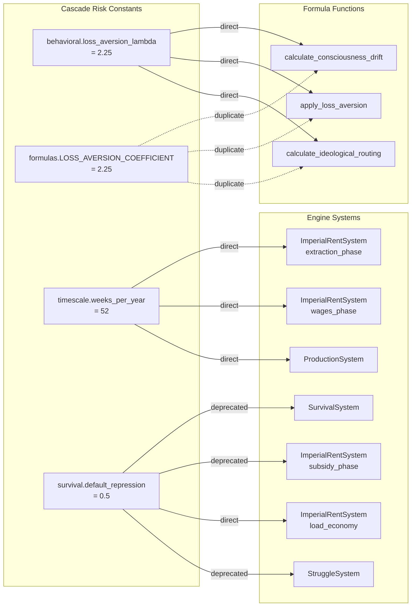
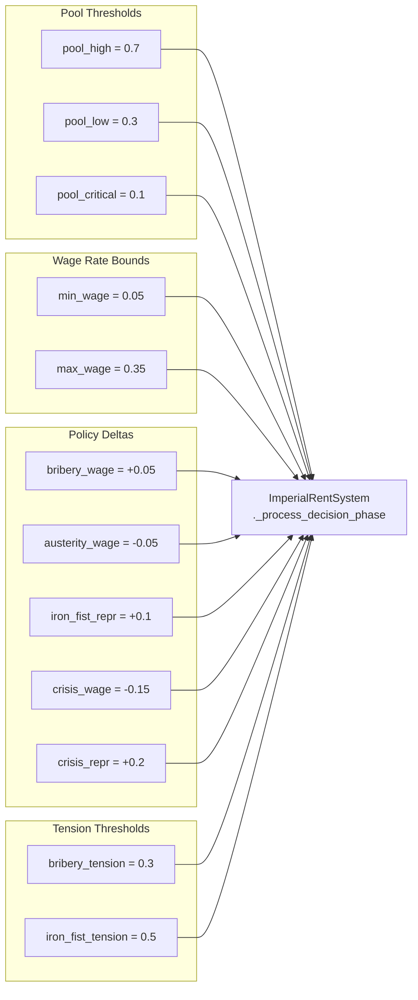
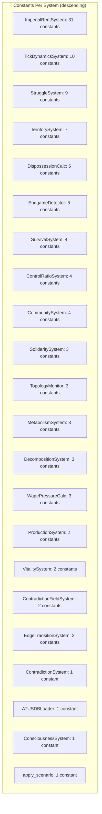

# Constants Dependency Graph

> Feature 027 -- Constants Provenance Audit
> Generated: 2026-02-27
> Source: `specs/027-constants-provenance-audit/reports/constants-inventory.yaml`

## Summary Statistics

| Metric | Count |
|--------|-------|
| Total constants | 247 |
| GameDefines constants | 136 |
| FormulaConstant re-exports | 2 |
| InlineLiteral constants | 109 |
| Total consumer relationships | 120 |
| Constants with 0 consumers | 145 |
| Constants with 1 consumer (isolated) | 89 |
| Constants with 2 consumers | 9 |
| Constants with 3+ consumers (cascade risk) | 4 |
| Coupled clusters identified (method-level) | 24 |
| Coupled clusters identified (3+ members) | 13 |
| GameDefines subsections | 22 |
| Unique consuming systems (class-level) | 26 |

### Consumer Distribution by Source Type

| Source Type | Total | 0 consumers | 1 consumer | 2 consumers | 3+ consumers |
|-------------|-------|-------------|------------|-------------|---------------|
| GameDefines | 136 | 36 | 88 | 8 | 4 |
| FormulaConstant | 2 | 0 | 1 | 0 | 1 |
| InlineLiteral | 109 | 109 | 0 | 0 | 0 |

**Key finding**: Every InlineLiteral constant has zero documented consumers. This is expected -- inline literals are consumed at their definition site, so the "consumer" is the enclosing function itself. They are self-contained replacement targets.

---

## Top 5 Highest-Impact Replacement Targets

Ranked by weighted consumer count (direct=1.0, fallback=0.5, deprecated=0.1).

### 1. `behavioral.loss_aversion_lambda` (weighted score: 3.0)

- **Consumer 1**: `calculate_consciousness_drift` (`src/babylon/formulas/fundamental_theorem.py:95`, direct)
- **Consumer 2**: `apply_loss_aversion` (`src/babylon/formulas/survival_calculus.py:103`, direct)
- **Consumer 3**: `calculate_ideological_routing` (`src/babylon/formulas/ideological_routing.py:107`, direct)
- **Value**: 2.25 (Kahneman-Tversky loss aversion coefficient)
- **Impact**: Changing this constant affects 3 formula functions across the consciousness, survival, and ideological routing subsystems. All three are direct usages, meaning any value change propagates immediately.
- **Recommendation**: This is a Tier A constant with empirical provenance (behavioral economics literature, lambda = 2.25 from Kahneman & Tversky 1979). Its duplicate `formulas.LOSS_AVERSION_COEFFICIENT` shares the same 3 consumers. Replacement should consolidate the two identifiers into a single source-of-truth in `GameDefines.behavioral` and eliminate the re-export in `formulas/constants.py`.

### 2. `timescale.weeks_per_year` (weighted score: 3.0)

- **Consumer 1**: `ImperialRentSystem._process_extraction_phase` (`src/babylon/engine/systems/economic.py:162`, direct)
- **Consumer 2**: `ImperialRentSystem._process_wages_phase` (`src/babylon/engine/systems/economic.py:327`, direct)
- **Consumer 3**: `ProductionSystem.step` (`src/babylon/engine/systems/production.py:100`, direct)
- **Value**: 52 (weeks per year for flow conversion)
- **Impact**: Affects the two core economic phases of ImperialRentSystem plus the ProductionSystem. All three are direct, high-criticality usages that convert annual flows to weekly tick rates.
- **Recommendation**: Tier A constant with definitional provenance (calendar weeks per year). Safe to change the access pattern (e.g., inject via config) but the value itself is fixed by physical reality. Low risk of incorrect replacement.

### 3. `formulas.LOSS_AVERSION_COEFFICIENT` (weighted score: 3.0)

- **Consumer 1**: `calculate_consciousness_drift` (`src/babylon/formulas/fundamental_theorem.py:95`, direct)
- **Consumer 2**: `apply_loss_aversion` (`src/babylon/formulas/survival_calculus.py:103`, direct)
- **Consumer 3**: `calculate_ideological_routing` (`src/babylon/formulas/ideological_routing.py:107`, direct)
- **Value**: 2.25 (re-exported from `behavioral.loss_aversion_lambda`)
- **Impact**: Identical consumer set to `behavioral.loss_aversion_lambda`. These two constants are a duplication pair -- same value, same consumers.
- **Recommendation**: Eliminate this re-export. Formula functions should read directly from `GameDefines.behavioral.loss_aversion_lambda` (or accept it as a parameter). This is a duplication cleanup target, not a value change target.

### 4. `survival.default_repression` (weighted score: 1.3)

- **Consumer 1**: `SurvivalSystem.step` (`src/babylon/engine/systems/survival.py:127`, deprecated)
- **Consumer 2**: `ImperialRentSystem._process_subsidy_phase` (`src/babylon/engine/systems/economic.py:485`, deprecated)
- **Consumer 3**: `ImperialRentSystem._load_economy` (`src/babylon/engine/systems/economic.py:711`, direct)
- **Consumer 4**: `StruggleSystem._process_agency` (`src/babylon/engine/systems/struggle.py:308`, deprecated)
- **Value**: 0.5 (fallback repression value)
- **Impact**: Highest consumer count (4) across 3 distinct systems. However, 3 of 4 usages are deprecated fallbacks, which lowers the weighted score. The single direct usage is in `_load_economy` for initialization.
- **Recommendation**: The deprecated usages should be eliminated first (replace with graph-read patterns). Once deprecated paths are removed, this becomes a single-consumer constant. Prioritize deprecation removal before value replacement.

### 5. `economy.extraction_efficiency` (weighted score: 2.0)

- **Consumer 1**: `ImperialRentSystem._process_extraction_phase` (`src/babylon/engine/systems/economic.py:161`, direct)
- **Consumer 2**: `ImperialRentSystem._process_wages_phase` (`src/babylon/engine/systems/economic.py:333`, direct)
- **Value**: 0.8 (Alpha -- how efficiently core extracts value from periphery)
- **Impact**: Both consumers are in ImperialRentSystem but in different phases. This is a core economic parameter (the extraction efficiency alpha). Changing it affects both how much value is extracted AND how wages are computed from extraction.
- **Recommendation**: Tier A constant. The value 0.8 needs empirical justification (what real-world metric maps to 80% extraction efficiency?). Both usages are tightly coupled within the same system, so replacement is contained.

---

## Cascade Risk Constants (3+ consumers)

| Constant | Consumer Count | Weighted Score | Consuming Systems |
|----------|---------------|----------------|-------------------|
| `survival.default_repression` | 4 | 1.3 | SurvivalSystem, ImperialRentSystem, StruggleSystem |
| `behavioral.loss_aversion_lambda` | 3 | 3.0 | calculate_consciousness_drift, apply_loss_aversion, calculate_ideological_routing |
| `timescale.weeks_per_year` | 3 | 3.0 | ImperialRentSystem (2x), ProductionSystem |
| `formulas.LOSS_AVERSION_COEFFICIENT` | 3 | 3.0 | calculate_consciousness_drift, apply_loss_aversion, calculate_ideological_routing |

**Note**: `behavioral.loss_aversion_lambda` and `formulas.LOSS_AVERSION_COEFFICIENT` are a duplication pair (same value 2.25, same consumers). Effective cascade risk constants are 3, not 4.

---

## Isolated Constants (1 consumer)

Easy replacement targets -- only one system to modify.

### GameDefines Isolated Constants (88 total)

Grouped by consuming system for bundled replacement planning:

**ImperialRentSystem (21 constants)**:

| Constant | Sole Consumer Method | Value |
|----------|---------------------|-------|
| `economy.comprador_cut` | `_process_tribute_phase` | 0.9 |
| `economy.superwage_ppp_impact` | `_process_wages_phase` | 0.5 |
| `economy.pool_high_threshold` | `_process_decision_phase` | 0.7 |
| `economy.pool_low_threshold` | `_process_decision_phase` | 0.3 |
| `economy.pool_critical_threshold` | `_process_decision_phase` | 0.1 |
| `economy.min_wage_rate` | `_process_decision_phase` | 0.05 |
| `economy.max_wage_rate` | `_process_decision_phase` | 0.35 |
| `economy.subsidy_conversion_rate` | `_process_subsidy_phase` | 0.1 |
| `economy.subsidy_trigger_threshold` | `_process_subsidy_phase` | 0.8 |
| `economy.negligible_subsidy` | `_process_subsidy_phase` | 0.01 |
| `economy.trpf_coefficient` | `_process_extraction_phase` | 0.0005 |
| `economy.rent_pool_decay` | `_save_economy` | 0.002 |
| `economy.bribery_wage_delta` | `_process_decision_phase` | 0.05 |
| `economy.austerity_wage_delta` | `_process_decision_phase` | -0.05 |
| `economy.iron_fist_repression_delta` | `_process_decision_phase` | 0.1 |
| `economy.crisis_wage_delta` | `_process_decision_phase` | -0.15 |
| `economy.crisis_repression_delta` | `_process_decision_phase` | 0.2 |
| `economy.bribery_tension_threshold` | `_process_decision_phase` | 0.3 |
| `economy.iron_fist_tension_threshold` | `_process_decision_phase` | 0.5 |
| `economy.trpf_efficiency_floor` | `_process_extraction_phase` | 0.1 |
| `economy.super_wage_rate` | `_load_economy` | 0.2 |

**Other Economy/Solidarity Single-Consumer Constants (5 constants)**:

| Constant | Sole Consumer | Value |
|----------|--------------|-------|
| `economy.death_threshold` | VitalitySystem.step | 0.001 |
| `economy.shadow_wage_hourly` | ATUSDBLoader.get_shadow_wage | 15.43 |
| `economy.base_labor_power` | ProductionSystem.step | 1.0 |
| `solidarity.negligible_transmission` | SolidaritySystem.step (deprecated) | 0.01 |
| `solidarity.mass_awakening_threshold` | SolidaritySystem.step | 0.6 |

**TickDynamicsSystem (10 constants)**:

| Constant | Sole Consumer Method | Value |
|----------|---------------------|-------|
| `crisis.r_threshold` | `_run_crisis_detection` | 0.05 |
| `crisis.n_consecutive` | `_run_crisis_detection` | 3 |
| `crisis.m_recovery` | `_run_crisis_detection` | 2 |
| `crisis.r_cap` | `_run_crisis_detection` | 8 |
| `crisis.wage_compression_rate` | `_run_crisis_detection` | 0.02 |
| `crisis.wage_compression_floor_ratio` | `_run_class_transitions` | 0.8 |
| `crisis.bifurcation_solidarity_weight` | `_run_bifurcation_risk` | 1.0 |
| `crisis.bifurcation_burden_weight` | `_run_bifurcation_risk` | 1.0 |
| `crisis.class_burden_epsilon` | `_run_bifurcation_risk` | 0.001 |
| `crisis.bifurcation_event_threshold` | `_run_bifurcation_risk` | 0.5 |

**StruggleSystem (8 constants)**:

| Constant | Sole Consumer Method | Value |
|----------|---------------------|-------|
| `struggle.spark_probability_scale` | `_process_agency` | 0.1 |
| `struggle.resistance_threshold` | `_process_agency` | 0.1 |
| `struggle.wealth_destruction_rate` | `_process_agency` | 0.05 |
| `struggle.solidarity_gain_per_uprising` | `_process_agency` | 0.2 |
| `struggle.jackson_threshold` | `_check_george_jackson_bifurcation` | 0.4 |
| `struggle.revolutionary_agitation_boost` | `_apply_revolutionary_offensive` | 0.5 |
| `struggle.fascist_identity_boost` | `_apply_fascist_revanchism` | 0.2 |
| `struggle.fascist_acquiescence_boost` | `_apply_fascist_revanchism` | 0.2 |

**TerritorySystem (7 constants)**:

| Constant | Sole Consumer Method | Value |
|----------|---------------------|-------|
| `territory.heat_decay_rate` | `_process_heat` | 0.1 |
| `territory.high_profile_heat_gain` | `_process_heat` | 0.15 |
| `territory.eviction_heat_threshold` | `_process_eviction` | 0.8 |
| `territory.rent_spike_multiplier` | `_process_eviction` | 1.5 |
| `territory.displacement_rate` | `_process_eviction` | 0.1 |
| `territory.heat_spillover_rate` | `_process_spillover` | 0.05 |
| `territory.concentration_camp_decay_rate` | `_process_sink_effects` | 0.2 |

**EndgameDetector (5 constants)**:

| Constant | Sole Consumer Method | Value |
|----------|---------------------|-------|
| `endgame.revolutionary_percolation_threshold` | `_check_revolutionary_victory` | 0.7 |
| `endgame.revolutionary_consciousness_threshold` | `_check_revolutionary_victory` | 0.8 |
| `endgame.ecological_overshoot_threshold` | `_check_ecological_collapse` | 2.0 |
| `endgame.ecological_sustained_ticks` | `_check_ecological_collapse` | 5 |
| `endgame.fascist_majority_threshold` | `_check_fascist_consolidation` | 3 |

**Other Systems (remaining isolated)**:

| Constant | Sole Consumer | Value |
|----------|--------------|-------|
| `tension.accumulation_rate` | ContradictionSystem.step | 0.05 |
| `precision.epsilon` | calculate_revolution_probability | 1e-09 |
| `formulas.EPSILON` | calculate_revolution_probability | 1e-09 |
| `topology.gaseous_threshold` | TopologyMonitor.__init__ (fallback) | 0.1 |
| `topology.condensation_threshold` | TopologyMonitor.__init__ (fallback) | 0.5 |
| `topology.vanguard_density_threshold` | TopologyMonitor.__init__ (fallback) | 0.5 |
| `metabolism.entropy_factor` | MetabolismSystem.step | 1.2 |
| `metabolism.overshoot_threshold` | MetabolismSystem.step | 1.0 |
| `metabolism.max_overshoot_ratio` | MetabolismSystem.step | 999.0 |
| `carceral.control_capacity` | ControlRatioSystem.step | 4 |
| `carceral.enforcer_fraction` | DecompositionSystem._execute_decomposition | 0.15 |
| `carceral.proletariat_fraction` | DecompositionSystem._execute_decomposition | 0.85 |
| `carceral.revolution_threshold` | ControlRatioSystem._emit_terminal_decision | 0.5 |
| `carceral.decomposition_delay` | DecompositionSystem.step | 52 |
| `carceral.control_ratio_delay` | ControlRatioSystem.step | 52 |
| `carceral.terminal_decision_delay` | ControlRatioSystem.step | 1 |
| `contradiction_field.field_min` | ContradictionFieldSystem.step | 0.0 |
| `contradiction_field.field_max` | ContradictionFieldSystem.step | 10.0 |
| `contradiction_field.co_optive_suppression_rate` | _handle_co_optive_suppression | 1.0 |
| `contradiction_field.latent_release_multiplier` | _handle_co_optive_breakdowns | 1.5 |
| `reserve_army.sigmoid_k` | DefaultWagePressureCalculator.compute_wage_pressure | 20.0 |
| `reserve_army.sigmoid_r0` | DefaultWagePressureCalculator.compute_wage_pressure | 0.08 |
| `reserve_army.wage_pressure_ceiling` | DefaultWagePressureCalculator.compute_wage_pressure | 0.5 |
| `dispossession.weight_foreclosure` | DispossessionIntensityCalculator.compute_intensity | 0.4 |
| `dispossession.weight_eviction` | DispossessionIntensityCalculator.compute_intensity | 0.3 |
| `dispossession.weight_displacement` | DispossessionIntensityCalculator.compute_intensity | 0.15 |
| `dispossession.weight_tax_sale` | DispossessionIntensityCalculator.compute_intensity | 0.05 |
| `dispossession.weight_eminent_domain` | DispossessionIntensityCalculator.compute_intensity | 0.02 |
| `dispossession.deadweight_loss_fraction` | DispossessionIntensityCalculator.compute_value_transfer | 0.05 |
| `community.heat_decay_alpha` | _apply_decay | 0.05 |
| `community.cohesion_decay_alpha` | _apply_decay | 0.03 |
| `community.infrastructure_decay_alpha` | _apply_decay | 0.04 |
| `community.core_organizer_maintenance_factor` | _apply_decay | 0.1 |

---

## Constants with No Consumers

### GameDefines with No Consumers (36)

These are defined in `GameDefines` but have no documented consumer in engine systems or formulas. Candidates for either (a) dead code elimination or (b) missing consumer documentation.

**Likely Dead (no system implemented yet)**:

| Constant | Value | Purpose | Assessment |
|----------|-------|---------|------------|
| `vitality.base_mortality_factor` | 0.01 | Fraction of at-risk population that dies per tick | Unreferenced by VitalitySystem |
| `vitality.inequality_impact` | 1.0 | Inequality effect on marginal wealth | Unreferenced by VitalitySystem |
| `solidarity.scaling_factor` | 0.5 | Graph edge weight multiplier for organization | Unreferenced by SolidaritySystem |
| `solidarity.superwage_impact` | 1.0 | Imperial extraction effect on Core wealth | Unreferenced |
| `consciousness.sensitivity` | 0.5 | Consciousness response rate to material conditions | Unreferenced by ConsciousnessSystem |
| `consciousness.decay_lambda` | 0.1 | Consciousness decay rate | Unreferenced by ConsciousnessSystem |
| `survival.revolution_threshold` | 1.0 | P(S|R) tipping point | Unreferenced by SurvivalSystem |
| `survival.repression_base` | 0.5 | Revolution denominator base resistance | Unreferenced by SurvivalSystem |

**Configuration / Future Use**:

| Constant | Value | Purpose | Assessment |
|----------|-------|---------|------------|
| `crisis.crisis_period_ticks` | 13 | Ticks per crisis evaluation period | Likely consumed indirectly |
| `crisis.hysteresis_coefficient` | 0.5 | Recovery hysteresis formula | Formula exists but no system invokes it |
| `territory.clarity_profile_coefficient` | 0.3 | HIGH_PROFILE clarity bonus | TerritorySystem does not reference |
| `territory.elimination_rent_threshold` | 0.1 | ELIMINATION mode rent threshold | Mode logic not yet implemented |
| `territory.elimination_tension_threshold` | 0.8 | ELIMINATION mode tension threshold | Mode logic not yet implemented |
| `territory.containment_rent_threshold` | 0.3 | CONTAINMENT mode rent threshold | Mode logic not yet implemented |
| `territory.containment_tension_threshold` | 0.5 | CONTAINMENT mode tension threshold | Mode logic not yet implemented |
| `working_day.absolute_hours_threshold` | 45.0 | ABSOLUTE_DOMINANT exploitation hours | WorkingDaySystem not yet implemented |
| `working_day.relative_hours_threshold` | 40.0 | RELATIVE_DOMINANT exploitation hours | WorkingDaySystem not yet implemented |
| `working_day.intensity_threshold_high` | 1.2 | RELATIVE_DOMINANT labor intensity | WorkingDaySystem not yet implemented |
| `working_day.intensity_threshold_low` | 1.1 | ABSOLUTE_DOMINANT labor intensity | WorkingDaySystem not yet implemented |
| `working_day.absolute_visibility` | 1.0 | ABSOLUTE exploitation visibility | WorkingDaySystem not yet implemented |
| `working_day.relative_visibility` | 0.3 | RELATIVE exploitation visibility | WorkingDaySystem not yet implemented |
| `community.community_overlap_bonus` | 0.1 | Solidarity bonus per shared community | CommunitySystem does not reference |
| `community.rent_differential_penalty` | 0.05 | Solidarity penalty per rent differential | CommunitySystem does not reference |

**Initialization / Test Support**:

| Constant | Value | Purpose | Assessment |
|----------|-------|---------|------------|
| `initial.worker_wealth` | 0.5 | Starting periphery worker wealth | Used by factory functions (not tracked) |
| `initial.owner_wealth` | 0.5 | Starting core owner wealth | Used by factory functions (not tracked) |
| `initial.default_population` | 1 | Default population for test entities | Used by factory functions (not tracked) |

**Precision / Infrastructure**:

| Constant | Value | Purpose | Assessment |
|----------|-------|---------|------------|
| `precision.decimal_places` | 6 | Quantization precision | Used by Pydantic validators (not tracked) |
| `precision.comparison_epsilon` | 1e-10 | Test float equality tolerance | Used by test infrastructure (not tracked) |
| `timescale.tick_duration_days` | 7 | Real-world days per tick | Informational / narrative system |
| `contradiction_field.history_window` | 3 | Rolling window for temporal derivative | ContradictionFieldSystem may use indirectly |
| `contradiction_field.curvature_alpha` | 0.5 | Ollivier-Ricci self-loop weight | Curvature system may use indirectly |
| `contradiction_field.default_transition_priority` | 0 | Default transition priority | EdgeTransitionSystem may use indirectly |
| `reserve_army.min_employed_fraction` | 0.01 | Minimum employed fraction | Guard constant, possibly not yet wired |
| `dispossession.weight_wage_theft` | 0.03 | Wage theft weight | DispossessionIntensityCalculator omits this |
| `dispossession.weight_incarceration_seizure` | 0.03 | Incarceration seizure weight | DispossessionIntensityCalculator omits this |
| `dispossession.weight_pension_default` | 0.02 | Pension default weight | DispossessionIntensityCalculator omits this |

### InlineLiteral Constants with No Consumers (109)

All 109 InlineLiteral constants have zero documented consumers. This is structural -- they are consumed at their definition site. They are not "dead" but rather self-contained. See the full inventory YAML for the complete list. Notable categories:

- **`edge_transition` module**: 17 threshold constants for dialectical edge state machine transitions
- **`topology_monitor` module**: 7 constants for percolation and resilience analysis
- **`class_dynamics` module**: 13 extraction rates, redistribution rates, and dynamics parameters
- **`dynamic_balance` module**: 10 fallback defaults duplicating `economy.*` GameDefines values
- **`savings_schedule` module**: 7 savings rates and initialization defaults
- **`tick_init` module**: 7 class share and economic initialization defaults
- **`endgame_detector` module**: 5 deprecated duplicate thresholds
- **`metrics` module**: 5 fallback values and rolling window config

---

## Coupled Clusters

Groups of constants consumed by the same method(s) that should be addressed together.

### Cluster 1: Bourgeoisie Policy Decision (12 constants)

**Shared consumer**: `ImperialRentSystem._process_decision_phase`

**Constants**:
- `economy.pool_high_threshold` (0.7) -- prosperity threshold
- `economy.pool_low_threshold` (0.3) -- austerity threshold
- `economy.pool_critical_threshold` (0.1) -- crisis threshold
- `economy.min_wage_rate` (0.05) -- minimum super-wage during crisis
- `economy.max_wage_rate` (0.35) -- maximum super-wage during prosperity
- `economy.bribery_wage_delta` (0.05) -- wage increase (BRIBERY)
- `economy.austerity_wage_delta` (-0.05) -- wage cut (AUSTERITY)
- `economy.iron_fist_repression_delta` (0.1) -- repression increase (IRON_FIST)
- `economy.crisis_wage_delta` (-0.15) -- emergency wage cut
- `economy.crisis_repression_delta` (0.2) -- emergency repression spike
- `economy.bribery_tension_threshold` (0.3) -- max tension for bribery
- `economy.iron_fist_tension_threshold` (0.5) -- min tension for iron fist

**Recommendation**: Bundle replacement. These 12 constants collectively parameterize the bourgeoisie policy state machine. They MUST be tuned together because changing one threshold (e.g., raising `pool_high_threshold`) without adjusting the corresponding delta (e.g., `bribery_wage_delta`) produces incoherent behavior. Replace as a single policy configuration block.

### Cluster 2: Crisis Detection (5 constants)

**Shared consumer**: `TickDynamicsSystem._run_crisis_detection`

**Constants**:
- `crisis.r_threshold` (0.05) -- profit rate threshold
- `crisis.n_consecutive` (3) -- consecutive below-threshold periods
- `crisis.m_recovery` (2) -- consecutive above-threshold for recovery
- `crisis.r_cap` (8) -- maximum recovery duration
- `crisis.wage_compression_rate` (0.02) -- per-period wage compression

**Recommendation**: Bundle replacement. These define the crisis state machine's transition conditions. The `r_threshold` value needs empirical justification (what real-world profit rate is "below threshold"?). The timing parameters (n_consecutive, m_recovery, r_cap) are mechanistic and should be validated against historical crisis durations.

### Cluster 3: Dispossession Intensity Weights (5 constants)

**Shared consumer**: `DispossessionIntensityCalculator.compute_intensity`

**Constants**:
- `dispossession.weight_foreclosure` (0.4)
- `dispossession.weight_eviction` (0.3)
- `dispossession.weight_displacement` (0.15)
- `dispossession.weight_tax_sale` (0.05)
- `dispossession.weight_eminent_domain` (0.02)

**Recommendation**: Bundle replacement. These weights sum to 0.92, leaving 0.08 unaccounted (the zero-consumer weights `weight_wage_theft` + `weight_incarceration_seizure` + `weight_pension_default` = 0.08 are defined but not wired into the calculator). Either wire the missing weights or document why they are excluded. Replace as a single normalized weight vector.

### Cluster 4: Bifurcation Risk (4 constants)

**Shared consumer**: `TickDynamicsSystem._run_bifurcation_risk`

**Constants**:
- `crisis.bifurcation_solidarity_weight` (1.0)
- `crisis.bifurcation_burden_weight` (1.0)
- `crisis.class_burden_epsilon` (0.001)
- `crisis.bifurcation_event_threshold` (0.5)

**Recommendation**: Bundle replacement. Equal weights (1.0, 1.0) suggest this formula is not yet calibrated. The epsilon is a division-guard (Tier A infrastructure). The event threshold determines when BIFURCATION_THRESHOLD events fire.

### Cluster 5: George Floyd Dynamic (4 constants)

**Shared consumer**: `StruggleSystem._process_agency`

**Constants**:
- `struggle.spark_probability_scale` (0.1)
- `struggle.resistance_threshold` (0.1)
- `struggle.wealth_destruction_rate` (0.05)
- `struggle.solidarity_gain_per_uprising` (0.2)

**Recommendation**: Bundle replacement. These parameterize the EXCESSIVE_FORCE -> UPRISING pipeline. The spark probability (10%) and resistance threshold need empirical grounding.

### Cluster 6: Community Decay (4 constants)

**Shared consumer**: `_apply_decay` in CommunitySystem

**Constants**:
- `community.heat_decay_alpha` (0.05)
- `community.cohesion_decay_alpha` (0.03)
- `community.infrastructure_decay_alpha` (0.04)
- `community.core_organizer_maintenance_factor` (0.1)

**Recommendation**: Bundle replacement. Decay rates should be tuned together to maintain relative ordering (heat decays fastest, cohesion slowest). The maintenance factor offsets infrastructure decay.

### Cluster 7: Survival Defaults (3 constants)

**Shared consumers**: `ImperialRentSystem._process_subsidy_phase` AND `SurvivalSystem.step`

**Constants**:
- `survival.steepness_k` (10.0)
- `survival.default_subsistence` (0.3)
- `survival.default_organization` (0.1)

**Recommendation**: These feed into the P(S|A) / P(S|R) survival calculus. The `steepness_k` parameter controls sigmoid sharpness (a Tier C tunable). The `default_subsistence` and `default_organization` are fallback values.

### Cluster 8: Territory Eviction Pipeline (3 constants)

**Shared consumer**: `TerritorySystem._process_eviction`

**Constants**:
- `territory.eviction_heat_threshold` (0.8)
- `territory.rent_spike_multiplier` (1.5)
- `territory.displacement_rate` (0.1)

**Recommendation**: Bundle replacement. The threshold triggers the pipeline, then the multiplier and rate determine severity. Tune together.

### Cluster 9: Percolation Thresholds (3 constants)

**Shared consumer**: `TopologyMonitor.__init__` (fallback usage)

**Constants**:
- `topology.gaseous_threshold` (0.1)
- `topology.condensation_threshold` (0.5)
- `topology.vanguard_density_threshold` (0.5)

**Recommendation**: Bundle replacement. These define phase transition boundaries in percolation space. All are fallback usages (can be overridden by constructor arguments).

### Cluster 10: Metabolism System (3 constants)

**Shared consumer**: `MetabolismSystem.step`

**Constants**:
- `metabolism.entropy_factor` (1.2)
- `metabolism.overshoot_threshold` (1.0)
- `metabolism.max_overshoot_ratio` (999.0)

**Recommendation**: Bundle replacement. The entropy factor (>1.0 = thermodynamic loss) and overshoot threshold define ecological limits.

### Cluster 11: Reserve Army Wage Pressure (3 constants)

**Shared consumer**: `DefaultWagePressureCalculator.compute_wage_pressure`

**Constants**:
- `reserve_army.sigmoid_k` (20.0) -- sigmoid steepness
- `reserve_army.sigmoid_r0` (0.08) -- inflection point
- `reserve_army.wage_pressure_ceiling` (0.5) -- maximum pressure

**Recommendation**: Bundle replacement. These three parameters fully define the sigmoid wage pressure curve. The `sigmoid_r0` = 0.08 corresponds to 8% unemployment (needs BLS validation).

### Cluster 12: Control Ratio Timing (3 constants)

**Shared consumer**: `ControlRatioSystem.step`

**Constants**:
- `carceral.control_capacity` (4) -- prisoners per enforcer
- `carceral.control_ratio_delay` (52) -- ticks before checking
- `carceral.terminal_decision_delay` (1) -- ticks before terminal decision

**Recommendation**: The `control_capacity` of 4 cites US average (BJS data). Delay constants are mechanistic timing. Replace together.

### Cluster 13: Loss Aversion Duplication (2 constants)

**Shared consumers**: `calculate_consciousness_drift`, `apply_loss_aversion`, `calculate_ideological_routing`

**Constants**:
- `behavioral.loss_aversion_lambda` (2.25)
- `formulas.LOSS_AVERSION_COEFFICIENT` (2.25)

**Recommendation**: Eliminate duplication. These are the same value consumed by the same functions. Consolidate to single source.

---

## Mermaid Dependency Diagrams

### Full Graph: GameDefines Constants with Consumers (by Subsection)

```mermaid
graph LR
    subgraph CrisisDefines["crisis.* (10 consumed)"]
        cr_r[r_threshold]
        cr_n[n_consecutive]
        cr_m[m_recovery]
        cr_rc[r_cap]
        cr_wc[wage_compression_rate]
        cr_wcf[wage_compression_floor_ratio]
        cr_bsw[bifurcation_solidarity_weight]
        cr_bbw[bifurcation_burden_weight]
        cr_cbe[class_burden_epsilon]
        cr_bet[bifurcation_event_threshold]
    end

    subgraph EconomyDefines["economy.* (25 consumed)"]
        ec_ee[extraction_efficiency]
        ec_cc[comprador_cut]
        ec_blp[base_labor_power]
        ec_swr[super_wage_rate]
        ec_swm[superwage_multiplier]
        ec_swp[superwage_ppp_impact]
        ec_irp[initial_rent_pool]
        ec_pht[pool_high_threshold]
        ec_plt[pool_low_threshold]
        ec_pct[pool_critical_threshold]
        ec_mwr[min_wage_rate]
        ec_xwr[max_wage_rate]
        ec_scr[subsidy_conversion_rate]
        ec_stt[subsidy_trigger_threshold]
        ec_shw[shadow_wage_hourly]
        ec_nr[negligible_rent]
        ec_ns[negligible_subsidy]
        ec_bs[base_subsistence]
        ec_dt[death_threshold]
        ec_tc[trpf_coefficient]
        ec_rpd[rent_pool_decay]
        ec_bwd[bribery_wage_delta]
        ec_awd[austerity_wage_delta]
        ec_ifr[iron_fist_repression_delta]
        ec_cwd[crisis_wage_delta]
    end

    subgraph SurvivalDefines["survival.* (4 consumed)"]
        sv_sk[steepness_k]
        sv_ds[default_subsistence]
        sv_do[default_organization]
        sv_dr[default_repression]
    end

    subgraph SolidarityDefines["solidarity.* (3 consumed)"]
        so_at[activation_threshold]
        so_mat[mass_awakening_threshold]
        so_nt[negligible_transmission]
    end

    subgraph Systems["Consuming Systems"]
        IRS[ImperialRentSystem]
        TDS[TickDynamicsSystem]
        SS[SurvivalSystem]
        SOS[SolidaritySystem]
        CS[ConsciousnessSystem]
        STR[StruggleSystem]
        TS[TerritorySystem]
        MS[MetabolismSystem]
        CTS[ContradictionSystem]
        PS[ProductionSystem]
        VS[VitalitySystem]
        CFS[ContradictionFieldSystem]
        TM[TopologyMonitor]
        ED[EndgameDetector]
        CRS[ControlRatioSystem]
        DCS[DecompositionSystem]
        WPC[WagePressureCalc]
        DIC[DispossessionCalc]
        CMY[CommunitySystem]
        ETS[EdgeTransitionSystem]
    end

    ec_ee --> IRS
    ec_cc --> IRS
    ec_irp --> IRS
    ec_nr --> IRS
    ec_bs --> IRS
    ec_bs --> VS
    ec_dt --> VS
    ec_blp --> PS
    sv_sk --> IRS
    sv_sk --> SS
    sv_ds --> IRS
    sv_ds --> SS
    sv_dr --> IRS
    sv_dr --> SS
    sv_dr --> STR
    sv_do --> IRS
    sv_do --> SS
    so_at --> SOS
    so_at --> CS
    cr_r --> TDS
    cr_n --> TDS
    cr_m --> TDS
    cr_rc --> TDS
    cr_wc --> TDS
    cr_wcf --> TDS
    cr_bsw --> TDS
    cr_bbw --> TDS
    cr_cbe --> TDS
    cr_bet --> TDS
```



### High-Impact Subgraph: Cascade Risk Constants



### Coupled Cluster: Bourgeoisie Policy Decision (12 constants)



### System Consumption Heatmap (constants per system)



---

## Recommendations

### 1. Quick Wins: Isolated Constants with Clear Classification

**88 GameDefines constants** have exactly one consumer. These are the easiest replacement targets because only one system needs to be modified per constant. Prioritize by tier:

- **Tier A (empirical)**: `economy.shadow_wage_hourly` (BLS citation exists), `reserve_army.sigmoid_r0` (BLS unemployment data), `carceral.control_capacity` (BJS citation exists)
- **Tier B (dead/duplicate)**: 3 dispossession weights defined but not wired (`weight_wage_theft`, `weight_incarceration_seizure`, `weight_pension_default`)
- **Tier C (tunable)**: All isolated struggle/territory/crisis constants -- these are game balance parameters

### 2. Bundle Replacements: Coupled Clusters That Must Be Addressed Together

The 13 coupled clusters contain **54 constants** that share consumer methods. These MUST be replaced as bundles:

| Cluster | Size | Shared Consumer | Priority |
|---------|------|-----------------|----------|
| Bourgeoisie Policy | 12 | `_process_decision_phase` | High -- core game loop |
| Crisis Detection | 5 | `_run_crisis_detection` | High -- crisis state machine |
| Dispossession Weights | 5 | `compute_intensity` | Medium -- weights need normalization audit |
| Bifurcation Risk | 4 | `_run_bifurcation_risk` | Medium -- uncalibrated weights |
| George Floyd Dynamic | 4 | `_process_agency` | Medium -- sensitive parameters |
| Community Decay | 4 | `_apply_decay` | Low -- simple decay rates |
| Survival Defaults | 3 | shared SurvivalSystem + ImperialRentSystem | Medium -- deprecated paths |
| Reserve Army Sigmoid | 3 | `compute_wage_pressure` | Medium -- sigmoid needs BLS validation |

### 3. High-Risk Replacements: Cascade Risk Constants Needing Careful Migration

Only **4 constants** have 3+ consumers (3 effective, since loss aversion is duplicated):

1. **`behavioral.loss_aversion_lambda`** / **`formulas.LOSS_AVERSION_COEFFICIENT`** (3 formula consumers): Consolidate to single source first, then validate the Kahneman-Tversky value against original paper.
2. **`timescale.weeks_per_year`** (3 system consumers): Value is definitional (52 weeks/year). Risk is not in changing the value but in changing the access pattern. Use dependency injection.
3. **`survival.default_repression`** (4 consumers, 3 deprecated): Remove deprecated usages first, reducing this to a single-consumer constant.

### 4. Dependency Ordering: Which Constants Must Be Replaced Before Others

```
Phase 1 - Eliminate Duplicates (no behavioral change):
  formulas.LOSS_AVERSION_COEFFICIENT -> behavioral.loss_aversion_lambda
  formulas.EPSILON -> precision.epsilon
  endgame_detector inline duplicates -> endgame.* GameDefines

Phase 2 - Remove Deprecated Usages (reduce cascade surface):
  survival.default_repression: remove 3 deprecated fallbacks
  survival.default_organization: remove 2 deprecated fallbacks
  survival.default_subsistence: remove 1 deprecated fallback
  solidarity.negligible_transmission: remove 1 deprecated usage

Phase 3 - Wire Missing Consumers:
  dispossession.weight_wage_theft -> DispossessionIntensityCalculator
  dispossession.weight_incarceration_seizure -> DispossessionIntensityCalculator
  dispossession.weight_pension_default -> DispossessionIntensityCalculator

Phase 4 - Replace Coupled Clusters (bundle by system):
  Bourgeoisie Policy cluster (12 constants)
  Crisis Detection cluster (5 constants)
  George Floyd Dynamic cluster (4 constants)
  ...remaining clusters

Phase 5 - Classify Zero-Consumer Constants:
  Determine which 36 zero-consumer GameDefines are:
  (a) Dead code to remove
  (b) Future features to preserve
  (c) Indirectly consumed (validators, factories) needing consumer documentation
```

### 5. ImperialRentSystem Concentration Risk

ImperialRentSystem consumes **31 of 102 total consumed constants** (30.4%). This is an architectural concentration risk. If any audit or refactoring of GameDefines occurs, ImperialRentSystem will be the primary impact zone. Consider decomposing its `_process_decision_phase` (12 constants) and `_process_subsidy_phase` (7 constants) into smaller, independently testable units.
