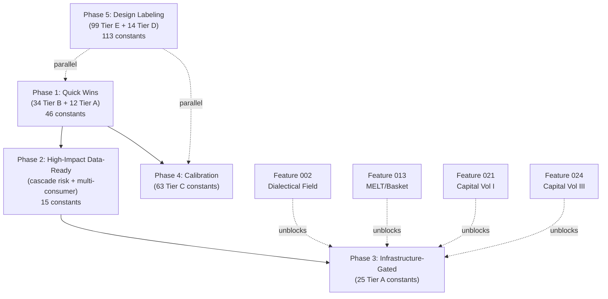

# Constants Remediation Plan

**Feature**: 027-constants-provenance-audit (FR-009)
**Date**: 2026-02-27
**Input documents**: constants-classification.md, constants-data-sources.md, constants-dependency-graph.md, constants-bourgeoisie-cluster.md, constants-territory-cluster.md, constants-inventory.yaml

## Executive Summary

247 constants were audited across `GameDefines` (136), `FormulaConstant` re-exports (2), and inline literals (109). This plan sequences their remediation into 5 phases ordered by impact, difficulty, and data readiness. The phases are designed so each can be completed independently except where explicit dependencies are noted.

### Tier Distribution

| Tier | Count | Remediation Action |
|------|-------|--------------------|
| A (Tensor-Derivable) | 37 | Replace with data-derived values |
| B (Eliminable) | 34 | Remove or consolidate |
| C (Calibration) | 63 | Parameter sweep optimization |
| D (Engineering) | 14 | Document and retain |
| E (Game Design) | 99 | Label as intentional design choices |

### Key Findings Driving Phase Order

1. **34 Tier B constants can be eliminated immediately** with zero behavioral change -- these are dead code, deprecated duplicates, or function-signature fallbacks mirroring GameDefines.
2. **12 Tier A constants have fully operational data pipelines** (pipeline_ready=Yes) and can be replaced by data-derived values today.
3. **4 cascade risk constants** (3 effective, since loss aversion is duplicated) affect 3+ consuming systems and require careful migration sequencing.
4. **ImperialRentSystem concentration**: 31 of 102 consumed constants (30.4%) flow into a single system. This is the primary impact zone for any remediation.
5. **13 coupled clusters** containing 54 constants must be addressed as bundles, not individually.

---

## Phase 1: Quick Wins -- Eliminable Constants + Data-Ready Tier A

**Scope**: All 34 Tier B constants + 12 pipeline-ready Tier A constants
**Estimated effort**: Low (removal and wiring changes only, no new infrastructure)
**Dependencies**: None -- can start immediately
**Estimated constants addressed**: 46

### 1.1 Eliminate Dead/Duplicate Constants (Tier B -- 34 constants)

#### Group A: FormulaConstant Re-exports (2 constants)

These are duplicates of GameDefines values re-exported in `src/babylon/formulas/constants.py`. Consumers should import from `GameDefines` or accept via dependency injection.

| Constant ID | Value | Duplicates | File to Modify |
|-------------|-------|------------|----------------|
| `formulas.LOSS_AVERSION_COEFFICIENT` | 2.25 | `behavioral.loss_aversion_lambda` | `src/babylon/formulas/constants.py:17` |
| `formulas.EPSILON` | 1e-9 | `precision.epsilon` | `src/babylon/formulas/constants.py:21` |

**Consumer migration**: Both are consumed by formula functions (`fundamental_theorem.py:95`, `survival_calculus.py:58,103`, `ideological_routing.py:107`). These functions should accept the values as parameters injected by the calling system, or read directly from `GameDefines`.

**Lines changed**: ~8 (2 deletions in constants.py, ~6 parameter signature updates in formula functions).

#### Group B: Endgame Detector Deprecated Duplicates (5 constants)

Module-level constants in `src/babylon/engine/observers/endgame_detector.py` that duplicate `endgame.*` GameDefines:

| Constant ID | Value | Duplicates | Line |
|-------------|-------|------------|------|
| `endgame_detector:53:PERCOLATION_THRESHOLD` | 0.7 | `endgame.revolutionary_percolation_threshold` | 53 |
| `endgame_detector:54:CONSCIOUSNESS_THRESHOLD` | 0.8 | `endgame.revolutionary_consciousness_threshold` | 54 |
| `endgame_detector:57:OVERSHOOT_THRESHOLD` | 2.0 | `endgame.ecological_overshoot_threshold` | 57 |
| `endgame_detector:58:OVERSHOOT_CONSECUTIVE` | 5 | `endgame.ecological_sustained_ticks` | 58 |
| `endgame_detector:61:FASCIST_NODES` | 3 | `endgame.fascist_majority_threshold` | 61 |

**Action**: Delete the 5 module-level constants. The `EndgameDetector` class already reads from `GameDefines` via `self._defines` (lines 275, 297, 336, 341, 371). The module-level duplicates are unused vestiges.

**Lines changed**: ~5 deletions in `src/babylon/engine/observers/endgame_detector.py`.

#### Group C: Dynamic Balance Fallback Defaults (10 constants)

Function parameter defaults in `src/babylon/formulas/dynamic_balance.py:28-39` that duplicate the 10 bourgeoisie policy constants:

| Constant ID | Value | Duplicates | Line |
|-------------|-------|------------|------|
| `dynamic_balance:28:high_threshold` | 0.7 | `economy.pool_high_threshold` | 28 |
| `dynamic_balance:29:low_threshold` | 0.3 | `economy.pool_low_threshold` | 29 |
| `dynamic_balance:30:critical_threshold` | 0.1 | `economy.pool_critical_threshold` | 30 |
| `dynamic_balance:32:bribery_delta` | 0.05 | `economy.bribery_wage_delta` | 32 |
| `dynamic_balance:33:austerity_delta` | -0.05 | `economy.austerity_wage_delta` | 33 |
| `dynamic_balance:34:iron_fist_delta` | 0.1 | `economy.iron_fist_repression_delta` | 34 |
| `dynamic_balance:35:crisis_wage_delta` | -0.15 | `economy.crisis_wage_delta` | 35 |
| `dynamic_balance:36:crisis_repr_delta` | 0.2 | `economy.crisis_repression_delta` | 36 |
| `dynamic_balance:38:bribery_tension` | 0.3 | `economy.bribery_tension_threshold` | 38 |
| `dynamic_balance:39:iron_fist_tension` | 0.5 | `economy.iron_fist_tension_threshold` | 39 |

**Action**: Remove default values from function signature. `ImperialRentSystem._process_decision_phase` (the sole caller) always passes explicit values. Tests calling `calculate_bourgeoisie_decision()` directly should pass values explicitly.

**Lines changed**: ~10 in `src/babylon/formulas/dynamic_balance.py`, ~5-10 in test files.

#### Group D: Topology Monitor Module Constants (7 constants)

Module-level constants in `src/babylon/engine/topology_monitor.py:55-65`:

| Constant ID | Value | Line |
|-------------|-------|------|
| `topology_monitor:55:GASEOUS_THRESHOLD` | 0.1 | 55 |
| `topology_monitor:56:CONDENSATION_THRESHOLD` | 0.5 | 56 |
| `topology_monitor:57:BRITTLE_MULTIPLIER` | 2 | 57 |
| `topology_monitor:60:POTENTIAL_MIN_STRENGTH` | 0.1 | 60 |
| `topology_monitor:61:ACTUAL_MIN_STRENGTH` | 0.5 | 61 |
| `topology_monitor:64:DEFAULT_REMOVAL_RATE` | 0.2 | 64 |
| `topology_monitor:65:DEFAULT_SURVIVAL_THRESHOLD` | 0.4 | 65 |

**Action**: `GASEOUS_THRESHOLD` and `CONDENSATION_THRESHOLD` duplicate `topology.*` GameDefines. Remove them and have `TopologyMonitor.__init__` read from GameDefines. The remaining 5 are TopologyMonitor-specific analysis parameters -- consolidate into the `TopologyMonitor` class as configurable constructor parameters rather than module-level magic constants.

**Lines changed**: ~15 in `src/babylon/engine/topology_monitor.py`.

#### Group E: Metrics Observer Fallbacks (5 constants)

Inline fallback values in `src/babylon/engine/observers/metrics.py`:

| Constant ID | Value | Line |
|-------------|-------|------|
| `metrics:41:DEATH_THRESHOLD` | 0.001 | 41 |
| `metrics:264:fallback_wage_rate` | 0.2 | 264 |
| `metrics:265:fallback_repression` | 0.5 | 265 |
| `metrics:266:fallback_pool_ratio` | 1.0 | 266 |
| `metrics:270:pool_divisor` | 100.0 | 270 |

**Action**: `DEATH_THRESHOLD` duplicates `economy.death_threshold`. `fallback_wage_rate` duplicates `economy.super_wage_rate`. `fallback_repression` duplicates `survival.default_repression`. `fallback_pool_ratio` is 1.0 (identity). `pool_divisor` duplicates `economy.initial_rent_pool`. Replace all with GameDefines references.

**Lines changed**: ~10 in `src/babylon/engine/observers/metrics.py`.

#### Group F: Formula Module Fallback Defaults (5 constants)

| Constant ID | Value | Duplicates | File:Line |
|-------------|-------|------------|-----------|
| `solidarity:14:activation_default` | 0.3 | `solidarity.activation_threshold` | `formulas/solidarity.py:14` |
| `metabolic_rift:14:entropy_default` | 1.2 | `metabolism.entropy_factor` | `formulas/metabolic_rift.py:14` |
| `metabolic_rift:59:max_ratio_default` | 999.0 | `metabolism.max_overshoot_ratio` | `formulas/metabolic_rift.py:59` |
| `curvature:32:alpha_default` | 0.5 | `contradiction_field.curvature_alpha` | `formulas/curvature.py:32` |
| `trpf:25:efficiency_floor` | 0.1 | `economy.trpf_efficiency_floor` | `formulas/trpf.py:25` |

**Action**: Remove inline defaults; require callers to pass explicit values from GameDefines.

**Lines changed**: ~10 across 4 formula files.

### 1.2 Replace Data-Ready Tier A Constants (12 constants)

These Tier A constants have fully implemented adapter pipelines (pipeline_ready=Yes).

#### Subgroup 1: Tick Initializer Class Shares (8 constants)

All adapters exist: `CensusLoader`, `SQLiteQCEWSource`, `FredAPIClient`, `MarxianHydrator`.

| Constant ID | Value | Data Source | Adapter | File:Line |
|-------------|-------|------------|---------|-----------|
| `tick_init:32:share_bourgeoisie` | 0.01 | Census/ACS + QCEW | `CensusLoader` + `SQLiteQCEWSource` | `economics/tick/initializer.py:32` |
| `tick_init:33:share_petit_b` | 0.09 | Census/ACS + QCEW | Same | `economics/tick/initializer.py:33` |
| `tick_init:34:share_la` | 0.40 | Census/ACS + QCEW | Same | `economics/tick/initializer.py:34` |
| `tick_init:35:share_proletariat` | 0.35 | Census/ACS + QCEW | Same | `economics/tick/initializer.py:35` |
| `tick_init:36:share_lumpen` | 0.15 | Census/ACS + QCEW | Same | `economics/tick/initializer.py:36` |
| `tick_init:39:unemployment_rate` | 0.05 | FRED (UNRATE) | `FredAPIClient` | `economics/tick/initializer.py:39` |
| `tick_init:43:median_wage` | 21.0 | QCEW / BLS OES | `SQLiteQCEWSource` | `economics/tick/initializer.py:43` |
| `tick_init:108:tau_default` | 62.0 | BEA (MELT) | `MarxianHydrator` | `economics/tick/initializer.py:108` |

**Action**: Wire the `TickInitializer` to read from existing data adapters at initialization time, with the current hardcoded values as fallbacks when data is unavailable.

#### Subgroup 2: Shadow Wage + Extraction Efficiency (2 constants)

| Constant ID | Value | Data Source | Adapter |
|-------------|-------|------------|---------|
| `economy.shadow_wage_hourly` | 15.43 | BLS OES (SOC 31-1120) | `ATUSDBLoader.get_shadow_wage()` at `data/atus/db_loader.py:179` |
| `economy.extraction_efficiency` | 0.8 | QCEW + BEA | `MarxianHydrator.hydrate()` at `economics/hydrator.py:36` |

**Action**: `shadow_wage_hourly` already has a dedicated adapter method. Wire it to load at startup. `extraction_efficiency` is derivable from ValueTensor4x3 exploitation_rate. Both are high-impact (extraction_efficiency has 2 consumers in ImperialRentSystem).

#### Subgroup 3: Gamma Care Fractions (3 constants -- pipeline_ready=Yes via ATUS)

| Constant ID | Value | Adapter |
|-------------|-------|---------|
| `gamma_adapters:40:care_fraction_61` | 0.6 | `QCEWCareAdapter` at `economics/gamma/adapters.py:68` |
| `gamma_adapters:41:care_fraction_62` | 0.3 | Same |
| `gamma_adapters:42:care_fraction_814` | 1.0 | Same |

**Action**: Wire care fractions to read from ATUS time-use data decomposition. The `QCEWCareAdapter` already provides the infrastructure.

---

## Phase 2: High-Impact Data-Ready -- Cascade Risk Tier A

**Scope**: Tier A constants with 2+ consumers AND existing adapter coverage
**Estimated effort**: Medium
**Dependencies**: Phase 1 (eliminate duplicates first to reduce consumer count confusion)
**Estimated constants addressed**: 15

### 2.1 Cascade Risk Constants (3 effective constants)

These constants have 3+ consumers across multiple systems. Migration requires coordinated changes.

#### `behavioral.loss_aversion_lambda` (weighted score: 3.0)

- **Value**: 2.25 (Kahneman-Tversky, 1979)
- **Consumers**: `calculate_consciousness_drift` (fundamental_theorem.py:95), `apply_loss_aversion` (survival_calculus.py:103), `calculate_ideological_routing` (ideological_routing.py:107)
- **Tier**: A (empirical literature constant)
- **Migration strategy**: Phase 1 eliminates the duplicate `formulas.LOSS_AVERSION_COEFFICIENT`. After that, the 3 formula functions should accept `loss_aversion_lambda` as an explicit parameter (dependency injection). The value 2.25 is empirically fixed (peer-reviewed) and does not need data pipeline derivation, but the access pattern should be through GameDefines, not a hardcoded import.
- **Files to modify**: `src/babylon/formulas/fundamental_theorem.py`, `src/babylon/formulas/survival_calculus.py`, `src/babylon/formulas/ideological_routing.py`

#### `timescale.weeks_per_year` (weighted score: 3.0)

- **Value**: 52 (calendar weeks per year)
- **Consumers**: `ImperialRentSystem._process_extraction_phase` (economic.py:162), `ImperialRentSystem._process_wages_phase` (economic.py:327), `ProductionSystem.step` (production.py:100)
- **Tier**: D (physical/definitional constant)
- **Migration strategy**: Value is definitionally fixed. Risk is in access pattern, not value change. Ensure all 3 consumers read from `GameDefines.timescale.weeks_per_year` via the `ServiceContainer`, not a module import. No behavioral change.
- **Files to modify**: `src/babylon/engine/systems/economic.py`, `src/babylon/engine/systems/production.py`

#### `survival.default_repression` (weighted score: 1.3, 4 consumers)

- **Value**: 0.5
- **Consumers**: `SurvivalSystem.step` (survival.py:127, deprecated), `ImperialRentSystem._process_subsidy_phase` (economic.py:485, deprecated), `ImperialRentSystem._load_economy` (economic.py:711, direct), `StruggleSystem._process_agency` (struggle.py:308, deprecated)
- **Migration strategy**: **Remove 3 deprecated fallbacks first**. These deprecated usages exist because systems fall back to `default_repression` when the graph node does not have a `repression_level` attribute. The proper fix is to ensure `repression_level` is always present on nodes after initialization. Once deprecated paths are removed, this becomes a single-consumer constant (low risk).
- **Files to modify**: `src/babylon/engine/systems/survival.py`, `src/babylon/engine/systems/economic.py`, `src/babylon/engine/systems/struggle.py`

### 2.2 Multi-Consumer Tier A Constants with Existing Adapters (12 constants)

These constants have 2 consumers and existing data pipeline infrastructure.

| Constant ID | Value | Consumers | Adapter | Pipeline Ready |
|-------------|-------|-----------|---------|----------------|
| `economy.extraction_efficiency` | 0.8 | ImperialRentSystem (2x) | `MarxianHydrator` | Yes |
| `economy.initial_rent_pool` | 100.0 | ImperialRentSystem (2x) | `InterpolatingBEASource` | Partial |
| `economy.negligible_rent` | 0.01 | ImperialRentSystem (2x) | N/A (performance guard) | N/A |
| `economy.superwage_multiplier` | 1.0 | ImperialRentSystem + apply_scenario | PWT (not implemented) | No |
| `economy.base_subsistence` | 0.0005 | ImperialRentSystem + VitalitySystem | `CensusAPIClient` + `FredAPIClient` | Yes |
| `survival.steepness_k` | 10.0 | SurvivalSystem + ImperialRentSystem | N/A (calibration) | N/A |
| `survival.default_subsistence` | 0.3 | SurvivalSystem + ImperialRentSystem (deprecated) | N/A (calibration) | N/A |
| `survival.default_organization` | 0.1 | SurvivalSystem (deprecated) + ImperialRentSystem (deprecated) | N/A | N/A |
| `solidarity.activation_threshold` | 0.3 | SolidaritySystem + ConsciousnessSystem | N/A (calibration) | N/A |
| `economy.min_wage_rate` | 0.05 | ImperialRentSystem | `SQLiteQCEWSource` + `InterpolatingBEASource` | Yes |
| `economy.max_wage_rate` | 0.35 | ImperialRentSystem | `SQLiteQCEWSource` + `InterpolatingBEASource` | Yes |
| `reserve_army.sigmoid_r0` | 0.08 | DefaultWagePressureCalculator | `FredAPIClient` (UNRATE) | Yes |

**Action for data-ready constants**: Wire `economy.base_subsistence`, `economy.min_wage_rate`, `economy.max_wage_rate`, and `reserve_army.sigmoid_r0` to their existing adapters. These have both existing infrastructure and multiple consumers, making them high-value targets.

**Action for deprecated-consumer constants**: `survival.default_subsistence`, `survival.default_organization`, and `solidarity.activation_threshold` have deprecated consumers that should be removed (graph-read pattern replacement), reducing them to single-consumer constants addressable in Phase 4.

---

## Phase 3: Infrastructure-Gated -- Tier A Requiring Planned Features

**Scope**: Tier A constants where derivation requires infrastructure from Features 002, 013, 021, or 024
**Estimated effort**: Medium-High (blocked until upstream features land)
**Dependencies**: Specific features per subsection
**Estimated constants addressed**: 25

### 3.1 Feature 002 Gated -- Territory Heat Dynamics (3 constants)

From the territory cluster sub-report: these constants are derivable from the dialectical contradiction field system.

| Constant ID | Value | Feature 002 Mechanism | Consumer |
|-------------|-------|-----------------------|----------|
| `territory.heat_decay_rate` | 0.1 | Displacement field df/dt decay | TerritorySystem._process_heat (L118) |
| `territory.high_profile_heat_gain` | 0.15 | Laplacian-driven accumulation at pressure peaks | TerritorySystem._process_heat (L119) |
| `territory.heat_spillover_rate` | 0.05 | Graph Laplacian diffusion operator | TerritorySystem._process_spillover (L286) |

**Blocking**: Feature 002 US1 (field computation) and US2 (spatial derivatives) must be implemented.

**Migration path**: When Feature 002 lands, `TerritorySystem._process_heat_dynamics` reads displacement field values from `ContradictionFieldSystem` output instead of applying flat constants. `_process_spillover` is replaced entirely by the Laplacian diffusion operator.

**Adapter to build**: `ContradictionFieldSystem` output -> `TerritorySystem` input protocol.

### 3.2 Feature 013 Gated -- Basket Visibility + Superwage (6 constants)

| Constant ID | Value | Required Adapter | File:Line |
|-------------|-------|-----------------|-----------|
| `economy.super_wage_rate` | 0.2 | PWT ERDI adapter | `config/defines.py:144` |
| `economy.superwage_multiplier` | 1.0 | PWT PPP adapter | `config/defines.py:150` |
| `economy.superwage_ppp_impact` | 0.5 | PWT + Census Trade | `config/defines.py:155` |
| `basket_vis:22:MVP_ALPHA` | 0.25 | Census Trade import share | `economics/melt/basket_visibility.py:22` |
| `basket_vis:23:MVP_GAMMA_IMPORT` | 0.35 | PWT trade-weighted ERDI | `economics/melt/basket_visibility.py:23` |
| `basket_vis:24:MVP_GAMMA_BASKET` | 0.68 | Computed from alpha + gamma_import | `economics/melt/basket_visibility.py:24` |

**Blocking**: PWT (Penn World Table) adapter and Census Trade adapter, both planned for Feature 013 (melt-basket-visibility).

**Adapters to build**: `PennWorldTableAdapter` (ERDI, PPP conversion), `CensusTradeAdapter` (import share).

### 3.3 Feature 021 Gated -- Reserve Army + Dispossession (16 constants)

#### Dispossession Weights (GameDefines -- 8 constants)

| Constant ID | Value | Required Adapter |
|-------------|-------|-----------------|
| `dispossession.weight_foreclosure` | 0.4 | US Courts + ATTOM/CoreLogic |
| `dispossession.weight_eviction` | 0.3 | Eviction Lab (loader exists, adapter gap) |
| `dispossession.weight_displacement` | 0.15 | Census/ACS (mobility data) |
| `dispossession.weight_tax_sale` | 0.05 | US Courts |
| `dispossession.weight_eminent_domain` | 0.02 | US Courts |
| `dispossession.weight_wage_theft` | 0.03 | BLS via QCEW |
| `dispossession.weight_incarceration_seizure` | 0.03 | HIFLD + US Courts |
| `dispossession.weight_pension_default` | 0.02 | Fed Z.1 |

**Note**: `weight_wage_theft`, `weight_incarceration_seizure`, and `weight_pension_default` have **zero consumers** -- they are defined but not wired into `DispossessionIntensityCalculator`. Phase 3 should wire them before calibrating the full weight vector.

#### Dispossession Dynamics Weights (Inline -- 6 constants)

| Constant ID | Value | File:Line |
|-------------|-------|-----------|
| `dispossession_dyn:30:fc_weight_la_p` | 0.6 | `economics/dynamics/dispossession.py:30` |
| `dispossession_dyn:31:bk_weight_la_p` | 0.3 | Same:31 |
| `dispossession_dyn:32:ev_weight_la_p` | 0.1 | Same:32 |
| `dispossession_dyn:33:fc_weight_p_l` | 0.1 | Same:33 |
| `dispossession_dyn:34:bk_weight_p_l` | 0.3 | Same:34 |
| `dispossession_dyn:35:ev_weight_p_l` | 0.6 | Same:35 |

**Blocking**: Eviction Lab adapter wiring (`EvictionLabLoader` exists but is not connected to `DispossessionDataSource` protocol), US Courts adapter, ATTOM/CoreLogic adapter.

**Quick win within Phase 3**: Wire `EvictionLabLoader` output to `DispossessionIntensityCalculator` (loader exists, adapter gap is small).

#### Carceral Constants (3 constants)

| Constant ID | Value | Required Adapter |
|-------------|-------|-----------------|
| `carceral.control_capacity` | 4 | HIFLD Prisons (loader exists, ratio formula needed) |
| `carceral.enforcer_fraction` | 0.15 | HIFLD Police + Census (loaders exist, decomposition formula needed) |
| `carceral.proletariat_fraction` | 0.85 | Same (complement of enforcer_fraction) |

**Blocking**: Feature 021 must implement the ratio derivation formulas using existing HIFLD loaders.

### 3.4 Feature 024 Gated -- Financial Data (4 constants)

| Constant ID | Value | Required Adapter | File:Line |
|-------------|-------|-----------------|-----------|
| `economy.comprador_cut` | 0.9 | BEA + Piketty/WID | `config/defines.py:129` |
| `savings_schedule:24-28` (5 rates) | 0.38-0.0 | Fed SCF direct adapter | `economics/dynamics/savings_schedule.py:24-28` |
| `accumulation:26:scf_threshold` | 142000.0 | Fed SCF | `economics/dynamics/accumulation.py:26` |
| `dispossession.weight_pension_default` | 0.02 | Fed Z.1 | `config/defines.py:1256` |

**Blocking**: Feature 024 (Capital Volume III) must implement Fed SCF direct data loader, Piketty/WID adapter, and Fed Z.1 adapter.

### 3.5 Unblocked but Needing Derivation Formulas (4 constants)

These constants have existing adapters but need derivation logic built:

| Constant ID | Value | Adapter Exists | Formula Needed |
|-------------|-------|----------------|----------------|
| `economy.trpf_coefficient` | 0.0005 | `InterpolatingBEASource` + `FredAPIClient` | Regression on historical profit rate trend |
| `reserve_army.wage_pressure_ceiling` | 0.5 | `FredAPIClient` + `SQLiteQCEWSource` | Historical extrema analysis |
| `economy.base_subsistence` | 0.0005 | `CensusAPIClient` + `FredAPIClient` | ACS poverty threshold / CPI / tick conversion |
| `reproduction:63:externalization` | 0.2 | `MVPUnpaidCareHoursSource` | ATUS externalization ratio formula |

**Action**: These can proceed in parallel with Feature 002/021/024 since their adapters already exist. The blocker is a derivation formula, not infrastructure.

---

## Phase 4: Calibration-Only -- Parameter Sweep Optimization

**Scope**: 63 Tier C constants (calibration parameters)
**Estimated effort**: Medium (configuration + sweep execution, no new adapters)
**Dependencies**: Phase 1 (reduce noise from eliminated constants)
**Estimated constants addressed**: 63

### 4.1 Constants Already in Optuna Search Space

These constants have `ge`/`le` bounds in their `Field()` definitions and are introspectable by `tools/shared.py:get_tunable_parameters()`. Verify which are already in `tools/tune_agent.py:OPTIMIZATION_BOUNDS`:

**Crisis subsection (11 constants)**:
`crisis.crisis_period_ticks` [4,26], `crisis.r_threshold` [0.01,0.10], `crisis.n_consecutive` [2,6], `crisis.m_recovery` [1,4], `crisis.r_cap` [4,16], `crisis.hysteresis_coefficient` [0.1,0.9], `crisis.wage_compression_rate` [0.005,0.05], `crisis.wage_compression_floor_ratio` [0.5,0.95], `crisis.bifurcation_solidarity_weight` [0.5,2.0], `crisis.bifurcation_burden_weight` [0.5,2.0], `crisis.bifurcation_event_threshold` [0.3,0.8]

**Economy thresholds (17 constants)**:
`economy.pool_high_threshold` [0.5,0.9], `economy.pool_low_threshold` [0.2,0.5], `economy.pool_critical_threshold` [0.05,0.2], `economy.subsidy_conversion_rate` [0.01,0.3], `economy.subsidy_trigger_threshold` [0.5,1.0], `economy.negligible_rent` [0.001,0.05], `economy.negligible_subsidy` [0.001,0.05], `economy.rent_pool_decay` [0.0005,0.01], `economy.bribery_wage_delta` [0.01,0.10], `economy.austerity_wage_delta` [-0.10,-0.01], `economy.iron_fist_repression_delta` [0.05,0.20], `economy.crisis_wage_delta` [-0.25,-0.05], `economy.crisis_repression_delta` [0.10,0.35], `economy.bribery_tension_threshold` [0.1,0.5], `economy.iron_fist_tension_threshold` [0.3,0.7], `economy.death_threshold` [0.0001,0.01], `economy.base_labor_power` [0.5,2.0]

**Survival subsection (6 constants)**:
`survival.steepness_k` [5.0,20.0], `survival.default_subsistence` [0.1,0.5], `survival.default_organization` [0.01,0.3], `survival.default_repression` [0.2,0.8], `survival.revolution_threshold` [0.5,2.0], `survival.repression_base` [0.1,1.0]

**Territory subsection (4 constants -- active Tier C from territory cluster)**:
`territory.eviction_heat_threshold` [0.5,0.95], `territory.rent_spike_multiplier` [1.1,3.0], `territory.displacement_rate` [0.01,0.3], `territory.concentration_camp_decay_rate` [0.05,0.5]

**Topology subsection (3 constants)**:
`topology.gaseous_threshold` [0.05,0.2], `topology.condensation_threshold` [0.3,0.7], `topology.vanguard_density_threshold` [0.3,0.8]

**Solidarity subsection (4 constants)**:
`solidarity.scaling_factor` [0.1,1.0], `solidarity.activation_threshold` [0.1,0.5], `solidarity.mass_awakening_threshold` [0.4,0.8], `solidarity.negligible_transmission` [0.001,0.05]

**Consciousness subsection (2 constants)**:
`consciousness.sensitivity` [0.1,1.0], `consciousness.decay_lambda` [0.01,0.3]

**Tension subsection (1 constant)**:
`tension.accumulation_rate` [0.01,0.15]

**Community subsection (6 constants)**:
`community.heat_decay_alpha` [0.01,0.15], `community.cohesion_decay_alpha` [0.01,0.10], `community.infrastructure_decay_alpha` [0.01,0.10], `community.community_overlap_bonus` [0.01,0.3], `community.rent_differential_penalty` [0.01,0.15], `community.core_organizer_maintenance_factor` [0.01,0.3]

**Reserve army subsection (1 constant)**:
`reserve_army.sigmoid_k` [5.0,40.0]

**Contradiction field subsection (4 constants)**:
`contradiction_field.curvature_alpha` [0.1,0.9], `contradiction_field.co_optive_suppression_rate` [0.5,1.0], `contradiction_field.latent_release_multiplier` [1.0,3.0], `contradiction_field.history_window` [2,10]

### 4.2 Calibration as Coupled Clusters

From the dependency graph, these clusters MUST be calibrated together:

| Cluster | Size | Shared Consumer | Constraint |
|---------|------|-----------------|------------|
| Bourgeoisie Policy | 10 | `_process_decision_phase` | `critical < low < high`, `bribery_tension < iron_fist_tension` |
| Crisis Detection | 5 | `_run_crisis_detection` | `n_consecutive < r_cap` |
| Bifurcation Risk | 4 | `_run_bifurcation_risk` | Weights must be positive |
| George Floyd Dynamic | 4 | `_process_agency` | `resistance_threshold <= spark_probability_scale` |
| Community Decay | 4 | `_apply_decay` | Relative ordering: heat > infra > cohesion |
| Territory Eviction Pipeline | 3 | `_process_eviction` | threshold triggers pipeline, multiplier/rate are effects |
| Percolation Thresholds | 3 | `TopologyMonitor.__init__` | `gaseous < condensation <= vanguard_density` |
| Metabolism | 3 | `MetabolismSystem.step` | `entropy_factor > 1.0` |
| Reserve Army Sigmoid | 3 | `compute_wage_pressure` | `sigmoid_r0` is inflection point |
| Survival Defaults | 3 | SurvivalSystem + ImperialRentSystem | After deprecated paths removed |

### 4.3 Calibration Tooling Commands

```bash
# Step 1: Morris screening to rank parameter importance
mise run tune:morris 20

# Step 2: 2D landscape for coupled cluster interactions
mise run tune:landscape economy.pool_high_threshold 0.5 0.9 economy.pool_low_threshold 0.1 0.5

# Step 3: Sobol variance decomposition for coupled clusters
mise run tune:sobol 512

# Step 4: Bayesian optimization with all calibration parameters
mise run tune:optuna 200
```

### 4.4 Edge Transition Thresholds (16 inline constants)

These 16 constants in `src/babylon/engine/systems/edge_transition.py` define the dialectical edge state machine transition conditions:

| Constant ID | Value | Purpose |
|-------------|-------|---------|
| `edge_transition:103:extraction_contested` | 5.0 | Exploitation threshold |
| `edge_transition:128:extraction_broken` | 2.0 | Exploitation threshold |
| `edge_transition:147:concessions_offered` | 3.0 | Exploitation threshold |
| `edge_transition:171:mutual_aid_src` | 2.0 | Exploitation threshold (source) |
| `edge_transition:197:market_failure` | 1.0 | Immiseration df_dt |
| `edge_transition:214:power_asymmetry` | 5.0 | Exploitation threshold |
| `edge_transition:233:co_optive_power` | 3.0 | Imperial rent threshold |
| `edge_transition:252:solidarity_degrades` | 6.0 | Immiseration threshold |
| `edge_transition:271:betrayal` | 3.0 | Exploitation df_dt |
| `edge_transition:296:conflict_resolved` | 3.0 | Exploitation value |
| `edge_transition:314:shared_enemy_src` | 7.0 | Exploitation threshold (source) |
| `edge_transition:339:reform_concession` | 3.0 | Imperial rent threshold |
| `edge_transition:367:co_opt_normalizes` | 2.0 | Exploitation threshold |
| `edge_transition:392:co_opt_breakdown` | 1.0 | Exploitation df_dt |
| `edge_transition:411:co_opt_recognized_src` | 5.0 | Exploitation threshold (source) |
| `edge_transition:434:concessions_withdrawn` | 1.0 | Imperial rent threshold |

**Action**: Centralize into a `EdgeTransitionDefines` section in GameDefines to make them visible to parameter sweep tooling. Then calibrate as a coherent set -- these thresholds define when edges transition between dialectical states, and they must maintain relative ordering.

### 4.5 Inline Constants Requiring Centralization First

The following inline constants are NOT yet in GameDefines and must be centralized before calibration:

| Constant ID | Value | File |
|-------------|-------|------|
| `ideological_routing:39:routing_scale` | 0.1 | `formulas/ideological_routing.py` |
| `ideological_routing:82:decay_rate` | 0.1 | `formulas/ideological_routing.py` |
| `vitality:42:attrition_base` | 0.5 | `formulas/vitality.py` |
| `class_dynamics:187:beta_default` | -0.1 | `formulas/class_dynamics.py` |
| `class_dynamics:188:omega_default` | 0.05 | `formulas/class_dynamics.py` |
| `struggle:370:consciousness_mult` | 0.5 | `engine/systems/struggle.py` |
| `community_sys:156:heat_increase` | 0.3 | `engine/systems/community.py` |
| `community_sys:174:cohesion_reduce` | 0.2 | `engine/systems/community.py` |
| `community_sys:191:infra_reduce` | 0.4 | `engine/systems/community.py` |
| `dispossession_events:91:scale_factor` | 0.01 | `engine/systems/dispossession_events.py` |
| `savings_schedule:32:phi_cap` | 0.05 | `economics/dynamics/savings_schedule.py` |
| `crisis_dyn:20:amplifier_default` | 2.5 | `economics/dynamics/crisis.py` |
| `crisis_dyn:21:dampener_default` | 0.3 | `economics/dynamics/crisis.py` |
| `class_dynamics:289:target_pct` | 33.333 | `formulas/class_dynamics.py` |

**Action**: Move to GameDefines with appropriate `Field(ge=..., le=...)` bounds before including in parameter sweep.

---

## Phase 5: Acknowledged Design -- Tier E Relabeling + Tier D Documentation

**Scope**: 99 Tier E constants (game design knobs) + 14 Tier D constants (engineering)
**Estimated effort**: Low (documentation changes only, no behavioral change)
**Dependencies**: None -- can run in parallel with all other phases
**Estimated constants addressed**: 113

### 5.1 Tier E: Game Design Constants (99 constants)

For each Tier E constant, ensure the `Field(description=...)` in `GameDefines` explicitly states that the value is an intentional game design choice, not a data-derived parameter.

**Pattern**:
```python
# BEFORE
spark_probability_scale: float = Field(default=0.1, ge=0.0, le=1.0)

# AFTER
spark_probability_scale: float = Field(
    default=0.1, ge=0.0, le=1.0,
    description="Game design: base 10% chance for EXCESSIVE_FORCE. "
                "Controls uprising frequency. Not data-derived."
)
```

**GameDefines Tier E constants by subsection**:

| Subsection | Count | Constants |
|-----------|-------|-----------|
| struggle.* | 8 | spark_probability_scale, resistance_threshold, wealth_destruction_rate, solidarity_gain_per_uprising, jackson_threshold, revolutionary_agitation_boost, fascist_identity_boost, fascist_acquiescence_boost |
| endgame.* | 5 | revolutionary_percolation_threshold, revolutionary_consciousness_threshold, ecological_overshoot_threshold, ecological_sustained_ticks, fascist_majority_threshold |
| carceral.* | 4 | revolution_threshold, decomposition_delay, control_ratio_delay, terminal_decision_delay |
| working_day.* | 6 | absolute_hours_threshold, relative_hours_threshold, intensity_threshold_high, intensity_threshold_low, absolute_visibility, relative_visibility |
| vitality.inequality_impact | 1 | Full inequality effect |
| solidarity.superwage_impact | 1 | Full extraction impact |
| initial.* | 3 | worker_wealth, owner_wealth, default_population |

**Inline Tier E constants (45)**: These are inline literals in formula and system modules that represent game design choices. For each, add a comment explaining the design rationale:

- Class dynamics extraction rates (`class_dynamics:58-63`, 6 constants)
- Class dynamics redistribution rates (`class_dynamics:66-68`, 3 constants)
- Imperial rent formation rate (`class_dynamics:71:gamma_3`)
- Crisis dynamics amplifier/dampener (`crisis_dyn:20-21`, 2 constants)
- Community system action magnitudes (`community_sys:156,174,191`, 3 constants)
- Struggle consciousness multiplier (`struggle:370`)
- And remaining inline game design constants

### 5.2 Tier D: Engineering Constants (14 constants)

For each Tier D constant, document the engineering constraint that determines its value:

| Constant ID | Value | Constraint to Document |
|-------------|-------|----------------------|
| `precision.decimal_places` | 6 | Quantization grid = 1e-6. Must match Pydantic validator precision. |
| `precision.epsilon` | 1e-9 | Division-by-zero guard. Must satisfy: epsilon < 10^-decimal_places |
| `precision.comparison_epsilon` | 1e-10 | Float equality tolerance. Must satisfy: comparison_epsilon < epsilon |
| `crisis.class_burden_epsilon` | 0.001 | Burden ratio guard. Must satisfy: epsilon < class_burden < grid_step |
| `formulas.EPSILON` | 1e-9 | **Tier B duplicate** (addressed in Phase 1) |
| `distribution:25:EPSILON` | 1e-9 | Surplus identity verification guard |
| `survival_calculus:36:exp_clamp_low` | -500 | Prevents `math.exp()` overflow. Must satisfy: exp(-500) > 0 |
| `survival_calculus:36:exp_clamp_high` | 500 | Prevents `math.exp()` overflow. Must satisfy: exp(500) < float_max |
| `contradiction_field.field_min` | 0.0 | Normalized field lower bound. Structurally fixed. |
| `contradiction_field.field_max` | 10.0 | Normalized field upper bound. Scale factor. |
| `contradiction_field.default_transition_priority` | 0 | Default ordering value. Structural. |
| `metabolism.max_overshoot_ratio` | 999.0 | Sentinel cap for depleted biocapacity |
| `metabolic_rift:59:max_ratio_default` | 999.0 | **Tier B duplicate** (addressed in Phase 1) |
| `reserve_army.min_employed_fraction` | 0.01 | Labor force floor > 0 to prevent division by zero |
| `timescale.tick_duration_days` | 7 | Structural: 1 tick = 1 week. Fixed by game design. |
| `timescale.weeks_per_year` | 52 | Structural: 52 weeks/year. Physical constant. |
| `metrics:59:rolling_window` | 50 | Buffer size engineering choice |

---

## FR-013 Compliance: Magic Constant Replacement Audit

Any remediation that replaces one hardcoded value with another hardcoded value is NOT compliant with FR-013 (No Magic Constants). The following checks must be applied:

### Compliant Replacement Patterns

- Replacing `0.8` with `tensor.exploitation_rate` (data-derived)
- Replacing `0.05` with `GameDefines.economy.negligible_subsidy` (centralized, sweepable)
- Replacing `15.43` with `atus_loader.get_shadow_wage(soc="31-1120")` (data-derived)

### Non-Compliant Patterns to Flag

- Replacing hardcoded `0.8` with hardcoded `0.75` (still magic)
- Replacing inline `0.3` with a named constant `ACTIVATION_THRESHOLD = 0.3` without adding it to GameDefines (still not sweepable)
- Introducing new normalization bounds during formula refactoring without adding them to the appropriate Tier

### Phase-Specific FR-013 Risks

| Phase | Risk | Mitigation |
|-------|------|------------|
| Phase 1 | Eliminating formula defaults may introduce new fallback patterns | All callers must pass explicit values; no new defaults |
| Phase 2 | Data pipeline fallbacks may introduce new magic constants for "data unavailable" cases | Use `NoDataSentinel` pattern, not numeric fallbacks |
| Phase 3 | New adapter wiring may introduce conversion constants | Any unit conversion factor must be traceable to a documented source |
| Phase 4 | Calibrated values replacing defaults are still constants | Calibrated values must be written to `defines.yaml`, not hardcoded |
| Phase 5 | Relabeling does not change values | No FR-013 risk |

---

## Cross-Phase Dependencies



**Critical path**: Phase 1 -> Phase 2 -> Phase 3 (gated by external features)

**Parallel track**: Phase 5 can proceed at any time

**Phase 4 timing**: After Phase 1 eliminates noise, but can overlap with Phase 2

---

## Recommended First Follow-Up Feature

**Recommendation**: Scope a follow-up feature targeting **Phase 1 + Phase 2.1** as a single unit of work.

**Rationale**:
- **Highest impact**: Eliminates 34 duplicate/dead constants and consolidates the 3 cascade-risk constants, reducing the total constant surface area by 15%.
- **Lowest effort**: All changes are removal or access-pattern changes. No new adapters, no new formulas, no new infrastructure.
- **Greatest data readiness**: The 12 pipeline-ready Tier A constants have all adapters already implemented and tested.
- **Risk reduction**: Removing the `formulas.LOSS_AVERSION_COEFFICIENT` / `behavioral.loss_aversion_lambda` duplication eliminates the highest-weighted cascade risk in the entire audit.
- **Measurable outcome**: After this feature, the audit would show 0 Tier B constants (down from 34), 3 fewer cascade-risk pairs, and 12 fewer inline magic numbers.

**Suggested feature name**: `028-constants-phase1-cleanup`
**Estimated scope**: ~30 files modified, ~100 lines removed, ~50 lines added (wiring changes)

---

## Appendix: Per-Constant Remediation Index

Every constant from the inventory mapped to its remediation phase.

### GameDefines Constants (136)

| constant_id | Tier | Phase | Action | Blocking Feature | Priority |
|-------------|------|-------|--------|-----------------|----------|
| `crisis.crisis_period_ticks` | C | 4 | Calibrate [4,26] | None | Medium |
| `crisis.r_threshold` | C | 4 | Calibrate [0.01,0.10] | None | Medium |
| `crisis.n_consecutive` | C | 4 | Calibrate [2,6] | None | Medium |
| `crisis.m_recovery` | C | 4 | Calibrate [1,4] | None | Medium |
| `crisis.r_cap` | C | 4 | Calibrate [4,16] | None | Medium |
| `crisis.hysteresis_coefficient` | C | 4 | Calibrate [0.1,0.9] | None | Medium |
| `crisis.wage_compression_rate` | C | 4 | Calibrate [0.005,0.05] | None | Medium |
| `crisis.wage_compression_floor_ratio` | C | 4 | Calibrate [0.5,0.95] | None | Medium |
| `crisis.bifurcation_solidarity_weight` | C | 4 | Calibrate [0.5,2.0] | None | Medium |
| `crisis.bifurcation_burden_weight` | C | 4 | Calibrate [0.5,2.0] | None | Medium |
| `crisis.class_burden_epsilon` | D | 5 | Document constraint | None | Low |
| `crisis.bifurcation_event_threshold` | C | 4 | Calibrate [0.3,0.8] | None | Medium |
| `economy.extraction_efficiency` | A | 1/2 | Replace via MarxianHydrator | None | High |
| `economy.comprador_cut` | A | 3 | Replace via BEA + WID | Feature 024 | Medium |
| `economy.base_labor_power` | C | 4 | Calibrate [0.5,2.0] | None | Low |
| `economy.super_wage_rate` | A | 3 | Replace via PWT ERDI | Feature 013 | Medium |
| `economy.superwage_multiplier` | A | 3 | Replace via PWT PPP | Feature 013 | Medium |
| `economy.superwage_ppp_impact` | A | 3 | Replace via PWT + Census Trade | Feature 013 | Medium |
| `economy.initial_rent_pool` | A | 3 | Replace via BEA + Census Trade | Feature 013 | Medium |
| `economy.pool_high_threshold` | C | 4 | Calibrate [0.5,0.9] | None | Medium |
| `economy.pool_low_threshold` | C | 4 | Calibrate [0.2,0.5] | None | Medium |
| `economy.pool_critical_threshold` | C | 4 | Calibrate [0.05,0.2] | None | Medium |
| `economy.min_wage_rate` | A | 2 | Replace via QCEW + BEA | None | High |
| `economy.max_wage_rate` | A | 2 | Replace via QCEW + BEA | None | High |
| `economy.subsidy_conversion_rate` | C | 4 | Calibrate [0.01,0.3] | None | Medium |
| `economy.subsidy_trigger_threshold` | C | 4 | Calibrate [0.5,1.0] | None | Medium |
| `economy.shadow_wage_hourly` | A | 1 | Replace via ATUSDBLoader | None | High |
| `economy.negligible_rent` | C | 4 | Calibrate [0.001,0.05] | None | Low |
| `economy.negligible_subsidy` | C | 4 | Calibrate [0.001,0.05] | None | Low |
| `economy.base_subsistence` | A | 2 | Replace via Census + FRED | None | High |
| `economy.death_threshold` | C | 4 | Calibrate [0.0001,0.01] | None | Low |
| `economy.trpf_coefficient` | A | 3 | Replace via BEA + FRED regression | None (formula needed) | Medium |
| `economy.rent_pool_decay` | C | 4 | Calibrate [0.0005,0.01] | None | Medium |
| `economy.bribery_wage_delta` | C | 4 | Calibrate [0.01,0.10] | None | Medium |
| `economy.austerity_wage_delta` | C | 4 | Calibrate [-0.10,-0.01] | None | Medium |
| `economy.iron_fist_repression_delta` | C | 4 | Calibrate [0.05,0.20] | None | Medium |
| `economy.crisis_wage_delta` | C | 4 | Calibrate [-0.25,-0.05] | None | Medium |
| `economy.crisis_repression_delta` | C | 4 | Calibrate [0.10,0.35] | None | Medium |
| `economy.bribery_tension_threshold` | C | 4 | Calibrate [0.1,0.5] | None | Medium |
| `economy.iron_fist_tension_threshold` | C | 4 | Calibrate [0.3,0.7] | None | Medium |
| `economy.trpf_efficiency_floor` | C | 4 | Calibrate | None | Low |
| `survival.steepness_k` | C | 4 | Calibrate [5.0,20.0] | None | Medium |
| `survival.default_subsistence` | C | 4 | Calibrate [0.1,0.5] | None | Medium |
| `survival.default_organization` | C | 4 | Calibrate [0.01,0.3]; remove deprecated consumers first | None | Medium |
| `survival.default_repression` | C | 2 | Remove 3 deprecated consumers, then calibrate | None | High |
| `survival.revolution_threshold` | E | 5 | Label as game design | None | Low |
| `survival.repression_base` | C | 4 | Calibrate [0.1,1.0] | None | Medium |
| `vitality.base_mortality_factor` | A | 3 | Replace via CDC WONDER | Feature 020 | Medium |
| `vitality.inequality_impact` | E | 5 | Label as game design | None | Low |
| `solidarity.scaling_factor` | C | 4 | Calibrate [0.1,1.0] | None | Medium |
| `solidarity.activation_threshold` | C | 4 | Calibrate [0.1,0.5] | None | Medium |
| `solidarity.mass_awakening_threshold` | C | 4 | Calibrate [0.4,0.8] | None | Medium |
| `solidarity.negligible_transmission` | C | 4 | Calibrate [0.001,0.05]; remove deprecated consumer | None | Low |
| `solidarity.superwage_impact` | E | 5 | Label as game design | None | Low |
| `behavioral.loss_aversion_lambda` | A | 2 | Consolidate (eliminate duplicate), document K-T source | None | High |
| `tension.accumulation_rate` | C | 4 | Calibrate [0.01,0.15] | None | Medium |
| `consciousness.sensitivity` | C | 4 | Calibrate [0.1,1.0] | None | Medium |
| `consciousness.decay_lambda` | C | 4 | Calibrate [0.01,0.3] | None | Medium |
| `territory.heat_decay_rate` | A | 3 | Replace via contradiction field | Feature 002 | Medium |
| `territory.high_profile_heat_gain` | A | 3 | Replace via Laplacian accumulation | Feature 002 | Medium |
| `territory.eviction_heat_threshold` | C | 4 | Calibrate [0.5,0.95] | None | Medium |
| `territory.rent_spike_multiplier` | C | 4 | Calibrate [1.1,3.0] | None | Medium |
| `territory.displacement_rate` | C | 4 | Calibrate [0.01,0.3] | None | Medium |
| `territory.heat_spillover_rate` | A | 3 | Replace via Graph Laplacian | Feature 002 | Medium |
| `territory.clarity_profile_coefficient` | B | 1 | Eliminate (0 consumers) | None | High |
| `territory.concentration_camp_decay_rate` | C | 4 | Calibrate [0.05,0.5] | None | Medium |
| `territory.elimination_rent_threshold` | B | 1 | Eliminate (0 consumers, unimplemented AUTO mode) | None | High |
| `territory.elimination_tension_threshold` | B | 1 | Eliminate (0 consumers) | None | High |
| `territory.containment_rent_threshold` | B | 1 | Eliminate (0 consumers) | None | High |
| `territory.containment_tension_threshold` | B | 1 | Eliminate (0 consumers) | None | High |
| `topology.gaseous_threshold` | C | 4 | Calibrate [0.05,0.2] | None | Medium |
| `topology.condensation_threshold` | C | 4 | Calibrate [0.3,0.7] | None | Medium |
| `topology.vanguard_density_threshold` | C | 4 | Calibrate [0.3,0.8] | None | Medium |
| `metabolism.entropy_factor` | E | 5 | Label as game design (thermodynamic) | None | Low |
| `metabolism.overshoot_threshold` | E | 5 | Label as game design (O > 1 = overshoot) | None | Low |
| `metabolism.max_overshoot_ratio` | D | 5 | Document sentinel constraint | None | Low |
| `struggle.spark_probability_scale` | E | 5 | Label as game design | None | Low |
| `struggle.resistance_threshold` | E | 5 | Label as game design | None | Low |
| `struggle.wealth_destruction_rate` | E | 5 | Label as game design | None | Low |
| `struggle.solidarity_gain_per_uprising` | E | 5 | Label as game design | None | Low |
| `struggle.jackson_threshold` | E | 5 | Label as game design | None | Low |
| `struggle.revolutionary_agitation_boost` | E | 5 | Label as game design | None | Low |
| `struggle.fascist_identity_boost` | E | 5 | Label as game design | None | Low |
| `struggle.fascist_acquiescence_boost` | E | 5 | Label as game design | None | Low |
| `carceral.control_capacity` | A | 3 | Replace via HIFLD ratio | Feature 021 | Medium |
| `carceral.enforcer_fraction` | A | 3 | Replace via HIFLD + Census | Feature 021 | Medium |
| `carceral.proletariat_fraction` | A | 3 | Replace (complement of enforcer_fraction) | Feature 021 | Medium |
| `carceral.revolution_threshold` | E | 5 | Label as game design | None | Low |
| `carceral.decomposition_delay` | E | 5 | Label as game design (pacing) | None | Low |
| `carceral.control_ratio_delay` | E | 5 | Label as game design (pacing) | None | Low |
| `carceral.terminal_decision_delay` | E | 5 | Label as game design (pacing) | None | Low |
| `endgame.revolutionary_percolation_threshold` | E | 5 | Label as game design | None | Low |
| `endgame.revolutionary_consciousness_threshold` | E | 5 | Label as game design | None | Low |
| `endgame.ecological_overshoot_threshold` | E | 5 | Label as game design | None | Low |
| `endgame.ecological_sustained_ticks` | E | 5 | Label as game design | None | Low |
| `endgame.fascist_majority_threshold` | E | 5 | Label as game design | None | Low |
| `initial.worker_wealth` | E | 5 | Label as game design | None | Low |
| `initial.owner_wealth` | E | 5 | Label as game design | None | Low |
| `initial.default_population` | E | 5 | Label as game design | None | Low |
| `precision.decimal_places` | D | 5 | Document constraint | None | Low |
| `precision.epsilon` | D | 5 | Document constraint | None | Low |
| `precision.comparison_epsilon` | D | 5 | Document constraint | None | Low |
| `timescale.tick_duration_days` | D | 5 | Document constraint | None | Low |
| `timescale.weeks_per_year` | D | 2 | Consolidate access pattern | None | High |
| `contradiction_field.field_min` | D | 5 | Document constraint | None | Low |
| `contradiction_field.field_max` | D | 5 | Document constraint | None | Low |
| `contradiction_field.history_window` | C | 4 | Calibrate [2,10] | None | Low |
| `contradiction_field.curvature_alpha` | C | 4 | Calibrate [0.1,0.9] | None | Medium |
| `contradiction_field.co_optive_suppression_rate` | C | 4 | Calibrate [0.5,1.0] | None | Medium |
| `contradiction_field.latent_release_multiplier` | C | 4 | Calibrate [1.0,3.0] | None | Medium |
| `contradiction_field.default_transition_priority` | D | 5 | Document constraint | None | Low |
| `reserve_army.sigmoid_k` | C | 4 | Calibrate [5.0,40.0] | None | Medium |
| `reserve_army.sigmoid_r0` | A | 2 | Replace via FRED UNRATE regression | None | High |
| `reserve_army.wage_pressure_ceiling` | A | 3 | Replace via FRED + QCEW extrema | None (formula needed) | Medium |
| `reserve_army.min_employed_fraction` | D | 5 | Document constraint | None | Low |
| `dispossession.weight_foreclosure` | A | 3 | Replace via US Courts + ATTOM | Feature 021 | Medium |
| `dispossession.weight_eviction` | A | 3 | Replace via Eviction Lab | Feature 021 | Medium |
| `dispossession.weight_displacement` | A | 3 | Replace via Census mobility | Feature 021 | Medium |
| `dispossession.weight_tax_sale` | A | 3 | Replace via US Courts | Feature 021 | Medium |
| `dispossession.weight_eminent_domain` | A | 3 | Replace via US Courts | Feature 021 | Medium |
| `dispossession.weight_wage_theft` | A | 3 | Wire to calculator + replace via BLS | Feature 021 | Medium |
| `dispossession.weight_incarceration_seizure` | A | 3 | Wire to calculator + replace via HIFLD | Feature 021 | Medium |
| `dispossession.weight_pension_default` | A | 3 | Wire to calculator + replace via Fed Z.1 | Feature 024 | Medium |
| `dispossession.deadweight_loss_fraction` | E | 5 | Label as game design | None | Low |
| `working_day.absolute_hours_threshold` | E | 5 | Label as game design | None | Low |
| `working_day.relative_hours_threshold` | E | 5 | Label as game design | None | Low |
| `working_day.intensity_threshold_high` | E | 5 | Label as game design | None | Low |
| `working_day.intensity_threshold_low` | E | 5 | Label as game design | None | Low |
| `working_day.absolute_visibility` | E | 5 | Label as game design | None | Low |
| `working_day.relative_visibility` | E | 5 | Label as game design | None | Low |
| `community.heat_decay_alpha` | C | 4 | Calibrate [0.01,0.15] | None | Medium |
| `community.cohesion_decay_alpha` | C | 4 | Calibrate [0.01,0.10] | None | Medium |
| `community.infrastructure_decay_alpha` | C | 4 | Calibrate [0.01,0.10] | None | Medium |
| `community.community_overlap_bonus` | C | 4 | Calibrate [0.01,0.3] | None | Medium |
| `community.rent_differential_penalty` | C | 4 | Calibrate [0.01,0.15] | None | Medium |
| `community.core_organizer_maintenance_factor` | C | 4 | Calibrate [0.01,0.3] | None | Medium |

### FormulaConstant Re-exports (2)

| constant_id | Tier | Phase | Action | Blocking Feature | Priority |
|-------------|------|-------|--------|-----------------|----------|
| `formulas.LOSS_AVERSION_COEFFICIENT` | B | 1 | Eliminate (duplicate of behavioral.loss_aversion_lambda) | None | High |
| `formulas.EPSILON` | B | 1 | Eliminate (duplicate of precision.epsilon) | None | High |

### InlineLiteral Constants (109)

| constant_id | Tier | Phase | Action | Blocking Feature | Priority |
|-------------|------|-------|--------|-----------------|----------|
| `class_dynamics:58:alpha_41` | E | 5 | Label as game design (extraction rate) | None | Low |
| `class_dynamics:59:alpha_31` | E | 5 | Label as game design (extraction rate) | None | Low |
| `class_dynamics:60:alpha_21` | E | 5 | Label as game design (extraction rate) | None | Low |
| `class_dynamics:61:alpha_32` | E | 5 | Label as game design (extraction rate) | None | Low |
| `class_dynamics:62:alpha_42` | E | 5 | Label as game design (extraction rate) | None | Low |
| `class_dynamics:63:alpha_43` | E | 5 | Label as game design (extraction rate) | None | Low |
| `class_dynamics:66:delta_1` | E | 5 | Label as game design (redistribution) | None | Low |
| `class_dynamics:67:delta_2` | E | 5 | Label as game design (redistribution) | None | Low |
| `class_dynamics:68:delta_3` | E | 5 | Label as game design (redistribution) | None | Low |
| `class_dynamics:71:gamma_3` | E | 5 | Label as game design (rent formation) | None | Low |
| `class_dynamics:187:beta_default` | C | 4 | Centralize to GameDefines, then calibrate | None | Medium |
| `class_dynamics:188:omega_default` | C | 4 | Centralize to GameDefines, then calibrate | None | Medium |
| `class_dynamics:289:target_pct` | E | 5 | Label as game design (inversion target) | None | Low |
| `dynamic_balance:28:high_threshold` | B | 1 | Eliminate (duplicate of economy.pool_high_threshold) | None | High |
| `dynamic_balance:29:low_threshold` | B | 1 | Eliminate (duplicate of economy.pool_low_threshold) | None | High |
| `dynamic_balance:30:critical_threshold` | B | 1 | Eliminate (duplicate of economy.pool_critical_threshold) | None | High |
| `dynamic_balance:32:bribery_delta` | B | 1 | Eliminate (duplicate of economy.bribery_wage_delta) | None | High |
| `dynamic_balance:33:austerity_delta` | B | 1 | Eliminate (duplicate of economy.austerity_wage_delta) | None | High |
| `dynamic_balance:34:iron_fist_delta` | B | 1 | Eliminate (duplicate of economy.iron_fist_repression_delta) | None | High |
| `dynamic_balance:35:crisis_wage_delta` | B | 1 | Eliminate (duplicate of economy.crisis_wage_delta) | None | High |
| `dynamic_balance:36:crisis_repr_delta` | B | 1 | Eliminate (duplicate of economy.crisis_repression_delta) | None | High |
| `dynamic_balance:38:bribery_tension` | B | 1 | Eliminate (duplicate of economy.bribery_tension_threshold) | None | High |
| `dynamic_balance:39:iron_fist_tension` | B | 1 | Eliminate (duplicate of economy.iron_fist_tension_threshold) | None | High |
| `vitality:42:attrition_base` | C | 4 | Centralize to GameDefines, then calibrate | None | Medium |
| `survival_calculus:36:exp_clamp_low` | D | 5 | Document overflow constraint | None | Low |
| `survival_calculus:36:exp_clamp_high` | D | 5 | Document overflow constraint | None | Low |
| `solidarity:14:activation_default` | B | 1 | Eliminate (duplicate of solidarity.activation_threshold) | None | High |
| `metabolic_rift:14:entropy_default` | B | 1 | Eliminate (duplicate of metabolism.entropy_factor) | None | High |
| `metabolic_rift:59:max_ratio_default` | B | 1 | Eliminate (duplicate of metabolism.max_overshoot_ratio) | None | High |
| `ideological_routing:39:routing_scale` | C | 4 | Centralize to GameDefines, then calibrate | None | Medium |
| `ideological_routing:82:decay_rate` | C | 4 | Centralize to GameDefines, then calibrate | None | Medium |
| `curvature:32:alpha_default` | B | 1 | Eliminate (duplicate of contradiction_field.curvature_alpha) | None | High |
| `community_formula:21:overlap_bonus` | B | 1 | Eliminate (duplicate of community.community_overlap_bonus) | None | High |
| `community_formula:22:rent_penalty` | B | 1 | Eliminate (duplicate of community.rent_differential_penalty) | None | High |
| `community_formula:81:maint_factor` | B | 1 | Eliminate (duplicate of community.core_organizer_maintenance_factor) | None | High |
| `trpf:25:efficiency_floor` | B | 1 | Eliminate (duplicate of economy.trpf_efficiency_floor) | None | High |
| `topology_monitor:55:GASEOUS_THRESHOLD` | B | 1 | Eliminate (duplicate of topology.gaseous_threshold) | None | High |
| `topology_monitor:56:CONDENSATION_THRESHOLD` | B | 1 | Eliminate (duplicate of topology.condensation_threshold) | None | High |
| `topology_monitor:57:BRITTLE_MULTIPLIER` | E | 5 | Label as game design (topology analysis) | None | Low |
| `topology_monitor:60:POTENTIAL_MIN_STRENGTH` | E | 5 | Label as game design (topology analysis) | None | Low |
| `topology_monitor:61:ACTUAL_MIN_STRENGTH` | E | 5 | Label as game design (topology analysis) | None | Low |
| `topology_monitor:64:DEFAULT_REMOVAL_RATE` | E | 5 | Label as game design (resilience test) | None | Low |
| `topology_monitor:65:DEFAULT_SURVIVAL_THRESHOLD` | E | 5 | Label as game design (resilience test) | None | Low |
| `edge_transition:103:extraction_contested` | C | 4 | Centralize to GameDefines, then calibrate | None | Medium |
| `edge_transition:128:extraction_broken` | C | 4 | Centralize to GameDefines, then calibrate | None | Medium |
| `edge_transition:147:concessions_offered` | C | 4 | Centralize to GameDefines, then calibrate | None | Medium |
| `edge_transition:171:mutual_aid_src` | C | 4 | Centralize to GameDefines, then calibrate | None | Medium |
| `edge_transition:197:market_failure` | C | 4 | Centralize to GameDefines, then calibrate | None | Medium |
| `edge_transition:214:power_asymmetry` | C | 4 | Centralize to GameDefines, then calibrate | None | Medium |
| `edge_transition:233:co_optive_power` | C | 4 | Centralize to GameDefines, then calibrate | None | Medium |
| `edge_transition:252:solidarity_degrades` | C | 4 | Centralize to GameDefines, then calibrate | None | Medium |
| `edge_transition:271:betrayal` | C | 4 | Centralize to GameDefines, then calibrate | None | Medium |
| `edge_transition:296:conflict_resolved` | C | 4 | Centralize to GameDefines, then calibrate | None | Medium |
| `edge_transition:314:shared_enemy_src` | C | 4 | Centralize to GameDefines, then calibrate | None | Medium |
| `edge_transition:339:reform_concession` | C | 4 | Centralize to GameDefines, then calibrate | None | Medium |
| `edge_transition:367:co_opt_normalizes` | C | 4 | Centralize to GameDefines, then calibrate | None | Medium |
| `edge_transition:392:co_opt_breakdown` | C | 4 | Centralize to GameDefines, then calibrate | None | Medium |
| `edge_transition:411:co_opt_recognized_src` | C | 4 | Centralize to GameDefines, then calibrate | None | Medium |
| `edge_transition:434:concessions_withdrawn` | C | 4 | Centralize to GameDefines, then calibrate | None | Medium |
| `endgame_detector:53:PERCOLATION_THRESHOLD` | B | 1 | Eliminate (deprecated duplicate) | None | High |
| `endgame_detector:54:CONSCIOUSNESS_THRESHOLD` | B | 1 | Eliminate (deprecated duplicate) | None | High |
| `endgame_detector:57:OVERSHOOT_THRESHOLD` | B | 1 | Eliminate (deprecated duplicate) | None | High |
| `endgame_detector:58:OVERSHOOT_CONSECUTIVE` | B | 1 | Eliminate (deprecated duplicate) | None | High |
| `endgame_detector:61:FASCIST_NODES` | B | 1 | Eliminate (deprecated duplicate) | None | High |
| `metrics:41:DEATH_THRESHOLD` | B | 1 | Eliminate (duplicate of economy.death_threshold) | None | High |
| `metrics:59:rolling_window` | D | 5 | Document engineering choice | None | Low |
| `metrics:264:fallback_wage_rate` | B | 1 | Eliminate (duplicate of economy.super_wage_rate) | None | High |
| `metrics:265:fallback_repression` | B | 1 | Eliminate (duplicate of survival.default_repression) | None | High |
| `metrics:266:fallback_pool_ratio` | B | 1 | Eliminate (identity value 1.0) | None | High |
| `metrics:270:pool_divisor` | B | 1 | Eliminate (duplicate of economy.initial_rent_pool) | None | High |
| `gamma_adapters:40:care_fraction_61` | A | 1 | Replace via ATUS decomposition | None | High |
| `gamma_adapters:41:care_fraction_62` | A | 1 | Replace via ATUS decomposition | None | High |
| `gamma_adapters:42:care_fraction_814` | A | 1 | Replace via ATUS decomposition | None | High |
| `gamma_adapters:56:HOURS_PER_YEAR` | E | 5 | Label as standard (2080 = 52 * 40) | None | Low |
| `savings_schedule:20:HOURS_PER_YEAR` | E | 5 | Label as standard (duplicate of above) | None | Low |
| `savings_schedule:24:savings_bourgeoisie` | A | 3 | Replace via Fed SCF | Feature 024 | Medium |
| `savings_schedule:25:savings_petit_b` | A | 3 | Replace via Fed SCF | Feature 024 | Medium |
| `savings_schedule:26:savings_la` | A | 3 | Replace via Fed SCF | Feature 024 | Medium |
| `savings_schedule:27:savings_proletariat` | A | 3 | Replace via Fed SCF | Feature 024 | Medium |
| `savings_schedule:28:savings_lumpen` | A | 3 | Replace via Fed SCF | Feature 024 | Medium |
| `savings_schedule:32:phi_cap` | C | 4 | Centralize to GameDefines, then calibrate | None | Medium |
| `dispossession_dyn:30:fc_weight_la_p` | A | 3 | Replace via Eviction Lab + US Courts | Feature 021 | Medium |
| `dispossession_dyn:31:bk_weight_la_p` | A | 3 | Replace via US Courts | Feature 021 | Medium |
| `dispossession_dyn:32:ev_weight_la_p` | A | 3 | Replace via Eviction Lab | Feature 021 | Medium |
| `dispossession_dyn:33:fc_weight_p_l` | A | 3 | Replace via US Courts + ATTOM | Feature 021 | Medium |
| `dispossession_dyn:34:bk_weight_p_l` | A | 3 | Replace via US Courts | Feature 021 | Medium |
| `dispossession_dyn:35:ev_weight_p_l` | A | 3 | Replace via Eviction Lab | Feature 021 | Medium |
| `accumulation:26:scf_threshold` | A | 3 | Replace via Fed SCF | Feature 024 | Medium |
| `crisis_dyn:20:amplifier_default` | E | 5 | Label as game design (crisis severity) | None | Low |
| `crisis_dyn:21:dampener_default` | E | 5 | Label as game design (recovery speed) | None | Low |
| `tick_init:32:share_bourgeoisie` | A | 1 | Replace via Census + QCEW | None | High |
| `tick_init:33:share_petit_b` | A | 1 | Replace via Census + QCEW | None | High |
| `tick_init:34:share_la` | A | 1 | Replace via Census + QCEW | None | High |
| `tick_init:35:share_proletariat` | A | 1 | Replace via Census + QCEW | None | High |
| `tick_init:36:share_lumpen` | A | 1 | Replace via Census + QCEW | None | High |
| `tick_init:39:unemployment_rate` | A | 1 | Replace via FRED UNRATE | None | High |
| `tick_init:43:median_wage` | A | 1 | Replace via QCEW / BLS OES | None | High |
| `tick_init:108:tau_default` | A | 1 | Replace via MarxianHydrator MELT | None | High |
| `distribution:25:EPSILON` | D | 5 | Document engineering constraint | None | Low |
| `reproduction:63:externalization` | A | 3 | Replace via ATUS + Census externalization ratio | None (formula needed) | Medium |
| `basket_vis:22:MVP_ALPHA` | A | 3 | Replace via Census Trade import share | Feature 013 | Medium |
| `basket_vis:23:MVP_GAMMA_IMPORT` | A | 3 | Replace via PWT trade-weighted ERDI | Feature 013 | Medium |
| `basket_vis:24:MVP_GAMMA_BASKET` | A | 3 | Replace via computed composite | Feature 013 | Medium |
| `derived_rates:23:ANNUAL_HOURS` | E | 5 | Label as standard (2080 = 52 * 40) | None | Low |
| `struggle:370:consciousness_mult` | C | 4 | Centralize to GameDefines, then calibrate | None | Medium |
| `community_sys:156:heat_increase` | C | 4 | Centralize to GameDefines, then calibrate | None | Medium |
| `community_sys:174:cohesion_reduce` | C | 4 | Centralize to GameDefines, then calibrate | None | Medium |
| `community_sys:191:infra_reduce` | C | 4 | Centralize to GameDefines, then calibrate | None | Medium |
| `dispossession_events:91:scale_factor` | C | 4 | Centralize to GameDefines, then calibrate | None | Medium |

### Phase Summary

| Phase | Constants Addressed | Tier Breakdown |
|-------|-------------------|----------------|
| Phase 1 | 46 | 34 Tier B eliminated + 12 Tier A (pipeline-ready) replaced |
| Phase 2 | 15 | 3 cascade risk + 12 multi-consumer with adapters |
| Phase 3 | 25 | Tier A gated by Features 002/013/021/024 |
| Phase 4 | 63 | All Tier C calibration parameters |
| Phase 5 | 113 | 99 Tier E labeled + 14 Tier D documented |
| **Total** | **247** | **(some constants counted in multiple phases due to phased action)** |

**Note**: Some constants appear in multiple phases because their remediation is multi-step (e.g., `survival.default_repression` has deprecated consumers removed in Phase 2 and calibration in Phase 4). The primary phase listed in the appendix is the phase where the most impactful action occurs. The total across phases sums to more than 247 due to this overlap; the net distinct constant count is 247.
