# Territory Cluster Deep Dive

**Feature**: 027-constants-provenance-audit (FR-011)
**Cluster**: `TerritoryDefines` -- 12 numerical constants
**Date**: 2026-02-27

---

## Cluster Overview

The 12 numerical constants in `TerritoryDefines` (`src/babylon/config/defines.py:478-562`) control the territorial substrate of the simulation: how state attention accumulates on territories (heat dynamics), when and how eviction displaces populations (eviction pipeline), and how the carceral geography routes displaced people through sink nodes (necropolitical triad).

All 12 constants are consumed by a single system: `TerritorySystem` (`src/babylon/engine/systems/territory.py`). This gives the cluster a low cascade risk but high internal coupling -- changes to heat dynamics propagate through eviction into displacement routing.

### The State Attention Pipeline

The constants form a sequential pipeline:

1. **Heat accumulation/decay** (tick-level): `heat_decay_rate`, `high_profile_heat_gain`
2. **Eviction trigger** (threshold): `eviction_heat_threshold`
3. **Eviction effects** (displacement): `rent_spike_multiplier`, `displacement_rate`
4. **Spatial contagion** (adjacency): `heat_spillover_rate`
5. **Necropolitics** (sink effects): `concentration_camp_decay_rate`
6. **Clarity modifier** (profile bonus): `clarity_profile_coefficient` (0 active consumers)
7. **AUTO mode routing** (future FSM): `elimination_rent_threshold`, `elimination_tension_threshold`, `containment_rent_threshold`, `containment_tension_threshold` (0 active consumers)

### Displacement Priority Mode FSM

The `displacement_priority_mode` field (string, not numerical -- excluded from this audit) controls sink routing order via the `DisplacementPriorityMode` enum:

| Mode | Priority Order | Theoretical Context |
|------|---------------|---------------------|
| EXTRACTION | Prison > Reservation > Camp | Labor valuable -- extract surplus via forced labor |
| CONTAINMENT | Reservation > Prison > Camp | Crisis/transition -- warehouse population |
| ELIMINATION | Camp > Prison > Reservation | Late fascism -- eliminate surplus population |

The four AUTO mode thresholds (`elimination_rent_threshold`, `elimination_tension_threshold`, `containment_rent_threshold`, `containment_tension_threshold`) were reserved in Sprint 3.7.1 for a future AUTO mode that would dynamically switch between these displacement modes based on economic conditions (imperial rent ratio) and political conditions (tension level). This AUTO mode has never been implemented. The mode is currently set manually via `displacement_priority_mode`.

---

## Constants in this Cluster

| Constant | Value | Bounds | Consumer Method | Category |
|----------|-------|--------|-----------------|----------|
| `heat_decay_rate` | 0.1 | [0.0, 1.0] | `_process_heat_dynamics` (L118) | Heat |
| `high_profile_heat_gain` | 0.15 | [0.0, 1.0] | `_process_heat_dynamics` (L119) | Heat |
| `eviction_heat_threshold` | 0.8 | [0.0, 1.0] | `_process_eviction_pipeline` (L226) | Eviction |
| `rent_spike_multiplier` | 1.5 | (0.0, inf) | `_process_eviction_pipeline` (L227) | Eviction |
| `displacement_rate` | 0.1 | [0.0, 1.0] | `_process_eviction_pipeline` (L228) | Eviction |
| `heat_spillover_rate` | 0.05 | [0.0, 1.0] | `_process_spillover` (L286) | Heat |
| `clarity_profile_coefficient` | 0.3 | [0.0, 1.0] | **None** (0 consumers) | Clarity |
| `concentration_camp_decay_rate` | 0.2 | [0.0, 1.0] | `_process_necropolitics` (L333) | Necropolitics |
| `elimination_rent_threshold` | 0.1 | [0.0, 1.0] | **None** (0 consumers) | AUTO |
| `elimination_tension_threshold` | 0.8 | [0.0, 1.0] | **None** (0 consumers) | AUTO |
| `containment_rent_threshold` | 0.3 | [0.0, 1.0] | **None** (0 consumers) | AUTO |
| `containment_tension_threshold` | 0.5 | [0.0, 1.0] | **None** (0 consumers) | AUTO |

Consumer file: `src/babylon/engine/systems/territory.py`
Consumer lines verified against source code as of 2026-02-27.

---

## Feature 002 Collapse Potential

Feature 002 (Dialectical Field Topology, `specs/002-dialectical-field-topology/spec.md`) introduces contradiction fields on every social-class node with spatial derivatives (gradient per edge, graph Laplacian per node) and temporal derivatives (df/dt, d2f/dt2). It also introduces Ollivier-Ricci curvature as a structural property of each edge.

This infrastructure provides geometry-based alternatives to several hardcoded territory heat parameters. The key correspondences:

### Heat Dynamics as Contradiction Field Intensity

The current heat model is a simplified proxy for "state attention to a territory." Feature 002's displacement contradiction field provides a principled replacement:

| Current Constant | Feature 002 Replacement | Derivation Path |
|-----------------|------------------------|-----------------|
| `heat_decay_rate` (0.1) | Displacement field df/dt decay rate | Temporal derivative of displacement contradiction field at LOW_PROFILE nodes. When df/dt < 0, the field is decaying. The rate is geometry-driven, not hardcoded. |
| `high_profile_heat_gain` (0.15) | Displacement field df/dt accumulation | HIGH_PROFILE territories with negative Laplacian (pressure peak) accumulate displacement contradiction. The accumulation rate is a function of spatial concentration, not a magic constant. |
| `heat_spillover_rate` (0.05) | Graph Laplacian diffusion | The Laplacian Lf(i) = sum_j [f(j) - f(i)] inherently models spatial diffusion. Spillover is the Laplacian operator itself, not a separate constant. |

### Eviction Trigger as Compound Predicate

Feature 002's compound predicates (FR-007) replace threshold constants with declarative conditions:

| Current Constant | Feature 002 Replacement |
|-----------------|------------------------|
| `eviction_heat_threshold` (0.8) | Compound predicate: `displacement_field > T AND df/dt > 0 AND Lf < 0`, where T is a calibration parameter but the predicate incorporates trajectory and spatial context rather than a single threshold. |

### Spatial Contagion as Curvature

Feature 002's Ollivier-Ricci curvature (FR-005) provides a topology-aware alternative to uniform spillover:

| Current Constant | Feature 002 Replacement |
|-----------------|------------------------|
| `heat_spillover_rate` (0.05) | Curvature-weighted diffusion: edges with negative curvature (bottleneck topology) sustain steeper gradients, while edges with positive curvature (redundant topology) diffuse more readily. No single spillover rate -- the topology determines propagation. |

### Clarity as Field Gradient Visibility

The `clarity_profile_coefficient` (0.3) has zero active consumers. Its stated purpose ("clarity bonus for HIGH_PROFILE territories") suggests it was intended to modify how visible a territory's contradiction state is to the state apparatus. In Feature 002, this maps naturally to the Laplacian magnitude: a territory with strongly negative Laplacian (pressure peak) is structurally "visible" to the state regardless of a hardcoded coefficient.

### Summary: 7 of 12 Constants Have Feature 002 Derivation Paths

| Constant | Feature 002 Derivable? | Mechanism |
|----------|----------------------|-----------|
| `heat_decay_rate` | Yes | Temporal derivative decay of displacement field |
| `high_profile_heat_gain` | Yes | Laplacian-driven accumulation at pressure peaks |
| `eviction_heat_threshold` | Partially | Compound predicate replaces single threshold, but still needs a calibrated bound |
| `rent_spike_multiplier` | No | Economic effect, not topological |
| `displacement_rate` | No | Population mechanics, not topological |
| `heat_spillover_rate` | Yes | Graph Laplacian diffusion operator |
| `clarity_profile_coefficient` | Yes | Laplacian magnitude as structural visibility |
| `concentration_camp_decay_rate` | No | Necropolitical mechanic, not topological |
| `elimination_rent_threshold` | Yes | Derivable from imperial rent field magnitude |
| `elimination_tension_threshold` | Yes | Derivable from contradiction field compound predicate |
| `containment_rent_threshold` | Yes | Derivable from imperial rent field magnitude |
| `containment_tension_threshold` | Yes | Derivable from contradiction field compound predicate |

The 4 AUTO mode thresholds are derivable in principle because Feature 002's compound predicates can replace the simple rent-ratio and tension-level checks with field-aware conditions. However, since the AUTO mode itself is unimplemented, derivation is moot until the mode is activated.

---

## Tier Assessment

### Tier A Candidates (Tensor/Field-Derivable)

These constants have concrete derivation paths through Feature 002 infrastructure. They are Tier A with an infrastructure gap (Feature 002 not yet implemented):

| Constant | Derivation | Infrastructure Gap |
|----------|-----------|-------------------|
| `heat_decay_rate` (0.1) | Displacement contradiction temporal derivative | Feature 002 US1 (field computation) |
| `high_profile_heat_gain` (0.15) | Laplacian-driven accumulation | Feature 002 US2 (spatial derivatives) |
| `heat_spillover_rate` (0.05) | Graph Laplacian diffusion | Feature 002 US2 (spatial derivatives) |
| `clarity_profile_coefficient` (0.3) | Laplacian magnitude | Feature 002 US2 + zero consumers (see Tier B note) |

Note: `clarity_profile_coefficient` is both Tier A (derivable from Laplacian) and Tier B (zero consumers). It should be classified as **Tier B** since eliminating dead code takes precedence over planning derivation for code that does not execute.

### Tier B Candidates (Eliminable)

These constants have zero active consumers in the runtime codebase:

| Constant | Reason | Active Consumers | Notes |
|----------|--------|-----------------|-------|
| `clarity_profile_coefficient` (0.3) | Zero consumers in `TerritorySystem` or any other system | 0 | Defined in `defines.py:518`, `defines.yaml:112`, and `models/config.py:187`, but never read at runtime. Only referenced in `tests/unit/models/test_config.py` for config validation. |
| `elimination_rent_threshold` (0.1) | Reserved for unimplemented AUTO mode | 0 | Comment in `defines.py:538` explicitly states "reserved for future use" |
| `elimination_tension_threshold` (0.8) | Reserved for unimplemented AUTO mode | 0 | Same as above |
| `containment_rent_threshold` (0.3) | Reserved for unimplemented AUTO mode | 0 | Same as above |
| `containment_tension_threshold` (0.5) | Reserved for unimplemented AUTO mode | 0 | Same as above |

**5 of 12 constants are Tier B (eliminable)**. These are dead code or reserved-for-future-use placeholders with no runtime consumers.

### Tier C Candidates (Calibration Parameters)

These constants govern simulation behavior but lack direct federal data source derivation. They require parameter sweep calibration:

| Constant | Value | Sweep Range | Theoretical Meaning | Data Source |
|----------|-------|-------------|--------------------|----|
| `eviction_heat_threshold` (0.8) | 0.8 | [0.5, 0.95] | Threshold of state attention at which eviction pipeline activates | Eviction Lab (eviction filing rates by geography); ATTOM/CoreLogic (foreclosure timelines) |
| `rent_spike_multiplier` (1.5) | 1.5 | [1.1, 3.0] | How much rent increases during active eviction | ATTOM/CoreLogic (rent-to-income ratios during displacement events); Census ACS (gross rent changes in gentrifying tracts) |
| `displacement_rate` (0.1) | 0.1 | [0.01, 0.30] | Fraction of population displaced per tick during eviction | Eviction Lab (eviction rates per county); Census ACS (net migration flows) |
| `concentration_camp_decay_rate` (0.2) | 0.2 | [0.05, 0.50] | Population elimination rate in CONCENTRATION_CAMP territories | CDC WONDER (mortality rates in carceral facilities as proxy); US Courts (detention population statistics) |

All four are already in the `GameDefines` tunable parameter space and are accessible to the existing sweep tooling:
- `mise run tune:optuna` (Bayesian optimization via TPE)
- `mise run tune:morris` (Morris screening for importance ranking)
- `mise run tune:sobol` (Sobol variance decomposition)

The objective function `calculate_carceral_equilibrium_score()` in `tools/shared.py` is specifically designed to evaluate territory dynamics, making these constants well-suited for automated calibration.

### Tier Summary

| Tier | Count | Constants |
|------|-------|-----------|
| A (Field-Derivable, gated on Feature 002) | 3 | `heat_decay_rate`, `high_profile_heat_gain`, `heat_spillover_rate` |
| B (Eliminable, zero consumers) | 5 | `clarity_profile_coefficient`, `elimination_rent_threshold`, `elimination_tension_threshold`, `containment_rent_threshold`, `containment_tension_threshold` |
| C (Calibration Parameter) | 4 | `eviction_heat_threshold`, `rent_spike_multiplier`, `displacement_rate`, `concentration_camp_decay_rate` |
| D (Engineering/Precision) | 0 | -- |
| E (Game Design Knob) | 0 | -- |

---

## Consumer Isolation

All 12 constants are consumed exclusively by `TerritorySystem` (`src/babylon/engine/systems/territory.py`). This means:

- **Low cascade risk**: Changing any territory constant affects exactly one system. No formula modules, no other engine systems, and no observer components read these values.
- **High internal coupling**: Within `TerritorySystem`, the constants form a sequential pipeline where heat dynamics feed into eviction which feeds into displacement routing. Changing `heat_decay_rate` affects the effective eviction frequency even though the eviction threshold itself is unchanged.
- **Single-system test surface**: All behavioral tests live in `tests/unit/engine/systems/test_territory_system.py`. Test coverage includes explicit GameDefines integration tests for `high_profile_heat_gain` (L470), `eviction_heat_threshold` (L498), and `rent_spike_multiplier` (L526).
- **5 dead constants**: `clarity_profile_coefficient` and the 4 AUTO mode thresholds have zero consumers anywhere in the runtime codebase (verified via grep across `src/babylon/`). They exist only in definition files (`defines.py`, `defines.yaml`, `models/config.py`) and config validation tests.

---

## Remediation Assessment

### Short-Term (No Feature Dependencies)

1. **Eliminate dead constants (Tier B)**: Remove or deprecate `clarity_profile_coefficient` and the 4 AUTO mode thresholds. If AUTO mode is still planned, move the thresholds to the spec document where they belong until implementation begins. Dead constants in production configuration create false confidence that the values matter.

2. **Calibrate via Detroit vertical slice (Tier C)**: Run parameter sweeps against the Detroit scenario (Feature 020) to find empirically grounded values for the 4 active Tier C constants. The existing tooling (`mise run tune:optuna`) can optimize `eviction_heat_threshold`, `rent_spike_multiplier`, `displacement_rate`, and `concentration_camp_decay_rate` against Eviction Lab and ATTOM/CoreLogic data for Wayne County.

### Medium-Term (Feature 002 Dependency)

3. **Replace heat dynamics with contradiction field (Tier A)**: When Feature 002 lands, the displacement contradiction field's temporal and spatial derivatives replace `heat_decay_rate`, `high_profile_heat_gain`, and `heat_spillover_rate`. The `TerritorySystem._process_heat_dynamics` and `_process_spillover` methods would be replaced by reading the displacement field values computed by the `ContradictionFieldSystem`.

4. **Replace eviction trigger with compound predicate**: Feature 002's declarative predicates (FR-007) replace the simple `heat >= threshold` check with a multi-factor condition incorporating field magnitude, trajectory (df/dt), and spatial concentration (Laplacian).

### Long-Term (Federal Data Integration)

5. **Eviction Lab integration**: Direct calibration of `displacement_rate` and `eviction_heat_threshold` against Eviction Lab eviction filing rates by county and year. Approved per Constitution Article III.4.

6. **ATTOM/CoreLogic integration**: Direct calibration of `rent_spike_multiplier` against rent-to-income ratio changes in gentrifying census tracts. Approved per Constitution Article III.4.

7. **CDC WONDER integration**: Calibration of `concentration_camp_decay_rate` against mortality rates in carceral facilities, using CDC WONDER data as a proxy for necropolitical population dynamics. Approved per Constitution Article III.4.

---

## Mermaid Dependency Diagram

```mermaid
graph TD
    subgraph "TerritoryDefines (defines.py:478-562)"
        HDR["heat_decay_rate<br/>0.1"]
        HPHG["high_profile_heat_gain<br/>0.15"]
        EHT["eviction_heat_threshold<br/>0.8"]
        RSM["rent_spike_multiplier<br/>1.5"]
        DR["displacement_rate<br/>0.1"]
        HSR["heat_spillover_rate<br/>0.05"]
        CPC["clarity_profile_coefficient<br/>0.3"]
        CCDR["concentration_camp_decay_rate<br/>0.2"]
        ERT["elimination_rent_threshold<br/>0.1"]
        ETT["elimination_tension_threshold<br/>0.8"]
        CRT["containment_rent_threshold<br/>0.3"]
        CTT["containment_tension_threshold<br/>0.5"]
    end

    subgraph "TerritorySystem (territory.py)"
        PHD["_process_heat_dynamics<br/>L108"]
        PEP["_process_eviction_pipeline<br/>L203"]
        PS["_process_spillover<br/>L276"]
        PN["_process_necropolitics<br/>L317"]
    end

    HDR -->|"L118"| PHD
    HPHG -->|"L119"| PHD
    EHT -->|"L226"| PEP
    RSM -->|"L227"| PEP
    DR -->|"L228"| PEP
    HSR -->|"L286"| PS
    CCDR -->|"L333"| PN

    subgraph "Dead Constants (0 consumers)"
        CPC
        ERT
        ETT
        CRT
        CTT
    end

    subgraph "Feature 002 Replacement Paths"
        CF["ContradictionFieldSystem<br/>displacement field"]
        LAP["Graph Laplacian<br/>Lf(i)"]
        CP["Compound Predicates<br/>FR-007"]
        ORC["Ollivier-Ricci<br/>Curvature"]
    end

    CF -.->|"replaces"| HDR
    CF -.->|"replaces"| HPHG
    LAP -.->|"replaces"| HSR
    CP -.->|"replaces"| EHT
    ORC -.->|"modulates"| PS

    style CPC fill:#f9f,stroke:#333,stroke-dasharray: 5 5
    style ERT fill:#f9f,stroke:#333,stroke-dasharray: 5 5
    style ETT fill:#f9f,stroke:#333,stroke-dasharray: 5 5
    style CRT fill:#f9f,stroke:#333,stroke-dasharray: 5 5
    style CTT fill:#f9f,stroke:#333,stroke-dasharray: 5 5
    style CF fill:#bbf,stroke:#333,stroke-dasharray: 3 3
    style LAP fill:#bbf,stroke:#333,stroke-dasharray: 3 3
    style CP fill:#bbf,stroke:#333,stroke-dasharray: 3 3
    style ORC fill:#bbf,stroke:#333,stroke-dasharray: 3 3
```

**Legend**: Solid arrows = active consumption. Dashed arrows = planned Feature 002 replacement. Pink dashed border = dead constant (Tier B). Blue dashed border = future infrastructure (Feature 002).
