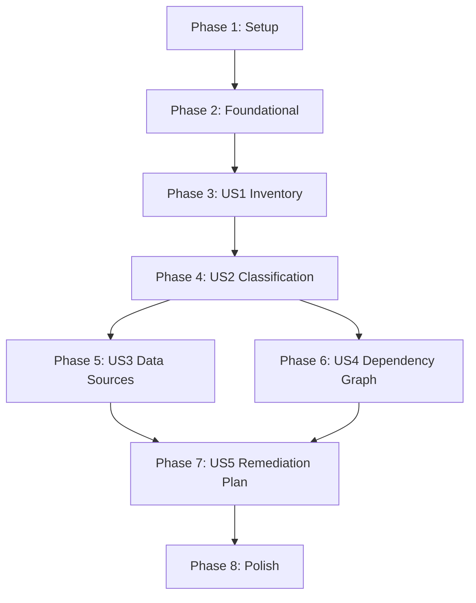

# Tasks: Magic Constants Provenance Audit

**Input**: Design documents from `specs/027-constants-provenance-audit/`
**Prerequisites**: plan.md (required), spec.md (required), research.md, data-model.md, contracts/inventory-schema.yaml

**Tests**: Not applicable — this is a research-only feature producing report artifacts. Verification is via inventory completeness checks (SC-001 through SC-008).

**Organization**: Tasks are grouped by user story (investigation phase). Each phase produces an independently reviewable report deliverable.

## Format: `[ID] [P?] [Story] Description`

- **[P]**: Can run in parallel (different output files, no dependencies)
- **[Story]**: Which user story this task belongs to (US1–US5)
- All output paths are relative to `specs/027-constants-provenance-audit/`

______________________________________________________________________

## Phase 1: Setup

**Purpose**: Create output directory structure and validate that source files exist

- [ ] T001 Create `specs/027-constants-provenance-audit/reports/` directory for all deliverables
- [ ] T002 Verify primary audit targets exist: `src/babylon/config/defines.py`, `src/babylon/data/defines.yaml`, `src/babylon/formulas/constants.py`
- [ ] T003 Verify constitution Article III.4 approved data source list is accessible at `.specify/memory/constitution.md`

______________________________________________________________________

## Phase 2: Foundational (Blocking Prerequisites)

**Purpose**: Read and internalize all source files needed across multiple investigation phases. Build working knowledge of the constant landscape before any classification begins.

**CRITICAL**: No user story work can begin until the investigator has read and understood these files.

- [ ] T004 Read all 25 subsection model classes in `src/babylon/config/defines.py` (1569 lines). For each model, note every `int`/`float` Field() definition with its default value, description, and type constraints (ge/le/gt/lt). Expected count: 136 in-scope scalar numerical fields across 22 in-scope models (140 total across 25 models; 4 ServicesDefines layer numbers excluded per spec scope; ArcGISDefines and ExternalDataDefines have 0 numerical fields).
- [ ] T005 [P] Read `src/babylon/data/defines.yaml` (217 lines). Note which of the 25 subsection models have YAML overrides vs Python-only defaults. Expected: 14 sections have YAML entries; 6 subsections (crisis, contradiction_field, reserve_army, dispossession, working_day, community) use class defaults only.
- [ ] T006 [P] Read `src/babylon/formulas/constants.py` (22 lines). Confirm it re-exports exactly 2 constants: `LOSS_AVERSION_COEFFICIENT` (2.25) and `EPSILON` (1e-9).
- [ ] T007 [P] Read Constitution Article III at `.specify/memory/constitution.md`. Extract the complete approved data source list from III.4 for use in Phase 5 (US3) cross-referencing.
- [ ] T008 Read the existing tensor/data infrastructure to understand Tier A derivation capabilities: `src/babylon/economics/tensor.py` (ValueTensor4x3), `src/babylon/economics/hydrator.py` (MarxianHydrator), `src/babylon/economics/melt/` (MELT calculator, class position), `src/babylon/economics/gamma/` (gamma visibility).
- [ ] T009 [P] Read Feature 002 spec at `specs/002-dialectical-field-topology/spec.md` and Feature 021 spec at `specs/021-capital-volume-i/spec.md` for planned infrastructure relevant to Tier A classification of territory and economy constants.
- [ ] T010 [P] Read parameter sweep tooling to understand Tier C calibration capabilities: `tools/shared.py` (get_tunable_parameters, inject_parameters, run_simulation), `tools/tune_agent.py` (OPTIMIZATION_BOUNDS), `tools/sensitivity_analysis.py` (Morris/Sobol).

**Checkpoint**: Investigator has full working knowledge of the 136 in-scope GameDefines constants, the YAML overlay structure, tensor infrastructure, planned features, and calibration tooling.

______________________________________________________________________

## Phase 3: User Story 1 — Complete Constants Inventory (Priority: P1)

**Goal**: Produce `reports/constants-inventory.yaml` — exhaustive census of every numerical constant with location, value, purpose, and consumers. Zero omissions from `defines.py`/`defines.yaml` (SC-001). Best-effort coverage of inline literals with coverage log (SC-008).

**Independent Test**: Compare inventory YAML entry count for in-scope GameDefines constants against 136 (the verified field count from research R-001; 140 total minus 4 ServicesDefines layer numbers excluded per spec scope). Validate every entry has all required fields per `contracts/inventory-schema.yaml`.

### GameDefines Inventory (deterministic — zero omissions required)

- [ ] T011 [US1] Enumerate all numerical fields in `CrisisDefines` (12 fields), `EconomyDefines` (29 fields), and `SurvivalDefines` (6 fields) from `src/babylon/config/defines.py`. For each field: record constant_id, location (file + line), value, value_type, and purpose (from Field description). Output as YAML entries per `contracts/inventory-schema.yaml` schema.
- [ ] T012 [P] [US1] Enumerate all numerical fields in `VitalityDefines` (2), `SolidarityDefines` (5), `BehavioralDefines` (1), `TensionDefines` (1), `ConsciousnessDefines` (2), `TerritoryDefines` (12), and `TopologyDefines` (3) from `src/babylon/config/defines.py`. Same output format as T011.
- [ ] T013 [P] [US1] Enumerate all numerical fields in `MetabolismDefines` (3), `StruggleDefines` (8), `CarceralDefines` (7), `EndgameDefines` (5), `InitialDefines` (3), and `PrecisionDefines` (3) from `src/babylon/config/defines.py`. Same output format as T011.
- [ ] T014 [P] [US1] Enumerate all numerical fields in `TimescaleDefines` (2), `ContradictionFieldDefines` (7), `ReserveArmyDefines` (4), `DispossessionDefines` (9), `WorkingDayDefines` (6), and `CommunityDefines` (6) from `src/babylon/config/defines.py`. Same output format as T011. Note: `ServicesDefines` (4 int layer numbers) is excluded per spec Out of Scope.
- [ ] T015 [US1] Add the 2 re-exported constants from `src/babylon/formulas/constants.py` (LOSS_AVERSION_COEFFICIENT, EPSILON) as separate inventory entries with source_type "FormulaConstant".

### Inline Literal Inventory (best-effort with coverage log)

- [ ] T016 [US1] Search for STUB/TODO/PLACEHOLDER/MAGIC comments throughout `src/babylon/` and inventory any associated numerical constants. Known locations from research R-002: `engine/simulation.py:768`, `data/reference/hydrator.py:212`, plus 6 additional TODO markers. Record each as source_type "InlineLiteral" with the comment as purpose.
- [ ] T017 [P] [US1] Search for module-level constant declarations (pattern: `_CONSTANT = value` or `CONSTANT = value`) outside `defines.py` throughout `src/babylon/`. Known locations from research R-002: `formulas/ideological_routing.py:39,82`, `engine/topology_monitor.py:55-65` (7 deprecated constants), `engine/observers/endgame_detector.py:53-61` (5 legacy constants). Record each as source_type "ModuleConstant".
- [ ] T018 [P] [US1] Search for function signature defaults that duplicate GameDefines values throughout `src/babylon/formulas/`. Known locations from research R-002: `dynamic_balance.py:28-39` (10 defaults), `solidarity.py:14`, `metabolic_rift.py:14,59`, `trpf.py:25`, `community.py:21,22,81`. Record each as source_type "FunctionDefault".
- [ ] T019 [P] [US1] Search for hardcoded empirical coefficients in `src/babylon/formulas/class_dynamics.py` (ClassDynamicsParams, SecondOrderParams — FRED-fitted ODE coefficients), `src/babylon/economics/gamma/adapters.py` (care-fraction NAICS coefficients), and `src/babylon/economics/dynamics/hardcoded_data.py`. Record each as source_type "InlineLiteral".
- [ ] T020 [P] [US1] Search for edge transition threshold literals in `src/babylon/engine/systems/edge_transition.py` (all PredicateCondition threshold values and priority integers in the `_TRANSITIONS` list — ~17 thresholds, ~16 priorities). Record each as source_type "InlineLiteral".
- [ ] T021 [P] [US1] Search for factory/scenario default literals in `src/babylon/engine/factories.py` (create_proletariat, create_bourgeoisie defaults), `src/babylon/engine/scenarios.py` (preset values), and fallback `attrs.get("field", value)` patterns in `src/babylon/engine/systems/metabolism.py` and `src/babylon/engine/systems/struggle.py`. Record each as source_type "FunctionDefault" or "InlineLiteral" as appropriate.

### Consumer Tracing

- [ ] T022 [US1] For every GameDefines constant inventoried in T011–T014, trace consumers by searching for field access patterns (e.g., `defines.economy.extraction_efficiency`, `self._defines.economy.*`, `services.defines.*`) across `src/babylon/engine/systems/`, `src/babylon/formulas/`, and `src/babylon/engine/*.py`. Record each consumer with system name, file, line, and usage type (direct/fallback/deprecated).
- [ ] T023 [US1] For every inline literal inventoried in T016–T021, identify the consuming system or formula from the file context. Record as consumer entries.

### Assembly and Validation

- [ ] T024 [US1] Assemble all inventory entries from T011–T023 into a single `specs/027-constants-provenance-audit/reports/constants-inventory.yaml` file following the schema in `contracts/inventory-schema.yaml`. Include metadata section with total_count, inline_count, search_patterns, directories_searched, known_gaps, and generation_date.
- [ ] T025 [US1] Validate the assembled inventory: (a) in-scope GameDefines entry count equals 136 (SC-001; 140 total minus 4 excluded ServicesDefines layer numbers), (b) every entry has all required fields populated (FR-002), (c) no duplicate constant_id values, (d) coverage log is complete (SC-008).

**Checkpoint**: `reports/constants-inventory.yaml` is complete and validated. All 136 in-scope GameDefines constants are inventoried with zero omissions. Inline literals have best-effort coverage with documented methodology. This deliverable has standalone value as a reference document.

______________________________________________________________________

## Phase 4: User Story 2 — Five-Tier Classification (Priority: P1)

**Goal**: Classify every inventoried constant into exactly one tier (A/B/C/D/E) with documented reasoning. Produce `reports/constants-classification.md` (FR-003) plus two standalone sub-reports (FR-010, FR-011).

**Independent Test**: Every constant_id from the inventory appears in exactly one tier section. Each classification includes tier-specific metadata per data-model.md TierClassification schema. No constant is unclassified.

**Depends on**: Phase 3 (US1) — requires completed inventory

### Classification by Subsection

- [ ] T026 [US2] Classify all `EconomyDefines` constants (29 fields) using tier criteria order A→B→D→E→C. For each: evaluate derivability against ValueTensor4x3/MELT/hydrator infrastructure (Tier A), check for duplicates or dead references (Tier B), identify engineering constraints (Tier D), assess whether the concept is inherently non-empirical (Tier E), then calibration as catch-all (Tier C). Record reasoning per tier-specific schema in `data-model.md`.
- [ ] T027 [P] [US2] Classify all `CrisisDefines` constants (12 fields) using same tier criteria order. Cross-reference against Feature 018 (Crisis-Devaluation Mechanics) for Tier A derivation paths.
- [ ] T028 [P] [US2] Classify all `SurvivalDefines` (6), `VitalityDefines` (2), `BehavioralDefines` (1), and `ConsciousnessDefines` (2) constants. Note: `loss_aversion_lambda` (2.25) has established Kahneman-Tversky provenance — classify appropriately.
- [ ] T029 [P] [US2] Classify all `SolidarityDefines` (5), `TensionDefines` (1), and `StruggleDefines` (8) constants. Cross-reference against engine system consumer patterns from inventory.
- [ ] T030 [P] [US2] Classify all `TerritoryDefines` (12), `TopologyDefines` (3), and `MetabolismDefines` (3) constants. For TerritoryDefines: assess Feature 002 dialectical field derivation paths. For TopologyDefines: note deprecated module-level duplicates in `topology_monitor.py`.
- [ ] T031 [P] [US2] Classify all `CarceralDefines` (7), `EndgameDefines` (5), `InitialDefines` (3), and `PrecisionDefines` (3) constants. For PrecisionDefines: these are likely Tier D (engineering).
- [ ] T032 [P] [US2] Classify all `TimescaleDefines` (2), `ContradictionFieldDefines` (7), `ReserveArmyDefines` (4), `DispossessionDefines` (9), `WorkingDayDefines` (6), `CommunityDefines` (6), and `ServicesDefines` (4) constants. For ReserveArmyDefines/DispossessionDefines/WorkingDayDefines: assess Feature 021 derivation paths.
- [ ] T033 [US2] Classify all inline literal constants inventoried in T016–T021. Apply same tier criteria. Pay special attention to: FRED-fitted ODE coefficients (class_dynamics.py — likely Tier C with data provenance), edge transition thresholds (edge_transition.py — likely Tier E or C), deprecated module constants (topology_monitor.py, endgame_detector.py — likely Tier B).

### Standalone Sub-Reports

- [ ] T034 [US2] Produce `specs/027-constants-provenance-audit/reports/constants-bourgeoisie-cluster.md` (FR-010): Deep-dive on the 10 EconomyDefines policy constants (`bribery_wage_delta`, `austerity_wage_delta`, `iron_fist_repression_delta`, `crisis_wage_delta`, `crisis_repression_delta`, `bribery_tension_threshold`, `iron_fist_tension_threshold`, `pool_high_threshold`, `pool_low_threshold`, `pool_critical_threshold`) plus the `calculate_bourgeoisie_decision()` formula defaults in `src/babylon/formulas/dynamic_balance.py`. Assess whether the Organization-as-Agent pattern from Feature 017 can replace this entire hardcoded policy decision tree.
- [ ] T035 [P] [US2] Produce `specs/027-constants-provenance-audit/reports/constants-territory-cluster.md` (FR-011): Deep-dive on the 12 TerritoryDefines constants (heat dynamics, rent/displacement, carceral geography, containment/elimination thresholds). Assess which constants become redundant when Feature 002's dialectical field topology is implemented (contradiction field gradients, Ollivier-Ricci curvature replace hardcoded heat/spillover parameters).

### Assembly

- [ ] T036 [US2] Assemble all classifications from T026–T033 into `specs/027-constants-provenance-audit/reports/constants-classification.md`. Organize by tier (A through E) with summary statistics. Include: tier distribution table, per-constant classification entries with full tier-specific metadata, and cross-references to sub-reports for bourgeoisie and territory clusters.
- [ ] T037 [US2] Validate classification report: (a) every constant_id from inventory appears exactly once (SC-002), (b) every Tier A has derivation formula or infrastructure gap (SC-003/FR-004), (c) every Tier C has calibration source and sweep range (SC-004/FR-005), (d) every Tier E has explicit design rationale (SC-007/FR-006), (e) no constant is classified in two tiers.

**Checkpoint**: `reports/constants-classification.md` and both sub-reports are complete. Every constant has a single tier with documented reasoning. The classification report has standalone value for prioritizing remediation work.

______________________________________________________________________

## Phase 5: User Story 3 — Data Source Cross-Reference (Priority: P2)

**Goal**: Map every Tier A and Tier C constant to an approved federal data source (or document its absence). Produce `reports/constants-data-sources.md` (FR-007).

**Independent Test**: Every Tier A and Tier C constant has a data source mapping entry. Every mapping references a source from the Constitution III.4 approved list or explicitly proposes an addition.

**Depends on**: Phase 4 (US2) — requires completed classification

- [ ] T038 [US3] For every Tier A constant, identify the specific approved data source, dataset/table, and derivation formula from existing adapters. Map against: SQLiteBEA* (BEA GDP/industry ratios), SQLiteQCEW* (QCEW wages/employment), QCEWCareAdapter (ATUS care hours), FredAPIClient (FRED unemployment/rates), wealth_proxy (Fed SCF percentiles). Record per DataSourceMapping schema in `data-model.md`.
- [ ] T039 [P] [US3] For every Tier A constant where the derivation requires planned infrastructure (Feature 002/021), document the infrastructure gap: what data source will be used, what adapter needs to be built, and what feature must be completed first.
- [ ] T040 [P] [US3] For every Tier C constant, identify the best calibration data source from the Constitution III.4 approved list. If no direct data source exists, document: (a) whether existing parameter sweep tooling can calibrate it (check if field has ge/le bounds via `get_tunable_parameters()`), (b) recommended sweep range, (c) whether a new data source should be proposed.
- [ ] T041 [US3] Cross-reference all data source mappings against the Constitution Article III.4 approved list. Flag any mapping that references a source NOT on the list. For each flagged source, assess whether it should be proposed as an addition.
- [ ] T042 [US3] Assemble all mappings into `specs/027-constants-provenance-audit/reports/constants-data-sources.md`. Organize by data source (QCEW, BEA, FRED, etc.) with a summary table showing coverage. Include a section for unconstrained constants (no data source available) with justifications.

**Checkpoint**: `reports/constants-data-sources.md` is complete. Every Tier A and Tier C constant has a data source mapping or documented absence. All mappings comply with Constitution III.4.

______________________________________________________________________

## Phase 6: User Story 4 — Dependency Graph and Impact Analysis (Priority: P2)

**Goal**: Produce Mermaid dependency graphs showing constant-to-system relationships, cascade risks, and coupled clusters. Produce `reports/constants-dependency-graph.md` (FR-008).

**Independent Test**: The dependency graph identifies at least the top 5 highest-impact replacement targets (SC-005). Every consumer relationship is traceable to an actual code reference in the inventory.

**Depends on**: Phase 3 (US1) — requires completed inventory with consumer data. Can run in PARALLEL with Phase 5.

- [ ] T043 [US4] Build the directed dependency graph from inventory consumer data: constants as source nodes, systems/formulas as target nodes. Weight edges by usage type (direct=1.0, fallback=0.5, deprecated=0.1). Compute weighted consumer_count per constant.
- [ ] T044 [US4] Identify cascade risk constants (consumer_count >= 3 distinct consuming systems). Expected high-impact clusters from research: EconomyDefines policy deltas, SurvivalDefines, TerritoryDefines, StruggleDefines. Rank the top 5 by weighted consumer count (SC-005).
- [ ] T045 [P] [US4] Identify isolated constants (consumer_count == 1). These are easy replacement targets — single system to modify. List with their sole consumer system.
- [ ] T046 [P] [US4] Identify coupled clusters: groups of constants consumed by the same system(s). These are bundled replacement candidates — replacing one constant in the cluster likely requires addressing others simultaneously.
- [ ] T047 [US4] Generate Mermaid dependency diagrams: (a) full constant→system graph (may need to be split by subsection for readability), (b) high-impact subgraph highlighting cascade risks, (c) coupled cluster subgraphs.
- [ ] T048 [US4] Assemble into `specs/027-constants-provenance-audit/reports/constants-dependency-graph.md`. Include: summary statistics (total edges, cascade risks, isolated constants, coupled clusters), top 5 highest-impact targets with consumer lists, Mermaid diagrams, and easy-win recommendations.

**Checkpoint**: `reports/constants-dependency-graph.md` is complete. Cascade risks, isolated constants, and coupled clusters are identified with Mermaid visualizations.

______________________________________________________________________

## Phase 7: User Story 5 — Phased Remediation Plan (Priority: P3)

**Goal**: Produce a sequenced implementation plan ordering constant replacements by impact, difficulty, and data readiness. Produce `reports/constants-remediation-plan.md` (FR-009).

**Independent Test**: The plan provides a sequenced order that respects system dependencies — no constant is scheduled for replacement before its upstream dependencies (SC-006). Each remediation item maps to a potential follow-up feature.

**Depends on**: Phase 4 (US2), Phase 5 (US3), Phase 6 (US4) — requires classification, data sources, and dependency graph

- [ ] T049 [US5] Assign every audited constant a remediation phase using three-axis scoring: impact (simulation behavior change based on consumer count from US4), difficulty (number of affected systems from dependency graph), and data readiness (pipeline availability from US3 data source mappings).
- [ ] T050 [US5] Sequence remediation into 5 phases: (1) Quick Wins — isolated Tier B + Tier A with existing infrastructure, (2) High-Impact Data-Ready — Tier A with cascade risk but existing adapter coverage, (3) Infrastructure-Gated — Tier A requiring Feature 002/021 completion, (4) Calibration-Only — Tier C requiring parameter sweep, (5) Acknowledged Design — Tier E requiring honest relabeling.
- [ ] T051 [US5] For each remediation phase: list the specific constants, their current tier, the target state (derived/eliminated/calibrated/relabeled), the required infrastructure, estimated scope (number of files touched), and the follow-up feature that would implement the change.
- [ ] T052 [US5] Verify dependency ordering: no constant in Phase 2 depends on infrastructure from Phase 3. No constant scheduled for replacement before its coupled cluster partners. Flag any constants where replacement would require introducing a NEW magic constant (FR-013).
- [ ] T053 [US5] Assemble into `specs/027-constants-provenance-audit/reports/constants-remediation-plan.md`. Include: executive summary with phase-by-phase constant counts, detailed per-constant remediation entries, dependency constraints, estimated scope per phase, and a recommended first follow-up feature.

**Checkpoint**: `reports/constants-remediation-plan.md` is complete. The remediation plan translates the full audit analysis into actionable, sequenced follow-up features.

______________________________________________________________________

## Phase 8: Polish & Cross-Cutting Concerns

**Purpose**: Final validation across all reports, consistency checks, and commit

- [ ] T054 Validate cross-report consistency: every constant_id in classification (US2) exists in inventory (US1), every Tier A/C constant in classification has a data source mapping (US3), every constant in remediation plan (US5) appears in classification, all consumer references in dependency graph (US4) match inventory consumer data.
- [ ] T055 [P] Check for FR-013 compliance across all reports: if any remediation recommendation would replace a magic constant with a different magic constant (e.g., a normalization bound), flag it explicitly in the remediation plan.
- [ ] T056 [P] Verify no code changes were made (FR-012): `git diff --stat` should show only files under `specs/027-constants-provenance-audit/`.
- [ ] T057 Commit all report deliverables with conventional commit message: `feat(audit): complete magic constants provenance audit (Feature 027)`

______________________________________________________________________

## Dependencies & Execution Order

### Phase Dependencies



- **Setup (Phase 1)**: No dependencies — start immediately
- **Foundational (Phase 2)**: Depends on Setup — BLOCKS all user stories
- **US1 Inventory (Phase 3)**: Depends on Foundational — produces the base data for all subsequent phases
- **US2 Classification (Phase 4)**: Depends on US1 — classifies inventory entries
- **US3 Data Sources (Phase 5)**: Depends on US2 — maps Tier A/C constants to data sources
- **US4 Dependency Graph (Phase 6)**: Depends on US1 (consumer data) — **CAN RUN IN PARALLEL WITH Phase 5**
- **US5 Remediation Plan (Phase 7)**: Depends on US2, US3, US4 — synthesizes all prior analysis
- **Polish (Phase 8)**: Depends on all user stories complete

### User Story Dependencies

- **US1 (P1)**: Can start after Foundational — no dependencies on other stories
- **US2 (P1)**: Depends on US1 only — classification requires the inventory
- **US3 (P2)**: Depends on US2 — data source mapping requires tier classification
- **US4 (P2)**: Depends on US1 — can run in PARALLEL with US3 (both need inventory, not each other)
- **US5 (P3)**: Depends on US2 + US3 + US4 — the synthesis deliverable

### Parallel Opportunities

**Within Phase 3 (US1)**: T012, T013, T014 can run in parallel (different subsection groups). T017, T018, T019, T020, T021 can run in parallel (different inline literal categories).

**Within Phase 4 (US2)**: T027–T032 can run in parallel (different subsection groups). T034, T035 can run in parallel (different cluster sub-reports).

**Between Phases**: Phase 5 (US3) and Phase 6 (US4) can run in parallel — they depend on different aspects of the prior work and produce independent deliverables.

### Parallel Example: Phase 3 (US1 Inventory)

```text
# Parallel group 1: GameDefines enumeration (T011 is sequential due to largest subsections)
Task T012: "Enumerate VitalityDefines through TopologyDefines in src/babylon/config/defines.py"
Task T013: "Enumerate MetabolismDefines through PrecisionDefines in src/babylon/config/defines.py"
Task T014: "Enumerate ServicesDefines through CommunityDefines in src/babylon/config/defines.py"

# Parallel group 2: Inline literal search
Task T017: "Search for module-level constants outside defines.py"
Task T018: "Search for function signature defaults in src/babylon/formulas/"
Task T019: "Search for hardcoded empirical coefficients"
Task T020: "Search for edge transition thresholds"
Task T021: "Search for factory/scenario defaults"
```

### Parallel Example: Phase 5 + Phase 6

```text
# These two phases can run concurrently
Phase 5 (US3): "Map Tier A/C constants to data sources → reports/constants-data-sources.md"
Phase 6 (US4): "Build dependency graph from consumer data → reports/constants-dependency-graph.md"
```

______________________________________________________________________

## Implementation Strategy

### MVP First (User Story 1 Only)

1. Complete Phase 1: Setup
2. Complete Phase 2: Foundational (read all source files)
3. Complete Phase 3: User Story 1 — Constants Inventory
4. **STOP and VALIDATE**: Verify inventory count = 136 in-scope GameDefines constants, coverage log present
5. The inventory YAML has standalone value as a reference document

### Incremental Delivery

1. Complete Setup + Foundational → Foundation ready
2. US1 Inventory → Validate → **MVP deliverable** (reference document)
3. US2 Classification → Validate → **Adds tier breakdown and cluster deep-dives**
4. US3 Data Sources + US4 Dependency Graph (parallel) → Validate → **Adds actionable data mappings and impact analysis**
5. US5 Remediation Plan → Validate → **Final synthesis — actionable follow-up feature list**
6. Each phase adds value without invalidating previous deliverables

______________________________________________________________________

## Notes

- [P] tasks = different files or independent search targets, no shared state
- [Story] label maps task to specific user story for traceability
- All output paths under `specs/027-constants-provenance-audit/reports/`
- This is a research-only feature — NO code changes to `src/` (FR-012)
- Commit after completing each user story phase (not after each task)
- The inventory YAML schema at `contracts/inventory-schema.yaml` defines the required structure
- Edge case handling per spec: classify on active consumers only, document infrastructure gaps explicitly, flag potential Tier B redundancies, document calibration source disagreements
