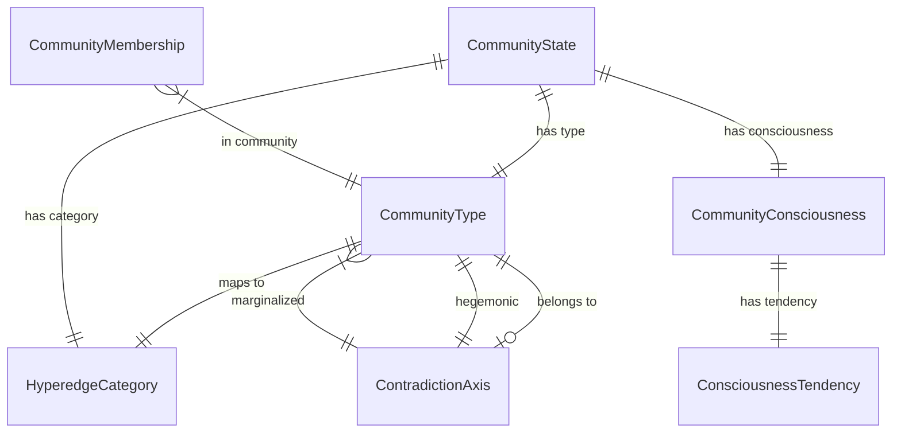

# Data Model: Community Hyperedge Layer Upgrade

**Feature**: 029-community-hyperedge-upgrade
**Date**: 2026-02-27

## New Enums

### HyperedgeCategory

```python
class HyperedgeCategory(StrEnum):
    """Three-category taxonomy for community hyperedges (Constitution II.7)."""
    CONTRADICTION_PAIR = "contradiction_pair"
    INSTITUTIONAL_EXCLUSION = "institutional_exclusion"
    LIFECYCLE_PHASE = "lifecycle_phase"
```

- **Location**: `src/babylon/models/enums.py`
- **Frozen**: N/A (enum)
- **Relationships**: Referenced by CommunityState.category, COMMUNITY_CATEGORY_MAP

### ConsciousnessTendency

```python
class ConsciousnessTendency(StrEnum):
    """Ideological tendency within a community."""
    ASSIMILATIONIST_LIBERAL = "assimilationist_liberal"
    ASSIMILATIONIST_FASCIST = "assimilationist_fascist"
    REVOLUTIONARY = "revolutionary"
```

- **Location**: `src/babylon/models/enums.py`
- **Frozen**: N/A (enum)
- **Relationships**: Referenced by CommunityConsciousness.dominant_tendency

## New Models

### CommunityConsciousness

```python
class CommunityConsciousness(BaseModel):
    """The ideological dimension of a community hyperedge."""
    model_config = ConfigDict(frozen=True)

    collective_identity: Probability = Field(
        default=Probability(0.3), description="Oppositional consciousness [0,1]"
    )
    dominant_tendency: ConsciousnessTendency = Field(
        default=ConsciousnessTendency.ASSIMILATIONIST_LIBERAL,
        description="Prevailing ideological direction"
    )
    ideological_contestation: Probability = Field(
        default=Probability(0.2), description="Active debate between tendencies [0,1]"
    )
```

- **Location**: `src/babylon/models/entities/community.py`
- **Frozen**: Yes
- **Validation**: collective_identity and ideological_contestation use Probability type [0,1]
- **Serialization**: JSON-serializable via Pydantic model_dump/model_validate
- **Relationships**: Embedded in CommunityState.consciousness

### ContradictionAxis

```python
class ContradictionAxis(BaseModel):
    """A structural axis of contradiction with hegemonic and marginalized sides."""
    model_config = ConfigDict(frozen=True)

    id: str
    name: str
    hegemonic: CommunityType
    marginalized: list[CommunityType]
    extraction_mechanism: str
    exclusive: bool
    permeable: bool
```

- **Location**: `src/babylon/models/entities/community.py`
- **Frozen**: Yes
- **Instantiation**: Module-level constants only (COLONIAL_AXIS, PATRIARCHAL_AXIS)
- **Relationships**: Referenced by axis query functions

## Extended Models

### CommunityState (extended)

New fields added to existing model at `src/babylon/models/entities/community.py:46`:

```python
class CommunityState(BaseModel):
    # === EXISTING FIELDS (preserved) ===
    community_type: CommunityType
    heat: Probability = Probability(0.0)
    legal_status: LegalStatus = LegalStatus.LEGAL
    cohesion: Probability = Probability(0.5)
    infrastructure: Probability = Probability(0.3)
    visibility: Probability = Probability(0.5)
    reproduction_cost_modifier: float = 1.0
    rent_access_modifier: Coefficient = Coefficient(1.0)

    # === NEW FIELDS ===
    category: HyperedgeCategory  # Auto-assigned from COMMUNITY_CATEGORY_MAP
    consciousness: CommunityConsciousness = Field(default_factory=CommunityConsciousness)

    # === NEW COMPUTED FIELDS ===
    @computed_field
    def infiltration_resistance(self) -> float: ...  # CI*0.6 + cohesion*0.3 + CI*cohesion*0.1

    @computed_field
    def is_cross_class_bridge(self) -> bool: ...  # category == INSTITUTIONAL_EXCLUSION
```

- **Backward compatibility**: `category` auto-assigned via model_validator. `consciousness` has
  default_factory. Computed fields are not constructor args. Existing callers unchanged.
- **Validation**: model_validator ensures category matches community_type via COMMUNITY_CATEGORY_MAP.
  Raises ValueError if community_type not in map (exhaustiveness check).

## Constants

### COMMUNITY_CATEGORY_MAP

```python
COMMUNITY_CATEGORY_MAP: dict[CommunityType, HyperedgeCategory]
```

Maps all 14 CommunityType members to exactly one HyperedgeCategory.
- 7 CONTRADICTION_PAIR (SETTLER, PATRIARCHAL, NEW_AFRIKAN, FIRST_NATIONS, CHICANO, WOMEN, TRANS)
- 4 INSTITUTIONAL_EXCLUSION (DISABLED, QUEER, UNDOCUMENTED, INCARCERATED)
- 3 LIFECYCLE_PHASE (YOUTH, ADULT, ELDER)

### HEGEMONIC_COMMUNITIES / MARGINALIZED_COMMUNITIES / LIFECYCLE_COMMUNITIES

```python
HEGEMONIC_COMMUNITIES: frozenset[CommunityType]     # {SETTLER, PATRIARCHAL}
MARGINALIZED_COMMUNITIES: frozenset[CommunityType]   # 9 members
LIFECYCLE_COMMUNITIES: frozenset[CommunityType]       # {YOUTH, ADULT, ELDER}
```

### COLONIAL_AXIS / PATRIARCHAL_AXIS

```python
COLONIAL_AXIS = ContradictionAxis(
    id="colonial", name="Colonial",
    hegemonic=CommunityType.SETTLER,
    marginalized=[CommunityType.NEW_AFRIKAN, CommunityType.FIRST_NATIONS, CommunityType.CHICANO],
    extraction_mechanism="Land, imperial rent, carceral labor, property value regimes",
    exclusive=True, permeable=False,
)
PATRIARCHAL_AXIS = ContradictionAxis(
    id="patriarchal", name="Patriarchal",
    hegemonic=CommunityType.PATRIARCHAL,
    marginalized=[CommunityType.WOMEN, CommunityType.TRANS],
    extraction_mechanism="Unwaged reproductive labor, wage gap, care externalization",
    exclusive=True, permeable=False,
)
CONTRADICTION_AXES: list[ContradictionAxis] = [COLONIAL_AXIS, PATRIARCHAL_AXIS]
```

### CONSCIOUSNESS_DEFAULTS

```python
CONSCIOUSNESS_DEFAULTS: dict[CommunityType, CommunityConsciousness]
```

SYNTHETIC starting values for all 14 community types. Detroit test case, circa 2010.
Notable values:
- INCARCERATED: REVOLUTIONARY, CI=0.6
- FIRST_NATIONS: REVOLUTIONARY, CI=0.6
- SETTLER: ASSIMILATIONIST_LIBERAL, CI=0.4
- YOUTH: ASSIMILATIONIST_LIBERAL, CI=0.2, contestation=0.5

## Functions

### Pure Query Functions (community.py models)

| Function | Signature | Returns |
|----------|-----------|---------|
| `get_contradiction_axis` | `(CommunityType) -> ContradictionAxis \| None` | Axis or None |
| `is_hegemonic` | `(CommunityType) -> bool` | True if hegemonic |
| `is_marginalized` | `(CommunityType) -> bool` | True if marginalized (incl. exclusion) |
| `get_opposing_communities` | `(CommunityType) -> list[CommunityType]` | Other side of axis |
| `shared_marginalized_communities` | `(set, set) -> set[CommunityType]` | Shared marginalized |

### Hypergraph Functions (community.py system)

| Function | Signature | Returns |
|----------|-----------|---------|
| `communities_spanning_axis` | `(Hypergraph, ContradictionAxis) -> list[CommunityType]` | Bridge communities |
| `effective_infiltration_ceiling` | `(float, list[CommunityState]) -> float` | Modified ceiling |

## Entity Relationship Diagram


