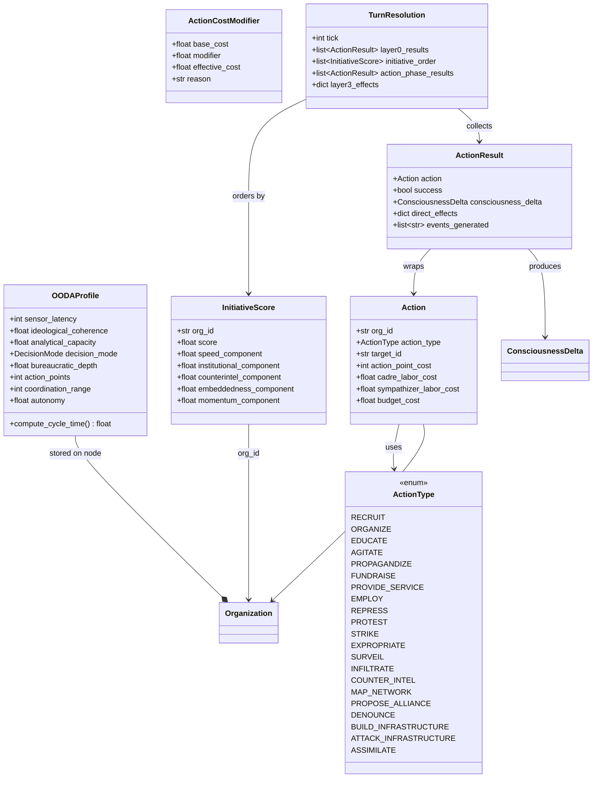

# Data Model: OODA Loop System (Feature 032)

**Feature Branch**: `032-ooda-loop-system`
**Date**: 2026-02-28
**Dependencies**: Feature 031 (Organization Base Model), Feature 029 (Community Hyperedge), Feature 030 (D-P-D' Lifecycle)

## Entity Overview



## Entities

### OODAProfile (Frozen Pydantic Model)

Stored as serialized dict on organization graph nodes (`ooda_profile` attribute).

| Field | Type | Constraints | Default | Description |
|-------|------|-------------|---------|-------------|
| `sensor_latency` | `int` | `ge=0, le=10` | 1 | Ticks of observation delay |
| `ideological_coherence` | `float` | `ge=0.0, le=1.0` (Probability) | 0.5 | How unified the org's worldview is |
| `analytical_capacity` | `float` | `ge=0.0, le=1.0` (Probability) | 0.5 | Ability to process information |
| `decision_mode` | `DecisionMode` | enum | `DEMOCRATIC` | How decisions are made |
| `bureaucratic_depth` | `float` | `ge=0.0, le=1.0` | 0.3 | Layers of bureaucracy |
| `action_points` | `int` | `ge=0, le=20` | 3 | Actions available per tick |
| `coordination_range` | `int` | `ge=0, le=100` | 1 | Distinct territories targetable per tick |
| `autonomy` | `float` | `ge=0.0, le=1.0` | 0.5 | Effectiveness-breadth tradeoff |

**Validation**: `model_config = ConfigDict(frozen=True)`

### DecisionMode (Enum)

| Value | Cycle Time Contribution | Description |
|-------|------------------------|-------------|
| `AUTOCRATIC` | Fastest (base 1.0) | Single leader decides |
| `DELEGATE` | Fast (base 2.0) | Trusted delegates |
| `DEMOCRATIC` | Moderate (base 3.0) | Majority vote |
| `CONSENSUS` | Slowest (base 5.0) | Full consensus |

### ActionType (str Enum)

21 action types across 7 categories:

| Category | Actions | Eligible Org Types |
|----------|---------|-------------------|
| **Recruitment** | RECRUIT | All |
| **Consciousness** | EDUCATE, AGITATE, PROPAGANDIZE | All (effects vary by tendency) |
| **Resources** | ORGANIZE, FUNDRAISE, PROVIDE_SERVICE, EMPLOY | EMPLOY: Business only |
| **Conflict** | PROTEST, STRIKE, EXPROPRIATE, REPRESS, ATTACK_INFRASTRUCTURE | REPRESS: StateApparatus or orgs with violence_capacity |
| **Intelligence** | SURVEIL, INFILTRATE, COUNTER_INTEL, MAP_NETWORK | SURVEIL: StateApparatus or orgs with surveillance_capacity |
| **Diplomacy** | PROPOSE_ALLIANCE, DENOUNCE | All |
| **Infrastructure** | BUILD_INFRASTRUCTURE, ASSIMILATE | ASSIMILATE: StateApparatus or LIBERAL orgs with institutional backing |

### Action (Frozen Pydantic Model)

Represents a single organizational action for a tick.

| Field | Type | Constraints | Description |
|-------|------|-------------|-------------|
| `org_id` | `str` | required | Acting organization ID |
| `action_type` | `ActionType` | required | What action to perform |
| `target_id` | `str` | required | Target community, organization, or territory ID |
| `action_point_cost` | `int` | `ge=1` | AP cost after modifiers |
| `cadre_labor_cost` | `float` | `ge=0.0`, default 0.0 | Forward-compatible: cadre hours required |
| `sympathizer_labor_cost` | `float` | `ge=0.0`, default 0.0 | Forward-compatible: sympathizer hours |
| `budget_cost` | `float` | `ge=0.0`, default 0.0 | Forward-compatible: monetary cost |

### ActionResult (Frozen Pydantic Model)

Outcome of executing one action.

| Field | Type | Description |
|-------|------|-------------|
| `action` | `Action` | The action that was executed |
| `success` | `bool` | Whether the action succeeded |
| `consciousness_delta` | `ConsciousnessDelta | None` | Consciousness effect on target community (None if no effect) |
| `direct_effects` | `dict[str, Any]` | Action-type-specific effects (e.g., heat change, infrastructure change) |
| `events_generated` | `list[str]` | EventType values emitted |
| `failure_reason` | `str | None` | Why the action failed (None if success) |

### InitiativeScore (Frozen Pydantic Model)

Computed per-tick ordering value.

| Field | Type | Description |
|-------|------|-------------|
| `org_id` | `str` | Organization ID |
| `score` | `float` | Composite initiative score |
| `speed_component` | `float` | Contribution from OODA cycle time |
| `institutional_component` | `float` | Institutional bonus (state advantage) |
| `counterintel_component` | `float` | Counter-intelligence capability |
| `embeddedness_component` | `float` | Community embeddedness |
| `momentum_component` | `float` | Recent success momentum |

**Invariant**: `score = speed + institutional + counterintel + embeddedness + momentum` (weighted sum)

### ActionCostModifier (Frozen Pydantic Model)

Cost adjustment for an action based on org-community relationship.

| Field | Type | Description |
|-------|------|-------------|
| `base_cost` | `int` | Action type's default AP cost |
| `modifier` | `float` | Multiplier (< 1.0 = discount, > 1.0 = surcharge) |
| `effective_cost` | `int` | `ceil(base_cost * modifier)` (minimum 1) |
| `reason` | `str` | Human-readable explanation |

### TurnResolution (Frozen Pydantic Model)

Complete processing of one tick.

| Field | Type | Description |
|-------|------|-------------|
| `tick` | `int` | Which tick was resolved |
| `layer0_results` | `list[ActionResult]` | Automatic metabolism results |
| `initiative_order` | `list[InitiativeScore]` | Sorted initiative scores (descending) |
| `action_phase_results` | `list[ActionResult]` | All action results in execution order |
| `layer3_effects` | `dict[str, Any]` | Aggregated consequence propagation |

## New Enums

### DecisionMode (str Enum)

Added to `src/babylon/models/enums.py`:

```python
class DecisionMode(str, Enum):
    AUTOCRATIC = "autocratic"
    DELEGATE = "delegate"
    DEMOCRATIC = "democratic"
    CONSENSUS = "consensus"
```

### ActionType (str Enum)

Added to `src/babylon/models/enums.py`:

```python
class ActionType(str, Enum):
    RECRUIT = "recruit"
    ORGANIZE = "organize"
    EDUCATE = "educate"
    AGITATE = "agitate"
    PROPAGANDIZE = "propagandize"
    FUNDRAISE = "fundraise"
    PROVIDE_SERVICE = "provide_service"
    EMPLOY = "employ"
    REPRESS = "repress"
    PROTEST = "protest"
    STRIKE = "strike"
    EXPROPRIATE = "expropriate"
    SURVEIL = "surveil"
    INFILTRATE = "infiltrate"
    COUNTER_INTEL = "counter_intel"
    MAP_NETWORK = "map_network"
    PROPOSE_ALLIANCE = "propose_alliance"
    DENOUNCE = "denounce"
    BUILD_INFRASTRUCTURE = "build_infrastructure"
    ATTACK_INFRASTRUCTURE = "attack_infrastructure"
    ASSIMILATE = "assimilate"
```

### New EventType Values

Added to `EventType` in `src/babylon/models/enums.py`:

```python
ORGANIZATIONAL_ACTION = "organizational_action"       # Any org action executed
STATE_REPRESSION = "state_repression"                 # REPRESS action by state
STATE_SURVEILLANCE = "state_surveillance"             # SURVEIL action by state
CONSCIOUSNESS_SHIFT = "consciousness_shift"           # Community CI change exceeds threshold
INITIATIVE_CONTESTED = "initiative_contested"         # Non-state org seizes initiative from state
INFRASTRUCTURE_CHANGE = "infrastructure_change"       # BUILD or ATTACK infrastructure
```

## GameDefines Extension

New `OODADefines` sub-model added to `GameDefines`:

```python
class OODADefines(BaseModel):
    model_config = ConfigDict(frozen=True)

    # Cycle time weights
    base_observe_time: float = 1.0
    latency_weight: float = 0.5
    base_orient_time: float = 2.0
    coherence_weight: float = 0.6
    base_act_time: float = 1.0
    coord_weight: float = 0.3
    depth_weight: float = 0.4

    # Decision mode base times
    decision_mode_base_autocratic: float = 1.0
    decision_mode_base_delegate: float = 2.0
    decision_mode_base_democratic: float = 3.0
    decision_mode_base_consensus: float = 5.0

    # Initiative scoring weights
    initiative_weight_speed: float = 2.0
    initiative_weight_institutional: float = 1.0
    initiative_weight_counterintel: float = 1.5
    initiative_weight_embeddedness: float = 1.0
    initiative_weight_momentum: float = 0.5

    # Institutional bonus by jurisdiction
    institutional_bonus_federal: float = 5.0
    institutional_bonus_state: float = 3.0
    institutional_bonus_local: float = 1.5
    institutional_bonus_nonstate: float = 0.0

    # Momentum decay
    momentum_decay: float = 0.8
    momentum_success_bonus: float = 0.2

    # Action cost modifiers
    embeddedness_discount: float = 0.5
    contradiction_cost_multiplier: float = 2.5
    outsider_cost_multiplier: float = 1.5
    min_cost_modifier: float = 0.5

    # Consciousness effect limits
    max_ci_delta_per_tick: float = 0.05

    # Action base consciousness multipliers
    action_base_educate: float = 1.2
    action_base_agitate: float = 0.0
    action_base_provide_service: float = 0.6
    action_base_recruit: float = 0.3
    action_base_organize: float = 0.5
    action_base_propagandize: float = 0.8
    action_base_repress: float = 0.8
    action_base_surveil: float = 0.2
    action_base_assimilate: float = 1.0

    # Autonomy tradeoff
    autonomy_effectiveness_scale: float = 0.5

    # Agitation -> contestation
    agitation_contestation_delta: float = 0.1
    agitation_educate_bonus: float = 1.5
    contestation_threshold: float = 0.3

    # Lifecycle modifiers
    elder_legitimacy_multiplier: float = 1.3

    # Counter-intelligence
    counter_intel_increment: float = 0.1

    # Base action point costs
    base_cost_recruit: int = 2
    base_cost_organize: int = 2
    base_cost_educate: int = 1
    base_cost_agitate: int = 1
    base_cost_propagandize: int = 2
    base_cost_fundraise: int = 1
    base_cost_provide_service: int = 2
    base_cost_employ: int = 1
    base_cost_repress: int = 2
    base_cost_protest: int = 2
    base_cost_strike: int = 3
    base_cost_expropriate: int = 3
    base_cost_surveil: int = 1
    base_cost_infiltrate: int = 3
    base_cost_counter_intel: int = 2
    base_cost_map_network: int = 1
    base_cost_propose_alliance: int = 1
    base_cost_denounce: int = 1
    base_cost_build_infrastructure: int = 3
    base_cost_attack_infrastructure: int = 2
    base_cost_assimilate: int = 2
```

## Graph Storage

### Organization Node Extensions

| Attribute | Type | Stored As | Description |
|-----------|------|-----------|-------------|
| `ooda_profile` | `dict` | `model_dump()` of OODAProfile | Serialized OODA profile |
| `counter_intel_score` | `float` | flat attribute | Accumulated counter-intelligence |
| `momentum` | `float` | flat attribute | Decaying success momentum |

### No New Node Types

All OODA data is stored on existing `_node_type="organization"` nodes.

### No New Edge Types

OODA uses existing edge types: `MEMBERSHIP` (for embeddedness), `PRESENCE` (for territory reach), `COMMAND` (for internal structure).

## Relationships to Existing Models

```mermaid
flowchart TB
    subgraph "Feature 031 (Organization Base Model)"
        ORG[Organization]
        SA[StateApparatus]
        BIZ[Business]
        PF[PoliticalFaction]
        CSO[CivilSocietyOrg]
    end

    subgraph "Feature 032 (OODA Loop System)"
        OODA[OODAProfile]
        ACT[Action]
        AR[ActionResult]
        IS[InitiativeScore]
        TR[TurnResolution]
    end

    subgraph "Feature 029 (Community Hyperedge)"
        CC[CommunityConsciousness]
        CS[CommunityState]
    end

    subgraph "Feature 030 (D-P-D' Lifecycle)"
        DPD[DPDState]
        LC[LifecycleComposition]
    end

    ORG --> OODA : has profile
    ORG --> ACT : performs
    ACT --> AR : produces
    IS --> ORG : scores
    TR --> AR : collects
    AR --> CC : modifies
    LC --> OODA : constrains capacity
    DPD --> OODA : lifecycle weights
    CS --> ACT : modifies cost
```

## State Transitions

### Momentum (per organization, per tick)

```
momentum_new = momentum_old * decay + (success_bonus if action_succeeded else 0)
```

### Counter-Intelligence Score (per organization, per tick)

```
if COUNTER_INTEL action succeeded:
    counter_intel_score += counter_intel_increment
counter_intel_score = clamp(counter_intel_score, 0.0, 1.0)
```

### Community Consciousness (per community, Layer 3)

```
aggregate all ConsciousnessDeltas targeting this community
new_ci = clamp(current_ci + total_ci_delta, 0.0, 1.0)
new_tendency = dominant_tendency by weight
new_contestation = clamp(current_contestation + agitation_delta, 0.0, 1.0)
```

### Heat (per community, Layer 3)

```
if targeted by SURVEIL or REPRESS:
    heat += heat_increment_per_state_action
heat = clamp(heat, 0.0, 1.0)
```

### Edge Mode (per edge, Layer 3)

```
if ORGANIZE action succeeded on this edge's endpoints:
    if current_mode == TRANSACTIONAL:
        transition to SOLIDARISTIC
```

### Infrastructure (per community, Layer 3)

```
if BUILD_INFRASTRUCTURE: infrastructure += build_increment
if ATTACK_INFRASTRUCTURE: infrastructure -= attack_decrement
infrastructure = clamp(infrastructure, 0.0, 1.0)
```
