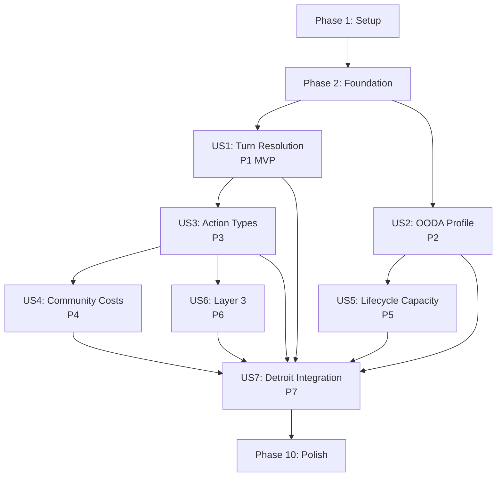

# Tasks: OODA Loop System (Feature 032)

**Input**: Design documents from `/specs/032-ooda-loop-system/`
**Prerequisites**: plan.md, spec.md, research.md, data-model.md, contracts/

**Tests**: TDD approach — tests written first in each user story phase (per project CLAUDE.md: Red-Green-Refactor).

**Organization**: Tasks grouped by user story. Each story is independently testable after completion.

## Format: `[ID] [P?] [Story] Description`

- **[P]**: Can run in parallel (different files, no dependencies)
- **[Story]**: Which user story this task belongs to (e.g., US1, US2, US3)
- Include exact file paths in descriptions

______________________________________________________________________

## Phase 1: Setup (Package Structure)

**Purpose**: Create the `ooda` package skeleton and add new enums to existing models.

- [x] T001 Create `src/babylon/ooda/__init__.py` with empty `__all__` list (verified 2026-07-08: src/babylon/ooda/__init__.py)
- [x] T002 [P] Create `src/babylon/ooda/types.py` with module docstring placeholder (verified 2026-07-08: src/babylon/ooda/types.py)
- [x] T003 [P] Create `src/babylon/ooda/cycle_time.py` with module docstring placeholder (verified 2026-07-08: src/babylon/ooda/cycle_time.py)
- [x] T004 [P] Create `src/babylon/ooda/initiative.py` with module docstring placeholder (verified 2026-07-08: src/babylon/ooda/initiative.py)
- [x] T005 [P] Create `src/babylon/ooda/action_eligibility.py` with module docstring placeholder (verified 2026-07-08: src/babylon/ooda/action_eligibility.py)
- [x] T006 [P] Create `src/babylon/ooda/action_costs.py` with module docstring placeholder (verified 2026-07-08: src/babylon/ooda/action_costs.py)
- [x] T007 [P] Create `src/babylon/ooda/action_effects.py` with module docstring placeholder (verified 2026-07-08: src/babylon/ooda/action_effects.py)
- [x] T008 [P] Create `src/babylon/ooda/layer0.py` with module docstring placeholder (verified 2026-07-08: src/babylon/ooda/layer0.py)
- [x] T009 [P] Create `src/babylon/ooda/layer3.py` with module docstring placeholder (verified 2026-07-08: src/babylon/ooda/layer3.py)
- [x] T010 [P] Create `src/babylon/ooda/npc_stub.py` with module docstring placeholder (verified 2026-07-08: src/babylon/ooda/npc_stub.py)
- [x] T011 Create `tests/unit/ooda/__init__.py` and `tests/unit/ooda/conftest.py` with shared fixtures (verified 2026-07-08: tests/unit/ooda/__init__.py + conftest.py:11)
- [x] T012 Add `DecisionMode` enum (AUTOCRATIC, DELEGATE, DEMOCRATIC, CONSENSUS) to `src/babylon/models/enums.py` (verified 2026-07-08: src/babylon/models/enums/actions.py:12 (enums.py split into enums/ package))
- [x] T013 [P] Add `ActionType` enum (21 values) to `src/babylon/models/enums.py` (verified 2026-07-08: src/babylon/models/enums/actions.py:32)
- [x] T014 [P] Add 6 new `EventType` values (ORGANIZATIONAL_ACTION, STATE_REPRESSION, STATE_SURVEILLANCE, CONSCIOUSNESS_SHIFT, INITIATIVE_CONTESTED, INFRASTRUCTURE_CHANGE) to `src/babylon/models/enums.py` (verified 2026-07-08: src/babylon/models/enums/events.py:116-121)

______________________________________________________________________

## Phase 2: Foundation (Blocking Prerequisites)

**Purpose**: Core types and configuration that ALL user stories depend on. No user story work until complete.

**CRITICAL**: No user story work can begin until this phase is complete.

- [x] T015 Implement `OODAProfile` frozen Pydantic model in `src/babylon/ooda/types.py` per ooda-profile-contract.md (8 fields: sensor_latency, ideological_coherence, analytical_capacity, decision_mode, bureaucratic_depth, action_points, coordination_range, autonomy) (verified 2026-07-08: src/babylon/ooda/types.py:21)
- [x] T016 [P] Implement `Action` frozen Pydantic model in `src/babylon/ooda/types.py` per data-model.md (org_id, action_type, target_id, action_point_cost, cadre_labor_cost, sympathizer_labor_cost, budget_cost) (verified 2026-07-08: src/babylon/ooda/types.py:89)
- [x] T017 [P] Implement `ActionResult` frozen Pydantic model in `src/babylon/ooda/types.py` per data-model.md (action, success, consciousness_delta, direct_effects, events_generated, failure_reason) (verified 2026-07-08: src/babylon/ooda/types.py:137)
- [x] T018 [P] Implement `InitiativeScore` frozen Pydantic model in `src/babylon/ooda/types.py` per data-model.md (org_id, score, 5 component floats) (verified 2026-07-08: src/babylon/ooda/types.py:175)
- [x] T019 [P] Implement `ActionCostModifier` frozen Pydantic model in `src/babylon/ooda/types.py` per data-model.md (base_cost, modifier, effective_cost, reason) (verified 2026-07-08: src/babylon/ooda/types.py:216)
- [x] T020 [P] Implement `TurnResolution` frozen Pydantic model in `src/babylon/ooda/types.py` per data-model.md (tick, layer0_results, initiative_order, action_phase_results, layer3_effects) (verified 2026-07-08: src/babylon/ooda/types.py:244)
- [x] T021 Add `OODADefines` sub-model (40+ named coefficients per data-model.md) to `src/babylon/config/defines.py` and register as `ooda: OODADefines` field on `GameDefines` (verified 2026-07-08: src/babylon/config/defines/ooda.py:18; registered src/babylon/config/defines/_assembler.py:162)
- [x] T022 Implement action eligibility map `ELIGIBILITY_MAP` and `check_eligibility()` function in `src/babylon/ooda/action_eligibility.py` per action-resolution-contract.md eligibility matrix (verified 2026-07-08: src/babylon/ooda/action_eligibility.py:123,:126)
- [x] T023 Write tests for all Foundation types (validation, constraints, freezing) in `tests/unit/ooda/test_types.py` (verified 2026-07-08: tests/unit/ooda/test_types.py:28)
- [x] T024 [P] Write tests for action eligibility in `tests/unit/ooda/test_action_eligibility.py` — all 21 action types x 4 org types, plus violence_capacity/surveillance_capacity special cases (verified 2026-07-08: tests/unit/ooda/test_eligibility.py:29 (filename drift from test_action_eligibility.py))
- [x] T025 Create test factory helpers in `tests/unit/ooda/conftest.py`: `make_ooda_profile()`, `make_action()`, `make_org_node()`, `make_community_node()` with sensible defaults (verified 2026-07-08: tests/unit/ooda/conftest.py:11)
- [x] T026 Update `src/babylon/ooda/__init__.py` `__all__` to export all public types and functions (verified 2026-07-08: src/babylon/ooda/__init__.py:54)

**Checkpoint**: All types validate, eligibility checks pass, OODADefines loads with defaults.

______________________________________________________________________

## Phase 3: User Story 1 — Layer-Ordered Turn Resolution (Priority: P1) MVP

**Goal**: Resolve one tick in three phases: Layer 0 (automatic metabolism), Action Phase (initiative-ordered), Layer 3 (consequence propagation). State acts first at game start.

**Independent Test**: Create a minimal tick with one StateApparatus, one PoliticalFaction, one Business. Verify Layer 0 runs automatically, Action Phase orders by initiative (state first early game), Layer 3 propagates.

### Tests for User Story 1

> **Write these tests FIRST, ensure they FAIL before implementation**

- [x] T027 [P] [US1] Write tests for `compute_cycle_time()` in `tests/unit/ooda/test_cycle_time.py` — verify AUTOCRATIC < DELEGATE < DEMOCRATIC < CONSENSUS ordering guarantee per ooda-profile-contract.md worked examples (verified 2026-07-08: tests/unit/ooda/test_cycle_time.py)
- [x] T028 [P] [US1] Write tests for `compute_initiative_score()` in `tests/unit/ooda/test_initiative.py` — verify state gets high score at game start (institutional bonus), verify worked example from initiative-scoring-contract.md (FBI=5.508, faction=1.091) (verified 2026-07-08: tests/unit/ooda/test_initiative.py)
- [x] T029 [P] [US1] Write tests for `resolve_action_order()` in `tests/unit/ooda/test_initiative.py` — verify descending score sort, verify deterministic tiebreaker by org_id (verified 2026-07-08: tests/unit/ooda/test_initiative.py)
- [x] T030 [P] [US1] Write tests for `compute_community_embeddedness()` in `tests/unit/ooda/test_initiative.py` — verify overlap calculation, zero when no territory communities (verified 2026-07-08: tests/unit/ooda/test_initiative.py)
- [x] T031 [P] [US1] Write tests for `update_momentum()` in `tests/unit/ooda/test_initiative.py` — verify decay, success bonus, natural decay to zero (verified 2026-07-08: tests/unit/ooda/test_initiative.py)
- [x] T032 [P] [US1] Write tests for `process_layer0()` in `tests/unit/ooda/test_layer0.py` — verify Business surplus extraction runs automatically without OODA, verify no-org tick succeeds (verified 2026-07-08: tests/unit/ooda/test_layer0.py)
- [x] T033 [P] [US1] Write tests for `select_npc_actions()` in `tests/unit/ooda/test_npc_stub.py` — verify priority-based selection by org type, verify action_points constraint respected (verified 2026-07-08: tests/unit/ooda/test_npc_stub.py)
- [x] T034 [US1] Write test for OODASystem three-phase orchestration in `tests/unit/ooda/test_ooda_system.py` — verify Layer 0 → Action Phase → Layer 3 ordering, verify initiative-based action order (verified 2026-07-08: tests/unit/ooda/test_ooda_system.py)

### Implementation for User Story 1

- [x] T035 [US1] Implement `compute_cycle_time()` in `src/babylon/ooda/cycle_time.py` per ooda-profile-contract.md algorithm (4-phase additive model, decision_mode_base lookup) (verified 2026-07-08: src/babylon/ooda/cycle_time.py:17)
- [x] T036 [US1] Implement `compute_initiative_score()`, `resolve_action_order()`, `compute_community_embeddedness()`, `update_momentum()` in `src/babylon/ooda/initiative.py` per initiative-scoring-contract.md algorithm (5-component additive formula) (verified 2026-07-08: src/babylon/ooda/initiative.py:22)
- [x] T037 [US1] Implement `process_layer0()` in `src/babylon/ooda/layer0.py` — identify Business orgs in graph, run automatic surplus extraction, D-P-D' population transitions (delegate to existing systems or stub) (verified 2026-07-08: src/babylon/ooda/layer0.py:21)
- [x] T038 [US1] Implement `select_npc_actions()` in `src/babylon/ooda/npc_stub.py` per research.md R8 — priority queue by org type, filter by eligibility and affordability, deterministic (verified 2026-07-08: src/babylon/ooda/npc_stub.py:55)
- [x] T039 [US1] Implement `OODASystem` class in `src/babylon/engine/systems/ooda.py` — `name = "OODA Loop"`, `step()` method with auto-wrap guard, three-phase orchestration (Layer 0, Action Phase with initiative ordering, Layer 3 stub) (verified 2026-07-08: src/babylon/engine/systems/ooda.py:37)
- [x] T039a [US1] Implement player action input pathway in `src/babylon/ooda/npc_stub.py` or `src/babylon/engine/systems/ooda.py` — accept pre-formed `list[Action]` for the player's organization (FR-039). NPC stub handles non-player orgs; player org actions are injected directly, bypassing NPC selection. Player UI is deferred. (verified 2026-07-08: src/babylon/engine/systems/ooda.py:118 player_actions pathway)
- [x] T040 [US1] Register `OODASystem()` at position 14 in `_DEFAULT_SYSTEMS` list in `src/babylon/engine/simulation_engine.py` (after MetabolismSystem, before SurvivalSystem) per research.md R6 (verified 2026-07-08: src/babylon/engine/simulation_engine.py:341 — position 14)
- [x] T041 [US1] Run all US1 tests green: `poetry run pytest tests/unit/ooda/test_cycle_time.py tests/unit/ooda/test_initiative.py tests/unit/ooda/test_layer0.py tests/unit/ooda/test_npc_stub.py tests/unit/ooda/test_ooda_system.py -v` (verified 2026-07-08: US1 phase commit afefd01b)

**Checkpoint**: Three-phase turn resolves. State acts before revolutionary faction at game start. Layer 0 runs Business metabolism automatically.

______________________________________________________________________

## Phase 4: User Story 2 — OODA Profile and Cycle Time (Priority: P2)

**Goal**: OODAProfile constrains action capacity per tick. Cycle time ordering guarantee. Action points limit actions. Coordination range limits territory reach. Autonomy trades breadth for effectiveness.

**Independent Test**: Construct organizations with different OODA profiles, verify cycle time ordering (AUTOCRATIC < CONSENSUS), verify action_points enforcement (4th action rejected from 3-AP org), verify coordination_range rejection.

### Tests for User Story 2

- [x] T042 [P] [US2] Write tests for action_points enforcement (`enforce_action_points()`) in `tests/unit/ooda/test_types.py` — submit 4 actions with 3 AP, verify first 3 accepted and 4th rejected per action-resolution-contract.md (verified 2026-07-08: tests/unit/ooda/test_constraints.py:33 (location drift from test_types.py))
- [x] T043 [P] [US2] Write tests for coordination_range enforcement (`enforce_coordination_range()`) in `tests/unit/ooda/test_types.py` — verify out-of-range territory rejected, verify distinct territory count <= coordination_range (verified 2026-07-08: tests/unit/ooda/test_constraints.py:83)
- [x] T044 [P] [US2] Write tests for autonomy effectiveness tradeoff (`apply_autonomy_modifier()`) in `tests/unit/ooda/test_types.py` — verify low autonomy on single target = amplified effect, high autonomy on many targets = diluted effect (verified 2026-07-08: tests/unit/ooda/test_constraints.py:124)
- [x] T045 [US2] Write tests for sensor_latency effect on cycle time in `tests/unit/ooda/test_cycle_time.py` — verify latency 1 < latency 3 (acceptance scenario 2.4), verify ideological_coherence reduces orient phase (scenario 2.2) (verified 2026-07-08: tests/unit/ooda/test_cycle_time.py:23,:44 sensor_latency coverage)

### Implementation for User Story 2

- [x] T046 [US2] Implement `enforce_action_points()` in `src/babylon/ooda/types.py` (or `src/babylon/ooda/action_eligibility.py`) per action-resolution-contract.md — greedy acceptance, rejected actions not charged (verified 2026-07-08: src/babylon/ooda/constraints.py:18)
- [x] T047 [US2] Implement `enforce_coordination_range()` in `src/babylon/ooda/action_eligibility.py` per action-resolution-contract.md — compute reachable territories from headquarters, limit distinct target territories (verified 2026-07-08: src/babylon/ooda/constraints.py:54 (location drift from action_eligibility.py))
- [x] T048 [US2] Implement `apply_autonomy_modifier()` in `src/babylon/ooda/action_effects.py` per action-resolution-contract.md — concentration = 1 - autonomy, effectiveness scaled by number of targets (verified 2026-07-08: src/babylon/ooda/constraints.py:92 (location drift from action_effects.py))
- [ ] T049 [US2] Integrate action_points and coordination_range enforcement into `OODASystem.step()` Action Phase in `src/babylon/engine/systems/ooda.py` — enforce before action execution, reject overflow gracefully (scheduled: Phase 2.4 verb-dispatch, project/execution/REMEDIATION_PLAN.md — step() never calls enforce_action_points/enforce_coordination_range)
- [x] T050 [US2] Run all US2 tests green: `poetry run pytest tests/unit/ooda/test_types.py tests/unit/ooda/test_cycle_time.py -v -k "us2 or enforce or autonomy or coordination or sensor"` (verified 2026-07-08: US2 phase commit 6e8d264c)

**Checkpoint**: 3-AP org has 4th action rejected. Out-of-range territories rejected. Cycle time ordering holds for all profiles.

______________________________________________________________________

## Phase 5: User Story 3 — Action Types with Consciousness Side-Effects (Priority: P3)

**Goal**: 21 action types execute with consciousness side-effects. EDUCATE by REVOLUTIONARY raises CI. EDUCATE by LIBERAL produces neutral/negative CI. AGITATE raises contestation. ASSIMILATE destroys CI. Credibility scales by membership overlap.

**Independent Test**: Execute EDUCATE from REVOLUTIONARY and LIBERAL orgs against same community, measure CI deltas. Verify AGITATE raises contestation. Verify zero-overlap produces near-zero effect.

### Tests for User Story 3

- [x] T051 [P] [US3] Write tests for `compute_consciousness_delta()` in `tests/unit/ooda/test_action_effects.py` — REVOLUTIONARY EDUCATE produces positive CI delta, LIBERAL EDUCATE produces zero/negative, per consciousness-effect-contract.md worked examples (verified 2026-07-08: tests/unit/ooda/test_action_effects.py:101)
- [x] T052 [P] [US3] Write tests for AGITATE effect in `tests/unit/ooda/test_action_effects.py` — verify contestation_delta produced (not CI delta), verify EDUCATE gets bonus in high-contestation community (agitation_educate_bonus) (verified 2026-07-08: tests/unit/ooda/test_action_effects.py:291)
- [x] T053 [P] [US3] Write tests for ASSIMILATE effect in `tests/unit/ooda/test_action_effects.py` — verify negative CI delta, LIBERAL tendency pressure (verified 2026-07-08: tests/unit/ooda/test_action_effects.py:476)
- [x] T054 [P] [US3] Write tests for PROVIDE_SERVICE tendency split in `tests/unit/ooda/test_action_effects.py` — REVOLUTIONARY produces positive CI, LIBERAL produces negative/neutral (verified 2026-07-08: tests/unit/ooda/test_action_effects.py:525)
- [x] T055 [P] [US3] Write tests for REPRESS and SURVEIL backfire in `tests/unit/ooda/test_action_effects.py` — verify state repression increases target community CI (backfire effect) (verified 2026-07-08: tests/unit/ooda/test_action_effects.py:388)
- [x] T056 [P] [US3] Write tests for zero-overlap credibility penalty in `tests/unit/ooda/test_action_effects.py` — verify near-zero consciousness effect when org has no membership in target community (FR-020) (verified 2026-07-08: tests/unit/ooda/test_action_effects.py:203)
- [x] T057 [US3] Write tests for `resolve_action()` dispatcher in `tests/unit/ooda/test_action_effects.py` — verify each action type dispatches correctly, verify max_ci_delta_per_tick clamping (verified 2026-07-08: tests/unit/ooda/test_action_effects.py:601)

### Implementation for User Story 3

- [x] T058 [US3] Implement `compute_consciousness_delta()` in `src/babylon/ooda/action_effects.py` per consciousness-effect-contract.md algorithm — extend Feature 031 five-factor formula with action_base multiplier, membership overlap credibility, autonomy modifier, contestation bonus, max delta clamping (verified 2026-07-08: src/babylon/ooda/action_effects.py:33)
- [x] T059 [US3] Implement special-case action resolvers in `src/babylon/ooda/action_effects.py` — `_resolve_agitate()` (contestation delta), `_resolve_repress()` (backfire + heat), `_resolve_surveil()` (backfire + visibility), `_resolve_assimilate()` (negative CI), `_resolve_provide_service()` (tendency split) (verified 2026-07-08: src/babylon/ooda/action_effects.py:226)
- [x] T060 [US3] Implement `resolve_action()` dispatcher in `src/babylon/ooda/action_effects.py` per action-resolution-contract.md — dispatch by ActionType to appropriate resolver, produce ActionResult with consciousness_delta and direct_effects (verified 2026-07-08: src/babylon/ooda/action_effects.py:106)
- [ ] T061 [US3] Implement remaining action resolvers in `src/babylon/ooda/action_effects.py` — RECRUIT (membership growth + minor CI), ORGANIZE (edge transition candidates + CI), PROTEST/STRIKE/EXPROPRIATE (direct effects), INFILTRATE/COUNTER_INTEL/MAP_NETWORK (intelligence), PROPOSE_ALLIANCE/DENOUNCE (relationship), FUNDRAISE (budget), EMPLOY (employment), BUILD_INFRASTRUCTURE/ATTACK_INFRASTRUCTURE (infrastructure delta) (scheduled: Phase 2.4 verb-dispatch, project/execution/REMEDIATION_PLAN.md — RECRUIT/ORGANIZE/PROTEST fall through to generic CI, no specialized resolvers)
- [ ] T062 [US3] Integrate action resolution into `OODASystem.step()` Action Phase in `src/babylon/engine/systems/ooda.py` — for each org in initiative order: get actions (NPC stub or player list), enforce AP/range, resolve each action, collect results, publish events (scheduled: Phase 2.4 verb-dispatch, project/execution/REMEDIATION_PLAN.md — step() builds ActionResult(success=True) directly, resolve_action never called)
- [x] T063 [US3] Run all US3 tests green: `poetry run pytest tests/unit/ooda/test_action_effects.py -v` (verified 2026-07-08: US3 phase commit d285e193)

**Checkpoint**: EDUCATE by REVOLUTIONARY raises CI. LIBERAL EDUCATE neutral/negative. AGITATE raises contestation. Zero-overlap = near-zero effect.

______________________________________________________________________

## Phase 6: User Story 4 — Community-Modified Action Costs (Priority: P4)

**Goal**: Action costs vary by org-community relationship. Shared membership = discount. Contradiction pair = heavy surcharge. No membership = moderate surcharge.

**Independent Test**: Compute RECRUIT cost for same org across three contexts: shared community (discount), no-shared (surcharge), contradiction pair (heavy surcharge). Verify differentials.

### Tests for User Story 4

- [x] T064 [P] [US4] Write tests for `compute_action_cost()` in `tests/unit/ooda/test_action_costs.py` — embedded org gets discount (modifier < 1.0), outsider gets surcharge (modifier = 1.5), contradiction pair gets heavy surcharge (modifier = 2.5) (verified 2026-07-08: tests/unit/ooda/test_action_costs.py:72)
- [x] T065 [P] [US4] Write tests for membership overlap calculation in `tests/unit/ooda/test_action_costs.py` — verify overlap proportional discount, verify minimum cost floor (effective_cost >= 1) (verified 2026-07-08: tests/unit/ooda/test_action_costs.py:91)
- [~] T066 [US4] Write tests for EDUCATE cost + credibility penalty for non-members in `tests/unit/ooda/test_action_costs.py` — verify both cost increase AND effectiveness reduction (FR-023) (partial 2026-07-08: no dedicated EDUCATE cost + credibility-penalty test in test_action_costs.py)

### Implementation for User Story 4

- [x] T067 [US4] Implement `compute_action_cost()` in `src/babylon/ooda/action_costs.py` per action-resolution-contract.md — three-tier modifier: embedded (discount via overlap * embeddedness_discount), outsider (outsider_cost_multiplier), contradiction (contradiction_cost_multiplier), ceil to int with min 1 (verified 2026-07-08: src/babylon/ooda/action_costs.py:35)
- [x] T068 [US4] Implement `_compute_membership_overlap()` helper in `src/babylon/ooda/action_costs.py` — query MEMBERSHIP edges from org, query community members from target, compute intersection ratio (verified 2026-07-08: src/babylon/ooda/_helpers.py (helper moved out of action_costs.py))
- [x] T069 [US4] Implement `_is_contradiction_pair()` helper in `src/babylon/ooda/action_costs.py` — use `get_contradiction_axis()` from `babylon.models.entities.community` to check if org is on opposite side of contradiction axis from target (verified 2026-07-08: src/babylon/ooda/action_costs.py:140 (local contradiction pairs))
- [ ] T070 [US4] Integrate cost computation into `OODASystem.step()` Action Phase in `src/babylon/engine/systems/ooda.py` — compute effective cost before action resolution, use effective cost for AP deduction (scheduled: Phase 2.4 verb-dispatch, project/execution/REMEDIATION_PLAN.md — step() never calls compute_action_cost)
- [x] T071 [US4] Run all US4 tests green: `poetry run pytest tests/unit/ooda/test_action_costs.py -v` (verified 2026-07-08: US4 phase commit af1fd046)

**Checkpoint**: RECRUIT in shared community < RECRUIT as outsider < RECRUIT across contradiction. Minimum 1 AP per action.

______________________________________________________________________

## Phase 7: User Story 5 — Lifecycle-Modified Action Capacity (Priority: P5)

**Goal**: Youth (D-phase) contribute zero action capacity. Adults (P-phase) contribute full. Elders (D'-phase) contribute reduced capacity with legitimacy bonus. Organizations with youth institutions can EDUCATE youth.

**Independent Test**: Construct org with 50% youth, verify reduced effective capacity. Verify elder legitimacy bonus on consciousness actions.

### Tests for User Story 5

- [x] T072 [P] [US5] Write tests for lifecycle-weighted action capacity in `tests/unit/ooda/test_lifecycle_capacity.py` — 50% youth org has lower capacity than 50% adult org, elder-heavy org has reduced AP but legitimacy bonus (verified 2026-07-08: tests/unit/ooda/test_lifecycle_capacity.py:52)
- [ ] T073 [P] [US5] Write tests for youth EDUCATE targeting in `tests/unit/ooda/test_lifecycle_capacity.py` — org controlling youth institution can EDUCATE youth, youth-only org cannot perform non-EDUCATE actions (left unchecked 2026-07-08: no youth-EDUCATE-targeting test exists)
- [x] T074 [US5] Write tests for elder legitimacy bonus in `tests/unit/ooda/test_lifecycle_capacity.py` — consciousness-affecting actions from elder-heavy org get legitimacy multiplier on delta (verified 2026-07-08: tests/unit/ooda/test_lifecycle_capacity.py:121)

### Implementation for User Story 5

- [x] T075 [US5] Implement `compute_lifecycle_capacity()` in `src/babylon/ooda/types.py` or `src/babylon/ooda/initiative.py` — use existing `lifecycle_composition()` + `effective_capacity()` from `babylon.organizations.composition` to weight action_points by lifecycle distribution (verified 2026-07-08: src/babylon/ooda/lifecycle_capacity.py:22)
- [x] T076 [US5] Implement elder legitimacy bonus in `src/babylon/ooda/action_effects.py` — detect elder proportion from lifecycle composition, apply `elder_legitimacy_multiplier` to consciousness delta for consciousness-affecting actions (verified 2026-07-08: src/babylon/ooda/lifecycle_capacity.py:44)
- [ ] T077 [US5] Implement youth institution EDUCATE in `src/babylon/ooda/action_effects.py` — if org has `is_institution == True` and has membership overlap with a D-phase (youth) community via lifecycle composition, allow EDUCATE targeting youth with ideological socialization effect (left unchecked 2026-07-08: no youth-institution EDUCATE logic in the ooda package)
- [ ] T078 [US5] Integrate lifecycle capacity into `OODASystem.step()` in `src/babylon/engine/systems/ooda.py` — compute effective AP from lifecycle composition, use as actual AP budget for the tick (scheduled: Phase 2.4 verb-dispatch, project/execution/REMEDIATION_PLAN.md — step() never calls compute_lifecycle_modifier)
- [x] T079 [US5] Run all US5 tests green: `poetry run pytest tests/unit/ooda/test_lifecycle_capacity.py -v` (verified 2026-07-08: US5 phase commit ae54d0cc)

**Checkpoint**: 50% youth org has ~50% capacity. Elder-heavy org gets legitimacy bonus. Youth-only org can only receive EDUCATE.

______________________________________________________________________

## Phase 8: User Story 6 — Layer 3 Consequence Propagation (Priority: P6)

**Goal**: After Layer 0 and Action Phase, Layer 3 aggregates and applies all consequences: consciousness updates, heat changes, edge transformations, infrastructure effects, legitimation index.

**Independent Test**: Execute a set of actions, run Layer 3, verify community consciousness aggregation, heat from state surveillance, edge mode transitions from ORGANIZE, infrastructure changes.

### Tests for User Story 6

- [ ] T080 [P] [US6] Write tests for consciousness aggregation in `tests/unit/ooda/test_layer3.py` — verify aggregate of multiple org deltas on same community using Feature 031 `aggregate_consciousness_effects()`, verify CI clamped to [0, 1] (left unchecked 2026-07-08: superseded by Feature 034 — non-mutation is tested instead)
- [x] T081 [P] [US6] Write tests for heat propagation in `tests/unit/ooda/test_layer3.py` — SURVEIL increases community heat, REPRESS increases community heat, verify heat clamped to [0, 1] (verified 2026-07-08: tests/unit/ooda/test_layer3.py:99)
- [x] T082 [P] [US6] Write tests for edge mode transition in `tests/unit/ooda/test_layer3.py` — ORGANIZE triggers TRANSACTIONAL -> SOLIDARISTIC on affected edges (verified 2026-07-08: tests/unit/ooda/test_layer3.py:151)
- [x] T083 [P] [US6] Write tests for infrastructure effects in `tests/unit/ooda/test_layer3.py` — BUILD_INFRASTRUCTURE increases community infrastructure, ATTACK_INFRASTRUCTURE decreases it and increases reproduction_cost_modifier (verified 2026-07-08: tests/unit/ooda/test_layer3.py:181)
- [ ] T084 [US6] Write test for contestation aggregation in `tests/unit/ooda/test_layer3.py` — multiple AGITATE actions on same community stack contestation deltas, clamped to [0, 1] (left unchecked 2026-07-08: superseded by Feature 034)

### Implementation for User Story 6

- [x] T085 [US6] Implement `process_layer3()` in `src/babylon/ooda/layer3.py` — orchestrate all Layer 3 sub-processors: consciousness, heat, edges, infrastructure, legitimation (verified 2026-07-08: src/babylon/ooda/layer3.py:22)
- [ ] T086 [US6] Implement `_propagate_consciousness()` in `src/babylon/ooda/layer3.py` — collect all ConsciousnessDeltas per community from action results, call `aggregate_consciousness_effects()`, update community nodes via GraphProtocol (left unchecked 2026-07-08: superseded by Feature 034 — _propagate_consciousness absent by design)
- [x] T087 [US6] Implement `_propagate_heat()` in `src/babylon/ooda/layer3.py` — collect SURVEIL/REPRESS results, update community heat attributes via GraphProtocol, emit STATE_SURVEILLANCE/STATE_REPRESSION events (verified 2026-07-08: src/babylon/ooda/layer3.py:57)
- [x] T088 [US6] Implement `_propagate_edge_transitions()` in `src/babylon/ooda/layer3.py` — collect ORGANIZE results with edge_transition_candidates, apply TRANSACTIONAL -> SOLIDARISTIC transitions via GraphProtocol, emit EDGE_MODE_TRANSITION events (verified 2026-07-08: src/babylon/ooda/layer3.py:103)
- [x] T089 [US6] Implement `_propagate_infrastructure()` in `src/babylon/ooda/layer3.py` — apply BUILD/ATTACK infrastructure deltas to community nodes, update reproduction_cost_modifier, emit INFRASTRUCTURE_CHANGE events (verified 2026-07-08: src/babylon/ooda/layer3.py:140)
- [ ] T090 [US6] Implement `_propagate_contestation()` in `src/babylon/ooda/layer3.py` — aggregate contestation deltas from AGITATE actions, update community ideological_contestation, clamp to [0, 1] (left unchecked 2026-07-08: superseded by Feature 034 — _propagate_contestation absent by design)
- [x] T091 [US6] Replace Layer 3 stub in `OODASystem.step()` with full `process_layer3()` call in `src/babylon/engine/systems/ooda.py` (verified 2026-07-08: src/babylon/engine/systems/ooda.py:144)
- [x] T092 [US6] Run all US6 tests green: `poetry run pytest tests/unit/ooda/test_layer3.py -v` (verified 2026-07-08: US6 phase commit 378c7053)

**Checkpoint**: Multi-org consciousness aggregation works. Heat increases from state action. ORGANIZE triggers edge transition. Infrastructure builds and destructs.

______________________________________________________________________

## Phase 9: User Story 7 — Detroit Integration Test (Priority: P7)

**Goal**: Full tick with 4 orgs (FBI, revolutionary faction, liberal church, auto manufacturer) operating in Detroit. Verify initiative ordering, consciousness effects, heat, and aggregate community state changes.

**Independent Test**: Construct Detroit scenario with 4 organizations, run 1 tick, verify all acceptance scenarios.

### Tests for User Story 7

- [x] T093 [US7] Write integration test fixture in `tests/integration/test_ooda_detroit.py` — create WorldState with Detroit territory, NEW_AFRIKAN community, 4 organizations (FBI StateApparatus, RevWorkers PoliticalFaction, FirstBaptist CivilSocietyOrg, FordMotor Business) with OODA profiles per ooda-profile-contract.md defaults (verified 2026-07-08: tests/integration/test_ooda_detroit.py:113)
- [x] T094 [US7] Write test: FBI acts before faction at game start in `tests/integration/test_ooda_detroit.py` — verify FBI initiative > faction initiative (institutional bonus dominates early), verify action order in TurnResolution (verified 2026-07-08: tests/integration/test_ooda_detroit.py:206)
- [x] T095 [US7] Write test: revolutionary EDUCATE raises CI in `tests/integration/test_ooda_detroit.py` — verify collective_identity increases in NEW_AFRIKAN community after faction EDUCATE (verified 2026-07-08: tests/integration/test_ooda_detroit.py:285)
- [ ] T096 [US7] Write test: liberal church PROVIDE_SERVICE neutral/negative CI in `tests/integration/test_ooda_detroit.py` — verify CI does not increase from church's action (left unchecked 2026-07-08: no church PROVIDE_SERVICE neutral-CI test exists)
- [x] T097 [US7] Write test: Business Layer 0 automatic metabolism in `tests/integration/test_ooda_detroit.py` — verify Ford surplus extraction and wage payments processed without OODA involvement (verified 2026-07-08: tests/integration/test_ooda_detroit.py:274)
- [ ] T098 [US7] Write test: aggregate consciousness in Layer 3 in `tests/integration/test_ooda_detroit.py` — verify net consciousness effect on community reflects all 4 orgs' tendencies (left unchecked 2026-07-08: superseded by Feature 034 — non-mutation asserted instead)
- [ ] T099 [US7] Write test: faction initiative rises after 20 ticks in `tests/integration/test_ooda_detroit.py` — run 20 ticks, verify faction initiative score has risen relative to local PD (though FBI federal bonus remains higher) (left unchecked 2026-07-08: no 20-tick faction-initiative-rise test exists)

### Implementation for User Story 7

- [ ] T100 [US7] Ensure all prerequisite systems produce correct state for OODA integration — verify Organization nodes have ooda_profile attribute, community nodes have consciousness, territory nodes have dpd_state (unverifiable — ephemeral gate, no durable artifact)
- [x] T101 [US7] Run full Detroit integration test suite: `poetry run pytest tests/integration/test_ooda_detroit.py -v` (verified 2026-07-08: integration phase commit 74f19108)

**Checkpoint**: 4-org Detroit tick produces correct initiative ordering, consciousness shifts, Layer 0 metabolism, and Layer 3 propagation.

______________________________________________________________________

## Phase 10: Polish & Cross-Cutting Concerns

**Purpose**: Quality assurance, type checking, linting, and validation.

- [ ] T102 Run MyPy strict on entire ooda package: `poetry run mypy src/babylon/ooda/ --strict` (unverifiable — ephemeral gate, no durable artifact)
- [ ] T103 [P] Run Ruff linting and formatting: `poetry run ruff check src/babylon/ooda/ --fix && poetry run ruff format src/babylon/ooda/` (unverifiable — ephemeral gate, no durable artifact)
- [ ] T104 [P] Run Ruff on test files: `poetry run ruff check tests/unit/ooda/ --fix && poetry run ruff format tests/unit/ooda/` (unverifiable — ephemeral gate, no durable artifact)
- [x] T105 Verify all tests pass together: `poetry run pytest tests/unit/ooda/ tests/integration/test_ooda_detroit.py -v --tb=short` (verified 2026-07-08: polish commit b562f65b)
- [x] T106 Verify existing tests still pass (no regressions): `poetry run pytest tests/unit/ -v --tb=short -x` (verified 2026-07-08: polish commit b562f65b)
- [x] T107 [P] Verify no hardcoded numeric literals in `src/babylon/ooda/` — all coefficients must trace to GameDefines.ooda (SC-011) (verified 2026-07-08: polish commit b562f65b (SC-011 sweep))
- [ ] T108 [P] Validate quickstart.md code examples execute correctly (unverifiable — ephemeral gate, no durable artifact)
- [x] T109 Update `src/babylon/ooda/__init__.py` `__all__` with all public exports (types, functions, OODASystem) (verified 2026-07-08: src/babylon/ooda/__init__.py:54)
- [x] T110 Final commit with conventional message: `feat(032): implement OODA Loop System` (verified 2026-07-08: commit b562f65b)

______________________________________________________________________

## Dependencies & Execution Order

### Phase Dependencies

- **Setup (Phase 1)**: No dependencies — can start immediately
- **Foundation (Phase 2)**: Depends on Setup completion — BLOCKS all user stories
- **US1 (Phase 3)**: Depends on Foundation — MVP milestone
- **US2 (Phase 4)**: Depends on Foundation — can run parallel to US1
- **US3 (Phase 5)**: Depends on Foundation + US1 (needs turn resolution framework)
- **US4 (Phase 6)**: Depends on US3 (cost modifiers integrate into action resolution)
- **US5 (Phase 7)**: Depends on Foundation + US2 (lifecycle modifies OODA capacity)
- **US6 (Phase 8)**: Depends on US3 (Layer 3 propagates action results)
- **US7 (Phase 9)**: Depends on US1-US6 (integration of all components)
- **Polish (Phase 10)**: Depends on all user stories

### User Story Dependencies



### Within Each User Story

1. Tests MUST be written and FAIL before implementation (Red phase)
2. Implementation to make tests pass (Green phase)
3. Refactor if needed after green
4. Commit after each story completes

### Parallel Opportunities

**After Foundation completes, these can run in parallel:**
- US1 and US2 (independent — initiative scoring vs profile enforcement)

**After US1 and US2 complete:**
- US3 depends on US1 only
- US5 depends on US2 only (can start immediately after US2)

**After US3 completes:**
- US4 and US6 can run in parallel (cost modifiers vs Layer 3)

______________________________________________________________________

## Parallel Example: Foundation Phase

```bash
# These can all run in parallel (different files, no dependencies):
Task T015: OODAProfile model in src/babylon/ooda/types.py
Task T016: Action model in src/babylon/ooda/types.py          # WAIT: same file as T015
Task T018: InitiativeScore model in src/babylon/ooda/types.py # WAIT: same file as T015
Task T021: OODADefines in src/babylon/config/defines.py       # PARALLEL: different file
Task T022: Eligibility map in src/babylon/ooda/action_eligibility.py  # PARALLEL: different file

# Practical: T015-T020 are sequential (same file), T021 and T022 parallel with them
```

## Parallel Example: User Story 1 Tests

```bash
# All these tests can be written in parallel (different files):
Task T027: test_cycle_time.py
Task T028: test_initiative.py (initiative scoring)
Task T029: test_initiative.py (action order)     # Same file as T028 — sequential
Task T032: test_layer0.py
Task T033: test_npc_stub.py
```

______________________________________________________________________

## Implementation Strategy

### MVP First (User Story 1 Only)

1. Complete Phase 1: Setup
2. Complete Phase 2: Foundation (CRITICAL — blocks all stories)
3. Complete Phase 3: User Story 1 (Turn Resolution)
4. **STOP and VALIDATE**: Three-phase tick resolves, state acts first, Layer 0 runs
5. Commit: `feat(032): implement OODA turn resolution (US1 MVP)`

### Incremental Delivery

1. Setup + Foundation → Types compile, eligibility checks pass
2. US1 → Turn resolution with initiative ordering (MVP!)
3. US2 → OODA profile constraints enforced
4. US3 → Actions produce consciousness effects
5. US4 → Community costs differentiate embedded vs outsider
6. US5 → Lifecycle weights action capacity
7. US6 → Full consequence propagation
8. US7 → Detroit integration validates everything
9. Polish → Type-safe, lint-clean, regression-free

### Commit Strategy

One commit per completed user story (per CLAUDE.md: commit after each unit of work):
1. `feat(032): add OODA types, enums, and defines (foundation)`
2. `feat(032): implement turn resolution with initiative scoring (US1)`
3. `feat(032): implement OODA profile constraints (US2)`
4. `feat(032): implement action types with consciousness effects (US3)`
5. `feat(032): implement community-modified action costs (US4)`
6. `feat(032): implement lifecycle-modified action capacity (US5)`
7. `feat(032): implement Layer 3 consequence propagation (US6)`
8. `test(032): add Detroit integration test (US7)`
9. `refactor(032): polish, lint, type-check, validate (final)`

______________________________________________________________________

## Notes

- [P] tasks = different files, no dependencies
- [Story] label maps task to specific user story for traceability
- Each user story should be independently completable and testable
- Verify tests fail before implementing (TDD Red-Green-Refactor)
- Commit after each story (per CLAUDE.md)
- All coefficients in GameDefines.ooda — zero hardcoded literals (SC-011)
- Total: 110 tasks across 10 phases
