# Data Model: Bifurcation Topology Analysis

## Core Result Types

### BifurcationResult

The complete output of a single bifurcation analysis computation. Frozen Pydantic model.

| Field | Type | Constraints | Description |
|-------|------|-------------|-------------|
| `overall_tendency` | `Literal["revolutionary", "fascist", "indeterminate"]` | required | Weakest-link classification |
| `per_axis_tendency` | `dict[str, float]` | required | Axis ID → tendency ratio (>1.0 = solidarity-dominant) |
| `cross_line_solidarity_count` | `int` | ge=0 | Raw count of SOLIDARITY edges crossing any axis |
| `within_line_solidarity_count` | `int` | ge=0 | Raw count of SOLIDARITY edges within same side |
| `lateral_antagonism_count` | `int` | ge=0 | Edges within same side that are antagonistic |
| `upward_antagonism_count` | `int` | ge=0 | Edges from marginalized directed at hegemonic |
| `consciousness_weighted_cross_solidarity` | `float` | ge=0.0 | Sum of consciousness-weighted cross-line solidarity |
| `mean_collective_identity_marginalized` | `float` | ge=0.0, le=1.0 | Mean CI across all marginalized communities |
| `dominant_tendency_distribution` | `dict[str, float]` | values sum to 1.0 | ConsciousnessTendency → fraction of marginalized communities |
| `community_bridge_count` | `int` | ge=0 | Communities spanning contradiction axes |
| `bridge_potential_weighted` | `float` | ge=0.0 | Sum of infrastructure * sigmoid(CI) for bridges |
| `legitimation_index` | `float` | ge=0.0, le=1.0 | Population-weighted mean legitimation |
| `raw_beta_0` | `int` | ge=0 | Connected components (all SOLIDARITY edges) |
| `raw_beta_1` | `int` | ge=0 | Independent cycles (all SOLIDARITY edges) |
| `filtered_beta_0` | `int` | ge=0 | Components (consciousness-filtered edges only) |
| `filtered_beta_1` | `int` | ge=0 | Cycles (consciousness-filtered edges only) |
| `resilience_under_targeted_purge` | `float` | ge=0.0, le=1.0 | Post-purge L_max / pre-purge L_max on filtered subgraph |
| `equivalence_class_distribution` | `dict[int, int]` | required | Class size → count of classes with that size |
| `critical_singletons` | `list[str]` | required | Node IDs that are articulation points |
| `critical_cutsets` | `list[frozenset[str]]` | required | Minimal edge sets whose removal disconnects |

**State transitions**: None — this is a snapshot result, not a stateful entity.

**Uniqueness**: One BifurcationResult per tick per BifurcationMonitor instance.

### BifurcationSnapshot

Wraps BifurcationResult with tick metadata. Stored in `BifurcationMonitor._bifurcation_history`.

| Field | Type | Constraints | Description |
|-------|------|-------------|-------------|
| `tick` | `int` | ge=0 | Simulation tick when computed |
| `result` | `BifurcationResult` | required | The full analysis result |

### AxisTendency

Per-contradiction-axis analysis result. Intermediate type used during computation.

| Field | Type | Constraints | Description |
|-------|------|-------------|-------------|
| `axis_id` | `str` | required | Matches ContradictionAxis.id ("colonial", "patriarchal") |
| `cross_solidarity_weighted` | `float` | ge=0.0 | Sum of consciousness-weighted cross-line solidarity |
| `lateral_antagonism_weighted` | `float` | ge=0.0 | Sum of antagonistic edge weights on same side |
| `tendency_ratio` | `float` | ge=0.0 | cross / (lateral + epsilon); >1.0 = solidarity-dominant |
| `cross_edge_count` | `int` | ge=0 | Raw count of cross-line solidarity edges |
| `lateral_edge_count` | `int` | ge=0 | Raw count of lateral antagonism edges |
| `upward_edge_count` | `int` | ge=0 | Raw count of upward antagonism edges |

### BridgeInfo

A community spanning a contradiction axis with its weighted potential.

| Field | Type | Constraints | Description |
|-------|------|-------------|-------------|
| `community_type` | `CommunityType` | required | Which community (e.g., DISABLED, INCARCERATED) |
| `axes_spanned` | `list[str]` | min_length=1 | ContradictionAxis IDs this community bridges |
| `collective_identity` | `float` | ge=0.0, le=1.0 | Raw CI from CommunityConsciousness |
| `sigmoid_ci` | `float` | ge=0.0, le=1.0 | Sigmoid-transformed CI (breakage cliff applied) |
| `infrastructure` | `float` | ge=0.0, le=1.0 | Community infrastructure from CommunityState |
| `weighted_potential` | `float` | ge=0.0 | infrastructure * sigmoid_ci |
| `member_count` | `int` | ge=0 | Number of agents in this community |

### SolidarityCeiling

Material constraints on solidarity formation between two agents.

| Field | Type | Constraints | Description |
|-------|------|-------------|-------------|
| `base_ceiling` | `float` | ge=0.0, le=1.0 | From wage gap ratio interpolation |
| `exploitation_bonus` | `float` | ge=0.0, le=0.2 | +0.2 if shared exploitation source |
| `community_bonus` | `float` | ge=0.0 | Bonus from shared community membership |
| `effective_ceiling` | `float` | ge=0.0, le=1.0 | Clamped sum of all components |
| `wage_gap_ratio` | `float` | ge=0.0 | max(w_a, w_b) / min(w_a, w_b) |
| `geographically_proximate` | `bool` | required | Whether agents share ADJACENCY-linked territories |

## Configuration

### BifurcationDefines

New section in GameDefines. Frozen Pydantic model.

| Field | Type | Default | Provenance | Description |
|-------|------|---------|------------|-------------|
| `consciousness_sigmoid_midpoint` | `float` | 0.4 | Behavior-tuned: inflection below center so breakage cliff catches assimilated communities (CI<0.4). Analogous to `SurvivalDefines.default_subsistence=0.3` (P(S\|A) midpoint). | CI value at sigmoid inflection point |
| `consciousness_sigmoid_steepness` | `float` | 10.0 | Codebase precedent: matches `SurvivalDefines.steepness_k=10.0` (P(S\|A) sigmoid sharpness). | Slope at inflection (higher = sharper cliff) |
| `consciousness_filter_threshold` | `float` | 0.2 | Derived: sigmoid(CI=0.27, midpoint=0.4, k=10)≈0.21. Filters edges where consciousness weighting drops below 20% of full strength. | Minimum sigmoid output to include edge in filtered subgraph |
| `indeterminate_dead_zone` | `float` | 0.2 | Game design: analogous to `CrisisDefines.bifurcation_event_threshold=0.5` and `LifecycleDefines.legitimation_unstable_threshold=0.5`. Prevents oscillation near boundary. | Score within [-x, +x] of threshold = "indeterminate" |
| `axis_tendency_epsilon` | `float` | 0.001 | Engineering: matches `CrisisDefines.class_burden_epsilon=0.001` — domain-specific division guard. | Division guard for cross/lateral ratio |
| `legitimation_amplifier_scale` | `float` | 2.0 | Behavior-tuned: at zero legitimation, crisis intensity doubles. Compare `_DEFAULT_CRISIS_AMPLIFIER=2.5` (legacy crisis multiplier). Conservative start. | Max crisis amplifier when legitimation → 0 |
| `wage_ceiling_high_ratio` | `float` | 10.0 | Theoretical: spec-defined. 10x wage gap = qualitatively different material conditions (core bourgeoisie vs periphery proletariat scale). | Wage gap ratio above which ceiling = 0.3 |
| `wage_ceiling_low_ratio` | `float` | 2.0 | Theoretical: spec-defined. <2x wage gap = roughly similar material conditions (within same class fraction). | Wage gap ratio below which ceiling = 0.9 |
| `wage_ceiling_min` | `float` | 0.3 | Theoretical: spec-defined. Extreme wage gaps severely limit but don't eliminate solidarity potential. | Ceiling for agents with extreme wage gap |
| `wage_ceiling_max` | `float` | 0.9 | Theoretical: spec-defined. Similar wages allow strong but not unlimited solidarity (other factors still matter). | Ceiling for agents with similar wages |
| `shared_exploitation_bonus` | `float` | 0.2 | Theoretical: spec-defined. Matches `_REPRO_EXTERNALIZATION_FACTOR=0.2` magnitude pattern. Shared enemy raises solidarity potential. | Bonus for shared exploitation source |
| `purge_removal_rate` | `float` | 0.2 | Codebase precedent: matches `TopologyDefines.resilience_removal_rate=0.2` (20% targeted purge). Same concept, parallel domain. | Fraction removed during bifurcation-specific purge test |

## Event Types

### BifurcationTendencyEvent

Emitted when `overall_tendency` changes between ticks. Inherits from `TopologyEvent`.

| Field | Type | Description |
|-------|------|-------------|
| `event_type` | `EventType` | `BIFURCATION_TENDENCY_CHANGE` |
| `tick` | `int` | When the change occurred |
| `previous_tendency` | `str` | Previous overall_tendency value |
| `new_tendency` | `str` | New overall_tendency value |
| `percolation_ratio` | `float` | From parent TopologyEvent |
| `num_components` | `int` | From parent TopologyEvent |
| `consciousness_weighted_cross_solidarity` | `float` | Key metric for context |
| `mean_collective_identity_marginalized` | `float` | Key metric for context |
| `bridge_potential_weighted` | `float` | Key metric for context |
| `legitimation_index` | `float` | Key metric for context |

## Entity Relationships

```mermaid
graph TD
    BM[BifurcationMonitor] -->|extends| TM[TopologyMonitor]
    BM -->|produces| BS[BifurcationSnapshot]
    BS -->|contains| BR[BifurcationResult]
    BR -->|per axis| AT[AxisTendency]
    BR -->|per bridge| BI[BridgeInfo]
    BM -->|emits| BTE[BifurcationTendencyEvent]
    BM -->|reads| WS[WorldState]
    BM -->|reads| CS[CommunityState]
    CS -->|contains| CC[CommunityConsciousness]
    CC -->|field| CI[collective_identity]
    CI -->|sigmoid transform| SIG[consciousness_sigmoid]
    SIG -->|weights| SE[SOLIDARITY edges]
    BM -->|rebuilds| H[XGI Hypergraph]
    H -->|bridge detection| BI
    BD[BifurcationDefines] -->|configures| BM
```

