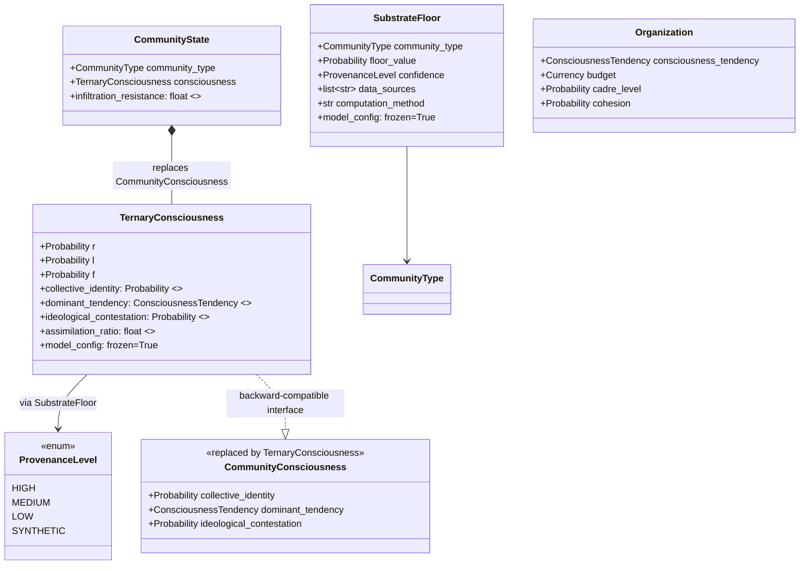
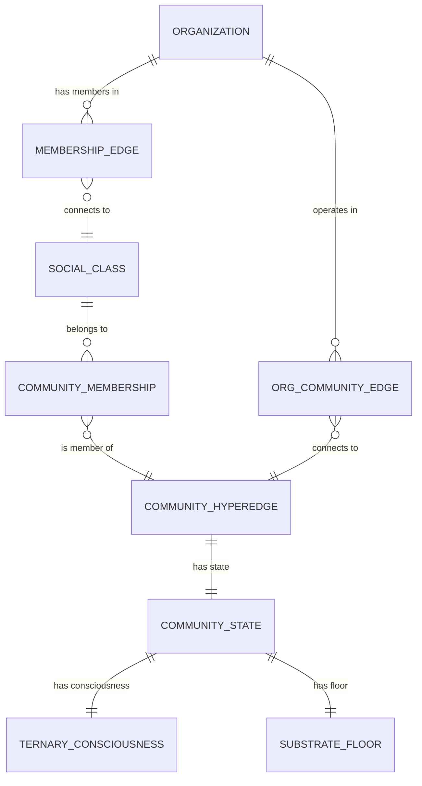
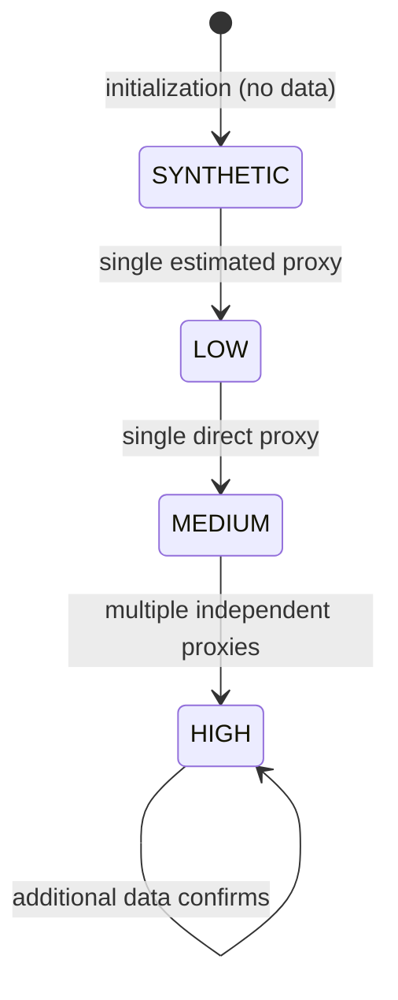
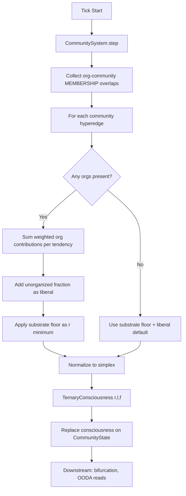

# Data Model: 034-ternary-consciousness

**Date**: 2026-03-01

## Entity Diagram

## Entities

### TernaryConsciousness

Replaces `CommunityConsciousness`. Frozen Pydantic model representing
a point in the 2-simplex with r + l + f = 1.0.

| Field | Type | Constraint | Description |
|-------|------|------------|-------------|
| `r` | `Probability` | `>= 0` | Revolutionary component |
| `l` | `Probability` | `>= 0` | Liberal component |
| `f` | `Probability` | `>= 0` | Fascist component |

**Simplex validator**: `@model_validator(mode="after")` enforces
`abs(r + l + f - 1.0) < 1e-6`.

**Computed properties** (backward-compatible):

| Property | Type | Derivation |
|----------|------|------------|
| `collective_identity` | `Probability` | Returns `self.r` |
| `dominant_tendency` | `ConsciousnessTendency` | `argmax(r, l, f)` mapped to enum |
| `ideological_contestation` | `Probability` | Normalized Shannon entropy of `(r, l, f)` |
| `assimilation_ratio` | `float` | `f / (l + f)` if `l + f > 1e-6` else `0.5` |

### SubstrateFloor

Per-community-type minimum revolutionary consciousness with provenance.

| Field | Type | Default | Description |
|-------|------|---------|-------------|
| `community_type` | `CommunityType` | required | Which community this floor applies to |
| `floor_value` | `Probability` | `0.0` | Minimum `r` regardless of org landscape |
| `confidence` | `ProvenanceLevel` | `SYNTHETIC` | Data quality indicator |
| `data_sources` | `list[str]` | `[]` | Named data sources used |
| `computation_method` | `str` | `""` | How floor was derived from proxies |

**Provenance logging**: Construction with `confidence=SYNTHETIC` logs
a warning: `"SubstrateFloor for {community_type} is SYNTHETIC — no
empirical proxy data available"`.

### ProvenanceLevel

Enum indicating data quality of substrate floor computation.

| Value | Meaning |
|-------|---------|
| `HIGH` | Derived from 2+ independent proxy data sources |
| `MEDIUM` | Derived from 1 proxy data source |
| `LOW` | Estimated from related data, not direct proxy |
| `SYNTHETIC` | Stipulated placeholder with no data path |

### SUBSTRATE_FLOOR_DEFAULTS

Dict mapping `CommunityType` → `SubstrateFloor`. Initial values for
Detroit test case (Wayne + Oakland Counties):

| CommunityType | floor_value | confidence | data_sources |
|---------------|-------------|------------|--------------|
| NEW_AFRIKAN | 0.12 | MEDIUM | Vera incarceration, Chetty mobility |
| FIRST_NATIONS | 0.12 | MEDIUM | Vera incarceration, Chetty mobility |
| INCARCERATED | 0.18 | MEDIUM | Vera incarceration |
| CHICANO | 0.08 | LOW | Chetty mobility |
| WOMEN | 0.04 | LOW | estimated |
| TRANS | 0.06 | LOW | estimated |
| DISABLED | 0.03 | LOW | estimated |
| QUEER | 0.04 | LOW | estimated |
| UNDOCUMENTED | 0.10 | LOW | estimated |
| SETTLER | 0.0 | HIGH | structural (hegemonic default) |
| PATRIARCHAL | 0.0 | HIGH | structural (hegemonic default) |
| YOUTH | 0.0 | HIGH | structural (lifecycle phase) |
| ADULT | 0.0 | HIGH | structural (lifecycle phase) |
| ELDER | 0.02 | LOW | estimated (generational memory) |

Values are calibration starting points derived from midpoints of estimated
ranges. Subject to adjustment during calibration against Detroit proxy data.

### CONSCIOUSNESS_DEFAULTS Migration

Mapping from old scalar defaults to new ternary coordinates:

| CommunityType | old CI | old tendency | old contest. | new r | new l | new f |
|---------------|--------|-------------|-------------|-------|-------|-------|
| SETTLER | 0.4 | LIBERAL | 0.3 | 0.4 | 0.45 | 0.15 |
| PATRIARCHAL | 0.3 | LIBERAL | 0.2 | 0.3 | 0.60 | 0.10 |
| NEW_AFRIKAN | 0.5 | LIBERAL | 0.4 | 0.5 | 0.30 | 0.20 |
| FIRST_NATIONS | 0.6 | REVOL. | 0.3 | 0.6 | 0.25 | 0.15 |
| CHICANO | 0.4 | LIBERAL | 0.3 | 0.4 | 0.45 | 0.15 |
| WOMEN | 0.3 | LIBERAL | 0.3 | 0.3 | 0.50 | 0.20 |
| TRANS | 0.5 | LIBERAL | 0.4 | 0.5 | 0.30 | 0.20 |
| DISABLED | 0.3 | LIBERAL | 0.2 | 0.3 | 0.60 | 0.10 |
| QUEER | 0.4 | LIBERAL | 0.4 | 0.4 | 0.35 | 0.25 |
| UNDOCUMENTED | 0.5 | LIBERAL | 0.3 | 0.5 | 0.35 | 0.15 |
| INCARCERATED | 0.6 | REVOL. | 0.3 | 0.6 | 0.25 | 0.15 |
| YOUTH | 0.2 | LIBERAL | 0.5 | 0.2 | 0.40 | 0.40 |
| ADULT | 0.1 | LIBERAL | 0.1 | 0.1 | 0.85 | 0.05 |
| ELDER | 0.3 | LIBERAL | 0.2 | 0.3 | 0.60 | 0.10 |

**Migration rule**: `r = old_CI`. The `l` and `f` split is chosen so
that: (1) `dominant_tendency` = argmax matches old value, (2) Shannon
entropy of `(r, l, f)` approximates old `ideological_contestation`,
(3) `r + l + f = 1.0`. Exact values subject to calibration.

## Relationships

## State Transitions

TernaryConsciousness does not have state transitions per se — it is
recomputed each tick. However, the substrate floor has a lifecycle:

The provenance level can only increase (data quality improves, never
degrades). The floor value itself can change when proxy data is updated
(at most once per simulation year per FR-002).

## Computation Flow (Per Tick)

