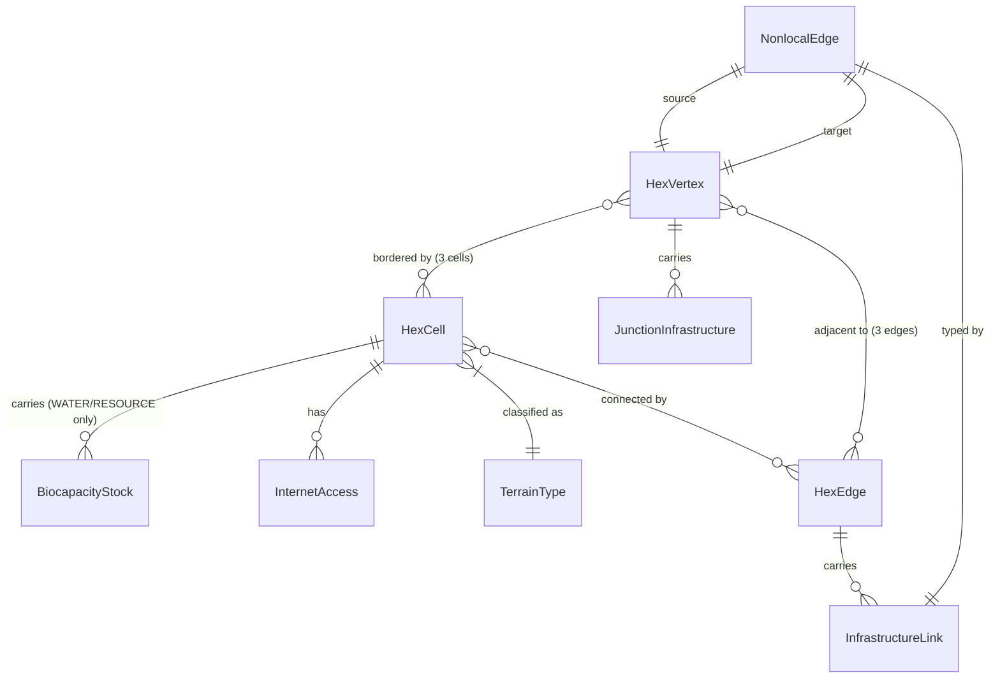

# Data Model: Infrastructure Topology Layer

**Feature**: 036-infrastructure-topology
**Date**: 2026-03-01
**Spec Reference**: FR-001 through FR-033

## Entity Overview

## Enumerations

### TerrainType

Classifies each hex cell's terrain for habitability and resource determination.

| Value | Description | Habitability | Economic Activity | Biocapacity |
|-------|-------------|-------------|-------------------|-------------|
| `LAND` | Standard habitable terrain | Full | Standard production | None |
| `WATER` | Lakes, rivers, ocean | None | Excluded | FRESHWATER, FISHERY, SHIPPING_ACCESS |
| `RESOURCE` | Mountains, plateaus, basins | Minimal | Excluded | MINERAL, TIMBER, HYDROELECTRIC |

**Source**: FR-001. Static after initialization (FR-002).

### BiocapacityType

Types of extractable natural resource stocks on non-LAND hexes.

| Value | Terrain | Description | Source |
|-------|---------|-------------|--------|
| `FRESHWATER` | WATER | Industrial/municipal water supply | FR-005 |
| `FISHERY` | WATER | Extractable food production | FR-005 |
| `SHIPPING_ACCESS` | WATER | Enables maritime flow on adjacent edges | FR-005 |
| `MINERAL` | RESOURCE | Extractable mineral wealth | FR-006 |
| `TIMBER` | RESOURCE | Forest products | FR-006 |
| `HYDROELECTRIC` | RESOURCE | Hydroelectric potential | FR-006 |

### InfrastructureType

Types of infrastructure links that can exist on edges or vertices.

| Value | Flow Categories Served | NE Source | NE Attributes |
|-------|----------------------|-----------|---------------|
| `HIGHWAY` | freight, commuter | `ne_10m_roads` | type=Major Highway, expressway=1 |
| `ARTERIAL` | freight, commuter | `ne_10m_roads` | type=Secondary Highway |
| `LOCAL_ROAD` | commuter, consciousness | `ne_10m_roads_north_america` | class=State/Federal, type=Primary/Secondary |
| `RAIL` | freight | `ne_10m_railroads` | category, mult_track |
| `PIPELINE` | energy | Future | Not in MVP NE data |
| `TRANSMISSION` | energy | Future | Not in MVP NE data |
| `SHIPPING_LANE` | freight | `ne_10m_ports` | scalerank, natlscale |
| `AIR_LINK` | freight, value | `ne_10m_airports` | scalerank, natlscale, type |

**Source**: FR-009.

### FlowCategory

Categories of flow that infrastructure serves.

| Value | Description |
|-------|-------------|
| `FREIGHT` | Physical goods movement |
| `COMMUTER` | Worker commutation |
| `VALUE` | Financial value transfer |
| `ENERGY` | Energy distribution |
| `CONSCIOUSNESS` | Information/idea propagation |

### JunctionType

Types of junction infrastructure on vertices.

| Value | Description | NE Source |
|-------|-------------|-----------|
| `INTERCHANGE` | Highway interchange | Derived from road intersections |
| `SUBSTATION` | Energy substation | Future |
| `RAIL_JUNCTION` | Railroad junction | Derived from rail intersections |
| `PORT` | Maritime port | `ne_10m_ports` |
| `AIRPORT` | Aviation hub | `ne_10m_airports` |

**Source**: FR-016.

### LocalityClass

Classification of edges by distance relative to hex scale.

| Value | Description | Criteria |
|-------|-------------|----------|
| `LOCAL` | Adjacent hex edge | ratio < 3.0 |
| `SEMI_LOCAL` | Short nonlocal | 3.0 <= ratio < 20.0 |
| `NONLOCAL` | Long-range link | ratio >= 20.0 |

**Source**: FR-022. Ratio = edge_distance / average_hex_diameter.

### InternetResponseMode

State apparatus response modes for hex internet access.

| Value | Throughput | Surveillance | Visibility | Consciousness Effect |
|-------|-----------|-------------|------------|---------------------|
| `PERMIT` | Full | Full | N/A | Default |
| `THROTTLE` | Reduced | Maintained | Hidden | Partial suppression |
| `SEVER` | Zero | Zero | Visible to all | Backfire (signals state fear) |

**Source**: FR-029.

## Entities

### BiocapacityStock

A typed, depletable resource stock on a WATER or RESOURCE hex.

| Field | Type | Constraints | Description |
|-------|------|-------------|-------------|
| `h3_index` | str | PK, regex `^[0-9a-f]{15}$` | H3 cell identifier |
| `stock_type` | BiocapacityType | PK | Resource classification |
| `initial_value` | float | >= 0.0 | Stock level at initialization |
| `current_value` | float | >= 0.0 | Current stock level |
| `depletion_history` | list[float] | per-tick | Extraction amounts per tick |

**Lifecycle**: Initialized at simulation start from NE geographic data (FR-005, FR-006). Depletes via extraction (FR-007, FR-008). Never regenerates in MVP. When `current_value == 0.0`, extraction ceases.

**Source**: FR-005, FR-006, FR-007, FR-008.

### InfrastructureLink

A single infrastructure element on an edge or vertex.

| Field | Type | Constraints | Description |
|-------|------|-------------|-------------|
| `link_id` | str | PK, unique | Unique identifier |
| `infra_type` | InfrastructureType | required | Infrastructure classification |
| `capacity` | dict[FlowCategory, float] | values >= 0.0 | Capacity per flow category |
| `condition` | float | [0.0, 1.0] | Health/degradation scalar |
| `owner_org_id` | str or None | FK to organization | Owning organization |
| `ne_source_id` | str or None | | Natural Earth feature ID for provenance |

**Lifecycle**: Created during initialization from NE data (FR-011) or via BUILD_INFRASTRUCTURE action (Feature 032). Condition degrades via ATTACK_INFRASTRUCTURE (FR-018). Condition at 0.0 = destroyed (zero effective capacity).

**Effective capacity**: `capacity[category] * condition` for each flow category.

**Source**: FR-009, FR-010, FR-012.

### EdgeInfrastructure

The collection of InfrastructureLinks on a single H3 edge.

| Field | Type | Constraints | Description |
|-------|------|-------------|-------------|
| `source_h3` | str | PK part | Source hex H3 index |
| `target_h3` | str | PK part | Target hex H3 index |
| `links` | list[InfrastructureLink] | >= 0 items | Infrastructure inventory |
| `source_terrain` | TerrainType | | Terrain of source hex |
| `target_terrain` | TerrainType | | Terrain of target hex |

**Derived properties**:
- `aggregate_capacity(category: FlowCategory) -> float`: Sum of `link.capacity[category] * link.condition` for all links. Returns 0.0 if edge is WATER-WATER with no SHIPPING_LANE (FR-013).
- `natural_capacity(category: FlowCategory) -> float`: Minimal capacity from population density when no infrastructure links exist (FR-014). Only for LAND-LAND edges and only for COMMUTER and CONSCIOUSNESS categories.
- `total_capacity(category: FlowCategory) -> float`: `aggregate_capacity + natural_capacity`. Used as edge weight in weighted Laplacian (FR-030).

**Source**: FR-010, FR-012, FR-013, FR-014.

### HexVertex

A triple junction where three hexes meet.

| Field | Type | Constraints | Description |
|-------|------|-------------|-------------|
| `vertex_id` | str | PK, derived | Canonical identifier (sorted triple hash) |
| `adjacent_h3` | tuple[str, str, str] | ordered | Three adjacent hex H3 indices |
| `lat` | float | | Latitude (centroid of 3 hex centroids) |
| `lon` | float | | Longitude (centroid of 3 hex centroids) |
| `junctions` | list[JunctionInfrastructure] | >= 0 items | Junction infrastructure inventory |

**Identity**: Vertex uniquely identified by its ordered triple of adjacent H3 indices. Total count consistent with Euler's formula (FR-015).

**Source**: FR-015, FR-016.

### JunctionInfrastructure

Infrastructure sited at a vertex (triple junction).

| Field | Type | Constraints | Description |
|-------|------|-------------|-------------|
| `junction_type` | JunctionType | required | Junction classification |
| `capacity_contribution` | float | >= 0.0 | Capacity added to adjacent edges |
| `condition` | float | [0.0, 1.0] | Health/degradation scalar |
| `owner_org_id` | str or None | FK to organization | Owning organization |
| `ne_source_id` | str or None | | Natural Earth feature ID for provenance |

**Cascade rule**: When `condition` is reduced (ATTACK_INFRASTRUCTURE), all 3 adjacent edges lose `capacity_contribution * condition_delta` from their aggregate capacity (FR-018).

**Source**: FR-016, FR-017, FR-018.

### NonlocalEdge

An edge connecting two non-adjacent vertices.

| Field | Type | Constraints | Description |
|-------|------|-------------|-------------|
| `source_vertex_id` | str | FK to HexVertex | Origin vertex |
| `target_vertex_id` | str | FK to HexVertex | Destination vertex |
| `link` | InfrastructureLink | required | The infrastructure creating this edge |
| `distance_km` | float | > 0.0 | Great-circle distance between vertices |
| `locality_class` | LocalityClass | derived | LOCAL/SEMI_LOCAL/NONLOCAL |
| `origin_feature` | str | | NE feature that generated this edge |

**Graph participation**: Nonlocal edges are added to the same graph as local edges. Field systems (Laplacian, gradient, curvature) compute over them identically (FR-019).

**Source**: FR-019, FR-020, FR-021, FR-022.

### InternetAccess

Per-hex internet connectivity attributes.

| Field | Type | Constraints | Description |
|-------|------|-------------|-------------|
| `h3_index` | str | PK | H3 cell identifier |
| `internet_access` | bool | | Whether broadband available |
| `internet_quality` | float | [0.0, 1.0] | Coverage quality scalar |
| `surveillance_coupling` | float | [0.0, 1.0] | State visibility fraction |
| `response_mode` | InternetResponseMode | default PERMIT | State apparatus control mode |

**Initialization**: `internet_access` from FCC broadband data (pct_25_3 >= threshold). `internet_quality` from pct_100_20 / 100. `surveillance_coupling` SYNTHETIC default from GameDefines (FR-023, FR-024, FR-026).

**Mutation**: COUNTER_INTEL reduces `surveillance_coupling` at cost of throughput (FR-028). State can THROTTLE or SEVER (FR-029).

**Source**: FR-023 through FR-029.

## State Relationships

### Terrain to Economics

- WATER/RESOURCE hexes: zero population, zero employment, zero c/v/s (FR-004)
- LAND hexes adjacent to resource hexes: can extract biocapacity through edges with appropriate infrastructure (FR-007)
- Extraction feeds LAND hex production capacity (increases effective constant capital)

### Infrastructure to Field Topology

- Edge `total_capacity` becomes the edge weight in the weighted Laplacian (FR-030)
- Zero-capacity edges contribute zero to Laplacian (effectively severed from diffusion)
- Nonlocal edges modify the graph topology for all field computations
- Curvature computation uses infrastructure-weighted distances

### Internet to Consciousness

- Internet-enabled hexes form a connected component for consciousness field diffusion (FR-025)
- Diffusion is a single field operation, not pairwise edges
- Each tick: state intelligence += flow_magnitude * surveillance_coupling * analytical_capacity (FR-027)
- OPSEC reduces coupling but also reduces throughput (FR-028)

### Infrastructure to Actions (Feature 032)

- BUILD_INFRASTRUCTURE: adds InfrastructureLink to edge/vertex inventory
- ATTACK_INFRASTRUCTURE: degrades condition of link or junction
- Vertex destruction cascades to 3 adjacent edges (FR-018)

## Persistence Strategy

Infrastructure state persists via tick-keyed storage (FR-032):
- `BiocapacityStock.current_value` and `depletion_history` tracked per tick
- `InfrastructureLink.condition` tracked per tick
- `InternetAccess.response_mode` and `surveillance_coupling` tracked per tick
- Terrain classification static (FR-002) -- stored once at initialization

Infrastructure entities are stored separately from `WorldState.relationships` because they represent physical substrate, not social relations. They participate in the graph via edge/node attributes but are serialized independently.
