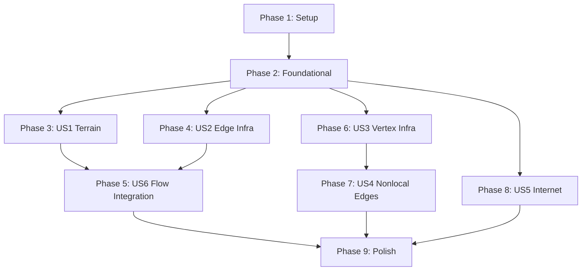

# Tasks: Infrastructure Topology Layer

**Input**: Design documents from `/specs/036-infrastructure-topology/`
**Prerequisites**: plan.md, spec.md, research.md, data-model.md, contracts/

**Tests**: Included per project TDD mandate (CLAUDE.md: "Red-Green-Refactor cycle mandatory").

**Organization**: Tasks grouped by user story. Sequencing follows spec recommendation (US1 → US2 → US6 → US3 → US4 → US5).

## Format: `[ID] [P?] [Story] Description`

- **[P]**: Can run in parallel (different files, no dependencies)
- **[Story]**: Which user story this task belongs to (e.g., US1, US2)
- Include exact file paths in descriptions

______________________________________________________________________

## Phase 1: Setup (Shared Infrastructure)

**Purpose**: Create module structure, enumerations, and GameDefines sub-models needed by all user stories.

- [x] T001 Create infrastructure module structure: `src/babylon/infrastructure/__init__.py`, `src/babylon/data/natural_earth/__init__.py`, `src/babylon/data/h3/mesh.py` (stub), `tests/unit/infrastructure/conftest.py` (verified 2026-07-08: src/babylon/infrastructure/__init__.py:1; tests/unit/infrastructure/conftest.py:1 (module consolidated under src/babylon/infrastructure/))
- [x] T002 [P] Add infrastructure enumerations to `src/babylon/models/enums.py`: TerrainType (LAND, WATER, RESOURCE), BiocapacityType (FRESHWATER, FISHERY, SHIPPING_ACCESS, MINERAL, TIMBER, HYDROELECTRIC), InfrastructureType (HIGHWAY, ARTERIAL, LOCAL_ROAD, RAIL, PIPELINE, TRANSMISSION, SHIPPING_LANE, AIR_LINK), FlowCategory (FREIGHT, COMMUTER, VALUE, ENERGY, CONSCIOUSNESS), JunctionType (INTERCHANGE, SUBSTATION, RAIL_JUNCTION, PORT, AIRPORT), LocalityClass (LOCAL, SEMI_LOCAL, NONLOCAL), InternetResponseMode (PERMIT, THROTTLE, SEVER). All as StrEnum per existing pattern. (verified 2026-07-08: src/babylon/models/enums/territory.py:117,:135,:159; enums/topology.py:111,:138,:159; enums/organizations.py:175)
- [x] T003 [P] Add TerrainDefines sub-model to `src/babylon/config/defines.py`: majority_coverage_threshold (default 0.5, FR-001), biocapacity initial stock values per type (SYNTHETIC flagged, FR-005/FR-006), internet_access_threshold (default 0.5, FR-024), default_surveillance_coupling (SYNTHETIC, FR-026). Add to GameDefines with default_factory and `_from_yaml_dict()`. Add YAML section to `src/babylon/config/defines.yaml`. (verified 2026-07-08: InfraTerrainDefines src/babylon/config/defines/territory.py:308; wired _assembler.py:166,:295)
- [x] T004 [P] Add InfrastructureDefines sub-model to `src/babylon/config/defines.py`: per-type capacity coefficients for each InfrastructureType (FR-012), natural_capacity_coefficient for population-derived minimal capacity (FR-014), minimum_capacity_threshold for snapping filter (EC-006), biocapacity depletion rates per stock type (FR-007), opsec_tradeoff_ratio (FR-028), throttle_throughput_fraction (FR-029). Add to GameDefines, `_from_yaml_dict()`, and YAML. (verified 2026-07-08: InfrastructureDefines src/babylon/config/defines/territory.py:476; wired _assembler.py:167,:296)

______________________________________________________________________

## Phase 2: Foundational (Blocking Prerequisites)

**Purpose**: H3 mesh utilities and Natural Earth data reader. MUST complete before any user story.

- [x] T005 Write tests for H3 mesh edge enumeration in `tests/unit/infrastructure/test_h3_mesh.py`: given a set of H3 cells, enumerate all edges as ordered (source, target) pairs via `h3.grid_disk(cell, 1)`, verify edge count consistent with mesh topology, verify each edge pair is unique and ordered. (verified 2026-07-08: tests/unit/infrastructure/test_h3_mesh.py:19)
- [x] T006 Implement H3 mesh edge enumeration in `src/babylon/data/h3/mesh.py`: `enumerate_edges(cells: set[str]) -> list[tuple[str, str]]` that finds all neighbor pairs within the cell set, returns ordered pairs. Uses `h3.grid_disk()` and set intersection. (verified 2026-07-08: src/babylon/infrastructure/h3_mesh.py:20)
- [x] T007 Write tests for H3 mesh vertex enumeration in `tests/unit/infrastructure/test_h3_mesh.py`: given edges, enumerate vertices as ordered triples of adjacent H3 indices, verify vertex count consistent with Euler's formula (V - E + F = 2 for planar graph, FR-015), verify each vertex shared by exactly 3 cells. (verified 2026-07-08: tests/unit/infrastructure/test_h3_mesh.py:141,:103)
- [x] T008 Implement H3 mesh vertex enumeration in `src/babylon/data/h3/mesh.py`: `enumerate_vertices(edges: list[tuple[str, str]]) -> list[VertexState]` that identifies triple junctions, computes canonical vertex_id from sorted triple hash, and derives lat/lon from cell centroids via `h3.cell_to_latlng()`. (verified 2026-07-08: src/babylon/infrastructure/h3_mesh.py:44 (vertex_id sha256 :104))
- [x] T009 Write tests for NaturalEarthReader in `tests/unit/infrastructure/test_ne_reader.py`: test load_lakes (query `ne_10m_lakes` + `ne_10m_lakes_north_america` with bbox filter), test load_roads (query `ne_10m_roads` + `ne_10m_roads_north_america`), test load_airports, test load_ports, test load_geography_regions. Use Detroit-area bbox. Verify DTW airport (scalerank 3, iata_code DTW), verify Great Lakes present, verify Michigan interstates (prefix="I" in NA roads supplement). (verified 2026-07-08: tests/unit/infrastructure/test_ne_reader.py (DTW :115; lakes/roads/airports/ports/regions))
- [~] T010 Implement NaturalEarthReader in `src/babylon/data/natural_earth/reader.py`: read-only access to Natural Earth SQLite at `/media/user/data/babylon-data/natural-earth/packages/natural_earth_vector.sqlite`. Protocol-based reader with methods: `load_lakes(bbox)`, `load_rivers(bbox)`, `load_roads(bbox)`, `load_railroads(bbox)`, `load_airports(bbox)`, `load_ports(bbox)`, `load_geography_regions(bbox)`. Each returns typed dataclasses with Shapely geometries converted from SpatiaLite GEOMETRY blobs via `shapely.wkb.loads()`. Bbox filter uses MBR columns or spatial query. (partial 2026-07-08: NaturalEarthReader src/babylon/infrastructure/natural_earth_reader.py:137 has 6 of 7 named loaders; load_rivers absent)

**Checkpoint**: H3 mesh utilities and NE reader ready. User story implementation can begin.

______________________________________________________________________

## Phase 3: User Story 1 -- Terrain Classification and Biocapacity (Priority: P1) MVP

**Goal**: Classify every hex as LAND/WATER/RESOURCE from Natural Earth data and initialize depletable biocapacity stocks on non-LAND hexes.

**Independent Test**: Given the tri-county hex mesh, classify all hexes. WATER hex count within 20% of expected (50-150 at r7). Great Lakes hexes classified WATER. Biocapacity stocks initialized on WATER hexes with correct types (FRESHWATER, FISHERY, SHIPPING_ACCESS). Extraction through a LAND-WATER edge depletes stock.

### Tests for User Story 1

- [x] T011 [P] [US1] Write terrain classification tests in `tests/unit/infrastructure/test_terrain.py`: test classify_hex returns LAND for inland hex, WATER for Great Lakes hex, correct water_coverage_fraction; test classify_mesh batch classification; test RESOURCE classification from geography regions featurecla (Range/mtn, Plateau, Basin, Delta, Wetlands); test EC-001 majority-area tiebreaking; test source_features populated for audit trail. (verified 2026-07-08: tests/unit/infrastructure/test_terrain.py:54 (tiebreak :122, source_features :204))
- [x] T012 [P] [US1] Write biocapacity stock tests in `tests/unit/infrastructure/test_terrain.py`: test initialize_stocks creates FRESHWATER/FISHERY/SHIPPING_ACCESS for WATER hexes (FR-005), MINERAL/TIMBER/HYDROELECTRIC for RESOURCE hexes (FR-006); test get_stock returns correct state; test extract computes min(infrastructure_capacity, depletion_rate * current_value, current_value) per FR-007; test extract updates stock in place; test depleted stock returns zero extraction (FR-008); test LAND hexes get no stocks. (verified 2026-07-08: tests/unit/infrastructure/test_terrain.py:220)

### Implementation for User Story 1

- [x] T013 [US1] Implement DefaultTerrainClassifier in `src/babylon/infrastructure/terrain.py`: takes NaturalEarthReader and TerrainDefines. `classify_hex()` performs spatial intersection of hex polygon (via `h3.cell_to_boundary()` → Shapely Polygon) with NE lake/river/region geometries. Uses majority_coverage_threshold from TerrainDefines. `classify_mesh()` batch-classifies all hexes. Returns TerrainClassification DTOs from `contracts/terrain.py`. (verified 2026-07-08: src/babylon/infrastructure/terrain.py:49 DefaultTerrainClassifier)
- [x] T014 [US1] Implement DefaultBiocapacityStore in `src/babylon/infrastructure/terrain.py`: takes TerrainDefines for initial stock values. `initialize_stocks()` creates typed stocks per terrain (WATER → FRESHWATER/FISHERY/SHIPPING_ACCESS, RESOURCE → MINERAL/TIMBER/HYDROELECTRIC) with initial values from defines (SYNTHETIC flagged). `extract()` computes amount = min(infrastructure_capacity, depletion_rate * current, current) and updates internal state. Returns ExtractionResult DTO. (verified 2026-07-08: src/babylon/infrastructure/terrain.py:181; extract cap :290)
- [x] T015 [US1] Add package exports in `src/babylon/infrastructure/__init__.py`: export DefaultTerrainClassifier, DefaultBiocapacityStore, and all DTOs from contracts/terrain.py. Update `__all__` list. (verified 2026-07-08: src/babylon/infrastructure/__init__.py:36-53)
- [ ] T016 [US1] Write integration test for US1 in `tests/integration/test_terrain_integration.py`: use real NE SQLite database, classify a known set of Detroit-area hexes, verify Great Lakes hexes are WATER, verify SC-001 (WATER hex count within 20% of expected 50-150), verify biocapacity stocks initialized on WATER hexes. (left unchecked 2026-07-08: no tests/integration/test_terrain_integration.py — SC-001 not covered anywhere)

**Checkpoint**: Terrain classification and biocapacity operational. Every hex has a terrain type; WATER hexes have depletable stocks.

______________________________________________________________________

## Phase 4: User Story 2 -- Edge Infrastructure (Priority: P1)

**Goal**: Each hex edge carries a typed infrastructure inventory initialized from Natural Earth roads/railroads. Edges have computable aggregate capacity per flow category.

**Independent Test**: Given the classified mesh from US1, snap NE roads/railroads to H3 edges. I-75 corridor appears as continuous HIGHWAY-typed edges (SC-002). Edge capacity computation returns correct per-category totals. WATER-WATER edges have zero non-maritime capacity (FR-013). Empty LAND-LAND edges have natural capacity (FR-014).

### Tests for User Story 2

- [x] T017 [P] [US2] Write spatial snapping tests in `tests/unit/infrastructure/test_snapping.py`: test snap_linear_features assigns NE road geometry to intersecting H3 edges (buffered boundary segments); test road type mapping (Major Highway → HIGHWAY, Secondary Highway → ARTERIAL, etc.); test railroad snapping; test EC-006 minimum capacity threshold filtering; test EC-005 tolerance handling for NE/H3 resolution mismatch. (verified 2026-07-08: tests/unit/infrastructure/test_snapping.py (:202,:234,:471))
- [x] T018 [P] [US2] Write infrastructure inventory tests in `tests/unit/infrastructure/test_inventory.py`: test get_edge_links returns empty list for uninitialized edge; test add_edge_link adds link to inventory; test degrade_link reduces condition and clamps to [0.0, 1.0]; test effective_capacity returns capacity * condition; test InfrastructureLinkState DTO validation (frozen, field constraints). (verified 2026-07-08: tests/unit/infrastructure/test_inventory.py (:112,:216))
- [x] T019 [P] [US2] Write edge capacity tests in `tests/unit/infrastructure/test_capacity.py`: test compute_edge_capacity aggregate = sum of effective link capacities; test natural_capacity only on LAND-LAND edges for COMMUTER and CONSCIOUSNESS only (FR-014); test WATER-WATER edges return zero unless SHIPPING_LANE present (FR-013); test total = aggregate + natural; test compute_mesh_weights batch computation. (verified 2026-07-08: tests/unit/infrastructure/test_capacity.py (:76))

### Implementation for User Story 2

- [x] T020 [US2] Implement DefaultSpatialSnapper in `src/babylon/infrastructure/snapping.py`: takes NaturalEarthReader and InfrastructureDefines. `snap_linear_features()` computes shared boundary segment for each H3 edge pair (from `h3.cell_to_boundary()`), buffers by tolerance, tests intersection with NE road/railroad geometries. Maps NE attributes (type, scalerank, class) to InfrastructureType and per-category capacity via InfrastructureDefines coefficients. `snap_point_features()` finds nearest vertex within tolerance for airports/ports. Returns typed DTOs from contracts/infrastructure.py. (verified 2026-07-08: src/babylon/infrastructure/snapping.py:120)
- [x] T021 [US2] Implement DefaultInfrastructureInventory in `src/babylon/infrastructure/inventory.py`: internal storage as dict[(source_h3, target_h3), list[InfrastructureLinkState]] for edges and dict[vertex_id, VertexState] for vertices. Implements InfrastructureInventory Protocol: get_edge_links, add_edge_link, degrade_link (clamp condition to 0.0), get_vertex, degrade_junction (cascade to 3 adjacent edges per FR-018), get_nonlocal_edges. (verified 2026-07-08: src/babylon/infrastructure/inventory.py:22)
- [~] T022 [US2] Implement DefaultEdgeCapacityCalculator in `src/babylon/infrastructure/capacity.py`: takes InfrastructureDefines. `compute_edge_capacity()` sums effective link capacities per FlowCategory, adds natural_capacity for LAND-LAND edges (COMMUTER/CONSCIOUSNESS only, derived from population_density * natural_capacity_coefficient), enforces zero capacity for WATER-WATER without SHIPPING_LANE (FR-013). `compute_mesh_weights()` iterates all edges and returns total_capacity dict. (partial 2026-07-08: DefaultEdgeCapacityCalculator src/babylon/infrastructure/capacity.py:27, but WATER-WATER zeroed unconditionally (:67, no FR-013 SHIPPING_LANE exception) and population_density param ignored (:51))
- [ ] T023 [US2] Write integration test for US2 in `tests/integration/test_infrastructure_integration.py`: use real NE SQLite, snap Detroit-area roads to H3 mesh edges, verify Michigan interstates (I-75, I-94, I-96) appear as continuous HIGHWAY-typed edge sequences (SC-002), verify capacity computation produces nonzero values on infrastructure-carrying edges. (left unchecked 2026-07-08: no tests/integration/test_infrastructure_integration.py (I-75/SC-002))

**Checkpoint**: Edge infrastructure initialized from NE data. Edges have typed infrastructure inventories and computable capacity.

______________________________________________________________________

## Phase 5: User Story 6 -- Flow System Integration (Priority: P3, sequenced early per spec)

**Goal**: Wire infrastructure-derived edge weights into the weighted Laplacian and curvature computations, making terrain and infrastructure consequential for field dynamics.

**Independent Test**: Compare Laplacian output with and without infrastructure weights. Contradiction gradients across infrastructure-poor boundaries (Detroit River) steeper than across infrastructure-rich boundaries (I-75 corridor) -- SC-003.

### Tests for User Story 6

- [x] T024 [P] [US6] Write weighted Laplacian tests in `tests/unit/infrastructure/test_weighted_laplacian.py`: test that `edge_weight_attr=None` preserves existing unweighted behavior (backward compatibility); test that `edge_weight_attr="infrastructure_capacity"` weights the Laplacian sum by edge attribute; test zero-weight edges contribute zero to Laplacian (FR-030); test field gradient differs between weighted and unweighted computation. (verified 2026-07-08: tests/unit/infrastructure/test_weighted_laplacian.py (:117))
- [x] T025 [P] [US6] Write weighted curvature tests in `tests/unit/infrastructure/test_weighted_curvature.py`: test `_probability_measure()` distributes weight proportional to edge weight instead of uniformly; test `_graph_distance()` uses weighted shortest paths; test Ollivier-Ricci curvature changes when infrastructure weights differ across edges. (verified 2026-07-08: tests/unit/infrastructure/test_weighted_curvature.py (:92,:136))

### Implementation for User Story 6

- [x] T026 [US6] Modify `FieldDerivativeSystem._collect_neighbor_fields()` in `src/babylon/engine/systems/field_derivative.py` to accept optional `edge_weight_attr: str | None` parameter. When set, read edge attribute and multiply Laplacian contribution: `w_ij * (f(j) - f(i))` instead of `f(j) - f(i)`. When None, behavior unchanged (backward compatible per R3). (verified 2026-07-08: src/babylon/engine/systems/field_derivative.py:231; weighted Laplacian :198; None-weight 1.0 :271)
- [x] T027 [US6] Modify `_compute_node_derivatives()` in `src/babylon/engine/systems/field_derivative.py` to thread edge weight through gradient and Laplacian computations. Zero-weight edges contribute zero to Laplacian. (verified 2026-07-08: src/babylon/engine/systems/field_derivative.py:156)
- [x] T028 [US6] Modify `_probability_measure()` in `src/babylon/formulas/curvature.py` to distribute `(1-alpha)` proportional to edge weight instead of uniformly across neighbors. Modify `_graph_distance()` to pass `weight=` parameter to `nx.shortest_path_length` for weighted shortest paths. (verified 2026-07-08: src/babylon/formulas/curvature.py:95 _probability_measure(weight_attr); _graph_distance :154)
- [ ] T029 [US6] Write integration test for US6 in `tests/integration/test_weighted_field_integration.py`: construct a small graph with varied infrastructure weights, compute both weighted and unweighted Laplacians, verify SC-003 (steeper gradients across low-capacity edges), verify conservation (total flow preserved within 1e-10 per SC-007). (left unchecked 2026-07-08: no tests/integration/test_weighted_field_integration.py (SC-003/SC-007))

**Checkpoint**: Infrastructure weights feed into field derivative system. Terrain and infrastructure now affect all flow computations.

______________________________________________________________________

## Phase 6: User Story 3 -- Vertex Infrastructure (Priority: P2)

**Goal**: Vertices (triple junctions) carry junction infrastructure (INTERCHANGE, PORT, AIRPORT). Junction degradation cascades to all 3 adjacent edges.

**Independent Test**: Enumerate vertices in the mesh, snap NE airports/ports to nearest vertices. Verify DTW assigned to a vertex. Degrade a junction and confirm all 3 adjacent edges lose capacity proportionally (FR-018).

### Tests for User Story 3

- [x] T030 [P] [US3] Write vertex infrastructure tests in `tests/unit/infrastructure/test_inventory.py` (extend): test get_vertex returns VertexState with correct adjacent_h3 triple; test snap_point_features assigns DTW to nearest vertex; test EC-007 vertex at shoreline (WATER + LAND hexes) can carry PORT junction; test junction capacity_contribution adds to adjacent edge aggregate capacity. (verified 2026-07-08: tests/unit/infrastructure/test_inventory.py:151-166 + test_junction_cascade.py)
- [x] T031 [P] [US3] Write junction cascade tests in `tests/unit/infrastructure/test_inventory.py` (extend): test degrade_junction reduces junction condition; test degradation cascades to all 3 adjacent edges per FR-018 (returns list of 3 affected edge pairs); test full destruction (condition → 0.0) removes junction contribution from all 3 edges. (verified 2026-07-08: tests/unit/infrastructure/test_junction_cascade.py:39,:71,:107)

### Implementation for User Story 3

- [x] T032 [US3] Extend DefaultInfrastructureInventory in `src/babylon/infrastructure/inventory.py` with vertex operations: populate vertices from `enumerate_vertices()` output, assign snapped junction infrastructure from `snap_point_features()`, implement `degrade_junction()` cascade logic (reduce junction condition, reduce capacity contribution to all 3 adjacent edges by `capacity_contribution * condition_delta`). (verified 2026-07-08: src/babylon/infrastructure/inventory.py:162 degrade_junction cascade)
- [x] T033 [US3] Extend DefaultSpatialSnapper.snap_point_features() in `src/babylon/infrastructure/snapping.py`: for each NE airport, find nearest vertex by Haversine distance within tolerance. Map airport attributes (scalerank, natlscale, type) to JunctionState with junction_type=AIRPORT. Same for ports → junction_type=PORT. (verified 2026-07-08: src/babylon/infrastructure/snapping.py:241 (airports :279, ports :298))

**Checkpoint**: Vertices carry junction infrastructure. Junction destruction cascades to adjacent edges. Strategic targeting enabled.

______________________________________________________________________

## Phase 7: User Story 4 -- Nonlocal Edges (Priority: P2)

**Goal**: Airports and ports generate nonlocal edges connecting distant vertices, enabling long-range value/consciousness flow with strongly negative Ollivier-Ricci curvature.

**Independent Test**: Generate nonlocal edges from DTW to destination airports. Verify AIR_LINK type, correct distance_km, locality_class=NONLOCAL. Compute Ollivier-Ricci curvature < -0.5 (SC-004). Nonlocal edges participate in weighted Laplacian.

### Tests for User Story 4

- [x] T034 [P] [US4] Write nonlocal edge generation tests in `tests/unit/infrastructure/test_nonlocal.py`: test airport vertex generates AIR_LINK nonlocal edges to destination airports; test port vertex generates SHIPPING_LANE nonlocal edges to other Great Lakes ports; test distance_km computed as great-circle distance; test locality_class assignment (ratio = distance / avg_hex_diameter, FR-022); test EC-004 external stub nodes created for destinations outside tri-county boundary. (verified 2026-07-08: tests/unit/infrastructure/test_nonlocal.py (:214 EC-004))
- [x] T035 [P] [US4] Write nonlocal edge graph integration tests in `tests/unit/infrastructure/test_nonlocal.py`: test nonlocal edges added to same graph as local edges (FR-019); test nonlocal edges participate in Laplacian computation; test class asymmetry (airports/shipping owned by Business/StateApparatus, never CivilSocietyOrg per US4 acceptance scenario 5). (verified 2026-07-08: tests/unit/infrastructure/test_nonlocal.py:301,:328)

### Implementation for User Story 4

- [x] T036 [US4] Implement nonlocal edge generation in `src/babylon/infrastructure/nonlocal.py`: `generate_airport_edges(airport_vertices, all_airport_vertices) -> list[NonlocalEdgeState]` creates AIR_LINK edges between airport vertices with capacity from InfrastructureDefines (scaled by scalerank/natlscale). `generate_shipping_edges(port_vertices) -> list[NonlocalEdgeState]` creates SHIPPING_LANE edges between port vertices. Compute great-circle distance via Haversine. Classify locality per FR-022 thresholds. (verified 2026-07-08: src/babylon/infrastructure/nonlocal_edges.py:160,:226 (Haversine :33, locality :61, scalerank :119))
- [ ] T037 [US4] Implement external stub node creation in `src/babylon/infrastructure/nonlocal.py`: for destination airports/ports outside the tri-county mesh, create stub nodes with fixed field values (boundary conditions per EC-004). Stub nodes participate in Laplacian but are not simulated internally. (left unchecked 2026-07-08: no external stub-node creation with fixed field/boundary values (EC-004) — only the all_airports parameter gestures at external destinations)
- [x] T038 [US4] Extend DefaultInfrastructureInventory in `src/babylon/infrastructure/inventory.py` to store and return nonlocal edges via `get_nonlocal_edges()`. Register nonlocal edges in the graph for field system participation. (verified 2026-07-08: src/babylon/infrastructure/inventory.py:230,:238)

**Checkpoint**: Nonlocal edges connect DTW and ports to distant vertices. Long-range flow paths exist. Curvature reflects bottleneck topology.

______________________________________________________________________

## Phase 8: User Story 5 -- Internet as Node-Level Consciousness Field (Priority: P3)

**Goal**: Internet access per hex enables participation in consciousness field diffusion with surveillance coupling. OPSEC tradeoff and state response modes (PERMIT/THROTTLE/SEVER) create strategic gameplay mechanics.

**Independent Test**: Initialize internet access from FCC broadband data. Run consciousness diffusion on internet-connected component. Verify surveillance intelligence generated (SC-005). Apply COUNTER_INTEL to reduce coupling at cost of throughput. SEVER a hex and verify it leaves the component with consciousness backfire.

### Tests for User Story 5

- [x] T039 [P] [US5] Write internet access initialization tests in `tests/unit/infrastructure/test_internet.py`: test initialize_from_broadband maps county broadband penetration to hex internet_access (FR-024); test internet_quality derived from pct_100_20/100 clamped to [0,1]; test default surveillance_coupling from TerrainDefines (SYNTHETIC, FR-026); test EC-009 WATER hexes default to internet_access=False. (verified 2026-07-08: tests/unit/infrastructure/test_internet.py:28 (:91))
- [x] T040 [P] [US5] Write consciousness field diffusion tests in `tests/unit/infrastructure/test_internet.py`: test get_connected_component excludes SEVER hexes; test propagate_consciousness diffuses values among enabled hexes as single field operation (FR-025, not pairwise); test THROTTLE reduces effective diffusion rate; test SEVER hex excluded from component; test severed hex still propagates via local physical edges (FR-025 acceptance 7). (verified 2026-07-08: tests/unit/infrastructure/test_internet.py:315 (:345,:369))
- [x] T041 [P] [US5] Write surveillance and OPSEC tests in `tests/unit/infrastructure/test_internet.py`: test generate_surveillance computes intelligence = flow_magnitude * coupling * analytical_capacity (FR-027); test apply_opsec reduces coupling but also reduces throughput (FR-028); test tradeoff_ratio from InfrastructureDefines; test set_response_mode SEVER: zero throughput, zero surveillance, visible=True, nonzero backfire_magnitude (FR-029); test THROTTLE: reduced throughput, maintained surveillance, visibility=False. (verified 2026-07-08: tests/unit/infrastructure/test_internet.py:129,:208 (:235,:261))

### Implementation for User Story 5

- [x] T042 [US5] Implement DefaultInternetAccessManager in `src/babylon/infrastructure/internet.py`: internal storage as dict[h3_index, InternetAccessState]. `initialize_from_broadband()` maps county FIPS → broadband percentage → hex internet attributes via hex_to_county mapping (R6). `apply_opsec()` reduces surveillance_coupling by opsec_investment * tradeoff_ratio, reduces throughput proportionally. `set_response_mode()` transitions between PERMIT/THROTTLE/SEVER with appropriate effects per FR-029. (verified 2026-07-08: src/babylon/infrastructure/internet.py:27)
- [x] T043 [US5] Implement DefaultInternetFieldOperator in `src/babylon/infrastructure/internet.py`: takes InternetAccessManager. `get_connected_component()` returns set of h3_indices with internet_access=True and response_mode != SEVER. `propagate_consciousness()` runs field diffusion (mean-field approximation) on connected component with THROTTLE rate reduction. `generate_surveillance()` computes per-hex intelligence generation per FR-027 formula. (verified 2026-07-08: src/babylon/infrastructure/internet.py:258)
- [ ] T044 [US5] Write integration test for US5 in `tests/integration/test_internet_integration.py`: initialize internet from mock FCC data for 3 counties, verify ~80-95% of hexes internet-enabled (A-004). Run consciousness propagation, verify global diffusion among enabled hexes. Apply OPSEC to one hex, verify reduced coupling. SEVER another hex, verify exclusion from component and backfire effect. Verify SC-005 (measurable intelligence increases). (left unchecked 2026-07-08: no tests/integration/test_internet_integration.py (SC-005))

**Checkpoint**: Internet consciousness field operational. Surveillance coupling generates intelligence. OPSEC tradeoff and state response modes create strategic depth.

______________________________________________________________________

## Phase 9: Polish and Cross-Cutting Concerns

**Purpose**: Final integration, validation, and cleanup across all user stories.

- [x] T045 [P] Write contract compliance tests in `tests/contract/test_infrastructure_contracts.py`: verify DefaultTerrainClassifier satisfies TerrainClassifier Protocol (runtime_checkable), DefaultBiocapacityStore satisfies BiocapacityStore, DefaultInfrastructureInventory satisfies InfrastructureInventory, DefaultEdgeCapacityCalculator satisfies EdgeCapacityCalculator, DefaultSpatialSnapper satisfies SpatialSnapper, DefaultInternetFieldOperator satisfies InternetFieldOperator, DefaultInternetAccessManager satisfies InternetAccessManager. All 7 Protocols. (verified 2026-07-08: tests/contract/test_infrastructure_contracts.py:37 (:40-106, all 7 protocols))
- [ ] T046 [P] Write end-to-end integration test in `tests/integration/test_infrastructure_e2e.py`: full pipeline from NE data → terrain classification → infrastructure snapping → capacity computation → weighted Laplacian → field derivative output. Verify all 8 success criteria (SC-001 through SC-008). (left unchecked 2026-07-08: no tests/integration/test_infrastructure_e2e.py — SC-001..SC-008 unverified)
- [x] T047 Update package exports in `src/babylon/infrastructure/__init__.py`: ensure all public classes, protocols, and DTOs are exported with complete `__all__` list. Update `src/babylon/data/natural_earth/__init__.py` exports. (verified 2026-07-08: src/babylon/infrastructure/__init__.py:55-93 __all__)
- [ ] T048 Run quickstart.md validation: execute code examples from `specs/036-infrastructure-topology/quickstart.md` against implementation and verify they produce expected outputs (adjust import paths if needed). (unverifiable — ephemeral gate, no durable artifact)
- [x] T049 Implement tick-snapshot serialization for infrastructure state: ensure DefaultInfrastructureInventory and DefaultBiocapacityStore can serialize their state to a dict (via Pydantic `model_dump()`) and reconstruct from a dict, so infrastructure state participates in the existing WorldState tick-keyed snapshot mechanism. This is interim storage pending the PostgreSQL migration — no new persistence layer, just round-trip serialization compatibility. Covers FR-032. (verified 2026-07-08: to_dict/from_dict: src/babylon/infrastructure/inventory.py:246,:271; terrain.py:306,:321; internet.py:224,:235; commit 9507e4ab)

**Deferred to cross-system integration (post-PostgreSQL migration)**:
- **FR-031** (Volume II capacity-constrained flow routing): Requires modifying Feature 026 wage circulation to respect edge capacity. Deferred because it touches Volume II internals, not infrastructure topology.
- **FR-033** (flow conservation enforcement): Conservation is a mathematical property of the weighted Laplacian (verified in T029 / SC-007). Explicit enforcement of flow redistribution/queuing when capacity is exceeded belongs in the Volume II integration pass.

______________________________________________________________________

## Dependencies and Execution Order

### Phase Dependencies

- **Setup (Phase 1)**: No dependencies -- can start immediately
- **Foundational (Phase 2)**: Depends on Setup completion -- BLOCKS all user stories
- **US1 (Phase 3)**: Depends on Foundational (H3 mesh + NE reader)
- **US2 (Phase 4)**: Depends on Foundational (H3 mesh + NE reader). Can run in parallel with US1 (different files).
- **US6 (Phase 5)**: Depends on US1 + US2 (needs terrain classifications and edge weights to wire into field system)
- **US3 (Phase 6)**: Depends on Foundational (vertex enumeration). Can start after Phase 2 but vertex infrastructure integrates with US2 inventory.
- **US4 (Phase 7)**: Depends on US3 (needs vertex infrastructure for airport/port vertices)
- **US5 (Phase 8)**: Depends on Foundational only (internet is node-level, not edge-dependent). Can start after Phase 2 but integrates with US6 weighted Laplacian.
- **Polish (Phase 9)**: Depends on all user stories

### User Story Dependencies (Mermaid)



### Within Each User Story

- Tests MUST be written and FAIL before implementation (TDD Red phase)
- DTOs from contracts/ used directly (no re-implementation)
- Implementation classes follow Protocol + Default pattern
- Story complete before moving to next priority
- Commit after each task or logical group

### Parallel Opportunities

**Phase 1** (all parallel after T001):
```
T002 (enums) || T003 (TerrainDefines) || T004 (InfrastructureDefines)
```

**Phase 2** (T005-T006 serial, T007-T008 serial, T009-T010 serial, but the three tracks parallel):
```
[T005 → T006] || [T007 → T008] || [T009 → T010]
```

**Phase 3 + Phase 4** (US1 and US2 can run in parallel after Foundational):
```
US1: [T011,T012 → T013 → T014 → T015 → T016]
  ||
US2: [T017,T018,T019 → T020 → T021 → T022 → T023]
```

**Phase 8** (US5 can overlap with US3/US4 since it's node-level, not edge/vertex):
```
US3+US4: [T030,T031 → T032,T033 → T034,T035 → T036,T037,T038]
  ||
US5: [T039,T040,T041 → T042 → T043 → T044]
```

______________________________________________________________________

## Implementation Strategy

### MVP First (US1 Only)

1. Complete Phase 1: Setup (T001-T004)
2. Complete Phase 2: Foundational (T005-T010)
3. Complete Phase 3: US1 Terrain Classification (T011-T016)
4. **STOP and VALIDATE**: Every hex classified, WATER hexes have biocapacity stocks
5. This is the minimum viable geographic substrate

### Phase A: Material Geography (US1 + US2 + US6)

1. Setup + Foundational → Foundation ready
2. US1 (Terrain) → Hex terrain types and biocapacity stocks
3. US2 (Edge Infrastructure) → Edges carry infrastructure, capacity computed
4. US6 (Flow Integration) → Weighted Laplacian, infrastructure-weighted field dynamics
5. **VALIDATE**: Infrastructure affects field computations. SC-001, SC-002, SC-003, SC-007 pass.

### Phase B: Strategic Infrastructure (US3 + US4 + US5)

6. US3 (Vertex Infrastructure) → Junction cascade mechanics
7. US4 (Nonlocal Edges) → Airport/shipping long-range links, SC-004
8. US5 (Internet/Surveillance) → Consciousness field, OPSEC, SC-005
9. Polish → Full integration test, all SCs pass
10. **VALIDATE**: All 8 success criteria pass. Feature complete.

______________________________________________________________________

## Summary

| Phase | Story | Tasks | Parallel |
|-------|-------|-------|----------|
| 1. Setup | -- | T001-T004 (4) | T002, T003, T004 |
| 2. Foundational | -- | T005-T010 (6) | 3 parallel tracks |
| 3. US1 Terrain | P1 | T011-T016 (6) | T011, T012 |
| 4. US2 Edge Infra | P1 | T017-T023 (7) | T017, T018, T019 |
| 5. US6 Flow Integration | P3 | T024-T029 (6) | T024, T025 |
| 6. US3 Vertex Infra | P2 | T030-T033 (4) | T030, T031 |
| 7. US4 Nonlocal Edges | P2 | T034-T038 (5) | T034, T035 |
| 8. US5 Internet | P3 | T039-T044 (6) | T039, T040, T041 |
| 9. Polish | -- | T045-T049 (5) | T045, T046 |
| **Total** | | **49 tasks** | |

______________________________________________________________________

## Notes

- [P] tasks = different files, no dependencies
- [Story] label maps task to specific user story for FR traceability
- DTOs defined in `contracts/` are imported directly -- no re-implementation
- All implementations follow Protocol + Default pattern (e.g., `DefaultTerrainClassifier` implements `TerrainClassifier` Protocol)
- Natural Earth SQLite at `/media/user/data/babylon-data/natural-earth/packages/natural_earth_vector.sqlite` (read-only, 423MB)
- FCC broadband data via existing `FCCBroadbandLoader` (county-level)
- Commit after each task or logical group per CLAUDE.md
- Lake St. Clair data gap (EC-010): resolve during T013 implementation
