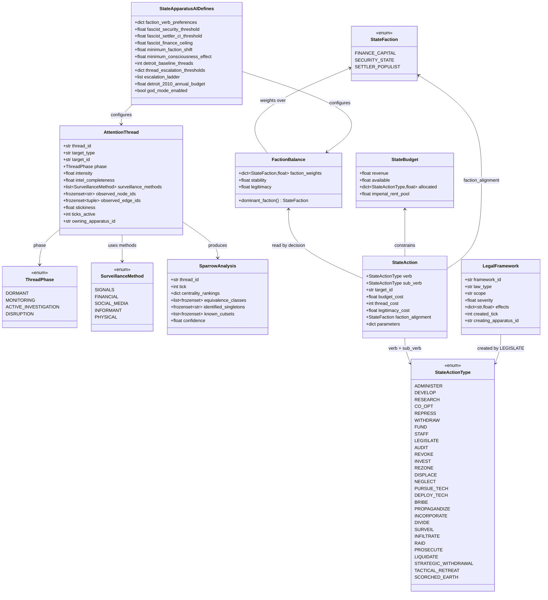
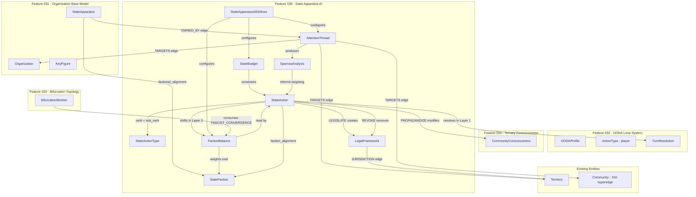

# Data Model: State Apparatus AI (Feature 039)

**Feature Branch**: `039-state-apparatus-ai`
**Date**: 2026-03-02
**Phase**: 1 (Design)
**Dependencies**: Feature 031 (Organization Base Model), Feature 032 (OODA Loop System), Feature 033 (Bifurcation Topology), Feature 034 (Ternary Consciousness), Feature 038 (Unified Class System)

---

## Entity Overview



---

## Entity Definitions

### 1. StateFaction (StrEnum)

**Purpose**: Identifies the three factional coalitions within the ruling class whose competing interests shape state behavior (FR-C01).

**Location**: `src/babylon/models/enums.py`

**Relationships**: Referenced by `FactionBalance.faction_weights`, `StateAction.faction_alignment`, `StateApparatus.factional_alignment`

| Value | String | Material Base | Strategic Preference |
|-------|--------|---------------|---------------------|
| `FINANCE_CAPITAL` | `"finance_capital"` | Extraction efficiency, profit rate | DEVELOP, CO_OPT (stability-oriented) |
| `SECURITY_STATE` | `"security_state"` | Repressive apparatus budget/size | REPRESS, ADMINISTER (threat-oriented) |
| `SETTLER_POPULIST` | `"settler_populist"` | Imperial rent distribution to settler nation | DEVELOP (displacement), CO_OPT (bribe base) |

```python
class StateFaction(StrEnum):
    """Ruling-class factions within the state coalition (Feature 039).

    Each faction has a distinct material base and strategic verb preferences.
    The factional balance at any moment determines the state's objective
    function and verb selection.

    Values:
        FINANCE_CAPITAL: Material base in extraction efficiency and profit rate.
            Prefers CO_OPT, DEVELOP. Tolerates organizing unless it threatens
            accumulation.
        SECURITY_STATE: Material base in repressive apparatus. Prefers REPRESS,
            ADMINISTER. Institutional incentive to maintain threat perception.
        SETTLER_POPULIST: Material base in imperial rent distribution to settler
            nation. Provides mass base for fascism when imperial rent contracts.

    Reference: FR-C01, Constitution I.4 (George Jackson Bifurcation).
    """

    FINANCE_CAPITAL = "finance_capital"
    SECURITY_STATE = "security_state"
    SETTLER_POPULIST = "settler_populist"
```

**Validation Rules**: None beyond enum membership.

---

### 2. StateActionType (StrEnum)

**Purpose**: Defines the full state verb taxonomy -- six top-level verbs and their sub-verbs (FR-B01 through FR-B07). SEPARATE from the player `ActionType` enum (Feature 032). The type system enforces asymmetry: the player cannot execute state verbs; the state cannot execute player verbs (FR-B08).

**Location**: `src/babylon/models/enums.py`

**Relationships**: Used by `StateAction.verb`, `StateAction.sub_verb`, and `StateBudget.allocated`

#### Verb Hierarchy

| Top-Level Verb | Sub-Verbs | Strategic Mode |
|---------------|-----------|---------------|
| `ADMINISTER` | FUND, STAFF, LEGISLATE, AUDIT, REVOKE | Internal capacity reproduction |
| `DEVELOP` | INVEST, REZONE, DISPLACE, NEGLECT | Reshape material base |
| `RESEARCH` | PURSUE_TECH, DEPLOY_TECH | Expand capability space |
| `CO_OPT` | BRIBE, PROPAGANDIZE, INCORPORATE, DIVIDE | Absorb/neutralize opposition |
| `REPRESS` | SURVEIL, INFILTRATE, RAID, PROSECUTE, LIQUIDATE | Direct state violence |
| `WITHDRAW` | STRATEGIC_WITHDRAWAL, TACTICAL_RETREAT, SCORCHED_EARTH | Concede/reposition/destroy |

```python
class StateActionType(StrEnum):
    """State verb taxonomy for apparatus AI decision-making (Feature 039).

    Six top-level verbs with ~24 sub-verbs. These are SEPARATE from
    the player ActionType enum (Feature 032). The type system enforces
    asymmetry: the state cannot EDUCATE or STRIKE; the player cannot
    LEGISLATE or DISPLACE.

    Reference: FR-B01 through FR-B11, Constitution V (Action Vocabulary).

    Values:
        ADMINISTER: Internal capacity management.
        DEVELOP: Reshape the material base.
        RESEARCH: Expand capability space.
        CO_OPT: Absorb, neutralize, divide.
        REPRESS: Direct state violence.
        WITHDRAW: Concede, reposition, destroy.
    """

    # Top-level verbs
    ADMINISTER = "administer"
    DEVELOP = "develop"
    RESEARCH = "research"
    CO_OPT = "co_opt"
    REPRESS = "repress"
    WITHDRAW = "withdraw"

    # ADMINISTER sub-verbs
    FUND = "fund"
    STAFF = "staff"
    LEGISLATE = "legislate"
    AUDIT = "audit"
    REVOKE = "revoke"

    # DEVELOP sub-verbs
    INVEST = "invest"
    REZONE = "rezone"
    DISPLACE = "displace"
    NEGLECT = "neglect"

    # RESEARCH sub-verbs
    PURSUE_TECH = "pursue_tech"
    DEPLOY_TECH = "deploy_tech"

    # CO_OPT sub-verbs
    BRIBE = "bribe"
    PROPAGANDIZE = "propagandize"
    INCORPORATE = "incorporate"
    DIVIDE = "divide"

    # REPRESS sub-verbs
    SURVEIL = "surveil"
    INFILTRATE = "infiltrate"
    RAID = "raid"
    PROSECUTE = "prosecute"
    LIQUIDATE = "liquidate"

    # WITHDRAW sub-verbs
    STRATEGIC_WITHDRAWAL = "strategic_withdrawal"
    TACTICAL_RETREAT = "tactical_retreat"
    SCORCHED_EARTH = "scorched_earth"
```

**Design Decision (R-005)**: Single flat enum with hierarchical validation in `StateAction` model rather than separate `StateVerb` + `StateSubVerb` enums. This keeps Pydantic serialization clean and allows `startswith()`-style grouping when needed. The parent-child constraint is enforced by the `StateAction` model validator, not the enum itself.

#### Valid Parent-Child Mapping

This mapping is the source of truth for hierarchy validation. Stored as a module-level constant in `src/babylon/models/entities/state_apparatus_ai.py`:

```python
VERB_CHILDREN: dict[StateActionType, frozenset[StateActionType]] = {
    StateActionType.ADMINISTER: frozenset({
        StateActionType.FUND, StateActionType.STAFF,
        StateActionType.LEGISLATE, StateActionType.AUDIT,
        StateActionType.REVOKE,
    }),
    StateActionType.DEVELOP: frozenset({
        StateActionType.INVEST, StateActionType.REZONE,
        StateActionType.DISPLACE, StateActionType.NEGLECT,
    }),
    StateActionType.RESEARCH: frozenset({
        StateActionType.PURSUE_TECH, StateActionType.DEPLOY_TECH,
    }),
    StateActionType.CO_OPT: frozenset({
        StateActionType.BRIBE, StateActionType.PROPAGANDIZE,
        StateActionType.INCORPORATE, StateActionType.DIVIDE,
    }),
    StateActionType.REPRESS: frozenset({
        StateActionType.SURVEIL, StateActionType.INFILTRATE,
        StateActionType.RAID, StateActionType.PROSECUTE,
        StateActionType.LIQUIDATE,
    }),
    StateActionType.WITHDRAW: frozenset({
        StateActionType.STRATEGIC_WITHDRAWAL,
        StateActionType.TACTICAL_RETREAT,
        StateActionType.SCORCHED_EARTH,
    }),
}
```

**Validation Rules**: None beyond enum membership at the enum level. Parent-child validation is in `StateAction`.

---

### 3. ThreadPhase (StrEnum)

**Purpose**: Discrete lifecycle phases of an attention thread (FR-A08). Phase determines which REPRESS sub-verbs the thread enables. Progression is a quantitative-to-qualitative transition (Constitution I.7).

**Location**: `src/babylon/models/enums.py`

| Value | `intel_completeness` Range | Enables |
|-------|---------------------------|---------|
| `DORMANT` | `[0.0, 0.1)` | Nothing (thread unallocated) |
| `MONITORING` | `[0.1, 0.4)` | SURVEIL |
| `ACTIVE_INVESTIGATION` | `[0.4, 0.7)` | SURVEIL, INFILTRATE, DIVIDE |
| `DISRUPTION` | `[0.7, 1.0]` | SURVEIL, INFILTRATE, DIVIDE, RAID, PROSECUTE, LIQUIDATE |

```python
class ThreadPhase(StrEnum):
    """Attention thread intelligence phase (Feature 039).

    Threads progress through discrete phases as intel_completeness
    grows. Phase transitions are quantitative-to-qualitative changes
    (Constitution I.7) driven by intel_completeness thresholds
    configured in StateApparatusAIDefines.

    Values:
        DORMANT: Thread exists but not actively resourced.
        MONITORING: Passive intelligence gathering. Low resource cost.
        ACTIVE_INVESTIGATION: Dedicated analysis. Sparrow analysis available.
        DISRUPTION: Active operations against target. Highest resource cost.

    Reference: FR-A08, R-002.
    """

    DORMANT = "dormant"
    MONITORING = "monitoring"
    ACTIVE_INVESTIGATION = "active_investigation"
    DISRUPTION = "disruption"
```

**Transition Thresholds** (configurable in `StateApparatusAIDefines.thread_escalation_thresholds`):

```python
thread_escalation_thresholds = {
    "dormant_to_monitoring": 0.1,
    "monitoring_to_active": 0.4,
    "active_to_disruption": 0.7,
}
```

**State Transitions**:

```
DORMANT ──[thread allocated, intel >= 0.1]──> MONITORING
MONITORING ──[intel >= 0.4]──> ACTIVE_INVESTIGATION
ACTIVE_INVESTIGATION ──[intel >= 0.7 AND threat warrants]──> DISRUPTION
Any ──[thread deallocated by meta-OODA]──> DORMANT
```

Phase does NOT regress during active tracking. Once a thread reaches ACTIVE_INVESTIGATION, it stays there even if `intel_completeness` is degraded by player COUNTER_INTEL below the threshold. Only full thread deallocation resets phase to DORMANT.

---

### 4. SurveillanceMethod (StrEnum)

**Purpose**: Intelligence collection methods available to state apparatus (FR-A06). Each method reveals different aspects of target topology while missing others. The observation gap (`G_observed != G_actual`) is shaped by which methods are active.

**Location**: `src/babylon/models/enums.py`

| Value | Reveals | Misses |
|-------|---------|--------|
| `SIGNALS` | Communication edges (edge existence), org size estimates | Face-to-face meetings, cash flows, consciousness levels |
| `FINANCIAL` | Resource flow edges, fundraising sources | Ideology, solidarity strength, cell membership |
| `SOCIAL_MEDIA` | Public-facing nodes, declared affiliations | Clandestine structure, commitment levels, internal disputes |
| `INFORMANT` | Internal state (with distortion), leadership identity | Full topology (limited to cell), accurate edge weights |
| `PHYSICAL` | Face-to-face meeting edges, location data | Digital communication, financial flows, ideology |

```python
class SurveillanceMethod(StrEnum):
    """Intelligence collection methods for attention threads (Feature 039).

    Each method reveals specific graph structures while missing others.
    No single method reveals the full picture (Sparrow's intelligence
    mosaic). Players can exploit method-specific blind spots (e.g.,
    cash economy defeats FINANCIAL surveillance, face-to-face meetings
    defeat SIGNALS).

    Reference: FR-A06, R-007.

    Values:
        SIGNALS: Communication metadata (phone, email, encrypted messaging).
        FINANCIAL: Bank records, transaction monitoring, asset tracing.
        SOCIAL_MEDIA: Public-facing digital footprint analysis.
        INFORMANT: Human intelligence via recruited insiders.
        PHYSICAL: Direct observation, tailing, stakeouts.
    """

    SIGNALS = "signals"
    FINANCIAL = "financial"
    SOCIAL_MEDIA = "social_media"
    INFORMANT = "informant"
    PHYSICAL = "physical"
```

**Validation Rules**: None beyond enum membership.

---

### 5. FactionBalance (Frozen Pydantic Model)

**Purpose**: Represents the current power distribution among the three state factions. The weight vector determines the state's composite objective function for verb selection (FR-C02).

**Location**: `src/babylon/models/entities/state_apparatus_ai.py`

**Graph Storage**: `context.persistent_data["faction_balance"]` (global state singleton)

**Relationships**: Read by state AI decision function (factional objective weighting), updated in Layer 3 (consequence of tick events), consumed by fascist convergence detection (R-008), consumed by `BifurcationMonitor` (Feature 033) via `FASCIST_CONVERGENCE` event.

| Field | Type | Constraints | Default | Description |
|-------|------|-------------|---------|-------------|
| `faction_weights` | `dict[StateFaction, float]` | Sum to 1.0 (tolerance +/-0.01), all values in [0,1], exactly 3 entries | required | Weight per faction |
| `stability` | `Probability` | `[0.0, 1.0]` | required | How stable the current balance is |
| `legitimacy` | `Probability` | `[0.0, 1.0]` | required | Overall state legitimacy |

**Computed Fields**:

| Field | Type | Derivation |
|-------|------|-----------|
| `dominant_faction` | `StateFaction` | `max(faction_weights, key=faction_weights.get)` |

```python
class FactionBalance(BaseModel):
    """Power distribution among ruling-class factions (Feature 039).

    The weight vector determines the state's objective function for
    verb selection. Shifts based on player actions (FR-C04) and
    material conditions (FR-C05). Fascist convergence is detected
    when specific threshold conditions hold (FR-C06).

    Primitive state: faction_weights, stability, legitimacy (stored).
    Derived state: dominant_faction (computed). Constitution II.2.

    Reference: FR-C02, R-003.
    """

    model_config = ConfigDict(frozen=True)

    faction_weights: dict[StateFaction, float] = Field(
        description="Weight per faction, must sum to 1.0",
    )
    stability: Probability = Field(
        description="How stable the current balance is [0=turbulent, 1=settled]",
    )
    legitimacy: Probability = Field(
        description="Overall state legitimacy [0=delegitimized, 1=fully legitimate]",
    )

    @computed_field
    @property
    def dominant_faction(self) -> StateFaction:
        """Faction with highest weight."""
        return max(self.faction_weights, key=self.faction_weights.get)

    @model_validator(mode="after")
    def _validate_weights(self) -> Self:
        """Validate faction weights: exactly 3, all non-negative, sum to 1.0."""
        if len(self.faction_weights) != 3:
            msg = f"Expected 3 factions, got {len(self.faction_weights)}"
            raise ValueError(msg)
        for faction in StateFaction:
            if faction not in self.faction_weights:
                msg = f"Missing faction: {faction}"
                raise ValueError(msg)
        for faction, weight in self.faction_weights.items():
            if weight < 0.0 or weight > 1.0:
                msg = f"Weight for {faction} must be in [0, 1], got {weight}"
                raise ValueError(msg)
        total = sum(self.faction_weights.values())
        if not (0.99 <= total <= 1.01):
            msg = f"Faction weights must sum to 1.0, got {total}"
            raise ValueError(msg)
        return self
```

**Detroit 2010 Initialization** (SYNTHETIC, Assumption A-006):

```python
FactionBalance(
    faction_weights={
        StateFaction.FINANCE_CAPITAL: 0.45,   # Post-crisis, asserting control over recovery
        StateFaction.SECURITY_STATE: 0.30,    # Heightened post-9/11, budget-constrained
        StateFaction.SETTLER_POPULIST: 0.25,  # Tea Party rising, not yet dominant
    },
    stability=0.6,
    legitimacy=0.5,
)
```

**Mutation**: Immutable. New instances via `model_copy(update={...})`. Per-tick shift deltas are clamped to `max_faction_shift_per_tick` (default 0.05, R-003) and re-normalized after application.

**Shift Mechanics** (computed in Layer 3):

```
1. Collect shift triggers from tick events (player actions + material conditions)
2. Compute raw delta per faction
3. Clamp each delta to [-max_faction_shift_per_tick, +max_faction_shift_per_tick]
4. Apply deltas to current weights
5. Re-normalize to sum to 1.0
6. Update stability from std of recent shift history
```

**Player Actions That Shift Balance** (FR-C04):

| Player Action | Faction Effect |
|---------------|---------------|
| Generate Heat (visible organizing) | +Security-State weight |
| Disrupt extraction (strike, sabotage) | +Security-State initially, +Finance-Capital panic if sustained |
| Build legitimacy (mutual aid, services) | +Finance-Capital CO-OPT pressure |
| Win narrative victories | +Settler-Populist reaction |
| Survive repression | -Security-State credibility |
| Accept CO-OPT offers | +Finance-Capital ("system works") |
| Reject CO-OPT offers | +Security-State ("force is necessary") |

**Material Conditions That Shift Balance** (FR-C05):

| Condition | Faction Effect |
|-----------|---------------|
| Profit rate decline | +Finance-Capital influence |
| Imperial rent contraction | +Settler-Populist panic |
| Legitimacy crisis | +Security-State (force as substitute) |
| Successful CO-OPT | +Finance-Capital |
| Failed repression | -Security-State, +Finance-Capital |

---

### 6. StateBudget (Frozen Pydantic Model)

**Purpose**: Tracks state fiscal capacity per tick. The binding constraint on state omnipotence for non-REPRESS verbs (FR-D05, R-004). Attention threads are the binding constraint for REPRESS verbs (Assumption A-004).

**Location**: `src/babylon/models/entities/state_apparatus_ai.py`

**Graph Storage**: `context.persistent_data["state_budget"]` (global state, refreshed per tick)

**Relationships**: Consumed by state AI decision architecture, allocation indexed by top-level verb category.

| Field | Type | Constraints | Default | Description |
|-------|------|-------------|---------|-------------|
| `revenue` | `float` | `>= 0.0` | required | Total income this tick |
| `available` | `float` | `>= 0.0`, `<= revenue` | required | Unallocated funds remaining |
| `allocated` | `dict[StateActionType, float]` | Keys must be top-level verbs only, all values `>= 0.0`, sum `<= revenue` | required | Budget per top-level verb category |
| `imperial_rent_pool` | `float` | `>= 0.0` | required | Discretionary capacity from imperial rent |

```python
class StateBudget(BaseModel):
    """State budget constraint for verb execution (Feature 039).

    Revenue derives from three sources: tax revenue (proportional to
    economic activity, QCEW-derived), federal transfers, and imperial
    rent pool. Allocation across verb categories is computed each tick
    as the dot product of faction weights and faction verb preferences.

    Budget is finite -- the fundamental constraint making state behavior
    strategic rather than omnipotent.

    Reference: FR-D05, R-004.
    """

    model_config = ConfigDict(frozen=True)

    revenue: float = Field(
        ge=0.0,
        description="Total income this tick",
    )
    available: float = Field(
        ge=0.0,
        description="Unallocated funds remaining this tick",
    )
    allocated: dict[StateActionType, float] = Field(
        description="Budget allocated per top-level verb category",
    )
    imperial_rent_pool: float = Field(
        ge=0.0,
        description="Discretionary capacity from imperial rent",
    )

    @model_validator(mode="after")
    def _validate_budget(self) -> Self:
        """Validate budget constraints."""
        if self.available > self.revenue + 0.01:
            msg = f"available ({self.available}) cannot exceed revenue ({self.revenue})"
            raise ValueError(msg)
        top_level = {
            StateActionType.ADMINISTER, StateActionType.DEVELOP,
            StateActionType.RESEARCH, StateActionType.CO_OPT,
            StateActionType.REPRESS, StateActionType.WITHDRAW,
        }
        for key, val in self.allocated.items():
            if key not in top_level:
                msg = f"Allocation key must be a top-level verb, got {key}"
                raise ValueError(msg)
            if val < 0.0:
                msg = f"Allocation for {key} must be >= 0, got {val}"
                raise ValueError(msg)
        if sum(self.allocated.values()) > self.revenue + 0.01:
            msg = "Sum of allocations cannot exceed revenue"
            raise ValueError(msg)
        return self
```

**Revenue Sources** (R-004):

| Source | Derives From | Factional Basis |
|--------|-------------|----------------|
| Tax revenue | Economic activity in jurisdiction (QCEW-derived territory data) | Finance-Capital controls tax base |
| Federal transfers | Configurable parameter for sub-federal apparatus | Security-State draws federal funding |
| Imperial rent pool | Imperial rent calculation (existing economic subsystem) | Settler-Populist claims rent distribution |

**Allocation Computation**: Each tick, `allocation = dot_product(FactionBalance.faction_weights, StateApparatusAIDefines.faction_verb_preferences)`. This produces a 6-element allocation vector over top-level verbs scaled by total revenue.

**State Transitions**:
- Each `StateAction` execution deducts `budget_cost` from `available`
- If `available < action.budget_cost`, the action is infeasible
- Budget exhaustion forces shift to zero-cost or low-cost actions (NEGLECT, minimal PROPAGANDIZE)
- New tick recomputes `revenue` from economic state and produces fresh `StateBudget`

---

### 7. AttentionThread (Frozen Pydantic Model)

**Purpose**: A single intelligence resource tracking a specific target. Accumulates partial knowledge over time, always operating on G_observed (never G_actual). Core mechanic of the state intelligence system (FR-A01).

**Location**: `src/babylon/models/entities/attention_thread.py`

**Graph Storage**: `_node_type="attention_thread"` with `TARGETS` edge to target, `OWNED_BY` edge to owning apparatus.

**Relationships**: Owned by `StateApparatus` (via OWNED_BY edge), targets `Organization | Territory | Community` (via TARGETS edge), produces `SparrowAnalysis`.

| Field | Type | Constraints | Default | Description |
|-------|------|-------------|---------|-------------|
| `thread_id` | `str` | `min_length=1`, unique | required | Unique thread identifier |
| `target_type` | `str` | one of `"organization"`, `"territory"`, `"community"` | required | Type of target entity |
| `target_id` | `str` | `min_length=1` | required | ID of target entity |
| `phase` | `ThreadPhase` | enum | required | Current intelligence phase |
| `intensity` | `Probability` | `[0.0, 1.0]` | required | Resource allocation intensity |
| `intel_completeness` | `Probability` | `[0.0, 1.0]` | required | Accumulated intelligence level |
| `surveillance_methods` | `list[SurveillanceMethod]` | non-empty when phase != DORMANT | `[]` | Active collection methods |
| `observed_node_ids` | `frozenset[str]` | immutable set | `frozenset()` | Nodes in G_observed |
| `observed_edge_ids` | `frozenset[tuple[str, str]]` | immutable set | `frozenset()` | Edges in G_observed |
| `stickiness` | `Probability` | `[0.0, 1.0]` | required | Resistance to reallocation |
| `ticks_active` | `int` | `>= 0` | required | Ticks since thread allocation |
| `owning_apparatus_id` | `str` | `min_length=1` | required | StateApparatus that owns this thread |

```python
class AttentionThread(BaseModel):
    """State intelligence resource tracking a specific target (Feature 039).

    Each thread maintains a growing G_observed subgraph (always incomplete,
    always distorted) of the target. Thread pool size derives from the sum
    of surveillance_capacity across all StateApparatus nodes. Sparrow
    analysis operates on G_observed per thread.

    Attributes:
        thread_id: Unique identifier for this attention thread.
        target_type: Type of target entity.
        target_id: ID of target entity.
        phase: Current intelligence phase.
        intensity: Resource allocation intensity [0,1].
        intel_completeness: Accumulated intelligence [0,1], monotonically
            increasing absent counter-intel.
        surveillance_methods: Active collection methods.
        observed_node_ids: Node IDs discovered in G_observed.
        observed_edge_ids: Edge ID pairs discovered in G_observed.
        stickiness: Resistance to reallocation by meta-OODA [0,1].
        ticks_active: Ticks since thread allocation.
        owning_apparatus_id: StateApparatus that owns this thread.

    Reference: FR-A01 through FR-A08, R-002, R-007.
    """

    model_config = ConfigDict(frozen=True)

    thread_id: str = Field(min_length=1, description="Unique thread identifier")
    target_type: str = Field(description="Target entity type")
    target_id: str = Field(min_length=1, description="ID of target entity")
    phase: ThreadPhase = Field(description="Current intelligence phase")
    intensity: Probability = Field(description="Resource allocation intensity [0,1]")
    intel_completeness: Probability = Field(
        description="Accumulated intelligence level [0,1], monotonically increasing",
    )
    surveillance_methods: list[SurveillanceMethod] = Field(
        default_factory=list,
        description="Active collection methods",
    )
    observed_node_ids: frozenset[str] = Field(
        default_factory=frozenset,
        description="Node IDs in G_observed",
    )
    observed_edge_ids: frozenset[tuple[str, str]] = Field(
        default_factory=frozenset,
        description="Edge ID pairs in G_observed",
    )
    stickiness: Probability = Field(
        description="Resistance to reallocation [0=easily moved, 1=locked]",
    )
    ticks_active: int = Field(ge=0, description="Ticks since thread allocation")
    owning_apparatus_id: str = Field(
        min_length=1,
        description="StateApparatus that owns this thread",
    )

    @model_validator(mode="after")
    def _validate_target_type(self) -> Self:
        """Validate target_type is a recognized entity type."""
        valid_types = {"organization", "territory", "community"}
        if self.target_type not in valid_types:
            msg = f"target_type must be one of {valid_types}, got {self.target_type}"
            raise ValueError(msg)
        return self
```

**Graph Representation**:

```
(attention_thread:thread_id) --[TARGETS]--> (target_type:target_id)
(attention_thread:thread_id) --[OWNED_BY]--> (state_apparatus:owning_apparatus_id)
```

Node attributes stored via `graph.update_node(thread_id, model.model_dump())` with `_node_type="attention_thread"`.

**Observation Ceiling**: Per-apparatus caps on `intel_completeness` from existing `IntelMethodology.observation_ceiling` (Feature 031):

| Apparatus Preset | Observation Ceiling | Source |
|-----------------|-------------------|--------|
| FBI | 0.4 | `IntelMethodology.fbi()` |
| Local PD | 0.2 | `IntelMethodology.local_pd()` |
| Fusion Center | 0.5 | `IntelMethodology.fusion_center()` |

Cell topology further reduces effective ceiling by `(1 - compartmentalization_factor)` (R-007). A well-compartmented cell organization with 3 cells reduces FBI ceiling from 0.4 to approximately 0.28.

**Invariants**:
- `intel_completeness` is monotonically increasing absent player COUNTER_INTEL actions (system-level invariant, not model validator)
- `observed_node_ids` and `observed_edge_ids` grow over time (set union with previous tick's observations)
- When `phase == DORMANT`, `surveillance_methods` should be empty

**State Transitions**: See ThreadPhase section above.

---

### 8. SparrowAnalysis (Frozen Pydantic Model)

**Purpose**: Results of Sparrow's network vulnerability analysis (1991, 1993) applied to G_observed. Always partial, always potentially wrong because it operates on the state's incomplete view (FR-A03). This is a COMPUTED artifact -- not stored in the graph (Constitution II.2: derived state).

**Location**: `src/babylon/models/entities/attention_thread.py`

**Graph Storage**: NOT stored in graph. Computed per-thread per-tick, consumed by state AI targeting decisions.

| Field | Type | Constraints | Default | Description |
|-------|------|-------------|---------|-------------|
| `thread_id` | `str` | `min_length=1` | required | Thread that produced this analysis |
| `tick` | `int` | `>= 0` | required | Tick when analysis was computed |
| `centrality_rankings` | `dict[str, dict[str, float]]` | node_id -> {metric: score} | required | Per-node centrality scores |
| `equivalence_classes` | `list[frozenset[str]]` | partition of observed nodes | required | Structurally equivalent node groups |
| `identified_singletons` | `frozenset[str]` | subset of observed nodes | required | Nodes in singleton equivalence classes |
| `known_cutsets` | `list[frozenset[str]]` | each is a minimal cutset | required | Minimal node cutsets in G_observed |
| `confidence` | `Probability` | `[0.0, 1.0]` | required | Confidence based on intel_completeness |

```python
class SparrowAnalysis(BaseModel):
    """Network vulnerability analysis results on G_observed (Feature 039).

    Implements Sparrow's framework: centrality computation, equivalence
    class identification, singleton detection, and minimal cutset analysis.
    All results are contingent on G_observed quality -- they may be wrong
    because the state's view is always incomplete.

    This is a COMPUTED artifact -- derived from G_observed, not stored in
    the graph. Constitution II.2: derived state, not primitive.

    Attributes:
        thread_id: Source thread ID.
        tick: Tick of computation.
        centrality_rankings: Per-node centrality scores.
            Keys: node_id. Values: dict of metric name to score.
        equivalence_classes: Groups of structurally equivalent nodes.
        identified_singletons: Nodes in singleton equivalence classes.
        known_cutsets: Minimal node cutsets in G_observed.
        confidence: Analysis confidence based on intel_completeness [0,1].

    Reference: FR-A03, R-002.
    """

    model_config = ConfigDict(frozen=True)

    thread_id: str = Field(min_length=1, description="Source thread ID")
    tick: int = Field(ge=0, description="Tick of computation")
    centrality_rankings: dict[str, dict[str, float]] = Field(
        description="node_id -> {metric_name: score}",
    )
    equivalence_classes: list[frozenset[str]] = Field(
        description="Groups of structurally equivalent nodes",
    )
    identified_singletons: frozenset[str] = Field(
        description="Nodes in singleton equivalence classes",
    )
    known_cutsets: list[frozenset[str]] = Field(
        description="Minimal node cutsets in G_observed",
    )
    confidence: Probability = Field(
        description="Analysis confidence based on intel_completeness [0,1]",
    )
```

**Centrality Metrics Computed** (via NetworkX on G_observed):

| Metric Key | NetworkX Function | Identifies |
|-----------|------------------|-----------|
| `"degree"` | `nx.degree_centrality()` | Hub nodes (most connections) |
| `"betweenness"` | `nx.betweenness_centrality()` | Bridge nodes (critical paths) |
| `"closeness"` | `nx.closeness_centrality()` | Well-connected nodes (efficient communication) |
| `"eigenvector"` | `nx.eigenvector_centrality()` | Nodes connected to other important nodes |

**Equivalence Class Computation**: Nodes with identical numerical signatures (rounded centrality vectors) form equivalence classes. For a star topology, the hub has a unique signature (singleton equivalence class); periphery nodes share a signature.

**Validation Rules**:
- `confidence` validated by `Probability` constrained type
- `identified_singletons` must be a subset of nodes appearing in `equivalence_classes`
- Every node in `centrality_rankings` must appear in exactly one equivalence class
- Replaced wholesale when recomputed on updated G_observed (never mutated)

---

### 9. StateAction (Frozen Pydantic Model)

**Purpose**: A single state verb execution instance. Parallel to the player `Action` model (Feature 032) but with state-specific resource profile: budget cost + thread cost + legitimacy cost rather than action points + cadre/sympathizer labor (FR-F02).

**Location**: `src/babylon/models/entities/state_apparatus_ai.py`

**Graph Storage**: Not stored in graph. Produced by state AI decision function, consumed by Layer 1 action resolution, generates events.

**Relationships**: Produced by `NPCDecisionStrategy`, consumed by Layer 1 action resolution, shifts `FactionBalance` in Layer 3.

| Field | Type | Constraints | Default | Description |
|-------|------|-------------|---------|-------------|
| `verb` | `StateActionType` | Must be a top-level verb | required | Top-level verb category |
| `sub_verb` | `StateActionType` | Must be valid child of `verb` | required | Specific sub-verb |
| `target_id` | `str \| None` | None for self-targeting verbs (AUDIT, FUND) | `None` | Target entity ID |
| `budget_cost` | `float` | `>= 0.0` | required | Budget consumed |
| `thread_cost` | `int` | `>= 0` | required | Attention threads required (for REPRESS verbs) |
| `legitimacy_cost` | `float` | unconstrained (can be negative for legitimacy-restoring actions) | required | Legitimacy impact |
| `faction_alignment` | `StateFaction` | enum | required | Which faction benefits |
| `parameters` | `dict[str, Any]` | varies by sub-verb | `{}` | Sub-verb-specific parameters |

```python
class StateAction(BaseModel):
    """State verb execution instance (Feature 039).

    Parallel to the player Action model (Feature 032) but with different
    resource profiles. Budget constrains non-REPRESS verbs; attention
    threads constrain REPRESS verbs (Assumption A-004).

    Attributes:
        verb: Top-level verb category.
        sub_verb: Specific sub-verb within the verb category.
        target_id: Target entity ID (None for self-targeting).
        budget_cost: Budget consumed by this action.
        thread_cost: Attention threads required (for REPRESS verbs).
        legitimacy_cost: Legitimacy impact (negative = delegitimizing).
        faction_alignment: Which faction benefits from this action.
        parameters: Sub-verb-specific parameters.

    Reference: FR-B01 through FR-B11, FR-D05, R-005.
    """

    model_config = ConfigDict(frozen=True)

    verb: StateActionType = Field(description="Top-level verb category")
    sub_verb: StateActionType = Field(description="Specific sub-verb")
    target_id: str | None = Field(
        default=None,
        description="Target entity ID (None for self-targeting)",
    )
    budget_cost: float = Field(ge=0.0, description="Budget consumed")
    thread_cost: int = Field(ge=0, description="Attention threads required")
    legitimacy_cost: float = Field(
        description="Legitimacy impact (negative = delegitimizing)",
    )
    faction_alignment: StateFaction = Field(
        description="Which faction benefits from this action",
    )
    parameters: dict[str, Any] = Field(
        default_factory=dict,
        description="Sub-verb-specific parameters",
    )

    @model_validator(mode="after")
    def _validate_verb_hierarchy(self) -> Self:
        """Validate sub_verb is a valid child of verb."""
        top_level = {
            StateActionType.ADMINISTER, StateActionType.DEVELOP,
            StateActionType.RESEARCH, StateActionType.CO_OPT,
            StateActionType.REPRESS, StateActionType.WITHDRAW,
        }
        if self.verb not in top_level:
            msg = f"verb must be a top-level verb, got {self.verb}"
            raise ValueError(msg)
        children = VERB_CHILDREN.get(self.verb, frozenset())
        if self.sub_verb not in children:
            msg = f"{self.sub_verb} is not a valid sub-verb of {self.verb}"
            raise ValueError(msg)
        return self
```

**Sub-Verb Parameter Schemas** (`parameters` dict content by sub-verb):

| Sub-Verb | Parameters | Description |
|----------|-----------|-------------|
| FUND | `{"apparatus_id": str, "capacity_type": str}` | Target apparatus, what to increase (violence/surveillance/service) |
| STAFF | `{"apparatus_id": str, "count": int}` | Target apparatus, personnel count |
| LEGISLATE | `{"law_type": str, "scope": str, "severity": float}` | See LegalFramework.law_type |
| AUDIT | `{"apparatus_id": str, "depth": str}` | Target apparatus, depth (ROUTINE/THOROUGH/DEEP) |
| REVOKE | `{"framework_id": str}` | ID of LegalFramework to revoke |
| INVEST | `{"territory_id": str, "sector": str}` | Target territory, economic sector |
| REZONE | `{"territory_id": str, "new_use": str}` | Target territory, new land use |
| DISPLACE | `{"territory_id": str, "mechanism": str}` | Mechanism: EMINENT_DOMAIN, CODE_ENFORCEMENT, RENT_INCREASE, DEMOLITION, TAX_FORECLOSURE |
| NEGLECT | `{"territory_id": str}` | Target territory for deliberate disinvestment |
| PURSUE_TECH | `{"tech_id": str, "classification": str}` | Technology ID, classification (PUBLIC/CLASSIFIED/BLACK) |
| DEPLOY_TECH | `{"tech_id": str, "target_id": str}` | Technology ID, deployment target |
| BRIBE | `{"target_id": str, "bribe_type": str, "amount": float}` | Type: GRANT, TAX_BREAK, CONTRACT, WAGE_CONCESSION, PATRONAGE |
| PROPAGANDIZE | `{"narrative": str, "intensity": float}` | Narrative: WE_ARE_ALL_AMERICANS, THREAT_NARRATIVE, REFORM_IS_WORKING, DELEGITIMIZE_OPPOSITION |
| INCORPORATE | `{"target_key_figure_id": str, "offer_type": str}` | Offer: ELECTORAL_CANDIDACY, NONPROFIT_STATUS, ADVISORY_POSITION, ACADEMIC_APPOINTMENT, MEDIA_PLATFORM |
| DIVIDE | `{"target_edge": [str, str], "method": str}` | Method: RUMOR, SELECTIVE_LEAK, PROVOCATEUR, FUND_RIVAL, IDENTITY_WEDGE |
| SURVEIL | `{"thread_id": str}` | Thread to activate/intensify |
| INFILTRATE | `{"agent_type": str, "target_org_id": str}` | Agent: INFORMANT, PROVOCATEUR, MOLE |
| RAID | `{"scale": str, "force_level": str}` | Scale: TARGETED, SWEEP, MASS. Force: POLICE, SWAT, MILITARY |
| PROSECUTE | `{"charge_type": str, "target_org_id": str}` | Charge: CONSPIRACY, RACKETEERING, TAX, CIVIL_RIGHTS_VIOLATION, TERRORISM |
| LIQUIDATE | `{"method": str, "target_key_figure_id": str}` | Method: ASSASSINATION, DISAPPEARANCE, RENDITION, PRISON_KILLING |
| STRATEGIC_WITHDRAWAL | `{"territory_id": str, "asset_extraction": bool}` | Whether to extract assets before withdrawing |
| TACTICAL_RETREAT | `{"territory_id": str, "duration_ticks": int}` | Duration of temporary retreat |
| SCORCHED_EARTH | `{"territory_id": str, "population_action": str}` | Population: IGNORE, EVACUATE, BLOCKADE |

---

### 10. LegalFramework (Frozen Pydantic Model)

**Purpose**: Active legislation affecting game rules within a jurisdiction. Created by LEGISLATE, removed by REVOKE. No automatic expiry -- legislation persists until explicitly revoked (FR-B09, R-011). This creates a ratchet effect: accumulated legislation makes the state progressively more powerful unless the player forces revocation.

**Location**: `src/babylon/models/entities/state_apparatus_ai.py`

**Graph Storage**: `_node_type="legal_framework"` with `JURISDICTION` edges to affected territories.

**Relationships**: Created by `StateAction(verb=ADMINISTER, sub_verb=LEGISLATE)`, removed by `StateAction(verb=ADMINISTER, sub_verb=REVOKE)`, consumed by various systems to modify their behavior.

| Field | Type | Constraints | Default | Description |
|-------|------|-------------|---------|-------------|
| `framework_id` | `str` | `min_length=1`, unique | required | Unique framework identifier |
| `law_type` | `str` | one of 6 valid types | required | Legislation category |
| `scope` | `str` | `JurisdictionLevel` value | required | Jurisdiction scope |
| `severity` | `Probability` | `[0.0, 1.0]` | required | How extreme the legislation is |
| `effects` | `dict[str, float]` | varies by `law_type` | required | Rule modifications applied |
| `created_tick` | `int` | `>= 0` | required | Tick when enacted |
| `creating_apparatus_id` | `str` | `min_length=1` | required | Apparatus that enacted this |

```python
class LegalFramework(BaseModel):
    """Active legislation modifying game rules in a jurisdiction (Feature 039).

    Created by LEGISLATE sub-action, removed by REVOKE sub-action.
    No automatic expiry -- legislation persists until explicitly revoked.
    Revocation carries its own legitimacy cost/gain depending on context.

    Attributes:
        framework_id: Unique framework identifier.
        law_type: Legislation category.
        scope: JurisdictionLevel value for jurisdiction scope.
        severity: How extreme the legislation is [0=mild, 1=draconian].
        effects: Rule modifications applied (keys and values vary by law_type).
        created_tick: Tick when enacted.
        creating_apparatus_id: Apparatus that enacted this framework.

    Reference: FR-B09, FR-B10, R-011.
    """

    model_config = ConfigDict(frozen=True)

    framework_id: str = Field(min_length=1, description="Unique framework identifier")
    law_type: str = Field(description="Legislation category")
    scope: str = Field(description="JurisdictionLevel value for scope")
    severity: Probability = Field(
        description="How extreme the legislation is [0=mild, 1=draconian]",
    )
    effects: dict[str, float] = Field(description="Rule modifications applied")
    created_tick: int = Field(ge=0, description="Tick when enacted")
    creating_apparatus_id: str = Field(
        min_length=1,
        description="Apparatus that enacted this framework",
    )

    @model_validator(mode="after")
    def _validate_law_type(self) -> Self:
        """Validate law_type is a recognized legislation category."""
        valid_types = {
            "SURVEILLANCE_AUTH", "ANTI_PROTEST", "EMERGENCY_POWERS",
            "ZONING", "TAX_INCENTIVE", "LABOR_REGULATION",
        }
        if self.law_type not in valid_types:
            msg = f"law_type must be one of {valid_types}, got {self.law_type}"
            raise ValueError(msg)
        return self
```

**Law Types and Effects**:

| `law_type` | Effect Keys | Description |
|-----------|-------------|-------------|
| `SURVEILLANCE_AUTH` | `observation_ceiling_bonus: float` | Increases observation ceiling for apparatus in jurisdiction |
| `ANTI_PROTEST` | `heat_multiplier: float` | Multiplier on Heat generated by PROTEST actions |
| `EMERGENCY_POWERS` | `thread_capacity_multiplier: float`, `liquidate_enabled: float` | Doubles thread pool (2.0), enables LIQUIDATE in core territories (1.0) |
| `ZONING` | `development_enabled: float`, `allowed_sectors: float` | Enables INVEST/REZONE in target territory |
| `TAX_INCENTIVE` | `tax_reduction_factor: float` | Reduces tax revenue to attract investment |
| `LABOR_REGULATION` | `exploitation_rate_modifier: float` | Modifies exploitation rate in jurisdiction |

**Graph Representation**:

```
(legal_framework:framework_id) --[JURISDICTION]--> (territory:territory_id)   [one or more edges]
```

**Lifecycle**:

```
[LEGISLATE action] --> Created/Active --> [REVOKE action] --> Removed from graph
```

No intermediate states. No automatic expiry. EMERGENCY_POWERS effects (doubled thread capacity, LIQUIDATE enabled) are active for the entire duration between LEGISLATE and REVOKE. Revoking EMERGENCY_POWERS reverts thread capacity to base and removes LIQUIDATE availability.

---

### 11. TerritoryPresence (Edge Attributes)

**Purpose**: Represents an organization's operational footprint in a specific territory (FR-E01). NOT a standalone model -- stored as attributes on existing `PRESENCE` edges (`EdgeType.PRESENCE`) between organization and territory.

**Location**: Edge attributes on `PRESENCE` edges. Schema defined in `src/babylon/models/entities/state_apparatus_ai.py` for documentation; stored as flat dict on graph edges.

**Relationships**: Uses existing `EdgeType.PRESENCE` (Feature 031), existing `OperationalProfile` enum.

| Attribute | Type | Constraints | Description |
|-----------|------|-------------|-------------|
| `edge_type` | `str` | `"presence"` | Edge type identifier |
| `operational_profile` | `str` | `"high_profile"` or `"low_profile"` | Visibility stance (OperationalProfile value) |
| `infrastructure_controlled` | `list[str]` | IDs of infrastructure entities | Community infrastructure bound to this territory |
| `established_tick` | `int` | `>= 0` | When presence was established |

```python
# Not a standalone model -- these are edge attributes on PRESENCE edges.
# Shown here for documentation clarity.
#
# Example edge data:
# {
#     "edge_type": "presence",
#     "operational_profile": "high_profile",
#     "infrastructure_controlled": ["clinic_001", "hall_003"],
#     "established_tick": 5,
# }
```

**Heat Generation** (per-tick, Layer 0):

| `operational_profile` | Heat Delta Per Tick | Description |
|----------------------|-------------------|-------------|
| `HIGH_PROFILE` | `+heat_high_profile_increment` (GameDefines) | Visible presence attracts state attention |
| `LOW_PROFILE` | `+heat_low_profile_increment` (GameDefines, near-zero) | Minimal footprint, minimal attention |

**Key Constraints**:
- Organizations MUST have a PRESENCE edge to a territory to RECRUIT from population in that territory (FR-E07)
- DISPLACE severs TENANCY edges but does NOT automatically sever PRESENCE edges (org may persist as residents are displaced)
- Displacement degrades `infrastructure_controlled` (community infrastructure in the territory)
- `operational_profile` can switch between HIGH_PROFILE and LOW_PROFILE via organizational decision
- `infrastructure_controlled` grows via BUILD_INFRASTRUCTURE, shrinks via ATTACK_INFRASTRUCTURE or DISPLACE

---

### 12. StateApparatusAIDefines (GameDefines Sub-Model)

**Purpose**: Centralizes all tunable coefficients for the state apparatus AI system. Follows the existing pattern of sub-model defines (e.g., `OODADefines`, `BifurcationDefines`, `ClassSystemDefines`). Satisfies Constitution III.1 (No Magic Constants).

**Location**: `src/babylon/config/defines.py` (new frozen Pydantic sub-model added as field on `GameDefines`)

**Relationships**: Read by state AI decision architecture, faction balance calculator, attention thread system, territory effect resolvers.

```python
class StateApparatusAIDefines(BaseModel):
    """State Apparatus AI tunable coefficients (Feature 039).

    Controls faction verb preferences, fascist convergence thresholds,
    minimum effect floors, observation parameters, thread allocation,
    escalation logic, budget parameters, and territory effects.

    All Detroit 2010 initialization values are flagged as SYNTHETIC.

    Reference: FR-C03, FR-C06, FR-D06, R-010.
    """

    model_config = ConfigDict(frozen=True)

    # ---- Faction verb preferences (3x6 matrix) ----
    faction_verb_preferences: dict[str, dict[str, float]] = Field(
        default={
            "finance_capital": {
                "administer": 0.15, "develop": 0.30, "research": 0.15,
                "co_opt": 0.25, "repress": 0.05, "withdraw": 0.10,
            },
            "security_state": {
                "administer": 0.25, "develop": 0.05, "research": 0.20,
                "co_opt": 0.10, "repress": 0.35, "withdraw": 0.05,
            },
            "settler_populist": {
                "administer": 0.10, "develop": 0.25, "research": 0.05,
                "co_opt": 0.20, "repress": 0.20, "withdraw": 0.20,
            },
        },
        description="3x6 faction verb preference matrix. Each faction's "
                    "preferences must sum to 1.0.",
    )

    # ---- Fascist convergence thresholds ----
    fascist_security_threshold: float = Field(
        default=0.4,
        ge=0.0, le=1.0,
        description="SYNTHETIC (A-006). SS weight for fascist convergence.",
    )
    fascist_settler_ci_threshold: float = Field(
        default=0.6,
        ge=0.0, le=1.0,
        description="SYNTHETIC (A-006). Settler CI for fascist convergence.",
    )
    fascist_finance_ceiling: float = Field(
        default=0.25,
        ge=0.0, le=1.0,
        description="SYNTHETIC (A-006). FC weight ceiling for fascist convergence.",
    )
    convergence_confirmation_ticks: int = Field(
        default=2,
        ge=1, le=10,
        description="SYNTHETIC (R-008). Consecutive ticks for fascist confirmation.",
    )
    reversion_ss_threshold: float = Field(
        default=0.25,
        ge=0.0, le=1.0,
        description="SYNTHETIC (R-008). SS weight for fascist reversion.",
    )
    reversion_ci_threshold: float = Field(
        default=0.3,
        ge=0.0, le=1.0,
        description="SYNTHETIC (R-008). Settler CI for fascist reversion.",
    )

    # ---- Effect floors ----
    minimum_faction_shift: float = Field(
        default=0.02,
        ge=0.0, le=0.1,
        description="SYNTHETIC (SC-010). Minimum effect floor for faction shift "
                    "per triggering event.",
    )
    minimum_consciousness_effect: float = Field(
        default=0.02,
        ge=0.0, le=0.1,
        description="SYNTHETIC (SC-009). Minimum effect floor for consciousness delta.",
    )
    max_faction_shift_per_tick: float = Field(
        default=0.05,
        ge=0.0, le=0.2,
        description="SYNTHETIC (R-003). Ceiling on per-tick faction weight delta.",
    )

    # ---- Thread parameters ----
    detroit_baseline_threads: int = Field(
        default=6,
        ge=1, le=20,
        description="SYNTHETIC. Baseline thread count for Detroit 2010.",
    )
    thread_escalation_thresholds: dict[str, float] = Field(
        default={
            "dormant_to_monitoring": 0.1,
            "monitoring_to_active": 0.4,
            "active_to_disruption": 0.7,
        },
        description="SYNTHETIC (R-002). intel_completeness thresholds for "
                    "thread phase transitions.",
    )
    compartmentalization_factor: float = Field(
        default=0.3,
        ge=0.0, le=1.0,
        description="SYNTHETIC (R-007). Observation ceiling reduction for "
                    "cell topology organizations.",
    )

    # ---- Escalation ladder (ordered list of verb preferences by cost) ----
    escalation_ladder: list[str] = Field(
        default=[
            "propagandize", "bribe", "incorporate", "surveil", "divide",
            "infiltrate", "invest", "rezone", "fund", "legislate",
            "raid", "prosecute", "displace", "strategic_withdrawal",
            "scorched_earth", "liquidate",
        ],
        description="SYNTHETIC. Preferred order of verb escalation (low to high "
                    "cost/visibility).",
    )

    # ---- Budget parameters ----
    detroit_2010_annual_budget: float = Field(
        default=0.0,
        ge=0.0,
        description="QCEW-derived. Annual budget for Detroit apparatus. "
                    "TBD: derive from QCEW employment data.",
    )
    tax_revenue_rate: float = Field(
        default=0.0,
        ge=0.0, le=1.0,
        description="SYNTHETIC. Tax revenue as fraction of economic activity.",
    )
    federal_transfer_base: float = Field(
        default=0.0,
        ge=0.0,
        description="SYNTHETIC. Federal transfer baseline for sub-federal apparatus.",
    )
    imperial_rent_share: float = Field(
        default=0.0,
        ge=0.0, le=1.0,
        description="SYNTHETIC. Fraction of imperial rent pool available to state.",
    )
    actions_per_tick: int = Field(
        default=1,
        ge=1, le=10,
        description="SYNTHETIC (R-001). State actions per tick. Default 1, "
                    "configurable for future multi-action expansion.",
    )

    # ---- Territory effect parameters ----
    invest_property_delta: float = Field(
        default=0.0,
        ge=0.0,
        description="SYNTHETIC (R-006). Property value increase per INVEST tick.",
    )
    neglect_decay_rate: float = Field(
        default=0.0,
        ge=0.0, le=1.0,
        description="SYNTHETIC (R-006). Infrastructure quality decay per NEGLECT tick.",
    )
    neglect_quality_floor: float = Field(
        default=0.0,
        ge=0.0, le=1.0,
        description="SYNTHETIC (R-006). Minimum infrastructure quality.",
    )
    displace_population_fraction: float = Field(
        default=0.0,
        ge=0.0, le=1.0,
        description="SYNTHETIC (R-006). Fraction of population displaced per DISPLACE.",
    )

    # ---- Debug ----
    god_mode_enabled: bool = Field(
        default=False,
        description="Exposes all state internals (faction weights, budget, "
                    "thread allocation, AI decision scoring) to the player. "
                    "For testing and development only (FR-D12).",
    )
```

**Faction Verb Preferences Matrix** (default, from spec FR-C03):

| Verb | Finance-Capital | Security-State | Settler-Populist |
|------|----------------|---------------|-----------------|
| ADMINISTER | 0.15 | 0.25 | 0.10 |
| DEVELOP | 0.30 | 0.05 | 0.25 |
| RESEARCH | 0.15 | 0.20 | 0.05 |
| CO_OPT | 0.25 | 0.10 | 0.20 |
| REPRESS | 0.05 | 0.35 | 0.20 |
| WITHDRAW | 0.10 | 0.05 | 0.20 |

**Validation**: Each faction's verb preferences must sum to 1.0. Thread escalation thresholds must be monotonically increasing. All float fields with known bounds validated via `Field(ge=..., le=...)`.

---

## New Enum Values

### New EventType Values

Added to `EventType` in `src/babylon/models/enums.py`:

```python
# State Apparatus AI (Feature 039)
STATE_DEVELOP = "state_develop"                   # DEVELOP verb executed on territory
STATE_CO_OPT = "state_co_opt"                     # CO_OPT verb executed
STATE_WITHDRAW = "state_withdraw"                 # WITHDRAW verb executed
STATE_LEGISLATE = "state_legislate"               # LEGISLATE enacted new framework
STATE_REVOKE = "state_revoke"                     # REVOKE removed framework
FASCIST_CONVERGENCE = "fascist_convergence"       # Fascist convergence threshold reached
FACTION_BALANCE_SHIFT = "faction_balance_shift"   # Faction balance changed significantly
THREAD_ESCALATION = "thread_escalation"           # Thread phase transition
TERRITORY_DISPLACEMENT = "territory_displacement" # Population displaced from territory
```

Note: `STATE_REPRESSION` and `STATE_SURVEILLANCE` already exist from Feature 032.

### New EdgeType Values

Added to `EdgeType` in `src/babylon/models/enums.py`:

```python
# State Apparatus AI (Feature 039)
TARGETS = "targets"           # AttentionThread -> target (org/territory/community)
OWNED_BY = "owned_by"         # AttentionThread -> StateApparatus
JURISDICTION = "jurisdiction" # LegalFramework -> Territory (scope of law)
```

---

## Extensions to Existing Models

### StateApparatus (Feature 031)

**Location**: `src/babylon/models/entities/organization.py`

New field added to `StateApparatus` class:

| Field | Type | Constraints | Default | Description |
|-------|------|-------------|---------|-------------|
| `factional_alignment` | `StateFaction` | enum, required | required | Which faction this apparatus serves (FR-C08) |

This is an organizational attribute set at initialization, not an AI decision. It determines which faction benefits when this apparatus executes actions.

**Example Alignments** (Detroit 2010):

| Apparatus | `factional_alignment` | Rationale |
|-----------|----------------------|-----------|
| FBI Field Office | `SECURITY_STATE` | Federal law enforcement |
| Detroit PD | `SECURITY_STATE` | Municipal law enforcement |
| Fusion Center | `SECURITY_STATE` | Multi-agency intelligence |
| Commerce Department | `FINANCE_CAPITAL` | Economic regulation |
| Border Patrol | `SETTLER_POPULIST` | Immigration enforcement |
| Housing Authority | `FINANCE_CAPITAL` | Property management |

---

## Graph Storage Summary

| Entity | `_node_type` | Storage Location | Persistence |
|--------|-------------|-----------------|-------------|
| FactionBalance | N/A (singleton) | `context.persistent_data["faction_balance"]` | Cross-tick |
| StateBudget | N/A (per-tick) | `context.persistent_data["state_budget"]` | Per-tick (refreshed) |
| AttentionThread | `"attention_thread"` | Graph node with TARGETS + OWNED_BY edges | Cross-tick |
| SparrowAnalysis | N/A (computed) | Not stored; computed per-tick, consumed by decision function | Ephemeral |
| StateAction | N/A (transient) | Not stored; consumed by Layer 1, then events persist | Per-tick |
| LegalFramework | `"legal_framework"` | Graph node with JURISDICTION edges | Cross-tick (until REVOKE) |
| TerritoryPresence | N/A (edge attrs) | Attributes on PRESENCE edges | Cross-tick |
| StateApparatusAIDefines | N/A | `GameDefines.state_apparatus_ai` field | Configuration (YAML) |

---

## Relationships



### Relationship Summary Table

| Source | Relationship | Target | Edge/Attr | Description |
|--------|-------------|--------|-----------|-------------|
| StateApparatus | `factional_alignment` | StateFaction | attribute | Which faction this apparatus serves |
| StateApparatus | PRESENCE | Territory | edge (existing) | Territorial footprint |
| AttentionThread | TARGETS | Organization / Territory / Community | edge (new) | Intelligence targeting |
| AttentionThread | OWNED_BY | StateApparatus | edge (new) | Thread ownership |
| LegalFramework | JURISDICTION | Territory (multiple) | edge (new) | Scope of law application |
| FactionBalance | READ_BY | State AI decision function | runtime | Weights the objective function |
| StateBudget | CONSTRAINS | StateAction selection | runtime | Hard budget constraint |
| StateAction | RESOLVES_IN | Layer 1 (OODA TurnResolution) | runtime | Action execution |
| StateAction | SHIFTS | FactionBalance (Layer 3) | runtime | Consequence propagation |
| SparrowAnalysis | INFORMS | State AI decision function | runtime | Intelligence-informed targeting |

---

## State Transitions

### ThreadPhase Transitions

```
DORMANT ──[thread allocated, intel >= 0.1]──> MONITORING
MONITORING ──[intel >= 0.4]──> ACTIVE_INVESTIGATION
ACTIVE_INVESTIGATION ──[intel >= 0.7 AND threat assessment warrants]──> DISRUPTION
Any ──[thread deallocated by meta-OODA]──> DORMANT
```

| From | To | Trigger |
|------|----|---------|
| DORMANT | MONITORING | Thread allocated to target by meta-OODA, `intel_completeness >= 0.1` |
| MONITORING | ACTIVE_INVESTIGATION | `intel_completeness >= thread_escalation_thresholds["monitoring_to_active"]` (default 0.4) |
| ACTIVE_INVESTIGATION | DISRUPTION | `intel_completeness >= thread_escalation_thresholds["active_to_disruption"]` (default 0.7) AND state AI decides disruption warranted |
| Any | DORMANT | Thread deallocated (meta-OODA reallocation) |

Phase does NOT regress during active tracking. Deallocation resets to DORMANT.

### FactionBalance Shifts

Faction weights shift continuously (quantities). Fascist convergence is a discrete transition (quality). Constitution I.7.

**Per-tick shift mechanics** (Layer 3):

```
1. Collect shift triggers from tick events (player actions + material conditions)
2. Compute raw delta per faction
3. Clamp each delta to [-max_faction_shift_per_tick, +max_faction_shift_per_tick]
4. Apply deltas to current weights
5. Re-normalize to sum to 1.0
6. Update stability (std of shift deltas over rolling window)
7. Create new FactionBalance via model_copy(update={...})
```

### Fascist Convergence

```
Normal Operation ──[all 3 conditions hold for N ticks]──> Fascist Mode
Fascist Mode ──[SS < 0.25 AND settler CI < 0.3]──> Normal Operation (very difficult)
```

**Entry conditions** (ALL must hold for `convergence_confirmation_ticks` consecutive ticks):

1. Security-State weight > `fascist_security_threshold` (default 0.4)
2. Settler `collective_identity` > `fascist_settler_ci_threshold` (default 0.6) with ASSIMILATIONIST_FASCIST tendency
3. Finance-Capital weight < `fascist_finance_ceiling` (default 0.25)

**Reversion conditions** (ALL must hold):

1. Security-State weight < `reversion_ss_threshold` (default 0.25)
2. Settler `collective_identity` < `reversion_ci_threshold` (default 0.3)

Near-absorbing: entry is easier than exit (asymmetric thresholds). Emits `FASCIST_CONVERGENCE` event for BifurcationMonitor (Feature 033).

**Fascist mode effects**:
- CO_OPT budget redirects to REPRESS
- DEVELOP becomes displacement-oriented (DISPLACE preference over INVEST)
- WITHDRAW becomes SCORCHED_EARTH in contested territories
- LEGISLATE shifts to EMERGENCY_POWERS
- Qualitatively different state AI objective function

### LegalFramework Lifecycle

```
[LEGISLATE action] ──> Created (graph node + JURISDICTION edges) ──> [REVOKE action] ──> Removed (node + edges deleted)
```

No intermediate states. No automatic expiry. The ratchet effect: legislation accumulates unless the player forces revocation.

**EMERGENCY_POWERS while active**:
- Thread pool capacity = `sum(surveillance_capacity) * thread_capacity_multiplier` (default 2.0)
- LIQUIDATE becomes available in core territories
- Severe legitimacy cost on enactment
- Revoking restores base thread capacity and removes LIQUIDATE availability

### Territory Under DEVELOP

These are NOT discrete states stored on territory nodes. They describe the territory's trajectory based on continuous attribute changes:

| Trajectory | Triggered By | Attribute Changes |
|-----------|-------------|-------------------|
| Investing | INVEST applied | `property_value_proxy` rises, `V_reproduction` increases for residents |
| Displacing | DISPLACE applied | TENANCY edges severed, population removed, infrastructure degrades |
| Abandoned | All population removed | No further DEVELOP possible; available for SCORCHED_EARTH or recolonization |
| Degrading | NEGLECT applied | `infrastructure_quality *= (1 - neglect_decay_rate)` per tick, approaching `neglect_quality_floor` |
| Collapsed | `infrastructure_quality < threshold` | Services unavailable, cascading effects |

---

## Thread Pool Sizing

Thread pool size is computed, not stored (Constitution II.2: derived state):

```
base_pool = sum(apparatus.surveillance_capacity for apparatus in all_state_apparatus)
emergency_multiplier = 2.0 if any EMERGENCY_POWERS framework active else 1.0
total_threads = floor(base_pool * detroit_baseline_threads * emergency_multiplier)
```

Detroit 2010 baseline: ~5-8 threads total across all apparatus. FUND and STAFF actions that increase `surveillance_capacity` grow the pool.

---

## File Locations

| Entity / Component | File |
|-------------------|------|
| StateFaction (enum) | `src/babylon/models/enums.py` |
| StateActionType (enum) | `src/babylon/models/enums.py` |
| ThreadPhase (enum) | `src/babylon/models/enums.py` |
| SurveillanceMethod (enum) | `src/babylon/models/enums.py` |
| New EventType values | `src/babylon/models/enums.py` |
| New EdgeType values (TARGETS, OWNED_BY, JURISDICTION) | `src/babylon/models/enums.py` |
| FactionBalance (model) | `src/babylon/models/entities/state_apparatus_ai.py` |
| StateBudget (model) | `src/babylon/models/entities/state_apparatus_ai.py` |
| StateAction (model) | `src/babylon/models/entities/state_apparatus_ai.py` |
| LegalFramework (model) | `src/babylon/models/entities/state_apparatus_ai.py` |
| VERB_CHILDREN mapping | `src/babylon/models/entities/state_apparatus_ai.py` |
| AttentionThread (model) | `src/babylon/models/entities/attention_thread.py` |
| SparrowAnalysis (model) | `src/babylon/models/entities/attention_thread.py` |
| StateApparatusAIDefines (defines) | `src/babylon/config/defines.py` |
| StateApparatus.factional_alignment (extension) | `src/babylon/models/entities/organization.py` |
