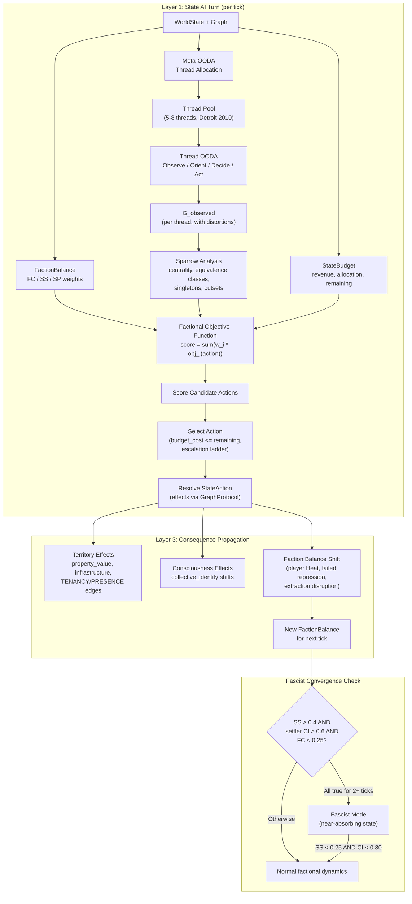

# Quickstart: State Apparatus AI (039)

**Purpose**: Developer onboarding for implementing and consuming the State Apparatus AI subsystem.

---

## 1. Overview

Feature 039 implements the state as a strategic adversary -- not a unitary rational actor, but a factional coalition of Finance-Capital, Security-State, and Settler-Populist interests whose behavior shifts based on which faction dominates at any moment. The state selects from a six-verb action taxonomy (ADMINISTER, DEVELOP, RESEARCH, CO_OPT, REPRESS, WITHDRAW with ~24 sub-verbs) constrained by budget and attention thread capacity, allocates finite intelligence resources using Sparrow-grounded network analysis on an always-incomplete observation of the actual network, and reshapes territories through DEVELOP/WITHDRAW effects. The core design claim: the player's actions do not just provoke state *responses* -- they shift *which version of the state* the player is fighting.

---

## 2. Key Concepts

### Factions

Three ruling-class coalitions with distinct material bases and verb preferences:

| Faction | Material Base | Preferred Verbs | Strategic Character |
|---------|--------------|-----------------|---------------------|
| **Finance-Capital** (FC) | Extraction efficiency, profit rate | CO_OPT, DEVELOP | Tolerates organizing unless it threatens accumulation |
| **Security-State** (SS) | Repressive apparatus | REPRESS, ADMINISTER | Institutional incentive to maintain threat perception |
| **Settler-Populist** (SP) | Imperial rent distribution to settler nation | DEVELOP (displacement), CO_OPT (bribe base) | Provides mass base for fascism when imperial rent contracts |

`FactionBalance` is a weight vector (FC + SS + SP = 1.0). Detroit 2010 defaults: FC=0.45, SS=0.30, SP=0.25. The dominant faction determines the state's composite objective function: `score(action) = sum(faction_weight_i * faction_objective_i(action))`.

### Verbs

Six top-level verbs with ~24 sub-verbs, encoded as a flat `StateActionType` enum with simple naming and an explicit `VERB_CHILDREN` mapping for hierarchy validation:

| Verb | Sub-verbs | Target Layer | Strategic Mode |
|------|-----------|-------------|----------------|
| **ADMINISTER** | FUND, STAFF, LEGISLATE, AUDIT | State apparatus (self) | Internal capacity reproduction |
| **DEVELOP** | INVEST, REZONE, DISPLACE, NEGLECT | Territory / material base | Reshape the ground |
| **RESEARCH** | PURSUE_TECH, DEPLOY_TECH | Technology / capability | Expand action space |
| **CO_OPT** | BRIBE, PROPAGANDIZE, INCORPORATE, DIVIDE | Civil society / opposition | Absorb or neutralize |
| **REPRESS** | SURVEIL, INFILTRATE, RAID, PROSECUTE, LIQUIDATE | Organizations / topology | Destroy or degrade |
| **WITHDRAW** | STRATEGIC_WITHDRAWAL, TACTICAL_RETREAT, SCORCHED_EARTH | Territory / commitment | Concede or reposition |

`StateActionType` is **separate** from the player's `ActionType` (Feature 032). The two action spaces are disjoint -- the state cannot EDUCATE or STRIKE; the player cannot LEGISLATE or DISPLACE. Three verbs (DEVELOP, RESEARCH, WITHDRAW) are asymmetric -- the player has no equivalent because these require state-level control over the material base, the legal framework, or sovereign territory.

### Attention Threads

Finite intelligence resources that track specific targets (organizations, territories, communities). Thread pool size = sum of `surveillance_capacity` across all `StateApparatus` nodes (~5-8 for Detroit 2010). FUND and STAFF actions grow the pool; EMERGENCY_POWERS doubles it.

Each thread progresses through four phases based on `intel_completeness` thresholds:

```
DORMANT (<0.1) -> MONITORING (<0.4) -> ACTIVE_INVESTIGATION (<0.7) -> DISRUPTION (>=0.7)
```

Phase determines available actions: MONITORING enables SURVEIL, ACTIVE_INVESTIGATION enables INFILTRATE/DIVIDE, DISRUPTION enables RAID/PROSECUTE. Threads have *stickiness* -- they resist rapid reallocation when threat levels fluctuate.

### Observation Gap

The state sees `G_observed`, never `G_actual`. `G_observed` is constructed as a separate NetworkX DiGraph (not a subgraph view) with distortions applied. Five surveillance methods each reveal different aspects:

| Method | Reveals | Blind To |
|--------|---------|----------|
| SIGNALS | Communication edges, org size estimates | Face-to-face meetings, cash flows, consciousness |
| FINANCIAL | Resource flow edges, fundraising sources | Ideology, solidarity strength, cell membership |
| SOCIAL_MEDIA | Public-facing nodes, declared affiliations | Clandestine structure, commitment levels |
| INFORMANT | Internal state (with distortion), leadership ID | Full topology (limited to informant's cell) |
| PHYSICAL | Face-to-face meeting edges, location data | Digital communication, financial flows |

Key distortions: edge type conflation (SOLIDARISTIC appears as generic COMMUNICATION), temporal flattening (active vs dormant edges conflated), informant incentive distortion (informants exaggerate threat to maintain relevance).

Observation ceiling per apparatus caps `intel_completeness` as a hard limit:

| Apparatus | Observation Ceiling |
|-----------|-------------------|
| FBI | 0.4 |
| Local PD | 0.2 |
| Fusion Center | 0.5 |

Cell topology reduces the effective ceiling further: `effective_ceiling = base_ceiling * (1 - compartmentalization_factor)`. A well-compartmented organization with 3 cells reduces FBI ceiling from 0.4 to ~0.28.

### Escalation

The state prefers cheap, low-visibility actions and escalates only when cheaper options fail:

```
PROPAGANDIZE -> BRIBE -> INCORPORATE -> SURVEIL -> DIVIDE
    -> INFILTRATE -> INVEST/REZONE -> FUND(security) -> LEGISLATE
        -> RAID -> PROSECUTE -> DISPLACE -> STRATEGIC_WITHDRAWAL
            -> EMERGENCY_POWERS -> MASS_RAID -> LIQUIDATE -> SCORCHED_EARTH
```

Rising player Heat shifts the factional objective function toward Security-State preferences, selecting higher-escalation verbs. De-escalation occurs when Heat subsides (within 8 ticks, SC-003). Budget pressure also forces cheaper options (FR-D07).

### Fascist Convergence

A near-absorbing phase transition detected when three conditions hold simultaneously for `convergence_confirmation_ticks` (default 2) consecutive ticks:

1. Security-State weight > 0.4 (repressive apparatus has internal control)
2. Settler collective_identity > 0.6 with ASSIMILATIONIST_FASCIST tendency (popular mass base)
3. Finance-Capital weight < 0.25 (capital has given up on co-optation)

**All three must hold simultaneously.** Missing any one returns False: SS > 0.4 without settler CI > 0.6 is police state, not fascism (no mass base).

Entry thresholds are easier to reach than exit thresholds. Exit requires SS < 0.25 AND settler CI < 0.30 -- a much harder swing. In fascist mode: CO_OPT budget redirects to REPRESS, DEVELOP shifts to displacement-oriented sub-verbs (DISPLACE, REZONE), WITHDRAW becomes SCORCHED_EARTH in contested territories, LEGISLATE shifts to EMERGENCY_POWERS.

Emits `FASCIST_CONVERGENCE` event via EventBus, consumed by BifurcationMonitor (Feature 033).

---

## 3. Dependencies Checklist

All dependencies are implemented and available on `dev`:

| Dependency | Feature | Key Imports | Status |
|-----------|---------|-------------|--------|
| Organization base model | 031 | `StateApparatus`, `OrgType`, `JurisdictionLevel`, `IntelMethodology`, `KeyFigure` | COMPLETE |
| OODA loop system | 032 | `ActionType`, `Action`, `OODAProfile`, `TurnResolution`, `OODASystem`, `npc_stub.select_npc_actions()` | COMPLETE |
| Bifurcation topology | 033 | `BifurcationMonitor`, `BifurcationSnapshot`, percolation theory, phase transition detection | COMPLETE |
| Ternary consciousness | 034 | `r+l+f=1.0` simplex, `collective_identity`, `ConsciousnessTendency` (incl. `ASSIMILATIONIST_FASCIST`) | COMPLETE |
| Community hypergraph | 029 | `CommunityType`, `MembershipRole`, XGI hyperedge, `CommunityState` | COMPLETE |
| Unified class system | 038 | `ClassPosition`, solidarity potential, community filtration, class-pair matrix | COMPLETE |

**Existing integration seam**: `src/babylon/ooda/npc_stub.py` dispatches NPC behavior by `OrgType`. The check at line ~21 for `OrgType.STATE_APPARATUS` is where the new `NPCDecisionStrategy` protocol replaces the generic priority queue.

---

## 4. Architecture Overview



**Key integration points**:
- **Layer 1 (state acts first)**: State actions resolve before initiative-ordered player/NPC actions. The state sets conditions; other organizations respond within that environment.
- **Layer 3 (faction shifts as consequences)**: Faction balance shifts are computed in Layer 3, after both state and player actions complete. This avoids mid-tick objective function changes.
- **npc_stub.py**: For `OrgType.STATE_APPARATUS`, delegates to `NPCDecisionStrategy` protocol. Non-state NPC orgs continue using the existing priority queue stub.
- **EventBus**: New events `FASCIST_CONVERGENCE`, `STATE_ACTION_EXECUTED`, `FACTION_BALANCE_SHIFTED`, `THREAD_ALLOCATED`/`THREAD_DEALLOCATED`.

---

## 5. Quick Usage Examples

### Create a FactionBalance

```python
from babylon.models.entities.state_apparatus_ai import FactionBalance
from babylon.models.enums import StateFaction

# Detroit 2010 defaults
balance = FactionBalance(
    finance_capital=0.45,
    security_state=0.30,
    settler_populist=0.25,
)

# Computed property
dominant = balance.dominant_faction  # StateFaction.FINANCE_CAPITAL

# Shift after player generates Heat (immutable -- returns new instance)
shifted = balance.model_copy(update={
    "finance_capital": 0.40,
    "security_state": 0.35,   # +0.05 from Heat (max shift per tick)
    "settler_populist": 0.25,
})
assert shifted.dominant_faction == StateFaction.FINANCE_CAPITAL  # Still FC, but SS gaining
```

### Select a Verb via the Decision Strategy

```python
from babylon.ooda.state_ai.decision import DefaultStateAIStrategy
from babylon.ooda.state_ai.protocols import NPCDecisionStrategy
from babylon.models.entities.state_apparatus_ai import StateAction

# Protocol + Default impl pattern
strategy: NPCDecisionStrategy = DefaultStateAIStrategy(
    defines=game_defines.state_apparatus_ai,
)

action: StateAction | None = strategy.select_action(
    world_state=world,
    faction_balance=balance,
    budget=state_budget,
    threads=thread_pool,
    rng=rng,
)

if action is not None:
    assert action.budget_cost <= state_budget.remaining  # Budget constraint
    # Resolve via GraphProtocol (effects applied to territory/org nodes)
```

### Create and Advance an Attention Thread

```python
from babylon.models.entities.attention_thread import AttentionThread, SparrowAnalysis
from babylon.models.enums import ThreadPhase, SurveillanceMethod
from babylon.ooda.attention.sparrow import compute_sparrow_analysis

# Create a thread targeting a player organization
thread = AttentionThread(
    thread_id="fbi-thread-001",
    target_id="player-org-detroit",
    target_type="organization",
    phase=ThreadPhase.MONITORING,
    intel_completeness=0.15,
    intensity=0.5,
    observed_subgraph={},
    methods=[SurveillanceMethod.SIGNALS, SurveillanceMethod.SOCIAL_MEDIA],
    ticks_active=3,
    stickiness=0.3,
    sparrow_results=None,
)

# After observation expands G_observed, run Sparrow analysis
analysis: SparrowAnalysis = compute_sparrow_analysis(g_observed=g_observed)
# analysis.identified_singletons  -> hub nodes (leaders)
# analysis.equivalence_classes    -> structurally interchangeable positions
# analysis.known_cutsets           -> edges whose removal disconnects the network

# Thread phase advances when intel_completeness crosses thresholds
updated = thread.model_copy(update={
    "intel_completeness": 0.45,
    "phase": ThreadPhase.ACTIVE_INVESTIGATION,  # crossed 0.4 threshold
    "sparrow_results": analysis,
    "ticks_active": thread.ticks_active + 1,
})
```

### Check Fascist Convergence

```python
from babylon.formulas.state_ai import is_fascist_convergence

converged = is_fascist_convergence(
    balance=balance,
    settler_ci=0.65,
    settler_tendency="ASSIMILATIONIST_FASCIST",
    consecutive_ticks_met=2,
    defines=game_defines.state_apparatus_ai,
)
# converged = False (FC=0.45 > 0.25 threshold -- Finance-Capital not yet acquiescing)
```

### Apply Territory Effects via GraphProtocol

```python
# INVEST raises property values (gentrification first stage)
graph.update_node(
    territory_id,
    {"property_value_proxy": current_value + defines.state_apparatus_ai.invest_property_delta},
)

# DISPLACE severs TENANCY edges (displacement)
graph.remove_edge(population_id, territory_id)

# STRATEGIC_WITHDRAWAL removes state PRESENCE
graph.remove_edge(apparatus_id, territory_id)
graph.update_node(territory_id, {"state_investment": 0.0})

# NEGLECT degrades infrastructure (exponential decay)
new_quality = max(
    current_quality * (1 - defines.state_apparatus_ai.neglect_decay_rate),
    defines.state_apparatus_ai.neglect_quality_floor,
)
graph.update_node(territory_id, {"infrastructure_quality": new_quality})
```

---

## 6. File Map

### Source Files (to be created/extended)

```text
src/babylon/
├── models/
│   ├── enums.py                        # EXTEND: StateFaction, StateActionType,
│   │                                   #   ThreadPhase, SurveillanceMethod, LegislationType
│   └── entities/
│       ├── organization.py             # EXTEND: factional_alignment field on StateApparatus
│       ├── state_apparatus_ai.py       # NEW: FactionBalance, StateBudget, StateAction,
│       │                               #       LegalFramework, TerritoryPresence
│       └── attention_thread.py         # NEW: AttentionThread, ObservationModel,
│                                       #       SparrowAnalysis
├── ooda/
│   ├── npc_stub.py                     # EXTEND: dispatch to NPCDecisionStrategy
│   │                                   #   for OrgType.STATE_APPARATUS
│   ├── state_ai/                       # NEW: state AI decision architecture
│   │   ├── __init__.py
│   │   ├── protocols.py                # NPCDecisionStrategy protocol (hot-swappable)
│   │   ├── decision.py                 # Factional objective function, verb scoring
│   │   ├── escalation.py              # Escalation/de-escalation ladder logic
│   │   └── faction_dynamics.py         # Faction balance shift calculations
│   └── attention/                      # NEW: attention thread system
│       ├── __init__.py
│       ├── thread_manager.py           # Thread allocation, meta-OODA
│       ├── sparrow.py                  # NetworkX centrality analysis on G_observed,
│       │                               #   equivalence classes, singleton identification
│       ├── observation.py              # G_observed construction, distortions,
│       │                               #   observation ceiling enforcement
│       └── thread_ooda.py             # Per-thread OODA cycle (Observe/Orient/Decide/Act)
├── engine/
│   └── systems/
│       └── ooda.py                     # EXTEND: Layer 1 state action resolution,
│                                       #   Layer 3 faction balance shift computation
├── formulas/
│   └── state_ai.py                     # NEW: faction shift formulas,
│                                       #   fascist convergence check,
│                                       #   consciousness effect calculations
└── config/
    └── defines.py                      # EXTEND: StateApparatusAIDefines sub-model
```

### Test Files (to be created)

```text
tests/
├── unit/
│   └── state_ai/
│       ├── test_faction_balance.py      # F-01 through F-05: weight normalization,
│       │                                #   Heat shifts, convergence detection
│       ├── test_state_verbs.py          # StateActionType enum, verb taxonomy,
│       │                                #   budget costs, legitimacy costs
│       ├── test_escalation.py           # D-03, D-04: escalation/de-escalation
│       │                                #   ladder ordering
│       ├── test_attention_threads.py    # T-01 through T-06: intel growth,
│       │                                #   phase transitions, observation ceiling
│       ├── test_sparrow.py             # Sparrow analysis on star vs cell topology,
│       │                                #   equivalence classes, singleton ID
│       └── test_territory_effects.py    # TE-01 through TE-07: INVEST, DISPLACE,
│                                        #   NEGLECT, WITHDRAW effects
├── contract/
│   └── state_ai/
│       ├── test_decision_contract.py    # D-01: factional objective scoring
│       │                                # D-02: budget constraint enforcement
│       │                                # D-05: determinism (identical seed = identical actions)
│       │                                # D-06: one action per tick
│       ├── test_thread_contract.py      # T-01: intel growth monotonicity
│       │                                # T-02: cell topology 30% resistance
│       │                                # T-03: observation ceiling hard cap
│       ├── test_faction_contract.py     # F-01: weight normalization invariant
│       │                                # F-02: Heat -> SS shift
│       │                                # F-03: failed repression -> SS decline
│       │                                # F-04: fascist convergence 3-condition check
│       │                                # F-05: near-absorbing reversion thresholds
│       └── test_territory_contract.py   # TE-01: INVEST raises property values
│                                        # TE-02: DISPLACE removes population
│                                        # TE-03: NEGLECT exponential decay
│                                        # TE-04: STRATEGIC_WITHDRAWAL hollows territory
│                                        # TE-05: SCORCHED_EARTH destroys infrastructure
│                                        # TE-06: Heat by operational profile
│                                        # TE-07: PRESENCE required for recruitment
└── integration/
    └── test_state_ai_integration.py     # SC-001 through SC-010: 52-tick simulations,
                                         #   100-seeded-run statistical tests (p<0.05)
```

---

## 7. Testing Instructions

```bash
# Run all state AI unit tests
poetry run pytest tests/unit/state_ai/ -v

# Run behavioral contract tests
poetry run pytest tests/contract/state_ai/ -v

# Run a specific contract file
poetry run pytest tests/contract/state_ai/test_faction_contract.py -v

# Run integration tests (52-tick simulations, slower)
poetry run pytest tests/integration/test_state_ai_integration.py -v

# Run by marker
poetry run pytest -m "math" tests/unit/state_ai/      # Pure formula tests (deterministic)
poetry run pytest -m "topology" tests/unit/state_ai/   # Graph/network tests
poetry run pytest -m "ledger" tests/unit/state_ai/      # Economic state tests

# Run with coverage
poetry run pytest tests/unit/state_ai/ tests/contract/state_ai/ -v \
    --cov=src/babylon/ooda/state_ai \
    --cov=src/babylon/ooda/attention \
    --cov=src/babylon/models/entities/state_apparatus_ai \
    --cov=src/babylon/models/entities/attention_thread \
    --cov=src/babylon/formulas/state_ai

# Type checking (strict mode)
poetry run mypy src/babylon/ooda/state_ai/ \
    src/babylon/ooda/attention/ \
    src/babylon/models/entities/state_apparatus_ai.py \
    src/babylon/models/entities/attention_thread.py \
    src/babylon/formulas/state_ai.py --strict
```

---

## 8. Common Patterns

### Mutation via model_copy

All models are frozen. Mutations return new instances:

```python
# WRONG: Mutating in place (raises ValidationError)
balance.stability = 0.3

# RIGHT: Copy with updates
new_balance = balance.model_copy(update={"stability": 0.3})
```

This applies to `FactionBalance`, `StateBudget`, `AttentionThread`, `StateAction`, `LegalFramework`, and all other frozen Pydantic models in this feature.

### GraphProtocol Usage

All state effects are applied through the 18-method GraphProtocol interface, never direct NetworkX calls:

```python
# Read territory state
territory_data = graph.get_node(territory_id)
current_quality = territory_data["infrastructure_quality"]

# Write updates
graph.update_node(territory_id, {
    "infrastructure_quality": new_quality,
    "property_value_proxy": new_property_value,
})

# Edge operations
graph.remove_edge(population_id, territory_id)  # Sever TENANCY on DISPLACE
graph.remove_edge(apparatus_id, territory_id)    # Remove PRESENCE on WITHDRAW
```

Nested dict writes require copy-modify-writeback via `update_node()` (no direct attribute mutation on graph nodes).

### Event Emission

State actions emit events via EventBus with per-tick semantics (fresh list each tick):

```python
from babylon.models.enums import EventType

# State action executed
event_bus.publish(EventType.STATE_ACTION_EXECUTED, {
    "verb": action.verb.value,
    "target_id": action.target_id,
    "budget_cost": float(action.budget_cost),
    "faction_alignment": action.faction_alignment.value,
})

# Faction balance shifted (Layer 3 consequence)
event_bus.publish(EventType.FACTION_BALANCE_SHIFTED, {
    "old_balance": old_balance.model_dump(),
    "new_balance": new_balance.model_dump(),
    "trigger": "player_heat",
})

# Fascist convergence detected (consumed by BifurcationMonitor, Feature 033)
event_bus.publish(EventType.FASCIST_CONVERGENCE, {
    "faction_balance": balance.model_dump(),
    "settler_ci": settler_ci,
    "tick": current_tick,
})
```

### Protocol + Default Implementation

The hot-swappable decision strategy follows the project's Protocol + Default impl convention:

```python
from typing import Protocol
from random import Random

class NPCDecisionStrategy(Protocol):
    """Strategy for state AI verb selection (hot-swappable).

    Rule-based stub satisfies determinism (FR-D08).
    Future LLM implementation swaps in without changing callers.
    """

    def select_action(
        self,
        world_state: WorldState,
        faction_balance: FactionBalance,
        budget: StateBudget,
        threads: list[AttentionThread],
        rng: Random,
    ) -> StateAction | None: ...


class DefaultStateAIStrategy:
    """Rule-based stub implementation (deterministic given RNG seed)."""

    def __init__(self, defines: StateApparatusAIDefines) -> None:
        self._defines = defines

    def select_action(self, ...) -> StateAction | None:
        # 1. Score candidates via factional objective function
        # 2. Filter by budget constraint (budget_cost <= remaining)
        # 3. Apply escalation ladder ordering
        # 4. Return highest-scoring feasible action, or None
        ...
```

### GameDefines Configuration

All tunable coefficients are centralized in `StateApparatusAIDefines`, a frozen Pydantic sub-model on `GameDefines`:

```python
from babylon.config.defines import GameDefines

defines = GameDefines()
ai = defines.state_apparatus_ai

# Faction defaults (Detroit 2010 -- flagged SYNTHETIC)
ai.initial_fc_weight                # 0.45
ai.initial_ss_weight                # 0.30
ai.initial_sp_weight                # 0.25

# Shift limits
ai.max_faction_shift_per_tick       # 0.05 (ceiling)
ai.min_effect_floor                 # 0.02 (floor)

# Fascist convergence thresholds
ai.fascist_ss_threshold             # 0.4
ai.fascist_ci_threshold             # 0.6
ai.fascist_fc_ceiling               # 0.25
ai.convergence_confirmation_ticks   # 2
ai.reversion_ss_threshold           # 0.25
ai.reversion_ci_threshold           # 0.30

# Observation ceilings (by apparatus type)
ai.observation_ceilings             # {"FBI": 0.4, "LOCAL_PD": 0.2, "FUSION_CENTER": 0.5}

# Thread configuration
ai.thread_phase_thresholds          # {DORMANT: 0.0, MONITORING: 0.1, ACTIVE: 0.4, DISRUPTION: 0.7}
ai.thread_stickiness_default        # Configurable

# Territory effects
ai.invest_property_delta            # Per-tick INVEST effect on property_value_proxy
ai.neglect_decay_rate               # Exponential decay rate for NEGLECT
ai.neglect_quality_floor            # Minimum infrastructure_quality (prevents zero)
ai.displace_population_fraction     # Fraction of target population removed by DISPLACE

# Actions
ai.actions_per_tick                 # 1 (configurable for future multi-action expansion)
ai.legitimacy_costs                 # dict[StateActionType, float]

# Faction verb preferences (3x6 matrix)
ai.faction_verb_preferences         # {FC: {ADMINISTER: w, DEVELOP: w, ...}, SS: {...}, SP: {...}}
```

### TestConstants Pattern

Domain-specific test values go in `tests/constants.py`, not as magic numbers in test files:

```python
from tests.constants import TestConstants
TC = TestConstants

# Use semantic constants
balance = FactionBalance(
    finance_capital=TC.StateAI.FC_DETROIT_2010,     # 0.45
    security_state=TC.StateAI.SS_DETROIT_2010,      # 0.30
    settler_populist=TC.StateAI.SP_DETROIT_2010,    # 0.25
)
```

Note: type boundary values (0.0, 1.0 for Probability) stay inline -- they ARE the type contract.

### DomainFactory for Test Entities

Use factories for test setup with sensible defaults, overriding only what matters:

```python
from tests.factories import DomainFactory

# Create with Detroit 2010 defaults
balance = DomainFactory.create_faction_balance()

# Override for specific test scenario (SS-dominant)
ss_dominant = DomainFactory.create_faction_balance(
    security_state=0.50,
    finance_capital=0.30,
    settler_populist=0.20,
)

# Create a state apparatus
apparatus = DomainFactory.create_state_apparatus(
    jurisdiction=JurisdictionLevel.LOCAL,
    surveillance_capacity=0.3,
    violence_capacity=0.5,
)
```

---

## Architecture Decisions

| Decision | Rationale | Reference |
|----------|-----------|-----------|
| Separate `StateActionType` enum | Asymmetric action spaces must be type-distinct; mypy cannot distinguish state-only from player-only if mixed (FR-B08) | research.md R-005 |
| Rule-based stub behind Protocol | Determinism for reproducible tests (FR-D08) + hot-swap seam for future LLM (FR-D09); satisfies Constitution II.5 (AI observes, never controls) | research.md R-001 |
| `G_observed` as separate DiGraph | Distortions modify edge attributes (type conflation, noise); subgraph view would reflect actual graph | research.md R-007 |
| Faction balance computed in Layer 3 | Shifts are consequences, not decisions; avoids mid-tick objective function changes; follows existing Layer 3 pattern for consciousness effects | research.md R-009 |
| State acts in Layer 1 (before player) | State sets conditions; other orgs respond within that environment; models institutional advantage | research.md R-009 |
| All config in `StateApparatusAIDefines` | Single discoverable location for all state AI parameters; follows `GameDefines` sub-model pattern; avoids scattering across 4+ defines | research.md R-010 |
| LegalFramework persists until REVOKE | No automatic expiry; creates ratchet effect matching real legislation; REVOKE has its own costs (legitimacy, opportunity) | research.md R-011 |
| Observation ceiling as hard cap | Prevents inevitable surveillance given enough time; preserves defensive value of organizational security (cell topology, counter-intel) | research.md R-007 |
| One action per tick (configurable) | Sufficient for Detroit-scale MVP; `actions_per_tick` parameter allows future multi-action expansion without architectural change (FR-D05) | research.md R-001 |
