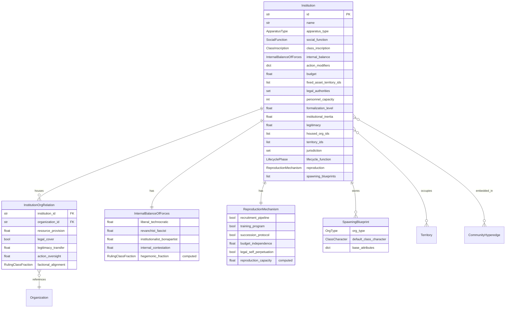

# Data Model: Institution Base Model

**Date**: 2026-03-02
**Feature**: 040-institution-base-model

## Entity Relationship Diagram



## Enums

### ApparatusType (StrEnum)

Location: `src/babylon/models/enums.py`

| Value | Category | Description |
|-------|----------|-------------|
| `RSA_EXECUTIVE` | RSA | Government, administration |
| `RSA_MILITARY` | RSA | Armed forces |
| `RSA_POLICE` | RSA | Police departments |
| `RSA_JUDICIAL` | RSA | Courts |
| `RSA_CARCERAL` | RSA | Prisons |
| `ISA_EDUCATIONAL` | ISA | Schools, universities |
| `ISA_RELIGIOUS` | ISA | Churches, religious orders |
| `ISA_FAMILY` | ISA | The family as institution |
| `ISA_LEGAL` | ISA | Legal system as ideology |
| `ISA_POLITICAL` | ISA | Electoral system, party system |
| `ISA_COMMUNICATIONS` | ISA | Media |
| `ISA_CULTURAL` | ISA | Arts, sports, cultural bodies |
| `ECONOMIC_PRODUCTIVE` | Economic | Firms, factories |
| `ECONOMIC_FINANCIAL` | Economic | Banks, exchanges |
| `ECONOMIC_EXTRACTIVE` | Economic | Mining, resource firms |

### SocialFunction (StrEnum)

Location: `src/babylon/models/enums.py`

| Value | Description |
|-------|-------------|
| `EMPLOYMENT` | Job provision |
| `EDUCATION` | Knowledge transmission |
| `WORSHIP` | Meaning-making, spiritual community |
| `POLICING` | Public safety (however distorted) |
| `HEALTHCARE` | Medical care provision |
| `CARE` | Dependent care (childcare, eldercare) |
| `ADJUDICATION` | Dispute resolution, justice |
| `COMMUNICATION` | Information dissemination |
| `LEGISLATION` | Law-making |
| `INCARCERATION` | Detention and punishment |
| `MILITARY_DEFENSE` | National defense |
| `FINANCIAL_INTERMEDIATION` | Banking, credit, investment |

### ClassInscription (StrEnum)

Location: `src/babylon/models/enums.py`

| Value | Description |
|-------|-------------|
| `BOURGEOIS` | Serves ruling class interests |
| `PROLETARIAN` | Serves working class interests |
| `CONTESTED` | Actively contested terrain |

### RulingClassFraction (StrEnum)

Location: `src/babylon/models/enums.py`

| Value | Description |
|-------|-------------|
| `LIBERAL_TECHNOCRATIC` | Consent-based rule, slow escalation |
| `REVANCHIST_FASCIST` | Naked repression, fast escalation |
| `INSTITUTIONALIST_BONAPARTIST` | Self-preservation, institutional independence |

### LifecyclePhase (StrEnum)

Location: `src/babylon/models/enums.py`

| Value | D-P-D' Phase | Description |
|-------|-------------|-------------|
| `D_DEPENDENT` | D | Youth/dependent — controls ideological transmission |
| `P_PRODUCTIVE` | P | Adult/productive — where surplus extraction occurs |
| `D_PRIME_DEPENDENT` | D' | Elder/dependent — the legitimation bargain |

## Entity Specifications

### Institution

**File**: `src/babylon/models/entities/institution.py`
**Config**: `frozen=True`
**Graph node_type**: `"institution"`

| Field | Type | Default | Constraints | Source |
|-------|------|---------|-------------|--------|
| `id` | `str` | required | min_length=1 | FR-001 |
| `name` | `str` | required | min_length=1 | FR-001 |
| `apparatus_type` | `ApparatusType` | required | — | FR-002 |
| `social_function` | `SocialFunction` | required | — | FR-003 |
| `class_inscription` | `ClassInscription` | `BOURGEOIS` | — | FR-004 |
| `internal_balance` | `InternalBalanceOfForces` | required | — | FR-005 |
| `action_modifiers` | `dict[str, float]` | `{}` | keys are ActionType values, values > 0 | FR-007 |
| `budget` | `float` | `0.0` | ge=0 | FR-008 |
| `fixed_asset_territory_ids` | `list[str]` | `[]` | — | FR-008 |
| `legal_authorities` | `frozenset[str]` | `frozenset()` | — | FR-008 |
| `personnel_capacity` | `int` | `0` | ge=0 | FR-008 |
| `formalization_level` | `float` | `0.5` | ge=0, le=1 | FR-009 |
| `institutional_inertia` | `float` | `0.5` | ge=0, le=1 | FR-009 |
| `legitimacy` | `float` | `0.5` | ge=0, le=1 | FR-009 |
| `housed_org_ids` | `list[str]` | `[]` | — | FR-010 |
| `territory_ids` | `list[str]` | `[]` | — | FR-013 |
| `jurisdiction` | `frozenset[str]` | `None` | Optional, for RSA types | FR-008 |
| `lifecycle_function` | `LifecyclePhase \| None` | `None` | — | FR-015 |
| `reproduction` | `ReproductionMechanism` | required | — | FR-012 |
| `spawning_blueprints` | `list[SpawningBlueprint]` | `[]` | — | FR-016 |

**Validators**:
- `jurisdiction` should only be set when `apparatus_type` starts with `RSA_`
- `action_modifiers` keys must be valid `ActionType` string values
- `action_modifiers` values must be > 0.0

### InternalBalanceOfForces

**File**: `src/babylon/models/entities/institution.py` (nested)
**Config**: `frozen=True`

| Field | Type | Default | Constraints | Source |
|-------|------|---------|-------------|--------|
| `liberal_technocratic` | `float` | required | ge=0, le=1 | FR-005 |
| `revanchist_fascist` | `float` | required | ge=0, le=1 | FR-005 |
| `institutionalist_bonapartist` | `float` | required | ge=0, le=1 | FR-005 |
| `internal_contestation` | `float` | `0.0` | ge=0, le=1 | FR-006 |

**Computed fields**:
- `hegemonic_fraction -> RulingClassFraction`: Returns the fraction with highest weight

**Validators**:
- Three faction weights must sum to 1.0 (tolerance ±0.01), following FactionBalance pattern from Feature 039

### ReproductionMechanism

**File**: `src/babylon/models/entities/institution.py` (nested)
**Config**: `frozen=True`

| Field | Type | Default | Constraints | Source |
|-------|------|---------|-------------|--------|
| `recruitment_pipeline` | `bool` | `False` | — | FR-012 |
| `training_program` | `bool` | `False` | — | FR-012 |
| `succession_protocol` | `bool` | `False` | — | FR-012 |
| `budget_independence` | `float` | `0.0` | ge=0, le=1 | FR-012 |
| `legal_self_perpetuation` | `bool` | `False` | — | FR-012 |

**Computed fields**:
- `reproduction_capacity -> float`: `(sum(bools) / 4) * 0.7 + budget_independence * 0.3`

### InstitutionOrgRelation

**File**: `src/babylon/models/entities/institution.py` (nested)
**Config**: `frozen=True`

| Field | Type | Default | Constraints | Source |
|-------|------|---------|-------------|--------|
| `institution_id` | `str` | required | min_length=1 | FR-011 |
| `organization_id` | `str` | required | min_length=1 | FR-011 |
| `resource_provision` | `float` | `0.0` | ge=0, le=1 | FR-011 |
| `legal_cover` | `bool` | `False` | — | FR-011 |
| `legitimacy_transfer` | `float` | `0.0` | ge=0, le=1 | FR-011 |
| `action_oversight` | `float` | `0.0` | ge=0, le=1 | FR-011 |
| `factional_alignment` | `RulingClassFraction \| None` | `None` | — | FR-011 |

### SpawningBlueprint

**File**: `src/babylon/models/entities/institution.py` (nested)
**Config**: `frozen=True`

| Field | Type | Default | Constraints | Source |
|-------|------|---------|-------------|--------|
| `org_type` | `OrgType` | required | — | FR-016 |
| `default_class_character` | `ClassCharacter` | required | — | FR-016 |
| `base_attributes` | `dict[str, Any]` | `{}` | — | FR-016 |

## Event Types

New `EventType` values to add to `src/babylon/models/enums.py`:

| Value | Returned by | Payload |
|-------|-------------|---------|
| `INSTITUTION_FACTION_SHIFT` | `update_internal_balance()` | institution_id, old_fraction, new_fraction, weights |
| `INSTITUTION_REPRODUCTION` | spawn function | institution_id, spawned_org_type, blueprint |
| `INSTITUTION_BONAPARTIST_MODE` | `update_internal_balance()` | institution_id, bonapartist_weight |

## Pure Functions

### `update_internal_balance`

```
update_internal_balance(
    balance: InternalBalanceOfForces,
    crisis_intensity: float,      # [0, 1]
    legitimacy: float,            # [0, 1]
    external_threat: float,       # [0, 1]
    alpha: float = 0.05           # smoothing rate
) -> tuple[InternalBalanceOfForces, list[Event]]
```

Returns new balance + optional events (FactionShiftEvent if hegemonic fraction changed, BonapartistModeEvent if threshold crossed).

### `structural_selectivity`

```
structural_selectivity(
    institution: Institution,
    action_type: ActionType,
    defaults: dict[ApparatusType, dict[ActionType, float]]
) -> float
```

Returns cost modifier: checks institution.action_modifiers first, falls back to apparatus-type defaults from data file.

### `hegemonic_fraction_effect`

```
hegemonic_fraction_effect(
    fraction: RulingClassFraction
) -> dict[str, Any]
```

Returns OODA modifier hints based on hegemonic fraction. E.g., LIBERAL -> {"preferred_actions": [ASSIMILATE], "escalation_reluctance": 0.7}.

## Graph Integration

### WorldState Changes

```python
# New field on WorldState
institutions: dict[str, Institution] = Field(default_factory=dict)
institution_relations: list[InstitutionOrgRelation] = Field(default_factory=list)
```

### to_graph() Addition

```python
for inst_id, inst in self.institutions.items():
    G.add_node(inst_id, _node_type="institution", **inst.model_dump())
    for tid in inst.territory_ids:
        if tid in G:
            G.add_edge(inst_id, tid, edge_type=EdgeType.PRESENCE.value)
    for org_id in inst.housed_org_ids:
        if org_id in G:
            G.add_edge(inst_id, org_id, edge_type="HOUSES")
```

### from_graph() Addition

```python
elif node_type == "institution":
    institution_excluded = {"hegemonic_fraction", "reproduction_capacity"}
    inst_data = {k: v for k, v in data.items() if k not in institution_excluded}
    institutions[node_id] = Institution(**inst_data)
```

## Data File: Institution Defaults

**File**: `src/babylon/data/defines.yaml` (extend existing)

New `InstitutionDefines` section added to `GameDefines`:

```yaml
institution:
  alpha_smoothing_rate: 0.05
  bonapartist_threshold: 0.4
  bonapartist_exclusion_threshold: 0.35
  default_action_modifiers:
    RSA_EXECUTIVE:
      LEGISLATE: 0.5
      REPRESS: 0.8
      EDUCATE: 1.5
    RSA_POLICE:
      REPRESS: 0.6
      SURVEIL: 0.7
      EDUCATE: 2.0
    RSA_JUDICIAL:
      ADJUDICATE: 0.5
      REPRESS: 1.2
    RSA_MILITARY:
      REPRESS: 0.4
      ATTACK_INFRASTRUCTURE: 0.5
    RSA_CARCERAL:
      REPRESS: 0.5
      EDUCATE: 2.5
    ISA_EDUCATIONAL:
      EDUCATE: 0.7
      RECRUIT: 0.8
      REPRESS: 2.0
    ISA_RELIGIOUS:
      EDUCATE: 0.8
      RECRUIT: 0.7
      REPRESS: 2.5
    ISA_FAMILY:
      EDUCATE: 0.9
      RECRUIT: 1.5
    ISA_COMMUNICATIONS:
      PROPAGANDIZE: 0.5
      AGITATE: 0.6
      REPRESS: 2.0
    ISA_CULTURAL:
      EDUCATE: 0.8
      PROPAGANDIZE: 0.7
      REPRESS: 2.0
    ECONOMIC_PRODUCTIVE:
      EMPLOY: 0.5
      FUNDRAISE: 0.7
      REPRESS: 1.5
    ECONOMIC_FINANCIAL:
      FUNDRAISE: 0.4
      EMPLOY: 0.8
    ECONOMIC_EXTRACTIVE:
      FUNDRAISE: 0.5
      ATTACK_INFRASTRUCTURE: 0.8
```

## Deprecation Plan

### Phase 1 (this feature)
- Add `DeprecationWarning` to `Organization.is_institution` field access
- Add `DeprecationWarning` to `Organization.institutional_persistence` field access
- Update `institution.schema.json` with deprecation notice header

### Phase 2+ (future features)
- Remove `is_institution` and `institutional_persistence` from Organization model
- Delete `institution.schema.json`
- Migrate any code using `is_institution` to check Institution entity relationships
