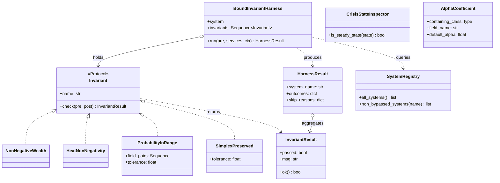

# Phase 1 Data Model: Bound Invariants

**Feature**: 054-bound-invariants
**Date**: 2026-05-06

This document enumerates the entities introduced by this feature, their
attributes, relationships, and validation rules. Test-only artifacts live
under `tests/property/`; the two new `Invariant` implementations live
under `src/babylon/engine/invariants.py`.

---

## §1. New `Invariant` implementations (production code)

These extend the existing `Invariant` Protocol and `InvariantResult`
dataclass in `src/babylon/engine/invariants.py`. They sit alongside
`NonNegativeWealth` and `HeatNonNegativity`.

### 1.1 `ProbabilityInRange`

| Attribute | Type | Description |
|-----------|------|-------------|
| `name` (property) | `str` | `"probability_in_range"` |
| `field_pairs` (init arg) | `Sequence[tuple[type, str]]` | `(ModelClass, field_name)` pairs to check; defaults to the auto-discovered set from `harness/probability_discovery.py`. |
| `tolerance` (init arg) | `float` | Defaults to `0.0` (exact ≥ / ≤ comparison per FR-008). |

**Method**: `check(pre: WorldState, post: WorldState) -> InvariantResult`.

**Predicate**: For every `(ModelClass, field_name)` pair, the harness
walks **every collection on the `WorldState` model** that can hold an
instance of `ModelClass` and asserts `0.0 <= value <= 1.0` on the named
field. As of `WorldState` v2.6, those collections are:

| Collection | Element type | Likely Probability fields |
|-----------|--------------|---------------------------|
| `entities: dict[str, SocialClass]` | `SocialClass` | `p_acquiescence`, `p_revolution`, `organization`, `repression_faced` |
| `territories: dict[str, Territory]` | `Territory` | `p_acquiescence`, `p_revolution` (computed fields) |
| `relationships: list[Relationship]` | `Relationship` | `solidarity_strength` (on `EdgeType.SOLIDARITY` edges) |
| `organizations: dict[str, OrganizationType]` | discriminated union | discovery walker reports per-subtype |
| `key_figures: dict[str, KeyFigure]` | `KeyFigure` | discovery walker reports |
| `institutions: dict[str, Institution]` | `Institution` | discovery walker reports |
| `state_finances: dict[str, StateFinance]` | `StateFinance` | discovery walker reports |
| `contradiction_frames: dict[str, ContradictionFrame]` | `ContradictionFrame` | discovery walker reports |
| `industries: dict[str, IndustryHyperedge]` | `IndustryHyperedge` | discovery walker reports |

The walker enumerates collections by reading
`WorldState.model_fields` and selecting fields whose annotation is a
`dict`/`list` of a Pydantic model. **Sentinel rule**: if a future
`WorldState` field appears whose value is a Pydantic model collection
and is *not* surveyed, the harness MUST emit a warning at collection
time so coverage gaps surface explicitly.

**Failure message format**: `f"Field {ModelClass.__name__}.{field_name}
on entity {entity_id} = {value:.6f} (out of [0, 1])"`.

**Validation rule**: `field_pairs` MUST be non-empty (the auto-discovery
produces ≥ 1 pair in practice; an empty `field_pairs` means the
discovery walker has a bug).

### 1.2 `SimplexPreserved`

| Attribute | Type | Description |
|-----------|------|-------------|
| `name` (property) | `str` | `"simplex_preserved"` |
| `tolerance` (init arg) | `float` | Defaults to `1e-4` per spec acceptance scenario US3.1. |

**Method**: `check(pre: WorldState, post: WorldState) -> InvariantResult`.

**Predicate**: For every entity in `post.entities` that has a
`consciousness: TernaryConsciousness` field, the constraint
`abs(c.r + c.l + c.f - 1.0) <= tolerance` holds AND each of `c.r`,
`c.l`, `c.f` lies in `[0.0 - tolerance, 1.0 + tolerance]`.

**Failure message format**: `f"Entity {entity_id} consciousness
({c.r:.6f}, {c.l:.6f}, {c.f:.6f}) sums to {c.r+c.l+c.f:.6f}
(simplex error {abs(c.r+c.l+c.f-1.0):.3e})"`.

**Validation rule**: `tolerance` MUST be > 0.

---

## §2. Test harness modules (`tests/property/harness/`)

### 2.1 `BoundInvariantHarness`

Frozen dataclass that wraps a System (or System-pipeline) invocation and
applies a list of bound invariants to the (pre, post) pair.

| Attribute | Type | Description |
|-----------|------|-------------|
| `system` | `type[System] \| Callable[[WorldState, ServiceContainer, TickContext], WorldState]` | The System under test, or a pipeline runner. |
| `invariants` | `Sequence[Invariant]` | Invariants to check after the System runs. |
| `bypass_marker_attr` | `str` | Defaults to `"bypasses_bound_invariant"` — the ClassVar attribute name on the System class. |

**Method**: `run(pre: WorldState, services: ServiceContainer, ctx:
TickContext) -> HarnessResult`.

**Method**: `_filter_invariants() -> Sequence[Invariant]` — reads
`system.bypasses_bound_invariant` (if present) and returns the
invariants whose names are NOT in the marker dict's keys.

### 2.2 `HarnessResult`

| Attribute | Type | Description |
|-----------|------|-------------|
| `system_name` | `str` | Class name of the System (or `"<pipeline>"` for full-pipeline runs). |
| `outcomes` | `dict[str, InvariantResult \| Literal["SKIPPED"]]` | Per-invariant outcome keyed by invariant name. `"SKIPPED"` indicates the System opted out via `bypasses_bound_invariant`. |
| `skip_reasons` | `dict[str, str]` | Predicate name → justification string copied from the marker. Empty if no skips. |

**Validation rule**: `outcomes.keys()` MUST equal the set of invariant
names registered with the harness (no silent drops).

### 2.3 `CrisisStateInspector`

Stateless helper. Single method.

| Method | Signature | Description |
|--------|-----------|-------------|
| `is_steady_state` | `(state: HasCrisisPhase \| HasCrisisState) -> bool` | Returns `True` iff the state's `crisis_phase` is `None` or `CrisisPhase.NORMAL`. Per research §5. |

**Validation rule**: For states that have neither a `crisis_phase`
attribute nor a `crisis_state.phase` attribute, the method returns
`True` (steady-state default per spec edge case).

### 2.4 `SystemRegistry`

Module-level singleton (cached at import time).

| Attribute | Type | Description |
|-----------|------|-------------|
| `all_systems` (function) | `() -> list[type[System]]` | Returns all 22 Systems discovered under `src/babylon/engine/systems/`, excluding `__init__` and `protocol`. Cached on first call. |
| `non_bypassed_systems` (function) | `(invariant_name: str) -> list[type[System]]` | Returns all Systems whose `bypasses_bound_invariant` dict does NOT contain `invariant_name` as a key. |

**Validation rule**: `len(all_systems()) >= 22` at the time of writing
(adding new Systems extends the count automatically).

### 2.5 `ProbabilityFieldDiscovery`

Module-level helpers in `harness/probability_discovery.py`.

| Function | Signature | Description |
|----------|-----------|-------------|
| `discover_probability_fields` | `() -> list[tuple[type[BaseModel], str]]` | Walks every Pydantic model under `src/babylon/models/`; returns `(ModelClass, field_name)` pairs whose annotation is `Probability` per research §1. |
| `discover_probability_formulas` | `() -> list[Callable[..., Probability]]` | Walks every public callable in `babylon.formulas.*`; returns each one whose `typing.get_type_hints(fn).get("return") is Probability` per research §2. Type-driven, no allow-list. |

### 2.6 `AlphaCoefficientDiscovery`

Module-level helpers in `harness/alpha_discovery.py`.

| Function | Signature | Description |
|----------|-----------|-------------|
| `discover_alpha_coefficients` | `() -> list[AlphaCoefficient]` | Walks `defines.py` recursively; returns each `AlphaCoefficient` matching the regex from research §4 (after excluding `_NOT_EMA_ALPHAS`). |

### 2.7 `AlphaCoefficient`

Frozen dataclass.

| Attribute | Type | Description |
|-----------|------|-------------|
| `containing_class` | `type[BaseModel]` | The Pydantic class on `defines.py` where the field lives. |
| `field_name` | `str` | The field's attribute name (e.g., `"alpha_smoothing_rate"`). |
| `default_alpha` | `float` | The default value as declared in `defines.py`. |

**Validation rule**: `0.0 < default_alpha <= 1.0` (these are EMA rates).

---

## §3. Test strategies (`tests/property/strategies/`)

### 3.1 `worldstate_with_probability_fields_strategy`

`@composite` strategy returning a `WorldState` whose entities collectively
populate every `(ModelClass, field_name)` pair from
`discover_probability_fields()`. Uses `st.floats(min_value=0.0,
max_value=1.0, allow_nan=False)` for each Probability field; uses sensible
defaults for the rest.

### 3.2 `worldstate_with_simplex_consciousness_strategy`

`@composite` strategy returning a `WorldState` whose `SocialClass` entities
each carry a valid `TernaryConsciousness(r, l, f)` drawn from the existing
`simplex_points()` strategy in `tests/test_simplex_invariants.py:21`.

### 3.3 `alpha_coefficient_triple_strategy`

`@composite` strategy returning `(prev: float, raw: float, alpha:
float)` triples where `prev, raw ∈ [-1e9, 1e9]`, `alpha ∈ (0.0, 1.0]`.
Used by US4's synthesized sweep.

### 3.4 `consciousness_simplex` re-export

`tests/property/strategies/consciousness_simplex.py` re-exports
`simplex_points()` from `tests/test_simplex_invariants.py` so US3 has a
canonical import path under the `tests/property/` tree without coupling
to the legacy test file's location.

---

## §4. Opt-out marker contract

The `bypasses_bound_invariant: ClassVar[dict[str, str]]` ClassVar is added
to a System (or a formula's module-level `__all__`) only when the harness
empirically detects a legitimate violation. The contract:

| Marker Key | Meaning |
|------------|---------|
| `"probability_in_range"` | The System / formula legitimately produces a `Probability`-typed value outside `[0, 1]` at some intermediate stage; the value is re-clipped before being committed to graph state. |
| `"non_negative_wealth"` | The System legitimately produces a temporary negative-wealth state that is offset within the same step. |
| `"heat_non_negativity"` | The System legitimately produces a temporary negative-heat state that is offset within the same step. |
| `"simplex_preserved"` | The System / formula legitimately produces a non-simplex consciousness intermediate that is renormalized before commit. |

**Marker validation** (machine-enforced per FR-010 / SC-006): at test
collection time, the harness asserts `all(v.strip() for v in
marker.values())` for every marker. Empty justifications fail CI.

---

## §5. Relationships

