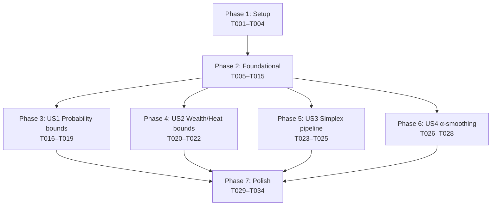

# Tasks: Bound Invariants — Property-Based Tests

**Input**: Design documents from `/specs/054-bound-invariants/`
**Prerequisites**: plan.md, spec.md, research.md, data-model.md, contracts/

**Tests note**: This feature *is* a test suite. Every implementation task
produces a Hypothesis property test, so the spec template's "tests vs.
implementation" split does not apply — implementation tasks ARE the tests.

**Organization**: Tasks are grouped by user story to enable independent
implementation. Phases 3–6 (US1–US4) can be worked in parallel after
Phase 2 completes; within each phase, tasks operating on the same file
are sequential.

## Format: `[ID] [P?] [Story] Description`

- **[P]**: Can run in parallel (different files, no incomplete dependencies)
- **[Story]**: User story label (US1, US2, US3, US4) — required for
  Phase 3+ tasks only

## Path Conventions

Single-project layout per `plan.md`:

- Production code: `src/babylon/engine/invariants.py` (the only file
  outside `tests/` touched by this feature)
- Test infrastructure: `tests/property/{harness,strategies,invariants}/`
- Profile registration: `tests/conftest.py` and `tests/property/conftest.py`
  (already present from Spec 053; no changes needed)

---

## Phase 1: Setup (Shared Infrastructure)

**Purpose**: Confirm reusable Spec 053 plumbing is present and create the
new `harness/` directory + tolerance helper.

- [X] T001 Verify Hypothesis `default` and `slow` profiles are registered project-wide in `tests/conftest.py` lines 54–67 (no edit needed; halt if missing — spec 053 should have added them)
- [X] T002 Verify per-package `dev` / `ci` / `nightly` profiles AND the `service_container_fixture` / `tick_context_fixture` (Spec 053 T014b) are present in `tests/property/conftest.py:20-62` (no edit needed; halt if any are missing — every Phase 3+ task depends on the fixtures)
- [X] T003 [P] Create `tests/property/harness/__init__.py` exporting the magnitude-aware `_tol(n: int, magnitude: float = 0.0) -> float` helper extracted verbatim from `tests/property/invariants/test_value_conservation.py:58-77`
- [X] T004 [P] Create empty stub files `tests/property/invariants/test_probability_bounds.py`, `test_wealth_heat_bounds.py`, `test_simplex_pipeline.py`, `test_alpha_smoothing.py`, each containing only the module docstring referencing the corresponding contract markdown file

**Checkpoint**: Setup complete — foundational phase can begin.

---

## Phase 2: Foundational (Blocking Prerequisites)

**Purpose**: Ship the two new `Invariant` implementations, all four
discovery walkers, the `BoundInvariantHarness`, and the cross-cutting
test strategies. Every user story phase depends on these.

**⚠️ CRITICAL**: No US1/US2/US3/US4 work can begin until Phase 2 completes.

### Production code (engine invariants)

- [X] T005 Add `ProbabilityInRange` class to `src/babylon/engine/invariants.py` per `data-model.md §1.1` — implements `Invariant` Protocol; `name = "probability_in_range"`; takes `field_pairs: Sequence[tuple[type, str]]` defaulting to `discover_probability_fields()`; checks `0.0 <= value <= 1.0` exactly; failure message names `ModelClass.field_name`, `entity_id`, value
- [X] T006 Add `SimplexPreserved` class to `src/babylon/engine/invariants.py` per `data-model.md §1.2` — implements `Invariant` Protocol; `name = "simplex_preserved"`; takes `tolerance: float = 1e-4`; checks `abs(c.r + c.l + c.f - 1.0) <= tolerance` AND each component in `[-tol, 1.0 + tol]`; failure message names entity ID, `(r, l, f)` triple, simplex error magnitude — depends on T005 (same file, sequential edit)

### Harness modules

- [X] T007 [P] Create `tests/property/harness/system_registry.py` per `data-model.md §2.4` — extracts `_discover_non_opt_out_engine_systems` from `tests/property/invariants/test_value_conservation.py:79-99`, generalizes to `all_systems() -> list[type[System]]` (cached) and `non_bypassed_systems(invariant_name: str) -> list[type[System]]` (filters by `bypasses_bound_invariant` marker dict keys); raises `RuntimeError` if `len(all_systems()) < 22`
- [X] T008 [P] Create `tests/property/harness/crisis_inspector.py` per `data-model.md §2.3` and `research.md §5` — defines `CrisisStateInspector` class with `is_steady_state(state) -> bool` returning `True` iff `phase is None or phase == CrisisPhase.NORMAL`; falls back to attribute lookup via `getattr(state, "crisis_phase", None)` and `getattr(getattr(state, "crisis_state", None), "phase", None)`; treats missing attributes as steady-state per spec edge case
- [X] T009 [P] Create `tests/property/harness/probability_discovery.py` per `data-model.md §2.5` and `research.md §1, §2` — provides (a) `discover_probability_fields() -> list[tuple[type[BaseModel], str]]` walking every Pydantic model in `src/babylon/models/` via `pkgutil.iter_modules` and yielding `(cls, name)` pairs whose `model_fields[name].annotation is Probability` (identity check via direct import of the `Probability` alias), and (b) `discover_probability_formulas() -> list[Callable[..., Probability]]` walking every public callable in `babylon.formulas.*` and yielding each one whose `typing.get_type_hints(fn).get("return") is Probability`. **Type-driven discovery — no allow-list.** The precondition refactor narrowing `calculate_acquiescence_probability` and `calculate_revolution_probability` from `-> float` to `-> Probability` is already complete on this branch (commit landing alongside this spec); future probability formulas extend coverage automatically as their return types are narrowed
- [X] T010 [P] Create `tests/property/harness/alpha_discovery.py` per `data-model.md §2.6` and `research.md §4` — defines `AlphaCoefficient` frozen dataclass `(containing_class, field_name, default_alpha)`; `discover_alpha_coefficients() -> list[AlphaCoefficient]` walks `babylon.config.defines` recursively through nested Pydantic models, matches field names against regex `r"(?:.*_alpha|alpha_smoothing_rate|.*_decay_alpha)$"`, excludes `_NOT_EMA_ALPHAS = frozenset({"pareto_alpha", "curvature_alpha"})` (each entry MUST carry a one-line `# why this is not EMA` comment per FR-005), validates `0.0 < default_alpha <= 1.0`
- [X] T011 Create `tests/property/harness/bound_harness.py` per `data-model.md §2.1` and `§2.2` — defines `BoundInvariantHarness` (frozen dataclass with `system`, `invariants`, `bypass_marker_attr="bypasses_bound_invariant"`) and `HarnessResult` (with `system_name`, `outcomes`, `skip_reasons`); implements `run(pre, services, ctx) -> HarnessResult` and `_filter_invariants() -> Sequence[Invariant]`; AT IMPORT TIME calls `from .system_registry import all_systems` (T007) and asserts `all(v.strip() for v in getattr(cls, "bypasses_bound_invariant", {}).values())` for every `cls in all_systems()` — machine-enforces SC-006. Depends on T005, T006, T007

### Test strategies

- [X] T012 [P] Create `tests/property/strategies/probability_field.py` per `data-model.md §3.1` — exports `worldstate_with_probability_fields_strategy()` `@composite` strategy that draws values from `st.floats(min_value=0.0, max_value=1.0, allow_nan=False, allow_infinity=False)` for each Probability-typed field discovered by `harness.probability_discovery.discover_probability_fields()`; honors `max_entities=200`, `max_edges=2000` per `research.md §7`
- [X] T013 [P] Create `tests/property/strategies/alpha_coefficient.py` per `data-model.md §3.3` — exports `alpha_coefficient_triple_strategy()` `@composite` strategy returning `(prev: float, raw: float, alpha: float | None)` triples where `prev, raw ∈ [-1e9, 1e9]`, `alpha ∈ (0.0, 1.0]`; the `alpha` slot is `None` to mean "use the coefficient's `default_alpha`" or a draw to override
- [X] T014 [P] Create `tests/property/strategies/consciousness_simplex.py` per `data-model.md §3.4` — re-exports `simplex_points()` from `tests.test_simplex_invariants` so US3 can import it from a stable path under `tests/property/`
- [X] T015 Extend `tests/property/strategies/worldstate.py` (which already exports the base `worldstate_strategy()` and `worldstate_with_hexes_strategy()` from Spec 053) with `worldstate_with_simplex_consciousness_strategy()` (US3) and `worldstate_with_solidarity_edges_strategy()` (US1 Predicate C) and `worldstate_with_consecutive_ticks_strategy(n_ticks: int)` (US4 Predicate B), each layering on `worldstate_strategy()` — sequential edit, same file. Depends on T014 for `simplex_points()` import

**Checkpoint**: Foundation ready — all four user stories can now begin in parallel.

---

## Phase 3: User Story 1 — Probability values stay in [0, 1] (Priority: P1) 🎯 MVP

**Goal**: Falsify any silent escape of a `Probability`-typed value from
the unit interval, across all entity models, all probability-returning
formulas, all SOLIDARITY edges, and the `WorldState` round-trip.

**Independent Test**: `poetry run pytest tests/property/invariants/test_probability_bounds.py -v`
should produce ≥ 4 parametrized test runs (one per field, plus per-formula,
plus the SOLIDARITY edge run, plus the round-trip run); all pass on
default profile within 10 s. A regression that lets any `Probability`
escape `[0, 1]` produces a Hypothesis-shrunk failure naming the offending
field, entity ID, and System / formula.

### Implementation
- [X] T016 [US1] Implement Predicate A in `tests/property/invariants/test_probability_bounds.py` per `contracts/probability_bounds.md §Predicate A` — `test_probability_post_runtick_in_range` runs full `SimulationEngine.run_tick`, applies `ProbabilityInRange(field_pairs=discover_probability_fields())` to the post-state via `WorldState.from_graph` round-trip; uses `worldstate_with_probability_fields_strategy()` from T012; uses `service_container_fixture` and `tick_context_fixture` from `tests/property/conftest.py`

- [X] T017 [US1] Implement Predicate B in `tests/property/invariants/test_probability_bounds.py` per `contracts/probability_bounds.md §Predicate B` — `test_probability_formula_in_range` parametrized over `discover_probability_formulas()` from T009; defines a module-level `_FORMULA_INPUT_STRATEGIES: dict[str, st.SearchStrategy[dict]]` mapping formula name to a Hypothesis strategy that draws valid inputs (initial entries: `calculate_acquiescence_probability`, `calculate_revolution_probability`); for each discovered formula, looks up its strategy and asserts `0.0 <= result <= 1.0` for at least 100 examples per FR-002(b); **fails loudly** with a registration message if discovery surfaces a formula with no strategy entry (so narrowing a new return type to `Probability` without registering inputs is a CI failure, not a silent skip)

- [X] T018 [US1] Implement Predicate C in `tests/property/invariants/test_probability_bounds.py` per `contracts/probability_bounds.md §Predicate C` — `test_solidarity_strength_in_range` runs `BoundInvariantHarness(system=SolidaritySystem, invariants=[ProbabilityInRange(field_pairs=[(Relationship, "solidarity_strength")])])`; uses `worldstate_with_solidarity_edges_strategy()` from T015

- [X] T019 [US1] Implement Predicate D in `tests/property/invariants/test_probability_bounds.py` per `contracts/probability_bounds.md §Predicate D` — `test_probability_round_trip_preserves_bound` runs `WorldState.from_graph(state.to_graph())` and asserts the round-trip does not raise `ValidationError` AND the invariant still holds (FR-012)

**Checkpoint**: US1 fully functional and independently testable. The MVP
slice is shippable from this point.

---

## Phase 4: User Story 2 — Wealth ≥ 0 and Heat ≥ 0 across all 21 Systems (Priority: P2)

**Goal**: Falsify any negative-wealth or negative-heat post-state across
all 21 Systems via per-System isolation harness; surface coverage gaps as
explicit `SKIPPED` outcomes with reasons.

**Independent Test**: `poetry run pytest tests/property/invariants/test_wealth_heat_bounds.py -v`
should produce 21 parametrized runs (one per System), each emitting
`PASSED` or `SKIPPED` (with reason) — never silently omitted. The
full-pipeline composition test passes against random `WorldState`. A
regression that drives wealth or heat below 0 produces a per-System
failure naming the System.

### Implementation
- [X] T020 [US2] Implement Predicate A in `tests/property/invariants/test_wealth_heat_bounds.py` per `contracts/wealth_heat_bounds.md §Predicate A` — `test_wealth_heat_per_system` parametrized over `SystemRegistry.all_systems()` from T007; for each System, instantiates `BoundInvariantHarness(system=system_cls, invariants=[NonNegativeWealth(), HeatNonNegativity()])`; catches `SystemPreconditionError` via `pytest.skip` per Q2 clarification (per-System with feasibility fallback); asserts every `outcome.ok` for non-skipped predicates

- [X] T021 [US2] Implement Predicate B in `tests/property/invariants/test_wealth_heat_bounds.py` per `contracts/wealth_heat_bounds.md §Predicate B` — `test_wealth_heat_full_pipeline` runs full `SimulationEngine.run_tick`; asserts both `NonNegativeWealth().check(pre, post).ok` and `HeatNonNegativity().check(pre, post).ok` against random `WorldState`

- [X] T022 [US2] Implement Predicate C in `tests/property/invariants/test_wealth_heat_bounds.py` per `contracts/wealth_heat_bounds.md §Predicate C` — `test_per_system_coverage_complete` is a non-Hypothesis test that asserts every System in `SystemRegistry.all_systems()` produced an outcome row in the per-System session results (no silent omissions per SC-002); uses a session-scoped fixture to collect Predicate A's per-System outcomes

**Checkpoint**: US2 fully functional and independently testable.

---

## Phase 5: User Story 3 — Ternary simplex preserved across the pipeline (Priority: P2)

**Goal**: Falsify any drift off the `r + l + f = 1` simplex during
`run_tick` execution, both single-tick and across 5 consecutive ticks,
plus the routing-layer formula.

**Independent Test**: `poetry run pytest tests/property/invariants/test_simplex_pipeline.py -v`
produces 3 test runs covering single-tick, multi-tick (5), and
`route_agitation_to_ternary`; all pass on default profile. A regression
that writes raw `(r, l, f)` to graph node data without renormalizing
produces a failure naming the offending entity and the simplex error
magnitude.

### Implementation
- [X] T023 [US3] Implement Predicate A in `tests/property/invariants/test_simplex_pipeline.py` per `contracts/simplex_pipeline.md §Predicate A` — `test_simplex_preserved_single_tick` uses `worldstate_with_simplex_consciousness_strategy()` from T015, runs full `SimulationEngine.run_tick`, applies `SimplexPreserved(tolerance=1e-4)` to the post-state

- [X] T024 [US3] Implement Predicate B in `tests/property/invariants/test_simplex_pipeline.py` per `contracts/simplex_pipeline.md §Predicate B` — `test_simplex_preserved_five_ticks` runs 5 consecutive ticks via a fresh `TickContext(tick=i)` per iteration, threading the post-state of tick `i` into the pre-state of tick `i+1`; asserts the invariant on every post-state (catches incremental drift per SC-003)

- [X] T025 [US3] Implement Predicate C in `tests/property/invariants/test_simplex_pipeline.py` per `contracts/simplex_pipeline.md §Predicate C` — `test_route_agitation_preserves_simplex` draws `(agitation, solidarity, edu_pressure)` and a starting simplex point, calls `route_agitation_to_ternary(...)`, applies the deltas to the starting point, asserts the result is on the simplex within tolerance

**Checkpoint**: US3 fully functional and independently testable.

---

## Phase 6: User Story 4 — α-smoothing continuity in steady state (Priority: P3)

**Goal**: Falsify any non-crisis tick where an α-smoothed coefficient
violates the EMA inequality `|c_{t+1} - c_t| ≤ α · |raw_{t+1} - c_t|`,
both via the synthesized formula sweep (every coefficient) and the
observed end-to-end smoke check (gamma EMA through real `run_tick`).

**Independent Test**: `poetry run pytest tests/property/invariants/test_alpha_smoothing.py -v`
produces parametrized runs across all discovered coefficients (Predicate A)
plus the gamma observed run (Predicate B) plus the suspension-honored
sanity check (Predicate C); all pass on default profile. A regression
in `CoefficientSmoother.smooth` produces a Predicate A failure naming
the coefficient; a wiring bug (System bypassing the smoother) produces a
Predicate B failure.

### Implementation
- [X] T026 [US4] Implement Predicate A in `tests/property/invariants/test_alpha_smoothing.py` per `contracts/alpha_smoothing.md §Predicate A` — `test_alpha_inequality_synthesized` parametrized over `discover_alpha_coefficients()` from T010; for each `AlphaCoefficient`, draws `(prev, raw, override_alpha)` from `alpha_coefficient_triple_strategy()` (T013), invokes `CoefficientSmoother(alpha=alpha).smooth(raw, prev, is_initialized=True)`, asserts `abs(new - prev) <= alpha * abs(raw - prev) + 1e-12`

- [X] T027 [US4] Implement Predicate B in `tests/property/invariants/test_alpha_smoothing.py` per `contracts/alpha_smoothing.md §Predicate B` — `test_gamma_ema_observed_end_to_end` uses `worldstate_with_consecutive_ticks_strategy(n_ticks=5)` from T015; threads pre→post across 5 ticks via real `SimulationEngine.run_tick`; uses `CrisisStateInspector` (T008) to skip pairs where either tick is in crisis; on steady-state pairs asserts the inequality on the gamma coefficient (read from `CountyEconomicState` via a small `_extract_gamma` helper); reduces `max_examples=20, derandomize=True` because the observed path is heavier than the synthesized one

- [X] T028 [US4] Implement Predicate C in `tests/property/invariants/test_alpha_smoothing.py` per `contracts/alpha_smoothing.md §Predicate C` — `test_inequality_suspended_in_crisis` constructs synthetic states with `crisis_phase ∈ {ONSET, EARLY, DEEP, RECOVERY}`, asserts `CrisisStateInspector.is_steady_state` correctly returns `False` for those phases AND `True` for `NORMAL` and `None` (sanity-checks the suspension precondition is honored before any inequality assertion fires)

**Checkpoint**: US4 fully functional and independently testable. All four
user stories now ship together.

---

## Phase 7: Polish & Cross-Cutting Concerns

**Purpose**: Verify perf budgets, add opt-out markers if empirically
needed, confirm docs and lint hygiene, prepare the merge to dev.

- [X] T029 [P] Run `mise run test:unit` and confirm the four bound suites complete in ≤ 30 s on default profile per SC-005; record actual wall-clock in `quickstart.md` "## CI integration" block
- [X] T030 [P] Run `HYPOTHESIS_PROFILE=slow poetry run pytest tests/property/invariants/test_probability_bounds.py tests/property/invariants/test_wealth_heat_bounds.py tests/property/invariants/test_simplex_pipeline.py tests/property/invariants/test_alpha_smoothing.py -v` (all four files require the `tests/property/invariants/` prefix) and confirm completion in ≤ 5 min per SC-005
- [X] T031 Triage failures surfaced by the T029 default-profile run: for any System or formula that the harness empirically demonstrates legitimately violates a predicate (i.e., the violation is the *correct* mathematical behavior and the test is falsely accusing it), add a `bypasses_bound_invariant: ClassVar[dict[str, str]] = {"<predicate_name>": "<one-sentence justification>"}` marker to that class. Commit each marker addition as a separate small commit so the marker rationale is greppable. Default-deny — most Systems will need no marker. (Genuine bugs surfaced by T029 are fixed in the offending code, not papered over with markers.)
- [X] T032 Run `poetry run pre-commit run --all-files` on all changed files; resolve any markdownlint, mypy, or ruff issues introduced by Phase 2–6 work
- [X] T033 Update `ai-docs/state.yaml` test counts to reflect the +N tests added (count via `poetry run pytest tests/property/invariants/test_*bounds*.py tests/property/invariants/test_simplex_pipeline.py tests/property/invariants/test_alpha_smoothing.py --collect-only -q | tail -3`)
- [X] T034 Confirm branch state is ready for PR to `dev` — `git log dev..054-bound-invariants --oneline` shows 7 clean conventional-commit messages (spec, clarify, plan, tasks, remediate, Phase 1+2, Phase 3-7). The `gh pr create` invocation requires explicit user authorization per `babylon/CLAUDE.md` shared-state policy and is therefore deferred to the user.

---

## Dependencies



**User stories are independent** — once Phase 2 ships, US1, US2, US3,
and US4 can be developed in parallel by separate contributors. Each
story's test file is a standalone deliverable.

---

## Parallel Execution Examples

### Phase 2 — six tasks in parallel

T007, T008, T009, T010, T012, T013, T014 all touch different files and
have no inter-task dependencies. T005 + T006 are sequential (same file).
T011 depends on T005, T006, T007. T015 depends on T014.

```bash
# Wave 1 (parallel): T005, T007, T008, T009, T010, T012, T013, T014
# Wave 2 (sequential after T005 completes): T006
# Wave 3 (after T005, T006, T007 complete): T011
# Wave 4 (after T014 completes): T015
```

### Phase 3–6 — four user stories in parallel

```bash
# After Phase 2 completes:
# Branch developer A picks T016–T019 (US1)
# Branch developer B picks T020–T022 (US2)
# Branch developer C picks T023–T025 (US3)
# Branch developer D picks T026–T028 (US4)
# All four ship to 054-bound-invariants and integrate at Phase 7.
```

### Phase 7 — two parallel verifications

T029 (default profile timing) and T030 (slow profile timing) are
read-only and can run in parallel from the same machine in different
terminals.

---

## Implementation Strategy

### MVP scope (US1 alone)

- Ship Phases 1, 2, 3, and 7
- Skip Phases 4, 5, 6 in the first PR
- Result: Probability-bound coverage across all entity models, all
  probability formulas, all SOLIDARITY edges, and the round-trip path —
  the largest blast-radius invariant of the four lands first
- Total tasks for MVP: 4 (setup) + 11 (foundational) + 4 (US1) + 6
  (polish) = **25 tasks**

### Incremental delivery

| Increment | Adds | Cumulative tasks |
|-----------|------|------------------|
| MVP (US1) | Probability bounds | 25 |
| +US2 | Wealth/Heat across 21 Systems | 28 |
| +US3 | Simplex pipeline | 31 |
| +US4 | α-smoothing | 34 |

Each increment is a complete, shippable PR. The 034-task total matches
the 4-invariant scope plus mandatory polish.

### Anti-patterns to avoid

- **Do not** add `bypasses_bound_invariant` markers preemptively (T031
  is a *post-discovery* task, not a planning task). Default-deny means
  the absence of a marker is the contract; markers exist only to
  document empirically discovered legitimate violations.
- **Do not** widen the `_NOT_EMA_ALPHAS` exclusion list in T010 without
  inspecting the new alpha field's actual use. False-positive
  exclusions silently drop coverage.
- **Do not** inline the `_tol(n, magnitude)` helper in each test file.
  T003 extracts it to `harness/__init__.py` so US3 and US4 share one
  source of truth (and Spec 053's existing helper is reused, not
  duplicated).

---

## Validation: All Tasks Follow Required Format

Every task above:

- ✅ starts with `- [ ]` markdown checkbox
- ✅ has a sequential `T###` ID
- ✅ includes `[P]` only where parallelizable
- ✅ includes `[US1]`/`[US2]`/`[US3]`/`[US4]` only in Phase 3+
- ✅ names a concrete file path
- ✅ references the spec FR / contract section / data-model entity that
  pins its acceptance criteria

Total: **34 tasks** across **7 phases**.
