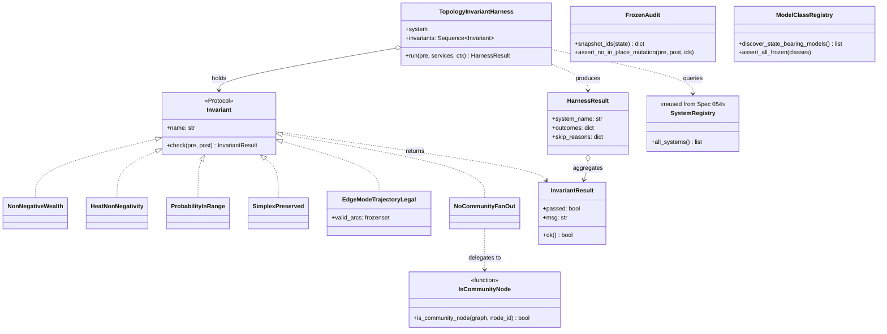

# Phase 1 Data Model: Topological Invariants

**Feature**: 055-topology-invariants
**Date**: 2026-05-06

This document enumerates the entities introduced by this feature, their
attributes, relationships, and validation rules. Test-only artifacts live
under `tests/property/`; the two new `Invariant` implementations live
under `src/babylon/engine/invariants.py`.

---

## §1. New `Invariant` implementations (production code)

These extend the existing `Invariant` Protocol and `InvariantResult`
dataclass in `src/babylon/engine/invariants.py`. They sit alongside
`NonNegativeWealth`, `HeatNonNegativity`, `ProbabilityInRange`, and
`SimplexPreserved`.

### 1.1 `EdgeModeTrajectoryLegal`

| Attribute | Type | Description |
|-----------|------|-------------|
| `name` (property) | `str` | `"edge_mode_trajectory_legal"` |
| `valid_arcs` (init arg) | `frozenset[tuple[EdgeMode, EdgeMode]]` | Set of legal arcs to check against; defaults to the live import of `_VALID_TRANSITIONS` from `babylon.engine.systems.edge_transition`. |

**Method**: `check(pre: WorldState, post: WorldState) -> InvariantResult`.

**Predicate**: For every edge in `post.relationships` (or in the post-graph
representation) that carries an `edge_mode` attribute:
- The pair `(pre_mode, post_mode)` is in `valid_arcs`, OR
- `pre_mode == post_mode` (trivial no-transition tick — implicitly legal).

The check looks up the matching pre-state edge by the `(source_id,
target_id, edge_type)` triple. Edges introduced or removed during the
tick are skipped (no arc to evaluate).

Additionally, for every edge in `post.relationships` that has an
`edge_mode`, the value MUST be a member of the `EdgeMode` enum (catches
malformed strings, `None`-equivalents, or stale values).

**Failure message format**: `f"Edge ({source_id} -> {target_id}, {edge_type}): "
f"illegal arc ({pre_mode} -> {post_mode}) — not in _VALID_TRANSITIONS "
f"and pre_mode != post_mode"`.

**Validation rule**: `valid_arcs` MUST be non-empty.

### 1.2 `NoCommunityFanOut`

| Attribute | Type | Description |
|-----------|------|-------------|
| `name` (property) | `str` | `"no_community_fan_out"` |

**Method**: `check(pre: WorldState, post: WorldState) -> InvariantResult`.

**Predicate**: For every `EdgeType.MEMBERSHIP` edge in the post-graph,
the source node's `_node_type` attribute is NOT `"community"`. The
implementation accesses the post-state's graph representation via
`post.to_graph()` (or directly walks `post.relationships` filtered by
`edge_type == EdgeType.MEMBERSHIP` and looks up the source's
`_node_type` from the corresponding node attributes).

**Failure message format**: `f"Community fan-out edge detected: "
f"({source_id} -> {target_id}, MEMBERSHIP) — source node "
f"_node_type='community'. Membership MUST live in the XGI hyperedge "
f"layer (Anti-Pattern VIII.9)."`

**Validation rule**: None (the predicate is parameterless).

---

## §2. Test harness modules (`tests/property/harness/`)

Spec 054's `harness/` directory is extended with three new modules. The
existing modules (`bound_harness`, `crisis_inspector`,
`probability_discovery`, `alpha_discovery`, `system_registry`) are
unchanged and reused.

### 2.1 `TopologyInvariantHarness`

Frozen dataclass that wraps a System (or System-pipeline) invocation and
applies a list of topology invariants to the (pre, post) pair.

| Attribute | Type | Description |
|-----------|------|-------------|
| `system` | `type[System] \| Callable[[WorldState, ServiceContainer, TickContext], WorldState]` | The System under test, or a pipeline runner. |
| `invariants` | `Sequence[Invariant]` | Invariants to check after the System runs. |
| `bypass_marker_attr` | `str` | Defaults to `"bypasses_topology_invariant"` — the ClassVar attribute name on the System class. |

**Method**: `run(pre: WorldState, services: ServiceContainer, ctx:
TickContext) -> HarnessResult`.

**Method**: `_filter_invariants() -> Sequence[Invariant]` — reads
`system.bypasses_topology_invariant` (if present) and returns the
invariants whose names are NOT in the marker dict's keys.

**Pattern reuse**: This is a near-duplicate of Spec 054's
`BoundInvariantHarness`; the only difference is the `bypass_marker_attr`
default. A future refactor could parameterize a single harness over
both marker namespaces; for clarity, this spec keeps them separate.

### 2.2 `HarnessResult` (re-exported from Spec 054)

The same `HarnessResult` shape from `bound_harness.py` is re-exported
from `topology_harness.py` so test files import from one place.

### 2.3 `is_community_node`

Stateless helper. Single function (not a class).

| Function | Signature | Description |
|----------|-----------|-------------|
| `is_community_node` | `(graph: nx.DiGraph[str], node_id: str) -> bool` | Returns `True` iff the node is marked as a community node via `graph.nodes[node_id].get("_node_type") == "community"`. Per research §3. Single source of truth for US2. |

**Validation rule**: For node IDs not present in the graph, returns
`False` (does not raise). Drives US2's linter.

### 2.4 `frozen_audit` module

Two functions that drive US3.

| Function | Signature | Description |
|----------|-----------|-------------|
| `snapshot_ids` | `(state: WorldState) -> dict[str, int]` | Walks every collection via Spec 054's `_iter_worldstate_collections` and returns a dict mapping entity ID to Python `id()`. |
| `assert_no_in_place_mutation` | `(pre_state: WorldState, post_state: WorldState, pre_ids: dict[str, int]) -> None` | For every entity ID present in both pre and post, raises `AssertionError` if `id(pre_entity) is id(post_entity) AND pre.model_dump() != post.model_dump()`. Per research §5. |

**Validation rule**: `snapshot_ids` MUST be called BEFORE any tick runs
(otherwise the pre-state ids are already invalidated). The harness
documentation notes this precondition explicitly.

### 2.5 `model_class_registry` module

Module-level helper.

| Function | Signature | Description |
|----------|-----------|-------------|
| `discover_state_bearing_models` | `() -> list[type[BaseModel]]` | Walks `babylon.models.entities` via `pkgutil.walk_packages` plus `babylon.models.world_state.WorldState` and yields every Pydantic `BaseModel` subclass. Cached on first call. Per research §4. |
| `assert_all_frozen` | `(classes: Sequence[type[BaseModel]]) -> None` | For each class, asserts `cls.model_config.get("frozen") is True` unless the class carries `bypasses_topology_invariant: ClassVar[dict[str, str]]` containing the `"frozen_discipline"` key. Skips with non-empty justification per FR-011. |

**Validation rule**: `len(discover_state_bearing_models()) >= 12` at the
time of writing (rough lower bound on state-bearing models — adding more
extends the count automatically). The exact count is recorded in
research §4 once empirically measured.

---

## §3. Test strategies (`tests/property/strategies/`)

### 3.1 `edge_mode_evidence_strategy`

`@composite` strategy returning a single evidence event payload as a
dict suitable for direct write to a graph node's `contradiction_fields` /
`field_derivatives` attributes:

```python
{
    "field": str,           # one of: exploitation, imperial_rent, immiseration
    "metric": str,          # one of: value, df_dt, d2f_dt2, laplacian
    "value": float,         # in [-10.0, 10.0], no NaN, no Infinity
    "scope": str,           # one of: source, target
}
```

Used by US1's synthesized branch.

### 3.2 `edge_mode_trajectory_strategy`

`@composite` strategy that draws a starting `EdgeMode` (uniformly from
the 5 enum values) plus a list of ≥ 10 evidence events from
`edge_mode_evidence_strategy()`. Returns a tuple `(starting_mode,
events)`. Used by US1's synthesized branch.

### 3.3 `worldstate_with_community_node_strategy`

`@composite` strategy returning a tuple `(WorldState, frozenset[str])`
where the second element is the set of node IDs that the consuming test
should mark with `_node_type == "community"` after calling
`state.to_graph()`. Mirrors the shape of Spec 053's
`worldstate_with_hexes_strategy` (which returns
`tuple[WorldState, HexGrid]`) — strategies that need to communicate
post-build graph hints return a tuple rather than mutating the frozen
`WorldState` itself.

Used by US2's linter test to ensure both legitimate
(organization → SocialClass) and illegitimate (community → entity)
MEMBERSHIP edges are exercisable. Community nodes are not yet
first-class `WorldState` collection items in the codebase, so the
marker injection happens at the graph-attribute layer via a tiny
test-side helper:

```python
def _inject_community_markers(
    graph: nx.DiGraph[str], community_node_ids: frozenset[str]
) -> None:
    """Tag the named nodes with _node_type='community' on the live graph."""
    for node_id in community_node_ids:
        if node_id in graph.nodes:
            graph.nodes[node_id]["_node_type"] = "community"
```

The helper lives in `tests/property/harness/topology_harness.py`
alongside `is_community_node` so the marker-injection rule and the
detection rule share a file. If a future schema change adds a
first-class `community_nodes` collection to `WorldState`, both helpers
become trivial and the strategy can return a bare `WorldState`; that
refactor is scoped out of this feature.

### 3.4 Extension to `primitives.py` — full-EdgeType `Relationship` strategy

`relationship_strategy` already samples `edge_type` from `EdgeType`. US4
acceptance scenario 3 requires the round-trip property to exercise *every*
legal `EdgeType`. The extension to `primitives.py` ensures this is the
case by adding a parameterized variant
`relationship_strategy(edge_types: Sequence[EdgeType] | None = None)`
with a default of all `EdgeType` values; US4 invokes it with the full
enum list and expects coverage.

---

## §4. Opt-out marker contract

The `bypasses_topology_invariant: ClassVar[dict[str, str]]` ClassVar is
added to a System (or a state-bearing model class) only when the harness
empirically detects a legitimate violation. The contract:

| Marker Key | Meaning |
|------------|---------|
| `"edge_mode_trajectory_legal"` | The System legitimately produces an arc not in `_VALID_TRANSITIONS` (e.g., a one-shot reset on initialization). |
| `"no_community_fan_out"` | The System legitimately writes a `MEMBERSHIP` edge from a community node (very rare; would suggest the codebase convention is shifting and the helper needs updating). |
| `"frozen_discipline"` | The model class legitimately is non-frozen (e.g., a value-object cache that is not part of game state). |

**Marker validation** (machine-enforced per FR-011 / SC-006): at test
collection time, the harness asserts `all(v.strip() for v in
marker.values())` for every marker. Empty justifications fail CI.

---

## §5. Relationships


