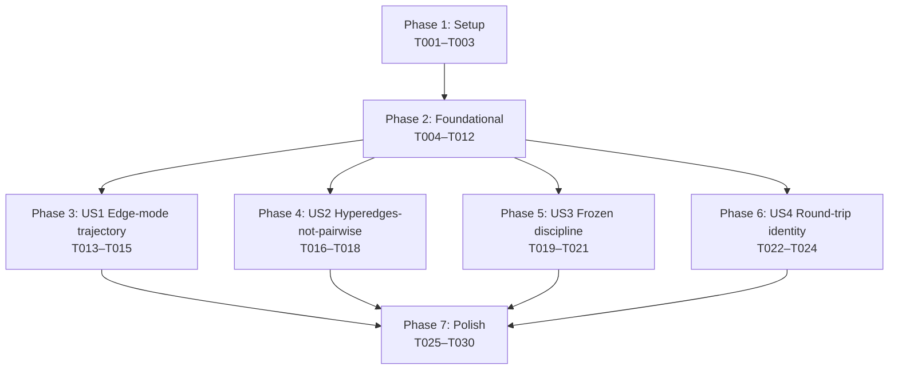

# Tasks: Topological Invariants — Property-Based Tests

**Input**: Design documents from `/specs/055-topology-invariants/`
**Prerequisites**: plan.md, spec.md, research.md, data-model.md, contracts/

**Tests note**: This feature *is* a test suite. Every implementation task
produces a Hypothesis property test, so the spec template's "tests vs.
implementation" split does not apply — implementation tasks ARE the tests.

**Organization**: Tasks are grouped by user story to enable independent
implementation. Phases 3–6 (US1–US4) can be worked in parallel after
Phase 2 completes; within each phase, tasks operating on the same file
are sequential.

## Format: `[ID] [P?] [Story] Description`

- **[P]**: Can run in parallel (different files, no incomplete dependencies)
- **[Story]**: User story label (US1, US2, US3, US4) — required for
  Phase 3+ tasks only

## Path Conventions

Single-project layout per `plan.md`:

- Production code: `src/babylon/engine/invariants.py` (the only file
  outside `tests/` and `src/babylon/models/world_state.py` touched by
  this feature; the latter only for the FR-010 named-constants refactor
  in T006)
- Test infrastructure: `tests/property/{harness,strategies,invariants}/`
- Profile registration: `tests/conftest.py` and `tests/property/conftest.py`
  (already present from Spec 053 / Spec 054; no changes needed)

---

## Phase 1: Setup (Shared Infrastructure)

**Purpose**: Confirm reusable Spec 053 / Spec 054 plumbing is present and
seed the four new test stubs.

- [X] T001 Verify Hypothesis `default` and `slow` profiles are registered project-wide in `tests/conftest.py` (no edit needed; halt if missing — Spec 053 added them, Spec 054 reuses them) and that `tests/property/conftest.py` registers `dev` / `ci` / `nightly` profiles plus the `service_container_fixture` and `tick_context_fixture` (Spec 053 T014b)
- [X] T002 Verify `tests/property/harness/` contains the modules from Spec 054 (`bound_harness.py`, `crisis_inspector.py`, `probability_discovery.py`, `alpha_discovery.py`, `system_registry.py`) plus `__init__.py` exporting the `tol(n, magnitude)` helper — no edit needed; halt if any are missing because Phase 2 imports from them
- [X] T003 [P] Create empty stub files `tests/property/invariants/test_edge_mode_trajectory.py`, `test_community_membership_lint.py`, `test_frozen_discipline.py`, `test_round_trip_identity.py`, each containing only the module docstring referencing the corresponding contract markdown file

**Checkpoint**: Setup complete — foundational phase can begin.

---

## Phase 2: Foundational (Blocking Prerequisites)

**Purpose**: Ship the two new `Invariant` implementations, the
`world_state.py` named-constants refactor, the three new harness
modules, and the three new / extended strategies. Every user story phase
depends on these.

**⚠️ CRITICAL**: No US1/US2/US3/US4 work can begin until Phase 2 completes.

### Production code (engine invariants + round-trip exclude refactor)

- [X] T004 Add `EdgeModeTrajectoryLegal` class to `src/babylon/engine/invariants.py` per `data-model.md §1.1` — implements `Invariant` Protocol; `name = "edge_mode_trajectory_legal"`; takes `valid_arcs: frozenset[tuple[EdgeMode, EdgeMode]]` defaulting to a live import of `_VALID_TRANSITIONS` from `babylon.engine.systems.edge_transition`; `check(pre, post)` walks every edge in `post.relationships` carrying an `edge_mode`, asserts `(pre_mode, post_mode) in valid_arcs OR pre_mode == post_mode`; failure msg names `(source_id, target_id, edge_type)` and the offending arc
- [X] T005 Add `NoCommunityFanOut` class to `src/babylon/engine/invariants.py` per `data-model.md §1.2` — implements `Invariant` Protocol; `name = "no_community_fan_out"`; `check(pre, post)` walks every `EdgeType.MEMBERSHIP` edge in the post-graph (via `post.to_graph()`); the production class inlines a private `_is_community_node_attr(node_attrs: dict) -> bool` helper that returns `node_attrs.get("_node_type") == "community"` directly. The test-side `is_community_node(graph, node_id)` helper (T007) and this production helper share the rule by convention, NOT by import — this avoids any production→test code dependency. Failure msg names the offending `(source_id, target_id, edge_type)` triple per FR-009. Depends on T004 (same file, sequential edit)
- [X] T006 Refactor `src/babylon/models/world_state.py` per `research.md §8` to expose the from_graph exclude rules as named module-level constants: `_SOCIAL_CLASS_COMPUTED_FIELDS: Final[frozenset[str]]` and `_TERRITORY_EXCLUDED_FIELDS: Final[frozenset[str]]` (lifted from the existing in-method literal sets in `from_graph`). The constants become the single source of truth for both production code AND the US4 round-trip property test (FR-010). Existing example tests in `tests/unit/models/test_graph_roundtrip.py` continue to pass with no test changes

### Harness modules

- [X] T007 [P] Create `tests/property/harness/topology_harness.py` per `data-model.md §2.1` and `§2.3` — defines (a) `is_community_node(graph: nx.DiGraph[str], node_id: str) -> bool` returning `True` iff `graph.nodes[node_id].get("_node_type") == "community"` (single source of truth per Q1 clarification + research §3), (b) `_inject_community_markers(graph: nx.DiGraph[str], community_node_ids: frozenset[str]) -> None` that sets `graph.nodes[node_id]["_node_type"] = "community"` for every present node ID — paired with `is_community_node` so injection and detection share a file (per data-model.md §3.3), (c) `TopologyInvariantHarness` frozen dataclass mirroring `BoundInvariantHarness` exactly with `bypass_marker_attr="bypasses_topology_invariant"` default, (d) re-export `HarnessResult` from `bound_harness.py` so test files import from one place; AT IMPORT TIME calls `from .system_registry import all_systems` and asserts `all(v.strip() for v in getattr(cls, "bypasses_topology_invariant", {}).values())` for every `cls in all_systems()` — machine-enforces SC-006 for System markers
- [X] T008 [P] Create `tests/property/harness/frozen_audit.py` per `data-model.md §2.4` and `research.md §5` — defines (a) `snapshot_ids(state: WorldState) -> dict[str, int]` that walks every collection via `_iter_worldstate_collections` from `babylon.engine.invariants` (Spec 054 helper, reused) and returns `{entity_id: id(entity)}`, (b) `assert_no_in_place_mutation(pre_state, post_state, pre_ids) -> None` that for every shared entity ID asserts `NOT (id(pre_entity) is id(post_entity) AND pre.model_dump() != post.model_dump())`, raising `AssertionError` with entity ID + class name + field-level diff on violation
- [X] T009 [P] Create `tests/property/harness/model_class_registry.py` per `data-model.md §2.5` and `research.md §4` — defines (a) `discover_state_bearing_models() -> list[type[BaseModel]]` via `pkgutil.walk_packages(babylon.models.entities.__path__, ...)` plus `WorldState`, returning every `BaseModel` subclass declared in those modules, cached on first call; (b) `assert_all_frozen(classes: Sequence[type[BaseModel]]) -> None` that for each class asserts `cls.model_config.get("frozen") is True` UNLESS the class carries `bypasses_topology_invariant` containing the `"frozen_discipline"` key (with non-empty justification per FR-011); (c) AT IMPORT TIME asserts `len(discover_state_bearing_models()) >= 12` so empty discovery is a hard failure not a silent vacuum

### Test strategies

- [X] T010 [P] Create `tests/property/strategies/edge_mode_evidence.py` per `data-model.md §3.1` and `§3.2` — exports (a) `evidence_event_strategy()` `@composite` strategy returning dicts `{"field": str, "metric": str, "value": float, "scope": str}` with values drawn from `st.sampled_from(["exploitation", "imperial_rent", "immiseration"])`, `st.sampled_from(["value", "df_dt", "d2f_dt2", "laplacian"])`, `st.floats(min_value=-10.0, max_value=10.0, allow_nan=False, allow_infinity=False)`, and `st.sampled_from(["source", "target"])` respectively per `research.md §2`; (b) `edge_mode_trajectory_strategy()` `@composite` returning `(starting_mode: EdgeMode, events: list[dict])` tuples where `starting_mode` is drawn uniformly from the 5 `EdgeMode` enum values and `events` has length 10–20 (FR-003 requires ≥ 10; the upper bound widens falsification coverage at near-zero runtime cost)
- [X] T011 [P] Extend `tests/property/strategies/worldstate.py` (which already exports the base `worldstate_strategy()` and Spec 053 / Spec 054 wrappers) with `worldstate_with_community_node_strategy() -> SearchStrategy[tuple[WorldState, frozenset[str]]]` per `data-model.md §3.3` — wraps `worldstate_strategy(min_entities=2)`, draws a non-empty subset of the generated entity IDs to flag as community nodes, and returns `(state, frozenset(community_node_ids))`. The marker injection itself happens at test time via `_inject_community_markers(graph, community_node_ids)` from `tests/property/harness/topology_harness.py` (T007). Mirrors the tuple-return shape of Spec 053's `worldstate_with_hexes_strategy(...) -> tuple[WorldState, HexGrid]`
- [X] T012 [P] Extend `tests/property/strategies/primitives.py` per `data-model.md §3.4` — add `edge_types: Sequence[EdgeType] | None = None` parameter to `relationship_strategy()` (defaults to `list(EdgeType)` for backward compat); when caller passes an explicit list, the strategy only samples from those edge types. Used by US4 Predicate C to drive every legal `EdgeType` through the round-trip

**Checkpoint**: Foundation ready — all four user stories can now begin in parallel.

---

## Phase 3: User Story 1 — Edge-mode trajectory legality (Priority: P1) 🎯 MVP

**Goal**: Falsify any edge-mode arc not in `_VALID_TRANSITIONS` across
arbitrary evidence-event sequences (synthesized) and via real
`SimulationEngine.run_tick` (observed).

**Independent Test**: `poetry run pytest tests/property/invariants/test_edge_mode_trajectory.py -v`
should produce ≥ 2 parametrized test runs covering the synthesized
sweep across all 5 starting `EdgeMode` values plus the observed
end-to-end pipeline run; all pass on default profile within 15 s. A
regression that introduces an illegal arc (e.g., direct
`EXTRACTIVE → SOLIDARISTIC`) produces a Hypothesis-shrunk failing
trajectory naming the offending arc and the events that produced it.

### Implementation

- [ ] T013 [US1] Create test-local helpers in `tests/property/invariants/test_edge_mode_trajectory.py`: `_build_two_node_graph(starting_mode: EdgeMode) -> nx.DiGraph[str]` (constructs a 2-node graph with one edge carrying the starting `edge_mode`, both nodes seeded with empty `contradiction_fields` and `field_derivatives` dicts), `_apply_event_to_graph(graph, event: dict) -> None` (writes the event's `(field, metric, value)` into the appropriate node's `contradiction_fields[field]` for `metric == "value"` or `field_derivatives[field][metric]` otherwise, scoped to source/target per `event["scope"]`), `_read_edge_mode(graph) -> EdgeMode` (reads the single edge's `edge_mode` attribute and constructs `EdgeMode(value)` — raises `ValueError` on malformed input), and `_capture_edge_modes(graph) -> dict[tuple[str, str, str], EdgeMode]` (multi-edge variant that returns `{(source, target, edge_type): EdgeMode(value)}` for every edge carrying an `edge_mode`). All four helpers construct `EdgeMode(value)` so Predicate C (final mode is a legal enum value) is operationalized at every read site rather than as a separate test
- [ ] T014 [US1] Implement Predicate A in `tests/property/invariants/test_edge_mode_trajectory.py` per `contracts/edge_mode_trajectory.md §Predicate A` — `test_synthesized_trajectory_is_legal` parametrized over `edge_mode_trajectory_strategy()` (T010); for each `(starting_mode, events)`, calls `_build_two_node_graph(starting_mode)` (T013), instantiates `EdgeTransitionSystem`, iterates `events`: each iteration calls `_apply_event_to_graph(graph, event)` (T013) then `system.step(graph, services_fixture, ctx_fixture)` then `_read_edge_mode(graph)` (T013) to capture the trajectory; pairwise-asserts every consecutive `(prev, cur)` is in `_VALID_TRANSITIONS` or equal (trivial no-transition); asserts `modes_observed[-1] in EdgeMode`; counts trivial vs persistence transitions separately per FR-012
- [ ] T015 [US1] Implement Predicate B in `tests/property/invariants/test_edge_mode_trajectory.py` per `contracts/edge_mode_trajectory.md §Predicate B` — `test_observed_trajectory_is_legal` uses `worldstate_strategy(min_entities=2, max_relationships=4)` from existing strategies; runs 5 consecutive ticks via real `SimulationEngine.run_tick` with all 21 Systems; per tick calls `_capture_edge_modes(graph)` (T013) to capture the edge-mode dict; for every edge present in both pre and post, asserts arc legality. `max_examples=20, derandomize=True` because the observed branch is heavier than synthesized

**Checkpoint**: US1 fully functional and independently testable. The MVP
slice is shippable from this point.

---

## Phase 4: User Story 2 — Hyperedges-not-pairwise lint (Priority: P1)

**Goal**: Falsify any `EdgeType.MEMBERSHIP` edge whose source is a
community node (Anti-Pattern VIII.9 violation).

**Independent Test**: `poetry run pytest tests/property/invariants/test_community_membership_lint.py -v`
should produce ≥ 3 test runs covering the post-pipeline linter, the
membership-count delta check, and the seeded-violation negative test;
all pass on default profile. A regression that wires up a
community-fan-out `MEMBERSHIP` edge produces a Hypothesis-shrunk failure
naming the offending `(community_id, member_id)` pair and the
`_node_type` value of the source.

### Implementation

- [ ] T016 [US2] Implement Predicate A in `tests/property/invariants/test_community_membership_lint.py` per `contracts/community_membership_lint.md §Predicate A` — `test_no_community_fan_out_post_pipeline` unpacks `(state, community_node_ids)` from `worldstate_with_community_node_strategy()` (T011); converts to graph via `state.to_graph()`; injects markers via `_inject_community_markers(graph, community_node_ids)` (T007); runs full `SimulationEngine.run_tick` with all 21 Systems on the marked graph; rebuilds `post_state = WorldState.from_graph(graph, tick=...)`; applies `NoCommunityFanOut().check(state, post_state)` and asserts `result.ok`; failure msg surfaces the offending triple per FR-004
- [ ] T017 [US2] Implement Predicate B in `tests/property/invariants/test_community_membership_lint.py` per `contracts/community_membership_lint.md §Predicate B` — `test_membership_count_delta_is_legitimate_only` follows the same setup as T016 (unpack tuple, inject markers); defines a small `_count_membership_edges(graph, exclude_community_sources: bool) -> int` helper using `is_community_node` (T007); asserts `post_membership_count - post_legitimate_count == 0` (zero illegitimate community-fan-out edges in any post-state)
- [ ] T018 [US2] Implement Predicate C in `tests/property/invariants/test_community_membership_lint.py` per `contracts/community_membership_lint.md §Predicate C` — `test_seeded_community_fan_out_is_detected` is a non-Hypothesis negative test that hand-builds a `WorldState` with a known entity ID, runs `state.to_graph()`, calls `_inject_community_markers(graph, frozenset(["COMM_001"]))` (T007), deliberately seeds a `(COMM_001 -> C001, MEMBERSHIP)` edge directly on the graph, rebuilds `post_state` and runs `NoCommunityFanOut().check(...)`; asserts `not result.ok` AND the failure message names `COMM_001` and `MEMBERSHIP`. This is the "linter actually catches the thing" smoke test

**Checkpoint**: US2 fully functional and independently testable.

---

## Phase 5: User Story 3 — Frozen Pydantic discipline (Priority: P2)

**Goal**: Falsify any in-place mutation of a state-bearing Pydantic model
during a tick (runtime check) AND any state-bearing model class missing
`frozen=True` (static check).

**Independent Test**: `poetry run pytest tests/property/invariants/test_frozen_discipline.py -v`
should produce one parametrized test per state-bearing model class
(Layer 1, ≥ 12 cases) plus the per-tick identity check (Layer 2) plus
the seeded-violation negative test (Layer 3); all pass on default
profile. A regression that drops `frozen=True` from a model produces a
Layer 1 failure at collection time naming the class; a regression that
mutates an entity in-place during a tick produces a Layer 2 failure
naming entity ID + class + field diff.

### Implementation

- [ ] T019 [US3] Implement Predicate A (Layer 1 — static frozen audit) in `tests/property/invariants/test_frozen_discipline.py` per `contracts/frozen_discipline.md §Predicate A` — `test_state_bearing_model_is_frozen` parametrized over `discover_state_bearing_models()` (T009); per class delegates the assertion to `assert_all_frozen([model_cls])` from T009 (one-class invocation per parametrize case so failures isolate to the single offending class); the helper internally honors the `bypasses_topology_invariant: ClassVar[dict[str, str]]` opt-out marker and asserts non-empty justification per FR-011. Produces one PASSED / SKIPPED row per discovered class. Centralizing the bypass-marker logic in `assert_all_frozen()` (rather than inlining it in the test) prevents future drift between the registry and the test
- [ ] T020 [US3] Implement Predicate B (Layer 2 — per-tick identity check) in `tests/property/invariants/test_frozen_discipline.py` per `contracts/frozen_discipline.md §Predicate B` — `test_no_in_place_mutation_per_tick` uses `worldstate_strategy(min_entities=1, min_territories=1)`; calls `snapshot_ids(pre_state)` (T008) BEFORE running `SimulationEngine.run_tick`; runs the full 21-System pipeline; calls `assert_no_in_place_mutation(pre_state, post_state, pre_ids)` (T008) which raises on `id(pre) is id(post) AND pre.model_dump() != post.model_dump()`. `suppress_health_check=[HealthCheck.too_slow, HealthCheck.function_scoped_fixture]` per Spec 054 fixture pattern
- [ ] T021 [US3] Implement Predicate C (Layer 3 — seeded violation) in `tests/property/invariants/test_frozen_discipline.py` per `contracts/frozen_discipline.md §Predicate C` — `test_seeded_dunder_bypass_is_detected` builds a minimal `WorldState`, snapshots ids, simulates an in-place mutation by hand (the realistic dunder-bypass shape), then runs `assert_no_in_place_mutation` and asserts it raises `AssertionError` with `"In-place mutation detected"` in the message. This is the negative test that proves the harness actually catches what it's supposed to

**Checkpoint**: US3 fully functional and independently testable.

---

## Phase 6: User Story 4 — WorldState round-trip as a property (Priority: P3)

**Goal**: Falsify any field that fails the
`from_graph(to_graph(state))` round-trip across the input space of
valid `WorldState` shapes.

**Independent Test**: `poetry run pytest tests/property/invariants/test_round_trip_identity.py -v`
produces 3 test runs (default-size round-trip, max-size round-trip,
every-EdgeType round-trip); all pass on default profile within 5 s. A
regression that adds a new `SocialClass` field without updating
`to_graph` / `from_graph` produces a failure showing the diff between
pre and post `model_dump()`.

### Implementation

- [ ] T022 [US4] Implement Predicate A in `tests/property/invariants/test_round_trip_identity.py` per `contracts/round_trip_identity.md §Predicate A` — `test_round_trip_preserves_model_dump` uses `worldstate_strategy()` from the existing strategies module; calls `WorldState.from_graph(state.to_graph(), tick=state.tick)`; defines a small `_build_exclude_set_from_production() -> set[str]` helper that imports `_SOCIAL_CLASS_COMPUTED_FIELDS` and `_TERRITORY_EXCLUDED_FIELDS` from `babylon.models.world_state` (refactor done in T006), assembles a Pydantic v2-compatible nested-field-path exclude set, and includes `"tick"`; asserts `restored.model_dump(exclude=exclude) == state.model_dump(exclude=exclude)` per FR-010
- [ ] T023 [US4] Implement Predicate B in `tests/property/invariants/test_round_trip_identity.py` per `contracts/round_trip_identity.md §Predicate B` — `test_round_trip_at_max_size` uses `worldstate_strategy(max_entities=8, max_relationships=8)` per `research.md §7`; reuses `_build_exclude_set_from_production()` from T022; `max_examples=50, derandomize=True, deadline=2000` (2s per example); confirms larger states still preserve `model_dump` equality within budget
- [ ] T024 [US4] Implement Predicate C in `tests/property/invariants/test_round_trip_identity.py` per `contracts/round_trip_identity.md §Predicate C` — `test_round_trip_preserves_every_edge_type` uses a small `_build_state_with_one_edge_per_type(edge_types=list(EdgeType))` helper that constructs a `WorldState` with at least one `Relationship` of every legal `EdgeType` (uses the extended `relationship_strategy(edge_types=...)` from T012 indirectly via fixed construction); round-trips and asserts both edge-type set equality AND per-edge field-level equality

**Checkpoint**: US4 fully functional and independently testable. All
four user stories now ship together.

---

## Phase 7: Polish & Cross-Cutting Concerns

**Purpose**: Verify perf budgets, add opt-out markers if empirically
needed, confirm docs and lint hygiene, prepare the merge to dev.

- [ ] T025 [P] Run `poetry run pytest tests/property/invariants/test_edge_mode_trajectory.py tests/property/invariants/test_community_membership_lint.py tests/property/invariants/test_frozen_discipline.py tests/property/invariants/test_round_trip_identity.py -v` and confirm the four topology suites complete in ≤ 60 s on default profile per SC-005; record actual wall-clock in `quickstart.md` "## Run the suite" block. Additionally confirm the combined `tests/property/` suite (Spec 053 + 054 + 055) stays under the 3-minute SC-005 cap
- [ ] T026 [P] Run `HYPOTHESIS_PROFILE=slow poetry run pytest tests/property/invariants/test_edge_mode_trajectory.py tests/property/invariants/test_community_membership_lint.py tests/property/invariants/test_frozen_discipline.py tests/property/invariants/test_round_trip_identity.py -v` and confirm completion in ≤ 5 min per SC-005
- [ ] T027 Triage failures surfaced by the T025 default-profile run: for any System or model class that the harness empirically demonstrates legitimately violates a topology predicate (i.e., the violation is the *correct* structural behavior and the test is falsely accusing it), add a `bypasses_topology_invariant: ClassVar[dict[str, str]] = {"<predicate_name>": "<one-sentence justification>"}` marker to that class. Commit each marker addition as a separate small commit so the marker rationale is greppable. Default-deny — most Systems / models will need no marker. (Genuine bugs surfaced by T025 — a missing `frozen=True`, an illegal arc, a community fan-out — are fixed in the offending code, not papered over with markers.)
- [ ] T028 Run `poetry run pre-commit run --all-files` on all changed files; resolve any markdownlint, mypy, or ruff issues introduced by Phase 2–6 work
- [ ] T029 Update `ai-docs/state.yaml` test counts to reflect the +N tests added (count via `poetry run pytest tests/property/invariants/test_edge_mode_trajectory.py tests/property/invariants/test_community_membership_lint.py tests/property/invariants/test_frozen_discipline.py tests/property/invariants/test_round_trip_identity.py --collect-only -q | tail -3`)
- [ ] T030 Confirm branch state is ready for PR to `dev` — `git log dev..055-topology-invariants --oneline` shows clean conventional-commit messages (spec, clarify, plan, tasks, Phase 1+2, Phase 3-7). The `gh pr create` invocation requires explicit user authorization per `babylon/CLAUDE.md` shared-state policy and is therefore deferred to the user

---

## Dependencies



**User stories are independent** — once Phase 2 ships, US1, US2, US3,
and US4 can be developed in parallel by separate contributors. Each
story's test file is a standalone deliverable.

**Cross-phase data dependency**: T022 (US4 Predicate A) depends on T006
(world_state.py named-constants refactor). T020 (US3 Predicate B)
depends on `_iter_worldstate_collections` from Spec 054 (already
shipped). All US2 and US3 full-pipeline tasks (T016–T018, T020) reuse
`system_registry.all_systems()` from Spec 054 (already shipped).

---

## Parallel Execution Examples

### Phase 2 — six tasks in parallel

T007, T008, T009, T010, T011, T012 all touch different files and have no
inter-task dependencies. T004 + T005 are sequential (same file). T006
(world_state.py refactor) is independent of all the above.

```bash
# Wave 1 (parallel): T004, T006, T007, T008, T009, T010, T011, T012
# Wave 2 (sequential after T004 completes): T005
```

### Phase 3–6 — four user stories in parallel

```bash
# After Phase 2 completes:
# Branch developer A picks T013–T015 (US1)
# Branch developer B picks T016–T018 (US2)
# Branch developer C picks T019–T021 (US3)
# Branch developer D picks T022–T024 (US4)
# All four ship to 055-topology-invariants and integrate at Phase 7.
```

### Phase 7 — two parallel verifications

T025 (default profile timing) and T026 (slow profile timing) are
read-only and can run in parallel from the same machine in different
terminals.

---

## Implementation Strategy

### MVP scope (US1 + US2 — both P1)

- Ship Phases 1, 2, 3, 4, and 7
- Skip Phases 5, 6 in the first PR
- Result: edge-mode state machine guard + hyperedges-not-pairwise lint
  ship together (both P1) — the two highest-blast-radius topology
  invariants land first
- Total tasks for MVP: 3 (setup) + 9 (foundational) + 3 (US1) + 3 (US2)
  + 6 (polish) = **24 tasks**

### Incremental delivery

| Increment | Adds | Cumulative tasks |
|-----------|------|------------------|
| MVP (US1 + US2) | Edge-mode state machine + community fan-out lint | 24 |
| +US3 | Frozen Pydantic discipline | 27 |
| +US4 | Round-trip identity property | 30 |

Each increment is a complete, shippable PR. The 30-task total matches
the 4-invariant scope plus mandatory polish.

### Why US1 + US2 ship together as MVP (deviation from Spec 054 single-story MVP)

Spec 054's MVP was just US1 (Probability bounds) because that was the
only P1 story. Spec 055 has two P1 stories — US1 (Edge-mode trajectory)
and US2 (Hyperedges-not-pairwise) — that are independently scoped but
both load-bearing for the dialectical-field topology. Shipping US1
without US2 would leave Anti-Pattern VIII.9 unprotected; shipping US2
without US1 would leave the state machine unprotected. The two are
peers and the MVP increment covers both.

### Anti-patterns to avoid

- **Do not** add `bypasses_topology_invariant` markers preemptively (T027
  is a *post-discovery* task, not a planning task). Default-deny means
  the absence of a marker is the contract; markers exist only to
  document empirically discovered legitimate violations.
- **Do not** duplicate `_VALID_TRANSITIONS` in the test (T013) —
  importing from `edge_transition.py` is the contract. Any
  arc-set drift between production and test is a bug.
- **Do not** hardcode community-node detection inline anywhere. The
  single helper `is_community_node()` in `topology_harness.py` (T007) is
  the only place the rule lives.
- **Do not** skip the T006 refactor of `world_state.py`. Reading the
  exclude-set from production is a hard FR-010 requirement; hardcoding
  the set in the test would silently lose coverage when production adds
  a new computed field.

---

## Validation: All Tasks Follow Required Format

Every task above:

- ✅ starts with `- [ ]` markdown checkbox
- ✅ has a sequential `T###` ID
- ✅ includes `[P]` only where parallelizable
- ✅ includes `[US1]`/`[US2]`/`[US3]`/`[US4]` only in Phase 3+
- ✅ names a concrete file path
- ✅ references the spec FR / contract section / data-model entity that
  pins its acceptance criteria

Total: **30 tasks** across **7 phases**.
