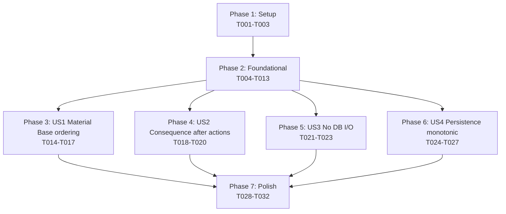

# Tasks: Causal/Temporal Invariants — Property-Based Tests

**Input**: Design documents from `/specs/056-causal-invariants/`
**Prerequisites**: plan.md, spec.md, research.md, data-model.md, contracts/

**Tests note**: This feature *is* a test suite. Every implementation task
produces a Hypothesis property test, so the spec template's "tests vs.
implementation" split does not apply — implementation tasks ARE the tests.

**Organization**: Tasks are grouped by user story to enable independent
implementation. Phases 3–6 (US1–US4) can be worked in parallel after
Phase 2 completes; within each phase, tasks operating on the same file
are sequential.

## Format: `[ID] [P?] [Story] Description`

- **[P]**: Can run in parallel (different files, no incomplete dependencies)
- **[Story]**: User story label (US1, US2, US3, US4) — required for
  Phase 3+ tasks only

## Path Conventions

Single-project layout per `plan.md`:

- Production code: `src/babylon/engine/simulation_engine.py` (partition
  constants + import-time assertion); `src/babylon/persistence/protocols.py`
  (`MonotonicityViolationError`); `src/babylon/persistence/runtime_db.py`
  + `src/babylon/persistence/postgres_runtime.py` (overwrite detection)
- Test infrastructure: `tests/property/{harness,strategies,invariants}/`
- Profile registration: `tests/conftest.py` and `tests/property/conftest.py`
  (already present from Spec 053 / 054 / 055; no changes needed)

---

## Phase 1: Setup (Shared Infrastructure)

**Purpose**: Confirm reusable Spec 053 / 054 / 055 plumbing is present
and seed the four new test stubs.

- [X] T001 Verify Hypothesis `default` and `slow` profiles are registered project-wide in `tests/conftest.py` (no edit needed; halt if missing — Spec 053 added them, Spec 054 / 055 reuse them) and that `tests/property/conftest.py` registers `dev` / `ci` / `nightly` profiles plus the `service_container_fixture` and `tick_context_fixture` (Spec 053 T014b)
- [X] T002 Verify `tests/property/harness/` contains the modules from Spec 054 / 055 (`bound_harness.py`, `topology_harness.py`, `frozen_audit.py`, `model_class_registry.py`, `system_registry.py`) plus `__init__.py` exporting the `tol(n, magnitude)` helper and Spec 055 re-exports — no edit needed; halt if any are missing because Phase 2 imports from them
- [X] T003 [P] Create empty stub files `tests/property/invariants/test_material_base_ordering.py`, `test_consequence_after_actions.py`, `test_no_db_io_during_tick.py`, `test_tick_persistence_monotonic.py`, each containing only the module docstring referencing the corresponding contract markdown file under `specs/056-causal-invariants/contracts/`

**Checkpoint**: Setup complete — foundational phase can begin.

---

## Phase 2: Foundational (Blocking Prerequisites)

**Purpose**: Ship the three new System-classification constants and
import-time partition assertion in `simulation_engine.py` (plus the
F6=α `_DEFAULT_SYSTEMS` reorder), the `MonotonicityViolationError`
exception + monotonic-idempotent contract refinement on
`RuntimePersistence.persist_tick`, the same-payload-vs-different
detection in both `RuntimeDatabase` and `PostgresRuntime`, the
`OODASystem._resolve_for_organization` helper extraction, the four
new harness modules, and the new `multi_tick_sequence_strategy`.
Every user story phase depends on these.

**⚠️ CRITICAL**: No US1/US2/US3/US4 work can begin until Phase 2 completes.

### Production code (System partition + persistence contract)

- [X] T004 (a) Add three module-level `Final[frozenset[type[System]]]` constants to `src/babylon/engine/simulation_engine.py` per `data-model.md §1.1` and `research.md §1` — declared immediately after `_DEFAULT_SYSTEMS`: `MATERIAL_BASE_SYSTEMS = frozenset({VitalitySystem, TerritorySystem, ProductionSystem, TickDynamicsSystem, ReserveArmySystem, CommunitySystem, LifecycleSystem, SolidaritySystem, ImperialRentSystem, DispossessionEventSystem, DecompositionSystem, ControlRatioSystem, MetabolismSystem})`, `ACTION_PHASE_SYSTEMS = frozenset({OODASystem})`, `CONSEQUENCE_SYSTEMS = frozenset({SurvivalSystem, StruggleSystem, ConsciousnessSystem, ContradictionSystem, ContradictionFieldSystem, FieldDerivativeSystem, EdgeTransitionSystem})`. Add `from typing import Final` if not already present. (b) **REORDER `_DEFAULT_SYSTEMS`** per F6=α: move `OODASystem()` from position 21 (current end of list) to position 14 — immediately after `MetabolismSystem()` at line 197 and immediately before `SurvivalSystem()` (now position 15). Also remove the `# OODA Loop System (Feature 032)` comment block at line 206 and add a corresponding `# Action Phase (Feature 056) — between Material Base and Consequences per ADR032` comment at the new position. Audit existing tests for OODA-position assumptions (run `grep -rn "OODASystem\|ooda" tests/ | grep -i "position\|order\|index\|last"`) before committing the reorder; remediate any failures inline. (c) Update the module docstring (lines 14-26) to renumber the materialist causality turn order so OODA is documented at position 14 (currently absent from the list)
- [X] T005 Add import-time partition assertion to `src/babylon/engine/simulation_engine.py` immediately after the three constants from T004 per `research.md §1` — assert `MATERIAL_BASE_SYSTEMS | ACTION_PHASE_SYSTEMS | CONSEQUENCE_SYSTEMS == frozenset(type(s) for s in _DEFAULT_SYSTEMS)` with diagnostic message naming the symmetric-difference, plus three pairwise `isdisjoint` assertions. Failure mode: `AssertionError` at module import — caught by next test collection. Depends on T004 (same file, sequential edit)
- [X] T006 Add `MonotonicityViolationError` exception class to `src/babylon/persistence/protocols.py` per `data-model.md §1.2` — subclasses `Exception`, `__init__(self, tick: int, existing_payload: dict | None = None, attempted_payload: dict | None = None)` stores all three on `self`, `super().__init__(f"Cannot overwrite already-persisted tick {tick} with different payload (use identical payload for idempotent retry)")`. **Refine** the `RuntimePersistence.persist_tick` Protocol method docstring per `data-model.md §1.3` (NOT `write_state` — that was a placeholder pre-verification): replace the existing "Idempotent via UPSERT semantics" line with the monotonic-idempotent contract — same-payload re-persist succeeds silently; different-payload re-persist raises `MonotonicityViolationError`. Re-export `MonotonicityViolationError` from `src/babylon/persistence/__init__.py` if that module re-exports the protocol
- [X] T007 Add monotonic-idempotent check to `RuntimeDatabase.persist_tick` in `src/babylon/persistence/runtime_db.py` per `data-model.md §5.3` and `research.md §5` — compute `new_payload = self._serialize(graph, events)` (or equivalent canonical form), then `if (session_id, tick) in self._states: existing = self._states[(session_id, tick)]; if existing == new_payload: return; raise MonotonicityViolationError(tick=tick, existing_payload=existing, attempted_payload=new_payload)` BEFORE performing the write. Import `MonotonicityViolationError` from `babylon.persistence.protocols`. Audit any existing in-tree tests that re-persist the same `(session_id, tick)` with a different payload and confirm none rely on silent-overwrite semantics (expected count: 0 per data-model.md §5.3 and the audit table in §1.3)
- [X] T008 Add monotonic-idempotent check to `PostgresRuntime.persist_tick` in `src/babylon/persistence/postgres_runtime.py` per `data-model.md §5.4` and `research.md §5` — wrap the INSERT in `try / except psycopg.errors.UniqueViolation`: on UniqueViolation, perform `existing = cursor.execute(SELECT_SQL, (session_id, tick)).fetchone()`, compare against `new_payload`, and either `return` silently (same) or `raise MonotonicityViolationError(tick=tick, existing_payload=existing, attempted_payload=new_payload) from e` (different). Add an Alembic / SQL migration script under the project's migrations directory that adds `ALTER TABLE <runtime_state_table> ADD CONSTRAINT uq_runtime_state_session_tick UNIQUE (session_id, tick);` — discover the existing migrations layout via `ls src/babylon/persistence/migrations/ 2>/dev/null || ls src/babylon/persistence/schema*.py 2>/dev/null` before writing; if no migrations directory exists, add the constraint inline in the schema-creation code. Run a dedup pre-check on existing rows; abort with a clear diagnostic if duplicates exist (none expected). Local devs run via existing `mise run web:migrate`; CI integration tests use transient databases per `research.md §5`. Depends on T006 (imports `MonotonicityViolationError`)

### Harness modules

- [X] T009 [P] Create `tests/property/harness/causal_harness.py` per `data-model.md §2.1` and `§2.4` — defines (a) frozen `SystemCallEvent` dataclass `(system_class_name: str, call_index: int, monotonic_timestamp_ns: int)`, (b) frozen `OrganizationActionEvent` dataclass `(organization_id: str, action_resolution_index: int, monotonic_timestamp_ns: int)`, (c) frozen `TickTrace` dataclass with `system_calls: tuple[SystemCallEvent, ...]` and `org_actions: tuple[OrganizationActionEvent, ...]` (no helper methods — tests use inline comprehensions per C2 finding), (d) re-exports of `SystemCallSpy` (T010), `OrganizationActionSpy` (T011), `no_db_io_during_tick` + `DBIONotPermittedError` (T012). **No `CausalInvariantHarness` runner class** — dropped per C1 finding (YAGNI; tests use spy + context-manager primitives directly, matching Spec 055's `TopologyInvariantHarness` light-touch usage). AT IMPORT TIME calls `from .system_registry import all_systems` and asserts `all(v.strip() for v in getattr(cls, "bypasses_causal_invariant", {}).values())` for every `cls in all_systems()` — machine-enforces SC-006 for System markers
- [X] T010 [P] Create `tests/property/harness/system_call_spy.py` per `data-model.md §2.2` and `research.md §3` — defines `SystemCallSpy` context manager that takes a `SimulationEngine` in `__init__`, on `__enter__` wraps each `system.step` method on the engine's `_systems` list with a closure that records `SystemCallEvent(type(system).__name__, call_index_counter, time.monotonic_ns())` to `self.events: list[SystemCallEvent]` then forwards `*args, **kwargs` and returns the original return value (FR-003), on `__exit__` restores originals and asserts `events` timestamps are strictly monotonic (sanity check). Spy is observably non-interfering — only side-effect is appending to `events`
- [X] T011 [US2-prep / production refactor] Extract `_resolve_for_organization(self, graph, services, context, org_id, org_data) -> None` private helper method on `OODASystem` in `src/babylon/engine/systems/ooda.py` per `research.md §2` (revised) and `data-model.md §5.5` — lift the per-organization loop body currently inlined inside `step` (after `_collect_org_nodes(graph)` at line ~79) into the new method; the loop becomes `for org_id, org_data in org_nodes[:max_orgs]: self._resolve_for_organization(graph, services, context, org_id, org_data)`. Behavior-preserving refactor; behavior-equivalence verified by running the existing `tests/unit/engine/systems/test_ooda*.py` suite before and after. The `_collect_org_nodes` module-level helper at line 198 is unchanged. THEN create `tests/property/harness/org_action_spy.py` per `data-model.md §2.3` — defines `OrganizationActionSpy` context manager that uses `unittest.mock.patch.object(OODASystem, "_resolve_for_organization", new=wrapped)` where `wrapped` is a closure that records `OrganizationActionEvent(org_id, action_resolution_index_counter, time.monotonic_ns())` to `self.events: list[OrganizationActionEvent]` BEFORE calling the original (saved as `OODASystem._resolve_for_organization` via `mock.DEFAULT` or stored reference). Module docstring records the named-method seam dependency
- [X] T012 [P] Create `tests/property/harness/no_db_io_during_tick.py` per `data-model.md §2.5` and `research.md §4` — defines (a) `DBIONotPermittedError(Exception)` with `__init__(surface: str, attribute: str)` storing both, (b) `@contextmanager` function `no_db_io_during_tick(services: ServiceContainer)` that uses `dataclasses.fields(services)` to enumerate fields, identifies DB-bearing fields by declared type (`DatabaseConnection`, `RuntimePersistence` Protocol) OR by name regex `(?i).*(database|persistence|runtime|store).*`, replaces each non-None field with a sentinel object whose `__getattr__` raises `DBIONotPermittedError(field_name, attr_name)`, restores originals on exit (including exception path via `try/finally`). Skip `metrics`, `event_bus`, `formula_registry`, `config` per the surface inventory in `research.md §4`

### Test strategies

- [X] T013 [P] Create `tests/property/strategies/multi_tick_sequence.py` per `data-model.md §2.6` and `research.md §7` — exports `multi_tick_sequence_strategy(*, n_ticks: int = 5) -> SearchStrategy[list[tuple[int, dict]]]` `@composite` strategy. Each payload is a small Pydantic-serializable dict with at least one distinguishing field (e.g., `{"tick": N, "marker": st.text(min_size=1, max_size=10)}`) so reads after failed overwrites are distinguishable. Payloads need NOT be valid `WorldState` snapshots — US4 tests the persistence contract not engine semantics. Also export a sibling helper `same_payload_pair_strategy() -> SearchStrategy[tuple[int, dict, dict]]` returning `(tick, original_payload, retry_payload)` tuples where `retry_payload == original_payload` (deep-equal, used by US4 Predicate B' idempotent-retry test) and a `different_payload_pair_strategy() -> SearchStrategy[tuple[int, dict, dict]]` returning tuples where `retry_payload != original_payload` (used by US4 Predicate B different-payload-raises test)

**Checkpoint**: Foundation ready — all four user stories can now begin in parallel.

---

## Phase 3: User Story 1 — Material Base runs before Action Phase (Priority: P1) 🎯 MVP

**Goal**: Falsify any reordering of `_DEFAULT_SYSTEMS` (or any alternate
System list) such that an `OODASystem` invocation precedes any Material
Base System invocation in the same tick.

**Independent Test**: `poetry run pytest tests/property/invariants/test_material_base_ordering.py -v`
should produce ≥ 4 test runs covering basic ordering, the
deliberately-permuted negative test, the single-OODA-invocation check,
and the spy non-interference verification (FR-012); all pass on default
profile within 15 s. A regression that moves `OODASystem` ahead of any
Material Base System produces a Hypothesis-shrunk failing trace naming
the offending pair `(material_base_system, action_phase_system)`.

### Implementation

- [X] T014 [US1] Implement Acceptance Scenario 1 in `tests/property/invariants/test_material_base_ordering.py` per `contracts/material_base_ordering.md §Predicate` — `test_material_base_runs_before_action_phase` parametrized over `worldstate_strategy()`; constructs `SimulationEngine(systems=[cls() for cls in all_systems()])` (where `all_systems()` is from `system_registry`); wraps with `SystemCallSpy(engine)` (T010); calls `engine.run_tick(state.to_graph(), service_container_fixture, tick_context_fixture)`; from the spy events extracts `material_indices = {type(s): event.call_index for event in spy.events for s in [...] if type(s) in MATERIAL_BASE_SYSTEMS}` and `action_indices` similarly; asserts `max(material_indices.values()) < min(action_indices.values())` when both are non-empty. Imports `MATERIAL_BASE_SYSTEMS` and `ACTION_PHASE_SYSTEMS` from `babylon.engine.simulation_engine` (T004, single source of truth per FR-002). `max_examples=100, derandomize=True`
- [X] T015 [US1] Implement Acceptance Scenario 2 in `tests/property/invariants/test_material_base_ordering.py` per `contracts/material_base_ordering.md §Falsification` — `test_permuted_system_list_catches_inversion` constructs a deliberately-permuted system list where `OODASystem` is moved to position 0 (before any Material Base System); wraps with `SystemCallSpy`; runs `engine.run_tick`; asserts that the same predicate from T014 (`max(material_indices) < min(action_indices)`) FAILS, then asserts the failure message names the inverted pair. This is the negative test that proves the spy actually catches what it's supposed to (no Hypothesis required — single hand-built scenario)
- [X] T016 [US1] Implement Acceptance Scenario 3 in `tests/property/invariants/test_material_base_ordering.py` per `contracts/material_base_ordering.md §Falsification` — `test_ooda_invoked_exactly_once_per_tick` parametrized over `worldstate_strategy()`; runs `engine.run_tick` with `SystemCallSpy` wrapping; asserts that `sum(1 for event in spy.events if event.system_class_name == "OODASystem") == 1`. Failure message names the duplicate call indices and the System list configuration that produced them. `max_examples=50` (cheaper predicate than T014)
- [X] T017 [US1] Implement spy non-interference verification per FR-012 + `research.md §3` in `tests/property/invariants/test_material_base_ordering.py` — `test_spy_does_not_alter_post_state` parametrized over `worldstate_strategy()`; runs `engine.run_tick` twice on `state.model_copy(deep=True)` of the same starting state — once with `SystemCallSpy` + `OrganizationActionSpy` active, once without; asserts both post-tick `WorldState`s `model_dump`-equal under the Spec 055 exclude rules (import `SOCIAL_CLASS_COMPUTED_FIELDS` and `TERRITORY_EXCLUDED_FIELDS` from `babylon.models.world_state`, build the exclude paths via Spec 055's pattern). `max_examples=20, deadline=2000` because the test runs the engine twice per example

**Checkpoint**: US1 fully functional and independently testable. The MVP
slice is shippable from this point.

---

## Phase 4: User Story 2 — Consequence Systems run after all OODA actions (Priority: P1)

**Goal**: Falsify any interleaving of consequence-System invocations
with per-organization OODA action resolution, AND falsify any
order-dependence over the per-organization iteration set.

**Independent Test**: `poetry run pytest tests/property/invariants/test_consequence_after_actions.py -v`
should produce ≥ 3 test runs covering basic post-OODA ordering, the
deliberate-interleaving negative test, and the
shuffled-iteration-order order-independence check; all pass on default
profile. A regression that interleaves consequence Systems with the
per-org loop produces a Hypothesis-shrunk failure naming the
`(consequence_system, organization_id)` pair.

### Implementation

- [X] T018 [US2] Implement Acceptance Scenario 1 in `tests/property/invariants/test_consequence_after_actions.py` per `contracts/consequence_after_actions.md §Predicate` — `test_consequences_after_all_org_actions` parametrized over `worldstate_strategy(min_entities=2)` (need ≥ 2 organizations for the per-org spy to record); wraps with `SystemCallSpy(engine)` AND `OrganizationActionSpy()` (both context managers); calls `engine.run_tick`; for every `event` in `spy.events` whose `system_class_name` matches a member of `CONSEQUENCE_SYSTEMS` (imported from `simulation_engine`), asserts `event.monotonic_timestamp_ns > max(a.monotonic_timestamp_ns for a in org_spy.events)` if `org_spy.events` is non-empty. Failure message names the offending consequence System + organization ID. Imports `CONSEQUENCE_SYSTEMS` from `babylon.engine.simulation_engine` (T004, single source of truth)
- [X] T019 [US2] Implement Acceptance Scenario 2 in `tests/property/invariants/test_consequence_after_actions.py` per `contracts/consequence_after_actions.md §Falsification` — `test_deliberate_interleaving_caught` is a non-Hypothesis negative test: hand-build a 2-organization `WorldState`, then use `unittest.mock.patch.object(OODASystem, "_resolve_for_organization", new=interleaving_wrapper)` where `interleaving_wrapper` is a closure that (a) calls the original `_resolve_for_organization`, (b) on the FIRST per-org call only, ALSO invokes `ContradictionSystem().step(graph, services, context)` mid-loop (simulating a buggy interleaving). Run `engine.run_tick` with `SystemCallSpy` AND `OrganizationActionSpy` both active; assert that the predicate from T018 FAILS — i.e., `ContradictionSystem`'s `monotonic_timestamp_ns` is `<=` the `monotonic_timestamp_ns` of the SECOND per-org action (because Contradiction fired between the first and second org). Failure message names `(ContradictionSystem, <first_org_id>)`. Depends on T011 (the `_resolve_for_organization` helper extraction)
- [X] T020 [US2] Implement Acceptance Scenario 3 (order independence) in `tests/property/invariants/test_consequence_after_actions.py` per `contracts/consequence_after_actions.md §Predicate` — `test_org_iteration_order_does_not_affect_post_state` parametrized over `worldstate_strategy(min_entities=2)`; runs `engine.run_tick` twice on `state.model_copy(deep=True)` of the same starting state. The patch target for the second run is the inner `_collect_org_nodes` call result inside `OODASystem.step`: use `unittest.mock.patch.object(ooda_module, "_collect_org_nodes", new=lambda graph: list(reversed(_collect_org_nodes_original(graph))))` to reverse the order of organizations seen by `OODASystem.step` (the `_collect_org_nodes` module-level function at `ooda.py:198` is a clean named seam). Assert both post-tick `WorldState`s `model_dump`-equal under the Spec 055 exclude rules (import `SOCIAL_CLASS_COMPUTED_FIELDS` and `TERRITORY_EXCLUDED_FIELDS` from `babylon.models.world_state`). `max_examples=20, deadline=3000` because each example runs the engine twice with full org sets. Depends on T011 (the F1 helper extraction is the precondition for stable inner-helper patch targets)

**Checkpoint**: US2 fully functional and independently testable.

---

## Phase 5: User Story 3 — No DB I/O during tick (Priority: P2)

**Goal**: Falsify any DB access (read or write) during the
`SimulationEngine.run_tick` call boundary.

**Independent Test**: `poetry run pytest tests/property/invariants/test_no_db_io_during_tick.py -v`
should produce ≥ 3 test runs covering clean-tick-under-patch, the
deliberate-DB-call negative test, and the hydration-and-persistence
boundary check; all pass on default profile. A regression that adds a
DB call to any System's `step()` produces a Hypothesis-shrunk failure
naming the offending System and the DB surface accessed.

### Implementation

- [X] T021 [US3] Implement Acceptance Scenario 1 in `tests/property/invariants/test_no_db_io_during_tick.py` per `contracts/no_db_io_during_tick.md §Predicate` — `test_clean_tick_under_no_db_io_patch` parametrized over `worldstate_strategy()`; constructs `SimulationEngine` with default System list; calls `with no_db_io_during_tick(service_container_fixture): engine.run_tick(state.to_graph(), service_container_fixture, tick_context_fixture)`; asserts no exception is raised. Imports `no_db_io_during_tick` from `tests.property.harness.no_db_io_during_tick` (T012). `max_examples=100, derandomize=True`
- [X] T022 [US3] Implement Acceptance Scenario 2 in `tests/property/invariants/test_no_db_io_during_tick.py` per `contracts/no_db_io_during_tick.md §Falsification` — `test_deliberate_db_call_is_caught` constructs a hand-built scenario where one System is monkey-patched to call `services.database.execute("SELECT 1")` inside its `step()`; wraps in `no_db_io_during_tick(services)`; calls `engine.run_tick`; asserts `DBIONotPermittedError` IS raised; asserts the exception's `surface` and `attribute` fields name `database` and `execute` respectively. Negative test, no Hypothesis
- [X] T023 [US3] Implement Acceptance Scenario 3 in `tests/property/invariants/test_no_db_io_during_tick.py` per `contracts/no_db_io_during_tick.md §Predicate` — `test_hydration_and_persistence_outside_patch_succeed` constructs a `ServiceContainer` with a real (in-memory SQLite) database; performs a hydration-style `services.database.execute(...)` call BEFORE entering `no_db_io_during_tick(services)`, then runs the tick under the patch, then performs a persistence-style write AFTER exiting the context manager. Asserts all three operations succeed (the patched scope precisely matches `run_tick` per FR-006 and clarification Q3). Negative test, no Hypothesis

**Checkpoint**: US3 fully functional and independently testable.

---

## Phase 6: User Story 4 — State persistence is monotonic-idempotent in tick (Priority: P3)

**Goal**: Falsify any persistence backend that (a) allows overwriting an
already-persisted tick **with a different payload** silently, OR
(b) raises on a same-payload retry (which would break the existing
UPSERT-retry callers).

**Acceptance-Scenario ↔ Predicate Mapping (D2)**:

| Spec AS | Contract Predicate | Implemented in |
|---------|--------------------|-----------------|
| US4 AS1 | Predicate B (different payload raises) | T025 |
| US4 AS2 | Predicate B' (same payload succeeds idempotently) | T025 (parametrized) |
| US4 AS3 | Predicate A (sequential writes) | T024 |
| US4 AS4 | Predicate C (back-in-time rewrite) | T026 |

**Independent Test**: `poetry run pytest tests/property/invariants/test_tick_persistence_monotonic.py -v`
should produce 4 test runs (sequential writes, different-payload raise,
same-payload idempotent, back-in-time rewrite) parametrized over
`RuntimeDatabase` (default) and `PostgresRuntime` (integration only);
all default-gated tests pass on default profile. A regression that
silently allows different-payload overwrite produces a failure naming
the tick number, the original payload, and the attempted overwrite
payload. A regression that raises on same-payload retry breaks the
observer/recorder retry semantics and is also caught.

### Implementation

- [X] T024 [US4] Implement Predicate A (sequential writes — covers US4 AS3) in `tests/property/invariants/test_tick_persistence_monotonic.py` per `contracts/tick_persistence_monotonic.md §Predicate` — `test_sequential_persists_succeed` parametrized over `pytest.param(RuntimeDatabase, id="runtime_database")` (Postgres added in T027); uses `multi_tick_sequence_strategy(n_ticks=5)` (T013); for each tuple in the sequence: calls `persistence.persist_tick(tick=N, graph=payload_N, session_id=session_uuid)` (succeeds), then for each tick: calls `persistence.hydrate_graph(tick=N, session_id=session_uuid)` and asserts equality to the originally-written payload. **Method names are `persist_tick` and `hydrate_graph` — NOT `write_state` / `read_tick`** (those were placeholders pre-verification, see F3 finding). `max_examples=50, derandomize=True` per `contracts/tick_persistence_monotonic.md §Hypothesis Profile`
- [X] T025 [US4] Implement Predicate B (different payload raises — covers US4 AS1) AND Predicate B' (same payload succeeds — covers US4 AS2) in `tests/property/invariants/test_tick_persistence_monotonic.py` per `contracts/tick_persistence_monotonic.md §Predicate` — two paired test functions: (a) `test_different_payload_re_persist_raises` parametrized over `pytest.param(RuntimeDatabase, id="runtime_database")`; uses `different_payload_pair_strategy()` (T013) for `(tick, original, retry)` triples where `retry != original`; persists tick N with original payload; calls `with pytest.raises(MonotonicityViolationError) as exc_info: persistence.persist_tick(tick=N, graph=retry, session_id=session_uuid)`; asserts `exc_info.value.tick == N` AND `exc_info.value.existing_payload == original` AND `exc_info.value.attempted_payload == retry`; calls `persistence.hydrate_graph(tick=N, session_id=session_uuid)` and asserts the read returns the ORIGINAL payload (audit trail intact). (b) `test_same_payload_re_persist_idempotent` parametrized similarly; uses `same_payload_pair_strategy()` for `(tick, original, retry)` triples where `retry == original`; persists tick N with original payload; calls `persistence.persist_tick(tick=N, graph=retry, session_id=session_uuid)` and asserts NO exception is raised; reads back tick N and asserts the original payload is returned unchanged (idempotent state preservation per F7=B clarification). `max_examples=50` for each
- [X] T026 [US4] Implement Predicate C (back-in-time rewrite raises — covers US4 AS4) in `tests/property/invariants/test_tick_persistence_monotonic.py` per `contracts/tick_persistence_monotonic.md §Predicate` — `test_back_in_time_rewrite_raises` parametrized over `pytest.param(RuntimeDatabase, id="runtime_database")`; uses `multi_tick_sequence_strategy(n_ticks=5)` for ticks 0..4 + a Hypothesis-generated `overwrite_payload` (must differ from `payload_2`); persists all 5 ticks; attempts `persistence.persist_tick(tick=2, graph=overwrite_payload, session_id=session_uuid)`; asserts `MonotonicityViolationError` is raised with `exc_info.value.tick == 2`; reads ALL 5 ticks via `hydrate_graph` and asserts each returns its original payload (no spurious side-effect on adjacent records). `max_examples=30` (each example performs 5 persists + 1 failed persist + 5 reads)
- [X] T027 [US4] Add `PostgresRuntime` parametrization to all four tests (T024, T025a/b, T026) per `contracts/tick_persistence_monotonic.md §Hypothesis Profile` — extend the existing `pytest.parametrize("persistence_factory", [...])` lists to include `pytest.param(_make_postgres_runtime, id="postgres_runtime", marks=pytest.mark.integration)`. The `_make_postgres_runtime()` helper creates a `PostgresRuntime` instance against a transient test database (use existing project pattern; consult `tests/integration/conftest.py` and `tests/integration/test_postgres_integration.py:77` for the existing `(runtime, session_id)` fixture pattern). All `persist_tick` calls in this branch MUST pass `session_id` (Postgres requires it). `max_examples=20` for the postgres branch per the integration profile. The `pytest.mark.integration` marker is recognized by the existing `mise run test:integration` task; default `mise run test:unit` skips it

**Checkpoint**: US4 fully functional and independently testable. All
four user stories now ship together.

---

## Phase 7: Polish & Cross-Cutting Concerns

**Purpose**: Verify perf budgets, add opt-out markers if empirically
needed, confirm docs and lint hygiene, prepare the merge to dev.

- [X] T028 [P] Run `poetry run pytest tests/property/invariants/test_material_base_ordering.py tests/property/invariants/test_consequence_after_actions.py tests/property/invariants/test_no_db_io_during_tick.py tests/property/invariants/test_tick_persistence_monotonic.py -v` and confirm the four causal suites complete in ≤ 60 s on default profile per SC-005; record actual wall-clock in `quickstart.md` "## Combined performance budget" block. Additionally confirm the combined `tests/property/` suite (Specs 053 + 054 + 055 + 056) stays under the 4-minute SC-005 cap
- [X] T029 [P] Run `HYPOTHESIS_PROFILE=slow poetry run pytest tests/property/invariants/test_material_base_ordering.py tests/property/invariants/test_consequence_after_actions.py tests/property/invariants/test_no_db_io_during_tick.py tests/property/invariants/test_tick_persistence_monotonic.py -v` and confirm completion in ≤ 5 min per SC-005
- [X] T030 Triage failures surfaced by the T028 default-profile run: for any System or persistence backend that the harness empirically demonstrates legitimately violates a causal predicate, add a `bypasses_causal_invariant: ClassVar[dict[str, str]] = {"<predicate_name>": "<one-sentence justification>"}` marker to that class. Commit each marker addition as a separate small commit so the marker rationale is greppable. Default-deny — most Systems / models will need no marker. (Genuine bugs surfaced by T028 — a System with intra-tick DB I/O, a persistence backend with silent upsert, an OODA implementation that interleaves with consequences — are fixed in the offending code, not papered over with markers.) **Adding `bypasses_causal_invariant` to bypass `no_db_io_during_tick` is a constitutional change** (II.6) — escalate per IX governance rules. **Additionally, add a B1 diagnostic-format sanity assertion** per FR-010: in each of the four invariant test files, add one parametrized `test_failure_diagnostic_contains_required_elements` that triggers a synthetic failing example (use a known-bad input that violates the predicate) and asserts the resulting `AssertionError.args[0]` string contains substrings naming (a) the invariant ID (e.g., "INV-013"), (b) the offending System / organization / DB surface / tick number, and (c) the diagnostic's call-index or timestamp where applicable. This makes FR-010 machine-checkable rather than implicit
- [X] T031 Run `poetry run pre-commit run --all-files` on all changed files; resolve any markdownlint, mypy, or ruff issues introduced by Phase 2–6 work. Pay particular attention to: (a) the new `MonotonicityViolationError` import in `runtime_db.py` and `postgres_runtime.py`; (b) the import-time partition assertion in `simulation_engine.py` not breaking mypy; (c) the new harness modules satisfying `ruff check`'s strict zip/enumerate rules
- [X] T032 Update `ai-docs/state.yaml` test counts to reflect the +N tests added (count via `poetry run pytest tests/property/invariants/test_material_base_ordering.py tests/property/invariants/test_consequence_after_actions.py tests/property/invariants/test_no_db_io_during_tick.py tests/property/invariants/test_tick_persistence_monotonic.py --collect-only -q | tail -3`). Confirm branch state ready for PR to `dev` — `git log dev..056-causal-invariants --oneline` shows clean conventional-commit messages (spec, clarify, plan, tasks, Phase 1+2, Phase 3-7). The `gh pr create` invocation requires explicit user authorization per `babylon/CLAUDE.md` shared-state policy and is therefore deferred to the user

---

## Dependencies



**User stories are independent** — once Phase 2 ships, US1, US2, US3,
and US4 can be developed in parallel by separate contributors. Each
story's test file is a standalone deliverable.

**Cross-phase production dependencies**:

- T005 (partition assertion) depends on T004 (constants + reorder) — same file
- T007 (RuntimeDatabase monotonic-idempotent) and T008 (PostgresRuntime
  monotonic-idempotent + UNIQUE constraint migration) both depend on T006
  (`MonotonicityViolationError` declaration + `persist_tick` docstring
  refinement) — but T007 and T008 are independent of each other
- T011 has TWO parts: (a) production refactor extracting
  `OODASystem._resolve_for_organization` (per F1; depends on existing
  OODA test suite passing), then (b) test-side `OrganizationActionSpy`
  module creation (depends on (a) for the patch target)

**Cross-phase test dependencies**:

- T014 + T015 + T016 + T017 (US1) all import `MATERIAL_BASE_SYSTEMS` and
  `ACTION_PHASE_SYSTEMS` from production (T004, T005)
- T018 + T020 (US2) import `CONSEQUENCE_SYSTEMS` from production (T004)
- T019 + T020 (US2) depend on T011's helper extraction (F1) — they patch
  the new `_resolve_for_organization` method or the `_collect_org_nodes`
  helper
- T024 + T025 + T026 + T027 (US4) import `MonotonicityViolationError`
  from production (T006) AND use the actual API method names
  `persist_tick` + `hydrate_graph` (NOT the placeholders `write_state` /
  `read_tick` from earlier drafts)
- T017 (FR-012 spy non-interference) imports the Spec 055 exclude rules
  from `babylon.models.world_state` (already shipped)
- T030's B1 diagnostic-format assertion runs after every test file is
  in place (depends on T014–T027 completion)

---

## Parallel Execution Examples

### Phase 2 — five harness/strategy tasks in parallel (after production wave)

T004 + T005 are sequential (same file). T006 is independent of T004/T005
but must complete before T007 + T008. T007 + T008 are independent of each
other (different files). T009–T013 are independent of all the above
because they import from production but do not edit it.

```bash
# Wave 1 (parallel): T004 (production constants), T006 (exception)
# Wave 2 (sequential after T004): T005 (partition assertion)
# Wave 3 (parallel after T006): T007 (runtime_db), T008 (postgres_runtime)
# Wave 4 (parallel after T004 + T006 — can overlap with Wave 3):
#   T009 (causal_harness), T010 (system_call_spy), T011 (org_action_spy),
#   T012 (no_db_io_during_tick), T013 (multi_tick_sequence)
```

### Phase 3–6 — four user stories in parallel

```bash
# After Phase 2 completes:
# Branch developer A picks T014-T017 (US1)
# Branch developer B picks T018-T020 (US2)
# Branch developer C picks T021-T023 (US3)
# Branch developer D picks T024-T027 (US4)
# All four ship to 056-causal-invariants and integrate at Phase 7.
```

### Phase 7 — two parallel verifications

T028 (default profile timing) and T029 (slow profile timing) are
read-only and can run in parallel from the same machine in different
terminals.

---

## Implementation Strategy

### MVP scope (US1 + US2 — both P1)

- Ship Phases 1, 2, 3, 4, and 7
- Skip Phases 5, 6 in the first PR
- Result: Material Base ordering guard + Consequence-after-actions guard
  ship together (both P1) — the two highest-blast-radius causal
  invariants land first
- Total tasks for MVP: 3 (setup) + 10 (foundational) + 4 (US1) + 3 (US2)
  + 5 (polish) = **25 tasks**

### Incremental delivery

| Increment | Adds | Cumulative tasks |
|-----------|------|------------------|
| MVP (US1 + US2) | Material Base ordering + Consequence-after-actions | 25 |
| +US3 | No DB I/O during tick | 28 |
| +US4 (in-memory only) | Persistence monotonic (RuntimeDatabase) | 31 |
| +US4 (Postgres integration) | PostgresRuntime parametrization | 32 |

Each increment is a complete, shippable PR. The 32-task total matches
the 4-invariant scope plus mandatory polish.

### Why US1 + US2 ship together as MVP

Spec 055's MVP was US1 + US2 (both P1) for the same reason: shipping one
P1 invariant without the other leaves a constitutional commitment
unprotected. Spec 056 has two P1 stories — US1 (Material Base ordering)
and US2 (Consequence-after-actions) — that are independently scoped but
both load-bearing for ADR032 + I.17. Shipping US1 without US2 would
leave initiative-order silently determining outcomes; shipping US2
without US1 would leave organizations deliberating against stale
material data. The two are peers and the MVP increment covers both.

### Anti-patterns to avoid

- **Do not** add `bypasses_causal_invariant` markers preemptively (T030
  is a *post-discovery* task, not a planning task). Default-deny means
  the absence of a marker is the contract; markers exist only to
  document empirically discovered legitimate violations.
- **Do not** duplicate the System partition lists in the test (T014,
  T018) — importing `MATERIAL_BASE_SYSTEMS` / `ACTION_PHASE_SYSTEMS` /
  `CONSEQUENCE_SYSTEMS` from `simulation_engine.py` is the contract.
  Any partition drift between production and test is a bug.
- **Do not** patch DB-bearing services with a hardcoded list in T012 —
  introspect via `dataclasses.fields(services)` per FR-005. Adding a
  new persistence service in the future MUST be picked up automatically.
- **Do not** add a permanent hook list to `OODASystem` production code.
  T011's helper extraction (`_resolve_for_organization`) is a behavior-
  preserving refactor that gives `unittest.mock.patch.object` a clean
  named seam — that's all the production change US2 requires. Adding a
  hook list would over-engineer for a test-only need.
- **Do not** weaken T025 to drop the same-payload idempotent half. The
  monotonic-idempotent contract (F7=B clarification) requires BOTH
  halves: same-payload retries succeed, different-payload retries
  raise. Existing `persistence_observer.py:146` and
  `session_recorder.py:168` rely on the idempotent half.
- **Do not** rely on the `PostgresRuntime` schema migration (T008) being
  applied automatically in CI. Verify the migration is invoked by the
  `mise run test:integration` task before running T027 in CI.
- **Do not** revert the `_DEFAULT_SYSTEMS` reorder (T004 part b) on the
  grounds that "OODA was last for a reason." The F6=α audit found no
  load-bearing reason for OODA's last-position placement; the reorder
  matches ADR032's documented partition. If a genuine dependency is
  discovered during T004's audit (existing test that breaks), file an
  escalation per Constitution IX rather than reverting silently.
- **Do not** use the placeholder method names `write_state` / `read_tick`
  in any new code. The actual `RuntimePersistence` API is `persist_tick`
  (write) and `hydrate_graph` (read), confirmed at
  `protocols.py:40,60`. Pre-2026-05-07 spec drafts used placeholders
  that have been corrected throughout.

---

## Validation: All Tasks Follow Required Format

Every task above:

- ✅ starts with `- [ ]` markdown checkbox
- ✅ has a sequential `T###` ID
- ✅ includes `[P]` only where parallelizable
- ✅ includes `[US1]`/`[US2]`/`[US3]`/`[US4]` only in Phase 3+
- ✅ names a concrete file path
- ✅ references the spec FR / contract section / data-model entity that
  pins its acceptance criteria

Total: **32 tasks** across **7 phases**.
