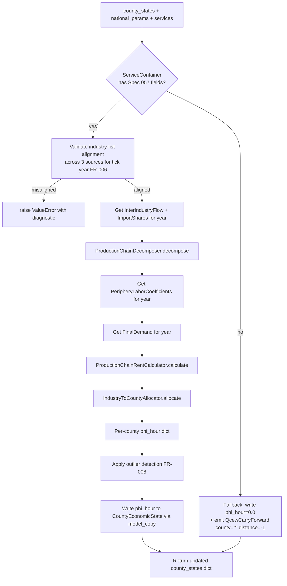

# Contract: `imperial_rent.compute()` pipeline

**Spec**: 057 / FR-001, FR-005, FR-006, FR-011, US1
**Location**: `src/babylon/economics/tick/system/imperial_rent.py` (NEW — completes Spec 058 deferred US2 decomposition)
**Pattern**: Pure function with `ServiceContainer` injection; called from `TickDynamicsSystem._compute_imperial_rent` thin facade method

## Function signature

```python
def compute(
    county_states: dict[str, CountyEconomicState],
    national_params: NationalTickParameters,
    services: ServiceContainer,
) -> dict[str, CountyEconomicState]:
    """Compute per-county phi_hour via Leontief decomposition + periphery wage
    coefficients + final demand + industry-to-county allocation.

    Replaces the no-op stub `phi_hour = 0.0` per FR-001.
    Body lives here (≤400 LOC per Spec 058 / SC-002); facade in tick/system/__init__.py
    is a 3-line delegation per the behavioral fence (Spec 058 / FR-007).
    """
```

## Pipeline stages



## Behavioral fence (per Spec 058 / FR-007)

The `TickDynamicsSystem._compute_imperial_rent` facade method is a 3-line delegation:

```python
def _compute_imperial_rent(self, county_states, national_params, services):
    from babylon.economics.tick.system.imperial_rent import compute
    return compute(county_states, national_params, services)
```

Three preservation guarantees from Spec 058 / FR-007 apply:

1. **Return-type class identity**: `compute()` returns `dict[str, CountyEconomicState]` — same class as the existing stub. Test: `assert isinstance(next(iter(result.values())), CountyEconomicState)`.
2. **Exception class hierarchy preserved**: `ValueError` for misalignment (FR-006), no swap to `pydantic.ValidationError` for source-protocol-conformant calls. Test: `with pytest.raises(ValueError): ...`.
3. **Event-bus emission ordering preserved**: events are emitted in deterministic order (sources iterated in `bea_industries` order; counties iterated in sorted FIPS order). Test extends the existing `tests/integration/economics/tick/test_facade_behavioral_fence.py`.

## Contract

| Aspect | Requirement |
|---|---|
| **Input** | `county_states` (current per-county state), `national_params` (tick year, MELT, etc.), `services` (DI container with all 4 Spec 057 fields) |
| **Output** | New `dict[str, CountyEconomicState]` with `phi_hour` field updated. Counties absent from the allocator's result keep their prior `phi_hour` value (per FR-004 — no silent zero) |
| **Tick-year extraction** | `year = national_params.year` (existing field). Cache key for the entire pipeline. |
| **Industry-list alignment** | All 3 sources (`InterIndustryFlow`, `PeripheryLaborCoefficients`, `FinalDemand`) MUST publish identical `.industries` for `year`. Diagnostic per research.md §R7. |
| **Sentinel handling** | If `PeripheryLaborCoefficientsSource.get_coefficients` returns `NoDataSentinel` → step skipped (no `phi_hour` writes); a single `QcewCarryForwardEvent(county_fips="*", year=year, look_back_distance=-1)` event signals "no periphery-wage data for this year". Same pattern for `FinalDemand` and `Allocator` sentinels. |
| **Calculator clamp** | Pre-existing clamp at `production_chain_rent.py:181` is invoked unchanged (per research.md §R5) |
| **Outlier detection** | After allocation, scan each `phi_hour` against `LeontiefRentDefines.phi_hour_outlier_threshold_low/high`; emit `PhiHourOutlierEvent` per outlier (FR-008) |
| **Determinism** | Output dict and event-bus history MUST be bit-identical across two consecutive calls with the same `(county_states, national_params, services)` input. Iteration uses sorted FIPS / industries throughout. |
| **Performance** | First call within a new (tick year): ≤ 250ms wall-clock. Subsequent calls within same year: ≤ 100ms (cache hits on Leontief inverse, periphery wages, final demand). Per research.md §R3. |

## Acceptance criteria

| ID | Test | Method |
|---|------|--------|
| AC1 (US1.1) | Single Wayne County tick produces non-zero `phi_hour` for at least one county | `test_wayne_baseline_nonzero_phi_hour` — run one tick of Wayne baseline scenario; assert `any(s.phi_hour > 1e-6 for s in result.values())` |
| AC2 (US1.2) | Reproducibility — bit-identical phi_hour distribution across two runs with same seed | `test_reproducibility_same_seed` — run twice; assert `result1 == result2` and event histories match |
| AC3 (US1.3) | County with high-wage-gap industries gets larger `phi_hour` than county with low-wage-gap industries | `test_per_county_proportionality_high_gap` — fabricate two counties, assert `phi_hour[high_gap] > phi_hour[low_gap]` |
| AC4 (FR-006) | Industry-list misalignment raises `ValueError` with diagnostic | `test_industry_misalignment_raises` — fabricate 3 sources with mismatched lists; `pytest.raises(ValueError, match=r"BEA industry list mismatch.*missing")` |
| AC5 (FR-007) | Sentinel propagation — periphery-wage source returns `NoDataSentinel` → step skipped | `test_sentinel_periphery_wage_skips_step` — assert all `phi_hour` unchanged from input + exactly one `QcewCarryForwardEvent(county_fips="*", look_back_distance=-1)` in history |
| AC6 (FR-001) | Behavioral fence — `_compute_imperial_rent` facade method preserves return-type class | `test_facade_returns_dict_str_county_state` — assert `isinstance(result, dict)`, all values `isinstance(CountyEconomicState)` |
| AC7 (FR-001) | Behavioral fence — event emission order deterministic | `test_facade_event_order_deterministic` — extends existing `test_facade_behavioral_fence.py` to cover the new sub-module |
| AC8 (FR-005) | All 4 sources resolved through `SourceRegistry.builtin_economics()` | `test_factory_registers_all_four_sources` — assert `registry.get(PeripheryLaborCoefficientsSource) is not None` etc. |
| AC9 (SC-003) | Allocator conservation invariant within 1.0% tolerance for at least one tick year with complete BEA + QCEW data | `test_conservation_within_one_percent_for_2015` — assert `abs(allocation_total - national_total) / national_total < 0.01` |
| AC10 (SC-004) | National-total `phi_hour` (sum across counties × employment-hours) within order-of-magnitude of `babylon_hickel_final.csv` for at least one year with both data sources present (per research.md §R8.4) | `tests/integration/economics/tick/test_imperial_rent_calibration.py::test_oom_against_hickel_csv` — parameterized over years where both Hickel CSV and BEA+QCEW data exist; assert `0.1 ≤ (computed / hickel_annual_drain_usd[year]) ≤ 10` for the chosen `scale_type` |
| AC11 (Performance) | Warm-cache tick wall-clock ≤ 100ms (mean over 100 ticks) | `test_imperial_rent_perf_warm_cache` — see `tests/integration/economics/tick/test_imperial_rent_perf.py` |
| AC12 (Performance) | Cold-cache tick wall-clock ≤ 250ms | `test_imperial_rent_perf_cold_cache` — measure first tick of a new year |

## Failure modes

| Failure | Detection | Response |
|---|------|------|
| Any source returns `NoDataSentinel` | `imperial_rent.compute()` startup checks | Skip step, emit signal event; return `county_states` unchanged |
| Industry-list mismatch | `imperial_rent.compute()` startup check (FR-006) | `raise ValueError` with diagnostic |
| Calculator raises (e.g., shape mismatch survived FR-006 — should not happen) | `ProductionChainRentCalculator.calculate` | Propagates to caller; tick fails per "fail loud in logic layer" |
| `CountyEconomicState.model_copy(update={"phi_hour": -0.5})` (negative phi_hour somehow reaches the data layer) | `CountyEconomicState.phi_hour: Field(ge=0)` | `pydantic.ValidationError` — third defense layer per research.md §R5 |
| Spec 057 `ServiceContainer` fields are `None` | `imperial_rent.compute()` startup check | Fallback to legacy stub behavior + emit `QcewCarryForwardEvent(county_fips="*", look_back_distance=-1)` once per tick |
