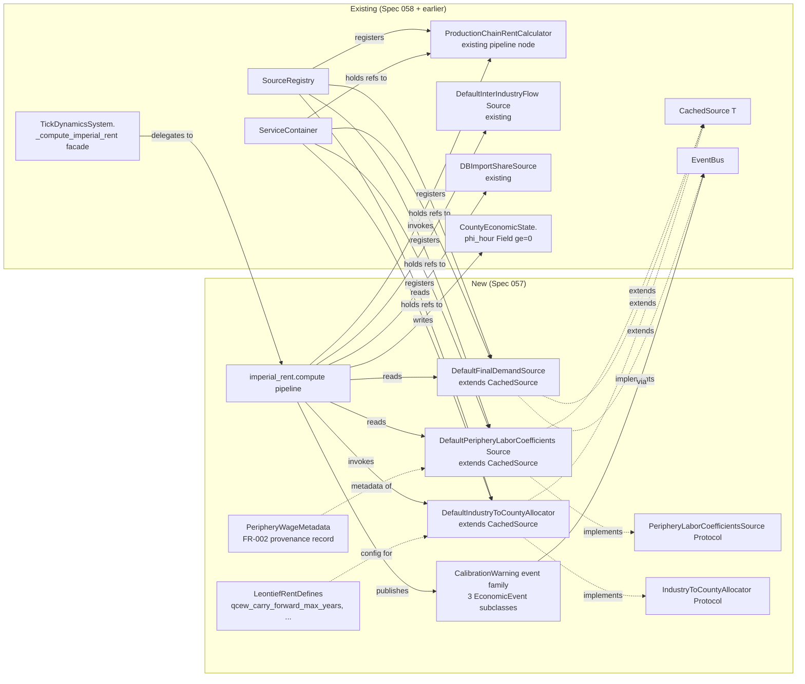

# Data Model: End-to-End Leontief Imperial Rent Integration

**Branch**: `057-leontief-rent-integration` | **Date**: 2026-05-08 | **Phase**: 1

This document defines the new entities introduced by Spec 057 and the surgical modifications to existing entities. All new entities are immutable Pydantic models or `Protocol` interfaces per the project's "Pydantic First" standard.

---

## Existing entities — modifications only

### `CountyEconomicState` (existing — `src/babylon/economics/tick/types.py:269`)

**No schema change.** The `phi_hour: float = Field(..., ge=0, description="Imperial rent per hour")` field shape is preserved per FR-011. This feature changes only the *upstream value* written to the field (from a constant `0.0` to the structurally-derived per-county allocation).

**Confirms three-layer axiom enforcement** (per research.md §R5):

1. Source layer — `DefaultPeripheryLaborCoefficientsSource` warns on `ratio < 1.0` (preserves data integrity signal)
2. Calculator layer — `ProductionChainRentCalculator` clamps `loss_ratio` to `[0, ∞)` at `production_chain_rent.py:181`
3. Data-model layer — `CountyEconomicState.phi_hour` `Field(..., ge=0)` would raise `ValidationError` if a negative value reached this far (defense in depth)

### `ServiceContainer` (existing — `src/babylon/engine/services.py`)

**Adds 4 new optional fields**, default `None` for backward compatibility (the existing `field(default=None)` pattern for the Feature 017 economics services):

```python
@dataclass
class ServiceContainer:
    # ... existing fields unchanged ...

    # Feature 017 (existing - all optional)
    melt_calculator: Any = field(default=None)
    basket_calculator: Any = field(default=None)
    # ... etc ...

    # Spec 057 — Leontief Imperial Rent Integration (all optional, default None)
    periphery_labor_source: PeripheryLaborCoefficientsSource | None = field(default=None)
    final_demand_source: FinalDemandSource | None = field(default=None)
    industry_county_allocator: IndustryToCountyAllocator | None = field(default=None)
    production_chain_calculator: ProductionChainRentCalculator | None = field(default=None)
```

**Validation invariant (enforced by `imperial_rent.compute()` at runtime)**: if any of the 4 Spec 057 fields is `None`, the per-tick step falls back to the legacy stub behavior (`phi_hour = 0.0`) with a one-time `CalibrationWarning(QcewCarryForward, county_fips="*", year=tick_year, look_back_distance=-1)` event signaling "Spec 057 pipeline not wired" — this preserves graceful degradation for tests and partial scenarios while making the unwired state observable.

### `TickDynamicsSystem._compute_imperial_rent` (existing — `src/babylon/economics/tick/system/__init__.py:606`)

**Body replaced by thin delegation** to the new `imperial_rent.compute()` function in `src/babylon/economics/tick/system/imperial_rent.py`. Method signature unchanged; behavioral fence (per Spec 058 / FR-007) preserved by the existing snapshot test.

```python
def _compute_imperial_rent(
    self,
    county_states: dict[str, CountyEconomicState],
    national_params: NationalTickParameters,
    services: ServiceContainer,
) -> dict[str, CountyEconomicState]:
    """Step 4: Compute imperial rent flows. Delegates to imperial_rent module."""
    from babylon.economics.tick.system.imperial_rent import compute as compute_imperial_rent
    return compute_imperial_rent(county_states, national_params, services)
```

---

## New entities

### `PeripheryLaborCoefficientsSource` (Protocol — NEW)

**Location**: `src/babylon/economics/tensor_hierarchy/leontief_rent/periphery_labor_coefficients.py`

**Purpose**: Year-keyed query interface for per-industry core/periphery wage ratios.

```python
from typing import Protocol, runtime_checkable
from babylon.economics.tensor import NoDataSentinel
from babylon.economics.tensor_hierarchy.types import PeripheryLaborCoefficients

@runtime_checkable
class PeripheryLaborCoefficientsSource(Protocol):
    """Per-industry core/periphery wage-ratio source.

    Returns a PeripheryLaborCoefficients vector for the requested year, plus
    metadata describing the source publication, periphery definition, units,
    and base year (per FR-002).

    Implementations MUST return NoDataSentinel for years with no data
    (per FR-007 and Clarifications 2026-05-08), never raise.

    Implementations SHOULD inherit from CachedSource[PeripheryLaborCoefficients]
    for LRU + NoDataSentinel-aware semantics out of the box (per FR-005 and
    Clarifications 2026-05-08).
    """

    def get_coefficients(self, year: int) -> PeripheryLaborCoefficients | NoDataSentinel:
        """Fetch wage ratios for the requested year.

        Returns:
            PeripheryLaborCoefficients with .industries (ordered BEA codes)
            and .wage_ratios (np.ndarray, shape (n,), expected ≥ 1.0 — values
            below 1.0 are passed through with a CalibrationWarning emitted via
            EventBus per FR-002).

            NoDataSentinel if no data is available for `year`.
        """
        ...

    @property
    def metadata(self) -> "PeripheryWageMetadata":
        """Return the source-publication metadata record (per FR-002)."""
        ...
```

### `DefaultPeripheryLaborCoefficientsSource` (concrete impl — NEW)

**Location**: `src/babylon/economics/tensor_hierarchy/leontief_rent/periphery_labor_coefficients.py` (same file as Protocol)

**Inherits**: `CachedSource[PeripheryLaborCoefficients]` (Spec 058's `babylon.core.protocol_kit`)

**Source data**: PWT v10.x via `marxist-data-3NF.sqlite` (per research.md §R1)

```python
from babylon.core.protocol_kit import CachedSource

class DefaultPeripheryLaborCoefficientsSource(CachedSource[PeripheryLaborCoefficients]):
    """PWT-based periphery-wage source. Country-aggregate ratio applied uniformly
    across BEA industries (v1 simplification per research.md §R1)."""

    cache_negative_results: bool = True  # Spec 058 default — PWT is stable within session

    def __init__(self, db_session, event_bus, bea_industries_source) -> None:
        super().__init__()
        self._db = db_session
        self._bus = event_bus
        self._industries = bea_industries_source

    def _fetch(self, year: int) -> PeripheryLaborCoefficients | NoDataSentinel:
        """Query PWT for `year`, compute country-aggregate wage ratio,
        broadcast across BEA industries, emit CalibrationWarning for any
        ratio < 1.0 (which for the v1 uniform-broadcast case means: emit
        once per year if the country-aggregate ratio < 1.0, which would
        be unusual but not impossible)."""
        # Implementation details in tasks.md
        ...

    @property
    def metadata(self) -> "PeripheryWageMetadata":
        return PeripheryWageMetadata(
            publication="PWT v10.01",
            publication_url="https://www.rug.nl/ggdc/productivity/pwt/",
            periphery_definition="Hickel/Sullivan/Zoomkawala 2022 Global South country list (151 countries)",
            units="USD/worker (2017 PPP-adjusted, real)",
            base_year=2017,
            industry_disaggregation="None — country-aggregate ratio applied uniformly across BEA industries",
            calibration_anchor="Hickel et al. 2022 — drain from Global South ≈ $2.8T (2015)",
            v1_simplification_caveats=[
                "Country-level ratio applied uniformly across all BEA industries",
                "Underestimates rent in low-wage manufacturing; overstates in high-wage services",
            ],
        )
```

### `PeripheryWageMetadata` (Pydantic model — NEW)

**Location**: `src/babylon/economics/tensor_hierarchy/leontief_rent/periphery_labor_coefficients.py` (same file)

**Purpose**: Provenance record per FR-002 — identifies the source publication, periphery definition, units, and base year.

```python
from pydantic import BaseModel, ConfigDict
from typing import Annotated
from pydantic import Field

class PeripheryWageMetadata(BaseModel):
    """Source-publication metadata for PeripheryLaborCoefficients (FR-002)."""

    model_config = ConfigDict(frozen=True)

    publication: str = Field(..., description="Source publication name + version")
    publication_url: str = Field(..., description="Canonical URL")
    periphery_definition: str = Field(..., description="Geographic + methodological definition")
    units: str = Field(..., description="Numerical units of the underlying wage data")
    base_year: int = Field(..., ge=1900, le=2100, description="Reference year for PPP / real adjustments")
    industry_disaggregation: str = Field(..., description="None / Manufacturing-only / Sector-level / etc.")
    calibration_anchor: str = Field(..., description="Independent estimate referenced for SC-004 order-of-magnitude check")
    v1_simplification_caveats: list[str] = Field(default_factory=list)
```

### `DefaultFinalDemandSource` (concrete impl — NEW)

**Location**: `src/babylon/economics/tensor_hierarchy/leontief_rent/final_demand.py`

**Inherits**: `CachedSource[np.ndarray]`

**Protocol**: Already declared as `FinalDemandSource(Protocol)` in `production_chain_rent.py:82` — only the concrete impl is new.

**Source data**: BEA Use Table Summary level, "Total Final Uses (GDP)" column, vintage-aligned with `DefaultInterIndustryFlowSource` (per research.md §R2).

```python
from babylon.core.protocol_kit import CachedSource
from babylon.economics.tensor_hierarchy.production_chain_rent import FinalDemandSource

class DefaultFinalDemandSource(CachedSource[np.ndarray]):
    """BEA Use Table-based final-demand vector source per FR-003.
    Returns the 'Total Final Uses (GDP)' column for the requested year,
    aligned with the BEA Summary-level industry list."""

    cache_negative_results: bool = True

    def __init__(self, db_session, bea_industries_source) -> None:
        super().__init__()
        self._db = db_session
        self._industries = bea_industries_source

    def _fetch(self, year: int) -> np.ndarray | NoDataSentinel:
        """Query fact_bea_use_table for `year`, return 1-D numpy array
        of length n_industries in the same order as
        DefaultInterIndustryFlowSource.industries(year)."""
        ...

    def get_final_demand(self, year: int) -> np.ndarray:
        """Adapter for the existing FinalDemandSource Protocol contract.
        Delegates to _fetch via the cache. Raises if data is missing
        (the Protocol does NOT permit NoDataSentinel return; see contract
        for the wrapper logic that converts cached sentinel to ValueError
        only when the calculator demands the value, not when polled)."""
        result = self._resolve(year)  # CachedSource entry point
        if isinstance(result, NoDataSentinel):
            raise ValueError(f"No final-demand data for year {year}")
        return result
```

**Note**: The existing `FinalDemandSource` Protocol has signature `get_final_demand(year: int) -> np.ndarray` (no `NoDataSentinel`). Per FR-007 + Clarifications 2026-05-08, the new implementation cleanly returns `NoDataSentinel` from `_fetch` (the `CachedSource[T]` contract) but exposes `get_final_demand` as the legacy adapter that raises if the cached value is the sentinel — this lets the new source satisfy both the existing Protocol and the new no-data-via-sentinel convention. Callers using the Protocol directly get exception semantics; callers using `_resolve` get sentinel semantics.

### `IndustryToCountyAllocator` (Protocol — NEW)

**Location**: `src/babylon/economics/tensor_hierarchy/leontief_rent/industry_to_county_allocator.py`

```python
@runtime_checkable
class IndustryToCountyAllocator(Protocol):
    """Per-industry imperial rent → per-county phi_hour allocator.

    Allocates per-industry rent values into per-county phi_hour values using
    QCEW employment-share weighting per FR-004. Carries forward employment
    shares for missing (county, year) pairs within a 5-year look-back window
    per Clarifications 2026-05-08.
    """

    def allocate(
        self,
        phi_vector: np.ndarray,        # Per-industry rent, shape (n_industries,)
        bea_industries: list[str],     # Order matches phi_vector
        year: int,                      # Tick year for QCEW lookup
    ) -> dict[str, float] | NoDataSentinel:
        """Allocate per-industry rent to counties.

        Returns:
            Dict {county_fips: phi_hour} for every county that has QCEW data
            in the (year, year-5) look-back window. Counties with no data
            in the window are absent from the dict (the per-tick step then
            skips them per FR-004).

            NoDataSentinel if QCEW data is unavailable for the entire window
            (uniform suppression across all counties — would be unusual).
        """
        ...
```

### `DefaultIndustryToCountyAllocator` (concrete impl — NEW)

**Location**: same file as Protocol

**Inherits**: `CachedSource[dict[str, float]]` (cache key = year)

**Algorithm**:

1. For each county FIPS in QCEW for the look-back window `[year - max_years, year]`:
   - Find the most recent year `y' ≤ year` with QCEW data for this county
   - If no such `y'` exists in the window, skip the county and emit `NoDataSentinel` for it (county absent from result dict)
   - Else compute `share[fips, naics] = qcew_emp[fips, naics, y'] / qcew_emp_national[naics, y']` for each NAICS in QCEW for `y'`
   - Aggregate to BEA Summary level via `xref_naics_bea_summary`: `bea_share[fips, bea_code] = Σ_{naics → bea_code} share[fips, naics]`
   - Per-county rent allocation: `county_rent[fips] = Σᵢ phi_vector[i] · bea_share[fips, bea_codes[i]]`
   - Normalize by total county employment-hours: `phi_hour[fips] = county_rent[fips] / (county_emp_hours[fips, y'])`
   - If `y' < year`, emit `CalibrationWarning(QcewCarryForward, county_fips=fips, year=year, look_back_distance=year - y')`
2. Return `{fips: phi_hour}` dict

**Constants** (per Constitution III.1):

```python
class LeontiefRentDefines(BaseModel):
    """Tunables for the Spec 057 imperial-rent pipeline."""

    model_config = ConfigDict(frozen=True)

    qcew_carry_forward_max_years: Annotated[int, Field(ge=0, le=20)] = 5
    """Maximum look-back window for QCEW carry-forward (Clarifications 2026-05-08).
    0 disables carry-forward (strict no-data semantics)."""

    phi_hour_outlier_threshold_low: float = -1000.0
    """Per-county phi_hour values below this trigger PhiHourOutlierEvent (FR-008).
    Pre-clamp negative values cannot reach phi_hour (clamp at calculator), so
    this threshold is for defense-in-depth and validation only."""

    phi_hour_outlier_threshold_high: float = 1000.0
    """Per-county phi_hour values above this trigger PhiHourOutlierEvent (FR-008)."""
```

**Lifted to**: `src/babylon/config/defines/economy_basic.py` (assembled into `GameDefines` via Spec 058's `_assembler.py`).

### `CalibrationWarning` event family (NEW — 3 Pydantic event subclasses)

**Location**: `src/babylon/models/events.py` (additions to existing file)

**All inherit from existing `EconomicEvent(SimulationEvent)` per research.md §R6.**

```python
class AxiomViolationEvent(EconomicEvent):
    """Periphery-wage source published a ratio violating the structural axiom
    (ratio ≥ 1.0). Pass-through with warning per FR-002 + Clarifications 2026-05-08.

    Discriminator string for EventBus.publish: "calibration_warning.axiom_violation"
    """

    event_type: Literal[EventType.CALIBRATION_AXIOM_VIOLATION] = EventType.CALIBRATION_AXIOM_VIOLATION
    industry: str = Field(..., description="BEA industry code where the violation occurred")
    year: int = Field(..., ge=1900, le=2100)
    ratio: float = Field(..., description="The violating wage ratio (< threshold)")
    threshold: float = Field(default=1.0, description="The expected lower bound (axiom)")


class QcewCarryForwardEvent(EconomicEvent):
    """QCEW data missing for a (county, year) pair — employment shares
    carried forward from a prior year per FR-004 + Clarifications 2026-05-08.

    Discriminator string: "calibration_warning.qcew_carry_forward"
    """

    event_type: Literal[EventType.CALIBRATION_QCEW_CARRY_FORWARD] = EventType.CALIBRATION_QCEW_CARRY_FORWARD
    county_fips: str
    year: int = Field(..., ge=1900, le=2100, description="The tick year (QCEW gap year)")
    look_back_year: int = Field(..., ge=1900, le=2100, description="The year carried forward from")
    look_back_distance: int = Field(..., ge=0, le=20, description="year - look_back_year")


class PhiHourOutlierEvent(EconomicEvent):
    """Per-county phi_hour fell outside the empirically plausible range
    (LeontiefRentDefines.phi_hour_outlier_threshold_low/high) per FR-008.

    Discriminator string: "calibration_warning.phi_hour_outlier"
    """

    event_type: Literal[EventType.CALIBRATION_PHI_HOUR_OUTLIER] = EventType.CALIBRATION_PHI_HOUR_OUTLIER
    county_fips: str
    phi_hour: float = Field(..., description="The outlier value")
    threshold_low: float = Field(default=-1000.0)
    threshold_high: float = Field(default=1000.0)
```

**Required additions to existing `EventType` enum** in `models/events.py`:

```python
class EventType(StrEnum):
    # ... existing entries ...
    CALIBRATION_AXIOM_VIOLATION = "calibration_warning.axiom_violation"
    CALIBRATION_QCEW_CARRY_FORWARD = "calibration_warning.qcew_carry_forward"
    CALIBRATION_PHI_HOUR_OUTLIER = "calibration_warning.phi_hour_outlier"
```

**Publishing pattern** (per research.md §R6):

```python
from babylon.engine.event_bus import Event
from babylon.models.events import AxiomViolationEvent

# In DefaultPeripheryLaborCoefficientsSource._fetch:
for industry, ratio in zip(self._industries, ratios, strict=True):
    if ratio < 1.0:
        typed_event = AxiomViolationEvent(
            tick=current_tick, industry=industry, year=year, ratio=float(ratio)
        )
        self._bus.publish(Event(
            type="calibration_warning.axiom_violation",
            tick=current_tick,
            payload=typed_event.model_dump(),
        ))
```

---

## Entity-relationship summary



---

## Validation invariants (cross-entity)

| Invariant | Where Enforced | What Fails If Violated |
|-----------|---------------|------------------------|
| Industry-list alignment between flow / periphery-wage / final-demand sources for same year | `imperial_rent.compute()` startup check (per FR-006 + research.md §R7) | `ValueError` with bounded diagnostic naming mismatched codes |
| `phi_hour ≥ 0` at `CountyEconomicState` write | `CountyEconomicState.phi_hour: Field(..., ge=0)` (existing) | `pydantic.ValidationError` (third defense layer per research.md §R5) |
| `wage_ratios.shape == (n_industries,)` | `PeripheryLaborCoefficients.validate_ratios` (existing model_validator) | `ValueError` with shape diagnostic |
| `len(final_demand) == n_industries` | `ProductionChainRentCalculator.calculate` line 171–173 (existing) | `ValueError("Final demand array shape mismatch.")` |
| Bit-identical `phi_hour` distribution across runs with same seed | Determinism property (per Constitution III.7) | Test failure in `test_imperial_rent_pipeline.py::test_reproducibility` |
| `qcew_carry_forward_max_years ∈ [0, 20]` | `LeontiefRentDefines.qcew_carry_forward_max_years: Field(ge=0, le=20)` | `pydantic.ValidationError` at `GameDefines()` construction |

## State transitions (none)

This feature introduces no state machines or qualitative transitions — `phi_hour` is a quantitative field per Constitution I.7 (Quantitative→Qualitative). The qualitative transitions downstream (e.g., crisis triggers, bifurcation events) are unchanged in this feature; only the upstream `phi_hour` value becomes meaningful.
