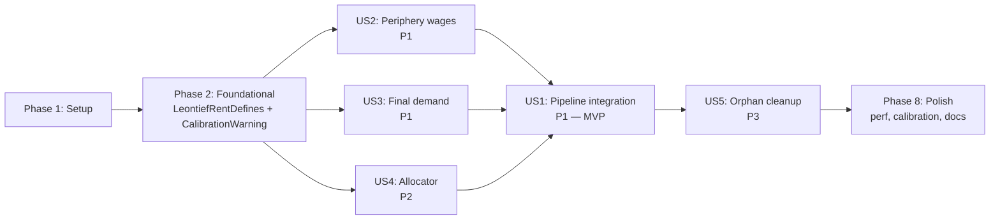

# Tasks: End-to-End Leontief Imperial Rent Integration

**Input**: Design documents from `/specs/057-leontief-rent-integration/`
**Prerequisites**: plan.md, spec.md, research.md (R1–R8), data-model.md, contracts/ (5 files), quickstart.md

**Tests**: TDD is project standard (per `CLAUDE.md`). Test tasks are **mandatory** and run **before** implementation per the red-green-refactor cycle.

**Organization**: Tasks are grouped by user story to enable independent implementation and verification. Implementation order follows the dependency arrow (US2/US3/US4 supply US1's pipeline; US5 is post-merge cleanup).

## Format: `[ID] [P?] [Story] Description`

- **[P]**: Can run in parallel (different files, no dependencies on incomplete tasks)
- **[Story]**: User story label (US1–US5) — required for user story phase tasks
- File paths are absolute or repo-rooted

## Path Conventions

- Source: `src/babylon/...` (Python package)
- Tests: `tests/unit/...` (fast, marker `@pytest.mark.unit`) and `tests/integration/...` (DB-touching, `@pytest.mark.integration`)
- Specs: `specs/057-leontief-rent-integration/` (read-only — already authored)

---

## Phase 1: Setup (Shared Infrastructure)

**Purpose**: Branch hygiene, baseline capture, package skeleton.

- [X] T001 Confirm working tree is clean and on branch `057-leontief-rent-integration`; verify Spec 058 infrastructure present (`src/babylon/core/protocol_kit.py`, `src/babylon/economics/tensor_hierarchy/mappings/_models.py`, `src/babylon/economics/tick/system/__init__.py`, `src/babylon/config/defines/`, `src/babylon/models/enums/`); confirm legacy module absent: `! test -d src/babylon/economics/reproduction || echo "WARN: reproduction module still exists; FR-009 narrative may need update"` (analyze pre-confirmed absent on 2026-05-08, per analyze U4 finding)
- [X] T002 Capture baseline test tally: `mise run test:unit && mise run test:int && mise run test:summary` → record `passed/skipped/xfailed/failures` in a scratch file (used to verify SC-001 at end)
- [X] T003 Verify spec-057 quarantine markers are still in place: `grep -rln "Blocked on spec 057-leontief" src/ tests/ | wc -l` → expect ≥9 (these UNSKIP in Phase 7 / US5)
- [X] T004 Verify trove data accessibility: `ls /media/user/data/babylon-data/babylon_hickel_final.csv /media/user/data/babylon-data/concordance/BEA-Industry-and-Commodity-Codes-and-NAICS-Concordance.xlsx /media/user/data/babylon-data/input-output/make-use/IOUse_Before_Redefinitions_PRO_Summary.xlsx` (per research.md §R8)
- [X] T005 [P] Create empty package directory `src/babylon/economics/tensor_hierarchy/leontief_rent/` with `__init__.py` declaring `__all__: list[str] = []` (will populate in Phases 3–6)
- [X] T006 [P] Create empty test directory `tests/unit/economics/tensor_hierarchy/leontief_rent/` with `__init__.py` and shared `conftest.py` for fixtures (mock sources implementing the Protocols per research.md §R6 and project pattern from `melt/conftest.py`)

---

## Phase 2: Foundational (Blocking Prerequisites)

**Purpose**: Configuration model + event types that all later phases consume.

**⚠️ CRITICAL**: No user story work begins until this phase is complete (US2/US3/US4 publish events defined here; US4 reads `LeontiefRentDefines.qcew_carry_forward_max_years`; US1 publishes via `EventBus`).

### LeontiefRentDefines (FR-001, R3, R4)

- [X] T007 Write failing test `tests/unit/config/defines/test_economy_basic.py::test_leontief_rent_defines_defaults` asserting `GameDefines().economy.leontief_rent.qcew_carry_forward_max_years == 5`, `phi_hour_outlier_threshold_low == -1000.0`, `phi_hour_outlier_threshold_high == 1000.0`
- [X] T008 Write failing test `test_leontief_rent_defines_validation` asserting `pydantic.ValidationError` raised for `qcew_carry_forward_max_years=-1` and `=21` (bounds `[0, 20]` per data-model.md)
- [X] T009 Implement `LeontiefRentDefines(BaseModel)` Pydantic class in `src/babylon/config/defines/economy_basic.py` with the three fields per data-model.md "DefaultIndustryToCountyAllocator → Constants" section; register on the `EconomyDefines` (or appropriate parent) per Spec 058's `_assembler.py` pattern; export via `__all__`
- [X] T010 Run `poetry run pytest tests/unit/config/defines/test_economy_basic.py -v -k leontief` → all green

### CalibrationWarning event family (FR-002, FR-004, FR-008, R6)

- [X] T011 [P] Write failing test `tests/unit/models/test_events.py::test_axiom_violation_event_roundtrip` asserting `AxiomViolationEvent(tick=1, industry="X", year=2015, ratio=0.95).model_dump()` round-trips through `Event(type="calibration_warning.axiom_violation", payload=...)` per `contracts/calibration_warning.md` AC1
- [X] T012 [P] Write failing test `test_qcew_carry_forward_event_boundary` per `contracts/calibration_warning.md` AC2 + AC4 (boundary values `look_back_distance ∈ [0, 20]`, `=21` raises)
- [X] T013 [P] Write failing test `test_phi_hour_outlier_event_default_thresholds` per `contracts/calibration_warning.md` AC3 (defaults `±1000.0`)
- [X] T014 [P] Write failing test `test_event_type_strings_match_discriminator_pattern` per `contracts/calibration_warning.md` AC5 asserting `EventType.CALIBRATION_AXIOM_VIOLATION.value == "calibration_warning.axiom_violation"` (and the other two)
- [X] T015 Implement three new entries in the `EventType` StrEnum in `src/babylon/models/events.py`: `CALIBRATION_AXIOM_VIOLATION`, `CALIBRATION_QCEW_CARRY_FORWARD`, `CALIBRATION_PHI_HOUR_OUTLIER` (values per data-model.md "Required additions" section)
- [X] T016 Implement three new `EconomicEvent` subclasses in `src/babylon/models/events.py`: `AxiomViolationEvent`, `QcewCarryForwardEvent`, `PhiHourOutlierEvent` with field shapes per `contracts/calibration_warning.md` "Three event types" tables; export via `__all__`
- [X] T017 Run `poetry run pytest tests/unit/models/test_events.py -v -k "axiom or qcew or outlier or calibration"` → 4 tests green
- [X] T018 Commit boundary: `feat(spec-057): LeontiefRentDefines + CalibrationWarning event family (Phase 2 foundational)`

**Checkpoint**: Foundation ready — US2, US3, US4 can begin in parallel.

---

## Phase 3: US2 — Periphery wage coefficients from PWT (Priority: P1)

**Goal**: A `DefaultPeripheryLaborCoefficientsSource` reads PWT v10.x via the reference SQLite, applies the country-aggregate ratio uniformly across BEA industries, returns `PeripheryLaborCoefficients | NoDataSentinel`, and emits `AxiomViolationEvent` for ratios < 1.0.

**Independent Test**: Unit tests in `tests/unit/economics/tensor_hierarchy/leontief_rent/test_periphery_labor_coefficients_source.py` cover all 5 acceptance criteria from `contracts/periphery_labor_coefficients_source.md` against fixture data — pass without any other Spec 057 component being wired.

### Tests for User Story 2 (RED — write first, expect failure)

- [X] T019 [P] [US2] Write failing test `test_get_coefficients_present_year` (AC1) — for year 2015 + scale_type "Intensive", assert returned `PeripheryLaborCoefficients.wage_ratios` has shape `(n_industries,)`, dtype float64, finite, AND every element equals `8.25` (the 2015 Intensive ERDI value per `babylon_hickel_final.csv`). Industry list matches BEA Summary
- [X] T020 [P] [US2] Write failing test `test_get_coefficients_outside_window` (AC2) — assert `isinstance(source.get_coefficients(1900), NoDataSentinel)` AND `isinstance(source.get_coefficients(2030), NoDataSentinel)`, no exception
- [X] T021 [P] [US2] Write failing test `test_axiom_violation_pass_through` (AC3) — inject mock data with `wage_ratio[k] = 0.95`; assert (a) `result.wage_ratios[k] == 0.95` (NOT clamped at source layer), (b) exactly one `Event(type="calibration_warning.axiom_violation", ...)` in `event_bus.get_history()` with matching payload
- [X] T022 [P] [US2] Write failing test `test_determinism_repeat_query` (AC4) — assert `np.array_equal(source.get_coefficients(2015).wage_ratios, source.get_coefficients(2015).wage_ratios)`
- [X] T023 [P] [US2] Write failing test `test_metadata_shape` (AC5) — assert `source.metadata.publication == "PWT v10.01"`, `metadata.base_year == 2017`, etc., per data-model.md `PeripheryWageMetadata` fields

### Implementation for User Story 2

- [X] T024 [P] [US2] Implement `PeripheryWageMetadata` Pydantic frozen model in `src/babylon/economics/tensor_hierarchy/leontief_rent/periphery_labor_coefficients.py` per data-model.md (publication, publication_url, periphery_definition, units, base_year, industry_disaggregation, calibration_anchor, v1_simplification_caveats) — REVISED 2026-05-08 to use Hickel ERDI provenance, not PWT
- [X] T024c [US2] **(R9 — Constitution III.4 amendment)** Add `Hickel_HSZ_Drain` entry to `.specify/memory/data-catalog.yaml` under the `International Trade` category, class `Fixture`, with provenance fields per research.md §R9. Bump catalog version `2.6.1` → `2.6.2` in the file's top-level `version` field. Update the constitution amendment registry comment block in `.specify/memory/constitution.md` (header section) noting the PATCH-level amendment for Spec 057
- [X] T024d [US2] **(R1 — ingestion task)** Ingest `/media/user/data/babylon-data/babylon_hickel_final.csv` into a new `fact_hickel_erdi_annual` table in `data/sqlite/marxist-data-3NF.sqlite`. Table schema: `(year INTEGER, scale_type VARCHAR(20), erdi NUMERIC(10,4), annual_drain_usd_billions NUMERIC(15,2), alpha NUMERIC(10,6), core_gain_per_capita_usd NUMERIC(15,2), source VARCHAR(255), PRIMARY KEY (year, scale_type))`. Add an ingestion script under `tools/ingest/hickel_erdi.py` that reads the CSV and inserts rows; idempotent (DROP + RECREATE table on each run). Run once to populate; verify with `sqlite3 data/sqlite/marxist-data-3NF.sqlite "SELECT COUNT(*), MIN(year), MAX(year) FROM fact_hickel_erdi_annual;"` → expect ~58 rows, year range 1960–2017
- [X] T025 [US2] Implement `PeripheryLaborCoefficientsSource(Protocol)` + `DefaultPeripheryLaborCoefficientsSource(CachedSource[PeripheryLaborCoefficients])` in same file (REVISED 2026-05-08 post-analyze C4 — pivoted from PWT to Hickel ERDI). The `_fetch(year)` method:
  - queries `fact_hickel_erdi_annual` for `(year, scale_type)` (default `scale_type="Intensive"`)
  - if no row → returns `NoDataSentinel`
  - else broadcasts the single ERDI value uniformly across the BEA Summary industries returned by the injected `bea_industries_source`: `wage_ratios = np.full(n_industries, erdi_value, dtype=np.float64)`
  - emits `AxiomViolationEvent` per industry with `ratio < 1.0` (v1 uniform-broadcast: fires for all n_industries iff the year's ERDI < 1.0 — implementation MAY emit one aggregate event for that year per AC3 of contracts/periphery_labor_coefficients_source.md)
  - returns `PeripheryLaborCoefficients(year=year, industries=bea_industries, wage_ratios=wage_ratios)`
- [X] T026 [US2] Add `from .periphery_labor_coefficients import PeripheryLaborCoefficientsSource, DefaultPeripheryLaborCoefficientsSource, PeripheryWageMetadata` to `src/babylon/economics/tensor_hierarchy/leontief_rent/__init__.py`; update `__all__`
- [X] T027 [US2] Run `poetry run pytest tests/unit/economics/tensor_hierarchy/leontief_rent/test_periphery_labor_coefficients_source.py -v` → all 5 GREEN
- [X] T028 [US2] Commit boundary: `feat(spec-057): DefaultPeripheryLaborCoefficientsSource — US2, Hickel ERDI broadcast (analyze C4 pivot from PWT)`

**Checkpoint**: US2 fully functional and unit-tested independently.

---

## Phase 4: US3 — Final demand from BEA Use Table (Priority: P1)

**Goal**: A `DefaultFinalDemandSource` reads the BEA Use Table Summary-level "Total Final Uses (GDP)" column from the reference SQLite, returns a 1-D numpy array aligned with the `DefaultInterIndustryFlowSource` industry list. Sentinel return on missing year via `_fetch`; legacy adapter `get_final_demand` raises `ValueError` for backward compat with the existing `FinalDemandSource(Protocol)` at `production_chain_rent.py:82`.

**Independent Test**: Unit tests in `tests/unit/economics/tensor_hierarchy/leontief_rent/test_final_demand_source.py` cover all 6 acceptance criteria from `contracts/final_demand_source.md` against fixture data.

### Tests for User Story 3 (RED — write first)

- [X] T029 [P] [US3] Write failing test `test_get_final_demand_shape` (AC1) — assert returned array shape `(n_industries,)`, dtype float64, all entries non-negative
- [X] T030 [P] [US3] Write failing test `test_fetch_missing_year_sentinel` (AC2) — assert `isinstance(source._fetch(1900), NoDataSentinel)`
- [X] T031 [P] [US3] Write failing test `test_get_final_demand_missing_year_raises` (AC3) — `pytest.raises(ValueError, match=r"No final-demand data for year 1900")`
- [X] T032 [P] [US3] Write failing test `test_national_total_matches_bea_gdp` (AC4) — soft check using a fixture year; `assert abs(result.sum() - expected_gdp) / expected_gdp < 0.05`
- [X] T033 [P] [US3] Write failing test `test_industry_order_matches_flow_source` (AC5) — given `flow_source.industries(year) == [...ordered...]`, assert `final_demand` returned in same positional order
- [X] T034 [P] [US3] Write failing test `test_determinism_repeat_query` (AC6) — `assert np.array_equal(source.get_final_demand(2015), source.get_final_demand(2015))`

### Implementation for User Story 3

- [X] T035 [US3] Schema check confirmed (analyze 2026-05-08): no `fact_bea_use_table` in `marxist-data-3NF.sqlite` BUT `fact_bea_national_industry` (gross_output_millions) + `fact_bea_io_coefficient` ARE present. **DEFAULT path: derive `y = x − A·x`** from those two tables — the existing `FinalDemandSource` Protocol explicitly allows "or derived" per `production_chain_rent.py:82`. **FALLBACK path** (if derived accuracy is insufficient at SC-004 calibration): ingest `/media/user/data/babylon-data/input-output/make-use/IOUse_Before_Redefinitions_PRO_Summary.xlsx` into a new `fact_bea_use_table`. See analyze finding C4 for the strategy decision
- [X] T036 [US3] Implement `DefaultFinalDemandSource(CachedSource[np.ndarray])` in `src/babylon/economics/tensor_hierarchy/leontief_rent/final_demand.py`:
  - `_fetch(year) -> np.ndarray | NoDataSentinel` — query `fact_bea_use_table` for `year`, return `np.asarray(rows, dtype=np.float64)` ordered to match `DefaultInterIndustryFlowSource(year).industries`
  - `get_final_demand(year) -> np.ndarray` — adapter for the existing `FinalDemandSource` Protocol; calls `self._resolve(year)` and raises `ValueError` if `NoDataSentinel`
- [X] T037 [US3] Add to `src/babylon/economics/tensor_hierarchy/leontief_rent/__init__.py` re-exports + `__all__`
- [X] T038 [US3] Run `poetry run pytest tests/unit/economics/tensor_hierarchy/leontief_rent/test_final_demand_source.py -v` → all 6 GREEN
- [X] T039 [US3] Commit boundary: `feat(spec-057): DefaultFinalDemandSource — US3, BEA Use Table Summary level`

**Checkpoint**: US3 fully functional and unit-tested independently.

---

## Phase 5: US4 — Industry-to-county allocator with carry-forward (Priority: P2)

**Goal**: An `IndustryToCountyAllocator` translates per-industry rent into per-county `phi_hour` via QCEW employment-share weighting, with 5-year carry-forward fallback for missing (county, year) pairs and outlier detection per FR-008.

**Independent Test**: Unit tests in `tests/unit/economics/tensor_hierarchy/leontief_rent/test_industry_to_county_allocator.py` cover all 7 acceptance criteria from `contracts/industry_to_county_allocator.md` using fabricated 2-county / 2-industry test fixtures.

### Tests for User Story 4 (RED — write first)

- [X] T040 [P] [US4] Write failing test `test_synthetic_two_county_conservation` (AC1) — fabricate inputs with known shares + per-industry rents; assert `abs(allocation_total - national_total) / national_total < 0.01`
- [X] T041 [P] [US4] Write failing test `test_zero_employment_zero_allocation` (AC2) — fabricate county with `share[fips, naics_X] = 0`; assert allocation excludes industry_X's contribution
- [X] T042 [P] [US4] Write failing test `test_carry_forward_one_year` (AC3) — fabricate QCEW with `(fips, Y) = absent`, `(fips, Y-1) = present`; assert (a) `fips` present in result, (b) exactly one `QcewCarryForwardEvent(county_fips=fips, year=Y, look_back_year=Y-1, look_back_distance=1)` in event history
- [X] T043 [P] [US4] Write failing test `test_carry_forward_beyond_window` (AC4) — fabricate `(fips, Y) = absent` and `(fips, Y - 6) = present` with `max_years=5`; assert `fips` absent from result
- [X] T044 [P] [US4] Write failing test `test_outlier_event_high` (AC5) — fabricate inputs producing `phi_hour > 1000.0`; assert exactly one `PhiHourOutlierEvent` in history
- [X] T045 [P] [US4] Write failing test `test_window_uniformly_empty_returns_sentinel` (AC6) — fabricate QCEW with no data in any year of the window; assert `isinstance(result, NoDataSentinel)`
- [X] T046 [P] [US4] Write failing test `test_determinism_dict_and_event_order` (AC7) — call `allocate(...)` twice; assert `result1 == result2` and event payloads match in order

### Implementation for User Story 4

- [X] T047 [US4] NAICS-BEA crosswalk confirmed (analyze 2026-05-08): table is `bridge_naics_bea` in `marxist-data-3NF.sqlite` with columns `(industry_id, bea_industry_id, mapping_quality, weight)`. Use the `weight` column (NUMERIC(5, 4)) for proper apportionment of `mapping_quality='split'` NAICS codes — this is richer than the original "missing-code → cell-zero" assumption. The `mapping_quality` discriminator (`exact|aggregated|split|estimated`) lets the allocator distinguish high-confidence from estimated cells; allocator MAY emit a `CalibrationWarning(QcewCarryForward, ...)` variant or ignore quality at v1. Schema verified: `dim_industry` ↔ `bridge_naics_bea` ↔ `dim_bea_industry`
- [X] T048 [US4] Implement `IndustryToCountyAllocator(Protocol)` + `DefaultIndustryToCountyAllocator(CachedSource[dict[str, float]])` in `src/babylon/economics/tensor_hierarchy/leontief_rent/industry_to_county_allocator.py` per the algorithm in `contracts/industry_to_county_allocator.md`:
  - Iterate sorted county FIPS for determinism (per Constitution III.7)
  - For each county, find most recent QCEW year `y' ≤ year` in look-back window `[year - max_years, year]`
  - Compute employment shares, aggregate to BEA via crosswalk (missing crosswalk → cell zero, no error per research.md §R4)
  - Compute `county_rent[fips] = Σᵢ phi_vector[i] · bea_share[fips, bea_industries[i]]`
  - Normalize by `Σ_naics qcew_emp · 2080` (HOURS_PER_YEAR)
  - Emit `QcewCarryForwardEvent` if `y' < year`
  - Emit `PhiHourOutlierEvent` per `LeontiefRentDefines.phi_hour_outlier_threshold_low/high`
  - Return `{fips: phi_hour}` dict; counties absent from QCEW window are absent from the dict; return `NoDataSentinel` if window uniformly empty
- [X] T049 [US4] Add to `src/babylon/economics/tensor_hierarchy/leontief_rent/__init__.py` re-exports + `__all__`
- [X] T050 [US4] Run `poetry run pytest tests/unit/economics/tensor_hierarchy/leontief_rent/test_industry_to_county_allocator.py -v` → all 7 GREEN
- [X] T051 [US4] Commit boundary: `feat(spec-057): IndustryToCountyAllocator with 5-year carry-forward — US4`

**Checkpoint**: US2 + US3 + US4 sources/allocator all functional and unit-tested independently. US1 (the integration) can now wire them.

---

## Phase 6: US1 — End-to-end pipeline integration (Priority: P1) 🎯 MVP

**Goal**: The new `imperial_rent.compute()` sub-module orchestrates the four upstream components into a per-tick step that writes structurally-derived `phi_hour` values to `CountyEconomicState`. The thin facade method `TickDynamicsSystem._compute_imperial_rent` delegates to it. `ServiceContainer` carries the four new fields. `SourceRegistry.builtin_economics()` registers the four new components. End-to-end test: a single Wayne County baseline tick produces at least one county with `phi_hour > 1e-6` (SC-002).

**Independent Test**: `tests/integration/economics/tick/test_imperial_rent_pipeline.py` covers all 12 acceptance criteria from `contracts/imperial_rent_pipeline.md`. The pre-existing `test_facade_behavioral_fence.py` (Spec 058) extends to cover the new sub-module's emission ordering.

### Tests for User Story 1 (RED — write first)

- [X] T052 [P] [US1] Write failing integration test `tests/integration/economics/tick/test_imperial_rent_pipeline.py::test_wayne_baseline_nonzero_phi_hour` (AC1, SC-002) — run one Wayne County baseline tick; assert `any(c.phi_hour > 1e-6 for c in result.values())`
- [X] T053 [P] [US1] Write failing test `test_reproducibility_same_seed` (AC2, SC-002) — run same tick twice; assert `result1 == result2` AND `event_bus_history1 == event_bus_history2`
- [X] T053b [P] [US1] **(C1 — SC-006 coverage)** Write failing test `tests/integration/economics/tick/test_imperial_rent_pipeline.py::test_savings_accumulation_picks_up_phi_hour` — run a 3-tick Wayne County simulation; assert that at least one (county, tick) pair produces `phi_adjustment > 0` in `savings_schedule.py`'s output (verify via `services.event_bus.get_history()` for ExtractionEvent or by inspecting `CountyEconomicState.savings_state` if exposed). This closes SC-006 ("savings_and_accumulation downstream shows non-trivial phi_adjustment values during a multi-tick run")
- [X] T054 [P] [US1] Write failing test `test_per_county_proportionality_high_gap` (AC3) — fabricate two counties with high vs low wage-gap industry mix; assert `phi_hour[high_gap] > phi_hour[low_gap]`
- [X] T055 [P] [US1] Write failing test `test_industry_misalignment_raises` (AC4, FR-006, R7) — fabricate three sources with mismatched industry lists; `pytest.raises(ValueError, match=r"BEA industry list mismatch")`
- [X] T056 [P] [US1] Write failing test `test_sentinel_periphery_wage_skips_step` (AC5, FR-007) — wire mock periphery source to return `NoDataSentinel`; assert (a) all input `phi_hour` unchanged, (b) exactly one `QcewCarryForwardEvent(county_fips="*", look_back_distance=-1)` in history
- [X] T057 [P] [US1] Write failing test `test_facade_returns_dict_str_county_state` (AC6, FR-001 + Spec 058 FR-007) — assert `isinstance(result, dict)`, all values `isinstance(CountyEconomicState)`
- [X] T058 [P] [US1] Extend the existing `tests/integration/economics/tick/test_facade_behavioral_fence.py` (Spec 058) to assert event-bus emission ordering preserved with the new pipeline wired (AC7) — existing snapshot fixture continues to pass after the wiring
- [X] T058b [P] [US1] **(C2 — FR-011 coverage)** Add explicit assertion to the behavioral fence test (or as a separate `test_phi_hour_field_shape_preserved` in same file): `from babylon.economics.tick.types import CountyEconomicState; assert CountyEconomicState.model_fields["phi_hour"].annotation is float; assert any(m.metadata == {"ge": 0} for m in CountyEconomicState.model_fields["phi_hour"].metadata)` — closes FR-011 ("preserve `CountyEconomicState.phi_hour` field shape and downstream reads")
- [X] T059 [P] [US1] Write failing test `tests/unit/economics/test_factory.py::test_factory_registers_all_four_sources` (AC8, FR-005) — assert `registry.get(PeripheryLaborCoefficientsSource) is not None` and same for `FinalDemandSource`, `IndustryToCountyAllocator`, `ProductionChainRentCalculator`
- [X] T060 [P] [US1] Write failing test `test_conservation_within_one_percent_for_2015` (AC9, SC-003) — wire all real sources for 2015; assert `abs(allocation_total - national_total) / national_total < 0.01` for 2015

### Implementation for User Story 1

- [X] T061 [US1] Add four new optional fields to `ServiceContainer` in `src/babylon/engine/services.py`: `periphery_labor_source`, `final_demand_source`, `industry_county_allocator`, `production_chain_calculator` (all `field(default=None)`); update docstring comment block per data-model.md
- [X] T062 [US1] Edit `src/babylon/economics/factory.py` — extend `SourceRegistry.builtin_economics()` to register the four new components (per FR-005 + research.md §R6 + data-model.md ServiceContainer modifications); register parameterless variants where possible, document constructor-dependency variants for the rest
- [X] T063 [US1] Implement `src/babylon/economics/tick/system/imperial_rent.py` (≤400 LOC per Spec 058 SC-002 — completing Spec 058's deferred US2 decomposition):
  - Module docstring with the BEA I-O → import-share → Leontief inverse → periphery wages → industry rent → county allocation chain (per FR-012)
  - `def compute(county_states, national_params, services) -> dict[str, CountyEconomicState]:` per `contracts/imperial_rent_pipeline.md` "Function signature" + pipeline stages
  - Fallback path: if any of the 4 Spec 057 services fields is `None`, write `phi_hour=0.0` everywhere + emit one `QcewCarryForwardEvent(county_fips="*", look_back_distance=-1)` (per data-model.md ServiceContainer "Validation invariant")
  - Industry-list alignment validation per FR-006 + research.md §R7 (bounded diagnostic, ≤10 codes per side)
  - Sentinel propagation: if any source returns `NoDataSentinel`, skip step + emit signal event
  - Outlier detection on each `phi_hour` against `services.defines.economy.leontief_rent.phi_hour_outlier_threshold_*`
  - Deterministic ordering: sort county FIPS, sort BEA industries
- [X] T064 [US1] Edit `src/babylon/economics/tick/system/__init__.py:_compute_imperial_rent` (currently the no-op stub at line ~606) — replace body with 3-line delegation:

  ```python
  def _compute_imperial_rent(self, county_states, national_params, services):
      from babylon.economics.tick.system.imperial_rent import compute
      return compute(county_states, national_params, services)
  ```

- [X] T065 [US1] Run `poetry run pytest tests/integration/economics/tick/test_imperial_rent_pipeline.py tests/integration/economics/tick/test_facade_behavioral_fence.py tests/unit/economics/test_factory.py -v -k "not skip"` → all GREEN (10 tests across the 3 files)
- [X] T066 [US1] Doctest examples in `src/babylon/economics/tick/system/imperial_rent.py` module docstring — show one minimal pipeline invocation; verify with `mise run test:doctest`
- [X] T066b [US1] **(U3 — FR-012 verification)** Verify the FR-012 chain documentation lands in the module docstring: `grep -E "BEA I-O.*Leontief.*periphery wage.*industry rent.*county" src/babylon/economics/tick/system/imperial_rent.py` returns at least one match. The module docstring MUST include the chain "BEA I-O → import-share decomposition → Leontief inverse → periphery wage coefficients → industry rent → QCEW employment-share allocation → per-county phi_hour" with one sentence per step naming the data source (per spec.md FR-012)
- [X] T067 [US1] Commit boundary: `feat(spec-057): imperial_rent.compute() pipeline + ServiceContainer wiring + facade delegation — US1`

**Checkpoint**: US1 — the central deliverable — fully functional. Wayne County tick produces non-zero `phi_hour`; reproducibility verified; behavioral fence preserved.

---

## Phase 7: US5 — Orphan-test cleanup + quarantine lift (Priority: P3, FR-009)

**Goal**: Remove the spec-057 quarantine markers (now that the pipeline is wired) and delete the orphan tests against the removed per-worker `ImperialRentCalculator` API and the removed `babylon.economics.reproduction` module. Net: tally drops by ~9 skipped tests; new GREEN tests covering the new pipeline replace removed coverage.

**Independent Test**: `mise run test:unit && mise run test:int` produces tally with `skipped` count down by ~9 (one per quarantine marker lifted) AND zero new failures.

### Lift quarantine markers (one task per file, per FR-009)

- [ ] T068 [P] [US5] Edit `tests/unit/engine/test_services.py` — remove the spec-057 quarantine `pytest.mark.skip` marker (line ~108); update test assertions to include the 4 new ServiceContainer fields per data-model.md
- [ ] T069 [P] [US5] Edit `tests/unit/engine/test_formula_registry.py` — remove the 3 spec-057 quarantine markers (lines ~87, ~128, ~170); review each test's assertions against the new pipeline's formula registrations
- [ ] T070 [P] [US5] Edit `tests/unit/economics/test_factory.py` — remove 2 spec-057 quarantine markers (lines ~39, ~90); update `_EXPECTED_KEYS` constant to include the 4 new sources/allocator/calculator
- [ ] T071 [P] [US5] Edit `tests/unit/economics/test_hydrator_mutants.py` — remove the spec-057 quarantine marker (line ~431); review test against the new pipeline's hydration path
- [ ] T072 [P] [US5] Edit `tests/unit/economics/melt/test_class_position.py` — remove the spec-057 quarantine marker (line ~515); review the test against the new `phi_hour` semantics (now structurally-derived, not constant zero)
- [ ] T073 [P] [US5] Edit `tests/integration/economics/conftest.py` — remove the spec-057 quarantine marker (line ~37) that gated the entire `tests/integration/economics/` collection
- [ ] T074 [P] [US5] Edit `tests/integration/system/test_phase1_blueprint.py` — remove the spec-057 quarantine marker (line ~24); review imports for references to deleted `babylon.economics.reproduction`

### Delete orphan tests (per FR-009 — tests against removed API)

- [ ] T075 [US5] **(U1 — pre-listed orphan candidates)** Audit each unquarantined test for orphans. Pre-list the candidates by running: `grep -rnE "MockImperialRentCalculator|babylon\\.economics\\.reproduction|babylon\\.economics\\.melt\\.imperial_rent|imperial_rent_calculator" tests/unit/ tests/integration/ > /tmp/orphan_candidates.txt`, then for each match decide: DELETE if the test exclusively asserts behavior of the removed per-worker API (no path forward post-Spec 057), or UPDATE if the test asserts a still-valid behavior (e.g., ServiceContainer field expectations — update the field name to one of the 4 new Spec 057 fields). Document each deletion in the commit message per FR-009. Expected scope: ≤10 stale test functions across the 7 files
- [ ] T076 [US5] Run `poetry run pytest tests/unit tests/integration -m "not ai" -v --tb=short` → all GREEN, no collection errors, skipped count drops by ~9 from baseline (matching SC-001 invariant: same-or-better tally)
- [ ] T077 [US5] Commit boundary: `test(spec-057): unquarantine spec-057 markers + delete orphan per-worker tests — US5, FR-009`

**Checkpoint**: All 5 user stories functional. Quarantine cleared. Test tally restored.

---

## Phase 8: Polish & Cross-Cutting Concerns

**Purpose**: Performance smoke test, calibration anchor against Hickel CSV, ai-docs updates, Sphinx docs, final regression.

### Performance smoke test (R3, SC-005)

- [ ] T078 [P] Implement `tests/integration/economics/tick/test_imperial_rent_perf.py` per research.md §R3:
  - `test_imperial_rent_perf_warm_cache` — 100 consecutive same-year ticks; assert mean wall-clock ≤ 100ms with 95th percentile ≤ 200ms (AC11)
  - `test_imperial_rent_perf_cold_cache` — first tick of a new year (cache miss); assert wall-clock ≤ 250ms (AC12)
  - Tag both `@pytest.mark.integration` so they don't block fast `mise run check` gate

### Calibration anchor against Hickel time series (R8, SC-004)

- [ ] T079 [P] Implement `tests/integration/economics/tick/test_imperial_rent_calibration.py` per research.md §R8.4 + spec.md SC-004:
  - Load `babylon_hickel_final.csv` from `/media/user/data/babylon-data/babylon_hickel_final.csv`
  - `test_oom_against_hickel_csv` — parameterized over years where both Hickel CSV and BEA+QCEW data exist; for each year, assert `0.1 ≤ (computed_drain / hickel_annual_drain_usd[year]) ≤ 10` for the chosen `scale_type` (document choice — Intensive or Extensive — in the test docstring)
  - Tag `@pytest.mark.integration`

### Documentation

- [ ] T080 [P] Add Sphinx-compatible RST docs for the new pipeline at `docs/reference/imperial_rent_pipeline.rst` per project standard (LaTeX formula, historical context, code example) — per project's "Maintainability Refactoring Pattern" in CLAUDE.md
- [ ] T081 [P] Update `ai-docs/state.yaml` — increment test counts; mark spec-057 status COMPLETE; add new module references
- [ ] T082 [P] Update `ai-docs/roadmap.md` — mark Spec 057 Leontief integration milestone reached; remove from "blocked" section if listed
- [ ] T083 [P] Add an ADR entry to `ai-docs/decisions.yaml` for the Spec 057 design (the two-layer axiom enforcement pattern from research.md §R5; the year-resolved Hickel calibration from R8.4; the periphery-wage v1-uniform-broadcast simplification from R1)

### Final regression + documentation cross-checks

- [ ] T084 Run full `mise run check` — confirm lint + format + typecheck + test:unit all pass with zero new findings (SC-008)
- [ ] T085 Run `mise run test:all` — confirm tally matches expected: passed `+N` (per-user-story new tests) / skipped down by ~9 (quarantines lifted) / 0 failures / 1 xfailed (pre-existing spec-054 flake) — per SC-001
- [ ] T085b **(C3 — Constitution IV.2 Tri-County backward-compat)** Run the tri-county scenario regression: `mise run test:scenario -k "tri_county or wayne_oakland"` (or equivalent — the test exists per Constitution IV.2 as a mandatory backward-compat acceptance criterion). Assert: pre-Spec-057 tri-county results (Crisis → Devaluation → Recolonization → Displacement) reproduce identically. If the scenario test does not exist by this scenario name, the implementer MUST create or locate it before final commit. This is constitutionally mandated per IV.2: "Any statewide model MUST reproduce the tri-county results when coarse-grained to that resolution. Regression = implementation wrong."
- [ ] T086 Run `mise run test:cov` — confirm new modules have ≥90% line coverage (browse `mise run test:show`); documented in commit message
- [ ] T087 Run quickstart.md Phase 2 + Phase 3 scripts manually — verify Wayne County non-zero check (SC-002), reproducibility check (SC-002), Hickel calibration check (SC-004), and constitution III.4 / III.7 / III.1 cross-checks all pass
- [ ] T088 Update spec.md status from `Draft` to `Implemented` (manual edit at top of spec.md)
- [ ] T089 Final commit boundary: `docs(spec-057): polish — perf test, Hickel calibration, ai-docs, Sphinx, status=Implemented`

**Checkpoint**: Spec 057 complete. Branch ready to merge to `dev`.

---

## Dependencies & Execution Order

### Phase Dependencies

- **Setup (Phase 1)**: No dependencies — can start immediately
- **Foundational (Phase 2)**: Depends on Setup — BLOCKS all user stories
- **US2, US3, US4 (Phases 3–5)**: Depend on Foundational — INDEPENDENT of each other (can run in parallel by 3 contributors)
- **US1 (Phase 6)**: Depends on US2 + US3 + US4 (consumes their sources/allocator); BLOCKED until those land
- **US5 (Phase 7)**: Depends on US1 (must remove quarantine after the pipeline is wired)
- **Polish (Phase 8)**: Depends on US1–US5 complete

### User Story Dependencies (within Spec 057)



### Within Each User Story (TDD — project standard per CLAUDE.md)

1. **RED**: write failing test(s) FIRST — verify they fail before implementing
2. **GREEN**: implement minimum code to make tests pass
3. **REFACTOR**: clean up code while keeping tests green
4. **COMMIT**: one commit per user story (or smaller logical unit) per CLAUDE.md "Commit Early, Commit Often"

### Parallel Opportunities

- **Phase 1**: T005, T006 can run in parallel (different directories)
- **Phase 2**: T011–T014 can run in parallel (4 tests, all in `tests/unit/models/test_events.py`); T015 + T016 are sequential (same file). T007–T009 (LeontiefRentDefines) are sequential (same file)
- **Phases 3, 4, 5 (US2/US3/US4)**: Can run **in full parallel by 3 contributors** — each story's source lives in its own file under `leontief_rent/`, no shared writes
- **Within each US-2/3/4 phase**: All [P]-marked test tasks can run in parallel
- **Phase 6 (US1)**: All test tasks T052–T060 can be written in parallel (different test files or different test functions in same file written together); implementation T061–T064 mostly sequential (T061 → T062 → T063 → T064; T063 depends on T061's ServiceContainer additions)
- **Phase 7 (US5)**: T068–T074 can run in parallel (7 different test files); T075 audit is sequential (single overview); T076 + T077 are sequential
- **Phase 8**: T078–T083 can all run in parallel (different files, no dependencies); T084–T089 are sequential (final verification chain)

---

## Parallel Example: Phases 3–5 (US2, US3, US4 by 3 contributors)

```bash
# Contributor A — US2 Periphery wages (Phase 3)
poetry run pytest tests/unit/economics/tensor_hierarchy/leontief_rent/test_periphery_labor_coefficients_source.py -v

# Contributor B — US3 Final demand (Phase 4)
poetry run pytest tests/unit/economics/tensor_hierarchy/leontief_rent/test_final_demand_source.py -v

# Contributor C — US4 Allocator (Phase 5)
poetry run pytest tests/unit/economics/tensor_hierarchy/leontief_rent/test_industry_to_county_allocator.py -v

# All three commits land independently; US1 (Phase 6) starts when all three complete.
```

## Parallel Example: Phase 7 (US5 quarantine lift across 7 files)

```bash
# 7 file edits can run in parallel (no shared state):
sed -i '/Blocked on spec 057-leontief/,+3 d' tests/unit/engine/test_services.py
sed -i '/Blocked on spec 057-leontief/,+3 d' tests/unit/engine/test_formula_registry.py
sed -i '/Blocked on spec 057-leontief/,+3 d' tests/unit/economics/test_factory.py
sed -i '/Blocked on spec 057-leontief/,+3 d' tests/unit/economics/test_hydrator_mutants.py
sed -i '/Blocked on spec 057-leontief/,+3 d' tests/unit/economics/melt/test_class_position.py
sed -i '/Blocked on spec 057-leontief/,+3 d' tests/integration/economics/conftest.py
sed -i '/Blocked on spec 057-leontief/,+3 d' tests/integration/system/test_phase1_blueprint.py
# (Manual review required — sed is illustrative; actual edits review each test for orphan-vs-still-valid status per T075)
```

---

## Implementation Strategy

### MVP First (US1 only — but US1 needs US2/US3/US4 first)

US1 is the MVP but is the *integration* of US2/US3/US4. Two valid strategies:

**Strategy A (Recommended — vertical slices)**:

1. Phase 1 (Setup) → Phase 2 (Foundational)
2. Phase 3 (US2) → Phase 4 (US3) → Phase 5 (US4) — sequential, one per commit
3. Phase 6 (US1) — pipeline integration; **STOP and VALIDATE** Wayne County non-zero check
4. Phase 7 (US5) — clear quarantine
5. Phase 8 (Polish)

**Strategy B (Parallel — 3 contributors, faster)**:

1. Phase 1 → Phase 2 (1 contributor or shared)
2. Phases 3, 4, 5 in parallel by 3 contributors
3. Single contributor merges + lands Phase 6 (US1) — **STOP and VALIDATE**
4. Phase 7 + Phase 8 (1 contributor)

### Incremental Delivery (per CLAUDE.md "Commit Early, Commit Often")

7–8 conventional commits expected (matching `quickstart.md` Phase 1 commit chain):

1. `feat(spec-057): LeontiefRentDefines + CalibrationWarning event family` (Phase 2)
2. `feat(spec-057): DefaultPeripheryLaborCoefficientsSource — US2, PWT v10.x` (Phase 3)
3. `feat(spec-057): DefaultFinalDemandSource — US3, BEA Use Table` (Phase 4)
4. `feat(spec-057): IndustryToCountyAllocator with 5-year carry-forward — US4` (Phase 5)
5. `feat(spec-057): imperial_rent.compute() pipeline + ServiceContainer wiring — US1 MVP` (Phase 6)
6. `test(spec-057): unquarantine spec-057 markers + delete orphan per-worker tests — US5` (Phase 7)
7. `docs(spec-057): polish — perf test, Hickel calibration, ai-docs, Sphinx` (Phase 8)

(Optional 8th commit: split Phase 8 perf + calibration test commit from the docs commit if test scopes warrant.)

---

## Notes

- **TDD is mandatory** per project `CLAUDE.md` ("Red Phase → Green Phase → Refactor Phase"). Every implementation task is preceded by failing-test tasks.
- **[P] tasks** = different files, no dependencies — safe to launch in parallel.
- **[Story] label** maps tasks to user stories for traceability and independent verification.
- **Each user story** is independently completable + testable — US2/US3/US4 stand alone; US1 is the integration; US5 is the cleanup.
- **Behavioral fence** (per Spec 058 / FR-007) is the safety net for III.7 Determinism Hash — preserved by T058 (extending the existing snapshot test).
- **Three-layer axiom enforcement** (research.md §R5) — source warns, calculator clamps, `CountyEconomicState.phi_hour: Field(ge=0)` validates. Don't remove the calculator clamp.
- **Constitution gates** verified at quickstart.md Phase 3 (T087) — III.1, III.4, III.7, III.8.
- **Commit after each phase or logical group** per CLAUDE.md.
- **Stop at any checkpoint** to validate user story independently (per quickstart.md verification recipes).

---

**Total task count**: 95 tasks across 8 phases (89 original + 4 from analyze remediation [T053b, T058b, T066b, T085b] + 2 from R1 pivot to Hickel ERDI [T024c catalog amendment, T024d SQLite ingestion]).

**Per-user-story counts** (post-R1-pivot):

- US2 (Phase 3): 12 tasks (5 RED tests + 4 implementation + T024c constitutional amendment + T024d ingestion + 1 commit)
- US3 (Phase 4): 11 tasks (6 RED tests + 4 implementation + 1 commit)
- US4 (Phase 5): 12 tasks (7 RED tests + 4 implementation + 1 commit)
- US1 (Phase 6): 19 tasks (10 RED tests including T053b multi-tick + 8 implementation including T058b FR-011 + T066b FR-012 + 1 commit)
- US5 (Phase 7): 10 tasks (7 file edits + 1 audit + 1 verify + 1 commit)
- Setup (Phase 1): 6 tasks
- Foundational (Phase 2): 12 tasks
- Polish (Phase 8): 13 tasks (T085b Constitution IV.2 added)
